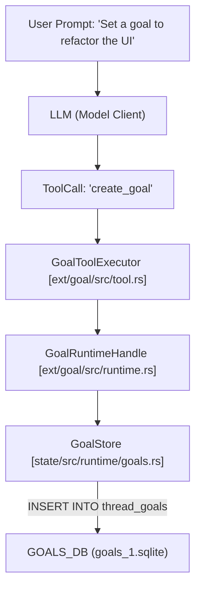
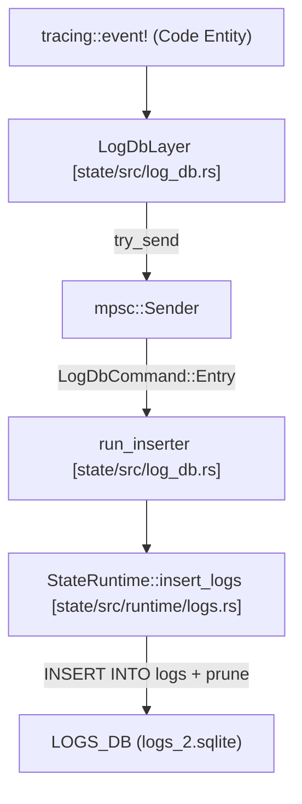

# Goal Extension과 State Runtime

관련 소스 파일

다음 파일들은 이 위키 페이지를 생성하기 위한 컨텍스트로 사용되었습니다.

- [codex-rs/cli/src/state_db_recovery.rs](codex-rs/cli/src/state_db_recovery.rs)
- [codex-rs/core/tests/suite/sqlite_state.rs](codex-rs/core/tests/suite/sqlite_state.rs)
- [codex-rs/ext/goal/BUILD.bazel](codex-rs/ext/goal/BUILD.bazel)
- [codex-rs/ext/goal/Cargo.toml](codex-rs/ext/goal/Cargo.toml)
- [codex-rs/ext/goal/src/accounting.rs](codex-rs/ext/goal/src/accounting.rs)
- [codex-rs/ext/goal/src/api.rs](codex-rs/ext/goal/src/api.rs)
- [codex-rs/ext/goal/src/extension.rs](codex-rs/ext/goal/src/extension.rs)
- [codex-rs/ext/goal/src/lib.rs](codex-rs/ext/goal/src/lib.rs)
- [codex-rs/ext/goal/src/runtime.rs](codex-rs/ext/goal/src/runtime.rs)
- [codex-rs/ext/goal/src/spec.rs](codex-rs/ext/goal/src/spec.rs)
- [codex-rs/ext/goal/src/steering.rs](codex-rs/ext/goal/src/steering.rs)
- [codex-rs/ext/goal/src/tool.rs](codex-rs/ext/goal/src/tool.rs)
- [codex-rs/ext/goal/templates/goals/budget_limit.md](codex-rs/ext/goal/templates/goals/budget_limit.md)
- [codex-rs/ext/goal/templates/goals/continuation.md](codex-rs/ext/goal/templates/goals/continuation.md)
- [codex-rs/ext/goal/templates/goals/objective_updated.md](codex-rs/ext/goal/templates/goals/objective_updated.md)
- [codex-rs/ext/goal/tests/goal_extension_backend.rs](codex-rs/ext/goal/tests/goal_extension_backend.rs)
- [codex-rs/rollout/src/metadata.rs](codex-rs/rollout/src/metadata.rs)
- [codex-rs/rollout/src/state_db.rs](codex-rs/rollout/src/state_db.rs)
- [codex-rs/rollout/src/state_db_tests.rs](codex-rs/rollout/src/state_db_tests.rs)
- [codex-rs/state/Cargo.toml](codex-rs/state/Cargo.toml)
- [codex-rs/state/migrations/0002_logs.sql](codex-rs/state/migrations/0002_logs.sql)
- [codex-rs/state/migrations/0010_logs_process_id.sql](codex-rs/state/migrations/0010_logs_process_id.sql)
- [codex-rs/state/migrations/0023_drop_logs.sql](codex-rs/state/migrations/0023_drop_logs.sql)
- [codex-rs/state/src/bin/logs_client.rs](codex-rs/state/src/bin/logs_client.rs)
- [codex-rs/state/src/lib.rs](codex-rs/state/src/lib.rs)
- [codex-rs/state/src/log_db.rs](codex-rs/state/src/log_db.rs)
- [codex-rs/state/src/log_db_filter_tests.rs](codex-rs/state/src/log_db_filter_tests.rs)
- [codex-rs/state/src/model/log.rs](codex-rs/state/src/model/log.rs)
- [codex-rs/state/src/model/memories.rs](codex-rs/state/src/model/memories.rs)
- [codex-rs/state/src/model/mod.rs](codex-rs/state/src/model/mod.rs)
- [codex-rs/state/src/model/thread_metadata.rs](codex-rs/state/src/model/thread_metadata.rs)
- [codex-rs/state/src/runtime.rs](codex-rs/state/src/runtime.rs)
- [codex-rs/state/src/runtime/agent_jobs.rs](codex-rs/state/src/runtime/agent_jobs.rs)
- [codex-rs/state/src/runtime/backfill.rs](codex-rs/state/src/runtime/backfill.rs)
- [codex-rs/state/src/runtime/goals.rs](codex-rs/state/src/runtime/goals.rs)
- [codex-rs/state/src/runtime/logs.rs](codex-rs/state/src/runtime/logs.rs)
- [codex-rs/state/src/runtime/memories.rs](codex-rs/state/src/runtime/memories.rs)
- [codex-rs/state/src/runtime/threads.rs](codex-rs/state/src/runtime/threads.rs)
- [codex-rs/thread-store/src/local/update_thread_metadata.rs](codex-rs/thread-store/src/local/update_thread_metadata.rs)
- [codex-rs/thread-store/src/thread_metadata_sync.rs](codex-rs/thread-store/src/thread_metadata_sync.rs)
- [codex-rs/tui/src/startup_error.rs](codex-rs/tui/src/startup_error.rs)

Goal Extension과 State Runtime 시스템은 Codex 세션 전반에서 상위 수준 목표, 토큰 budget, 장기 상태를 추적하기 위한 지속적인 메커니즘을 제공합니다. `ext/goal` crate는 goal steering과 accounting 로직을 관리하고, `codex-state`는 goal, log, memory, agent job, remote control enrollment를 위한 SQLite 기반 저장 계층을 제공합니다.

## State Runtime (codex-state)

`StateRuntime`은 시스템의 지속 저장소와 상호작용하기 위한 기본 진입점입니다. lock contention을 최소화하고 생명주기와 목적에 따라 데이터를 구성하기 위해 네 개의 서로 다른 SQLite 데이터베이스 파일을 관리합니다 [codex-rs/state/src/runtime.rs:109-141]().

### 데이터베이스 아키텍처
| 데이터베이스 | 파일명 | 목적 |
| :--- | :--- | :--- |
| **State DB** | `state_5.sqlite` | 스레드 메타데이터, agent job, rollout 추적 [codex-rs/state/src/runtime.rs:109-115](). |
| **Logs DB** | `logs_2.sqlite` | tracing event와 process 수준 log [codex-rs/state/src/runtime.rs:117-123](). |
| **Goals DB** | `goals_1.sqlite` | 지속적인 thread goal과 accounting data [codex-rs/state/src/runtime.rs:125-131](). |
| **Memories DB** | `memories_1.sqlite` | 추출된 memory fragment와 consolidation state [codex-rs/state/src/runtime.rs:133-139](). |

### State 저장과 생명주기
runtime은 `StateRuntime::init`을 통해 초기화되며, 이 함수는 pool을 열고 네 데이터베이스 모두에 migration을 적용합니다 [codex-rs/state/src/runtime.rs:160-173]().

*   **Log 관리**: `LogsDB`는 thread당(또는 threadless log의 경우 process당) log 저장소를 10 MiB 또는 1,000행으로 제한하는 partitioning 전략을 사용합니다 [codex-rs/state/src/runtime.rs:91-92](). pruning은 `prune_logs_after_insert`를 통해 batch insert 후 자동으로 수행됩니다 [codex-rs/state/src/runtime/logs.rs:44-46]().
*   **Memory Store**: 2단계 memory extraction을 관리합니다. `MemoryStore`는 `updated_at_ms`와 `memory_mode`를 기준으로 1단계 extraction을 위한 "stale" thread를 claim합니다 [codex-rs/state/src/runtime/memories.rs:133-152]().
*   **Agent Jobs**: `AgentJob` 및 `AgentJobItem` record를 통해 background task(예: memory consolidation)를 추적합니다 [codex-rs/state/src/runtime.rs:1-7]().
*   **Remote Control**: enrollment state를 관리하기 위해 `RemoteControlEnrollmentRecord`를 저장합니다 [codex-rs/state/src/runtime.rs:82]().

**출처:** [codex-rs/state/src/runtime.rs:1-160](), [codex-rs/state/src/runtime/logs.rs:1-100](), [codex-rs/state/src/runtime/memories.rs:1-166](), [codex-rs/state/src/lib.rs:87-90]()

---

## Goal Extension (ext/goal)

`GoalExtension`은 핵심 에이전트의 실행 루프에 hook하기 위해 `ThreadLifecycleContributor`와 `TurnLifecycleContributor` trait를 구현합니다 [codex-rs/ext/goal/src/extension.rs:98-176](). goal이 업데이트되거나 재개되거나 budget limit에 가까워질 때 prompt를 주입함으로써 "steering"을 제공합니다.

### Goal Accounting과 Steering
Goal은 `token_budget` 대비 `tokens_used`와 `time_used_seconds`를 추적합니다 [codex-rs/state/src/runtime/goals.rs:52-54]().

1.  **Thread 초기화**: `on_thread_start` 중 extension은 `GoalAccountingState`를 초기화하고 `GoalRuntimeHandle`을 등록합니다 [codex-rs/ext/goal/src/extension.rs:113-135]().
2.  **Turn 시작**: `on_turn_start` 중 baseline token usage를 캡처하고 accounting state에 turn ID를 표시합니다 [codex-rs/ext/goal/src/extension.rs:197-210]().
3.  **Steering 주입**: goal이 활성 상태이면 에이전트가 집중을 유지하도록 `continuation_steering_item` 또는 `objective_updated_steering_item`을 모델 컨텍스트에 주입할 수 있습니다 [codex-rs/ext/goal/src/steering.rs:37-47]().
4.  **Budget 강제**: budget에 도달하면 goal status가 `BudgetLimited`로 전환되고, 모델에 알리기 위해 `budget_limit_steering_item` prompt가 주입됩니다 [codex-rs/ext/goal/src/steering.rs:80-99]().

### Goal 도구
extension은 모델이 자체 목표를 관리할 수 있도록 도구를 노출합니다.
*   `create_goal`: thread를 위한 새 objective와 budget을 초기화합니다 [codex-rs/ext/goal/tests/goal_extension_backend.rs:54-62]().
*   `update_goal`: 현재 objective 또는 status를 수정합니다(예: `complete`로 표시) [codex-rs/ext/goal/src/extension.rs:44]().

**출처:** [codex-rs/ext/goal/src/extension.rs:1-210](), [codex-rs/ext/goal/src/runtime.rs:1-100](), [codex-rs/ext/goal/src/steering.rs:1-54](), [codex-rs/state/src/runtime/goals.rs:183-211]()

---

## 데이터 흐름: 자연어에서 코드 엔티티 공간으로

다음 다이어그램은 사용자 동작과 시스템 이벤트가 코드 엔티티와 데이터베이스 지속성으로 변환되는 방식을 보여 줍니다.

### Goal 생성 흐름

**출처:** [codex-rs/ext/goal/src/tool.rs:1-50](), [codex-rs/ext/goal/src/runtime.rs:81-104](), [codex-rs/state/src/runtime/goals.rs:125-147]()

### Log Ingestion 흐름
이 다이어그램은 system log가 code-level tracing event에서 SQLite runtime으로 이동하는 방식을 보여 줍니다.

**출처:** [codex-rs/state/src/log_db.rs:112-140](), [codex-rs/state/src/runtime/logs.rs:11-47]()

---

## 주요 구조체와 함수

### Goal 관리(ext/goal)
| 엔티티 | 위치 | 역할 |
| :--- | :--- | :--- |
| `GoalAccountingState` | [codex-rs/ext/goal/src/accounting.rs]() | 현재 turn ID와 token baseline을 추적하는 in-memory state입니다. |
| `GoalRuntimeHandle` | [codex-rs/ext/goal/src/runtime.rs:24-26]() | goal lifecycle, steering, accounting을 관리하기 위한 extension-side handle입니다. |
| `GoalService` | [codex-rs/ext/goal/src/api.rs]() | `GoalRuntimeHandle` instance를 등록하고 조회하기 위한 global service입니다. |
| `GoalUpdate` | [codex-rs/state/src/runtime/goals.rs:20-25]() | objective, status, budget 업데이트를 정의하는 구조체입니다. |

### Storage 모델(codex-state)
| Struct | 위치 | 설명 |
| :--- | :--- | :--- |
| `ThreadGoal` | [codex-rs/state/src/lib.rs:49]() | goal(objective, status, budget)의 protocol representation입니다. |
| `LogEntry` | [codex-rs/state/src/model/log.rs:5-17]() | persistence 전의 in-memory log record입니다. |
| `LogRow` | [codex-rs/state/src/model/log.rs:20-31]() | queried log를 위한 database row representation입니다. |
| `Stage1Output` | [codex-rs/state/src/model/memories.rs]() | memory extraction 1단계의 결과입니다. |

### Core 로직 함수
*   **`StateRuntime::init`**: `STATE_DB`, `LOGS_DB`, `GOALS_DB`, `MEMORIES_DB`를 열고 migrate합니다 [codex-rs/state/src/runtime.rs:184-230]().
*   **`GoalStore::update_thread_goal`**: goal status 업데이트와 budget limit 강제를 위한 SQL 로직을 실행합니다 [codex-rs/state/src/runtime/goals.rs:183-211]().
*   **`MemoryStore::claim_stage1_jobs_for_startup`**: system boot 중 age와 activity를 기준으로 memory extraction이 필요한 thread를 식별합니다 [codex-rs/state/src/runtime/memories.rs:148-170]().
*   **`LogDbLayer::start`**: background inserter를 초기화하고 tracing `Layer`를 반환합니다 [codex-rs/state/src/log_db.rs:113-128]().

**출처:** [codex-rs/state/src/runtime.rs:1-160](), [codex-rs/ext/goal/src/runtime.rs:1-150](), [codex-rs/state/src/runtime/goals.rs:1-200]()
