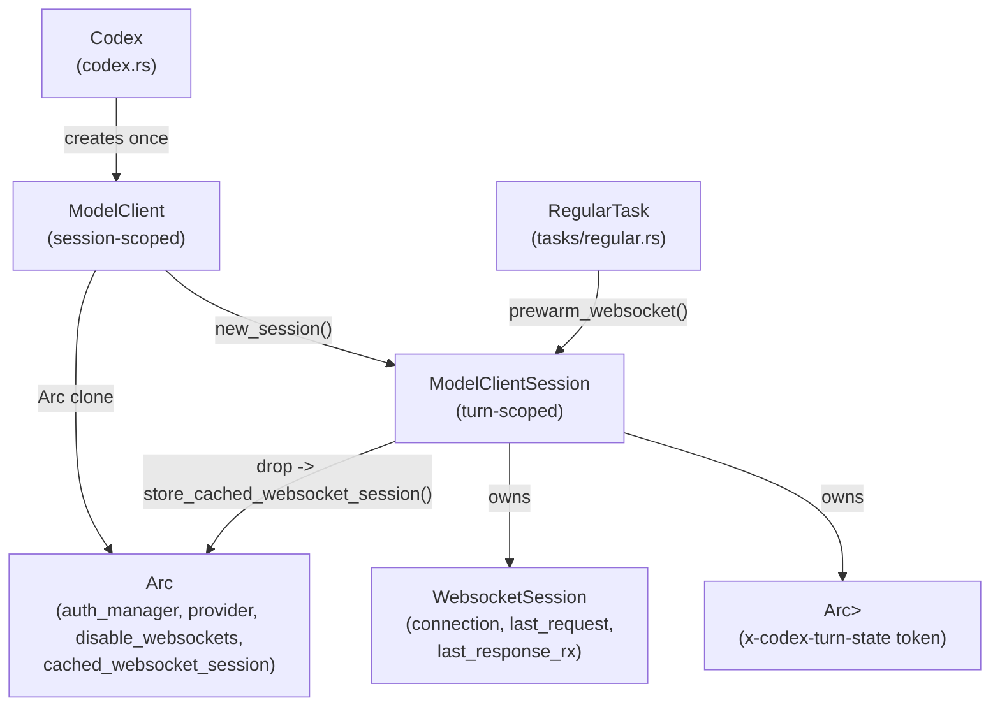
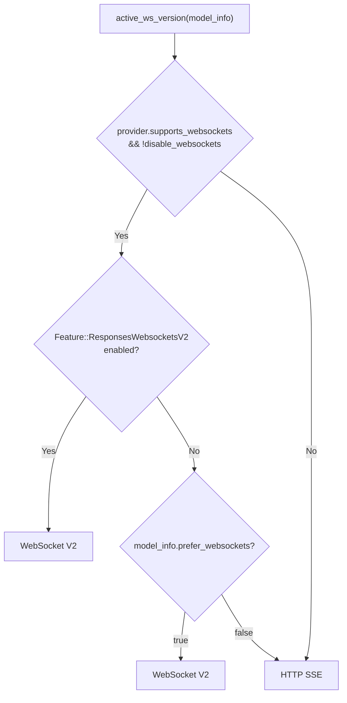
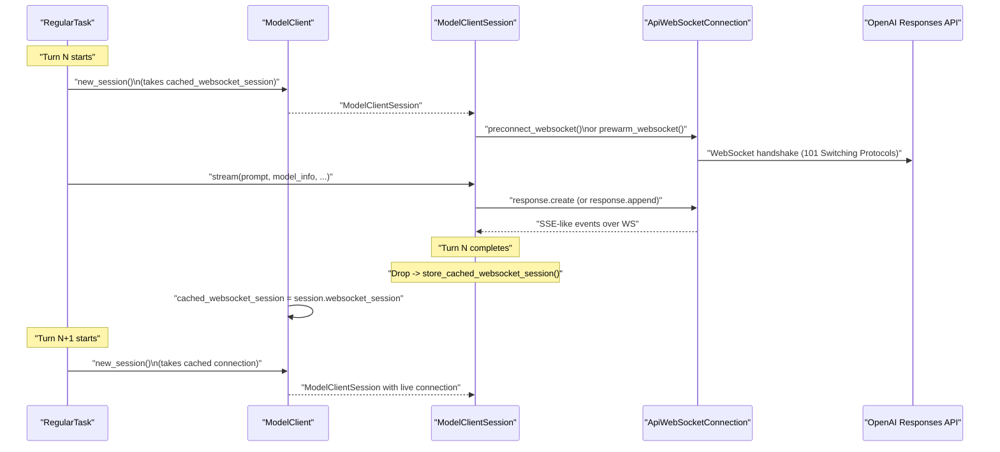
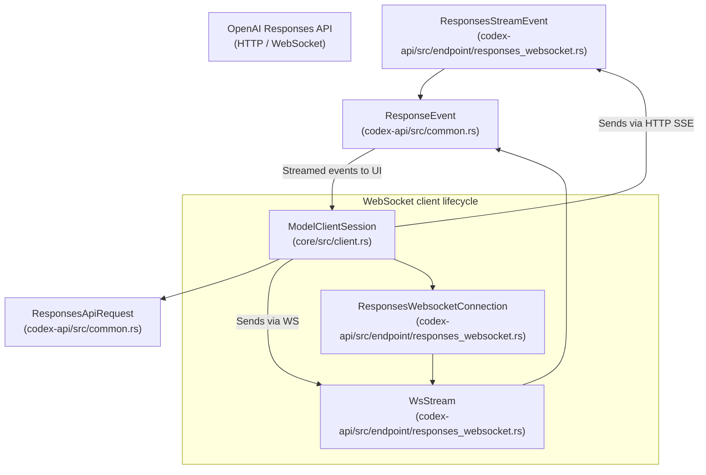

# 모델 클라이언트와 API 통신

<details>
<summary>관련 소스 파일</summary>

다음 파일들은 이 위키 페이지를 생성하기 위한 컨텍스트로 사용되었습니다.

- [codex-rs/app-server/tests/common/models_cache.rs](codex-rs/app-server/tests/common/models_cache.rs)
- [codex-rs/app-server/tests/suite/v2/client_metadata.rs](codex-rs/app-server/tests/suite/v2/client_metadata.rs)
- [codex-rs/codex-api/src/common.rs](codex-rs/codex-api/src/common.rs)
- [codex-rs/codex-api/src/endpoint/responses_websocket.rs](codex-rs/codex-api/src/endpoint/responses_websocket.rs)
- [codex-rs/codex-api/src/lib.rs](codex-rs/codex-api/src/lib.rs)
- [codex-rs/codex-api/src/sse/responses.rs](codex-rs/codex-api/src/sse/responses.rs)
- [codex-rs/codex-api/tests/models_integration.rs](codex-rs/codex-api/tests/models_integration.rs)
- [codex-rs/core/src/client.rs](codex-rs/core/src/client.rs)
- [codex-rs/core/src/client_common.rs](codex-rs/core/src/client_common.rs)
- [codex-rs/core/src/sandbox_tags.rs](codex-rs/core/src/sandbox_tags.rs)
- [codex-rs/core/src/sandbox_tags_tests.rs](codex-rs/core/src/sandbox_tags_tests.rs)
- [codex-rs/core/src/turn_metadata.rs](codex-rs/core/src/turn_metadata.rs)
- [codex-rs/core/src/turn_metadata_tests.rs](codex-rs/core/src/turn_metadata_tests.rs)
- [codex-rs/core/tests/common/responses.rs](codex-rs/core/tests/common/responses.rs)
- [codex-rs/core/tests/responses_headers.rs](codex-rs/core/tests/responses_headers.rs)
- [codex-rs/core/tests/suite/client.rs](codex-rs/core/tests/suite/client.rs)
- [codex-rs/core/tests/suite/client_websockets.rs](codex-rs/core/tests/suite/client_websockets.rs)
- [codex-rs/core/tests/suite/model_switching.rs](codex-rs/core/tests/suite/model_switching.rs)
- [codex-rs/core/tests/suite/models_cache_ttl.rs](codex-rs/core/tests/suite/models_cache_ttl.rs)
- [codex-rs/core/tests/suite/personality.rs](codex-rs/core/tests/suite/personality.rs)
- [codex-rs/core/tests/suite/remote_models.rs](codex-rs/core/tests/suite/remote_models.rs)
- [codex-rs/core/tests/suite/rmcp_client.rs](codex-rs/core/tests/suite/rmcp_client.rs)
- [codex-rs/core/tests/suite/spawn_agent_description.rs](codex-rs/core/tests/suite/spawn_agent_description.rs)
- [codex-rs/core/tests/suite/truncation.rs](codex-rs/core/tests/suite/truncation.rs)
- [codex-rs/core/tests/suite/user_shell_cmd.rs](codex-rs/core/tests/suite/user_shell_cmd.rs)
- [codex-rs/core/tests/suite/view_image.rs](codex-rs/core/tests/suite/view_image.rs)
- [codex-rs/models-manager/src/model_info.rs](codex-rs/models-manager/src/model_info.rs)
- [codex-rs/protocol/src/openai_models.rs](codex-rs/protocol/src/openai_models.rs)

</details>


이 페이지는 `codex-core` crate가 모델 provider API에 대한 요청을 구성하고 전송하는 방식을 문서화합니다. 세션 범위의 `ModelClient`와 턴 범위의 `ModelClientSession` 설계 및 구현을 다루고, WebSocket과 HTTP SSE 사이의 transport 선택, 연결 재사용 전략, sticky-routing token, prewarm 메커니즘, fallback retry 로직을 설명합니다.

프롬프트 구성과 이벤트 처리에 대한 보완 정보는 [Turn Execution and Prompt Construction (3.3)]() 및 [Event Processing and State Management (3.4)]() 페이지를 참조하세요.

---

## 주요 타입

| 타입                   | 범위             | 파일                          | 역할                                                                |
|------------------------|-------------------|-------------------------------|-------------------------------------------------------------------|
| `ModelClient`          | 세션           | `core/src/client.rs`           | 공유 설정, 인증, transport fallback 상태                      |
| `ModelClientState`     | 세션(내부)   | `core/src/client.rs`           | `ModelClient` 뒤의 `Arc` 공유 내부 상태                  |
| `ModelClientSession`   | 턴              | `core/src/client.rs`           | 턴별 스트리밍 클라이언트. WS 연결과 sticky token 관리  |
| `WebsocketSession`     | 턴(내부)      | `core/src/client.rs`           | 활성 WS 연결 상태와 append 작업용 마지막 요청    |
| `Prompt`               | 턴              | `core/src/client_common.rs`    | 각 턴마다 조립되는 API 요청 payload                            |
| `ResponsesApiRequest`  | Wire(HTTP/WS)    | `codex-api/src/common.rs` | Responses API용 직렬화된 JSON 요청 형식                  |
| `ResponseEvent`        | 스트림 항목       | `codex-api/src/common.rs` | SSE 또는 WS 스트림에서 파싱된 증분 이벤트                   |
| `ResponseStream`       | 스트림            | `core/src/client_common.rs`    | `ResponseEvent`의 래핑된 비동기 스트림                     |

출처: [codex-rs/core/src/client.rs:146-212](), [codex-rs/core/src/client_common.rs:17-38](), [codex-rs/core/src/client_common.rs:128-133](), [codex-rs/codex-api/src/common.rs:1-2]()

---

## 소유권과 수명 다이어그램

**타입 수명과 소유권 관계**



이 다이어그램은 `ModelClient`가 Codex 세션마다 한 번 생성되며, 내부적으로 `Arc`를 통해 `ModelClientState`를 공유한다는 것을 보여줍니다. 각 턴은 `ModelClientSession`을 생성하고, 이 세션은 활성 WebSocket 세션과 턴 범위 sticky-routing 상태를 모두 소유합니다. 세션이 drop되면 WebSocket 연결은 이후 턴에서 재사용할 수 있도록 공유 cache로 반환됩니다.

출처: [codex-rs/core/src/client.rs:146-212](), [codex-rs/core/src/client.rs:499-505]()

---

## `ModelClient`: 세션 범위 상태

`ModelClient`는 전체 Codex 세션 동안 안정적으로 유지되는 설정과 상태를 보유하는 최상위 API 클라이언트입니다. 내부적으로 `Arc<ModelClientState>`를 감싸므로 clone 비용이 낮습니다 [codex-rs/core/src/client.rs:169-173]().

`ModelClientState` 내부의 주요 필드:

- **`auth_manager: Option<Arc<AuthManager>>`**  
  선택된 모델 provider(예: OpenAI 또는 custom provider)에 대한 인증 흐름과 token 관리를 처리합니다 [codex-rs/core/src/client.rs:162]().

- **`conversation_id: ThreadId`**  
  대화를 고유하게 식별하며, API 요청의 `session_id` 헤더 및 기타 metadata 헤더에 포함됩니다 [codex-rs/core/src/client.rs:152]().

- **`provider: SharedModelProvider`**  
  base URL, 지원되는 wire API(Responses API), retry limit, header 같은 provider metadata를 포함합니다 [codex-rs/core/src/client.rs:155]().

- **`session_source: SessionSource`**  
  세션의 출처(예: "review" subagent)를 인코딩하며, `x-openai-subagent` HTTP 헤더에 사용됩니다 [codex-rs/core/src/client.rs:157]().

- **`disable_websockets: AtomicBool`**  
  WebSocket이 실패하거나 비활성화된 경우 HTTP SSE transport로 영구 fallback하는 것을 제어합니다 [codex-rs/core/src/client.rs:164]().

- **`cached_websocket_session: StdMutex<Option<WebsocketSession>>`**  
  턴 사이에서 재사용하고 handshake overhead를 줄이기 위해 열린 WebSocket 연결을 cache하는 크기 1의 pool입니다 [codex-rs/core/src/client.rs:165]().

생성자 `ModelClient::new()`는 세션 설정과 인증에서 이러한 필드를 조립하여 `ModelClientState`를 생성합니다 [codex-rs/core/src/client.rs:222-258]().

`ModelClient::new_session()`은 새 턴별 범위의 `ModelClientSession`을 생성합니다. cache된 WebSocket 연결이 있으면 원자적으로 소유권을 가져옵니다. 그렇지 않으면 세션은 기존 WS 연결 없이 시작됩니다 [codex-rs/core/src/client.rs:260-288]().

출처: [codex-rs/core/src/client.rs:146-288]()

---

## `ModelClientSession`: 턴 범위 상태

`ModelClientSession`은 단일 Codex 턴의 지속 시간 동안만 존재합니다. HTTP 또는 WebSocket을 통해 해당 턴의 하나 이상의 payload를 스트리밍하는 책임을 집니다.

**필드:**

| 필드           | 타입                    | 목적                                                        |
|-----------------|-------------------------|----------------------------------------------------------------|
| `client`        | `ModelClient`            | 지속 상태가 있는 공유 세션 범위 클라이언트             |
| `websocket_session` | `Option<WebsocketSession>` | 선택적 활성 WS 연결, 마지막 요청, completion token |
| `turn_state`    | `Arc<OnceLock<String>>`  | `x-codex-turn-state` 헤더에 저장되는 sticky routing token  |

`WebsocketSession` 구조체는 다음을 보유합니다.

- `connection: ApiWebSocketConnection` — 활성 WS 스트림 [codex-rs/core/src/client.rs:205]().
- `last_request: Option<ResponsesApiRequest>` — 증분 업데이트 계산을 위해 마지막으로 전송된 전체 요청 [codex-rs/core/src/client.rs:206]().
- `last_response_rx: Option<oneshot::Receiver<LastResponse>>` — 마지막 응답의 completion token receiver 채널 [codex-rs/core/src/client.rs:207]().

`ModelClientSession`의 핵심 생명주기 책임은 drop 시 `WebsocketSession`을 공유 cache에 다시 저장하여 기존 WebSocket 연결을 효율적으로 재사용할 수 있게 하는 것입니다 [codex-rs/core/src/client.rs:499-505]().

출처: [codex-rs/core/src/client.rs:191-212](), [codex-rs/core/src/client.rs:499-505]()

---

## Transport 선택 로직

스트리밍 요청의 transport 방식은 provider 기능, 기능 플래그, 클라이언트 측 설정에 따라 달라집니다. 이는 사용할 transport를 나타내는 enum을 반환하는 `ModelClient::active_ws_version()`에 캡슐화되어 있습니다 [codex-rs/core/src/client.rs:401-413]().

**Transport 결정 흐름:**



- 모델 provider가 WebSocket을 지원하지 않거나 클라이언트 fallback 상태에 의해 WebSocket이 비활성화된 경우 HTTP SSE transport로 fallback합니다 [codex-rs/core/src/client.rs:403]().
- Codex 기능 플래그 `ResponsesWebsocketsV2`가 활성화되어 있으면 v2 WebSocket transport를 사용합니다 [codex-rs/core/src/client.rs:408]().
- 그렇지 않으면 WebSocket 또는 HTTP에 대한 모델 자체 선호(`model_info.prefer_websockets`)를 따릅니다 [codex-rs/core/src/client.rs:410]().

출처: [codex-rs/core/src/client.rs:401-413](), [codex-rs/core/src/client.rs:149-164]()

---

## 턴 간 WebSocket 연결 생명주기

**시퀀스: WebSocket 연결 열기, 재사용, 닫기**



- `RegularTask`(Codex 턴 runner)는 `ModelClient::new_session()`을 호출하여 새 턴을 시작합니다.
- 이 호출은 사용 가능한 경우 cache된 열린 WS 연결을 가져옵니다 [codex-rs/core/src/client.rs:271]().
- 세션은 프롬프트를 스트리밍하기 전에 선택적으로 WS 연결을 preconnect하거나 prewarm합니다 [codex-rs/core/src/client.rs:735]().
- 스트리밍 중 세션은 전체 `response.create` 또는 증분 업데이트 `response.append`를 전송합니다 [codex-rs/core/src/client.rs:658]().
- 턴이 완료되면 세션 drop 시 다음 턴에서 재사용할 수 있도록 WS 연결이 cache에 저장됩니다 [codex-rs/core/src/client.rs:499-505]().

출처: [codex-rs/core/src/client.rs:260-290](), [codex-rs/core/src/client.rs:499-505](), [codex-rs/core/src/client.rs:735-777]()

---

## `x-codex-turn-state`를 사용한 Sticky Routing

Codex는 `x-codex-turn-state` 헤더를 사용해 턴별 sticky routing을 구현합니다.

- 서버는 stream response 중 `x-codex-turn-state` 응답 헤더에 sticky token을 반환합니다 [codex-rs/codex-api/src/endpoint/responses_websocket.rs:155]().
- 클라이언트는 이 token을 `Arc<OnceLock<String>>`(`ModelClientSession`의 `turn_state`)에 cache합니다 [codex-rs/core/src/client.rs:194]().
- 같은 턴 안의 후속 요청은 backend affinity를 가능하게 하기 위해 이 token을 `x-codex-turn-state` 요청 헤더에 다시 담아 보냅니다 [codex-rs/core/src/client.rs:596]().

**관련 header 상수:**

| 상수                     | Header 값                     | 정의 위치                  |
|------------------------------|---------------------------------|------------------------------------|
| `X_CODEX_TURN_STATE_HEADER`  | `"x-codex-turn-state"`           | `core/src/client.rs:135`            |
| `X_CODEX_TURN_METADATA_HEADER`| `"x-codex-turn-metadata"`       | `core/src/client.rs:136`            |
| `OPENAI_BETA_HEADER`          | `"OpenAI-Beta"`                  | `core/src/client.rs:133`            |
| `RESPONSES_WEBSOCKETS_V2_BETA_HEADER_VALUE` | `"responses_websockets=2026-02-06"` | `core/src/client.rs:147`  |

출처: [codex-rs/core/src/client.rs:133-147](), [codex-rs/codex-api/src/endpoint/responses_websocket.rs:155]()

---

## 요청 구성

`ModelClientSession::build_responses_request()`는 모든 Requests API 호출에 사용되는 `ResponsesApiRequest` 구조체를 빌드합니다 [codex-rs/core/src/client.rs:517-582]().

요청 컴포넌트:

| 필드              | 채워지는 출처                                   | 참고                                                             |
|--------------------|-------------------------------------------------|------------------------------------------------------------------|
| `model`            | `model_info.slug`                                | 모든 요청에 사용되는 모델 식별자                            |
| `instructions`     | `prompt.base_instructions`                       | 기본 지시와 시스템 컨텍스트                            |
| `input`            | `prompt.get_formatted_input()`                    | 이전 출력을 포함하는 평탄화 및 재포맷된 input items    |
| `tools`            | `create_tools_json_for_responses_api(&prompt.tools)` | 모델에 전달되는 직렬화된 tool specs                                |
| `parallel_tool_calls` | `prompt.parallel_tool_calls`                    | 도구의 병렬 호출 허용 여부                  |
| `reasoning`        | reasoning config(`effort` 및 `summary`)에서 구성 | 선택적 reasoning 매개변수                                    |
| `stream`           | `true`                                            | 요청 스트리밍 모드                                           |
| `text`             | verbosity 또는 response schema가 있는 `TextControls`| verbosity 또는 JSON schema 출력을 제어                         |

출처: [codex-rs/core/src/client.rs:517-582](), [codex-rs/core/src/client_common.rs:57-87]()

---

## Prewarm 메커니즘

WebSocket handshake와 backend cold start로 인한 지연을 줄이기 위해 Codex는 두 가지 별개의 WebSocket 연결 prewarm을 구현합니다.

### 1. 연결 Prewarm

- `ModelClientSession::preconnect_websocket()`은 WebSocket handshake를 열고 요청 payload를 보내지 않은 채 연결을 유지합니다 [codex-rs/core/src/client.rs:735-777]().

### 2. 요청 Prewarm(v2 전용)

- `ModelClientSession::prewarm_websocket()`은 `generate=false` 플래그가 있는 `response.create` 요청을 보냅니다 [codex-rs/core/src/client.rs:700-734]().

서버는 초기 `response_id`로 응답하지만 content generation은 수행하지 않습니다. 이는 `previous_response_id`를 재사용하여 같은 연결에서 이후 스트리밍을 더 빠르게 수행할 수 있도록 backend cache를 준비합니다.

출처: [codex-rs/core/src/client.rs:700-777]()

---

## Input Item의 증분 Append

단일 Codex 턴 안에서 tool call output은 HTTP/WS Requests API의 `previous_response_id` 필드를 사용해 delta input item만 전송하는 방식으로 모델에 증분 반환됩니다.

`ModelClientSession::prepare_websocket_request()`는 다음 중 하나를 빌드합니다.

- 첫 chunk를 위한 전체 `response.create` 요청, 또는
- 턴 안의 후속 chunk를 위한 `previous_response_id`와 delta `input`을 지정하는 증분 업데이트 `response.create` [codex-rs/core/src/client.rs:658-698]().

`get_incremental_items(last_request, new_request)` 함수는 새 요청의 input이 이전 input의 적절한 확장인지 검증하여 delta input item을 계산합니다 [codex-rs/core/src/client.rs:610-646]().

출처: [codex-rs/core/src/client.rs:610-698]()

---

## HTTP SSE Fallback과 Retry 로직

WebSocket fallback은 *세션 범위*의 영구 상태입니다.

WebSocket 사용이 심각하게 실패하면(예: handshake error, stream retry 소진) `ModelClientSession::activate_http_fallback()`이 공유 `ModelClientState`의 `disable_websockets`를 원자적으로 `true`로 설정합니다 [codex-rs/core/src/client.rs:508-515]().

- 이는 transport를 HTTP SSE로 전환하여 이후 모든 WebSocket 시도를 억제합니다.
- WebSocket fallback은 전체 Codex 세션 동안 *sticky*하게 유지됩니다.

Fallback trigger:

- 연결 중 WebSocket handshake 실패 또는 transport error [codex-rs/core/src/client.rs:428-435]().

출처: [codex-rs/core/src/client.rs:508-515](), [codex-rs/core/src/client.rs:428-435]()

---

## Unary API 호출(Non-Streaming)

스트리밍 응답 외에도 `ModelClient`는 대화 history compaction 및 memory summarization 같은 백그라운드 작업에서 사용되는 unary API 호출을 지원합니다.

| 메서드                        | 목적                                                | 사용하는 API Client          | Endpoint                         |
|-------------------------------|-------------------------------------------------------|-------------------------|---------------------------------|
| `compact_conversation_history` | 대화 history를 줄이기 위해 compaction subsystem에서 호출 | `ApiCompactClient`      | `/responses/compact`          |
| `summarize_memories`           | 수집된 memory를 요약하기 위해 memory pipeline에서 호출 | `ApiMemoriesClient`      | `/memories/trace_summarize`  |

이 메서드들은 HTTP 기반 `ReqwestTransport` 클라이언트를 사용하고, 적절한 request struct를 빌드하며, `map_api_error`를 통해 API error를 처리합니다 [codex-rs/core/src/client.rs:289-393]().

출처: [codex-rs/core/src/client.rs:289-393]()

---

## 자연어 영역을 코드 엔티티 영역에 연결하기

### 모델 클라이언트와 턴 상호작용 매핑

```mermaid
graph TD
  NLSession["Codex Session (Natural Language)"]
  NLTurn["Agent Turn / Interaction"]

  MC["ModelClient\n(core/src/client.rs)"]
  MCS["ModelClientSession\n(core/src/client.rs)"]
  WSConn["WebsocketSession\n(core/src/client.rs)"]
  Prompt["Prompt object\n(core/src/client_common.rs)"]
  ResponseStream["ResponseStream\n(core/src/client_common.rs)"]

  NLSession --> MC
  MC -->|new_session()| MCS
  MCS -->|owns| WSConn
  MCS -->|build_responses_request(prompt)| Prompt
  MCS -->|stream(...)| ResponseStream

  Note[Note: ModelClient is session-scoped;\nModelClientSession is per turn.]
```

출처: [codex-rs/core/src/client.rs:146-212](), [codex-rs/core/src/client_common.rs:17-38]()

### Transport 계층과 API Wire Format 매핑



출처: [codex-rs/codex-api/src/endpoint/responses_websocket.rs:51-148](), [codex-rs/core/src/client.rs:191-212]()
