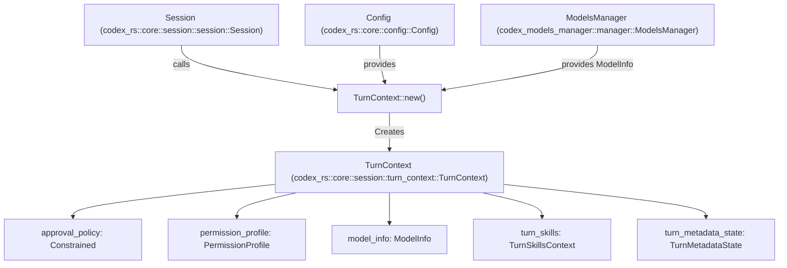
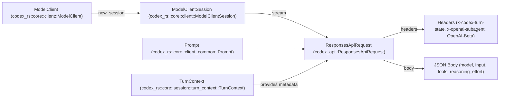

# 턴 실행과 프롬프트 구성

관련 소스 파일

다음 파일들은 이 위키 페이지를 생성하기 위한 컨텍스트로 사용되었습니다.

- [codex-rs/app-server/tests/suite/v2/client_metadata.rs](codex-rs/app-server/tests/suite/v2/client_metadata.rs)
- [codex-rs/codex-api/src/common.rs](codex-rs/codex-api/src/common.rs)
- [codex-rs/codex-api/src/endpoint/responses_websocket.rs](codex-rs/codex-api/src/endpoint/responses_websocket.rs)
- [codex-rs/codex-api/src/lib.rs](codex-rs/codex-api/src/lib.rs)
- [codex-rs/codex-api/src/sse/responses.rs](codex-rs/codex-api/src/sse/responses.rs)
- [codex-rs/core/src/client.rs](codex-rs/core/src/client.rs)
- [codex-rs/core/src/client_common.rs](codex-rs/core/src/client_common.rs)
- [codex-rs/core/src/codex_thread.rs](codex-rs/core/src/codex_thread.rs)
- [codex-rs/core/src/context_manager/updates.rs](codex-rs/core/src/context_manager/updates.rs)
- [codex-rs/core/src/sandbox_tags.rs](codex-rs/core/src/sandbox_tags.rs)
- [codex-rs/core/src/sandbox_tags_tests.rs](codex-rs/core/src/sandbox_tags_tests.rs)
- [codex-rs/core/src/session/handlers.rs](codex-rs/core/src/session/handlers.rs)
- [codex-rs/core/src/session/mod.rs](codex-rs/core/src/session/mod.rs)
- [codex-rs/core/src/session/review.rs](codex-rs/core/src/session/review.rs)
- [codex-rs/core/src/session/session.rs](codex-rs/core/src/session/session.rs)
- [codex-rs/core/src/session/tests.rs](codex-rs/core/src/session/tests.rs)
- [codex-rs/core/src/session/turn.rs](codex-rs/core/src/session/turn.rs)
- [codex-rs/core/src/session/turn_context.rs](codex-rs/core/src/session/turn_context.rs)
- [codex-rs/core/src/state/mod.rs](codex-rs/core/src/state/mod.rs)
- [codex-rs/core/src/state/turn.rs](codex-rs/core/src/state/turn.rs)
- [codex-rs/core/src/tasks/compact.rs](codex-rs/core/src/tasks/compact.rs)
- [codex-rs/core/src/tasks/mod.rs](codex-rs/core/src/tasks/mod.rs)
- [codex-rs/core/src/tasks/regular.rs](codex-rs/core/src/tasks/regular.rs)
- [codex-rs/core/src/tasks/review.rs](codex-rs/core/src/tasks/review.rs)
- [codex-rs/core/src/turn_metadata.rs](codex-rs/core/src/turn_metadata.rs)
- [codex-rs/core/src/turn_metadata_tests.rs](codex-rs/core/src/turn_metadata_tests.rs)
- [codex-rs/core/tests/common/Cargo.toml](codex-rs/core/tests/common/Cargo.toml)
- [codex-rs/core/tests/common/lib.rs](codex-rs/core/tests/common/lib.rs)
- [codex-rs/core/tests/common/responses.rs](codex-rs/core/tests/common/responses.rs)
- [codex-rs/core/tests/responses_headers.rs](codex-rs/core/tests/responses_headers.rs)
- [codex-rs/core/tests/suite/client.rs](codex-rs/core/tests/suite/client.rs)
- [codex-rs/core/tests/suite/client_websockets.rs](codex-rs/core/tests/suite/client_websockets.rs)
- [codex-rs/core/tests/suite/codex_delegate.rs](codex-rs/core/tests/suite/codex_delegate.rs)
- [codex-rs/core/tests/suite/collaboration_instructions.rs](codex-rs/core/tests/suite/collaboration_instructions.rs)
- [codex-rs/core/tests/suite/fork_thread.rs](codex-rs/core/tests/suite/fork_thread.rs)
- [codex-rs/core/tests/suite/override_updates.rs](codex-rs/core/tests/suite/override_updates.rs)
- [codex-rs/core/tests/suite/permissions_messages.rs](codex-rs/core/tests/suite/permissions_messages.rs)
- [codex-rs/core/tests/suite/prompt_caching.rs](codex-rs/core/tests/suite/prompt_caching.rs)
- [codex-rs/core/tests/suite/stream_error_allows_next_turn.rs](codex-rs/core/tests/suite/stream_error_allows_next_turn.rs)
- [codex-rs/core/tests/suite/stream_no_completed.rs](codex-rs/core/tests/suite/stream_no_completed.rs)
- [codex-rs/mcp-server/tests/common/Cargo.toml](codex-rs/mcp-server/tests/common/Cargo.toml)
- [codex-rs/mcp-server/tests/common/lib.rs](codex-rs/mcp-server/tests/common/lib.rs)
- [codex-rs/tools/src/tool_config.rs](codex-rs/tools/src/tool_config.rs)
- [codex-rs/tools/src/tool_config_tests.rs](codex-rs/tools/src/tool_config_tests.rs)

이 문서는 Codex가 단일 대화 턴을 구성하고 실행하는 방식을 설명합니다. `TurnContext` 구조체의 구성과 사용, cached prefix와 instruction을 포함한 prompt input 조립, API 요청 옵션과 인증 헤더가 구축되는 방식을 다룹니다. 또한 특정 task를 통한 턴 실행, history 관리, 하위 에이전트 실행 메커니즘도 개괄합니다.

더 넓은 생명주기 이해를 위해 [3.1 Codex Interface and Session Lifecycle](), [3.2 Model Client and API Communication](), [3.4 Event Processing and State Management]()를 참조하세요.

---

## TurnContext: 턴별 설정

Codex의 각 대화 턴은 `TurnContext` 객체로 표현되며, 이 객체는 모든 턴 범위 설정, 정책, metadata, 상태를 캡슐화합니다. 이러한 격리는 턴별 설정(예: 모델 매개변수, 샌드박스 정책, 승인 규칙)이 인접한 턴으로 누출되거나 간섭하지 않도록 보장하여 동시성, 재시도, 일관된 프롬프트 구성을 가능하게 합니다.

### 주요 필드와 역할

| 필드 범주 | 주요 필드 | 설명 |
| ----------- | -------- | ----------- |
| **식별자와 라우팅** | `sub_id`, `session_source`, `trace_id` | 고유 턴 식별자, source(예: CLI, TUI), W3C trace context [codex-rs/core/src/session/turn_context.rs:58-70](). |
| **모델과 Provider** | `model_info`, `provider`, `reasoning_effort`, `reasoning_summary` | 모델 capability와 provider별 설정, reasoning 제어 [codex-rs/core/src/session/turn_context.rs:63-69](). |
| **승인과 보안** | `approval_policy`, `sandbox_policy`, `permission_profile`, `network` | 실행 승인 및 샌드박스 접근 제어 정책 [codex-rs/core/src/session/turn_context.rs:88-90](). |
| **지시와 Personality** | `developer_instructions`, `user_instructions`, `compact_prompt`, `personality` | 시스템 프롬프트, developer/user instruction, personality schema [codex-rs/core/src/session/turn_context.rs:82-87](). |
| **환경** | `environments`, `timezone`, `current_date` | 다중 환경 선택(예: SSH vs Local)과 시간 컨텍스트 [codex-rs/core/src/session/turn_context.rs:73-80](). |
| **도구** | `dynamic_tools` | MCP 서버에서 추가되는 dynamic tool [codex-rs/core/src/session/turn_context.rs:101](). |
| **Metadata와 상태** | `turn_metadata_state`, `turn_timing_state`, `turn_skills` | 백그라운드 git metadata, timing metric, 턴 범위 skill context [codex-rs/core/src/session/turn_context.rs:102-105](). |

### TurnContext 데이터 흐름

Title: TurnContext Construction and Dependencies

**출처:** [codex-rs/core/src/session/turn_context.rs:57-108](), [codex-rs/core/src/session/session.rs:23-44]()

---

## SessionTask를 통한 턴 실행

턴 실행은 `SessionTask` 구현으로 추상화됩니다. 각 task는 특정 워크플로(예: 일반 채팅 턴, review, history compaction)를 캡슐화합니다.

### SessionTask 생명주기
1.  **종류 식별:** task는 `kind()`를 통해 자신의 타입을 식별합니다(예: `TaskKind::Regular`, `TaskKind::Review`, `TaskKind::Compact`) [codex-rs/core/src/tasks/mod.rs:211]().
2.  **실행:** `run()` 메서드는 `SessionTaskContext`와 `TurnContext`를 통해 이벤트를 스트리밍하며 핵심 로직을 구동합니다 [codex-rs/core/src/tasks/mod.rs:216-224]().
3.  **취소:** task는 graceful interruption과 model abort를 처리하기 위해 `CancellationToken`을 모니터링합니다 [codex-rs/core/src/tasks/mod.rs:216]().

### Task Variant와 로직
-   **RegularTask:** 사용자 상호작용을 위한 표준 루프로, 도구 호출과 모델 응답을 처리합니다 [codex-rs/core/src/tasks/mod.rs:58]().
-   **ReviewTask:** 코드 변경이나 PR을 분석하기 위해 특화된 review prompt를 사용하는 하위 에이전트 대화를 spawn합니다 [codex-rs/core/src/tasks/mod.rs:59]().
-   **CompactTask:** context limit에 가까워질 때 history 크기를 줄이기 위한 summarization 턴을 트리거합니다 [codex-rs/core/src/tasks/mod.rs:57]().
-   **UserShellCommandTask:** 에이전트 환경 안에서 사용자 shell 명령의 직접 실행을 처리합니다 [codex-rs/core/src/tasks/mod.rs:61]().

**출처:** [codex-rs/core/src/tasks/mod.rs:208-224](), [codex-rs/core/src/tasks/mod.rs:57-62]()

---

## 프롬프트 구성과 History 관리

`Prompt` 구조체는 thread history의 transcript를 관리하고 instruction, tool, conversation item을 집계하여 모델이 소비할 수 있도록 준비합니다.

### History 준비
-   **정규화:** 암호화된 inter-agent communication 처리처럼 일관성을 보장하기 위해 history item이 포맷됩니다 [codex-rs/core/src/client_common.rs:58-75]().
-   **Image Detail 제거:** "lite" 요청의 경우 token usage를 줄이기 위해 image detail level이 제거됩니다 [codex-rs/core/src/client_common.rs:77-86]().
-   **토큰 사용량 추적:** Codex는 compaction이 필요한 시점을 결정하기 위해 token usage fact(input, output, reasoning)를 추적합니다 [codex-rs/core/src/tasks/mod.rs:37-49]().

### Prompt 구조
`Prompt` 구조체는 최종 payload를 캡슐화합니다.
-   **Input:** 대화 컨텍스트 input item [codex-rs/core/src/client_common.rs:22]().
-   **Tools:** MCP tool을 포함해 모델에 보이는 `ToolSpec` 객체 [codex-rs/core/src/client_common.rs:26]().
-   **Base Instructions:** 핵심 시스템 instruction [codex-rs/core/src/client_common.rs:31]().
-   **Personality:** 선택적으로 모델의 persona를 지정합니다(예: `Personality` config에서) [codex-rs/core/src/client_common.rs:34]().
-   **Output Schema:** 구조화된 출력을 위한 JSON schema 제약 [codex-rs/core/src/client_common.rs:37-40]().

**출처:** [codex-rs/core/src/client_common.rs:19-55](), [codex-rs/core/src/session/turn.rs:135-160](), [codex-rs/core/src/tasks/mod.rs:37-49]()

---

## Compaction 메커니즘

Codex는 context window가 포화될 때 history compaction 전략을 사용합니다.

### Pre-Sampling Compaction
턴이 시작되기 전에 `run_pre_sampling_compact`가 history 요약이 필요한지 확인합니다 [codex-rs/core/src/session/turn.rs:149]().

### Local vs Remote Compaction
-   **Inline/Local:** 특화된 task를 통해 모델 자체를 사용해 history를 요약합니다 [codex-rs/core/src/session/turn.rs:14]().
-   **Remote:** 지원되는 provider의 경우 Codex는 compaction을 원격 endpoint(`/responses/compact`)에 위임합니다 [codex-rs/core/src/client.rs:151](). 구현은 `should_use_remote_compact_task`를 통해 선택됩니다 [codex-rs/core/src/session/turn.rs:15]().

**출처:** [codex-rs/core/src/session/turn.rs:13-17](), [codex-rs/core/src/session/turn.rs:149-155](), [codex-rs/core/src/client.rs:150-154]()

---

## 요청 옵션과 인증

`ModelClient`와 `ModelClientSession`은 헤더와 affinity를 포함한 API 요청의 물리적 구성을 관리합니다.

### Affinity와 헤더
-   **Sticky Routing:** `x-codex-turn-state` 헤더는 일관된 backend affinity를 보장하기 위해 턴 전반의 sticky routing에 사용됩니다 [codex-rs/core/src/client.rs:13-14](), [codex-rs/core/src/client.rs:135]().
-   **하위 에이전트 식별:** Review 또는 Guardian 같은 하위 에이전트의 요청에는 `x-openai-subagent` 헤더가 포함됩니다 [codex-rs/core/src/client.rs:140]().
-   **Trace Context:** 관측 가능성을 위해 W3C trace context가 헤더를 통해 전파됩니다 [codex-rs/core/src/client.rs:71-72](), [codex-rs/core/src/client.rs:137-138]().
-   **Beta Features:** `OpenAI-Beta` 같은 versioning header는 WebSocket 기반 response(`responses_websockets=2026-02-06`) 같은 특정 기능을 활성화합니다 [codex-rs/core/src/client.rs:133](), [codex-rs/core/src/client.rs:147]().

### 요청 구성 다이어그램

Title: API Request Assembly from Prompt and TurnContext

**출처:** [codex-rs/core/src/client.rs:1-24](), [codex-rs/core/src/client.rs:133-149](), [codex-rs/core/src/session/turn_context.rs:57-108]()
