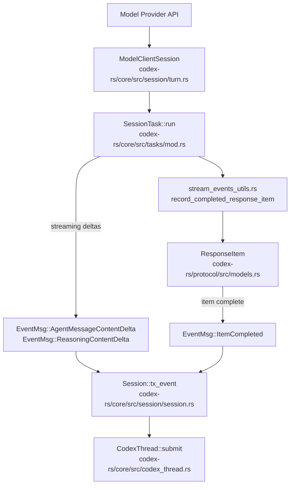
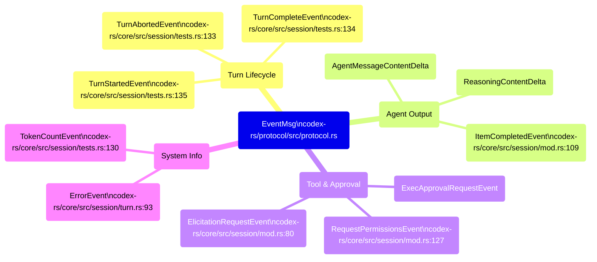
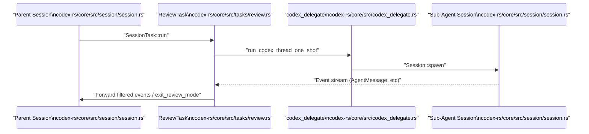

# 이벤트 처리와 상태 관리

관련 소스 파일

다음 파일들은 이 위키 페이지를 생성하기 위한 컨텍스트로 사용되었습니다.

- [codex-rs/app-server/tests/suite/v2/imagegen_extension.rs](codex-rs/app-server/tests/suite/v2/imagegen_extension.rs)
- [codex-rs/core/src/codex_thread.rs](codex-rs/core/src/codex_thread.rs)
- [codex-rs/core/src/context/contextual_user_message.rs](codex-rs/core/src/context/contextual_user_message.rs)
- [codex-rs/core/src/context/contextual_user_message_tests.rs](codex-rs/core/src/context/contextual_user_message_tests.rs)
- [codex-rs/core/src/context/internal_model_context.rs](codex-rs/core/src/context/internal_model_context.rs)
- [codex-rs/core/src/context/mod.rs](codex-rs/core/src/context/mod.rs)
- [codex-rs/core/src/event_mapping.rs](codex-rs/core/src/event_mapping.rs)
- [codex-rs/core/src/event_mapping_tests.rs](codex-rs/core/src/event_mapping_tests.rs)
- [codex-rs/core/src/session/handlers.rs](codex-rs/core/src/session/handlers.rs)
- [codex-rs/core/src/session/mod.rs](codex-rs/core/src/session/mod.rs)
- [codex-rs/core/src/session/review.rs](codex-rs/core/src/session/review.rs)
- [codex-rs/core/src/session/session.rs](codex-rs/core/src/session/session.rs)
- [codex-rs/core/src/session/tests.rs](codex-rs/core/src/session/tests.rs)
- [codex-rs/core/src/session/turn.rs](codex-rs/core/src/session/turn.rs)
- [codex-rs/core/src/session/turn_context.rs](codex-rs/core/src/session/turn_context.rs)
- [codex-rs/core/src/session/turn_tests.rs](codex-rs/core/src/session/turn_tests.rs)
- [codex-rs/core/src/state/mod.rs](codex-rs/core/src/state/mod.rs)
- [codex-rs/core/src/state/turn.rs](codex-rs/core/src/state/turn.rs)
- [codex-rs/core/src/stream_events_utils.rs](codex-rs/core/src/stream_events_utils.rs)
- [codex-rs/core/src/stream_events_utils_tests.rs](codex-rs/core/src/stream_events_utils_tests.rs)
- [codex-rs/core/src/tasks/compact.rs](codex-rs/core/src/tasks/compact.rs)
- [codex-rs/core/src/tasks/mod.rs](codex-rs/core/src/tasks/mod.rs)
- [codex-rs/core/src/tasks/regular.rs](codex-rs/core/src/tasks/regular.rs)
- [codex-rs/core/src/tasks/review.rs](codex-rs/core/src/tasks/review.rs)
- [codex-rs/core/tests/suite/codex_delegate.rs](codex-rs/core/tests/suite/codex_delegate.rs)
- [codex-rs/core/tests/suite/image_rollout.rs](codex-rs/core/tests/suite/image_rollout.rs)
- [codex-rs/core/tests/suite/json_result.rs](codex-rs/core/tests/suite/json_result.rs)
- [codex-rs/core/tests/suite/skills.rs](codex-rs/core/tests/suite/skills.rs)
- [codex-rs/core/tests/suite/tool_parallelism.rs](codex-rs/core/tests/suite/tool_parallelism.rs)
- [codex-rs/ext/image-generation/Cargo.toml](codex-rs/ext/image-generation/Cargo.toml)
- [codex-rs/ext/image-generation/imagegen_description.md](codex-rs/ext/image-generation/imagegen_description.md)
- [codex-rs/ext/image-generation/src/extension.rs](codex-rs/ext/image-generation/src/extension.rs)
- [codex-rs/ext/image-generation/src/tests.rs](codex-rs/ext/image-generation/src/tests.rs)
- [codex-rs/ext/image-generation/src/tool.rs](codex-rs/ext/image-generation/src/tool.rs)
- [codex-rs/tools/src/tool_config.rs](codex-rs/tools/src/tool_config.rs)
- [codex-rs/tools/src/tool_config_tests.rs](codex-rs/tools/src/tool_config_tests.rs)

이 페이지는 핵심 에이전트 시스템이 원시 API 스트리밍 이벤트를 프로토콜 수준의 `EventMsg` variant로 매핑하는 방식, 세션 상태가 턴별 데이터(token usage, rate limit, MCP tool 선택, 대화 history)를 누적하고 업데이트하는 방식, 그리고 각 턴 종료 시 이러한 업데이트가 이후 턴을 위해 세션으로 다시 흘러 들어가는 방식을 문서화합니다.

프로토콜의 `Op` submission 쪽(메시지가 세션 *안으로* 들어가는 방식)은 **2.1 Protocol Layer (Submission/Event System)**을 참조하세요. 대화 history 표현과 truncation은 **3.5 Conversation History Management**를 참조하세요. 스트리밍이 시작되기 전 `RegularTask`가 프롬프트를 조립하는 방식은 **3.3 Turn Execution and Prompt Construction**을 참조하세요.

---

## 이벤트 처리 파이프라인

턴이 실행될 때 모델 provider는 원시 delta를 스트리밍합니다. 턴 runner, 주로 `SessionTask` trait 구현체가 이러한 이벤트를 소비하고 프로토콜 수준 출력으로 매핑합니다. `Codex` 구조체는 `tx_event`를 통해 submission loop와 이벤트 방출을 관리합니다 [codex-rs/core/src/session/session.rs:26-26]().

**API Response-to-EventMsg 파이프라인**

출처: [codex-rs/core/src/session/session.rs:26-26](), [codex-rs/core/src/codex_thread.rs:188-190](), [codex-rs/core/src/stream_events_utils.rs:191-203](), [codex-rs/core/src/session/turn.rs:143-144]()

### 턴 항목 처리와 영속화

모델 출력 항목의 finalization은 스트리밍 턴 상태와 영속 세션 history를 연결하는 utility를 통해 발생합니다.
*   **History 기록**: `record_completed_response_item`은 `record_conversation_items`를 통해 항목을 세션의 대화 history에 영속화합니다 [codex-rs/core/src/stream_events_utils.rs:191-212]().
*   **이미지 생성**: 모델이 이미지를 생성하면 `persist_image_generation_item`이 artifact를 `codex_home` 디렉터리에 저장하고, 저장된 경로로 항목을 업데이트합니다 [codex-rs/core/src/stream_events_utils.rs:130-166]().
*   **Citation**: 시스템은 `strip_hidden_assistant_markup_and_parse_memory_citation`을 사용해 assistant 출력에서 memory citation을 파싱합니다 [codex-rs/core/src/stream_events_utils.rs:79-93]().

출처: [codex-rs/core/src/stream_events_utils.rs:79-212]()

---

## EventMsg Variant 분류

`EventMsg`는 관찰 가능한 모든 상태 변경을 나타내는 주요 discriminated union입니다. protocol crate에 정의되어 있으며, 턴 실행 중 내부 `ResponseEvent` 타입에서 변환됩니다.

**EventMsg Variant 그룹**

출처: [codex-rs/core/src/session/tests.rs:130-135](), [codex-rs/core/src/session/mod.rs:80-127](), [codex-rs/core/src/session/turn.rs:93-99]()

세션 관리 로직에 정의된 주요 이벤트 payload:

| 이벤트 | Payload 컨텍스트 |
| :--- | :--- |
| `TurnStartedEvent` | 모델 상호작용 턴의 시작을 알립니다 [codex-rs/core/src/session/tests.rs:135](). |
| `TurnCompleteEvent` | 턴의 최종 상태와 token usage를 포함합니다 [codex-rs/core/src/session/tests.rs:134](). |
| `TurnAbortedEvent` | `TurnAbortReason`(예: UserInterrupt, Error)을 포함합니다 [codex-rs/core/src/session/mod.rs:118](). |
| `TokenCountEvent` | 세션의 증분 token consumption을 보고합니다 [codex-rs/core/src/session/tests.rs:130](). |

출처: [codex-rs/core/src/session/tests.rs:130-135](), [codex-rs/core/src/session/mod.rs:109-127]()

---

## 세션 상태와 생명주기 관리

`Session` 구조체는 생명주기 동안 에이전트 상태의 주요 컨테이너 역할을 합니다.

### 세션 설정과 상태
`Session`은 영속 데이터와 임시 데이터를 추적합니다 [codex-rs/core/src/session/session.rs:23-44]().
*   **`agent_status`**: 현재 상태(예: Idle, Running, Thinking)를 브로드캐스트하는 `watch::Sender` [codex-rs/core/src/session/session.rs:27-27]().
*   **`active_turn`**: 현재 실행 중인 task와 턴 metadata의 상태를 보호하는 `Mutex<Option<ActiveTurn>>` [codex-rs/core/src/session/session.rs:39-39]().
*   **`input_queue`**: 세션 loop가 처리할 incoming `Op` submission을 버퍼링합니다 [codex-rs/core/src/session/session.rs:40-40]().
*   **`state`**: 핵심 `SessionConfiguration`을 포함하는 `Mutex<SessionState>` [codex-rs/core/src/session/session.rs:29-29]().

### ActiveTurn과 TurnState
`ActiveTurn` 구조체는 단일 모델 턴의 생명주기를 관리합니다 [codex-rs/core/src/state/turn.rs:30-33]().
*   **`RunningTask`**: 활성 workflow의 async task handle과 cancellation token을 캡슐화합니다 [codex-rs/core/src/state/turn.rs:72-83]().
*   **`TurnState`**: `pending_approvals`, `pending_request_permissions`, `token_usage_at_turn_start` 같은 턴 범위 가변 상태를 보유합니다 [codex-rs/core/src/state/turn.rs:87-100]().

출처: [codex-rs/core/src/session/session.rs:23-44](), [codex-rs/core/src/state/turn.rs:30-100]()

---

## 상태 동기화와 다중 에이전트 흐름

시스템은 독립적인 스레드를 spawn하고 parent 세션으로 다시 보고하도록 하여 Reviewer 같은 하위 에이전트를 조정합니다.

**하위 에이전트 Spawn과 이벤트 라우팅(Reviewer 예시)**

출처: [codex-rs/core/src/tasks/review.rs:51-88](), [codex-rs/core/src/tasks/review.rs:124-139](), [codex-rs/core/src/session/session.rs:23-44]()

### 스레드 설정 동기화
스레드 설정이 업데이트될 때(예: 모델이나 승인 정책 변경) `update_thread_settings` handler는 변경 사항을 `SessionState`에 적용하고 `ThreadSettingsApplied` 이벤트를 방출합니다 [codex-rs/core/src/session/handlers.rs:91-105](). 이를 통해 현재 실행 제약에 대해 모델과 UI가 동기화되도록 보장합니다.

### 턴 환경 관리
작업 디렉터리(`cwd`)와 환경 선택을 포함한 턴별 컨텍스트는 `TurnContext` [codex-rs/core/src/session/turn_context.rs:57-108]()를 통해 관리됩니다. `TurnEnvironment` 구조체는 턴에 사용되는 특정 `Environment`와 경로를 추적하며, 이는 도구 호출에서 상대 경로를 해석하는 데 중요합니다 [codex-rs/core/src/session/turn_context.rs:39-44]().

출처: [codex-rs/core/src/session/handlers.rs:91-180](), [codex-rs/core/src/session/turn_context.rs:39-108]()
