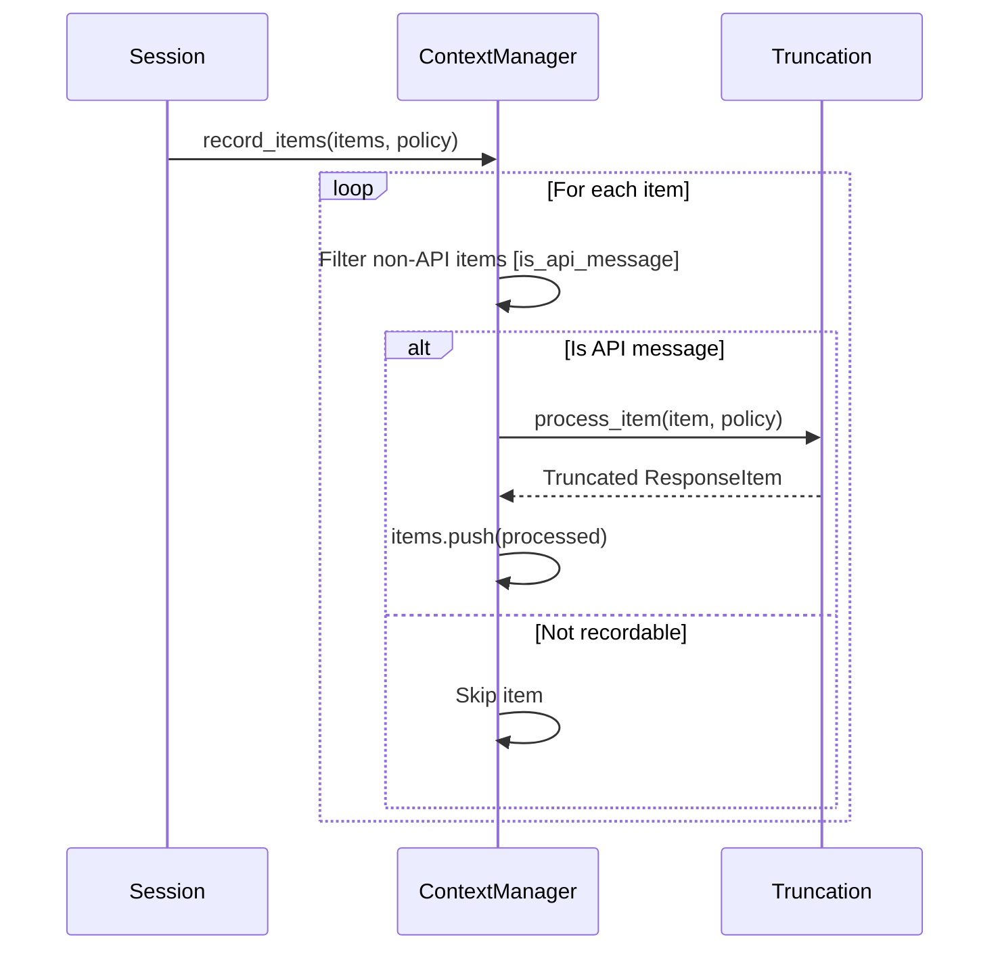
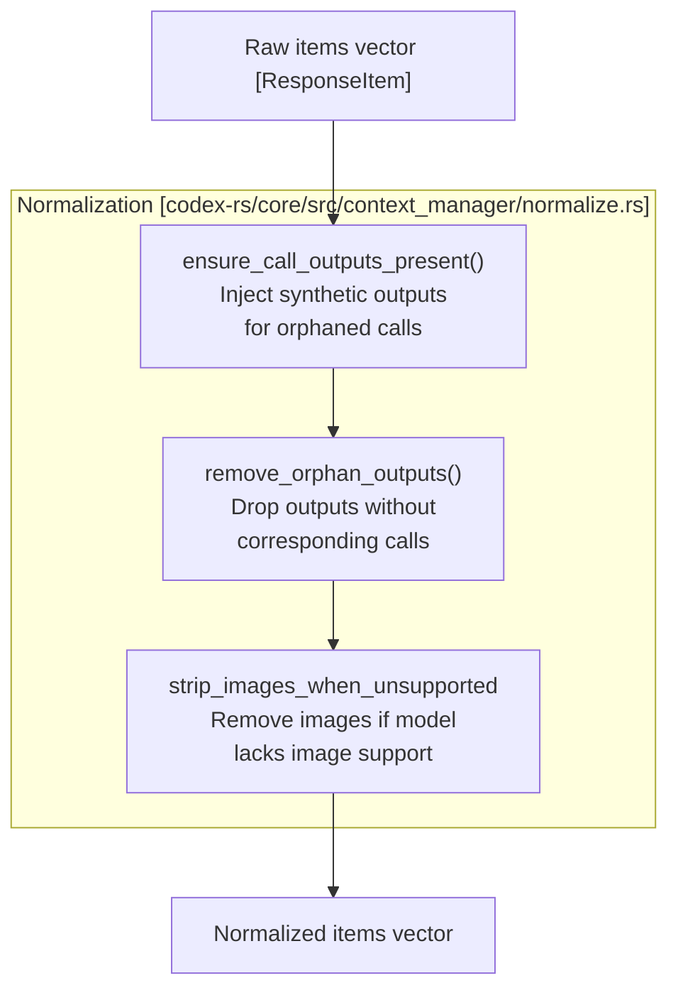

# 대화 History 관리

<details>
<summary>관련 소스 파일</summary>

다음 파일들은 이 위키 페이지를 생성하기 위한 컨텍스트로 사용되었습니다.

- [codex-rs/analytics/Cargo.toml](codex-rs/analytics/Cargo.toml)
- [codex-rs/analytics/src/analytics_client_tests.rs](codex-rs/analytics/src/analytics_client_tests.rs)
- [codex-rs/analytics/src/client.rs](codex-rs/analytics/src/client.rs)
- [codex-rs/analytics/src/events.rs](codex-rs/analytics/src/events.rs)
- [codex-rs/analytics/src/facts.rs](codex-rs/analytics/src/facts.rs)
- [codex-rs/analytics/src/lib.rs](codex-rs/analytics/src/lib.rs)
- [codex-rs/analytics/src/reducer.rs](codex-rs/analytics/src/reducer.rs)
- [codex-rs/core/src/compact.rs](codex-rs/core/src/compact.rs)
- [codex-rs/core/src/compact_remote.rs](codex-rs/core/src/compact_remote.rs)
- [codex-rs/core/src/compact_remote_v2.rs](codex-rs/core/src/compact_remote_v2.rs)
- [codex-rs/core/src/context/environment_context.rs](codex-rs/core/src/context/environment_context.rs)
- [codex-rs/core/src/context/environment_context_tests.rs](codex-rs/core/src/context/environment_context_tests.rs)
- [codex-rs/core/src/context_manager/history.rs](codex-rs/core/src/context_manager/history.rs)
- [codex-rs/core/src/context_manager/history_tests.rs](codex-rs/core/src/context_manager/history_tests.rs)
- [codex-rs/core/src/context_manager/mod.rs](codex-rs/core/src/context_manager/mod.rs)
- [codex-rs/core/src/context_manager/normalize.rs](codex-rs/core/src/context_manager/normalize.rs)
- [codex-rs/core/src/session/rollout_reconstruction_tests.rs](codex-rs/core/src/session/rollout_reconstruction_tests.rs)
- [codex-rs/core/tests/suite/compact.rs](codex-rs/core/tests/suite/compact.rs)
- [codex-rs/core/tests/suite/compact_remote.rs](codex-rs/core/tests/suite/compact_remote.rs)
- [codex-rs/core/tests/suite/compact_resume_fork.rs](codex-rs/core/tests/suite/compact_resume_fork.rs)
- [codex-rs/core/tests/suite/resume_warning.rs](codex-rs/core/tests/suite/resume_warning.rs)
- [codex-rs/core/tests/suite/review.rs](codex-rs/core/tests/suite/review.rs)
- [codex-rs/rollout-trace/src/protocol_event.rs](codex-rs/rollout-trace/src/protocol_event.rs)
- [codex-rs/rollout/src/list.rs](codex-rs/rollout/src/list.rs)
- [codex-rs/rollout/src/policy.rs](codex-rs/rollout/src/policy.rs)
- [codex-rs/rollout/src/recorder.rs](codex-rs/rollout/src/recorder.rs)
- [codex-rs/rollout/src/recorder_tests.rs](codex-rs/rollout/src/recorder_tests.rs)
- [codex-rs/state/src/extract.rs](codex-rs/state/src/extract.rs)
- [codex-rs/thread-store/src/local/archive_thread.rs](codex-rs/thread-store/src/local/archive_thread.rs)
- [codex-rs/thread-store/src/local/list_threads.rs](codex-rs/thread-store/src/local/list_threads.rs)
- [codex-rs/thread-store/src/local/test_support.rs](codex-rs/thread-store/src/local/test_support.rs)
- [codex-rs/thread-store/src/local/unarchive_thread.rs](codex-rs/thread-store/src/local/unarchive_thread.rs)
- [codex-rs/tui/src/chatwidget/snapshots/codex_tui__chatwidget__tests__image_generation_call_history_snapshot.snap](codex-rs/tui/src/chatwidget/snapshots/codex_tui__chatwidget__tests__image_generation_call_history_snapshot.snap)

</details>


이 문서는 Codex가 모델의 context window를 구성하는 대화 history를 유지하고 조작하는 방식을 설명합니다. `ContextManager` 데이터 구조, 항목 기록과 정규화, token estimation, history 생명주기 관리를 다룹니다.

context limit에 가까워질 때 대화 history를 **요약하고 compacting**하는 세부 사항은 [History Compaction System](#3.5.1)을 참조하세요. history를 **디스크에 영속화**하고 세션 재개 중 replay하는 정보는 [Rollout Persistence and Replay](#3.5.2)를 참조하세요.

---

## 개요

대화 history manager는 다음을 담당합니다.

- `ResponseItem` 항목(user message, assistant message, tool call, tool output, reasoning item) 저장 [codex-rs/core/src/context_manager/history.rs:33-36]().
- 모든 tool call에 대응하는 output이 있도록 보장하는 등 invariant를 유지하기 위한 history 정규화 [codex-rs/core/src/context_manager/history.rs:111-114]().
- API 응답의 token usage 추적과 로컬에서 추가된 항목의 token estimation [codex-rs/core/src/context_manager/history.rs:39-39]().
- 항목을 filtering 및 transforming하여 prompt 구성용 history 준비 [codex-rs/core/src/context_manager/history.rs:111-114]().
- removal, replacement, compaction 같은 history 수정 작업 지원 [codex-rs/core/src/context_manager/history.rs:157-172]().

기본 진입점은 `ContextManager` 구조체이며, `Session`이 thread의 transcript를 관리하는 데 사용합니다 [codex-rs/core/src/context_manager/history.rs:34-34]().

**출처:** [codex-rs/core/src/context_manager/history.rs:33-51](), [codex-rs/core/src/context_manager/history.rs:111-114]()

---

## ContextManager 구조

`ContextManager`는 상위 수준 세션 상태와 API 통신에 사용되는 하위 수준 `ResponseItem` 저장소 사이의 브리지 역할을 합니다.

```mermaid
graph TB
    subgraph "ContextManager [codex-rs/core/src/context_manager/history.rs]"
        Items["items: Vec<ResponseItem><br/>(oldest to newest)"]
        TokenInfo["token_info: Option<TokenUsageInfo><br/>API-reported usage"]
        RefContext["reference_context_item:<br/>Option<TurnContextItem><br/>Baseline for settings diffs"]
    end
    
    subgraph "Core Operations"
        Record["record_items()<br/>Add items with truncation"]
        Normalize["normalize_history()<br/>Ensure invariants"]
        ForPrompt["for_prompt()<br/>Prepare for API"]
        Estimate["estimate_token_count()<br/>Local estimation"]
    end
    
    subgraph "Modification Operations"
        RemoveFirst["remove_first_item()"]
        Replace["replace()"]
    end
    
    Items --> Record
    Items --> Normalize
    Items --> ForPrompt
    Items --> Estimate
    Items --> RemoveFirst
    Items --> Replace
    
    TokenInfo --> Estimate
    RefContext -.-> "Used for<br/>settings diffing"
```

**ContextManager 필드**

| 필드 | 타입 | 목적 |
|-------|------|---------|
| `items` | `Vec<ResponseItem>` | 가장 오래된 항목부터 최신 항목까지 정렬된 history [codex-rs/core/src/context_manager/history.rs:36-36]() |
| `token_info` | `Option<TokenUsageInfo>` | 마지막 API-reported token usage [codex-rs/core/src/context_manager/history.rs:39-39]() |
| `reference_context_item` | `Option<TurnContextItem>` | 설정 변경 감지를 위한 baseline [codex-rs/core/src/context_manager/history.rs:50-50]() |

`items` vector는 시간순을 유지합니다. index 0의 항목이 가장 오래되었고, 끝의 항목이 가장 최근입니다 [codex-rs/core/src/context_manager/history.rs:35-36]().

**출처:** [codex-rs/core/src/context_manager/history.rs:33-51](), [codex-rs/core/src/context_manager/history.rs:157-172]()

---

## History에 항목 기록하기

항목은 항목 iterator와 `TruncationPolicy`를 받는 `record_items` 메서드를 통해 history manager로 들어옵니다 [codex-rs/core/src/context_manager/history.rs:91-95]().

### 항목 Filtering과 Truncation

모델 context에 기여하는 항목만 기록됩니다. role이 `"user"`, `"assistant"`, `"developer"`인 메시지는 일반적으로 유지됩니다. 기록 로직은 `is_api_message`를 통해 API에 적합하지 않은 항목을 건너뜁니다 [codex-rs/core/src/context_manager/history.rs:98-100]().

Tool output은 과도한 context usage를 방지하기 위해 기록 중 `truncate_function_output_items_with_policy`를 사용해 처리됩니다 [codex-rs/core/src/context_manager/history.rs:26-27]().



**출처:** [codex-rs/core/src/context_manager/history.rs:91-105](), [codex-rs/core/src/context_manager/history.rs:111-114]()

---

## History 정규화

history가 모델 API로 전송되기 전에 `normalize_history`는 모델이 유효한 메시지 sequence를 받도록 여러 invariant를 강제합니다 [codex-rs/core/src/context_manager/history.rs:112-112]().



### Invariant: Call/Output 짝짓기

모든 tool call에는 대응하는 output이 있어야 합니다. call에 output이 없으면 프로토콜 구조를 유지하기 위해 synthetic item이 삽입될 수 있습니다. 반대로 call이 없는 orphaned output은 `remove_orphan_outputs`를 통해 제거됩니다.

history에서 항목을 제거할 때 시스템은 `normalize::remove_corresponding_for`를 사용하여 tool call을 제거할 때 그 output도 함께 제거되도록 하여 invariant를 그대로 유지합니다 [codex-rs/core/src/context_manager/history.rs:165-165]().

**출처:** [codex-rs/core/src/context_manager/history.rs:157-167](), [codex-rs/core/src/context_manager/normalize.rs:1-150]()

---

## Prompt용 History 준비

`for_prompt` 메서드는 내부 history 표현을 모델 API로 전송되는 최종 vector로 변환합니다 [codex-rs/core/src/context_manager/history.rs:111-114]().

1. **정규화**: invariant를 강제하기 위해 `normalize_history`를 실행합니다 [codex-rs/core/src/context_manager/history.rs:112-112]().
2. **Modality 처리**: 대상 모델의 `input_modalities`에 `InputModality::Image`가 포함되지 않은 경우 이미지를 제거합니다 [codex-rs/core/src/context_manager/history.rs:111-113]().

이를 통해 모델은 자신의 capability에 맞는 깨끗하고 유효한 transcript를 받습니다.

**출처:** [codex-rs/core/src/context_manager/history.rs:111-114]()

---

## Token Usage 추적

token usage는 API-reported usage와 local estimation의 조합을 사용해 추적되며, 턴이 완료되기 전에 실시간 feedback을 제공합니다 [codex-rs/core/src/context_manager/history.rs:39-39]().

### Local Token Estimation

Token estimation은 truncation helper의 byte 기반 heuristic을 사용합니다 [codex-rs/core/src/context_manager/history.rs:132-132](). 이는 마지막으로 성공한 API 응답 이후 추가된 항목에 대해 대략적인 lower bound를 제공합니다.

`estimate_token_count` 메서드는 base instruction과 개별 item token의 합을 계산합니다 [codex-rs/core/src/context_manager/history.rs:132-140]().

**출처:** [codex-rs/core/src/context_manager/history.rs:132-156](), [codex-rs/core/src/context_manager/history.rs:39-39]()

---

## History 수정 작업

### 항목 제거

| 메서드 | 설명 |
|--------|-------------|
| `remove_first_item()` | 가장 오래된 항목과 그 paired counterpart를 제거합니다 [codex-rs/core/src/context_manager/history.rs:157-167]() |

`remove_first_item` 메서드는 가장 오래된 entry(index 0)를 제거하고 데이터 무결성을 보장하기 위해 `normalize::remove_corresponding_for`를 사용합니다 [codex-rs/core/src/context_manager/history.rs:161-165]().

**출처:** [codex-rs/core/src/context_manager/history.rs:157-167]()

### Reference Context Item

`reference_context_item`은 diffing과 모델에 보이는 settings update item 생성을 위해 사용되는 `TurnContextItem`의 snapshot을 저장합니다 [codex-rs/core/src/context_manager/history.rs:40-51]().

- **Baseline**: 다음 regular model turn을 위한 baseline 역할을 합니다 [codex-rs/core/src/context_manager/history.rs:43-44]().
- **Reinjection**: 이것이 `None`이면 시스템은 다음 턴에 baseline이 없는 것으로 간주하고 context state의 전체 reinjection을 방출합니다 [codex-rs/core/src/context_manager/history.rs:46-47]().

**출처:** [codex-rs/core/src/context_manager/history.rs:40-51](), [codex-rs/core/src/context_manager/history.rs:73-79]()
