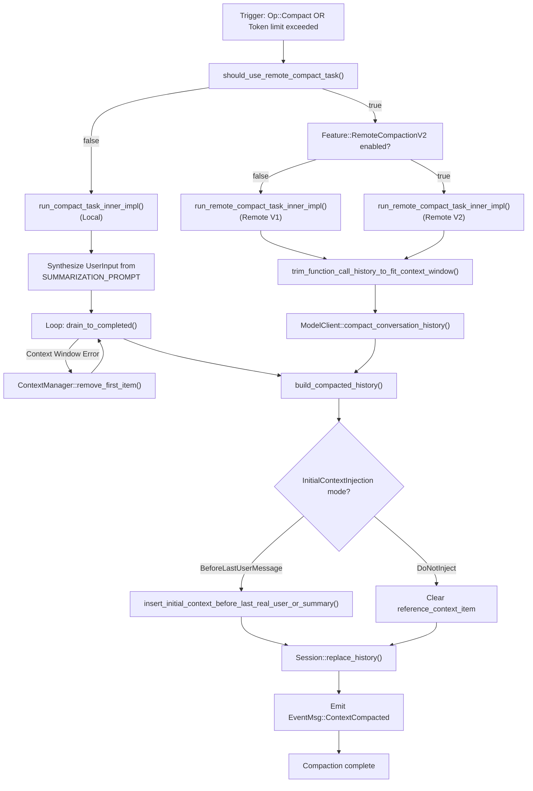
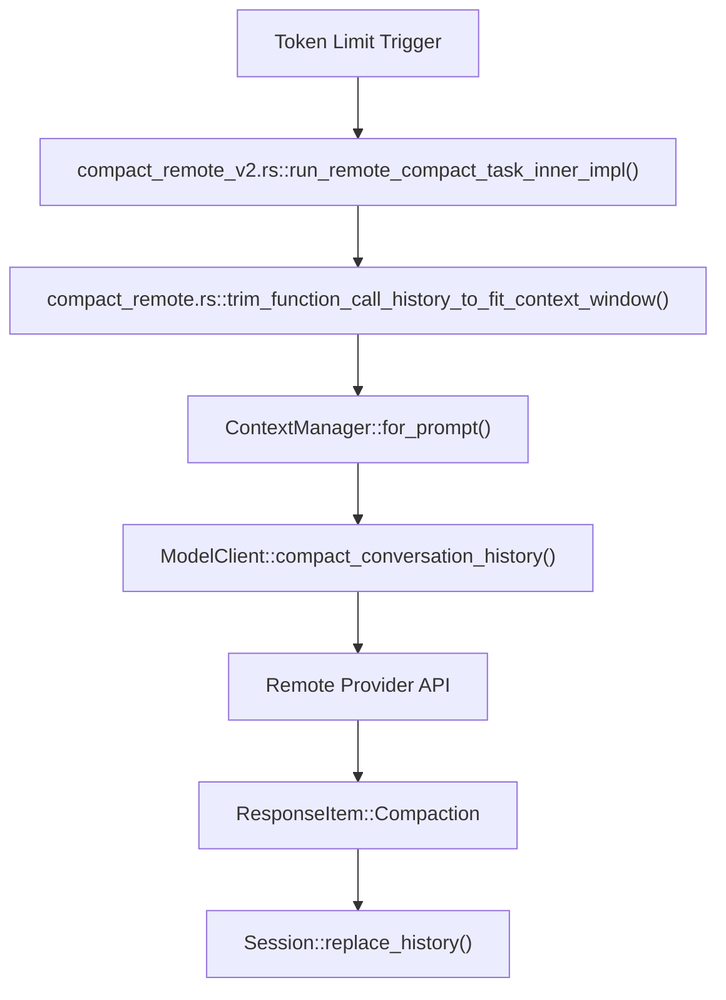

# History Compaction 시스템

관련 소스 파일

다음 파일들은 이 위키 페이지를 생성하기 위한 컨텍스트로 사용되었습니다.

- [codex-rs/analytics/Cargo.toml](codex-rs/analytics/Cargo.toml)
- [codex-rs/analytics/src/analytics_client_tests.rs](codex-rs/analytics/src/analytics_client_tests.rs)
- [codex-rs/analytics/src/client.rs](codex-rs/analytics/src/client.rs)
- [codex-rs/analytics/src/events.rs](codex-rs/analytics/src/events.rs)
- [codex-rs/analytics/src/facts.rs](codex-rs/analytics/src/facts.rs)
- [codex-rs/analytics/src/lib.rs](codex-rs/analytics/src/lib.rs)
- [codex-rs/analytics/src/reducer.rs](codex-rs/analytics/src/reducer.rs)
- [codex-rs/core/src/compact.rs](codex-rs/core/src/compact.rs)
- [codex-rs/core/src/compact_remote.rs](codex-rs/core/src/compact_remote.rs)
- [codex-rs/core/src/compact_remote_v2.rs](codex-rs/core/src/compact_remote_v2.rs)
- [codex-rs/core/src/context/environment_context.rs](codex-rs/core/src/context/environment_context.rs)
- [codex-rs/core/src/context/environment_context_tests.rs](codex-rs/core/src/context/environment_context_tests.rs)
- [codex-rs/core/src/context_manager/history.rs](codex-rs/core/src/context_manager/history.rs)
- [codex-rs/core/src/context_manager/history_tests.rs](codex-rs/core/src/context_manager/history_tests.rs)
- [codex-rs/core/src/context_manager/mod.rs](codex-rs/core/src/context_manager/mod.rs)
- [codex-rs/core/src/context_manager/normalize.rs](codex-rs/core/src/context_manager/normalize.rs)
- [codex-rs/core/src/session/rollout_reconstruction_tests.rs](codex-rs/core/src/session/rollout_reconstruction_tests.rs)
- [codex-rs/core/tests/suite/compact.rs](codex-rs/core/tests/suite/compact.rs)
- [codex-rs/core/tests/suite/compact_remote.rs](codex-rs/core/tests/suite/compact_remote.rs)
- [codex-rs/core/tests/suite/compact_resume_fork.rs](codex-rs/core/tests/suite/compact_resume_fork.rs)
- [codex-rs/core/tests/suite/resume_warning.rs](codex-rs/core/tests/suite/resume_warning.rs)
- [codex-rs/core/tests/suite/review.rs](codex-rs/core/tests/suite/review.rs)
- [codex-rs/rollout-trace/src/protocol_event.rs](codex-rs/rollout-trace/src/protocol_event.rs)
- [codex-rs/rollout/src/list.rs](codex-rs/rollout/src/list.rs)
- [codex-rs/rollout/src/policy.rs](codex-rs/rollout/src/policy.rs)
- [codex-rs/rollout/src/recorder.rs](codex-rs/rollout/src/recorder.rs)
- [codex-rs/rollout/src/recorder_tests.rs](codex-rs/rollout/src/recorder_tests.rs)
- [codex-rs/state/src/extract.rs](codex-rs/state/src/extract.rs)
- [codex-rs/thread-store/src/local/archive_thread.rs](codex-rs/thread-store/src/local/archive_thread.rs)
- [codex-rs/thread-store/src/local/list_threads.rs](codex-rs/thread-store/src/local/list_threads.rs)
- [codex-rs/thread-store/src/local/test_support.rs](codex-rs/thread-store/src/local/test_support.rs)
- [codex-rs/thread-store/src/local/unarchive_thread.rs](codex-rs/thread-store/src/local/unarchive_thread.rs)
- [codex-rs/tui/src/chatwidget/snapshots/codex_tui__chatwidget__tests__image_generation_call_history_snapshot.snap](codex-rs/tui/src/chatwidget/snapshots/codex_tui__chatwidget__tests__image_generation_call_history_snapshot.snap)

## 목적과 범위

History Compaction 시스템은 context limit에 가까워질 때 오래된 메시지를 요약으로 대체하여 대화 history 크기를 관리합니다. 사용자가 직접 트리거하는 수동 compaction(`Op::Compact`)과 token usage threshold에 의해 트리거되는 자동 compaction을 모두 지원합니다. [codex-rs/core/src/compact.rs:69-94](), [codex-rs/core/src/compact.rs:96-119]()

이 시스템에는 세 가지 주요 구현이 있습니다.
- **Local compaction:** 미리 정의된 요약 프롬프트를 사용하고 클라이언트 세션 안에서 실행되며, 표준 inference turn을 통해 summary assistant message를 생성합니다. [codex-rs/core/src/compact.rs:170-225]()
- **Remote compaction(v1):** 사전 compact된 history를 직접 반환하는 특수 모델 provider endpoint를 활용합니다. [codex-rs/core/src/compact_remote.rs:138-197]()
- **Remote compaction(v2):** 큰 context window를 위해 streaming response와 개선된 retry logic을 지원하는 최적화된 버전입니다. [codex-rs/core/src/compact_remote_v2.rs:160-220]()

이 페이지는 compaction workflow, 요약 프롬프트, history가 truncate된 뒤 initial context를 다시 주입하는 전략을 자세히 설명합니다.

**출처:** [codex-rs/core/src/compact.rs:1-48](), [codex-rs/core/src/compact_remote_v2.rs:48-53]()

---

## Compaction 유형

### Local vs Remote Compaction

| 측면               | Local Compaction                          | Remote Compaction(v1 및 v2)                        |
|----------------------|------------------------------------------|----------------------------------------|
| **Provider 지원**  | 표준 provider                      | `supports_remote_compaction()`이 true인 provider [codex-rs/core/src/compact.rs:65-67]() |
| **구현**   | `compact.rs::run_compact_task()` [codex-rs/core/src/compact.rs:96-119]() | `compact_remote_v2.rs::run_remote_compact_task()` [codex-rs/core/src/compact_remote_v2.rs:75-98]() |
| **메커니즘**        | `SUMMARIZATION_PROMPT`를 user-message input으로 주입 [codex-rs/core/src/compact.rs:76-81]() | 모델 클라이언트에서 `compact_conversation_history()` 호출 [codex-rs/core/src/compact_remote.rs:188-197]() |
| **출력**           | Assistant reply가 summary로 사용됨 [codex-rs/core/src/compact.rs:222-225]() | 서버가 `ResponseItem::Compaction`을 반환 [codex-rs/core/src/compact_remote.rs:31-32]() |
| **Retry Logic**      | 실패 시 backoff를 포함한 수동 retry [codex-rs/core/src/compact.rs:194-208]() | V2는 `MAX_REMOTE_COMPACTION_V2_STREAM_RETRIES`(2)를 사용 [codex-rs/core/src/compact_remote_v2.rs:53]() |

**출처:** [codex-rs/core/src/compact.rs:65-119](), [codex-rs/core/src/compact_remote.rs:41-82](), [codex-rs/core/src/compact_remote_v2.rs:48-53]()

---

## Compaction 결정 흐름

시스템은 모델 provider capability와 trigger context(auto vs manual)를 기준으로 compaction을 라우팅합니다.

### 실행 로직 다이어그램

**출처:** [codex-rs/core/src/compact.rs:170-225](), [codex-rs/core/src/compact_remote.rs:138-197](), [codex-rs/core/src/compact_remote_v2.rs:100-158](), [codex-rs/core/src/compact.rs:365-380](), [codex-rs/core/src/context_manager/history.rs:165-175]()

---

## Trigger 조건

### 수동 Compaction
사용자가 명시적으로 `Op::Compact`를 제출할 때 트리거됩니다(예: TUI의 slash command를 통해).
- **Workflow:** `TurnStarted` 이벤트를 방출하고 `run_compact_task_inner`로 진행하는 `run_compact_task`를 호출합니다. [codex-rs/core/src/compact.rs:96-119]()
- **Warning:** 표준 warning message는 여러 번의 compaction이 모델 정확도를 저하시킬 수 있음을 사용자에게 알립니다. [codex-rs/core/tests/suite/compact.rs:93-94]()
- **Injection:** `InitialContextInjection::DoNotInject`를 사용합니다. [codex-rs/core/src/compact.rs:113]()

### 자동 Compaction(턴 중간)
일반 턴 실행 중 token usage가 limit을 초과할 때 트리거됩니다.
- **Trigger:** `run_inline_auto_compact_task` 또는 `run_inline_remote_auto_compact_task`. [codex-rs/core/src/compact.rs:69-75](), [codex-rs/core/src/compact_remote_v2.rs:55-62]()
- **Mode:** 현재 user prompt가 summary 바로 뒤에 오도록 보장하기 위해 일반적으로 `InitialContextInjection::BeforeLastUserMessage`를 사용합니다. [codex-rs/core/src/compact.rs:61]()

**출처:** [codex-rs/core/src/compact.rs:60-119](), [codex-rs/core/tests/suite/compact.rs:93-94]()

---

## Local Compaction 프로세스

### 요약 프롬프트
Local compaction은 앞선 대화를 요약하도록 모델에 지시하는 template에 의존합니다.
- `SUMMARIZATION_PROMPT`: 요약 턴을 위한 핵심 지시. [codex-rs/core/src/compact.rs:47]()
- `SUMMARY_PREFIX`: 이후 턴에서 모델에 summary의 성격을 알리기 위해 summary에 추가되는 표준화된 header. [codex-rs/core/src/compact.rs:48]()

### 실행 루프
local task는 `run_compact_task_inner_impl` 안에서 실행됩니다. `ModelClientSession`을 초기화하고 retry loop에 진입합니다. context window가 가득 차서 요약 요청이 실패하면 `history.remove_first_item()`을 호출해 가장 오래된 메시지를 버리고, 요약 프롬프트가 들어갈 때까지 retry합니다. [codex-rs/core/src/compact.rs:170-208]()

**출처:** [codex-rs/core/src/compact.rs:47-48](), [codex-rs/core/src/compact.rs:170-208](), [codex-rs/core/src/context_manager/history.rs:157-167]()

---

## Remote Compaction 프로세스

### History Trimming
원격 endpoint는 엄격한 input limit을 갖는 경우가 많습니다. 원격 API를 호출하기 전에 시스템은 `trim_function_call_history_to_fit_context_window`를 사용해 tool call과 reasoning item을 trim합니다. [codex-rs/core/src/compact_remote.rs:183-188]()

이 함수는 estimated token count가 모델의 context window 안에 들어올 때까지 history의 가장 오래된 부분에서 "Codex-generated" 항목(tool call, reasoning)을 제거합니다. [codex-rs/core/src/compact_remote.rs:293-323]()

### 유지되는 메시지 예산(V2)
V2 구현은 summary와 함께 유지되는 메시지에 대해 64,000 token의 `RETAINED_MESSAGE_TOKEN_BUDGET`을 유지하여 server-side logic을 반영합니다. [codex-rs/core/src/compact_remote_v2.rs:49]()

**출처:** [codex-rs/core/src/compact_remote.rs:183-188](), [codex-rs/core/src/compact_remote.rs:293-323](), [codex-rs/core/src/compact_remote_v2.rs:49-53]()

---

## Context Reinjection 전략

`InitialContextInjection` enum은 history가 다시 작성된 뒤 "Initial Context"(system instruction, environment state, settings)가 복원되는 방식을 결정합니다. [codex-rs/core/src/compact.rs:60-64]()

| 모드 | 동작 | 사용 사례 |
| :--- | :--- | :--- |
| `BeforeLastUserMessage` | `insert_initial_context_before_last_real_user_or_summary`를 통해 새 history의 마지막 user message 바로 앞에 context를 주입합니다. [codex-rs/core/src/compact.rs:62](), [codex-rs/core/src/compact.rs:472-497]() | 현재 user prompt가 summary 뒤에 와야 하는 턴 중간 auto-compaction. |
| `DoNotInject` | `ContextManager`의 `reference_context_item`을 지웁니다. [codex-rs/core/src/compact.rs:63]() | 독립적인 수동 compaction. 다음 일반 턴이 context를 fresh baseline으로 다시 주입합니다. |

**출처:** [codex-rs/core/src/compact.rs:60-64](), [codex-rs/core/src/compact.rs:472-497](), [codex-rs/core/src/context_manager/history.rs:73-75]()

---

## 자연어를 코드 엔티티에 연결하기

### Local Compaction 데이터 흐름

```mermaid
graph LR
    User["Natural Language Prompt / Token Limit"] --> Session["Session::run_turn()"]
    Session --> CompactRS["compact.rs::run_compact_task_inner_impl()"]
    CompactRS --> ContextMgr["ContextManager::record_items(SUMMARIZATION_PROMPT)"]
    ContextMgr --> Client["ModelClientSession::drain_to_completed()"]
    Client --> LLM["LLM Generates Summary Text"]
    LLM --> Build["compact.rs::build_compacted_history()"]
    Build --> History["Session::replace_history()"]
```

**출처:** [codex-rs/core/src/compact.rs:170-225](), [codex-rs/core/src/context_manager/history.rs:91-105]()

### Remote Compaction 데이터 흐름

**출처:** [codex-rs/core/src/compact_remote.rs:162-221](), [codex-rs/core/src/compact_remote_v2.rs:177-237](), [codex-rs/core/src/context_manager/history.rs:111-114]()

---

## History 교체 로직

compaction이 끝나면 세션 history는 새롭고 더 작은 history를 반영하도록 업데이트됩니다.
1. `build_compacted_history`가 새 `ResponseItem` vector를 구성합니다. [codex-rs/core/src/compact.rs:392-402]()
2. 즉각적인 대화 컨텍스트를 유지하기 위해 최근 user message를 보존합니다(최대 `COMPACT_USER_MESSAGE_MAX_TOKENS`, 20,000 token). [codex-rs/core/src/compact.rs:49](), [codex-rs/core/src/compact.rs:415-437]()
3. summary는 `ResponseItem::Compaction`(remote의 경우) 또는 prefix가 붙은 assistant message(local의 경우)로 삽입됩니다. [codex-rs/core/src/compact.rs:442-452]()
4. `Session::replace_history`는 내부 `ContextManager`를 업데이트하고 `history_version`을 증가시키며 필요한 경우 `reference_context_item`을 reset합니다. [codex-rs/core/src/context_manager/history.rs:38](), [codex-rs/core/src/context_manager/history.rs:73-75]()

**출처:** [codex-rs/core/src/compact.rs:49](), [codex-rs/core/src/compact.rs:392-464](), [codex-rs/core/src/context_manager/history.rs:33-51]()
