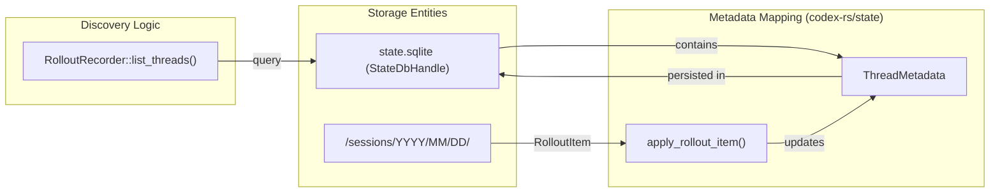

# Rollout 영속화와 Replay

<details>
<summary>관련 소스 파일</summary>

다음 파일들은 이 위키 페이지를 생성하기 위한 컨텍스트로 사용되었습니다.

- [codex-rs/app-server/src/request_processors/thread_processor_tests.rs](codex-rs/app-server/src/request_processors/thread_processor_tests.rs)
- [codex-rs/app-server/tests/suite/conversation_summary.rs](codex-rs/app-server/tests/suite/conversation_summary.rs)
- [codex-rs/app-server/tests/suite/v2/remote_thread_store.rs](codex-rs/app-server/tests/suite/v2/remote_thread_store.rs)
- [codex-rs/app-server/tests/suite/v2/thread_read.rs](codex-rs/app-server/tests/suite/v2/thread_read.rs)
- [codex-rs/app-server/tests/suite/v2/thread_unarchive.rs](codex-rs/app-server/tests/suite/v2/thread_unarchive.rs)
- [codex-rs/core/src/context/environment_context.rs](codex-rs/core/src/context/environment_context.rs)
- [codex-rs/core/src/context/environment_context_tests.rs](codex-rs/core/src/context/environment_context_tests.rs)
- [codex-rs/core/src/context_manager/history.rs](codex-rs/core/src/context_manager/history.rs)
- [codex-rs/core/src/context_manager/history_tests.rs](codex-rs/core/src/context_manager/history_tests.rs)
- [codex-rs/core/src/context_manager/mod.rs](codex-rs/core/src/context_manager/mod.rs)
- [codex-rs/core/src/context_manager/normalize.rs](codex-rs/core/src/context_manager/normalize.rs)
- [codex-rs/core/src/session/rollout_reconstruction_tests.rs](codex-rs/core/src/session/rollout_reconstruction_tests.rs)
- [codex-rs/core/tests/suite/resume_warning.rs](codex-rs/core/tests/suite/resume_warning.rs)
- [codex-rs/rollout-trace/src/protocol_event.rs](codex-rs/rollout-trace/src/protocol_event.rs)
- [codex-rs/rollout/Cargo.toml](codex-rs/rollout/Cargo.toml)
- [codex-rs/rollout/src/compression.rs](codex-rs/rollout/src/compression.rs)
- [codex-rs/rollout/src/compression_tests.rs](codex-rs/rollout/src/compression_tests.rs)
- [codex-rs/rollout/src/lib.rs](codex-rs/rollout/src/lib.rs)
- [codex-rs/rollout/src/list.rs](codex-rs/rollout/src/list.rs)
- [codex-rs/rollout/src/policy.rs](codex-rs/rollout/src/policy.rs)
- [codex-rs/rollout/src/recorder.rs](codex-rs/rollout/src/recorder.rs)
- [codex-rs/rollout/src/recorder_tests.rs](codex-rs/rollout/src/recorder_tests.rs)
- [codex-rs/rollout/src/search.rs](codex-rs/rollout/src/search.rs)
- [codex-rs/state/src/extract.rs](codex-rs/state/src/extract.rs)
- [codex-rs/thread-store/src/in_memory.rs](codex-rs/thread-store/src/in_memory.rs)
- [codex-rs/thread-store/src/lib.rs](codex-rs/thread-store/src/lib.rs)
- [codex-rs/thread-store/src/local/archive_thread.rs](codex-rs/thread-store/src/local/archive_thread.rs)
- [codex-rs/thread-store/src/local/helpers.rs](codex-rs/thread-store/src/local/helpers.rs)
- [codex-rs/thread-store/src/local/list_threads.rs](codex-rs/thread-store/src/local/list_threads.rs)
- [codex-rs/thread-store/src/local/mod.rs](codex-rs/thread-store/src/local/mod.rs)
- [codex-rs/thread-store/src/local/read_thread.rs](codex-rs/thread-store/src/local/read_thread.rs)
- [codex-rs/thread-store/src/local/search_threads.rs](codex-rs/thread-store/src/local/search_threads.rs)
- [codex-rs/thread-store/src/local/test_support.rs](codex-rs/thread-store/src/local/test_support.rs)
- [codex-rs/thread-store/src/local/unarchive_thread.rs](codex-rs/thread-store/src/local/unarchive_thread.rs)
- [codex-rs/thread-store/src/store.rs](codex-rs/thread-store/src/store.rs)
- [codex-rs/thread-store/src/types.rs](codex-rs/thread-store/src/types.rs)
- [codex-rs/tui/src/chatwidget/snapshots/codex_tui__chatwidget__tests__image_generation_call_history_snapshot.snap](codex-rs/tui/src/chatwidget/snapshots/codex_tui__chatwidget__tests__image_generation_call_history_snapshot.snap)

</details>


## 목적과 범위

이 문서는 대화 history와 세션 metadata를 JSONL 형식으로 디스크에 기록하는 Codex의 rollout 영속화 시스템을 설명합니다. Rollout 파일은 thread resumption을 가능하게 하고, 디버깅을 위한 대화 상태 점검을 허용하며, 에이전트 상호작용의 내구성 있는 audit trail을 제공합니다. 이 시스템은 비동기 파일시스템 쓰기를 위한 background recorder와 빠른 thread discovery 및 풍부한 metadata query를 위한 SQLite 기반 index를 사용합니다.

rollout crate(`codex-rs/rollout/`)는 핵심 기록 로직을 제공하고, `codex-rs/state/`는 metadata extraction과 SQLite 통합을 처리합니다. 이 페이지는 오프라인 세션 분석을 위한 diagnostic bundle을 제공하는 `rollout-trace` crate도 다룹니다.

---

## Rollout 파일 형식

Codex는 대화 상태를 **rollout file**로 영속화합니다. 이는 각 줄이 `RolloutItem`을 감싸는 `RolloutLine`을 포함하는 newline-delimited JSON 파일입니다. 이러한 파일은 sessions 디렉터리 아래의 계층적 날짜 기반 구조에 저장되며, 일반적으로 `~/.codex/sessions/YYYY/MM/DD/rollout-TIMESTAMP-UUID.jsonl` 형식입니다 [[codex-rs/rollout/src/recorder.rs:66-73]]().

### RolloutLine 구조

rollout 파일의 각 줄은 다음 구조를 따릅니다.

```rust
pub struct RolloutLine {
    pub timestamp: String, // RFC3339 formatted
    pub item: RolloutItem,
}
```
`RolloutLine` 타입은 `RolloutItem`을 감싸고 각 영속화된 이벤트에 UTC timestamp를 추가합니다 [[codex-rs/rollout/src/recorder.rs:58-60]]().

### 압축과 Materialization
공간을 절약하기 위해 cold rollout 파일은 background worker에 의해 Zstandard(`.zst`)로 압축됩니다 [[codex-rs/rollout/src/compression.rs:24-31]](). 시스템은 plain 및 compressed 형식을 모두 처리하는 `open_rollout_line_reader`를 통해 투명한 접근을 제공합니다 [[codex-rs/rollout/src/compression.rs:47-58]](). 세션이 재개되면 append를 허용하기 위해 compressed rollout이 자동으로 plain `.jsonl`로 다시 materialize됩니다 [[codex-rs/rollout/src/compression.rs:67-72]]().

---

## RolloutItem 타입

`RolloutItem` enum은 rollout 파일에 영속화되는 데이터의 상위 수준 범주를 정의합니다.

| 항목 타입 | 설명 | 주요 동작 |
|-----------|-------------|--------------|
| `ResponseItem` | 원시 모델 응답과 tool call | `role`, `content`(text/tool call), tool output을 포함합니다 [[codex-rs/rollout/src/policy.rs:30-45]](). |
| `EventMsg` | 프로토콜 수준 이벤트 | `UserMessage`, `AgentMessage`, `TokenCount`, 생명주기 이벤트를 포함합니다 [[codex-rs/rollout/src/policy.rs:76-95]](). |
| `SessionMeta` | 세션 수준 metadata | `id`, `source`, `cwd`, `model_provider`, `cli_version` [[codex-rs/state/src/extract.rs:45-71]](). |
| `TurnContext` | 턴 설정 snapshot | 해당 특정 턴의 `model`, `approval_policy`, `sandbox_policy`를 캡처합니다 [[codex-rs/state/src/extract.rs:73-82]](). |
| `Compacted` | Summary 항목 | history compaction task의 항목을 저장합니다 [[codex-rs/state/src/extract.rs:25-25]](). |

**출처:** [[codex-rs/state/src/extract.rs:20-26]](), [[codex-rs/rollout/src/policy.rs:5-15]]()

---

## Rollout 영속화 필터

세션 중 생성되는 모든 이벤트가 디스크에 영속화되는 것은 아닙니다. 영속화는 `policy.rs`의 로직으로 제어됩니다 [[codex-rs/rollout/src/policy.rs:6-15]]().

*   **영속화되는 항목**: `UserMessage`, `AgentMessage`, `AgentReasoning`, `TokenCount`, `TurnComplete` 같은 필수 대화 marker는 항상 기록됩니다 [[codex-rs/rollout/src/policy.rs:77-95]]().
*   **필터링되는 항목**: transient UI 이벤트나 내부 streaming delta(예: `AgentMessageContentDelta`, `PlanDelta`, `ReasoningContentDelta`)는 rollout bloat를 방지하기 위해 제외됩니다 [[codex-rs/rollout/src/policy.rs:149-152]]().
*   **Memory 필터**: 특수 필터 `should_persist_response_item_for_memories`는 memory extraction pipeline에서 `developer` message를 제외합니다 [[codex-rs/rollout/src/policy.rs:53-55]]().

`is_persisted_rollout_item` 함수는 live session recording의 gatekeeper 역할을 합니다 [[codex-rs/rollout/src/policy.rs:6-15]]().

---

## RolloutRecorder 아키텍처

`RolloutRecorder`는 항목을 파일시스템에 비동기적으로 쓰는 일을 관리합니다. background `RolloutWriterTask`를 사용해 I/O를 처리하므로 main agent loop가 disk latency에 의해 block되지 않습니다 [[codex-rs/rollout/src/recorder.rs:75-79]]().

### Background Writing과 Command
recorder는 `RolloutCmd` 채널을 통해 background task와 통신합니다 [[codex-rs/rollout/src/recorder.rs:76-76]](). 지원되는 command는 다음과 같습니다.
- `AddItems(Vec<RolloutItem>)`: 쓰기 위한 새 항목을 buffer합니다 [[codex-rs/rollout/src/recorder.rs:99-99]]().
- `Persist`: 즉시 쓰기를 강제하고 acknowledgement를 반환합니다 [[codex-rs/rollout/src/recorder.rs:100-102]]().
- `Flush`: 이전 모든 쓰기가 처리되도록 보장합니다 [[codex-rs/rollout/src/recorder.rs:104-106]]().
- `Shutdown`: writer task를 graceful하게 닫습니다 [[codex-rs/rollout/src/recorder.rs:107-109]]().

### 다이어그램: Rollout Writing 데이터 흐름
```mermaid
graph TB
    subgraph "Core Agent Space"
        ContextManager["ContextManager"]
        CodexCore["codex_core"]
    end

    subgraph "Rollout Crate (codex-rs/rollout)"
        Recorder["RolloutRecorder"]
        CmdChannel["mpsc::Sender<RolloutCmd>"]
        WriterTask["RolloutWriterTask (tokio::task)"]
    end

    subgraph "Disk Storage"
        Disk[("sessions/YYYY/MM/DD/*.jsonl")]
    end

    CodexCore -->|record_items()| ContextManager
    CodexCore -->|persist| Recorder
    Recorder -->|AddItems| CmdChannel
    CmdChannel --> WriterTask
    WriterTask -->|write_all()| Disk
```
**출처:** [[codex-rs/rollout/src/recorder.rs:75-110]](), [[codex-rs/core/src/context_manager/history.rs:91-105]]()

---

## 세션 Metadata와 Indexing

Codex는 세션 history와 discovery를 위한 기본 query 계층으로 SQLite 데이터베이스를 사용합니다.

### Metadata Extraction
`apply_rollout_item` 함수는 rollout item에서 검색 가능한 속성을 추출하여 `ThreadMetadata`를 채웁니다 [[codex-rs/state/src/extract.rs:15-30]]().
- **Title**: 첫 번째 `UserMessage`에서 파생됩니다 [[codex-rs/state/src/extract.rs:97-101]]().
- **Token Usage**: `TokenCount` 이벤트에서 업데이트됩니다 [[codex-rs/state/src/extract.rs:86-90]]().
- **Git Context**: `SessionMeta`에서 `git_sha`, `git_branch`, `git_origin_url`을 캡처합니다 [[codex-rs/state/src/extract.rs:66-70]]().
- **Goals**: Thread objective는 `ThreadGoalUpdated` 이벤트에서 추출됩니다 [[codex-rs/state/src/extract.rs:104-109]]().

### StateRuntime과 Backfill
`state_db::init` 함수는 SQLite index가 파일시스템과 일치하도록 rollout 파일을 scan하여 backfill을 수행합니다 [[codex-rs/rollout/src/recorder_tests.rs:130-142]](). `RolloutRecorder::list_threads`는 keyset pagination과 `cwd_filters` 또는 `search_term` 기반 filtering으로 이러한 세션을 query하는 로직을 제공합니다 [[codex-rs/rollout/src/recorder.rs:215-227]]().

### 다이어그램: Metadata Discovery와 Storage

**출처:** [[codex-rs/state/src/extract.rs:15-112]](), [[codex-rs/rollout/src/recorder.rs:215-227]](), [[codex-rs/rollout/src/recorder_tests.rs:130-142]]()

---

## 세션 재개와 Replay

세션 재개(`thread/resume` 또는 `thread/fork`를 통해)는 에이전트가 history를 replay하여 이전 대화를 계속할 수 있게 합니다.

### Replay 로직
`RolloutRecorder::load_rollout_items` 함수는 rollout 파일을 읽고 `RolloutItem` vector를 반환합니다 [[codex-rs/rollout/src/recorder_tests.rs:207-208]](). Replay 중에는 다음이 수행됩니다.
- `ghost_snapshot` 같은 legacy item은 건너뜁니다 [[codex-rs/rollout/src/recorder_tests.rs:148-187]]().
- `SessionMeta`와 `TurnContext`는 에이전트 환경(CWD, model, sandbox policy)을 복원하는 데 사용됩니다 [[codex-rs/state/src/extract.rs:45-81]]().
- 재개된 모델이 현재 설정과 다르면 warning이 방출됩니다 [[codex-rs/core/tests/suite/resume_warning.rs:82-134]]().

### Context 재구성
`ContextManager`는 thread history의 transcript를 메모리에 유지합니다 [[codex-rs/core/src/context_manager/history.rs:34-51]](). 재개 시 `record_items`를 사용해 로드된 rollout item에서 manager를 채웁니다 [[codex-rs/core/src/context_manager/history.rs:91-105]](). 이는 부적합한 항목을 drop하기 위해 정규화를 수행하고, 모델 context window에 맞게 truncation policy를 적용합니다 [[codex-rs/core/src/context_manager/history.rs:111-114]]().

**출처:** [[codex-rs/rollout/src/recorder_tests.rs:207-220]](), [[codex-rs/core/src/context_manager/history.rs:34-114]](), [[codex-rs/core/tests/suite/resume_warning.rs:82-134]](), [[codex-rs/state/src/extract.rs:45-81]]()
