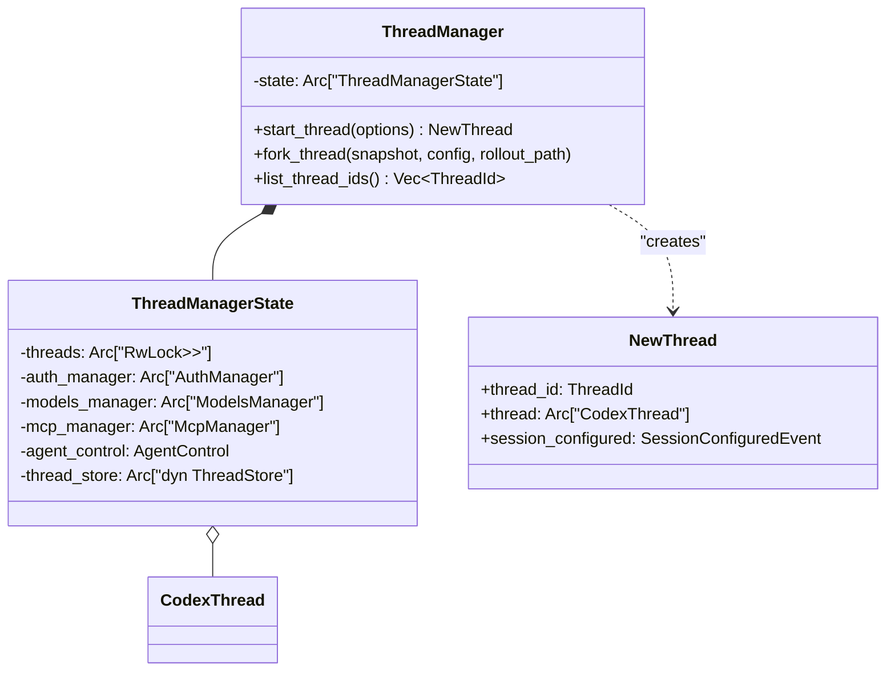
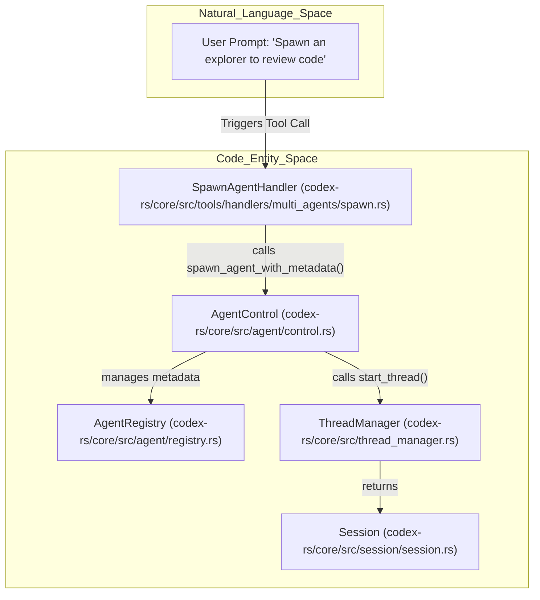
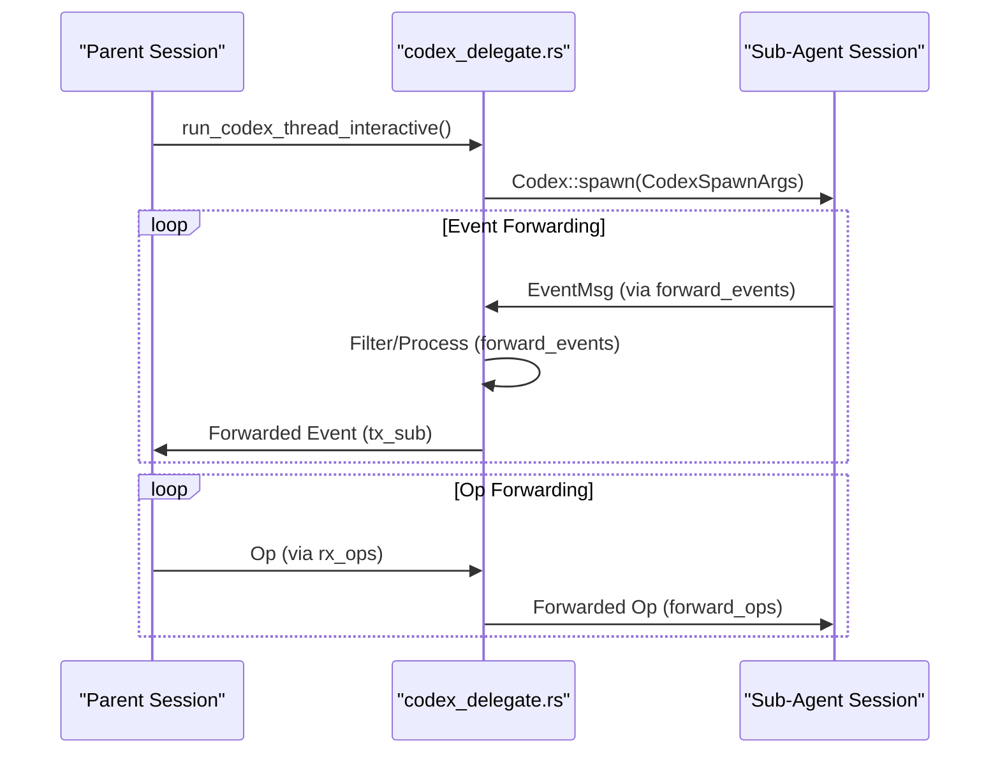

# Thread 관리와 Multi-Agent

관련 소스 파일

다음 파일들은 이 위키 페이지를 생성하기 위한 컨텍스트로 사용되었습니다.

- [codex-rs/core/src/agent/builtins/explorer.toml](codex-rs/core/src/agent/builtins/explorer.toml)
- [codex-rs/core/src/agent/control.rs](codex-rs/core/src/agent/control.rs)
- [codex-rs/core/src/agent/control_tests.rs](codex-rs/core/src/agent/control_tests.rs)
- [codex-rs/core/src/agent/role.rs](codex-rs/core/src/agent/role.rs)
- [codex-rs/core/src/agent/role_tests.rs](codex-rs/core/src/agent/role_tests.rs)
- [codex-rs/core/src/codex_delegate.rs](codex-rs/core/src/codex_delegate.rs)
- [codex-rs/core/src/prompt_debug.rs](codex-rs/core/src/prompt_debug.rs)
- [codex-rs/core/src/session/tests/guardian_tests.rs](codex-rs/core/src/session/tests/guardian_tests.rs)
- [codex-rs/core/src/state/service.rs](codex-rs/core/src/state/service.rs)
- [codex-rs/core/src/thread_manager.rs](codex-rs/core/src/thread_manager.rs)
- [codex-rs/core/src/thread_manager_tests.rs](codex-rs/core/src/thread_manager_tests.rs)
- [codex-rs/core/src/tools/handlers/multi_agents.rs](codex-rs/core/src/tools/handlers/multi_agents.rs)
- [codex-rs/core/src/tools/handlers/multi_agents/close_agent.rs](codex-rs/core/src/tools/handlers/multi_agents/close_agent.rs)
- [codex-rs/core/src/tools/handlers/multi_agents/resume_agent.rs](codex-rs/core/src/tools/handlers/multi_agents/resume_agent.rs)
- [codex-rs/core/src/tools/handlers/multi_agents/send_input.rs](codex-rs/core/src/tools/handlers/multi_agents/send_input.rs)
- [codex-rs/core/src/tools/handlers/multi_agents/spawn.rs](codex-rs/core/src/tools/handlers/multi_agents/spawn.rs)
- [codex-rs/core/src/tools/handlers/multi_agents/wait.rs](codex-rs/core/src/tools/handlers/multi_agents/wait.rs)
- [codex-rs/core/src/tools/handlers/multi_agents_common.rs](codex-rs/core/src/tools/handlers/multi_agents_common.rs)
- [codex-rs/core/src/tools/handlers/multi_agents_spec.rs](codex-rs/core/src/tools/handlers/multi_agents_spec.rs)
- [codex-rs/core/src/tools/handlers/multi_agents_spec_tests.rs](codex-rs/core/src/tools/handlers/multi_agents_spec_tests.rs)
- [codex-rs/core/src/tools/handlers/multi_agents_tests.rs](codex-rs/core/src/tools/handlers/multi_agents_tests.rs)
- [codex-rs/core/src/tools/handlers/multi_agents_v2.rs](codex-rs/core/src/tools/handlers/multi_agents_v2.rs)
- [codex-rs/core/src/tools/handlers/multi_agents_v2/message_tool.rs](codex-rs/core/src/tools/handlers/multi_agents_v2/message_tool.rs)
- [codex-rs/core/src/tools/handlers/multi_agents_v2/spawn.rs](codex-rs/core/src/tools/handlers/multi_agents_v2/spawn.rs)
- [codex-rs/core/tests/suite/subagent_notifications.rs](codex-rs/core/tests/suite/subagent_notifications.rs)
- [codex-rs/rollout-trace/README.md](codex-rs/rollout-trace/README.md)
- [codex-rs/rollout-trace/src/tool_dispatch.rs](codex-rs/rollout-trace/src/tool_dispatch.rs)

## 목적과 범위

이 문서는 Codex가 대화 thread를 관리하고 multi-agent workflow를 오케스트레이션하는 방식을 설명합니다. Thread 관리는 `ThreadManager`와 `ThreadManagerState`가 조정하는 생명주기 작업(spawn, resume, fork)을 포함하며, multi-agent 지원은 코드 리뷰, history compaction, 협업적 문제 해결 같은 작업을 위해 특화된 하위 에이전트를 spawn할 수 있게 합니다. 각 thread는 독립적인 상태를 유지하며, 에이전트 간 통신은 `AgentControl`과 특화된 tool handler를 통해 처리됩니다.

## Thread 생명주기와 ThreadManager

`ThreadManager`는 모든 활성 `CodexThread` 인스턴스의 최상위 소유자입니다. 생성과 영속화를 관리하고, `AuthManager`, `ModelsManager`, `McpManager` 같은 공유 서비스에 대한 접근을 제공합니다. [codex-rs/core/src/thread_manager.rs:172-175]()

### ThreadManager 아키텍처

`ThreadManager`는 thread 및 `AgentControl`과 안전하게 공유할 수 있도록 `Arc`로 감싼 내부 `ThreadManagerState`를 사용합니다. [codex-rs/core/src/thread_manager.rs:172-173]()

Title: Thread Management Class Structure

출처: [codex-rs/core/src/thread_manager.rs:112-116](), [codex-rs/core/src/thread_manager.rs:172-173]()

### 핵심 작업

| 작업 | 구현 | 설명 |
| :--- | :--- | :--- |
| **Spawn** | `Codex::spawn` | `CodexSpawnArgs`에서 새 세션을 생성합니다. [codex-rs/core/src/codex_delegate.rs:82-111]() |
| **Resume** | `InitialHistory::Resume` | rollout의 이벤트를 replay하여 상태를 재구성합니다. [codex-rs/core/src/thread_manager.rs:45-45]() |
| **Fork** | `InitialHistory::Forked` | parent history를 상속하면서 새 `ThreadId`를 할당합니다. [codex-rs/core/src/thread_manager.rs:46-46]() |

## Multi-Agent 아키텍처

Codex는 "parent" 세션이 `AgentControl`을 통해 "sub-agent"를 spawn할 수 있는 계층형 multi-agent 시스템을 구현합니다. 이는 주로 `multi_agents` tool handler가 구동합니다. [codex-rs/core/src/agent/control.rs:84-102]()

### AgentControl과 Registry

`AgentControl`은 multi-agent 작업을 위한 control-plane handle입니다. 각 `Session`이 `SessionServices`를 통해 보유하며, 새 에이전트를 spawn하고 에이전트 간 통신을 촉진하는 기능을 제공합니다. root에서 spawn된 모든 sub-agent와 공유되어 registry가 해당 세션 트리 범위에 유지되도록 합니다. [codex-rs/core/src/agent/control.rs:84-102]()

Title: Multi-Agent Spawn Flow

출처: [codex-rs/core/src/agent/control.rs:84-102](), [codex-rs/core/src/tools/handlers/multi_agents/spawn.rs:15-43]()

### Sub-Agent Role과 설정

에이전트가 spawn될 때 특정 "role"(예: `explorer`, `reviewer`)을 할당할 수 있습니다. `apply_role_to_config` 함수는 role별 설정을 로드하고 이를 세션 설정 위에 덮어씁니다. [codex-rs/core/src/agent/role.rs:38-41]()

- **Role 해석**: `resolve_role_config`를 사용해 `config.toml` 또는 내장 기본값에서 `AgentRoleConfig`를 찾습니다. [codex-rs/core/src/agent/role.rs:119-127]()
- **보존 정책**: role이 명시적으로 override하지 않는 한 parent의 `model_provider`와 `service_tier`가 보존되도록 보장합니다. [codex-rs/core/src/agent/role.rs:72-73]()
- **Layering**: role은 `build_next_config`를 통해 `ConfigLayerStack`에 높은 우선순위 layer로 삽입됩니다. [codex-rs/core/src/agent/role.rs:132-154]()

## 에이전트 간 통신(Collab Tools)

에이전트 간 통신은 특화된 도구 집합을 통해 처리됩니다. 최신 "v2" 구현은 task 기반 naming과 개선된 turn management에 중점을 둡니다. [codex-rs/core/src/tools/handlers/multi_agents_v2.rs:1-12]()

| Tool | Handler | 설명 |
| :--- | :--- | :--- |
| `spawn_agent` | `SpawnAgentHandlerV2` | `task_name`과 `message`를 포함한 sub-agent를 spawn합니다. [codex-rs/core/src/tools/handlers/multi_agents_v2/spawn.rs:15-37]() |
| `send_message` | `SendMessageHandlerV2` | turn을 트리거하지 않고 target agent에 메시지를 queue합니다. [codex-rs/core/src/tools/handlers/multi_agents_v2/message_tool.rs:1-15]() |
| `followup_task` | `FollowupTaskHandlerV2` | 메시지를 보내고 turn을 트리거합니다. [codex-rs/core/src/tools/handlers/multi_agents_v2/message_tool.rs:1-16]() |
| `wait_agent` | `WaitAgentHandlerV2` | sub-agent가 final state에 도달할 때까지 parent 실행을 일시 중지합니다. [codex-rs/core/src/tools/handlers/multi_agents/wait.rs:15-23]() |
| `list_agents` | `ListAgentsHandlerV2` | 세션 트리의 활성 sub-agent를 나열합니다. [codex-rs/core/src/tools/handlers/multi_agents_v2.rs:14-14]() |

### Sub-Agent 이벤트 Forwarding

sub-agent가 대화형으로 실행 중일 때 `codex_delegate` 모듈은 parent에 대한 approval filtering을 포함해 operation과 event의 양방향 흐름을 관리합니다. [codex-rs/core/src/codex_delegate.rs:68-77]()

Title: Sub-Agent Delegation Sequence

출처: [codex-rs/core/src/codex_delegate.rs:82-111](), [codex-rs/core/src/codex_delegate.rs:141-150](), [codex-rs/core/src/codex_delegate.rs:154-156]()

## Thread 상태와 Task 관리

thread 간 전환과 세션 재개를 지원하기 위해 Codex는 구조화된 상태 저장소와 rollout tracking을 사용합니다.

- **SessionServices**: `agent_control`과 `thread_store`를 포함한 세션 범위 상태를 관리합니다. [codex-rs/core/src/state/service.rs:41-85]()
- **Forking Snapshots**: 일관된 history fork를 만들기 위해 `TruncateBeforeNthUserMessage` 또는 `Interrupted` 모드를 지원합니다. [codex-rs/core/src/thread_manager.rs:128-147]()
- **LiveAgent Registry**: 세션 트리의 모든 에이전트에 대한 `LiveAgent` 상태와 metadata(예: `thread_id`, `AgentStatus`)를 추적합니다. [codex-rs/core/src/agent/control.rs:71-75]()
- **Agent Graph Persistence**: parent/child thread topology의 영속화는 `DirectionalThreadSpawnEdgeStatus` 기록으로 지원됩니다. [codex-rs/core/src/agent/control.rs:35-35]()

출처: [codex-rs/core/src/state/service.rs:41-85](), [codex-rs/core/src/thread_manager.rs:128-147](), [codex-rs/core/src/agent/control.rs:71-75](), [codex-rs/core/src/agent/control.rs:35-35]()
