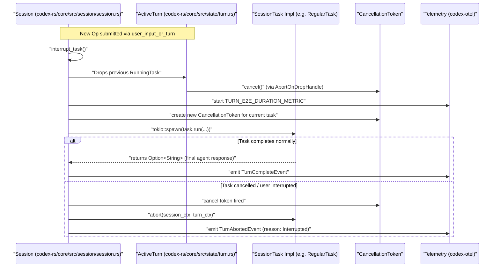
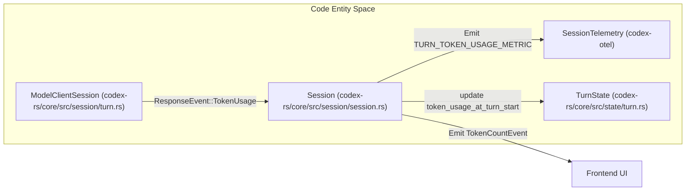
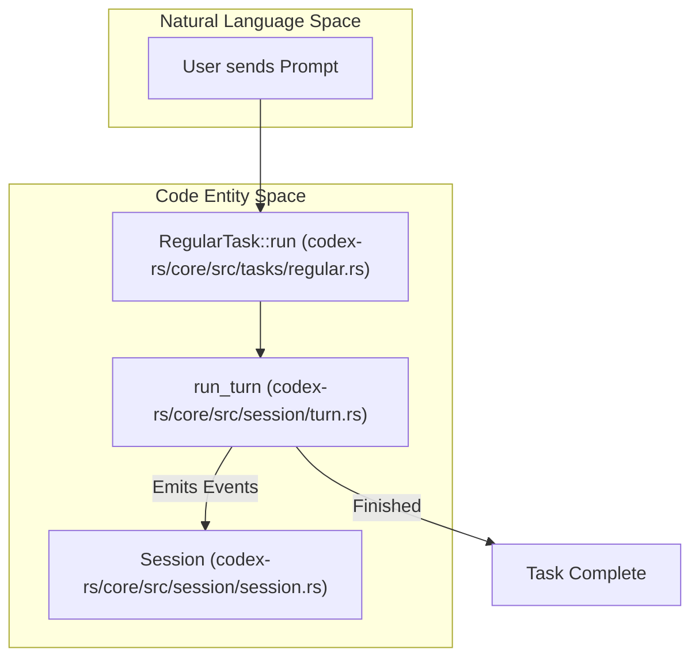
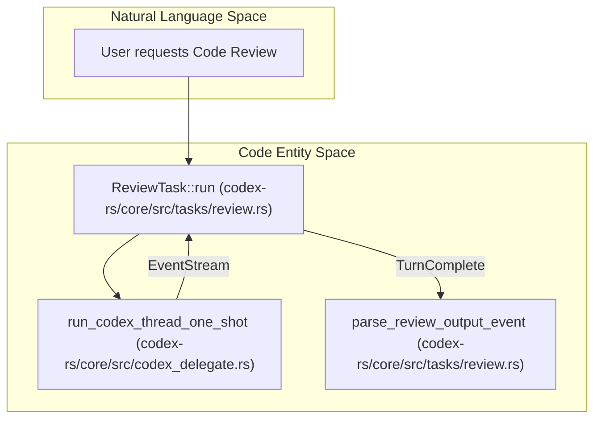

# Session Task와 Turn State

<details>
<summary>관련 소스 파일</summary>

다음 파일들은 이 위키 페이지를 생성하기 위한 컨텍스트로 사용되었습니다.

- [codex-rs/app-server/tests/suite/v2/request_user_input.rs](codex-rs/app-server/tests/suite/v2/request_user_input.rs)
- [codex-rs/core/src/codex_thread.rs](codex-rs/core/src/codex_thread.rs)
- [codex-rs/core/src/session/handlers.rs](codex-rs/core/src/session/handlers.rs)
- [codex-rs/core/src/session/mod.rs](codex-rs/core/src/session/mod.rs)
- [codex-rs/core/src/session/review.rs](codex-rs/core/src/session/review.rs)
- [codex-rs/core/src/session/session.rs](codex-rs/core/src/session/session.rs)
- [codex-rs/core/src/session/tests.rs](codex-rs/core/src/session/tests.rs)
- [codex-rs/core/src/session/turn.rs](codex-rs/core/src/session/turn.rs)
- [codex-rs/core/src/session/turn_context.rs](codex-rs/core/src/session/turn_context.rs)
- [codex-rs/core/src/state/mod.rs](codex-rs/core/src/state/mod.rs)
- [codex-rs/core/src/state/turn.rs](codex-rs/core/src/state/turn.rs)
- [codex-rs/core/src/tasks/compact.rs](codex-rs/core/src/tasks/compact.rs)
- [codex-rs/core/src/tasks/mod.rs](codex-rs/core/src/tasks/mod.rs)
- [codex-rs/core/src/tasks/regular.rs](codex-rs/core/src/tasks/regular.rs)
- [codex-rs/core/src/tasks/review.rs](codex-rs/core/src/tasks/review.rs)
- [codex-rs/core/src/tools/handlers/plan.rs](codex-rs/core/src/tools/handlers/plan.rs)
- [codex-rs/core/src/tools/handlers/request_permissions.rs](codex-rs/core/src/tools/handlers/request_permissions.rs)
- [codex-rs/core/src/tools/handlers/request_user_input.rs](codex-rs/core/src/tools/handlers/request_user_input.rs)
- [codex-rs/core/src/tools/handlers/shell/shell_command.rs](codex-rs/core/src/tools/handlers/shell/shell_command.rs)
- [codex-rs/core/src/tools/handlers/test_sync.rs](codex-rs/core/src/tools/handlers/test_sync.rs)
- [codex-rs/core/src/tools/handlers/unified_exec/exec_command.rs](codex-rs/core/src/tools/handlers/unified_exec/exec_command.rs)
- [codex-rs/core/src/tools/handlers/unified_exec/write_stdin.rs](codex-rs/core/src/tools/handlers/unified_exec/write_stdin.rs)
- [codex-rs/core/tests/suite/agent_websocket.rs](codex-rs/core/tests/suite/agent_websocket.rs)
- [codex-rs/core/tests/suite/codex_delegate.rs](codex-rs/core/tests/suite/codex_delegate.rs)
- [codex-rs/core/tests/suite/request_user_input.rs](codex-rs/core/tests/suite/request_user_input.rs)
- [codex-rs/core/tests/suite/turn_state.rs](codex-rs/core/tests/suite/turn_state.rs)
- [codex-rs/core/tests/suite/websocket_fallback.rs](codex-rs/core/tests/suite/websocket_fallback.rs)
- [codex-rs/tools/src/tool_config.rs](codex-rs/tools/src/tool_config.rs)
- [codex-rs/tools/src/tool_config_tests.rs](codex-rs/tools/src/tool_config_tests.rs)

</details>


이 페이지는 비동기 session task를 정의하는 `SessionTask` trait, 이러한 task의 spawn 및 abort를 포함한 생명주기, 턴 중 pending operation을 관리하는 데 사용되는 `TurnState` 구조체, 그리고 token usage가 telemetry와 UI를 위해 추적되고 노출되는 방식을 설명합니다.

---

## 개요

Codex 시스템에서 chat turn, code review, terminal command execution 같은 모든 AI 상호작용 또는 복잡한 workflow는 **Session Task**로 표현됩니다. 이러한 task는 세션이 관리하는 background Tokio task에서 비동기적으로 실행됩니다. 이 설계 덕분에 Codex는 부드러운 사용자 경험을 유지하면서 multitasking, long-running operation, interruption, cancellation을 지원할 수 있습니다. [codex-rs/core/src/tasks/mod.rs:199-206]()

---

## SessionTask Trait와 생명주기

`SessionTask` trait는 세션 턴을 구동하는 작업 단위를 구현하기 위한 최소 인터페이스를 제공합니다. 각 task 인스턴스는 `Session`이 소유하며 background Tokio task에서 비동기적으로 실행됩니다. [codex-rs/core/src/tasks/mod.rs:199-206]()

### `SessionTask` Trait 정의

```rust
pub(crate) trait SessionTask: Send + Sync + 'static {
    /// Describes the type of work the task performs so the session can
    /// surface it in telemetry and UI.
    fn kind(&self) -> TaskKind;

    /// Returns the tracing name for a spawned task span.
    fn span_name(&self) -> &'static str;

    /// Executes the task until completion or cancellation.
    fn run(
        self: Arc<Self>,
        session: Arc<SessionTaskContext>,
        ctx: Arc<TurnContext>,
        input: Vec<TurnInput>,
        cancellation_token: CancellationToken,
    ) -> BoxFuture<'static, Option<String>>;

    /// Gives the task a chance to perform cleanup after an abort.
    fn abort(
        &self,
        _session: Arc<SessionTaskContext>,
        _ctx: Arc<TurnContext>,
    ) -> BoxFuture<'static, ()> {
        Box::pin(async {})
    }
}
```

- `kind()`는 `TaskKind` enum(예: `Regular`, `Review`, `Compact`)을 사용해 task의 목적을 식별합니다. [codex-rs/core/src/tasks/mod.rs:210-212]()
- `run(...)`은 `SessionTaskContext`, `TurnContext`, input, `CancellationToken`에 대한 전체 접근 권한을 가지고 task를 비동기적으로 실행합니다. [codex-rs/core/src/tasks/mod.rs:215-221]()
- `abort(...)`는 세션이 cancellation을 요청할 때 호출되어 task별 cleanup을 가능하게 합니다. [codex-rs/core/src/tasks/mod.rs:223-228]()

**출처:** [codex-rs/core/src/tasks/mod.rs:207-230](), [codex-rs/core/src/state/turn.rs:65-70]() (`TaskKind` 관련)

---

### Task 생명주기(Spawn과 Abort)

Task는 `Session` 안에서 관리됩니다. 새 task가 spawn될 때(예: 새 사용자 prompt) 기존 task는 일반적으로 drain 및 abort되어 세션 상태를 유지합니다. [codex-rs/core/src/session/handlers.rs:62-64]()

`ActiveTurn` 구조체는 현재 실행 중인 `RunningTask` handle과 연결된 `TurnState`를 관리합니다. [codex-rs/core/src/state/turn.rs:29-33]()

**생명주기 시퀀스:**



- 새 턴이 시작되면 연결된 `CancellationToken`을 트리거하여 실행 중인 모든 task가 취소됩니다. [codex-rs/core/src/tasks/mod.rs:219-221]()
- 새 task는 새 cancellation token과 함께 Tokio에서 spawn되고 `AbortOnDropHandle`로 감싸집니다. [codex-rs/core/src/state/turn.rs:72-83]()
- 정상 완료 시 세션은 `TurnCompleteEvent`를 방출합니다. [codex-rs/core/src/tasks/mod.rs:52]()
- abort된 경우(예: 사용자 interrupt) task는 `abort()`를 통해 cleanup을 수행하고 `TurnAbortedEvent`가 방출됩니다. [codex-rs/core/src/tasks/mod.rs:50-51]()

**출처:** [codex-rs/core/src/tasks/mod.rs:199-230](), [codex-rs/core/src/session/session.rs:39-40](), [codex-rs/core/src/state/turn.rs:72-83](), [codex-rs/core/src/session/handlers.rs:62-64]()

---

## Turn State와 Pending Operation

### TurnContext와 SessionTaskContext

- **`TurnContext`**: 고유 `sub_id`, 모델 세부 사항, 샌드박스 정책처럼 특정 에이전트 턴을 위한 불변 매개변수와 환경을 캡슐화합니다. [codex-rs/core/src/session/turn_context.rs:56-108]()
- **`SessionTaskContext`**: task runner가 필요로 하는 `AuthManager`와 `SharedModelsManager` 같은 `Session` 일부를 노출하는 얇은 wrapper입니다. [codex-rs/core/src/tasks/mod.rs:169-197]()

**출처:** [codex-rs/core/src/tasks/mod.rs:169-197](), [codex-rs/core/src/session/turn_context.rs:56-108]()

---

### TurnState: Pending Operation 관리

`TurnState` 구조체는 활성 턴의 가변 상태를 보유하며, 외부 입력이나 승인이 필요한 비동기 상호작용을 추적합니다. `oneshot` 채널을 사용해 프로토콜 이벤트와 대기 중인 task logic 사이의 간극을 연결합니다. [codex-rs/core/src/state/turn.rs:86-100]()

| 컴포넌트 | 코드 엔티티 | 설명 |
|---|---|---|
| **Pending Approvals** | `pending_approvals` | tool call ID를 `ReviewDecision` responder에 매핑합니다. [codex-rs/core/src/state/turn.rs:88]() |
| **Pending Permissions** | `pending_request_permissions` | `RequestPermissionsResponse`를 통해 새 sandbox permission 요청을 추적합니다. [codex-rs/core/src/state/turn.rs:89]() |
| **Pending User Input** | `pending_user_input` | 사용자 clarification 요청을 추적합니다. [codex-rs/core/src/state/turn.rs:90]() |
| **Pending Elicitations** | `pending_elicitations` | MCP server elicitation 요청을 추적합니다. [codex-rs/core/src/state/turn.rs:91]() |
| **Mailbox Phase** | `mailbox_delivery_phase` | 새 메시지가 현재 턴 또는 다음 턴 중 어디에 합류할지 결정합니다. [codex-rs/core/src/state/turn.rs:94]() |

**출처:** [codex-rs/core/src/state/turn.rs:86-100](), [codex-rs/core/src/state/turn.rs:35-54]()

---

## Token Usage 추적

Codex는 UI 표시, 내부 rate limit, telemetry를 위한 정확한 usage count를 제공하기 위해 턴 중 token consumption을 추적합니다.

### Token Metric 데이터 흐름



- `ModelClientSession`은 `run_turn` 중 response event 안에서 `TokenUsage`를 반환합니다. [codex-rs/core/src/session/turn.rs:135-144]()
- `TurnState`는 특정 턴의 delta usage를 계산하기 위해 `token_usage_at_turn_start`를 초기화합니다. [codex-rs/core/src/state/turn.rs:99]()
- Telemetry는 모델 및 provider 정보로 tag된 `TURN_TOKEN_USAGE_METRIC` counter를 방출합니다. [codex-rs/core/src/tasks/mod.rs:44]()

**출처:** [codex-rs/core/src/session/turn.rs:135-155](), [codex-rs/core/src/tasks/mod.rs:36-44](), [codex-rs/core/src/state/turn.rs:97-100]()

---

## 특화 Task 구현

Codex는 서로 다른 workflow를 위한 여러 `SessionTask` 구현을 제공합니다.

| Task 타입 | 구현 | 역할 |
|---|---|---|
| `RegularTask` | [codex-rs/core/src/tasks/regular.rs]() | 모델 상호작용과 도구 실행을 포함하는 표준 chat turn. [codex-rs/core/src/tasks/mod.rs:58]() |
| `ReviewTask` | [codex-rs/core/src/tasks/review.rs]() | code review와 analysis를 위한 sub-agent workflow. [codex-rs/core/src/tasks/mod.rs:59]() |
| `UserShellCommandTask` | [codex-rs/core/src/tasks/user_shell.rs]() | 사용자를 위해 interactive shell command를 직접 실행합니다. [codex-rs/core/src/tasks/mod.rs:61]() |
| `CompactTask` | [codex-rs/core/src/tasks/compact.rs]() | history compaction과 summarization을 트리거합니다. [codex-rs/core/src/tasks/mod.rs:57]() |

**출처:** [codex-rs/core/src/tasks/mod.rs:56-62]()

### 예시: RegularTask 구현

`RegularTask`는 표준 에이전트 턴을 위한 기본 driver입니다. `run_turn`을 통해 세션 초기화에서 주요 실행 루프로의 전환을 관리합니다. [codex-rs/core/src/tasks/regular.rs:18-89]()



**출처:** [codex-rs/core/src/tasks/regular.rs:18-89](), [codex-rs/core/src/session/turn.rs:135-142]()

### 예시: ReviewTask 구현

`ReviewTask`는 특화된 sub-agent workflow를 트리거합니다. 제한된 기능(예: web search 비활성화)이 있는 `sub_agent_config`를 생성하고 분석을 one-shot Codex thread에 위임합니다. [codex-rs/core/src/tasks/review.rs:95-139]()



**출처:** [codex-rs/core/src/tasks/review.rs:51-88](), [codex-rs/core/src/tasks/review.rs:195-203]()

---

### 출처
- [codex-rs/core/src/tasks/mod.rs:1-230]()
- [codex-rs/core/src/session/session.rs:23-44]()
- [codex-rs/core/src/session/turn.rs:135-160]()
- [codex-rs/core/src/session/turn_context.rs:56-108]()
- [codex-rs/core/src/state/turn.rs:1-100]()
- [codex-rs/core/src/tasks/regular.rs:18-89]()
- [codex-rs/core/src/tasks/review.rs:42-93]()
- [codex-rs/core/src/tasks/review.rs:95-139]()
- [codex-rs/core/src/session/handlers.rs:62-64]()
