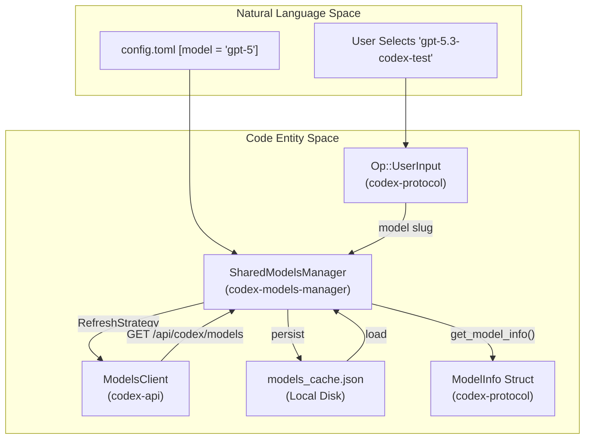
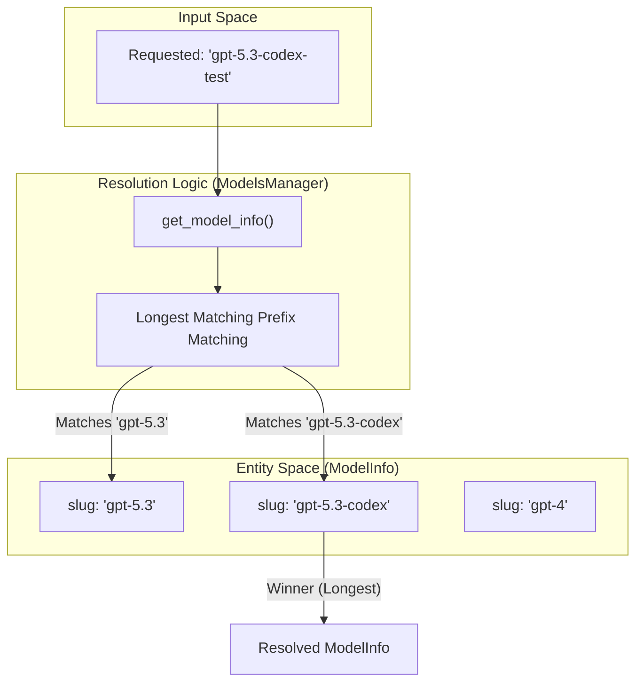

# Models Manager

관련 소스 파일

다음 파일들은 이 위키 페이지를 생성하기 위한 컨텍스트로 사용되었습니다.

- [codex-rs/app-server-protocol/schema/json/v2/ModelListResponse.json](codex-rs/app-server-protocol/schema/json/v2/ModelListResponse.json)
- [codex-rs/app-server-protocol/schema/typescript/v2/Model.ts](codex-rs/app-server-protocol/schema/typescript/v2/Model.ts)
- [codex-rs/app-server/src/models.rs](codex-rs/app-server/src/models.rs)
- [codex-rs/app-server/tests/common/models_cache.rs](codex-rs/app-server/tests/common/models_cache.rs)
- [codex-rs/app-server/tests/suite/v2/model_list.rs](codex-rs/app-server/tests/suite/v2/model_list.rs)
- [codex-rs/codex-api/tests/models_integration.rs](codex-rs/codex-api/tests/models_integration.rs)
- [codex-rs/core/tests/suite/model_switching.rs](codex-rs/core/tests/suite/model_switching.rs)
- [codex-rs/core/tests/suite/models_cache_ttl.rs](codex-rs/core/tests/suite/models_cache_ttl.rs)
- [codex-rs/core/tests/suite/personality.rs](codex-rs/core/tests/suite/personality.rs)
- [codex-rs/core/tests/suite/remote_models.rs](codex-rs/core/tests/suite/remote_models.rs)
- [codex-rs/core/tests/suite/rmcp_client.rs](codex-rs/core/tests/suite/rmcp_client.rs)
- [codex-rs/core/tests/suite/spawn_agent_description.rs](codex-rs/core/tests/suite/spawn_agent_description.rs)
- [codex-rs/core/tests/suite/truncation.rs](codex-rs/core/tests/suite/truncation.rs)
- [codex-rs/core/tests/suite/user_shell_cmd.rs](codex-rs/core/tests/suite/user_shell_cmd.rs)
- [codex-rs/core/tests/suite/view_image.rs](codex-rs/core/tests/suite/view_image.rs)
- [codex-rs/memories/write/Cargo.toml](codex-rs/memories/write/Cargo.toml)
- [codex-rs/memories/write/src/lib.rs](codex-rs/memories/write/src/lib.rs)
- [codex-rs/memories/write/src/phase1.rs](codex-rs/memories/write/src/phase1.rs)
- [codex-rs/memories/write/src/phase2.rs](codex-rs/memories/write/src/phase2.rs)
- [codex-rs/memories/write/src/runtime.rs](codex-rs/memories/write/src/runtime.rs)
- [codex-rs/memories/write/src/start.rs](codex-rs/memories/write/src/start.rs)
- [codex-rs/memories/write/src/startup_tests.rs](codex-rs/memories/write/src/startup_tests.rs)
- [codex-rs/model-provider-info/src/lib.rs](codex-rs/model-provider-info/src/lib.rs)
- [codex-rs/model-provider-info/src/model_provider_info_tests.rs](codex-rs/model-provider-info/src/model_provider_info_tests.rs)
- [codex-rs/model-provider/src/amazon_bedrock/catalog.rs](codex-rs/model-provider/src/amazon_bedrock/catalog.rs)
- [codex-rs/model-provider/src/amazon_bedrock/mod.rs](codex-rs/model-provider/src/amazon_bedrock/mod.rs)
- [codex-rs/model-provider/src/provider.rs](codex-rs/model-provider/src/provider.rs)
- [codex-rs/models-manager/src/model_info.rs](codex-rs/models-manager/src/model_info.rs)
- [codex-rs/protocol/src/openai_models.rs](codex-rs/protocol/src/openai_models.rs)
- [codex-rs/tui/src/chatwidget/snapshots/codex_tui__chatwidget__tests__model_selection_popup.snap](codex-rs/tui/src/chatwidget/snapshots/codex_tui__chatwidget__tests__model_selection_popup.snap)

Models Manager는 모델 metadata의 discover, 원격 fetch, TTL 기반 cache, resolve를 담당하는 `codex-core` 내부 하위 시스템입니다. 원격 `/models` endpoint를 cache layer 및 나머지 에이전트 시스템과 연결하여 모델 capability를 prompt 구성, tool 설정, UI picker에서 사용할 수 있게 합니다. 또한 설정 override와 collaboration mode preset도 지원합니다.

이 페이지는 `ModelsManager` 구조체, cache 및 remote fetch의 refresh 전략, 모델 요청을 `ModelInfo` 항목과 매칭하는 slug resolution logic, TTL과 client version에 따른 cache invalidation을 포함한 cache 메커니즘, TUI와 핵심 에이전트 시스템에서 사용되는 collaboration mode preset을 문서화합니다.

---

## 핵심 타입

모델 metadata 타입은 주로 [codex-rs/protocol/src/openai_models.rs:1-287]()에 정의되어 있습니다. 이러한 타입은 core, TUI, app-server, SDK 경계를 넘어 직렬화되므로, 오래된 payload가 새로 도입된 attribute를 생략해도 호환성을 보존하기 위해 field default가 사용됩니다 [codex-rs/protocol/src/openai_models.rs:3-5]().

| 타입 | 목적 |
|-------|---------|
| `ModelInfo` | `/models` endpoint가 반환하는 전체 모델 metadata입니다. model name, description, reasoning level, shell execution type, truncation policy, base instruction, 선택적 personality message template을 포함합니다 [codex-rs/protocol/src/openai_models.rs:249-287](). |
| `ModelPreset` | 모델 metadata에서 파생된 UI 친화적 요약으로, picker에 모델을 표시하는 데 사용됩니다 [codex-rs/protocol/src/openai_models.rs:196-234]().|
| `ModelsResponse` | model list endpoint에서 역직렬화하기 위한 `ModelInfo` vector wrapper [codex-rs/protocol/src/openai_models.rs:290-293](). |
| `ReasoningEffort` | reasoning complexity level을 나타내는 enum: `None`, `Minimal`, `Low`, `Medium`, `High`, `XHigh` [codex-rs/protocol/src/openai_models.rs:40-50](). |
| `ReasoningEffortPreset` | 각 reasoning effort level을 표시 설명과 연결합니다 [codex-rs/protocol/src/openai_models.rs:165-171](). |
| `ConfigShellToolType` | `Default`, `Local`, `UnifiedExec`, `Disabled`, `ShellCommand` 같은 shell execution mode [codex-rs/protocol/src/openai_models.rs:237-243](). |
| `ModelVisibility` | 모델 visibility 제어: `List`(picker에 표시), `Hide`, 또는 `None` [codex-rs/protocol/src/openai_models.rs:173-177](). |
| `TruncationPolicyConfig` | tool output을 truncate하기 위한 token 또는 byte limit을 정의합니다 [codex-rs/protocol/src/openai_models.rs:221-226](). |
| `ModelUpgrade` | 모델에 대한 권장 upgrade 정보 [codex-rs/protocol/src/openai_models.rs:174-180](). |

### 주요 `ModelInfo` 필드

| 필드 | 타입 | 설명 |
|-------|------|-------------|
| `slug` | `String` | 설정과 API 요청에 사용되는 안정적인 모델 식별자. |
| `shell_type` | `ConfigShellToolType` | 모델이 지원하는 shell tool 실행 전략을 결정합니다 [codex-rs/protocol/src/openai_models.rs:237-243](). |
| `truncation_policy` | `TruncationPolicyConfig` | tool output의 truncation 동작을 제어하는 limit [codex-rs/protocol/src/openai_models.rs:221-226](). |
| `base_instructions` | `String` | 모델용 system prompt 또는 base instruction 문자열. |
| `context_window` | `Option<i64>` | 모델이 지원하는 최대 token window [codex-rs/protocol/src/openai_models.rs:279](). |
| `max_context_window` | `Option<i64>` | 모델이 처리할 수 있는 절대 최대 context window이며, override를 clamp하는 데 사용됩니다 [codex-rs/core/tests/suite/remote_models.rs:132](). |
| `input_modalities` | `Vec<InputModality>` | 지원되는 입력 유형(예: Text, Image) [codex-rs/protocol/src/openai_models.rs:149-154](). |

출처: [codex-rs/protocol/src/openai_models.rs:1-287](), [codex-rs/protocol/src/openai_models.rs:40-50](), [codex-rs/protocol/src/openai_models.rs:221-226](), [codex-rs/core/tests/suite/remote_models.rs:132]()

---

## 주요 코드 엔티티와 역할

### `ModelsManager`(`codex-models-manager`)
- fetch된 원격 모델의 in-memory 목록을 유지합니다.
- 설정 가능한 `RefreshStrategy` [codex-rs/models-manager/src/manager.rs:33]()를 기반으로 model list refresh를 처리합니다.
- 요청된 model slug를 `ModelInfo`로 resolve하기 위해 longest prefix matching을 수행합니다 [codex-rs/core/tests/suite/remote_models.rs:58-117]().
- resolve된 모델에 설정 override(예: instruction, visibility)를 적용합니다.
- 디스크의 cache file 업데이트를 트리거합니다.

### `ModelsCacheManager`
- local Codex home 디렉터리의 `models_cache.json` 파일 읽기/쓰기를 담당합니다 [codex-rs/app-server/tests/common/models_cache.rs:67]().
- TTL과 client version compatibility를 기준으로 cache freshness를 검증합니다 [codex-rs/app-server/tests/common/models_cache.rs:95-101]().
- 마지막 성공 fetch time(`fetched_at`)과 관련 HTTP ETag를 저장합니다 [codex-rs/app-server/tests/common/models_cache.rs:97-100]().

### `ModelsClient`(`codex-api`)
- 설정된 원격 모델 provider API base URL에 대한 network request를 처리합니다 [codex-rs/codex-api/tests/models_integration.rs:31-46]().
- `/api/codex/models` endpoint에서 model list를 fetch합니다 [codex-rs/codex-api/tests/models_integration.rs:109-117]().
- client version header를 포함한 `list_models`를 지원합니다 [codex-rs/codex-api/tests/models_integration.rs:122-125]().

### `bundled_models_response()`
- offline/initial 사용을 위한 bundled model preset의 fallback 안정 인스턴스를 반환합니다 [codex-rs/models-manager/src/manager.rs:7]().
- network fetch 또는 cache가 사용할 수 없거나 stale인 경우 사용됩니다.

---

## ModelsManager 아키텍처와 데이터 흐름

### 다이어그램: 시스템 컴포넌트 통합
이 다이어그램은 "Natural Language Space"(사용자가 이름으로 모델을 선택하는 영역)를 "Code Entity Space"(`ModelInfo`가 resolve되어 에이전트에서 사용되는 영역)에 연결합니다.

출처: [codex-rs/core/tests/suite/remote_models.rs:101-111](), [codex-rs/codex-api/tests/models_integration.rs:109-117](), [codex-rs/app-server/tests/common/models_cache.rs:67-105](), [codex-rs/protocol/src/openai_models.rs:196-197]()

---

## Refresh 전략과 Cache TTL

model list refresh 동작은 `RefreshStrategy` enum [codex-rs/models-manager/src/manager.rs:33]()으로 제어됩니다.

| 전략 | 동작 |
|----------|----------|
| `Online` | local cache를 무시하고 항상 network fetch를 수행합니다. |
| `Offline` | local cache만 사용하며 network request를 절대 수행하지 않습니다. |
| `OnlineIfUncached` | local cached model이 존재하고 fresh하면 사용하고, 그렇지 않으면 online fetch합니다 [codex-rs/core/tests/suite/remote_models.rs:107](). |

### Cache Freshness 규칙
- cache file `models_cache.json`은 TTL freshness를 결정하는 timestamp `fetched_at`을 포함합니다 [codex-rs/app-server/tests/common/models_cache.rs:96-99]().
- cache에는 cache를 작성한 API client version을 저장하는 `client_version` 필드가 포함됩니다 [codex-rs/app-server/tests/common/models_cache.rs:97-101]().
- `ModelsManager`가 cache를 로드할 때 cache version이 실행 중인 binary의 client version과 일치하는지 검증합니다 [codex-rs/app-server/tests/common/models_cache.rs:101]().
- ETag 기반 renewal은 서버가 `304 Not Modified`를 반환하거나 일치하는 `X-Models-Etag` header를 제공할 경우 시스템이 cache TTL을 연장할 수 있게 합니다 [codex-rs/core/tests/suite/models_cache_ttl.rs:81-128]().

---

## Model Slug Resolution

model slug가 요청되면 `ModelsManager`는 **longest matching slug prefix**를 기준으로 cached list에서 가장 잘 맞는 `ModelInfo`를 검색하여 resolve합니다.

### 다이어그램: Longest Prefix Resolution
이 다이어그램은 exact match가 없을 때도 구체적인 사용자 요청이 concrete code entity(`ModelInfo`)로 매핑되는 방식을 보여줍니다.

출처: [codex-rs/core/tests/suite/remote_models.rs:58-117](), [codex-rs/core/tests/suite/remote_models.rs:109-113]()

---

## Override를 포함한 ModelInfo Resolution

기본 `ModelInfo`를 resolve한 뒤 시스템은 runtime override를 적용하고 값을 safety limit에 맞게 clamp합니다.

1.  **Context Window Clamping**: 사용자가 `model_context_window` override를 설정하면 시스템은 이 값을 모델이 광고한 `max_context_window`에 맞게 clamp합니다 [codex-rs/core/tests/suite/remote_models.rs:123-184]().
2.  **Base Instructions**: `config.base_instructions`가 제공되면 모델의 기본 instruction을 그대로 대체하고 personality template을 비활성화합니다 [codex-rs/core/tests/suite/personality.rs:109-127]().
3.  **Personality**: `Personality` 기능이 활성화된 경우 [codex-rs/core/tests/suite/personality.rs:96-98](), manager는 `get_model_instructions(personality)`를 사용하여 personality별 문자열을 prompt에 주입합니다 [codex-rs/core/tests/suite/personality.rs:103-104](). 이는 종종 `{{ personality }}` 같은 placeholder 교체를 포함합니다 [codex-rs/protocol/src/openai_models.rs:34]().
4.  **Input Modalities**: 컴포넌트는 resolve된 `ModelInfo.input_modalities`를 확인하여 모델이 `InputModality::Image` 같은 필수 유형을 지원하는지 보장합니다 [codex-rs/protocol/src/openai_models.rs:149-154]().

출처: [codex-rs/core/tests/suite/remote_models.rs:189-191](), [codex-rs/core/tests/suite/personality.rs:109-127](), [codex-rs/protocol/src/openai_models.rs:34](), [codex-rs/protocol/src/openai_models.rs:149-154]()

---

## Truncation 정책

`ModelsManager`는 큰 tool output이 처리되는 방식을 결정하는 `TruncationPolicyConfig`를 모델에 제공합니다.

- **모드**: 정책은 `Bytes` 또는 `Tokens`를 기준으로 할 수 있습니다 [codex-rs/protocol/src/openai_models.rs:223-226]().
- **강제 적용**: tool output(예: `shell_command`에서 나온 출력)이 이러한 limit을 초과하면 모델로 다시 전송되기 전에 truncate됩니다 [codex-rs/core/tests/suite/truncation.rs:45-119]().
- **Formatting**: Truncated output에는 일반적으로 `…X chars truncated…` 같은 marker가 포함됩니다 [codex-rs/core/tests/suite/truncation.rs:185]().

출처: [codex-rs/protocol/src/openai_models.rs:223-226](), [codex-rs/core/tests/suite/truncation.rs:45-119](), [codex-rs/core/tests/suite/truncation.rs:185]()
