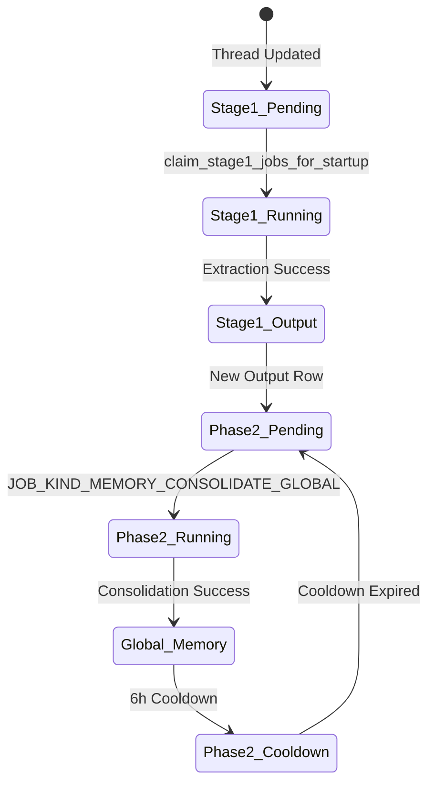

# 메모리 시스템

<details>
<summary>관련 소스 파일</summary>

다음 파일들은 이 위키 페이지를 생성하기 위한 컨텍스트로 사용되었습니다.

- [codex-rs/cli/src/state_db_recovery.rs](codex-rs/cli/src/state_db_recovery.rs)
- [codex-rs/core/tests/suite/sqlite_state.rs](codex-rs/core/tests/suite/sqlite_state.rs)
- [codex-rs/ext/memories/Cargo.toml](codex-rs/ext/memories/Cargo.toml)
- [codex-rs/ext/memories/src/backend.rs](codex-rs/ext/memories/src/backend.rs)
- [codex-rs/ext/memories/src/extension.rs](codex-rs/ext/memories/src/extension.rs)
- [codex-rs/ext/memories/src/lib.rs](codex-rs/ext/memories/src/lib.rs)
- [codex-rs/ext/memories/src/local.rs](codex-rs/ext/memories/src/local.rs)
- [codex-rs/ext/memories/src/local/ad_hoc_note.rs](codex-rs/ext/memories/src/local/ad_hoc_note.rs)
- [codex-rs/ext/memories/src/metrics.rs](codex-rs/ext/memories/src/metrics.rs)
- [codex-rs/ext/memories/src/tests.rs](codex-rs/ext/memories/src/tests.rs)
- [codex-rs/ext/memories/src/tools/ad_hoc_note.rs](codex-rs/ext/memories/src/tools/ad_hoc_note.rs)
- [codex-rs/ext/memories/src/tools/list.rs](codex-rs/ext/memories/src/tools/list.rs)
- [codex-rs/ext/memories/src/tools/read.rs](codex-rs/ext/memories/src/tools/read.rs)
- [codex-rs/ext/memories/src/tools/search.rs](codex-rs/ext/memories/src/tools/search.rs)
- [codex-rs/memories/write/Cargo.toml](codex-rs/memories/write/Cargo.toml)
- [codex-rs/memories/write/src/lib.rs](codex-rs/memories/write/src/lib.rs)
- [codex-rs/memories/write/src/phase1.rs](codex-rs/memories/write/src/phase1.rs)
- [codex-rs/memories/write/src/phase2.rs](codex-rs/memories/write/src/phase2.rs)
- [codex-rs/memories/write/src/runtime.rs](codex-rs/memories/write/src/runtime.rs)
- [codex-rs/memories/write/src/start.rs](codex-rs/memories/write/src/start.rs)
- [codex-rs/memories/write/src/startup_tests.rs](codex-rs/memories/write/src/startup_tests.rs)
- [codex-rs/model-provider-info/src/lib.rs](codex-rs/model-provider-info/src/lib.rs)
- [codex-rs/model-provider-info/src/model_provider_info_tests.rs](codex-rs/model-provider-info/src/model_provider_info_tests.rs)
- [codex-rs/model-provider/src/amazon_bedrock/catalog.rs](codex-rs/model-provider/src/amazon_bedrock/catalog.rs)
- [codex-rs/model-provider/src/amazon_bedrock/mod.rs](codex-rs/model-provider/src/amazon_bedrock/mod.rs)
- [codex-rs/model-provider/src/provider.rs](codex-rs/model-provider/src/provider.rs)
- [codex-rs/rollout/src/metadata.rs](codex-rs/rollout/src/metadata.rs)
- [codex-rs/rollout/src/state_db.rs](codex-rs/rollout/src/state_db.rs)
- [codex-rs/rollout/src/state_db_tests.rs](codex-rs/rollout/src/state_db_tests.rs)
- [codex-rs/state/Cargo.toml](codex-rs/state/Cargo.toml)
- [codex-rs/state/migrations/0002_logs.sql](codex-rs/state/migrations/0002_logs.sql)
- [codex-rs/state/migrations/0010_logs_process_id.sql](codex-rs/state/migrations/0010_logs_process_id.sql)
- [codex-rs/state/migrations/0023_drop_logs.sql](codex-rs/state/migrations/0023_drop_logs.sql)
- [codex-rs/state/src/bin/logs_client.rs](codex-rs/state/src/bin/logs_client.rs)
- [codex-rs/state/src/lib.rs](codex-rs/state/src/lib.rs)
- [codex-rs/state/src/log_db.rs](codex-rs/state/src/log_db.rs)
- [codex-rs/state/src/log_db_filter_tests.rs](codex-rs/state/src/log_db_filter_tests.rs)
- [codex-rs/state/src/model/log.rs](codex-rs/state/src/model/log.rs)
- [codex-rs/state/src/model/memories.rs](codex-rs/state/src/model/memories.rs)
- [codex-rs/state/src/model/mod.rs](codex-rs/state/src/model/mod.rs)
- [codex-rs/state/src/model/thread_metadata.rs](codex-rs/state/src/model/thread_metadata.rs)
- [codex-rs/state/src/runtime.rs](codex-rs/state/src/runtime.rs)
- [codex-rs/state/src/runtime/agent_jobs.rs](codex-rs/state/src/runtime/agent_jobs.rs)
- [codex-rs/state/src/runtime/backfill.rs](codex-rs/state/src/runtime/backfill.rs)
- [codex-rs/state/src/runtime/goals.rs](codex-rs/state/src/runtime/goals.rs)
- [codex-rs/state/src/runtime/logs.rs](codex-rs/state/src/runtime/logs.rs)
- [codex-rs/state/src/runtime/memories.rs](codex-rs/state/src/runtime/memories.rs)
- [codex-rs/state/src/runtime/threads.rs](codex-rs/state/src/runtime/threads.rs)
- [codex-rs/thread-store/src/local/update_thread_metadata.rs](codex-rs/thread-store/src/local/update_thread_metadata.rs)
- [codex-rs/thread-store/src/thread_metadata_sync.rs](codex-rs/thread-store/src/thread_metadata_sync.rs)
- [codex-rs/tui/src/startup_error.rs](codex-rs/tui/src/startup_error.rs)

</details>


메모리 시스템은 과거 대화 롤아웃에서 지속적인 지식을 추출하고, 통합하며, 현재 에이전트 컨텍스트에 주입하도록 설계된 다단계 파이프라인입니다. 이를 통해 에이전트는 장기적인 연속성을 유지하고, 사용자 선호를 기억하며, 서로 다른 세션에서 검증된 워크플로를 재사용할 수 있습니다.

## 아키텍처 개요

시스템은 두 가지 주요 단계인 **시작 추출(1단계)** 과 **전역 통합(2단계)** 으로 작동합니다. 이 단계들은 원시 실행 로그(롤아웃)의 데이터를 `MemoriesExtension`으로 관리되는 구조화되고 검색 가능한 메모리 폴더로 전환합니다.

### 메모리 파이프라인 데이터 흐름

다음 다이어그램은 완료된 롤아웃에서 새 세션에 주입되는 컨텍스트까지의 흐름을 보여 주며, 핵심 에이전트 로직과 `StateRuntime` 저장소 사이의 상호작용을 강조합니다.

**다이어그램: 메모리 추출 및 통합 파이프라인**
```mermaid
graph TD
    subgraph "codex-state (SQLite Storage)"
        [StateRuntime] --> [threads_table]
        [StateRuntime] --> [stage1_outputs_table]
        [StateRuntime] --> [jobs_table]
    end

    subgraph "Phase 1: Extraction (codex-core / memories-write)"
        [phase1::run] --> [claim_stage1_jobs_for_startup]
        [claim_stage1_jobs_for_startup] --> [Extraction_Agent]
        [Extraction_Agent] -- "GPT Summarization" --> [Stage1Output]
    end

    subgraph "Phase 2: Consolidation (codex-core / memories-write)"
        [phase2::run] --> [job::claim]
        [job::claim] --> [Consolidation_SubAgent]
        [Consolidation_SubAgent] -- "Markdown Generation" --> [FS_Sync]
    end

    subgraph "File System (codex_home/memories)"
        [rollout_jsonl] --> [phase1::run]
        [FS_Sync] --> [memory_summary.md]
        [FS_Sync] --> [skills_dir]
        [FS_Sync] --> [rollout_summaries_dir]
    end

    [Stage1Output] --> [stage1_outputs_table]
    [stage1_outputs_table] --> [phase2::run]
```
출처: [codex-rs/state/src/runtime/memories.rs:18-22](), [codex-rs/state/src/runtime/memories.rs:144-148](), [codex-rs/state/src/runtime.rs:126-132]()

---

## 1단계: 시작 추출

1단계는 "오래된" 스레드(마지막 메모리 추출 이후 업데이트된 스레드)를 식별하고, 이를 요약하기 위해 경량 에이전트를 실행합니다.

### 핵심 로직
1.  **작업 선택**: 시스템은 `threads` 테이블에서 수명 범위(`max_age_days`) 안에 있고 최소 기간(`min_rollout_idle_hours`) 동안 유휴 상태였던 활성 스레드를 스캔합니다 [codex-rs/state/src/runtime/memories.rs:163-165]().
2.  **동시성**: 추출 작업은 일반적으로 병렬 실행되며, `claim_stage1_jobs_for_startup` 메서드를 사용해 `Stage1JobClaim` 객체의 배치를 얻습니다 [codex-rs/state/src/runtime/memories.rs:144-148]().
3.  **오래됨 검사**: `threads.updated_at_ms`가 `stage1_outputs` 또는 `jobs`의 워터마크보다 크면 해당 스레드는 오래된 것으로 간주됩니다 [codex-rs/state/src/runtime/memories.rs:84-127]().
4.  **추출 출력**: 결과는 `raw_memory`(상세 마크다운)와 `rollout_summary`(간결한 요약)를 포함하는 `Stage1Output` 구조체입니다 [codex-rs/state/src/lib.rs:45-47]().
5.  **Claim 결과**: 작업 claim 시도는 `Stage1JobClaimOutcome`을 반환하며, 이는 `Claimed`, `SkippedUpToDate`, `SkippedRunning` 같은 상태를 처리합니다 [codex-rs/state/src/lib.rs:46-46]().
6.  **선호 모델**: 추출용 모델 선택은 provider가 재정의하지 않는 한 기본적으로 `gpt-5.4-mini`를 사용합니다 [codex-rs/model-provider/src/provider.rs:86-86](). 예를 들어 Amazon Bedrock provider는 이를 `AMAZON_BEDROCK_GPT_5_4_MODEL_ID`로 재정의합니다 [codex-rs/model-provider/src/amazon_bedrock/mod.rs:71-73]().

출처: [codex-rs/state/src/runtime/memories.rs:144-218](), [codex-rs/state/src/runtime/memories.rs:84-127](), [codex-rs/state/src/lib.rs:45-47](), [codex-rs/model-provider/src/provider.rs:86-86](), [codex-rs/model-provider/src/amazon_bedrock/mod.rs:71-73]()

---

## 2단계: 전역 통합

2단계는 개별 1단계 출력을 전역 메모리 구조로 병합합니다. 이 단계는 쓰기 경합을 방지하기 위해 전역 잠금으로 제어됩니다.

### 구현 세부 사항
*   **전역 잠금**: `codex_home`마다 한 번에 하나의 통합 프로세스만 실행될 수 있으며, 작업 종류 `memory_consolidate_global`과 키 `global`로 식별됩니다 [codex-rs/state/src/runtime/memories.rs:19-20]().
*   **쿨다운 기간**: 성공적인 전역 통합은 쿨다운(기본 6시간)을 트리거하며, 이 기간 동안 후속 claim은 `Phase2JobClaimOutcome::SkippedCooldown`을 반환합니다 [codex-rs/state/src/runtime/memories.rs:21-21]().
*   **워터마킹**: 시스템은 `jobs` 테이블의 `last_success_watermark`를 추적하여 1단계 출력의 증분 처리를 보장합니다 [codex-rs/state/src/runtime/memories.rs:109-124]().
*   **통합 모델**: 기본값은 `gpt-5.4`입니다 [codex-rs/model-provider/src/provider.rs:90-90]().

**다이어그램: 메모리 상태 전이**

출처: [codex-rs/state/src/runtime/memories.rs:18-22](), [codex-rs/state/src/runtime/memories.rs:144-157](), [codex-rs/model-provider/src/provider.rs:90-90]()

---

## 저장소와 지속성

`StateRuntime`은 메타데이터, 목표, 메모리 추출에 필요한 로그의 SQLite 지속성을 관리합니다.

### 데이터베이스 테이블
시스템은 `codex_home`에 위치한 주요 SQLite 데이터베이스들을 사용합니다.

| 테이블 | 목적 |
| :--- | :--- |
| `threads` | 스레드 생명주기, `memory_mode`, `updated_at_ms`를 추적합니다 [codex-rs/state/src/runtime/memories.rs:194-210](). |
| `stage1_outputs` | 개별 스레드의 `raw_memory`와 `rollout_summary`를 저장합니다 [codex-rs/state/src/runtime/memories.rs:66-74](). |
| `jobs` | `memory_stage1` 및 `memory_consolidate_global`의 lease와 retry 상태를 관리합니다 [codex-rs/state/src/runtime/memories.rs:108-124](). |
| `logs` | 스레드별 파티션 한도와 함께 대량의 피드백 및 추적 로그를 저장합니다 [codex-rs/state/src/runtime/logs.rs:17-43](). |
| `thread_goals` | 에이전트 목표, 상태, 토큰 사용량을 지속 저장합니다 [codex-rs/state/src/runtime/goals.rs:45-60](). |

### 런타임 초기화
`StateRuntime`은 `memories_1.sqlite` 데이터베이스를 초기화하고 `runtime_memories_migrator`를 통해 마이그레이션을 적용합니다 [codex-rs/state/src/runtime.rs:126-132](), [codex-rs/state/src/runtime.rs:186-190](). 또한 `state_5.sqlite`, `logs_2.sqlite`, `goals_1.sqlite`도 관리합니다 [codex-rs/state/src/lib.rs:87-90]().

출처: [codex-rs/state/src/runtime.rs:126-217](), [codex-rs/state/src/runtime/memories.rs:18-21](), [codex-rs/state/src/runtime/logs.rs:17-43](), [codex-rs/state/src/lib.rs:87-90](), [codex-rs/state/src/runtime/goals.rs:45-60]()

---

## Memories Extension과 도구

시스템은 `codex-rs/ext/memories` crate의 `MemoriesExtension`을 통해 통합된 메모리와 ad-hoc 노트 작성 기능을 에이전트에 노출합니다.

### 도구 인터페이스
`MemoriesExtensionConfig`에서 `dedicated_tools`가 활성화되면 extension은 에이전트 환경에 여러 도구를 제공합니다 [codex-rs/ext/memories/src/extension.rs:93-111]():
*   **`add_ad_hoc_note`**: 에이전트가 메모리 저장소에 새 마크다운 노트를 만들 수 있게 합니다 [codex-rs/ext/memories/src/lib.rs:19-19]().
*   **`list`**: 사용 가능한 메모리 파일을 나열합니다 [codex-rs/ext/memories/src/lib.rs:20-20]().
*   **`read`**: 토큰 제한 출력으로 특정 메모리 내용을 읽습니다 [codex-rs/ext/memories/src/lib.rs:21-21]().
*   **`search`**: 관련 내용을 찾기 위해 메모리 파일을 검색합니다 [codex-rs/ext/memories/src/lib.rs:22-22]().

### 컨텍스트 주입
`MemoriesExtension`은 `ContextContributor`로도 동작합니다. `memories` 디렉터리에서 `memory_summary.md` 파일을 읽고 이를 프롬프트 컨텍스트에 주입합니다 [codex-rs/ext/memories/src/extension.rs:49-69]().

**다이어그램: Extension 도구와 코드 엔티티 매핑**
```mermaid
graph LR
    subgraph "Extension Registry"
        [MemoriesExtension] --> [ToolContributor]
        [MemoriesExtension] --> [ContextContributor]
    end

    subgraph "MemoriesExtension (extension.rs)"
        [ToolContributor] --> [tools::memory_tools]
        [ContextContributor] --> [build_memory_tool_developer_instructions]
    end

    subgraph "Tools (tools/mod.rs)"
        [tools::memory_tools] --> [ADD_AD_HOC_NOTE_TOOL_NAME]
        [tools::memory_tools] --> [LIST_TOOL_NAME]
        [tools::memory_tools] --> [READ_TOOL_NAME]
        [tools::memory_tools] --> [SEARCH_TOOL_NAME]
    end

    subgraph "Backend (local.rs)"
        [ADD_AD_HOC_NOTE_TOOL_NAME] --> [LocalMemoriesBackend::add_ad_hoc_note]
        [READ_TOOL_NAME] --> [LocalMemoriesBackend::read]
    end
```
출처: [codex-rs/ext/memories/src/extension.rs:49-111](), [codex-rs/ext/memories/src/lib.rs:18-22](), [codex-rs/ext/memories/src/local.rs:24-27]()

---

## 컨텍스트 사용과 인용

메모리는 활성 대화에서의 유용성을 기준으로 우선순위가 지정되고 추적됩니다.

### 사용량 추적
에이전트가 한 턴 동안 특정 메모리를 사용하면, 시스템은 향후 우선순위 지정에 영향을 주기 위해 이 사용을 기록합니다.
*   **`record_stage1_output_usage`**: `stage1_outputs` 테이블에서 지정된 `thread_ids`의 `usage_count`를 증가시키고 `last_usage` 타임스탬프를 업데이트합니다 [codex-rs/state/src/runtime/memories.rs:51-82]().
*   **정리**: 사용자는 `clear_memory_data`를 사용해 전체 메모리 파이프라인을 재설정할 수 있으며, 이는 `stage1_outputs`의 모든 행을 삭제하고 관련 `jobs`를 재설정합니다 [codex-rs/state/src/runtime/memories.rs:43-45]().

### 로깅과 디버깅
Codex는 추적 및 피드백 로그를 위한 전용 `logs_2.sqlite` 데이터베이스를 유지합니다 [codex-rs/state/src/lib.rs:87-87]().
*   **`LogDbLayer`**: 로그를 배치로 묶어 백그라운드 큐로 보내는 tracing subscriber layer입니다 [codex-rs/state/src/log_db.rs:94-110]().
*   **`insert_logs`**: `LogEntry` 객체를 지속 저장하는 배치 삽입 함수입니다 [codex-rs/state/src/runtime/logs.rs:11-47]().
*   **파티셔닝**: 무제한적인 데이터베이스 증가를 방지하기 위해 로그는 스레드별 또는 프로세스별로 10 MiB / 1,000행 한도까지 정리됩니다 [codex-rs/state/src/runtime/logs.rs:49-141](), [codex-rs/state/src/runtime.rs:91-92]().
*   **CLI 도구**: `codex-state-logs` 바이너리를 사용하면 개발자가 명령줄에서 이러한 로그를 tail하고 필터링할 수 있습니다 [codex-rs/state/src/bin/logs_client.rs:14-69]().

출처: [codex-rs/state/src/runtime/memories.rs:43-82](), [codex-rs/state/src/runtime/logs.rs:11-141](), [codex-rs/state/src/log_db.rs:94-110](), [codex-rs/state/src/bin/logs_client.rs:14-69](), [codex-rs/state/src/lib.rs:87-87]()
