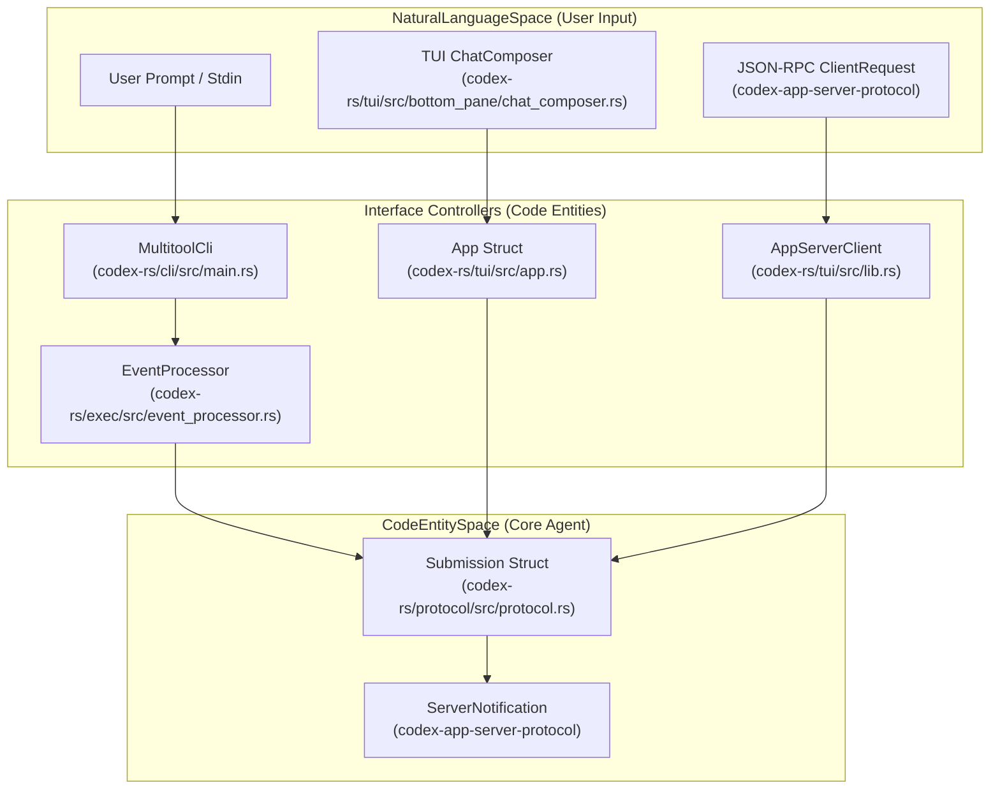
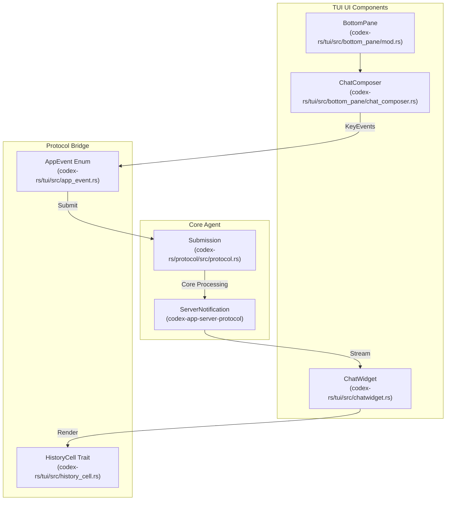

# 사용자 인터페이스

관련 소스 파일

다음 파일들은 이 위키 페이지를 생성하기 위한 컨텍스트로 사용되었습니다.

- [codex-rs/Cargo.lock](codex-rs/Cargo.lock)
- [codex-rs/Cargo.toml](codex-rs/Cargo.toml)
- [codex-rs/cli/Cargo.toml](codex-rs/cli/Cargo.toml)
- [codex-rs/cli/src/lib.rs](codex-rs/cli/src/lib.rs)
- [codex-rs/cli/src/main.rs](codex-rs/cli/src/main.rs)
- [codex-rs/core/Cargo.toml](codex-rs/core/Cargo.toml)
- [codex-rs/core/src/lib.rs](codex-rs/core/src/lib.rs)
- [codex-rs/exec/Cargo.toml](codex-rs/exec/Cargo.toml)
- [codex-rs/exec/src/cli.rs](codex-rs/exec/src/cli.rs)
- [codex-rs/exec/src/event_processor.rs](codex-rs/exec/src/event_processor.rs)
- [codex-rs/exec/src/event_processor_with_human_output.rs](codex-rs/exec/src/event_processor_with_human_output.rs)
- [codex-rs/exec/src/lib.rs](codex-rs/exec/src/lib.rs)
- [codex-rs/mcp-server/src/codex_tool_runner.rs](codex-rs/mcp-server/src/codex_tool_runner.rs)
- [codex-rs/protocol/src/protocol.rs](codex-rs/protocol/src/protocol.rs)
- [codex-rs/tui/Cargo.toml](codex-rs/tui/Cargo.toml)
- [codex-rs/tui/src/app.rs](codex-rs/tui/src/app.rs)
- [codex-rs/tui/src/app_event.rs](codex-rs/tui/src/app_event.rs)
- [codex-rs/tui/src/bottom_pane/chat_composer.rs](codex-rs/tui/src/bottom_pane/chat_composer.rs)
- [codex-rs/tui/src/bottom_pane/mod.rs](codex-rs/tui/src/bottom_pane/mod.rs)
- [codex-rs/tui/src/chatwidget.rs](codex-rs/tui/src/chatwidget.rs)
- [codex-rs/tui/src/chatwidget/slash_dispatch.rs](codex-rs/tui/src/chatwidget/slash_dispatch.rs)
- [codex-rs/tui/src/chatwidget/tests.rs](codex-rs/tui/src/chatwidget/tests.rs)
- [codex-rs/tui/src/chatwidget/tests/slash_commands.rs](codex-rs/tui/src/chatwidget/tests/slash_commands.rs)
- [codex-rs/tui/src/cli.rs](codex-rs/tui/src/cli.rs)
- [codex-rs/tui/src/lib.rs](codex-rs/tui/src/lib.rs)
- [codex-rs/tui/src/slash_command.rs](codex-rs/tui/src/slash_command.rs)

## 목적과 범위

이 문서는 사용자가 Codex와 상호작용하는 사용자 대면 인터페이스를 설명합니다. 인터랙티브 세션을 위한 **Terminal User Interface (TUI)**, 비대화형 자동화를 위한 **headless execution mode**(`codex exec`), 여러 모드로 dispatch하는 **CLI entry point**, IDE 통합을 위한 **App Server**를 다룹니다. 각 인터페이스는 서로 다른 상호작용 모델을 제공하지만, 동일한 underlying core engine과 protocol을 공유합니다.

이 인터페이스들의 설정은 [Configuration System](#2.2)을 참조하세요. 모든 인터페이스에서 async 통신을 조율하는 protocol layer는 [Protocol Layer (Submission/Event System)](#2.1)을 참조하세요.

---

## 실행 모드 개요

Codex는 서로 다른 사용 사례에 최적화된 여러 실행 모드를 지원합니다. 이 모드들은 `codex-protocol`을 통해 "Natural Language Space"(사용자 prompt)를 "Code Entity Space"(tool execution과 file change)로 연결합니다.

### 시스템 인터페이스 매핑

다음 다이어그램은 상위 수준 사용자 인터페이스를 실행을 처리하는 내부 코드 엔티티에 매핑합니다.

**실행 모드 특성:**

| 모드 | 대화형 | 출력 형식 | 주요 사용 사례 |
|------|-------------|---------------|------------------|
| TUI | 예 | 풍부한 terminal UI | 사람이 주도하는 개발 세션 |
| Exec | 아니요 | 일반 텍스트 또는 JSONL | CI/CD, scripting, automation |
| Review | 아니요 | 일반 텍스트 | 코드 리뷰 workflow |
| App Server | 예(IDE를 통해) | JSON-RPC | IDE 통합(VS Code, Cursor) |
| Cloud Tasks| 예 | TUI/CLI | 원격 환경 실행 |

출처: [codex-rs/cli/src/main.rs:103-118](), [codex-rs/tui/src/app.rs:1-4](), [codex-rs/protocol/src/protocol.rs:155-165]()

---

## Terminal User Interface (TUI)

TUI는 Codex의 기본 대화형 인터페이스입니다. `ratatui`를 사용해 구축되었으며, `App` 구조체가 UI widget과 background agent thread 사이를 조율하는 event-driven 아키텍처를 따릅니다.

### 컴포넌트 계층과 데이터 흐름

TUI는 사용자 상호작용을 `Submission` 항목으로 매핑하고, `ServerNotification` stream을 `HistoryCell` 단위로 렌더링합니다.

**주요 TUI 컴포넌트:**

| 컴포넌트 | 파일 | 책임 |
|-----------|------|----------------|
| `App` | [codex-rs/tui/src/app.rs:1-4]() | 최상위 application state와 high-level run loop 조율. |
| `ChatWidget` | [codex-rs/tui/src/chatwidget.rs:1-10]() | protocol event를 소비하고, `HistoryCell` 단위를 관리하며, streaming active cell을 처리합니다. |
| `BottomPane` | [codex-rs/tui/src/bottom_pane/mod.rs:1-12]() | interactive footer, input routing, transient popup view를 관리합니다. |
| `ChatComposer` | [codex-rs/tui/src/bottom_pane/chat_composer.rs:1-11]() | text input, slash command promotion, large paste handling을 위한 state machine입니다. |
| `HistoryCell` | [codex-rs/tui/src/app.rs:43-43]() | 커밋된 대화 항목이 transcript에 렌더링되는 방식을 정의하는 trait입니다. |

자세한 내용은 [Terminal User Interface (TUI)](#4.1)를 참조하세요.

---

## Headless Execution Mode (codex exec)

Headless mode는 지속적인 UI 없이 CLI에서 Codex command를 실행할 수 있게 합니다. `codex exec` 또는 `codex review`로 호출됩니다. 표준 stream에 agent 진행 상황을 형식화하기 위해 특수 processor를 사용합니다.

- **비대화형**: 주로 CLI argument나 `stdin`에서 읽습니다. [codex-rs/cli/src/main.rs:122-124]()
- **이벤트 처리**: 비대화형 사용자를 위한 terminal output formatting을 처리하기 위해 `EventProcessorWithHumanOutput`을 사용합니다. [codex-rs/exec/src/lib.rs:101-101]()
- **Review Command**: sub-agent에 코드 리뷰를 위임하도록 특별히 맞춰져 있습니다. [codex-rs/cli/src/main.rs:127-127]()

출처: [codex-rs/cli/src/main.rs:121-127](), [codex-rs/exec/src/lib.rs:156-170]()

자세한 내용은 [Headless Execution Mode (codex exec)](#4.2)를 참조하세요.

---

## CLI Entry Points와 Multitool Dispatch

`codex` binary는 `MultitoolCli` 구조체에 정의된 subcommand를 기준으로 서로 다른 실행 모드에 dispatch하는 multitool로 동작합니다. entry point는 configuration loading, feature flag processing, environment setup을 처리합니다.

출처: [codex-rs/cli/src/main.rs:103-118](), [codex-rs/cli/src/main.rs:120-209]()

자세한 내용은 [CLI Entry Points and Multitool Dispatch](#4.3)를 참조하세요.

---

## 세션 재개와 Forking

Codex는 기존 thread를 재개하거나 이를 fork하여 독립적인 대화 경로를 만들 수 있습니다. TUI는 특수한 resumption logic을 통해 이를 관리합니다.

- **Resume**: thread ID 또는 이름으로 thread를 복원하며, 보통 `ResumeCommand`를 사용합니다. [codex-rs/cli/src/main.rs:178-178]()
- **Fork**: `ForkCommand`를 통해 현재 session state를 기반으로 새 thread를 생성합니다. [codex-rs/cli/src/main.rs:189-190]()
- **State DB**: workspace 전반에서 지속적인 session state와 history를 관리하기 위해 `StateDbHandle`을 사용합니다. [codex-rs/tui/src/lib.rs:57-58]()

출처: [codex-rs/cli/src/main.rs:178-191](), [codex-rs/tui/src/lib.rs:16-17]()

자세한 내용은 [Session Resumption and Forking](#4.4)를 참조하세요.

---

## App Server와 IDE 통합

App Server는 JSON-RPC protocol을 통해 IDE client에 Codex 기능을 노출합니다. `InProcessAppServerClient` 또는 `RemoteAppServerClient` 같은 특수 client를 통해 통신을 용이하게 합니다.

출처: [codex-rs/tui/src/lib.rs:23-31](), [codex-rs/tui/src/app.rs:86-90]()

자세한 내용은 [App Server and IDE Integration](#4.5)을 참조하세요.

---

## Cloud Tasks (codex cloud)

`codex-cloud-tasks` crate는 Codex Cloud와 상호작용하기 위한 특수 인터페이스를 제공합니다. 사용자는 전용 CLI subcommand를 통해 remote environment에 task를 제출하고 관리할 수 있습니다.

출처: [codex-rs/cli/src/main.rs:192-194](), [codex-rs/Cargo.toml:25-27]()

자세한 내용은 [Cloud Tasks (codex cloud)](#4.6)를 참조하세요.

---

## Exec Server

`codex-exec-server` crate는 subprocess를 생성하고 제어하기 위한 standalone JSON-RPC WebSocket server를 제공합니다. 이를 통해 Codex는 `EnvironmentManager`가 관리하는 표준 wire protocol을 통해 remote 또는 sandboxed execution environment를 관리할 수 있습니다.

출처: [codex-rs/tui/src/lib.rs:46-47](), [codex-rs/tui/src/app.rs:141-141]()

자세한 내용은 [Exec Server](#4.7)를 참조하세요.

---

## 출처 요약

- **App Orchestration**: [codex-rs/tui/src/app.rs:1-4]()
- **TUI Core**: [codex-rs/tui/src/chatwidget.rs:1-10](), [codex-rs/tui/src/lib.rs:115-117]()
- **Input System**: [codex-rs/tui/src/bottom_pane/mod.rs:1-12](), [codex-rs/tui/src/bottom_pane/chat_composer.rs:1-11]()
- **CLI Dispatch**: [codex-rs/cli/src/main.rs:103-118](), [codex-rs/cli/src/main.rs:120-209]()
- **Session Persistence**: [codex-rs/tui/src/lib.rs:57-58](), [codex-rs/tui/src/lib.rs:170-180]()
- **App Server**: [codex-rs/tui/src/lib.rs:23-31]()
- **Protocol Submission**: [codex-rs/protocol/src/protocol.rs:155-165]()
