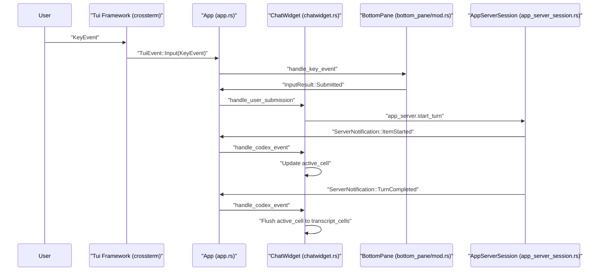

# Terminal User Interface (TUI)

<details>
<summary>관련 소스 파일</summary>

다음 파일들은 이 위키 페이지를 생성하기 위한 컨텍스트로 사용되었습니다.

- [codex-rs/exec/src/event_processor_with_human_output.rs](codex-rs/exec/src/event_processor_with_human_output.rs)
- [codex-rs/mcp-server/src/codex_tool_runner.rs](codex-rs/mcp-server/src/codex_tool_runner.rs)
- [codex-rs/protocol/src/protocol.rs](codex-rs/protocol/src/protocol.rs)
- [codex-rs/tui/src/app.rs](codex-rs/tui/src/app.rs)
- [codex-rs/tui/src/app/background_requests.rs](codex-rs/tui/src/app/background_requests.rs)
- [codex-rs/tui/src/app/config_persistence.rs](codex-rs/tui/src/app/config_persistence.rs)
- [codex-rs/tui/src/app/event_dispatch.rs](codex-rs/tui/src/app/event_dispatch.rs)
- [codex-rs/tui/src/app/session_lifecycle.rs](codex-rs/tui/src/app/session_lifecycle.rs)
- [codex-rs/tui/src/app/test_support.rs](codex-rs/tui/src/app/test_support.rs)
- [codex-rs/tui/src/app/tests.rs](codex-rs/tui/src/app/tests.rs)
- [codex-rs/tui/src/app/thread_events.rs](codex-rs/tui/src/app/thread_events.rs)
- [codex-rs/tui/src/app/thread_routing.rs](codex-rs/tui/src/app/thread_routing.rs)
- [codex-rs/tui/src/app/thread_session_state.rs](codex-rs/tui/src/app/thread_session_state.rs)
- [codex-rs/tui/src/app_event.rs](codex-rs/tui/src/app_event.rs)
- [codex-rs/tui/src/app_server_session.rs](codex-rs/tui/src/app_server_session.rs)
- [codex-rs/tui/src/bottom_pane/chat_composer.rs](codex-rs/tui/src/bottom_pane/chat_composer.rs)
- [codex-rs/tui/src/bottom_pane/mod.rs](codex-rs/tui/src/bottom_pane/mod.rs)
- [codex-rs/tui/src/chatwidget.rs](codex-rs/tui/src/chatwidget.rs)
- [codex-rs/tui/src/chatwidget/plugins.rs](codex-rs/tui/src/chatwidget/plugins.rs)
- [codex-rs/tui/src/chatwidget/slash_dispatch.rs](codex-rs/tui/src/chatwidget/slash_dispatch.rs)
- [codex-rs/tui/src/chatwidget/snapshots/codex_tui__chatwidget__tests__plugins_popup_curated_marketplace.snap](codex-rs/tui/src/chatwidget/snapshots/codex_tui__chatwidget__tests__plugins_popup_curated_marketplace.snap)
- [codex-rs/tui/src/chatwidget/snapshots/codex_tui__chatwidget__tests__plugins_popup_search_filtered.snap](codex-rs/tui/src/chatwidget/snapshots/codex_tui__chatwidget__tests__plugins_popup_search_filtered.snap)
- [codex-rs/tui/src/chatwidget/tests.rs](codex-rs/tui/src/chatwidget/tests.rs)
- [codex-rs/tui/src/chatwidget/tests/composer_submission.rs](codex-rs/tui/src/chatwidget/tests/composer_submission.rs)
- [codex-rs/tui/src/chatwidget/tests/exec_flow.rs](codex-rs/tui/src/chatwidget/tests/exec_flow.rs)
- [codex-rs/tui/src/chatwidget/tests/helpers.rs](codex-rs/tui/src/chatwidget/tests/helpers.rs)
- [codex-rs/tui/src/chatwidget/tests/history_replay.rs](codex-rs/tui/src/chatwidget/tests/history_replay.rs)
- [codex-rs/tui/src/chatwidget/tests/permissions.rs](codex-rs/tui/src/chatwidget/tests/permissions.rs)
- [codex-rs/tui/src/chatwidget/tests/plan_mode.rs](codex-rs/tui/src/chatwidget/tests/plan_mode.rs)
- [codex-rs/tui/src/chatwidget/tests/popups_and_settings.rs](codex-rs/tui/src/chatwidget/tests/popups_and_settings.rs)
- [codex-rs/tui/src/chatwidget/tests/review_mode.rs](codex-rs/tui/src/chatwidget/tests/review_mode.rs)
- [codex-rs/tui/src/chatwidget/tests/slash_commands.rs](codex-rs/tui/src/chatwidget/tests/slash_commands.rs)
- [codex-rs/tui/src/chatwidget/tests/status_and_layout.rs](codex-rs/tui/src/chatwidget/tests/status_and_layout.rs)
- [codex-rs/tui/src/custom_terminal.rs](codex-rs/tui/src/custom_terminal.rs)
- [codex-rs/tui/src/insert_history.rs](codex-rs/tui/src/insert_history.rs)
- [codex-rs/tui/src/render/highlight.rs](codex-rs/tui/src/render/highlight.rs)
- [codex-rs/tui/src/render/snapshots/codex_tui__render__highlight__tests__ansi_family_foreground_palette.snap](codex-rs/tui/src/render/snapshots/codex_tui__render__highlight__tests__ansi_family_foreground_palette.snap)
- [codex-rs/tui/src/shimmer.rs](codex-rs/tui/src/shimmer.rs)
- [codex-rs/tui/src/slash_command.rs](codex-rs/tui/src/slash_command.rs)
- [codex-rs/tui/src/snapshots/codex_tui__diff_render__tests__theme_scope_background_resolution.snap](codex-rs/tui/src/snapshots/codex_tui__diff_render__tests__theme_scope_background_resolution.snap)
- [codex-rs/tui/src/style.rs](codex-rs/tui/src/style.rs)
- [codex-rs/tui/src/terminal_palette.rs](codex-rs/tui/src/terminal_palette.rs)
- [codex-rs/tui/src/terminal_probe.rs](codex-rs/tui/src/terminal_probe.rs)
- [codex-rs/tui/src/theme_picker.rs](codex-rs/tui/src/theme_picker.rs)
- [codex-rs/tui/src/tui.rs](codex-rs/tui/src/tui.rs)

</details>


## 목적과 범위

Terminal User Interface(TUI)는 Codex의 기본 대화형 컴포넌트이며, `ratatui` 렌더링 라이브러리를 활용하는 완전한 기능의 terminal application으로 구현되어 있습니다 [codex-rs/tui/src/tui.rs:68](). 사용자에게 실시간 대화 표시, 입력 작성, approval workflow, multi-agent thread 관리, 다양한 UI overlay를 제공합니다.

이 페이지는 TUI의 아키텍처, 컴포넌트 계층, event-driven 설계를 상위 수준에서 개관합니다. 개별 하위 시스템에 대한 자세한 설명은 연결된 하위 페이지를 참조하세요.

- **[App Event Loop and Initialization](#4.1.1)** — `App` 구조체, main event loop, in-process app server client, 전체 startup sequence를 다룹니다.
- **[ChatWidget and Conversation Display](#4.1.2)** — `ChatWidget` rendering, `HistoryCell` trait, streaming active cell 처리, transcript overlay를 자세히 설명합니다.
- **[BottomPane and Input System](#4.1.3)** — bottom pane UI stack, `ChatComposer` text input, input event processing, slash command mechanism을 문서화합니다.
- **[Status Line and Footer Rendering](#4.1.4)** — `StatusIndicatorWidget`, task running animation, interrupt hint를 설명합니다.
- **[Interactive Overlays and Popups](#4.1.5)** — approval overlay, selection popup, user input request, MCP elicitation form을 설명합니다.

TUI는 event stream과 command submission channel을 통해 Codex core backend와 긴밀하게 통합되지만, 반응성 있는 사용자 경험을 제공하기 위해 UI state는 독립적으로 유지합니다 [codex-rs/tui/src/chatwidget.rs:1-10]().

---

## 컴포넌트 계층

### TUI 구조 개요

핵심적으로 TUI는 최상위 `App` 구조체가 조율하는 layered widget 아키텍처를 사용합니다 [codex-rs/tui/src/app.rs:1-5](). UI는 대화 transcript display, input area, status footer, interactive overlay로 구성되며, 모두 내부 event bus를 통해 조율됩니다.

Title: TUI Component Hierarchy
```mermaid
graph TB
    subgraph "MainEventLoop"
        [App] --> [TuiFramework]
        [App] --> [AppEventChannel]
        [App] -- "app.rs" --> [AppCoordinator]
    end
    
    subgraph "PrimaryUISurface"
        [ChatWidget] -- "chatwidget.rs" --> [TranscriptCells]
        [ChatWidget] --> [ActiveCell]
        [TranscriptCells] -- "Vec<Arc<dyn HistoryCell>>" --> [HistoryCells]
    end
    
    subgraph "BottomPaneStack"
        [BottomPane] -- "bottom_pane/mod.rs" --> [ChatComposer]
        [BottomPane] --> [ViewStack]
        [BottomPane] --> [StatusWidget]
        [ViewStack] -- "Vec<Box<dyn BottomPaneView>>" --> [Popups]
    end
    
    subgraph "HistoryCellImplementations"
        [HistoryCell] -- "trait" --> [UserHistoryCell]
        [HistoryCell] --> [AgentMessageCell]
        [HistoryCell] --> [ExecCell]
        [HistoryCell] --> [McpToolCallCell]
    end
    
    subgraph "ProtocolIntegration"
        [AppServerSession] -- "app_server_session.rs" --> [EventStream]
        [ChatWidget] --> [AppCommand]
    end
```

- **App (`app.rs`)** 는 중앙 coordinator 역할을 하며, rendering, input routing, multi-threading, app 전체 event bus를 관리합니다 [codex-rs/tui/src/app.rs:1-5]().
- **ChatWidget (`chatwidget.rs`)** 은 완료된 transcript cell과 현재 streaming 중인 cell을 포함한 대화 history를 보유합니다 [codex-rs/tui/src/chatwidget.rs:3-7](). protocol event를 점진적인 UI update로 변환합니다.
- **BottomPane (`bottom_pane/mod.rs`)** 은 text input(`ChatComposer`를 통해)을 포함한 interactive footer area와 임시 popup 또는 modal을 위한 overlay stack을 처리합니다 [codex-rs/tui/src/bottom_pane/mod.rs:1-5]().
- **HistoryCell (`history_cell.rs`)** 은 모든 transcript entry의 rendering interface를 정의하며, 서로 다른 유형의 대화 content에 대해 특수화된 display mode를 지원합니다.

**출처:** [codex-rs/tui/src/app.rs:1-5](), [codex-rs/tui/src/chatwidget.rs:1-22](), [codex-rs/tui/src/bottom_pane/mod.rs:1-15]()

---

## Event-Driven 아키텍처

TUI는 user input과 core protocol event라는 두 가지 상호 보완적인 event flow를 중심으로 설계되어 있습니다. 이들은 main application loop에서 합쳐져 blocking 없이 반응성 있는 UI update를 가능하게 합니다.

### 이벤트 흐름 시퀀스

Title: TUI Event Flow


- **입력 경로:** 사용자 keyboard event는 TUI framework(`crossterm`)에 의해 캡처되고, `TuiEvent`로 `App`에 전파되며, widget tree로 routing됩니다 [codex-rs/tui/src/tui.rs:49-50](). bottom pane과 `ChatComposer`는 text editing 및 slash command를 위한 대부분의 입력을 처리합니다 [codex-rs/tui/src/bottom_pane/chat_composer.rs:12-18]().
- **Protocol 경로:** Core backend event는 `AppServerSession`에서 `App`으로 흐르고, `App`은 이를 `ChatWidget`으로 dispatch합니다 [codex-rs/tui/src/chatwidget.rs:3-4](). `ChatWidget`은 대화 표시를 업데이트하며 output을 active 또는 committed cell로 buffering합니다.
- **AppEvent Bus:** Component들은 popup opening, configuration persistence, quit 같은 action을 위한 내부 조율 mechanism으로 `AppEvent`를 broadcast합니다 [codex-rs/tui/src/app_event.rs:1-9]().
- **Streaming Animation:** Output streaming은 `ChatWidget`의 특수 event와 cache key를 통해 조율되어, UI가 draw마다 전체를 다시 만들지 않고도 cached tail을 refresh할 수 있게 합니다 [codex-rs/tui/src/chatwidget.rs:12-16]().

**출처:** [codex-rs/tui/src/app_event.rs:1-10](), [codex-rs/tui/src/chatwidget.rs:1-20](), [codex-rs/tui/src/bottom_pane/chat_composer.rs:12-18](), [codex-rs/tui/src/tui.rs:49-50]()

---

## 주요 컴포넌트

### App

main controller struct인 `App`은 전체 terminal UI 생명주기를 조율합니다 [codex-rs/tui/src/app.rs:1-4]().

- high-level run loop를 관리하고 focused app submodule들을 조율합니다 [codex-rs/tui/src/app.rs:1-4]().
- `AppServerSession`을 통한 thread management를 포함해 global application state를 처리합니다 [codex-rs/tui/src/app.rs:19-20]().
- key event를 `BottomPane`이나 `ChatWidget` 같은 적절한 UI surface로 routing합니다 [codex-rs/tui/src/bottom_pane/mod.rs:7-12]().

자세한 설명은 **[App Event Loop and Initialization](#4.1.1)** 을 참조하세요.

**출처:** [codex-rs/tui/src/app.rs:1-4](), [codex-rs/tui/src/bottom_pane/mod.rs:7-12]()

### ChatWidget

`ChatWidget`은 conversation view이자 state machine으로 동작합니다 [codex-rs/tui/src/chatwidget.rs:3-4]().

- protocol event를 소비하고 history cell을 build/update합니다 [codex-rs/tui/src/chatwidget.rs:3-4]().
- streaming 중 제자리에서 mutate될 수 있는 `active_cell`을 관리합니다 [codex-rs/tui/src/chatwidget.rs:6-8]().
- composer에서 dispatch된 뒤 slash-command acceptance를 처리합니다 [codex-rs/tui/src/chatwidget.rs:29-31]().

자세한 설명은 **[ChatWidget and Conversation Display](#4.1.2)** 를 참조하세요.

**출처:** [codex-rs/tui/src/chatwidget.rs:1-31]()

### BottomPane

`BottomPane`은 main chat viewport 아래의 interactive footer를 관리합니다 [codex-rs/tui/src/bottom_pane/mod.rs:1-5]().

- editable prompt input을 위한 `ChatComposer`를 소유합니다 [codex-rs/tui/src/bottom_pane/mod.rs:3-4]().
- composer를 일시적으로 대체하는 `BottomPaneView` stack(popup/modal)을 유지합니다 [codex-rs/tui/src/bottom_pane/mod.rs:4-5]().
- active view가 `Ctrl+C`를 소비해 자신을 dismiss하도록 하는 등 특정 input routing을 처리합니다 [codex-rs/tui/src/bottom_pane/mod.rs:9-12]().

input routing, composer state machine, popup management에 대한 자세한 내용은 **[BottomPane and Input System](#4.1.3)** 을 참조하세요.

**출처:** [codex-rs/tui/src/bottom_pane/mod.rs:1-15](), [codex-rs/tui/src/bottom_pane/chat_composer.rs:1-10]()

### HistoryCell 시스템

`HistoryCell` trait는 대화 history의 표시 가능한 모든 chunk에 대한 abstraction을 정의합니다.

| Cell Type           | 설명                                          | 위치                               |
|---------------------|------------------------------------------------------|--------------------------------------|
| `UserHistoryCell`    | attachment와 mention을 포함한 사용자 메시지를 표시합니다 | [codex-rs/tui/src/chatwidget/tests.rs:21]() |
| `AgentMessageCell`   | assistant markdown으로 assistant message를 표시합니다    | [codex-rs/tui/src/chatwidget.rs:100]() |
| `HistoryCell` trait  | 모든 history display item을 위한 base trait             | [codex-rs/tui/src/app.rs:43]() |

overlay transcript display(`Ctrl+T`)는 `active_cell`의 live tail을 committed history에 append합니다 [codex-rs/tui/src/chatwidget.rs:8-10]().

**출처:** [codex-rs/tui/src/chatwidget.rs:1-10](), [codex-rs/tui/src/chatwidget/tests.rs:21](), [codex-rs/tui/src/app.rs:43]()

---

## Slash Commands

Slash command는 입력에 `/` prefix를 입력하여 시작하는 일반 작업에 빠르게 접근할 수 있게 합니다 [codex-rs/tui/src/slash_command.rs:7-12]().

- command는 `SlashCommand` enum에 열거되어 있습니다 [codex-rs/tui/src/slash_command.rs:12]().
- 예로는 selection을 위한 `/model`, diff analysis를 위한 `/review`, tool inspection을 위한 `/mcp`가 있습니다 [codex-rs/tui/src/slash_command.rs:80-137]().
- 일부 command는 inline argument를 지원합니다(예: `/review ...`, `/plan ...`) [codex-rs/tui/src/slash_command.rs:157-174]().
- active task 중에는 availability가 제한될 수 있습니다 [codex-rs/tui/src/slash_command.rs:182-185]().

**출처:** [codex-rs/tui/src/slash_command.rs:1-185]()

---

## Status와 Footer

bottom footer는 system state에 대한 동적인 시각적 feedback을 제공합니다.

- spinner와 interrupt hint를 구동하는 단일 "task running" indicator를 표시합니다 [codex-rs/tui/src/chatwidget.rs:18-19]().
- agent turn과 MCP server startup의 lifecycle을 독립적으로 추적합니다 [codex-rs/tui/src/chatwidget.rs:20-22]().
- preamble-capable model의 경우 commentary streaming 중 중복 progress indicator를 피하기 위해 status row의 visibility를 관리합니다 [codex-rs/tui/src/chatwidget.rs:24-27]().

구체적인 rendering 세부 사항은 **[Status Line and Footer Rendering](#4.1.4)** 을 참조하세요.

**출처:** [codex-rs/tui/src/chatwidget.rs:18-28]()

---

## 자연어에서 코드 엔티티 공간으로 연결

### 다이어그램: 사용자 상호작용에서 코드 엔티티 매핑으로

Title: User Interaction to Code Mapping
```mermaid
graph LR
    [UserInput] -- "Natural Language / Commands" --> [KeyEvent]
    [KeyEvent] -- "crossterm event" --> [AppStruct]
    [AppStruct] -- "codex-rs/tui/src/app.rs" --> [BottomPane]
    [BottomPane] -- "codex-rs/tui/src/bottom_pane/mod.rs" --> [ChatComposer]
    [ChatComposer] -- "codex-rs/tui/src/bottom_pane/chat_composer.rs" --> [SlashCommandEnum]
    [ChatComposer] -- "Submit Turn" --> [AppStruct]
    [AppStruct] --> [ChatWidget]
    [ChatWidget] -- "codex-rs/tui/src/chatwidget.rs" --> [AppServerSession]
    [AppServerSession] -- "codex-rs/tui/src/app_server_session.rs" --> [AppServer]
```

### 다이어그램: UI 컴포넌트-Protocol 통합 세부 사항

Title: UI-Protocol Integration
```mermaid
graph TD
    [UserInput] --> [AppMainLoop]
    [AppMainLoop] -- "app.rs" --> [BottomPane]
    [BottomPane] --> [AppEventBus]
    [AppMainLoop] --> [ChatWidget]
    [ChatWidget] --> [AppServerSession]
    [AppServerSession] -- "app_server_session.rs" --> [ServerNotification]
    [ServerNotification] -- "app-server-protocol" --> [AppMainLoop]
    [AppMainLoop] --> [ChatWidget]
    [ChatWidget] --> [HistoryCells]
    [ChatWidget] --> [ActiveCell]
    [AppEventBus] -- "app_event.rs" --> [AppMainLoop]
```

**출처:** [codex-rs/tui/src/app.rs:1-10](), [codex-rs/tui/src/chatwidget.rs:1-30](), [codex-rs/tui/src/bottom_pane/mod.rs:1-15]()
