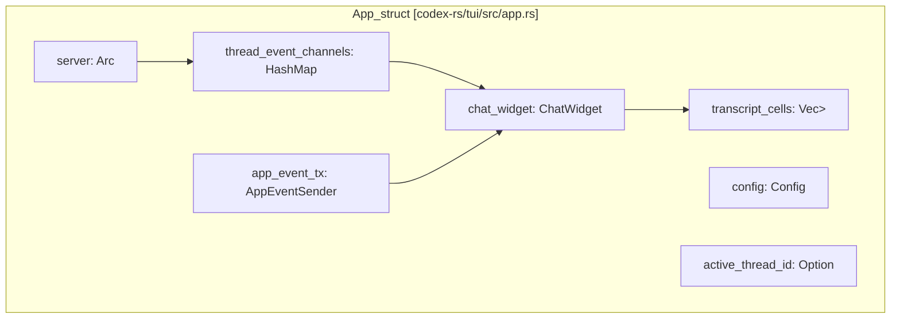
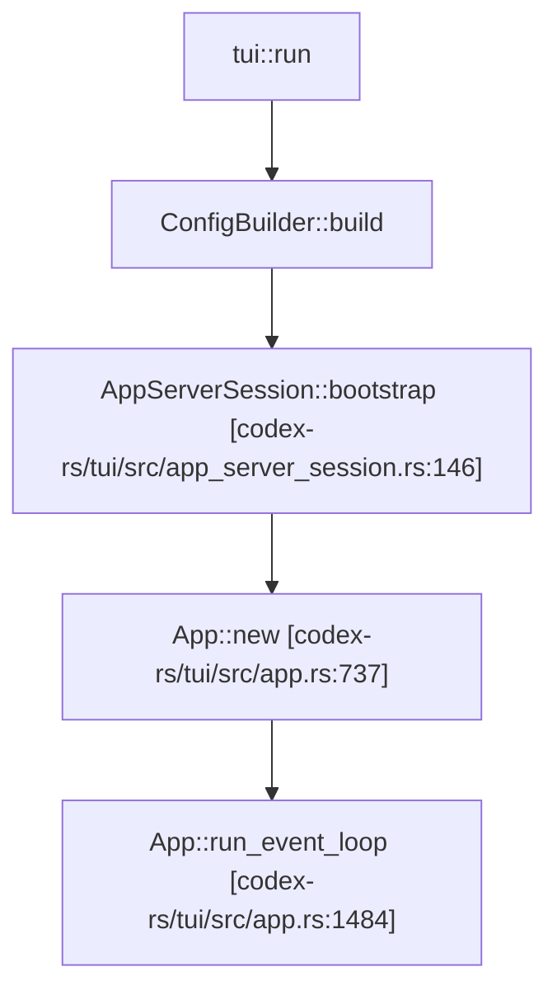
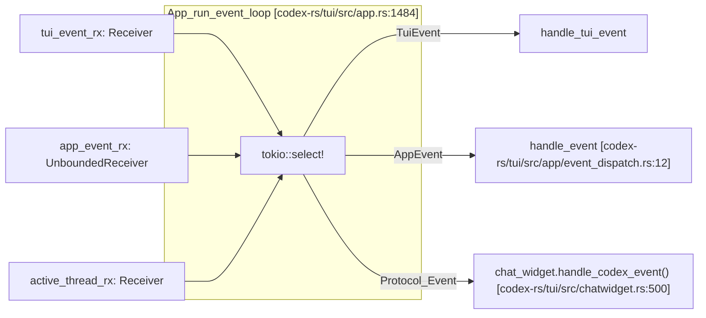
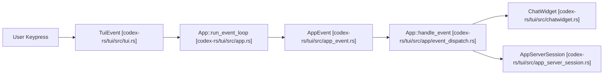
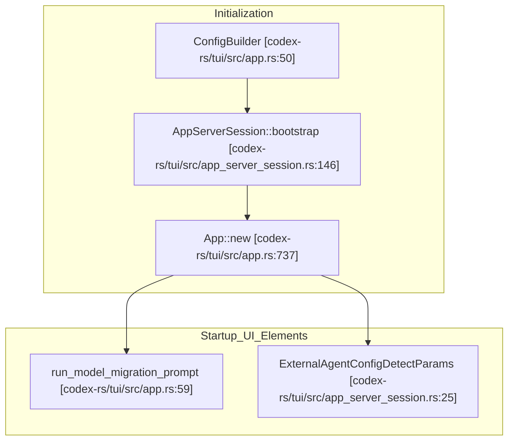

# App 이벤트 루프와 초기화

관련 소스 파일

다음 파일들은 이 위키 페이지를 생성하기 위한 컨텍스트로 사용되었습니다.

- [codex-rs/exec/src/event_processor_with_human_output.rs](codex-rs/exec/src/event_processor_with_human_output.rs)
- [codex-rs/mcp-server/src/codex_tool_runner.rs](codex-rs/mcp-server/src/codex_tool_runner.rs)
- [codex-rs/protocol/src/protocol.rs](codex-rs/protocol/src/protocol.rs)
- [codex-rs/tui/src/app.rs](codex-rs/tui/src/app.rs)
- [codex-rs/tui/src/app/background_requests.rs](codex-rs/tui/src/app/background_requests.rs)
- [codex-rs/tui/src/app/config_persistence.rs](codex-rs/tui/src/app/config_persistence.rs)
- [codex-rs/tui/src/app/event_dispatch.rs](codex-rs/tui/src/app/event_dispatch.rs)
- [codex-rs/tui/src/app/session_lifecycle.rs](codex-rs/tui/src/app/session_lifecycle.rs)
- [codex-rs/tui/src/app/test_support.rs](codex-rs/tui/src/app/test_support.rs)
- [codex-rs/tui/src/app/tests.rs](codex-rs/tui/src/app/tests.rs)
- [codex-rs/tui/src/app/thread_events.rs](codex-rs/tui/src/app/thread_events.rs)
- [codex-rs/tui/src/app/thread_routing.rs](codex-rs/tui/src/app/thread_routing.rs)
- [codex-rs/tui/src/app/thread_session_state.rs](codex-rs/tui/src/app/thread_session_state.rs)
- [codex-rs/tui/src/app_event.rs](codex-rs/tui/src/app_event.rs)
- [codex-rs/tui/src/app_server_session.rs](codex-rs/tui/src/app_server_session.rs)
- [codex-rs/tui/src/bottom_pane/chat_composer.rs](codex-rs/tui/src/bottom_pane/chat_composer.rs)
- [codex-rs/tui/src/bottom_pane/mod.rs](codex-rs/tui/src/bottom_pane/mod.rs)
- [codex-rs/tui/src/chatwidget.rs](codex-rs/tui/src/chatwidget.rs)
- [codex-rs/tui/src/chatwidget/plugins.rs](codex-rs/tui/src/chatwidget/plugins.rs)
- [codex-rs/tui/src/chatwidget/slash_dispatch.rs](codex-rs/tui/src/chatwidget/slash_dispatch.rs)
- [codex-rs/tui/src/chatwidget/snapshots/codex_tui__chatwidget__tests__plugins_popup_curated_marketplace.snap](codex-rs/tui/src/chatwidget/snapshots/codex_tui__chatwidget__tests__plugins_popup_curated_marketplace.snap)
- [codex-rs/tui/src/chatwidget/snapshots/codex_tui__chatwidget__tests__plugins_popup_search_filtered.snap](codex-rs/tui/src/chatwidget/snapshots/codex_tui__chatwidget__tests__plugins_popup_search_filtered.snap)
- [codex-rs/tui/src/chatwidget/tests.rs](codex-rs/tui/src/chatwidget/tests.rs)
- [codex-rs/tui/src/chatwidget/tests/composer_submission.rs](codex-rs/tui/src/chatwidget/tests/composer_submission.rs)
- [codex-rs/tui/src/chatwidget/tests/exec_flow.rs](codex-rs/tui/src/chatwidget/tests/exec_flow.rs)
- [codex-rs/tui/src/chatwidget/tests/helpers.rs](codex-rs/tui/src/chatwidget/tests/helpers.rs)
- [codex-rs/tui/src/chatwidget/tests/history_replay.rs](codex-rs/tui/src/chatwidget/tests/history_replay.rs)
- [codex-rs/tui/src/chatwidget/tests/permissions.rs](codex-rs/tui/src/chatwidget/tests/permissions.rs)
- [codex-rs/tui/src/chatwidget/tests/plan_mode.rs](codex-rs/tui/src/chatwidget/tests/plan_mode.rs)
- [codex-rs/tui/src/chatwidget/tests/popups_and_settings.rs](codex-rs/tui/src/chatwidget/tests/popups_and_settings.rs)
- [codex-rs/tui/src/chatwidget/tests/review_mode.rs](codex-rs/tui/src/chatwidget/tests/review_mode.rs)
- [codex-rs/tui/src/chatwidget/tests/slash_commands.rs](codex-rs/tui/src/chatwidget/tests/slash_commands.rs)
- [codex-rs/tui/src/chatwidget/tests/status_and_layout.rs](codex-rs/tui/src/chatwidget/tests/status_and_layout.rs)
- [codex-rs/tui/src/slash_command.rs](codex-rs/tui/src/slash_command.rs)

## 목적과 범위

이 페이지는 Terminal User Interface(TUI) 안에서 `App` 구조체의 main event loop, initialization sequence, event dispatch mechanism, UI-server 통신에 사용되는 `AppServerSession` facade, startup flow를 문서화합니다. `App`은 terminal UI, 여러 conversation thread, UI component와 agent core 사이의 event routing을 관리하는 최상위 orchestrator입니다.

chat surface rendering과 protocol event handling의 자세한 내용은 [4.1.2 ChatWidget and Conversation Display]()에 있고, input handling과 composer state는 [4.1.3 Bottom Pane and Input System]()에 문서화되어 있습니다.

---

## App 구조체

`App` 구조체는 TUI state의 핵심 owner 역할을 합니다. rendering을 조율하고, 여러 conversation thread를 관리하며, event를 buffer 및 dispatch하고, 모든 component 간 message를 routing합니다.

### 주요 필드

| Field | Type | 역할 |
|-------|------|------|
| `server` | `Arc<dyn AppServerClient>` | App Server backend와의 통신을 처리하며, 흔히 in-process client로 구현됩니다. [codex-rs/tui/src/app.rs:642-642]() |
| `app_event_tx` | `AppEventSender` | 내부 UI-to-App 통신을 위한 unbounded async sender입니다. [codex-rs/tui/src/app.rs:645-645]() |
| `chat_widget` | `ChatWidget` | active thread의 conversation UI를 렌더링하는 main chat surface입니다. [codex-rs/tui/src/app.rs:646-646]() |
| `config` | `Config` | layered source에서 resolve된 현재 configuration state입니다. [codex-rs/tui/src/app.rs:647-647]() |
| `transcript_cells` | `Vec<Arc<dyn HistoryCell>>` | transcript overlay에 표시되는 committed history cell 모음입니다. [codex-rs/tui/src/app.rs:652-652]() |
| `thread_event_channels` | `HashMap<ThreadId, ThreadEventChannel>` | conversation thread를 buffered event channel에 매핑합니다. [codex-rs/tui/src/app.rs:654-654]() |
| `active_thread_id` | `Option<ThreadId>` | 현재 active/display 중인 conversation thread identifier입니다. [codex-rs/tui/src/app.rs:655-655]() |

### 컴포넌트 관계 다이어그램

Title: "App Component Ownership and Data Flow"

출처: [codex-rs/tui/src/app.rs:641-709](), [codex-rs/tui/src/app_event.rs:1-30]()

---

## AppEventSender와 AppEvent 메시지 버스

`AppEventSender`는 UI component가 `App` main loop로 비동기 message를 보내는 데 사용하는 Tokio unbounded sender channel의 가볍고 clone 가능한 wrapper입니다.

### 주요 `AppEvent` Variant

`AppEvent` enum은 `codex-rs/tui/src/app_event.rs`에 정의되어 있습니다. 핵심 variant는 다음과 같습니다.

| Variant | 설명 | 일반적인 사용 |
|---------|-------------|--------------|
| `SubmitThreadOp` | `AppCommand`를 agent core로 전달합니다. | 사용자 입력이 request를 발생시킵니다(예: 메시지 전송). [codex-rs/tui/src/app_event.rs:166-169]() |
| `NewSession` | 현재 session을 종료하고 새로 시작하도록 요청합니다. | UI command로 chat을 reset합니다. [codex-rs/tui/src/app_event.rs:197-197]() |
| `Exit(ExitMode)` | application exit request입니다. | 사용자 또는 error에 의해 UI shutdown이 트리거됩니다. [codex-rs/tui/src/app_event.rs:315-315]() |
| `InsertHistoryCell` | rendered history cell을 transcript에 append합니다. | 완료된 chat content를 표시합니다. [codex-rs/tui/src/app_event.rs:275-275]() |
| `SelectAgentThread` | focus를 다른 conversation thread로 전환합니다. | multi-agent/multi-thread navigation입니다. [codex-rs/tui/src/app_event.rs:157-157]() |

출처: [codex-rs/tui/src/app_event.rs:153-315](), [codex-rs/tui/src/app/event_dispatch.rs:12-18]()

---

## 초기화와 Startup Flow

TUI initialization에는 configuration loading, startup warning 처리, session selection이 포함됩니다.

### Startup Warning과 Prompt
main loop 전에 app은 여러 diagnostic check를 처리합니다.
- **Model Migration**: model이 deprecated된 경우 `run_model_migration_prompt`가 NUX 또는 migration prompt가 필요한지 결정합니다. [codex-rs/tui/src/app.rs:59-59]()
- **External Agent Config**: 시스템은 다른 도구에서 import할 legacy agent config가 있는지 확인합니다. [codex-rs/tui/src/app_server_session.rs:25-29]()
- **Startup Thread**: core가 준비되면 app은 `StartupThreadStarted` event를 초기화합니다. [codex-rs/tui/src/app_event.rs:200-202]()

### 초기화 시퀀스 다이어그램

Title: "TUI Bootstrap and Startup Sequence"

출처: [codex-rs/tui/src/app.rs:737-750](), [codex-rs/tui/src/app_server_session.rs:136-146]()

---

## Event Loop 아키텍처

`App`은 `tokio::select!`를 사용하는 asynchronous loop로 TUI를 구동합니다.

### Event Source

1. **Tui Input Events**: `crossterm`에서 오는 terminal input event(key, resize)입니다. [codex-rs/tui/src/app.rs:79-80]()
2. **Internal Application Events**: widget에서 오는 `AppEvent` message입니다. [codex-rs/tui/src/app.rs:9-10]()
3. **Protocol Events**: `AppServerSession`에서 오는 `ServerNotification` 또는 `ServerRequest` message stream입니다. [codex-rs/tui/src/app.rs:119-120]()

### Event Loop 다이어그램: `run_event_loop`

Title: "Main Event Loop Dispatch Logic"

출처: [codex-rs/tui/src/app.rs:1484-1520](), [codex-rs/tui/src/app/event_dispatch.rs:12-18]()

---

## InProcessAppServerClient와 Session Facade

agent core와의 통신은 `AppServerSession`을 통해 추상화됩니다. [codex-rs/tui/src/app_server_session.rs:1-5]()

- **Typed RPC**: `AppServerClient`를 감싸 `thread_start`, `thread_resume`, `turn_start` 같은 typed method를 제공합니다. [codex-rs/tui/src/app_server_session.rs:100-111]()
- **In-Process Bridge**: 표준 TUI 사용에서는 channel을 통해 JSON-RPC call을 embedded core로 직접 routing하는 `InProcessAppServerClient`를 사용하는 경우가 많습니다. [codex-rs/tui/src/app_server_session.rs:15-17]()
- **Event Translation**: session facade는 raw server notification을 UI-ready update로 변환하는 일을 처리합니다. [codex-rs/tui/src/app_server_session.rs:1-4]()

출처: [codex-rs/tui/src/app_server_session.rs:1-130](), [codex-rs/tui/src/app.rs:19-22]()

---

# 요약 다이어그램: 자연어에서 코드 엔티티로 연결

### 1. Event Dispatch Pipeline

Title: "Natural Language to Code: Event Flow"

### 2. Startup과 Configuration Loading

Title: "Natural Language to Code: Startup Flow"

출처: [codex-rs/tui/src/app.rs:50-750](), [codex-rs/tui/src/app_server_session.rs:25-150]()
