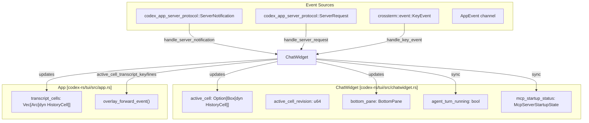
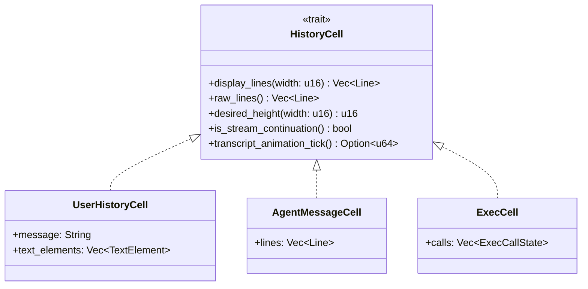
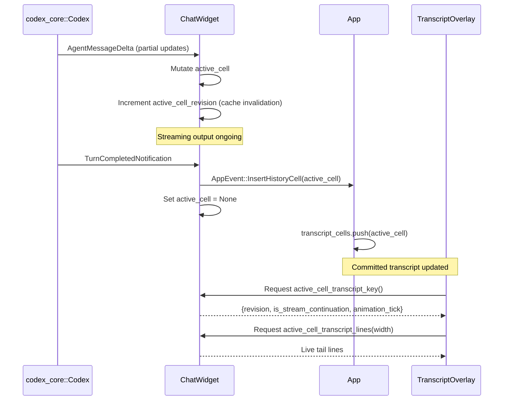
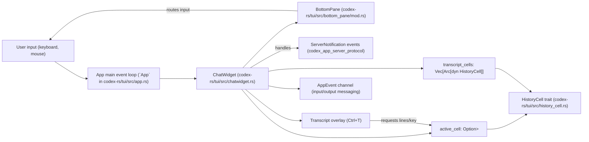
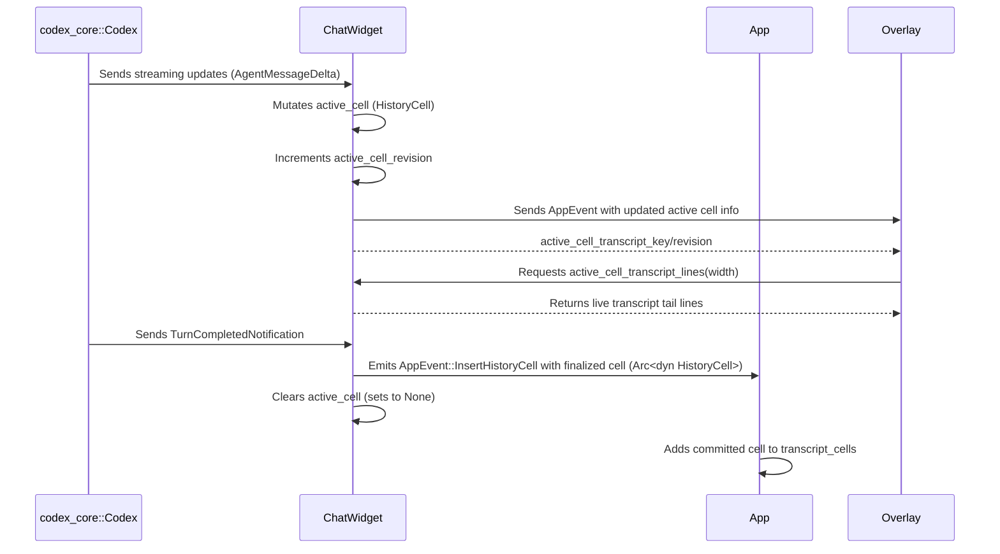

# ChatWidget과 대화 표시

<details>
<summary>관련 소스 파일</summary>

다음 파일들은 이 위키 페이지를 생성하기 위한 컨텍스트로 사용되었습니다.

- [codex-rs/exec/src/event_processor_with_human_output.rs](codex-rs/exec/src/event_processor_with_human_output.rs)
- [codex-rs/mcp-server/src/codex_tool_runner.rs](codex-rs/mcp-server/src/codex_tool_runner.rs)
- [codex-rs/protocol/src/protocol.rs](codex-rs/protocol/src/protocol.rs)
- [codex-rs/tui/src/app.rs](codex-rs/tui/src/app.rs)
- [codex-rs/tui/src/app_backtrack.rs](codex-rs/tui/src/app_backtrack.rs)
- [codex-rs/tui/src/app_event.rs](codex-rs/tui/src/app_event.rs)
- [codex-rs/tui/src/bottom_pane/chat_composer.rs](codex-rs/tui/src/bottom_pane/chat_composer.rs)
- [codex-rs/tui/src/bottom_pane/mod.rs](codex-rs/tui/src/bottom_pane/mod.rs)
- [codex-rs/tui/src/chatwidget.rs](codex-rs/tui/src/chatwidget.rs)
- [codex-rs/tui/src/chatwidget/slash_dispatch.rs](codex-rs/tui/src/chatwidget/slash_dispatch.rs)
- [codex-rs/tui/src/chatwidget/snapshots/codex_tui__chatwidget__tests__binary_size_ideal_response.snap](codex-rs/tui/src/chatwidget/snapshots/codex_tui__chatwidget__tests__binary_size_ideal_response.snap)
- [codex-rs/tui/src/chatwidget/snapshots/codex_tui__chatwidget__tests__unified_exec_unknown_end_with_active_exploring_cell.snap](codex-rs/tui/src/chatwidget/snapshots/codex_tui__chatwidget__tests__unified_exec_unknown_end_with_active_exploring_cell.snap)
- [codex-rs/tui/src/chatwidget/snapshots/codex_tui__chatwidget__tests__user_shell_ls_output.snap](codex-rs/tui/src/chatwidget/snapshots/codex_tui__chatwidget__tests__user_shell_ls_output.snap)
- [codex-rs/tui/src/chatwidget/tests.rs](codex-rs/tui/src/chatwidget/tests.rs)
- [codex-rs/tui/src/chatwidget/tests/slash_commands.rs](codex-rs/tui/src/chatwidget/tests/slash_commands.rs)
- [codex-rs/tui/src/exec_cell/model.rs](codex-rs/tui/src/exec_cell/model.rs)
- [codex-rs/tui/src/exec_cell/render.rs](codex-rs/tui/src/exec_cell/render.rs)
- [codex-rs/tui/src/history_cell/snapshots/codex_tui__history_cell__tests__raw_mode_toggle_transcript.snap](codex-rs/tui/src/history_cell/snapshots/codex_tui__history_cell__tests__raw_mode_toggle_transcript.snap)
- [codex-rs/tui/src/markdown.rs](codex-rs/tui/src/markdown.rs)
- [codex-rs/tui/src/markdown_render.rs](codex-rs/tui/src/markdown_render.rs)
- [codex-rs/tui/src/markdown_render_tests.rs](codex-rs/tui/src/markdown_render_tests.rs)
- [codex-rs/tui/src/markdown_stream.rs](codex-rs/tui/src/markdown_stream.rs)
- [codex-rs/tui/src/pager_overlay.rs](codex-rs/tui/src/pager_overlay.rs)
- [codex-rs/tui/src/slash_command.rs](codex-rs/tui/src/slash_command.rs)
- [codex-rs/tui/src/snapshots/codex_tui__markdown_render__markdown_render_tests__markdown_render_complex_snapshot.snap](codex-rs/tui/src/snapshots/codex_tui__markdown_render__markdown_render_tests__markdown_render_complex_snapshot.snap)
- [codex-rs/tui/src/snapshots/codex_tui__markdown_render__markdown_render_tests__markdown_render_file_link_snapshot.snap](codex-rs/tui/src/snapshots/codex_tui__markdown_render__markdown_render_tests__markdown_render_file_link_snapshot.snap)
- [codex-rs/tui/src/snapshots/codex_tui__markdown_render__markdown_render_tests__table_wraps_file_paths_before_collapsing_narrative_columns_snapshot.snap](codex-rs/tui/src/snapshots/codex_tui__markdown_render__markdown_render_tests__table_wraps_file_paths_before_collapsing_narrative_columns_snapshot.snap)
- [codex-rs/tui/src/snapshots/codex_tui__pager_overlay__tests__static_overlay_snapshot_basic.snap](codex-rs/tui/src/snapshots/codex_tui__pager_overlay__tests__static_overlay_snapshot_basic.snap)
- [codex-rs/tui/src/snapshots/codex_tui__pager_overlay__tests__transcript_overlay_snapshot_basic.snap](codex-rs/tui/src/snapshots/codex_tui__pager_overlay__tests__transcript_overlay_snapshot_basic.snap)
- [codex-rs/tui/src/status_indicator_widget.rs](codex-rs/tui/src/status_indicator_widget.rs)
- [codex-rs/tui/src/streaming/controller.rs](codex-rs/tui/src/streaming/controller.rs)
- [codex-rs/tui/src/streaming/mod.rs](codex-rs/tui/src/streaming/mod.rs)

</details>


## 목적과 범위

이 페이지는 Codex TUI 안의 `ChatWidget` 컴포넌트를 문서화합니다. `ChatWidget`은 대화 history display를 소유하고, committed cell과 active cell의 rendering을 관리하며, app server에서 오는 conversation event와의 상호작용을 조율합니다. 또한 main chat viewport와 transcript overlay UI도 조율합니다. 입력과 prompt editing은 별도로 bottom pane에서 처리되며, [BottomPane and Input System (4.1.3)]()에 설명되어 있습니다. 전체 event loop와 app initialization은 [App Event Loop and Initialization (4.1.1)]()에서 다룹니다.

---

## ChatWidget 아키텍처

### 핵심 구조

`ChatWidget`은 terminal UI에서 chat conversation을 표시하기 위한 포괄적인 state와 logic을 캡슐화합니다. 들어오는 protocol event를 처리하고, committed history와 in-flight active cell을 모두 업데이트합니다. active cell은 partial agent response나 ongoing tool call 같은 streaming output을 표시하는 데 사용됩니다 [codex-rs/tui/src/chatwidget.rs:1-10]().

주요 책임은 다음과 같습니다.

- **committed transcript cells** 를 완료된 `HistoryCell`로 유지합니다. 각 cell은 conversation의 개별 transcript entry에 대응합니다 [codex-rs/tui/src/chatwidget.rs:6-8]().
- streaming output 동안 **active cell** 을 추적합니다. 이는 현재 진행 중인 turn 또는 tool execution을 나타내는 mutable `Box<dyn HistoryCell>`입니다 [codex-rs/tui/src/chatwidget.rs:6-10]().
- 들어오는 `ServerNotification` 및 `ServerRequest` event를 처리하고 그에 따라 UI state를 업데이트합니다 [codex-rs/tui/src/chatwidget.rs:113-115]().
- agent turn activity와 MCP(Model Context Protocol) server startup status를 기준으로 bottom pane의 task running indicator 동기화를 관리합니다 [codex-rs/tui/src/chatwidget.rs:18-23]().

#### 컴포넌트 상호작용 다이어그램



**출처:** [codex-rs/tui/src/chatwidget.rs:1-23](), [codex-rs/tui/src/app.rs:1-10](), [codex-rs/tui/src/app.rs:30-33]()

### State 관리

`ChatWidget`은 rendering과 conversation management에 관련된 여러 관심사로 state를 구성합니다.

| 범주           | 필드                                                  | 목적                                                        |
|--------------------|---------------------------------------------------------|----------------------------------------------------------------|
| **Active Cell**    | `active_cell: Option<Box<dyn HistoryCell>>`, `active_cell_revision: u64` | mutable in-flight transcript cell과 overlay를 위한 cache invalidation revision입니다 [codex-rs/tui/src/chatwidget.rs:6-16](). |
| **Committed History** | `App.transcript_cells: Vec<Arc<dyn HistoryCell>>`      | 저장되고 렌더링되는 과거 conversation turn입니다 [codex-rs/tui/src/app.rs:124](). |
| **Input & Views**  | `bottom_pane: BottomPane`                                | prompt input, slash command, transient view stack(popup/modal)을 관리합니다 [codex-rs/tui/src/bottom_pane/mod.rs:1-5](). |
| **Turn Lifecycle** | `agent_turn_running: bool`, `mcp_startup_status: McpServerStartupState` | UI indicator를 구동하기 위해 agent turn 또는 MCP startup이 active인지 추적합니다 [codex-rs/tui/src/chatwidget.rs:18-23](). |

이 분리는 streaming output, committed conversation history, input interaction 사이의 명확한 lifecycle 처리를 지원합니다.

**출처:** [codex-rs/tui/src/chatwidget.rs:1-27](), [codex-rs/tui/src/app.rs:124](), [codex-rs/tui/src/bottom_pane/mod.rs:1-5]()

---

## History Cell 관리

### `HistoryCell` Trait

`HistoryCell`은 전체 committed message이든 streaming in-progress cell이든 conversation display 안의 단일 renderable unit을 나타내는 핵심 abstraction입니다. main chat viewport와 transcript overlay window 모두를 위한 display line과 height information을 생성하는 method를 노출합니다.



**주요 Method:**

- `display_lines(width)`: main chat area를 위한 logical viewport line을 반환하며, text wrapping과 formatting을 처리합니다 [codex-rs/tui/src/chatwidget.rs:3-10]().
- `raw_lines()`: raw scrollback mode를 위한 copy-friendly plain logical line을 반환합니다.
- `desired_height(width)`: 문자 wrapping 이후 terminal row 단위의 view height를 계산합니다.
- `is_stream_continuation()`: cell이 아직 streaming 중이고 final이 아닌지 나타내며, UI update behavior에 영향을 줍니다 [codex-rs/tui/src/chatwidget.rs:14-16]().
- `transcript_animation_tick()`: spinner 같은 time-dependent visual effect가 animate되는 tick count를 반환하며, overlay cache logic에서 사용됩니다 [codex-rs/tui/src/chatwidget.rs:14-17]().

**출처:** [codex-rs/tui/src/chatwidget.rs:1-17](), [codex-rs/tui/src/app.rs:43]()

### Cell 생명주기

Cell은 다음 생명주기를 따라 진행됩니다.

1. **Streaming Active Cell**: active transcript cell은 mutable하며, continuous agent message generation이나 ongoing tool execution 같은 event 중 partial content를 나타냅니다 [codex-rs/tui/src/chatwidget.rs:6-10]().
2. **Committed History**: turn 또는 item이 완료되면(`TurnCompletedNotification` 또는 `ItemCompletedNotification`) active cell은 완료된 immutable history entry(`Arc<dyn HistoryCell>`)로 transcript에 commit됩니다 [codex-rs/tui/src/chatwidget.rs:6-10, 101, 125]().
3. **Transcript Overlay**: overlay UI는 committed history와 active cell에서 파생된 cached live tail을 모두 렌더링하여 in-flight output을 실시간으로 표시합니다 [codex-rs/tui/src/chatwidget.rs:8-17]().



**출처:** [codex-rs/tui/src/chatwidget.rs:6-17](), [codex-rs/tui/src/app_event.rs:153-154]()

---

## Active Cell Streaming

### Streaming 모델

streaming의 중심 개념은 `active_cell`입니다. 이는 conversation viewport에서 현재 streaming 중인 content를 나타내는 optional boxed trait object입니다. 이 설계는 다음을 가능하게 합니다.

- streaming output 중 active cell의 **In-place Mutation** 입니다. 특히 단일 UI block에서 여러 tool call output을 집계하는 `ExecCell` 같은 복잡한 구조에 유용합니다 [codex-rs/tui/src/chatwidget.rs:6-10]().
- 내부 counter `active_cell_revision`을 통해 각 mutation마다 **Revision Tracking** 을 수행하여 cache refresh와 overlay redraw를 트리거합니다 [codex-rs/tui/src/chatwidget.rs:12-17]().
- **Commentary Output과의 통합**: preamble commentary를 지원하는 모델의 경우 assistant output은 final answer 전에 commentary를 포함할 수 있습니다. commentary stream 중에는 중복 progress indicator를 피하기 위해 status row가 숨겨집니다 [codex-rs/tui/src/chatwidget.rs:25-28]().

**출처:** [codex-rs/tui/src/chatwidget.rs:6-28]()

### Streaming과 Cache Invalidation

transcript overlay(`Ctrl+T`)는 매 frame 전체 cell text를 다시 처리하지 않고 효율적인 incremental redraw를 하기 위해 active cell에서 파생된 **cached live tail** 을 활용합니다 [codex-rs/tui/src/chatwidget.rs:8-17]().

내부 cache key는 active cell에서 다음 parameter를 추적합니다.

- `revision`: active cell이 mutate될 때마다 증가합니다 [codex-rs/tui/src/chatwidget.rs:14-15]().
- `is_stream_continuation`: cell이 아직 output streaming 중인지 여부입니다.
- `animation_tick`: animation(예: spinner frame)을 위한 time-dependent tick value입니다 [codex-rs/tui/src/chatwidget.rs:15-17]().

active cell의 output에 protocol event 없이 시간에 따라 바뀌는 dynamic visual이 포함된 경우, overlay는 이러한 animation tick을 감지해 cached tail을 자동으로 refresh합니다. 이를 통해 protocol update 없이도 부드러운 UI effect를 제공합니다 [codex-rs/tui/src/chatwidget.rs:14-17]().

**출처:** [codex-rs/tui/src/chatwidget.rs:8-17]()

---

## Event Processing

### `handle_server_notification`

`ChatWidget`은 backend server에서 conversation 및 task state를 전달하는 core protocol event인 `ServerNotification` event를 처리합니다. 이 event들은 history cell의 lifecycle과 UI status indicator를 구동합니다 [codex-rs/tui/src/chatwidget.rs:113-115]().

주요 notification type과 그 UI effect의 핵심은 다음과 같습니다.

| Notification Variant                  | Handler Action                                                      |
|-------------------------------------|-------------------------------------------------------------------|
| `ItemStartedNotification`            | item(message, tool call 등)을 위한 새 `HistoryCell`을 생성/초기화합니다 [codex-rs/tui/src/chatwidget.rs:101]() |
| `ItemCompletedNotification`          | 현재 active cell을 committed 상태로 표시하고 finalize합니다 [codex-rs/tui/src/chatwidget.rs:100]() |
| `TurnCompletedNotification`          | turn result를 commit하고 running state를 reset합니다 [codex-rs/tui/src/chatwidget.rs:122]() |
| `McpServerStatusUpdatedNotification`| spinner와 busy indicator에 영향을 주는 MCP startup status를 업데이트합니다 [codex-rs/tui/src/chatwidget.rs:104]() |

이 처리는 conversation progress, streaming output, status indicator에 대한 UI의 reactive update 기반을 이룹니다.

**출처:** [codex-rs/tui/src/chatwidget.rs:100-125]()

---

## Transcript Overlay

transcript overlay(`Ctrl+T`)는 committed conversation history와 active cell의 live streaming tail을 결합한 scrollable view를 보여 줍니다 [codex-rs/tui/src/chatwidget.rs:8-10]().

동기화는 다음과 같이 작동합니다.

1. overlay는 `active_cell_transcript_key()`를 통해 **active cell의 cached key** 를 요청합니다 [codex-rs/tui/src/chatwidget.rs:12-14]().
2. key가 변경되면(revision, streaming status, animation tick) overlay는 `active_cell_transcript_lines()`에서 transcript tail line을 다시 생성하고 cache합니다 [codex-rs/tui/src/chatwidget.rs:14-17]().
3. overlay는 이러한 tail line을 committed transcript history `HistoryCell` 뒤에 append하여 렌더링합니다.
4. 이 방식은 비용이 큰 full redraw를 줄이고 dynamic animation(예: spinner)이 있는 streaming display를 성능 좋게 구현합니다 [codex-rs/tui/src/chatwidget.rs:15-17]().

tool execution spinner를 표시하는 `ExecCell`처럼 time-dependent output이 있는 cell은 overlay의 timed refresh를 지원하기 위해 animation tick을 제공합니다 [codex-rs/tui/src/chatwidget.rs:14-17]().

**출처:** [codex-rs/tui/src/chatwidget.rs:8-17]()

---

## Key Event Handling

`ChatWidget`은 사용자 keyboard input을 중재하고 주로 다음과 같이 command routing을 조율합니다.

- **High-Level Actions:** Interrupt와 Quit logic은 여기서 처리됩니다.
  - interrupt key(예: `Esc` 또는 `Ctrl+C`)는 agent turn이 실행 중이면 `AppCommand::Interrupt`와 함께 `AppEvent::SubmitThreadOp` dispatch를 발생시킵니다 [codex-rs/tui/src/chatwidget.rs:18-23, 45](), [codex-rs/tui/src/app_event.rs:153-169](), [codex-rs/tui/src/status_indicator_widget.rs:103-106]().
  - Quit logic은 `QUIT_SHORTCUT_TIMEOUT` hint를 관리하여 accidental exit를 막기 위해 single key를 비활성화합니다 [codex-rs/tui/src/bottom_pane/mod.rs:153-160]().

- **Input Delegation:** 모든 표준 prompt 및 popup input routing은 `BottomPane`에 위임됩니다. `BottomPane`은 `ChatComposer` input editor를 소유하고 transient view stack overlay를 관리합니다 [codex-rs/tui/src/bottom_pane/mod.rs:1-5]().

```mermaid
flowchart TD
    KeyEvent["User KeyEvent"] --> ChatWidget: handle_key_event()
    ChatWidget -->|Interrupt Command| AppEvent: SubmitThreadOp(::Interrupt)
    ChatWidget -->|Quit Command| QuitHintLifecycle
    ChatWidget -->|Delegates| BottomPane: Input routing & editing
```

**출처:** [codex-rs/tui/src/chatwidget.rs:18-23](), [codex-rs/tui/src/bottom_pane/mod.rs:1-5, 153-160](), [codex-rs/tui/src/app_event.rs:153-169](), [codex-rs/tui/src/status_indicator_widget.rs:103-106]()

---

## 자연어에서 코드 엔티티로 연결하는 요약 다이어그램



**출처:** [codex-rs/tui/src/chatwidget.rs:1-23](), [codex-rs/tui/src/app.rs:1-10](), [codex-rs/tui/src/bottom_pane/mod.rs:1-5]()

---

## Active Cell Streaming과 Overlay Update의 상세 데이터 흐름



**출처:** [codex-rs/tui/src/chatwidget.rs:6-23](), [codex-rs/tui/src/app.rs:124](), [codex-rs/tui/src/app_event.rs:153-169]()

---

# 참고 문헌과 출처

- [codex-rs/tui/src/chatwidget.rs:1-28, 100-125]()
- [codex-rs/tui/src/app.rs:1-10, 30-33, 43, 124]()
- [codex-rs/tui/src/bottom_pane/mod.rs:1-5, 153-160]()
- [codex-rs/tui/src/app_event.rs:153-169]()
- [codex-rs/tui/src/status_indicator_widget.rs:103-106]()
