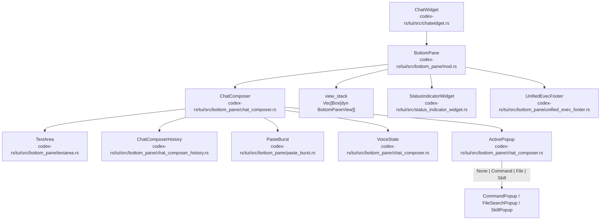
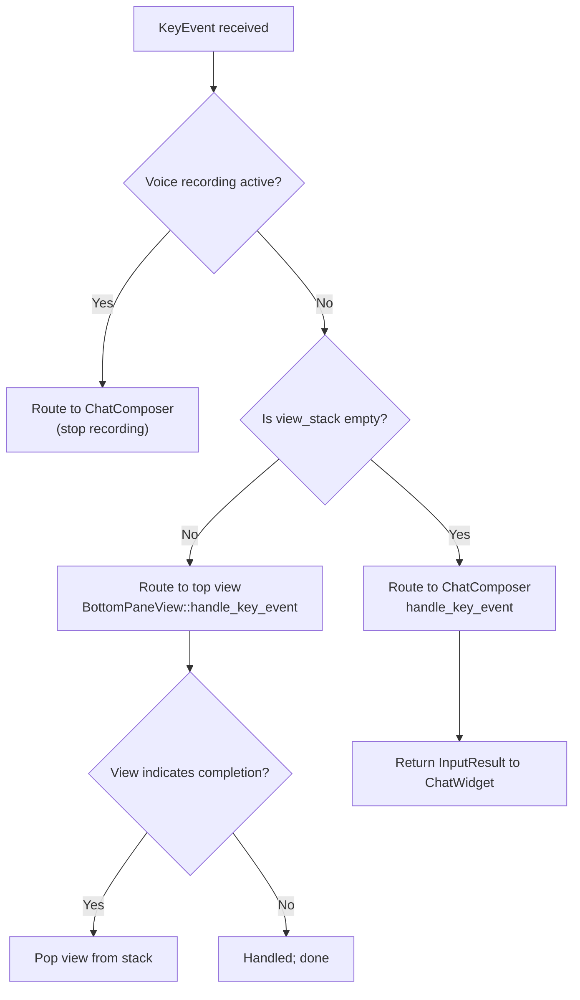
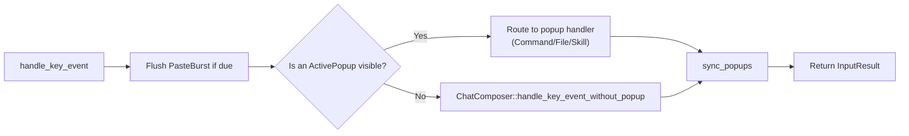
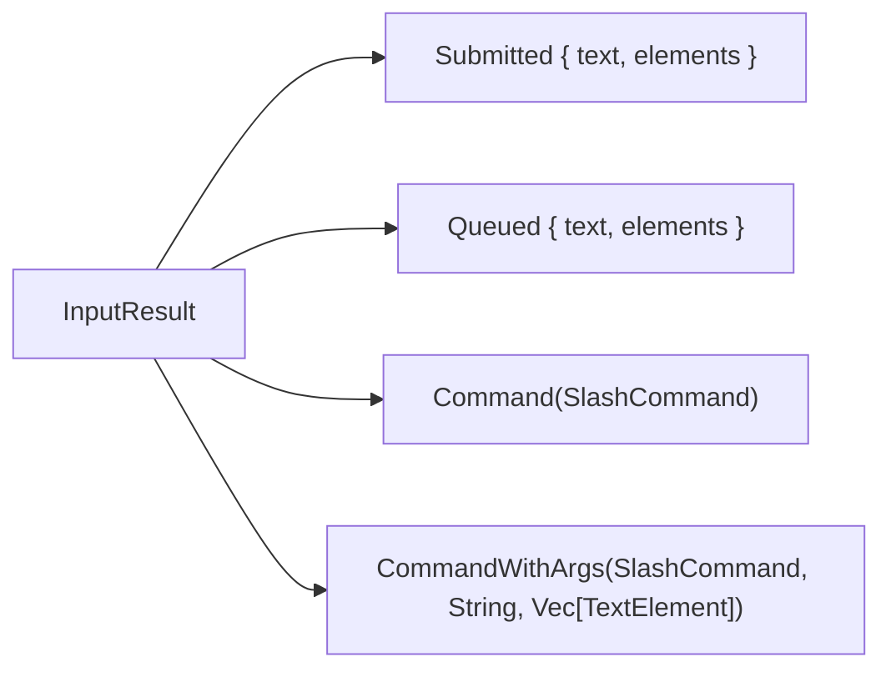
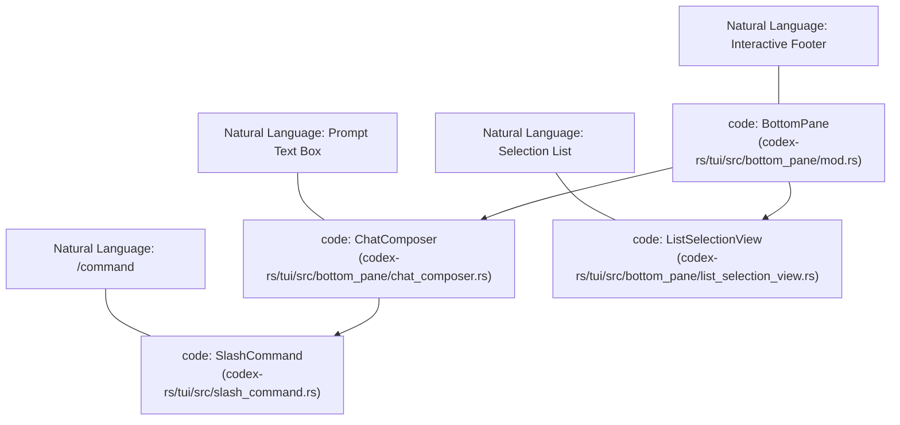
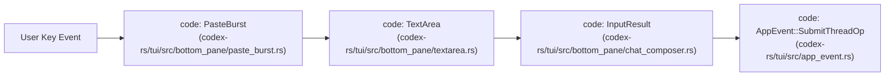

# BottomPane과 입력 시스템

관련 소스 파일

다음 파일들은 이 위키 페이지를 생성하기 위한 컨텍스트로 사용되었습니다.

- [codex-rs/config/src/tui_keymap.rs](codex-rs/config/src/tui_keymap.rs)
- [codex-rs/exec/src/event_processor_with_human_output.rs](codex-rs/exec/src/event_processor_with_human_output.rs)
- [codex-rs/mcp-server/src/codex_tool_runner.rs](codex-rs/mcp-server/src/codex_tool_runner.rs)
- [codex-rs/protocol/src/protocol.rs](codex-rs/protocol/src/protocol.rs)
- [codex-rs/tui/src/app.rs](codex-rs/tui/src/app.rs)
- [codex-rs/tui/src/app_event.rs](codex-rs/tui/src/app_event.rs)
- [codex-rs/tui/src/bottom_pane/bottom_pane_view.rs](codex-rs/tui/src/bottom_pane/bottom_pane_view.rs)
- [codex-rs/tui/src/bottom_pane/chat_composer.rs](codex-rs/tui/src/bottom_pane/chat_composer.rs)
- [codex-rs/tui/src/bottom_pane/command_popup.rs](codex-rs/tui/src/bottom_pane/command_popup.rs)
- [codex-rs/tui/src/bottom_pane/file_search_popup.rs](codex-rs/tui/src/bottom_pane/file_search_popup.rs)
- [codex-rs/tui/src/bottom_pane/list_selection_view.rs](codex-rs/tui/src/bottom_pane/list_selection_view.rs)
- [codex-rs/tui/src/bottom_pane/mod.rs](codex-rs/tui/src/bottom_pane/mod.rs)
- [codex-rs/tui/src/bottom_pane/selection_popup_common.rs](codex-rs/tui/src/bottom_pane/selection_popup_common.rs)
- [codex-rs/tui/src/bottom_pane/skill_popup.rs](codex-rs/tui/src/bottom_pane/skill_popup.rs)
- [codex-rs/tui/src/bottom_pane/snapshots/codex_tui__bottom_pane__chat_composer__tests__mention_popup_type_prefixes.snap](codex-rs/tui/src/bottom_pane/snapshots/codex_tui__bottom_pane__chat_composer__tests__mention_popup_type_prefixes.snap)
- [codex-rs/tui/src/bottom_pane/snapshots/codex_tui__bottom_pane__chat_composer__tests__plugin_mention_popup.snap](codex-rs/tui/src/bottom_pane/snapshots/codex_tui__bottom_pane__chat_composer__tests__plugin_mention_popup.snap)
- [codex-rs/tui/src/bottom_pane/textarea.rs](codex-rs/tui/src/bottom_pane/textarea.rs)
- [codex-rs/tui/src/chatwidget.rs](codex-rs/tui/src/chatwidget.rs)
- [codex-rs/tui/src/chatwidget/skills.rs](codex-rs/tui/src/chatwidget/skills.rs)
- [codex-rs/tui/src/chatwidget/slash_dispatch.rs](codex-rs/tui/src/chatwidget/slash_dispatch.rs)
- [codex-rs/tui/src/chatwidget/tests.rs](codex-rs/tui/src/chatwidget/tests.rs)
- [codex-rs/tui/src/chatwidget/tests/slash_commands.rs](codex-rs/tui/src/chatwidget/tests/slash_commands.rs)
- [codex-rs/tui/src/keymap.rs](codex-rs/tui/src/keymap.rs)
- [codex-rs/tui/src/keymap_setup.rs](codex-rs/tui/src/keymap_setup.rs)
- [codex-rs/tui/src/keymap_setup/actions.rs](codex-rs/tui/src/keymap_setup/actions.rs)
- [codex-rs/tui/src/keymap_setup/picker.rs](codex-rs/tui/src/keymap_setup/picker.rs)
- [codex-rs/tui/src/skills_helpers.rs](codex-rs/tui/src/skills_helpers.rs)
- [codex-rs/tui/src/slash_command.rs](codex-rs/tui/src/slash_command.rs)
- [codex-rs/tui/src/snapshots/codex_tui__keymap_setup__tests__keymap_action_menu.snap](codex-rs/tui/src/snapshots/codex_tui__keymap_setup__tests__keymap_action_menu.snap)
- [codex-rs/tui/src/snapshots/codex_tui__keymap_setup__tests__keymap_picker_custom.snap](codex-rs/tui/src/snapshots/codex_tui__keymap_setup__tests__keymap_picker_custom.snap)
- [codex-rs/tui/src/snapshots/codex_tui__keymap_setup__tests__keymap_picker_fast_mode_enabled.snap](codex-rs/tui/src/snapshots/codex_tui__keymap_setup__tests__keymap_picker_fast_mode_enabled.snap)
- [codex-rs/tui/src/snapshots/codex_tui__keymap_setup__tests__keymap_picker_first_actions.snap](codex-rs/tui/src/snapshots/codex_tui__keymap_setup__tests__keymap_picker_first_actions.snap)
- [codex-rs/tui/src/snapshots/codex_tui__keymap_setup__tests__keymap_picker_narrow.snap](codex-rs/tui/src/snapshots/codex_tui__keymap_setup__tests__keymap_picker_narrow.snap)
- [codex-rs/tui/src/snapshots/codex_tui__keymap_setup__tests__keymap_picker_wide.snap](codex-rs/tui/src/snapshots/codex_tui__keymap_setup__tests__keymap_picker_wide.snap)

이 페이지는 Codex TUI 하단의 대화형 입력 계층을 다룹니다. `BottomPane` container, `ChatComposer` text-input state machine, `TextArea` editing buffer, slash command handling system, `BottomPaneView` overlay stack을 설명합니다. 사용자 의도가 어떻게 포착되고, paste-burst detection을 포함한 정교한 input pipeline을 거쳐 처리되며, agent에 대한 operation으로 dispatch되는지 문서화합니다.

---

## 컴포넌트 계층

bottom pane은 composable stack입니다. `ChatWidget`은 하나의 `BottomPane`을 소유하고, `BottomPane`은 다시 `ChatComposer`와 transient overlay의 view stack을 소유합니다.

**컴포넌트 소유권과 주요 type 다이어그램:**

출처: [codex-rs/tui/src/bottom_pane/mod.rs:1-15](), [codex-rs/tui/src/bottom_pane/chat_composer.rs:1-133]()

---

## BottomPane

`BottomPane`은 모든 footer-level interaction을 담당하는 기본 container입니다. `ChatComposer`의 lifecycle을 관리하고, stack 기반 아키텍처를 통해 transient modal view 표시를 조율합니다 [codex-rs/tui/src/bottom_pane/mod.rs:1-5]().

### 핵심 필드

| Field | Type | 목적 |
| :--- | :--- | :--- |
| `composer` | `ChatComposer` | 지속적인 composer input area이며, 다른 view가 overlay로 덮더라도 draft를 유지합니다 [codex-rs/tui/src/bottom_pane/mod.rs:3-5](). |
| `view_stack` | `Vec<Box<dyn BottomPaneView>>` | composer를 일시적으로 대체하는 transient overlay view(popup, modal)의 stack입니다 [codex-rs/tui/src/bottom_pane/mod.rs:4-5](). |
| `status` | `Option<StatusIndicatorWidget>` | task running progress/status를 위한 선택적 inline row입니다 [codex-rs/tui/src/chatwidget.rs:19-23](). |
| `unified_exec_footer` | `UnifiedExecFooter` | session-wide exec process summary와 status를 표시합니다 [codex-rs/tui/src/bottom_pane/mod.rs:25-25](). |

### BottomPane의 입력 키 Routing

key event를 받으면 `BottomPane`은 다음 우선순위에 따라 event를 routing합니다. active view에는 `Ctrl+C` 같은 key를 소비해 자신을 dismiss할 첫 기회가 주어집니다 [codex-rs/tui/src/bottom_pane/mod.rs:7-12]().

출처: [codex-rs/tui/src/bottom_pane/mod.rs:7-15](), [codex-rs/tui/src/bottom_pane/mod.rs:153-160]()

---

## ChatComposer

`ChatComposer`는 main input text state machine입니다. `TextArea` buffer 편집, active popup으로 key routing, 입력된 slash command를 atomic element로 승격하는 일을 담당합니다 [codex-rs/tui/src/bottom_pane/chat_composer.rs:1-10]().

### Key Event Routing과 Paste Burst Detection

일부 terminal, 특히 Windows에서는 paste가 단일 paste event가 아니라 빠른 `KeyCode::Char` event sequence로 들어옵니다. `ChatComposer`는 `PasteBurst` state machine을 사용해 이러한 sequence를 buffer하고, 빠른 typing으로 잘못 해석되지 않도록 합니다 [codex-rs/tui/src/bottom_pane/chat_composer.rs:92-100]().

### ActivePopup State Machine

composer는 사용자가 특수 trigger를 입력할 때 나타나는 inline popup의 lifecycle을 관리합니다 [codex-rs/tui/src/bottom_pane/chat_composer.rs:6-7]():

| Trigger | Popup Type | 구현 |
| :--- | :--- | :--- |
| `/` | `Command` | `CommandPopup` [codex-rs/tui/src/bottom_pane/command_popup.rs:73-77]() |
| `@` | `File` | `FileSearchPopup` [codex-rs/tui/src/bottom_pane/file_search_popup.rs:1-5]() |
| `$` | `Skill` | `SkillPopup` [codex-rs/tui/src/bottom_pane/skill_popup.rs:1-5]() |

출처: [codex-rs/tui/src/bottom_pane/chat_composer.rs:12-18](), [codex-rs/tui/src/bottom_pane/chat_composer.rs:92-114](), [codex-rs/tui/src/bottom_pane/command_popup.rs:36-40]()

---

## TextArea와 Element 시스템

`TextArea`는 TUI composer 뒤의 핵심 editable buffer입니다 [codex-rs/tui/src/bottom_pane/textarea.rs:92-101](). raw text와 `[Image #1]` 또는 slash command token 같은 atomic `TextElement` placeholder를 지원합니다.

### Text Element와 Cursor Invariant

- **Atomic Movement**: attachment를 위한 placeholder "element"는 edit와 함께 원자적으로 이동해야 합니다 [codex-rs/tui/src/bottom_pane/textarea.rs:94-95]().
- **Range Tracking**: text가 삽입되거나 삭제될 때 editor는 alignment를 유지하기 위해 기존 모든 `TextElement`의 byte range를 조정합니다 [codex-rs/tui/src/bottom_pane/textarea.rs:189-191]().
- **Kill Buffer**: `Ctrl+K`는 줄 끝까지 text를 kill하고 single-entry kill buffer에 저장합니다. 이 buffer는 submission으로 draft가 clear되어도 보존되어 `Ctrl+Y`로 복원할 수 있습니다 [codex-rs/tui/src/bottom_pane/textarea.rs:1-11]().

출처: [codex-rs/tui/src/bottom_pane/textarea.rs:1-12](), [codex-rs/tui/src/bottom_pane/textarea.rs:174-182](), [codex-rs/tui/src/bottom_pane/textarea.rs:189-191]()

---

## Slash Command 시스템

### SlashCommand 처리

`SlashCommand` enum [codex-rs/tui/src/slash_command.rs:12-80]()은 사용 가능한 command를 정의합니다. `ChatComposer`는 name이 완료되면 입력된 text를 `SlashCommand` element로 승격합니다 [codex-rs/tui/src/bottom_pane/chat_composer.rs:6-7]().

| Command | 설명 | Args 지원 |
| :--- | :--- | :--- |
| `/model` | model과 reasoning effort 선택 | 아니요 [codex-rs/tui/src/slash_command.rs:157-174]() |
| `/review` | 현재 변경 사항 review | 예 [codex-rs/tui/src/slash_command.rs:159-159]() |
| `/plan` | Plan mode로 전환 | 예 [codex-rs/tui/src/slash_command.rs:162-162]() |
| `/resume` | 저장된 chat 재개 | 예 [codex-rs/tui/src/slash_command.rs:171-171]() |
| `/side` | ephemeral side conversation 시작 | 예 [codex-rs/tui/src/slash_command.rs:169-169]() |

### InputResult Dispatch

사용자가 input을 submit하면 `ChatComposer`는 `InputResult`를 `ChatWidget`에 반환하고, `ChatWidget`은 적절한 `AppCommand` 또는 `Op`를 dispatch합니다 [codex-rs/tui/src/bottom_pane/chat_composer.rs:39-44]().

출처: [codex-rs/tui/src/slash_command.rs:84-147](), [codex-rs/tui/src/slash_command.rs:157-174](), [codex-rs/tui/src/bottom_pane/chat_composer.rs:30-44]()

---

## BottomPaneView Overlay Stack

`BottomPaneView`는 composer를 일시적으로 대체하는 transient overlay를 위한 trait입니다 [codex-rs/tui/src/bottom_pane/mod.rs:3-5]().

### 일반적인 View 구현

| View | 목적 | Source |
| :--- | :--- | :--- |
| `ApprovalOverlay` | tool execution 또는 patch application approval을 요청합니다. | [codex-rs/tui/src/bottom_pane/mod.rs:69-70]() |
| `RequestUserInputOverlay` | 특정 user input에 대한 agent request를 처리합니다. | [codex-rs/tui/src/bottom_pane/mod.rs:74-74]() |
| `McpServerElicitationOverlay` | MCP server OAuth 또는 configuration을 위한 form입니다. | [codex-rs/tui/src/bottom_pane/mod.rs:72-73]() |
| `SkillsToggleView` | skill 활성화/비활성화를 위한 interface입니다. | [codex-rs/tui/src/bottom_pane/mod.rs:131-131]() |
| `ListSelectionView` | theme, model, history에 사용되는 generic list picker입니다. | [codex-rs/tui/src/bottom_pane/mod.rs:112-112]() |

출처: [codex-rs/tui/src/bottom_pane/mod.rs:65-76](), [codex-rs/tui/src/bottom_pane/mod.rs:112-137]()

---

## 자연어 공간에서 코드 엔티티 공간으로 연결

### UI-to-Code Association: Input Surface

### UI-to-Code Association: Input Pipeline

출처: [codex-rs/tui/src/bottom_pane/chat_composer.rs:1-114](), [codex-rs/tui/src/app_event.rs:153-170]()
