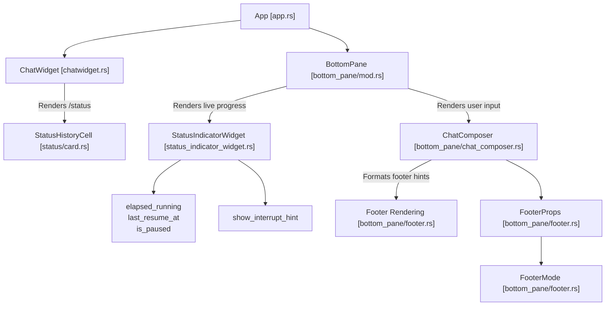
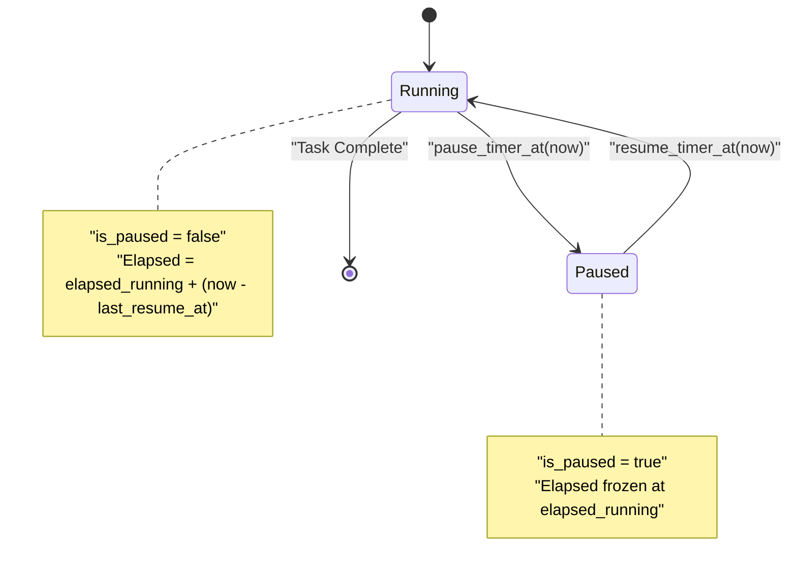
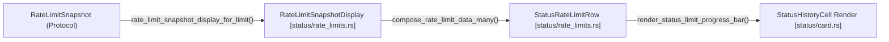
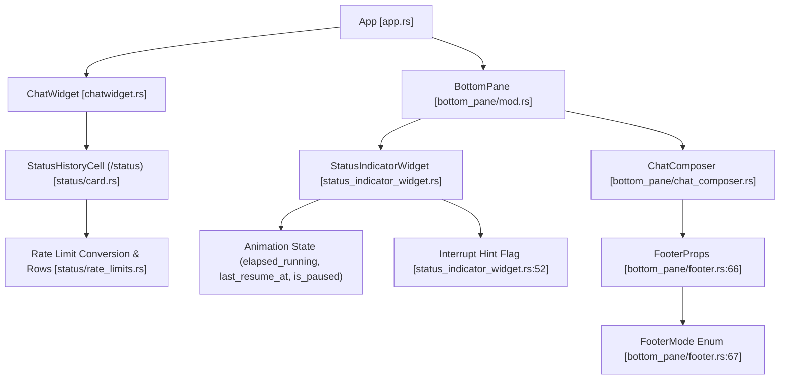

# Status Line과 Footer 렌더링

<details>
<summary>관련 소스 파일</summary>

다음 파일들은 이 위키 페이지를 생성하기 위한 컨텍스트로 사용되었습니다.

- [codex-rs/tui/src/app_backtrack.rs](codex-rs/tui/src/app_backtrack.rs)
- [codex-rs/tui/src/bottom_pane/chat_composer/footer_state.rs](codex-rs/tui/src/bottom_pane/chat_composer/footer_state.rs)
- [codex-rs/tui/src/bottom_pane/chat_composer/history_search.rs](codex-rs/tui/src/bottom_pane/chat_composer/history_search.rs)
- [codex-rs/tui/src/bottom_pane/footer.rs](codex-rs/tui/src/bottom_pane/footer.rs)
- [codex-rs/tui/src/bottom_pane/snapshots/codex_tui__bottom_pane__chat_composer__tests__footer_mode_ctrl_c_interrupt.snap](codex-rs/tui/src/bottom_pane/snapshots/codex_tui__bottom_pane__chat_composer__tests__footer_mode_ctrl_c_interrupt.snap)
- [codex-rs/tui/src/bottom_pane/snapshots/codex_tui__bottom_pane__chat_composer__tests__footer_mode_ctrl_c_quit.snap](codex-rs/tui/src/bottom_pane/snapshots/codex_tui__bottom_pane__chat_composer__tests__footer_mode_ctrl_c_quit.snap)
- [codex-rs/tui/src/bottom_pane/snapshots/codex_tui__bottom_pane__chat_composer__tests__footer_mode_ctrl_c_then_esc_hint.snap](codex-rs/tui/src/bottom_pane/snapshots/codex_tui__bottom_pane__chat_composer__tests__footer_mode_ctrl_c_then_esc_hint.snap)
- [codex-rs/tui/src/bottom_pane/snapshots/codex_tui__bottom_pane__chat_composer__tests__footer_mode_esc_hint_backtrack.snap](codex-rs/tui/src/bottom_pane/snapshots/codex_tui__bottom_pane__chat_composer__tests__footer_mode_esc_hint_backtrack.snap)
- [codex-rs/tui/src/bottom_pane/snapshots/codex_tui__bottom_pane__chat_composer__tests__footer_mode_esc_hint_from_overlay.snap](codex-rs/tui/src/bottom_pane/snapshots/codex_tui__bottom_pane__chat_composer__tests__footer_mode_esc_hint_from_overlay.snap)
- [codex-rs/tui/src/bottom_pane/snapshots/codex_tui__bottom_pane__chat_composer__tests__footer_mode_overlay_then_external_esc_hint.snap](codex-rs/tui/src/bottom_pane/snapshots/codex_tui__bottom_pane__chat_composer__tests__footer_mode_overlay_then_external_esc_hint.snap)
- [codex-rs/tui/src/bottom_pane/snapshots/codex_tui__bottom_pane__chat_composer__tests__footer_mode_shortcut_overlay.snap](codex-rs/tui/src/bottom_pane/snapshots/codex_tui__bottom_pane__chat_composer__tests__footer_mode_shortcut_overlay.snap)
- [codex-rs/tui/src/bottom_pane/snapshots/codex_tui__bottom_pane__chat_composer__tests__footer_mode_shortcut_overlay_queue_submissions.snap](codex-rs/tui/src/bottom_pane/snapshots/codex_tui__bottom_pane__chat_composer__tests__footer_mode_shortcut_overlay_queue_submissions.snap)
- [codex-rs/tui/src/bottom_pane/snapshots/codex_tui__bottom_pane__footer__tests__footer_ctrl_c_quit_idle.snap](codex-rs/tui/src/bottom_pane/snapshots/codex_tui__bottom_pane__footer__tests__footer_ctrl_c_quit_idle.snap)
- [codex-rs/tui/src/bottom_pane/snapshots/codex_tui__bottom_pane__footer__tests__footer_ctrl_c_quit_running.snap](codex-rs/tui/src/bottom_pane/snapshots/codex_tui__bottom_pane__footer__tests__footer_ctrl_c_quit_running.snap)
- [codex-rs/tui/src/bottom_pane/snapshots/codex_tui__bottom_pane__footer__tests__footer_shortcuts_collaboration_modes_enabled.snap](codex-rs/tui/src/bottom_pane/snapshots/codex_tui__bottom_pane__footer__tests__footer_shortcuts_collaboration_modes_enabled.snap)
- [codex-rs/tui/src/bottom_pane/snapshots/codex_tui__bottom_pane__footer__tests__footer_shortcuts_default.snap](codex-rs/tui/src/bottom_pane/snapshots/codex_tui__bottom_pane__footer__tests__footer_shortcuts_default.snap)
- [codex-rs/tui/src/bottom_pane/snapshots/codex_tui__bottom_pane__footer__tests__footer_shortcuts_running.snap](codex-rs/tui/src/bottom_pane/snapshots/codex_tui__bottom_pane__footer__tests__footer_shortcuts_running.snap)
- [codex-rs/tui/src/bottom_pane/snapshots/codex_tui__bottom_pane__footer__tests__footer_shortcuts_shift_and_esc.snap](codex-rs/tui/src/bottom_pane/snapshots/codex_tui__bottom_pane__footer__tests__footer_shortcuts_shift_and_esc.snap)
- [codex-rs/tui/src/chatwidget/input_flow.rs](codex-rs/tui/src/chatwidget/input_flow.rs)
- [codex-rs/tui/src/chatwidget/input_restore.rs](codex-rs/tui/src/chatwidget/input_restore.rs)
- [codex-rs/tui/src/chatwidget/input_submission.rs](codex-rs/tui/src/chatwidget/input_submission.rs)
- [codex-rs/tui/src/chatwidget/snapshots/codex_tui__chatwidget__tests__binary_size_ideal_response.snap](codex-rs/tui/src/chatwidget/snapshots/codex_tui__chatwidget__tests__binary_size_ideal_response.snap)
- [codex-rs/tui/src/chatwidget/snapshots/codex_tui__chatwidget__tests__unified_exec_unknown_end_with_active_exploring_cell.snap](codex-rs/tui/src/chatwidget/snapshots/codex_tui__chatwidget__tests__unified_exec_unknown_end_with_active_exploring_cell.snap)
- [codex-rs/tui/src/chatwidget/snapshots/codex_tui__chatwidget__tests__user_shell_ls_output.snap](codex-rs/tui/src/chatwidget/snapshots/codex_tui__chatwidget__tests__user_shell_ls_output.snap)
- [codex-rs/tui/src/exec_cell/model.rs](codex-rs/tui/src/exec_cell/model.rs)
- [codex-rs/tui/src/exec_cell/render.rs](codex-rs/tui/src/exec_cell/render.rs)
- [codex-rs/tui/src/pager_overlay.rs](codex-rs/tui/src/pager_overlay.rs)
- [codex-rs/tui/src/snapshots/codex_tui__pager_overlay__tests__static_overlay_snapshot_basic.snap](codex-rs/tui/src/snapshots/codex_tui__pager_overlay__tests__static_overlay_snapshot_basic.snap)
- [codex-rs/tui/src/snapshots/codex_tui__pager_overlay__tests__transcript_overlay_snapshot_basic.snap](codex-rs/tui/src/snapshots/codex_tui__pager_overlay__tests__transcript_overlay_snapshot_basic.snap)
- [codex-rs/tui/src/status/card.rs](codex-rs/tui/src/status/card.rs)
- [codex-rs/tui/src/status/rate_limits.rs](codex-rs/tui/src/status/rate_limits.rs)
- [codex-rs/tui/src/status/snapshots/codex_tui__status__tests__status_snapshot_includes_monthly_limit.snap](codex-rs/tui/src/status/snapshots/codex_tui__status__tests__status_snapshot_includes_monthly_limit.snap)
- [codex-rs/tui/src/status/snapshots/codex_tui__status__tests__status_snapshot_includes_reasoning_details.snap](codex-rs/tui/src/status/snapshots/codex_tui__status__tests__status_snapshot_includes_reasoning_details.snap)
- [codex-rs/tui/src/status/snapshots/codex_tui__status__tests__status_snapshot_shows_missing_limits_message.snap](codex-rs/tui/src/status/snapshots/codex_tui__status__tests__status_snapshot_shows_missing_limits_message.snap)
- [codex-rs/tui/src/status/snapshots/codex_tui__status__tests__status_snapshot_shows_stale_limits_message.snap](codex-rs/tui/src/status/snapshots/codex_tui__status__tests__status_snapshot_shows_stale_limits_message.snap)
- [codex-rs/tui/src/status/snapshots/codex_tui__status__tests__status_snapshot_truncates_in_narrow_terminal.snap](codex-rs/tui/src/status/snapshots/codex_tui__status__tests__status_snapshot_truncates_in_narrow_terminal.snap)
- [codex-rs/tui/src/status/tests.rs](codex-rs/tui/src/status/tests.rs)
- [codex-rs/tui/src/status_indicator_widget.rs](codex-rs/tui/src/status_indicator_widget.rs)

</details>


이 페이지는 Codex terminal user interface(TUI)가 status line, 즉 설정 가능한 정보 strip과 contextual hint 및 shortcut을 보여 주는 footer를 렌더링하는 방식을 문서화합니다. spinner animation과 interrupt hint를 포함한 live task status display를 관리하는 `StatusIndicatorWidget`의 구현 세부 사항과, `StatusHistoryCell`이 렌더링하는 `/status` command output을 다룹니다. bottom pane 안에서 이러한 컴포넌트의 layout과 data flow도 설명합니다.

## 컴포넌트 아키텍처

Codex TUI의 status 및 footer 렌더링 시스템은 함께 동작하는 여러 component와 widget을 통합합니다.



**설명:**

- `App`은 main UI orchestrator 역할을 합니다.
- `ChatWidget`은 primary chat transcript를 표시하고, `StatusHistoryCell`을 통해 multi-line `/status` output card 렌더링을 처리합니다 [codex-rs/tui/src/status/card.rs:106-122]().
- `BottomPane`은 transcript 아래의 layered widget을 관리하며, text input composer 위에 표시되는 live `StatusIndicatorWidget`을 포함합니다 [codex-rs/tui/src/status_indicator_widget.rs:1-5]().
- `StatusIndicatorWidget`은 animated spinner, elapsed timer, interrupt hint, optional inline detail이 포함된 ephemeral task status를 보여 줍니다 [codex-rs/tui/src/status_indicator_widget.rs:45-61]().
- `ChatComposer`는 text input과 user interaction을 처리하며, footer hint와 mode를 위한 configuration을 제공합니다.
- Footer rendering widget은 `FooterProps`와 `FooterMode` selection을 소비하여 composer 아래에 instructional 또는 contextual hint를 렌더링합니다 [codex-rs/tui/src/bottom_pane/footer.rs:1-20]().

**출처:**
[codex-rs/tui/src/status_indicator_widget.rs:1-61](),
[codex-rs/tui/src/status/card.rs:106-122](),
[codex-rs/tui/src/bottom_pane/footer.rs:1-20]()

---

## StatusIndicatorWidget

`StatusIndicatorWidget`은 agent 또는 tool task가 실행 중일 때 composer text input 위에 표시되는 live status line을 제공합니다. elapsed timing, spinner animation, interrupt hint, optional detail line을 관리합니다 [codex-rs/tui/src/status_indicator_widget.rs:45-61]().

### 주요 필드와 책임

| Field / Responsibility | 설명 |
| :--- | :--- |
| `header: String` | elapsed time 왼쪽의 animated header text이며, 기본값은 `"Working"`입니다 [codex-rs/tui/src/status_indicator_widget.rs:47-48](). |
| `details: Option<String>` | header 아래에 표시되는 optional wrapped detail text이며, `"  └ "` prefix가 붙습니다 [codex-rs/tui/src/status_indicator_widget.rs:35-36, 48](). |
| `inline_message: Option<String>` | elapsed time과 interrupt hint 뒤에 렌더링되는 optional inline suffix입니다 [codex-rs/tui/src/status_indicator_widget.rs:50-51](). |
| `show_interrupt_hint: bool` | interrupt hint `(esc to interrupt)`를 표시할지 여부입니다 [codex-rs/tui/src/status_indicator_widget.rs:52](). |
| `elapsed_running: Duration` | 누적 active elapsed time tracking입니다 [codex-rs/tui/src/status_indicator_widget.rs:55](). |
| `last_resume_at: Instant` | timer가 마지막으로 resume된 instant입니다 [codex-rs/tui/src/status_indicator_widget.rs:56](). |
| `is_paused: bool` | elapsed tracking을 고정하는 paused state입니다 [codex-rs/tui/src/status_indicator_widget.rs:57](). |
| `app_event_tx: AppEventSender` | app event loop에 interrupt event를 보내는 데 사용됩니다 [codex-rs/tui/src/status_indicator_widget.rs:58, 103-106](). |
| `frame_requester: FrameRequester` | animation을 위한 redraw frame을 요청합니다 [codex-rs/tui/src/status_indicator_widget.rs:59](). |
| `animations_enabled: bool` | animated spinner와 shimmer를 활성화할지 여부입니다 [codex-rs/tui/src/status_indicator_widget.rs:60](). |

### 경과 시간 형식화

elapsed seconds는 `fmt_elapsed_compact` 함수에 의해 간결하고 사람이 읽기 쉬운 문자열로 형식화됩니다 [codex-rs/tui/src/status_indicator_widget.rs:65-78]():

- **1분 미만**: `"47s"`
- **1시간 미만**: `"4m 07s"`
- **1시간 이상**: `"1h 02m 09s"`

### Timer State Machine

widget은 active working period만 계산하는 timer를 관리하며, 필요에 따라 pause와 resume을 수행합니다. `elapsed_running`을 사용해 누적 running duration을 저장하고, `last_resume_at`으로 마지막 resume 시점을 표시합니다.



- **Pause**: `pause_timer_at`이 호출되면 `last_resume_at` 이후의 duration을 `elapsed_running`에 더하고 `is_paused = true`로 설정합니다 [codex-rs/tui/src/status_indicator_widget.rs:169-175]().
- **Resume**: `resume_timer_at`이 호출되면 `last_resume_at`을 현재 instant로 업데이트하고 `is_paused = false`로 설정합니다 [codex-rs/tui/src/status_indicator_widget.rs:177-184]().

### Interrupt와 Details

- **Interrupt**: widget은 `interrupt()` method를 노출하며, 이 method는 `self.app_event_tx.interrupt_and_restore_prompt_if_no_output()`을 호출해 core agent에 중지 신호를 보냅니다 [codex-rs/tui/src/status_indicator_widget.rs:103-106]().
- **Details**: `update_details` method는 capitalization rule(`StatusDetailsCapitalization`을 통해)을 적용하고, text를 설정된 `max_lines`(기본 3)로 wrap합니다 [codex-rs/tui/src/status_indicator_widget.rs:114-130, 35]().

**출처:**
[codex-rs/tui/src/status_indicator_widget.rs:45-61, 65-78, 103-106, 114-130, 169-184]()

---

## `/status` Command Output (`StatusHistoryCell`)

chat UI는 history cell로 렌더링되는 multi-line `/status` card를 지원합니다. `StatusHistoryCell`은 model info, working directory, token usage, permissions, rate limits 같은 status data를 표시용으로 집계합니다 [codex-rs/tui/src/status/card.rs:106-122]().

### 데이터 집계와 표시

`StatusHistoryCell`의 필드는 다음을 포함합니다.
- `model_name` & `model_details`: 현재 model label과 reasoning level [codex-rs/tui/src/status/card.rs:107-108]().
- `directory`: 현재 working directory path [codex-rs/tui/src/status/card.rs:109]().
- `permissions`: 활성 permission profile의 사람이 읽을 수 있는 summary [codex-rs/tui/src/status/card.rs:110]().
- `token_usage`: 소비된 total/input/output token count [codex-rs/tui/src/status/card.rs:120]().
- `rate_limit_state`: usage limit의 snapshot data [codex-rs/tui/src/status/card.rs:121]().

### Rate Limit 표시

Rate limit 정보는 `"5h limit"` 또는 `"Weekly limit"` 같은 label이 붙은 progress bar로 표시됩니다.



- **Staleness**: snapshot data는 15분(`RATE_LIMIT_STALE_THRESHOLD_MINUTES`)보다 오래되면 stale로 간주됩니다 [codex-rs/tui/src/status/rate_limits.rs:65]().
- **Progress Bars**: 20 segment(`STATUS_LIMIT_BAR_SEGMENTS`)를 사용해 렌더링되며, 채워진 부분은 `█`, 빈 부분은 `░`로 표시됩니다 [codex-rs/tui/src/status/rate_limits.rs:23-25]().

**출처:**
[codex-rs/tui/src/status/card.rs:106-122](),
[codex-rs/tui/src/status/rate_limits.rs:23-25, 65, 144-166]()

---

## Footer 렌더링과 Hint

composer 아래의 footer 영역은 `FooterProps`를 사용해 transient hint, shortcut help, context indicator를 렌더링합니다 [codex-rs/tui/src/bottom_pane/footer.rs:1-11]().

### Footer Layout과 Collapse Rule
footer는 작은 terminal에서도 가장 중요한 정보가 보이도록 `single_line_footer_layout`을 통해 width 기반 fallback rule을 적용합니다 [codex-rs/tui/src/bottom_pane/footer.rs:21-36]():
1. **Fullest Hint**: 가장 완전한 left-side hint + right-side context로 시작합니다.
2. **Queue Priority**: `queue_submissions`가 active이면 queue hint가 right-side context보다 우선됩니다 [codex-rs/tui/src/bottom_pane/footer.rs:28-30, 71]().
3. **Mode Cycle**: 공간이 부족하면 `(shift+tab to cycle)`보다 먼저 `? for shortcuts`가 제거됩니다 [codex-rs/tui/src/bottom_pane/footer.rs:31-32]().
4. **Context Hiding**: mode cycle hint도 맞지 않으면 layout churn을 방지하기 위해 right-side context도 숨깁니다 [codex-rs/tui/src/bottom_pane/footer.rs:33-34]().

### Footer Modes
footer는 사용자 state에 따라 여러 mode 사이를 전환합니다 [codex-rs/tui/src/bottom_pane/footer.rs:67]():
- `QuitShortcutReminder`: 사용자가 종료하려면 key를 한 번 더 눌러야 할 때 렌더링됩니다 [codex-rs/tui/src/bottom_pane/footer.rs:74-77]().
- `StatusLine`: 설정된 contextual row를 렌더링합니다 [codex-rs/tui/src/bottom_pane/footer.rs:13-14]().
- `ActiveAgentLabel`: active agent/thread label을 보여 줍니다 [codex-rs/tui/src/bottom_pane/footer.rs:81-86]().

**출처:**
[codex-rs/tui/src/bottom_pane/footer.rs:1-86]()

---

# 자연어 개념에서 코드 엔티티로 연결하는 다이어그램

```mermaid
graph LR
    "Live Task Status Display" --> "StatusIndicatorWidget [status_indicator_widget.rs]"
    "Spinner Animations" --> "StatusIndicatorWidget::elapsed_running,last_resume_at,is_paused [status_indicator_widget.rs]"
    "Interrupt Hint (esc to interrupt)" --> "StatusIndicatorWidget::show_interrupt_hint [status_indicator_widget.rs]"
    "Elapsed Time Formatting" --> "fmt_elapsed_compact() [status_indicator_widget.rs]"

    "Detailed /status Command Output" --> "StatusHistoryCell struct [status/card.rs]"
    "Rate Limit Bars" --> "StatusRateLimitRow, compose_rate_limit_data_many() [status/rate_limits.rs]"
    "RateLimitSnapshotDisplay" --> "rate_limit_snapshot_display_for_limit() [status/rate_limits.rs]"
```



**출처:**
[codex-rs/tui/src/status_indicator_widget.rs:45-61](),
[codex-rs/tui/src/status/card.rs:106-122](),
[codex-rs/tui/src/status/rate_limits.rs:28-52](),
[codex-rs/tui/src/bottom_pane/footer.rs:66-67]()
