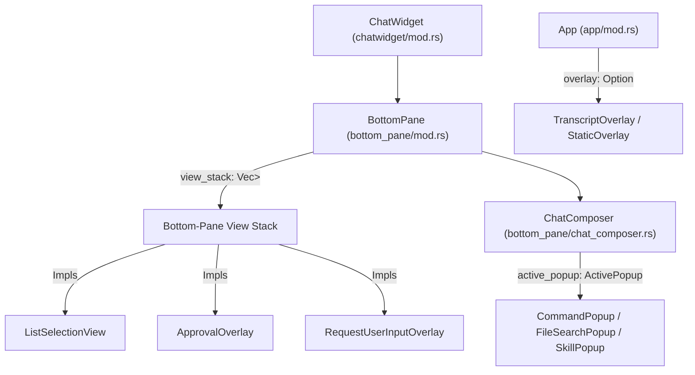
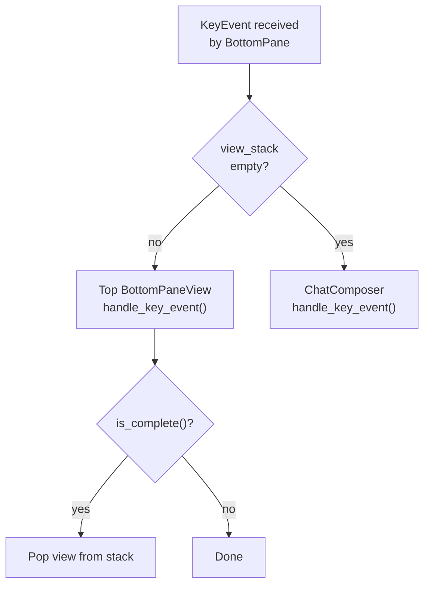
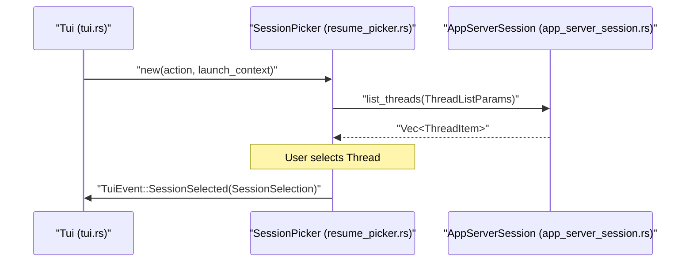
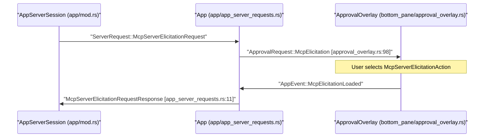

# 대화형 Overlay와 Popup

관련 소스 파일

다음 파일들은 이 위키 페이지를 생성하기 위한 컨텍스트로 사용되었습니다.

- [codex-rs/tui/src/bottom_pane/approval_overlay.rs](codex-rs/tui/src/bottom_pane/approval_overlay.rs)
- [codex-rs/tui/src/bottom_pane/multi_select_picker.rs](codex-rs/tui/src/bottom_pane/multi_select_picker.rs)
- [codex-rs/tui/src/bottom_pane/request_user_input/layout.rs](codex-rs/tui/src/bottom_pane/request_user_input/layout.rs)
- [codex-rs/tui/src/bottom_pane/request_user_input/mod.rs](codex-rs/tui/src/bottom_pane/request_user_input/mod.rs)
- [codex-rs/tui/src/bottom_pane/request_user_input/render.rs](codex-rs/tui/src/bottom_pane/request_user_input/render.rs)
- [codex-rs/tui/src/bottom_pane/request_user_input/snapshots/codex_tui__bottom_pane__request_user_input__tests__request_user_input_footer_wrap.snap](codex-rs/tui/src/bottom_pane/request_user_input/snapshots/codex_tui__bottom_pane__request_user_input__tests__request_user_input_footer_wrap.snap)
- [codex-rs/tui/src/bottom_pane/request_user_input/snapshots/codex_tui__bottom_pane__request_user_input__tests__request_user_input_freeform.snap](codex-rs/tui/src/bottom_pane/request_user_input/snapshots/codex_tui__bottom_pane__request_user_input__tests__request_user_input_freeform.snap)
- [codex-rs/tui/src/bottom_pane/request_user_input/snapshots/codex_tui__bottom_pane__request_user_input__tests__request_user_input_multi_question_first.snap](codex-rs/tui/src/bottom_pane/request_user_input/snapshots/codex_tui__bottom_pane__request_user_input__tests__request_user_input_multi_question_first.snap)
- [codex-rs/tui/src/bottom_pane/request_user_input/snapshots/codex_tui__bottom_pane__request_user_input__tests__request_user_input_multi_question_last.snap](codex-rs/tui/src/bottom_pane/request_user_input/snapshots/codex_tui__bottom_pane__request_user_input__tests__request_user_input_multi_question_last.snap)
- [codex-rs/tui/src/bottom_pane/request_user_input/snapshots/codex_tui__bottom_pane__request_user_input__tests__request_user_input_options.snap](codex-rs/tui/src/bottom_pane/request_user_input/snapshots/codex_tui__bottom_pane__request_user_input__tests__request_user_input_options.snap)
- [codex-rs/tui/src/bottom_pane/request_user_input/snapshots/codex_tui__bottom_pane__request_user_input__tests__request_user_input_options_notes_visible.snap](codex-rs/tui/src/bottom_pane/request_user_input/snapshots/codex_tui__bottom_pane__request_user_input__tests__request_user_input_options_notes_visible.snap)
- [codex-rs/tui/src/bottom_pane/request_user_input/snapshots/codex_tui__bottom_pane__request_user_input__tests__request_user_input_scrolling_options.snap](codex-rs/tui/src/bottom_pane/request_user_input/snapshots/codex_tui__bottom_pane__request_user_input__tests__request_user_input_scrolling_options.snap)
- [codex-rs/tui/src/bottom_pane/request_user_input/snapshots/codex_tui__bottom_pane__request_user_input__tests__request_user_input_tight_height.snap](codex-rs/tui/src/bottom_pane/request_user_input/snapshots/codex_tui__bottom_pane__request_user_input__tests__request_user_input_tight_height.snap)
- [codex-rs/tui/src/bottom_pane/request_user_input/snapshots/codex_tui__bottom_pane__request_user_input__tests__request_user_input_wrapped_options.snap](codex-rs/tui/src/bottom_pane/request_user_input/snapshots/codex_tui__bottom_pane__request_user_input__tests__request_user_input_wrapped_options.snap)
- [codex-rs/tui/src/bottom_pane/snapshots/codex_tui__bottom_pane__chat_composer__tests__slash_popup_res.snap](codex-rs/tui/src/bottom_pane/snapshots/codex_tui__bottom_pane__chat_composer__tests__slash_popup_res.snap)
- [codex-rs/tui/src/bottom_pane/snapshots/codex_tui__bottom_pane__tests__status_and_composer_fill_height_without_bottom_padding.snap](codex-rs/tui/src/bottom_pane/snapshots/codex_tui__bottom_pane__tests__status_and_composer_fill_height_without_bottom_padding.snap)
- [codex-rs/tui/src/chatwidget/snapshots/codex_tui__chatwidget__tests__approval_modal_exec.snap](codex-rs/tui/src/chatwidget/snapshots/codex_tui__chatwidget__tests__approval_modal_exec.snap)
- [codex-rs/tui/src/chatwidget/snapshots/codex_tui__chatwidget__tests__approval_modal_exec_no_reason.snap](codex-rs/tui/src/chatwidget/snapshots/codex_tui__chatwidget__tests__approval_modal_exec_no_reason.snap)
- [codex-rs/tui/src/chatwidget/snapshots/codex_tui__chatwidget__tests__approval_modal_patch.snap](codex-rs/tui/src/chatwidget/snapshots/codex_tui__chatwidget__tests__approval_modal_patch.snap)
- [codex-rs/tui/src/chatwidget/snapshots/codex_tui__chatwidget__tests__chat_small_idle_h3.snap](codex-rs/tui/src/chatwidget/snapshots/codex_tui__chatwidget__tests__chat_small_idle_h3.snap)
- [codex-rs/tui/src/chatwidget/snapshots/codex_tui__chatwidget__tests__chat_small_running_h2.snap](codex-rs/tui/src/chatwidget/snapshots/codex_tui__chatwidget__tests__chat_small_running_h2.snap)
- [codex-rs/tui/src/chatwidget/snapshots/codex_tui__chatwidget__tests__chat_small_running_h3.snap](codex-rs/tui/src/chatwidget/snapshots/codex_tui__chatwidget__tests__chat_small_running_h3.snap)
- [codex-rs/tui/src/chatwidget/snapshots/codex_tui__chatwidget__tests__exec_approval_modal_exec.snap](codex-rs/tui/src/chatwidget/snapshots/codex_tui__chatwidget__tests__exec_approval_modal_exec.snap)
- [codex-rs/tui/src/chatwidget/snapshots/codex_tui__chatwidget__tests__status_widget_and_approval_modal.snap](codex-rs/tui/src/chatwidget/snapshots/codex_tui__chatwidget__tests__status_widget_and_approval_modal.snap)
- [codex-rs/tui/src/chatwidget/snapshots/codex_tui__chatwidget__tests__unified_exec_begin_restores_working_status.snap](codex-rs/tui/src/chatwidget/snapshots/codex_tui__chatwidget__tests__unified_exec_begin_restores_working_status.snap)
- [codex-rs/tui/src/line_truncation.rs](codex-rs/tui/src/line_truncation.rs)
- [codex-rs/tui/src/resume_picker.rs](codex-rs/tui/src/resume_picker.rs)
- [codex-rs/tui/src/snapshots/codex_tui__resume_picker__tests__resume_picker_screen.snap](codex-rs/tui/src/snapshots/codex_tui__resume_picker__tests__resume_picker_screen.snap)
- [codex-rs/tui/src/snapshots/codex_tui__resume_picker__tests__resume_picker_table.snap](codex-rs/tui/src/snapshots/codex_tui__resume_picker__tests__resume_picker_table.snap)
- [codex-rs/tui/src/snapshots/codex_tui__resume_picker__tests__resume_picker_thread_names.snap](codex-rs/tui/src/snapshots/codex_tui__resume_picker__tests__resume_picker_thread_names.snap)
- [codex-rs/tui/src/snapshots/codex_tui__status_indicator_widget__tests__renders_truncated.snap](codex-rs/tui/src/snapshots/codex_tui__status_indicator_widget__tests__renders_truncated.snap)
- [codex-rs/tui/src/snapshots/codex_tui__status_indicator_widget__tests__renders_with_queued_messages.snap](codex-rs/tui/src/snapshots/codex_tui__status_indicator_widget__tests__renders_with_queued_messages.snap)
- [codex-rs/tui/src/snapshots/codex_tui__status_indicator_widget__tests__renders_with_working_header.snap](codex-rs/tui/src/snapshots/codex_tui__status_indicator_widget__tests__renders_with_working_header.snap)

이 페이지는 Codex TUI의 overlay 및 popup 시스템을 문서화합니다. 각 overlay type의 구조, keyboard input이 가로채지고 routing되는 방식, overlay가 `AppEvent` message bus를 통해 action을 dispatch하는 방식을 설명합니다.

일반적인 TUI layout과 widget 계층은 [4.1]()을 참조하세요. 이러한 overlay 다수를 host하는 `BottomPane`과 input system은 [4.1.3]()을 참조하세요. `AppEvent` bus 자체는 [4.1.1]()을 참조하세요.

---

## Overlay 아키텍처

TUI에는 widget 계층 안의 서로 다른 scope에 위치한 **세 가지 distinct overlay layer**가 있습니다.

**TUI Overlay Layer와 코드 엔티티**

| Layer | Owner | Scope | 예시 |
|---|---|---|---|
| Composer popups | `ChatComposer.active_popup` | text input 위 | `CommandPopup`, `FileSearchPopup`, `SkillPopup` |
| Bottom-pane view stack | `BottomPane.view_stack` | composer 대체 | `ListSelectionView`, `ApprovalOverlay`, `RequestUserInputOverlay` |
| Full-screen overlay | `App.overlay` | 전체 screen 대체 | `TranscriptOverlay`, `StaticOverlay` |

출처: [codex-rs/tui/src/bottom_pane/mod.rs:150-181](), [codex-rs/tui/src/bottom_pane/chat_composer.rs:349-409]()

---

## `BottomPaneView` Trait

모든 bottom-pane view는 `BottomPane`이 polymorphic stack을 관리할 수 있게 하는 공통 trait(`bottom_pane_view::BottomPaneView`)를 구현합니다.

trait의 주요 method:
- `handle_key_event(key_event)` — input을 처리합니다 [codex-rs/tui/src/bottom_pane/bottom_pane_view.rs:21-21]().
- `on_ctrl_c() -> CancellationEvent` — Ctrl+C에서 view를 dismiss하기 위해 `Handled`를 반환합니다 [codex-rs/tui/src/bottom_pane/bottom_pane_view.rs:59-61]().
- `is_complete() -> bool` — view가 stack에서 pop되어야 함을 알립니다 [codex-rs/tui/src/bottom_pane/bottom_pane_view.rs:24-26]().
- `is_in_paste_burst() -> bool` — deferred paste-burst timer를 schedule하는 데 사용됩니다 [codex-rs/tui/src/bottom_pane/bottom_pane_view.rs:87-89]().
- `prefer_esc_to_handle_key_event() -> bool` — Esc를 `on_ctrl_c` 대신 `handle_key_event`로 routing합니다 [codex-rs/tui/src/bottom_pane/bottom_pane_view.rs:65-67]().
- `try_consume_approval_request()` — view가 들어오는 agent request를 intercept할 수 있게 합니다 [codex-rs/tui/src/bottom_pane/bottom_pane_view.rs:93-98]().

`BottomPane`은 모든 key event를 view stack을 통해 routing합니다.

1. view stack이 비어 있지 않으면 top view가 key를 먼저 받습니다.
2. Esc는 `prefer_esc_to_handle_key_event()`에 따라 `on_ctrl_c()` 또는 `handle_key_event()`를 호출할 수 있습니다.
3. `is_complete()`가 true를 반환하면 view가 stack에서 pop됩니다.
4. stack이 비어 있으면 input은 `ChatComposer`로 fall through됩니다.

**View stack input routing**

출처: [codex-rs/tui/src/bottom_pane/bottom_pane_view.rs:18-138]()

---

## Composer-Level Popup

이 popup들은 `ChatComposer` 안에서 관리되며 text input area 바로 위에 overlay로 렌더링됩니다. 한 번에 최대 하나만 active가 될 수 있고, `ActivePopup` enum으로 추적됩니다.

### `CommandPopup`

File: [codex-rs/tui/src/bottom_pane/command_popup.rs]()

사용자가 composer에 `/`를 입력하면 표시됩니다. built-in slash command와 custom user prompt를 나열합니다.

**주요 type:**

| Type | 목적 |
|---|---|
| `CommandPopup` | filtered list state와 scroll을 관리합니다 [codex-rs/tui/src/bottom_pane/command_popup.rs:35-39]() |
| `CommandItem` | `Builtin(SlashCommand)` 또는 `ServiceTier(ServiceTierCommand)` [codex-rs/tui/src/bottom_pane/command_popup.rs:30-34]() |
| `CommandPopupFlags` | feature gate(collaboration, connectors 등) [codex-rs/tui/src/bottom_pane/command_popup.rs:42-54]() |

**Filtering logic**:
- `on_composer_text_change(text)`는 `/` 뒤의 첫 번째 token에서 `command_filter`를 업데이트합니다 [codex-rs/tui/src/bottom_pane/command_popup.rs:99-117]().
- `filtered()`는 builtins에 대해 prefix 및 exact matching을 실행하고 `(CommandItem, Option<Vec<usize>>)` pair를 반환합니다. 여기서 `Vec<usize>`는 bold 처리할 character position을 포함합니다 [codex-rs/tui/src/bottom_pane/command_popup.rs:143-164]().

출처: [codex-rs/tui/src/bottom_pane/command_popup.rs:73-164]()

### `FileSearchPopup`

File: [codex-rs/tui/src/bottom_pane/file_search_popup.rs]()

사용자가 composer에 `@`를 입력하면 표시됩니다. file search result를 비동기적으로 표시합니다.

State machine:
- `set_query(query)`는 popup을 `waiting = true` 상태로 둡니다 [codex-rs/tui/src/bottom_pane/file_search_popup.rs:43-52]().
- 결과가 도착하면 `set_matches(query, matches)`가 visible list를 업데이트합니다. stale result를 버리기 위해 `query == pending_query`인 경우에만 업데이트합니다 [codex-rs/tui/src/bottom_pane/file_search_popup.rs:67-78]().

출처: [codex-rs/tui/src/bottom_pane/file_search_popup.rs:17-29]()

### `SkillPopup`

File: [codex-rs/tui/src/bottom_pane/skill_popup.rs]()

사용자가 composer에 `$`를 입력하면 표시됩니다. 사용 가능한 skills와 app connectors를 `MentionItem`으로 나열합니다.

`MentionItem` fields [codex-rs/tui/src/bottom_pane/skill_popup.rs:21-29]():

| Field | 목적 |
|---|---|
| `display_name` | popup row에 표시되는 text |
| `description` | 선택적 grey subtitle |
| `insert_text` | 선택 시 composer에 삽입되는 text |
| `category_tag` | 오른쪽 label(예: `skill`, `app`) |

Fuzzy matching은 `codex_utils_fuzzy_match::fuzzy_match`가 수행합니다 [codex-rs/tui/src/bottom_pane/skill_popup.rs:130-156]().

---

## Bottom-Pane View Stack

이 overlay들은 `ChatComposer`를 완전히 대체하며 `BottomPane.view_stack`에 의해 관리됩니다.

### `ListSelectionView`

File: [codex-rs/tui/src/bottom_pane/list_selection_view.rs]()

model picker, theme selection, 기타 여러 interactive choice에 사용되는 generic selection popup입니다.

**`SelectionViewParams`** (construction-time config) [codex-rs/tui/src/bottom_pane/list_selection_view.rs:160-180]():

| Field | 목적 |
|---|---|
| `title` / `subtitle` | Header text |
| `items: Vec<SelectionItem>` | Row data |
| `is_searchable` | search/filter text input을 활성화합니다 |
| `col_width_mode: ColumnWidthMode` | `AutoVisible`, `AutoAllRows`, 또는 `Fixed` column width |
| `row_display` | `Wrapped` 또는 `SingleLine` [codex-rs/tui/src/bottom_pane/list_selection_view.rs:173]() |

**`SelectionItem`** (per-row model) [codex-rs/tui/src/bottom_pane/list_selection_view.rs:131-147]():

| Field | 목적 |
|---|---|
| `name` | 표시 text |
| `display_shortcut` | 오른쪽에 표시되는 key binding |
| `actions: Vec<SelectionAction>` | item이 accepted될 때 `AppEventSender`에서 호출되는 closure |

출처: [codex-rs/tui/src/bottom_pane/list_selection_view.rs:130-180]()

### `ApprovalOverlay`

File: [codex-rs/tui/src/bottom_pane/approval_overlay.rs]()

`ApprovalOverlay`는 human-in-the-loop safety의 주요 메커니즘입니다. 명시적인 사용자 동의가 필요한 중요한 operation을 intercept합니다.

**`ApprovalRequest` variants** [codex-rs/tui/src/bottom_pane/approval_overlay.rs:72-105]():
- `Exec`: shell command 실행 권한을 요청합니다 [codex-rs/tui/src/bottom_pane/approval_overlay.rs:73-82]().
- `Permissions`: `RequestPermissionProfile`을 통해 특정 system capability 접근을 요청합니다 [codex-rs/tui/src/bottom_pane/approval_overlay.rs:83-89]().
- `ApplyPatch`: file change(diff)를 apply하기 위한 approval을 요청합니다 [codex-rs/tui/src/bottom_pane/approval_overlay.rs:90-97]().
- `McpElicitation`: 사용자 확인이 필요한 외부 MCP server를 위한 variant입니다 [codex-rs/tui/src/bottom_pane/approval_overlay.rs:98-104]().

overlay는 command string이나 unified diff 같은 detail과 option selection list를 렌더링합니다. pending request queue를 관리합니다 [codex-rs/tui/src/bottom_pane/approval_overlay.rs:158-159]().

### `RequestUserInputOverlay`

File: [codex-rs/tui/src/bottom_pane/request_user_input/mod.rs]()

복잡한 elicitation을 위한 multi-question state machine이며, 일반적으로 `ToolRequestUserInput` server request에 의해 트리거됩니다.

- **Answer State**: 각 question은 selected option 및/또는 freeform notes를 가질 수 있습니다 [codex-rs/tui/src/bottom_pane/request_user_input/mod.rs:97-106]().
- **Focus Switching**: 사용자는 `Options`와 `Notes` 사이에서 focus를 전환할 수 있습니다 [codex-rs/tui/src/bottom_pane/request_user_input/mod.rs:66-69]().
- **Composer Integration**: freeform input을 캡처하기 위해 plain text용으로 설정된 내부 `ChatComposer`를 사용합니다 [codex-rs/tui/src/bottom_pane/request_user_input/mod.rs:178-185]().
- **Layout Management**: progress, questions, options, notes의 area를 계산하고 공간이 줄어들면 section을 collapse하기 위해 `layout_sections`를 구현합니다 [codex-rs/tui/src/bottom_pane/request_user_input/layout.rs:19-60]().

출처: [codex-rs/tui/src/bottom_pane/request_user_input/mod.rs:130-203](), [codex-rs/tui/src/bottom_pane/request_user_input/layout.rs:19-60]()

---

## Session Resumption Picker

`SessionPicker`는 startup 또는 session switching 중 이전 thread를 resume하거나 fork하는 데 사용되는 full-screen interactive view입니다.

**Session Picker Data Flow**

**주요 기능**:
- **Filtering**: Current Working Directory(CWD) 기준 filtering 또는 모든 session 표시를 지원합니다 [codex-rs/tui/src/resume_picker.rs:163-184]().
- **Pagination**: `PAGE_SIZE = 25`로 lazy pagination을 구현합니다 [codex-rs/tui/src/resume_picker.rs:66-67]().
- **Visual Density**: `Comfortable` 및 `Dense` view mode를 지원합니다 [codex-rs/tui/src/resume_picker.rs:209-240]().

출처: [codex-rs/tui/src/resume_picker.rs:66-241]()

---

## MCP Elicitation Views

MCP server가 사용자에게 추가 정보를 요구하면 elicitation request를 발행합니다. TUI는 이를 `ApprovalOverlay`를 통해 처리합니다.

**MCP Elicitation Flow와 Protocol Mapping**

출처: [codex-rs/tui/src/bottom_pane/approval_overlay.rs:98-104](), [codex-rs/tui/src/app/app_server_requests.rs:120-129]()

---

## Skills와 Manage Skills Overlay

Skills는 특수 view 또는 selection list를 통해 관리됩니다.

**Skills Management Lifecycle**:
1. **Trigger**: `open_manage_skills_popup()`이 skill state를 초기화합니다 [codex-rs/tui/src/chatwidget/skills.rs:66-76]().
2. **Display**: `SkillsToggleView`가 bottom pane에 표시됩니다 [codex-rs/tui/src/chatwidget/skills.rs:97-102]().
3. **Toggle**: skill을 선택하면 `update_skill_enabled()`를 통해 상태가 업데이트됩니다 [codex-rs/tui/src/chatwidget/skills.rs:105-112]().
4. **Closing**: view가 닫히면 `handle_manage_skills_closed()`가 변경 사항을 요약합니다 [codex-rs/tui/src/chatwidget/skills.rs:114-145]().

| Component | 역할 |
|---|---|
| `SkillsToggleView` | skill 활성화/비활성화를 위한 bottom-pane view입니다 [codex-rs/tui/src/chatwidget/skills.rs:97](). |
| `SkillsToggleItem` | toggle list 안의 단일 skill에 대한 data model입니다 [codex-rs/tui/src/chatwidget/skills.rs:87-93](). |
| `MentionItem` | `$`를 통해 skill reference를 삽입하기 위한 `SkillPopup`에서 사용됩니다 [codex-rs/tui/src/bottom_pane/skill_popup.rs:21](). |

출처: [codex-rs/tui/src/chatwidget/skills.rs:66-145](), [codex-rs/tui/src/bottom_pane/skill_popup.rs:21-37]()

---

## Popup이 공유하는 Rendering Primitive

대부분의 popup은 row rendering을 `bottom_pane/selection_popup_common.rs`의 helper에 위임합니다.

| Helper | 목적 |
|---|---|
| `render_menu_surface(area, buf)` | 공유 background를 칠하고 inset content rect를 반환합니다 [codex-rs/tui/src/bottom_pane/selection_popup_common.rs:99-107]() |
| `render_rows_with_col_width_mode(...)` | 특정 column layout으로 `Vec<GenericDisplayRow>`를 렌더링합니다 [codex-rs/tui/src/bottom_pane/selection_popup_common.rs:218-228](). |
| `measure_rows_height_with_col_width_mode(...)` | viewport와 scroll state가 주어졌을 때 필요한 height를 계산합니다 [codex-rs/tui/src/bottom_pane/selection_popup_common.rs:288-296](). |

출처: [codex-rs/tui/src/bottom_pane/selection_popup_common.rs:29-296]()
