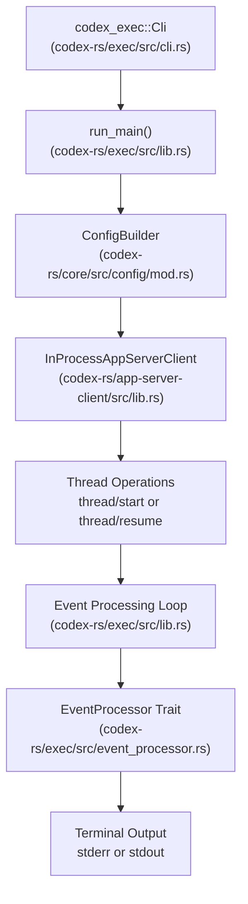
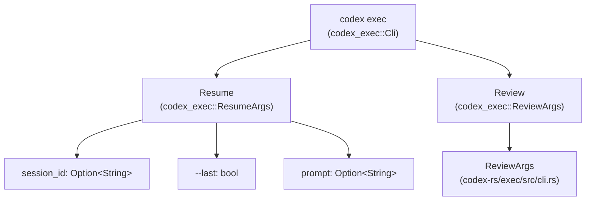
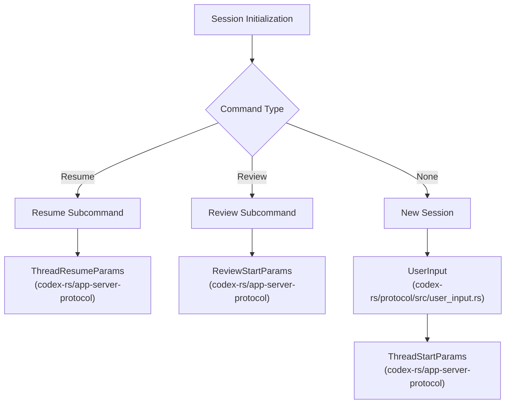
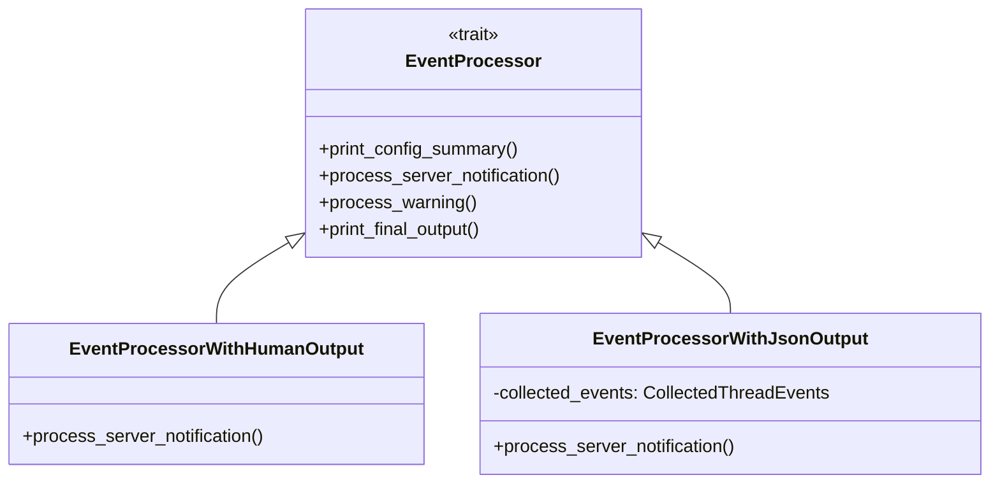

# Headless Execution Mode (codex exec)

관련 소스 파일

다음 파일들은 이 위키 페이지를 생성하기 위한 컨텍스트로 사용되었습니다.

- [codex-rs/Cargo.lock](codex-rs/Cargo.lock)
- [codex-rs/Cargo.toml](codex-rs/Cargo.toml)
- [codex-rs/cli/Cargo.toml](codex-rs/cli/Cargo.toml)
- [codex-rs/cli/src/lib.rs](codex-rs/cli/src/lib.rs)
- [codex-rs/cli/src/main.rs](codex-rs/cli/src/main.rs)
- [codex-rs/core/Cargo.toml](codex-rs/core/Cargo.toml)
- [codex-rs/core/src/lib.rs](codex-rs/core/src/lib.rs)
- [codex-rs/exec/Cargo.toml](codex-rs/exec/Cargo.toml)
- [codex-rs/exec/src/cli.rs](codex-rs/exec/src/cli.rs)
- [codex-rs/exec/src/event_processor.rs](codex-rs/exec/src/event_processor.rs)
- [codex-rs/exec/src/event_processor_with_jsonl_output.rs](codex-rs/exec/src/event_processor_with_jsonl_output.rs)
- [codex-rs/exec/src/exec_events.rs](codex-rs/exec/src/exec_events.rs)
- [codex-rs/exec/src/lib.rs](codex-rs/exec/src/lib.rs)
- [codex-rs/exec/tests/event_processor_with_json_output.rs](codex-rs/exec/tests/event_processor_with_json_output.rs)
- [codex-rs/exec/tests/suite/add_dir.rs](codex-rs/exec/tests/suite/add_dir.rs)
- [codex-rs/tui/Cargo.toml](codex-rs/tui/Cargo.toml)
- [codex-rs/tui/src/cli.rs](codex-rs/tui/src/cli.rs)
- [codex-rs/tui/src/lib.rs](codex-rs/tui/src/lib.rs)
- [sdk/typescript/README.md](sdk/typescript/README.md)
- [sdk/typescript/eslint.config.js](sdk/typescript/eslint.config.js)
- [sdk/typescript/samples/basic_streaming.ts](sdk/typescript/samples/basic_streaming.ts)
- [sdk/typescript/src/codex.ts](sdk/typescript/src/codex.ts)
- [sdk/typescript/src/codexOptions.ts](sdk/typescript/src/codexOptions.ts)
- [sdk/typescript/src/events.ts](sdk/typescript/src/events.ts)
- [sdk/typescript/src/exec.ts](sdk/typescript/src/exec.ts)
- [sdk/typescript/src/index.ts](sdk/typescript/src/index.ts)
- [sdk/typescript/src/items.ts](sdk/typescript/src/items.ts)
- [sdk/typescript/src/thread.ts](sdk/typescript/src/thread.ts)
- [sdk/typescript/src/threadOptions.ts](sdk/typescript/src/threadOptions.ts)
- [sdk/typescript/src/turnOptions.ts](sdk/typescript/src/turnOptions.ts)
- [sdk/typescript/tests/abort.test.ts](sdk/typescript/tests/abort.test.ts)
- [sdk/typescript/tests/codexExecSpy.ts](sdk/typescript/tests/codexExecSpy.ts)
- [sdk/typescript/tests/exec.test.ts](sdk/typescript/tests/exec.test.ts)
- [sdk/typescript/tests/responsesProxy.ts](sdk/typescript/tests/responsesProxy.ts)
- [sdk/typescript/tests/run.test.ts](sdk/typescript/tests/run.test.ts)
- [sdk/typescript/tests/runStreamed.test.ts](sdk/typescript/tests/runStreamed.test.ts)

headless execution mode(`codex exec`)는 Codex를 프로그래밍 방식으로 또는 automation workflow에서 실행하기 위한 비대화형 command-line interface입니다. interactive TUI([Terminal User Interface (TUI)](#4.1) 참조)와 달리 exec mode는 사용자 상호작용 없이 단일 session을 완료까지 실행하고, stdout/stderr로 event를 내보내며, agent가 task가 완료되었다고 판단하면 종료합니다. 또한 이전 session 재개와 비대화형 code review 실행을 지원합니다.

interactive terminal UI에 대한 정보는 [Terminal User Interface (TUI)](#4.1)를 참조하세요. IDE와의 app server 통합은 [App Server and IDE Integration](#4.5)을 참조하세요.

---

## 아키텍처 개요

exec mode는 TUI 및 app server와 동일한 core engine을 사용하지만, 이를 비대화형 event processor로 감쌉니다. execution logic은 `InProcessAppServerClient`를 초기화하고(내부적으로 `ThreadManager`를 관리), session이 완료될 때까지 loop에서 event를 처리합니다.

### Execution Mode 아키텍처

**출처**: [codex-rs/exec/src/lib.rs:13-21](), [codex-rs/exec/src/cli.rs:14-17](), [codex-rs/exec/src/event_processor.rs:13-29]()

---

## Command-Line Interface

### 기본 사용법

`codex-rs/exec/src/cli.rs`의 `Cli` 구조체는 `clap`을 사용해 비대화형 interface를 정의합니다.

| Argument | Type | 설명 |
|----------|------|-------------|
| `prompt` | `Option<String>` | task instruction입니다(positional 또는 stdin을 위한 `-`) [codex-rs/exec/src/cli.rs:81-86]() |
| `--image, -i` | `Vec<PathBuf>` | prompt용 image attachment입니다(`ResumeArgs` 안) [codex-rs/exec/src/cli.rs:192-200]() |
| `--model` | `Option<String>` | model selection을 override합니다(global) [codex-rs/exec/src/cli.rs:158]() |
| `--output-schema` | `Option<PathBuf>` | model response shape를 위한 JSON Schema입니다 [codex-rs/exec/src/cli.rs:52-54]() |
| `--json` | `bool` | event를 JSONL로 stdout에 출력합니다 [codex-rs/exec/src/cli.rs:63-70]() |
| `--output-last-message, -o` | `Option<PathBuf>` | 최종 agent message를 file에 씁니다 [codex-rs/exec/src/cli.rs:72-79]() |
| `--ephemeral` | `bool` | session file을 disk에 persist하지 않고 실행합니다 [codex-rs/exec/src/cli.rs:30-32]() |

**출처**: [codex-rs/exec/src/cli.rs:14-86]()

### Subcommands

exec mode는 `Command` enum에 정의된 subcommand를 지원합니다.

**출처**: [codex-rs/exec/src/cli.rs:166-172](), [codex-rs/exec/src/cli.rs:207-227]()

---

## 실행 흐름

`run_main` 함수(`codex-rs/exec/src/lib.rs`를 통해 호출됨)는 다음 단계를 조율합니다.

1.  **CLI argument parsing**: `Parser`를 사용해 command line에서 `Cli` 구조체를 추출합니다 [codex-rs/exec/src/cli.rs:14]().
2.  **Configuration loading**: `config.toml`, environment variable, CLI override를 merge합니다 [codex-rs/exec/src/lib.rs:62-66]().
3.  **Exec policy validation**: `check_execpolicy_for_warnings`로 policy warning을 확인합니다 [codex-rs/exec/src/lib.rs:61]().
4.  **Login restriction enforcement**: `enforce_login_restrictions`를 통해 authentication requirement를 검증합니다 [codex-rs/exec/src/lib.rs:77]().
5.  **Client initialization**: `DEFAULT_IN_PROCESS_CHANNEL_CAPACITY`로 `InProcessAppServerClient`를 생성합니다 [codex-rs/exec/src/lib.rs:16-21]().

### Session 초기화

initialization logic은 session type(New, Resume 또는 Review)을 결정하고 in-process server에 대응하는 API call을 수행합니다.

**출처**: [codex-rs/exec/src/lib.rs:162-170](), [codex-rs/exec/src/lib.rs:28-45]()

---

## Event Processing

### Event Processor Trait

`codex-rs/exec/src/event_processor.rs`의 `EventProcessor` trait는 in-process app server가 내보내는 event를 처리하기 위한 interface를 정의합니다 [codex-rs/exec/src/event_processor.rs:13-29]().

**출처**: [codex-rs/exec/src/event_processor.rs:13-29](), [codex-rs/exec/src/event_processor_with_human_output.rs:9](), [codex-rs/exec/src/event_processor_with_jsonl_output.rs:104]()

### Output Modes

1.  **`EventProcessorWithHumanOutput`**: terminal user를 위한 output을 형식화합니다. stdout을 최종 message용으로 깨끗하게 유지하기 위해 message delta와 tool result를 stderr에 씁니다 [codex-rs/exec/src/lib.rs:1-5](). 자세한 내용은 [Exec Mode Event Processing](#4.2.1)을 참조하세요.
2.  **`EventProcessorWithJsonOutput`**: `ThreadEvent` 객체를 JSONL로 stdout에 serialize합니다 [codex-rs/exec/src/lib.rs:3](). 내부 `ServerNotification` type을 `ThreadStarted`, `TurnStarted`, `TurnCompleted` 같은 public `ThreadEvent` schema로 매핑합니다 [codex-rs/exec/src/exec_events.rs:127-135]().

### Approval Handling

exec mode는 비대화형이므로, policy가 auto-approve로 설정되어 있지 않은 한 **approval request는 즉시 실패를 유발합니다**. `ServerRequest::NeedApprovalRequest`가 수신되면 processor가 elicitation response를 처리합니다. 자세한 내용은 [Exec Mode Event Processing](#4.2.1)을 참조하세요.

---

## Session Management

### Resuming과 Reviewing

- **Resuming**: `ResumeArgs`를 사용해 session ID 또는 `--last` flag를 기준으로 session을 다시 시작합니다 [codex-rs/exec/src/cli.rs:207-227](). 재개는 기존 rollout file에 append합니다.
- **Reviewing**: code analysis에 특화된 sub-agent를 트리거하는 `ReviewStartParams`를 구성합니다 [codex-rs/exec/src/lib.rs:28-30]().

session persistence와 sub-agent delegation에 대한 자세한 내용은 [Resume and Review Commands](#4.2.2)를 참조하세요.

### Core Event Mapping

`EventProcessorWithJsonOutput`은 `ServerNotification` variant를 `ThreadEvent` variant로 매핑합니다.

| Core Event (`ServerNotification`) | Exec Event (`ThreadEvent`) |
|-------------------------|---------------------------|
| `TurnStarted`           | `TurnStarted`             |
| `TurnCompleted`         | `TurnCompleted`           |
| `TurnFailed`            | `TurnFailed`              |

**출처**: [codex-rs/exec/src/exec_events.rs:127-135](), [codex-rs/exec/src/event_processor_with_jsonl_output.rs:144-200]()
