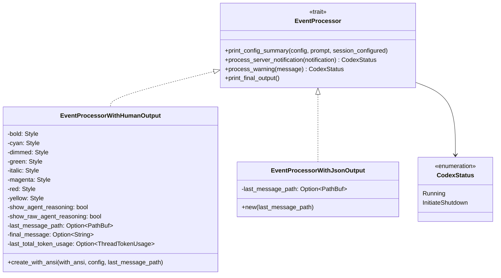
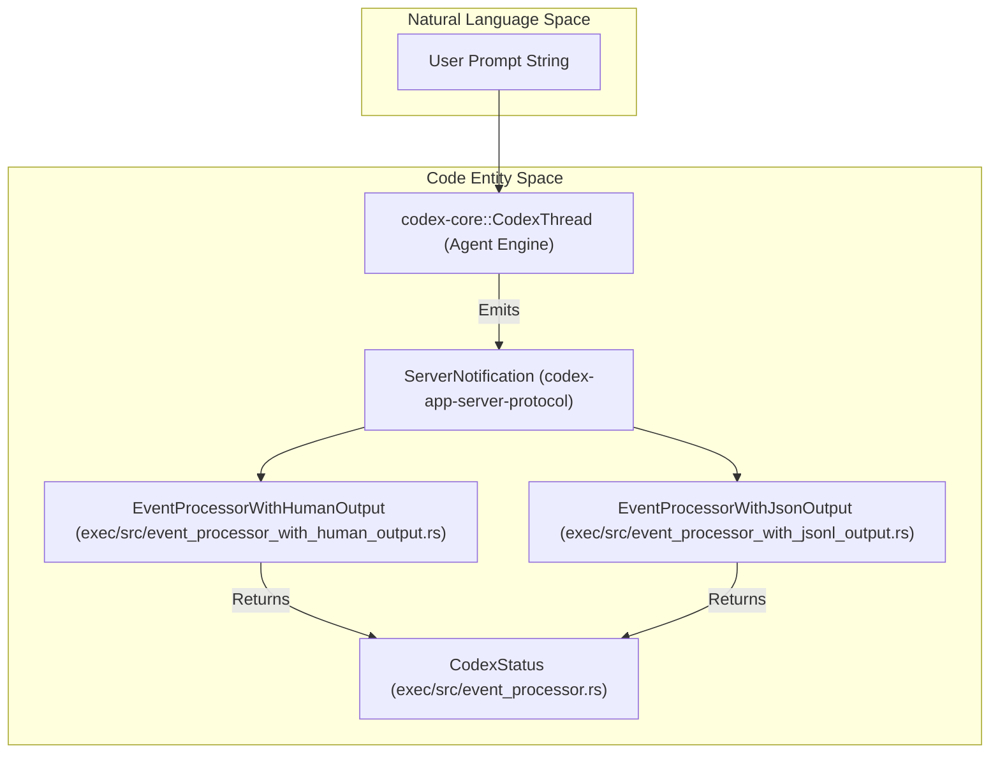
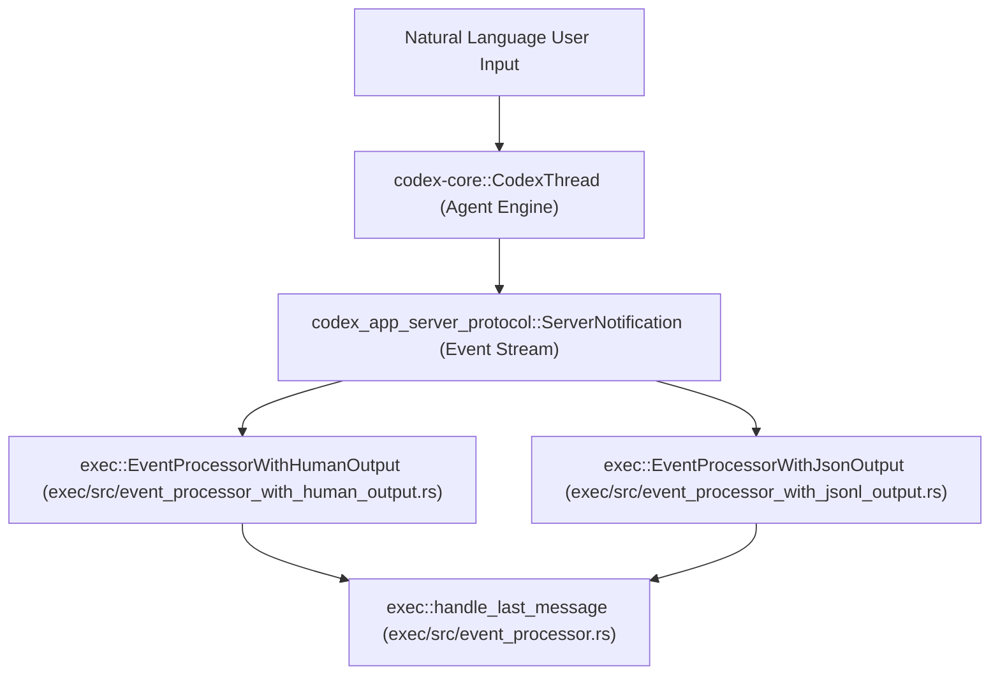

# Exec Mode 이벤트 처리

관련 소스 파일

다음 파일들은 이 위키 페이지를 생성하기 위한 컨텍스트로 사용되었습니다.

- [codex-rs/Cargo.lock](codex-rs/Cargo.lock)
- [codex-rs/Cargo.toml](codex-rs/Cargo.toml)
- [codex-rs/cli/Cargo.toml](codex-rs/cli/Cargo.toml)
- [codex-rs/cli/src/lib.rs](codex-rs/cli/src/lib.rs)
- [codex-rs/cli/src/main.rs](codex-rs/cli/src/main.rs)
- [codex-rs/core/Cargo.toml](codex-rs/core/Cargo.toml)
- [codex-rs/core/src/lib.rs](codex-rs/core/src/lib.rs)
- [codex-rs/exec/Cargo.toml](codex-rs/exec/Cargo.toml)
- [codex-rs/exec/src/cli.rs](codex-rs/exec/src/cli.rs)
- [codex-rs/exec/src/event_processor.rs](codex-rs/exec/src/event_processor.rs)
- [codex-rs/exec/src/event_processor_with_jsonl_output.rs](codex-rs/exec/src/event_processor_with_jsonl_output.rs)
- [codex-rs/exec/src/exec_events.rs](codex-rs/exec/src/exec_events.rs)
- [codex-rs/exec/src/lib.rs](codex-rs/exec/src/lib.rs)
- [codex-rs/exec/tests/event_processor_with_json_output.rs](codex-rs/exec/tests/event_processor_with_json_output.rs)
- [codex-rs/exec/tests/suite/add_dir.rs](codex-rs/exec/tests/suite/add_dir.rs)
- [codex-rs/tui/Cargo.toml](codex-rs/tui/Cargo.toml)
- [codex-rs/tui/src/cli.rs](codex-rs/tui/src/cli.rs)
- [codex-rs/tui/src/lib.rs](codex-rs/tui/src/lib.rs)
- [sdk/typescript/README.md](sdk/typescript/README.md)
- [sdk/typescript/eslint.config.js](sdk/typescript/eslint.config.js)
- [sdk/typescript/samples/basic_streaming.ts](sdk/typescript/samples/basic_streaming.ts)
- [sdk/typescript/src/codex.ts](sdk/typescript/src/codex.ts)
- [sdk/typescript/src/codexOptions.ts](sdk/typescript/src/codexOptions.ts)
- [sdk/typescript/src/events.ts](sdk/typescript/src/events.ts)
- [sdk/typescript/src/exec.ts](sdk/typescript/src/exec.ts)
- [sdk/typescript/src/index.ts](sdk/typescript/src/index.ts)
- [sdk/typescript/src/items.ts](sdk/typescript/src/items.ts)
- [sdk/typescript/src/thread.ts](sdk/typescript/src/thread.ts)
- [sdk/typescript/src/threadOptions.ts](sdk/typescript/src/threadOptions.ts)
- [sdk/typescript/src/turnOptions.ts](sdk/typescript/src/turnOptions.ts)
- [sdk/typescript/tests/abort.test.ts](sdk/typescript/tests/abort.test.ts)
- [sdk/typescript/tests/codexExecSpy.ts](sdk/typescript/tests/codexExecSpy.ts)
- [sdk/typescript/tests/exec.test.ts](sdk/typescript/tests/exec.test.ts)
- [sdk/typescript/tests/responsesProxy.ts](sdk/typescript/tests/responsesProxy.ts)
- [sdk/typescript/tests/run.test.ts](sdk/typescript/tests/run.test.ts)
- [sdk/typescript/tests/runStreamed.test.ts](sdk/typescript/tests/runStreamed.test.ts)

## 목적과 범위

이 페이지는 Codex codebase 안의 `Exec Mode` event processing을 문서화하며, `EventProcessorWithHumanOutput` 구조체, terminal output formatting, approval handling에 초점을 맞춥니다. Exec Mode는 `codex exec`를 통해 Codex 비대화형 session을 실행하는 기능을 지원하며, terminal display용 formatted output 또는 machine-readable JSON/JSONL output stream을 제공합니다.

event processor는 core engine이 내보내는 internal protocol event를 사람이 읽을 수 있는 terminal output 또는 structured JSON event로 변환합니다. 또한 session lifecycle notification과 final message persistence를 관리합니다.

**출처:**
[codex-rs/exec/src/event_processor_with_human_output.rs:23-65]()
[codex-rs/exec/src/event_processor_with_human_output.rs:67-212]()
[codex-rs/exec/src/event_processor.rs:1-40]()

---

## EventProcessor 아키텍처

exec mode event processing system은 여러 output format을 지원하는 trait 기반 design pattern을 사용합니다. core processing trait는 `EventProcessor` [codex-rs/exec/src/event_processor.rs:13-29]()이며, 구현체는 server notification을 처리하고 선택적으로 formatted output을 내보내야 합니다.

### Core Trait와 구현체

- **EventProcessorWithHumanOutput**: ANSI style을 사용한 terminal 지향 event rendering을 구현합니다 [codex-rs/exec/src/event_processor_with_human_output.rs:23-65]().
- **EventProcessorWithJsonOutput**: machine-readable JSON event serialization을 제공하며, 보통 다른 tool과의 통합에 사용됩니다 [codex-rs/exec/src/event_processor_with_jsonl_output.rs:17-40]().
- **CodexStatus**: main loop가 계속되어야 하는지(`Running`) 또는 중지되어야 하는지(`InitiateShutdown`)를 알리기 위해 processor가 반환하는 enum입니다 [codex-rs/exec/src/event_processor.rs:8-11]().

**출처:**
[codex-rs/exec/src/event_processor_with_human_output.rs:23-65]()
[codex-rs/exec/src/event_processor.rs:8-21]()
[codex-rs/exec/src/event_processor_with_jsonl_output.rs:17-40]()

---

### Exec Mode의 이벤트 데이터 흐름

이 다이어그램은 user prompt가 core engine과 event processor layer를 거쳐 사람이 읽을 수 있는 형식 또는 JSON 형식의 output을 생성하는 방식을 보여 줍니다.

- core engine은 prompt를 실행하고 `ServerNotification` stream을 내보냅니다 [codex-rs/exec/src/lib.rs:31-32]().
- 이러한 notification은 `process_server_notification`을 통해 event processor instance로 dispatch됩니다 [codex-rs/exec/src/event_processor.rs:23-23]().
- processor는 실행이 계속되는지 또는 shutdown이 시작되는지를 나타내는 `CodexStatus`를 반환합니다 [codex-rs/exec/src/event_processor.rs:8-11]().

**출처:**
[codex-rs/exec/src/event_processor_with_human_output.rs:67-101]()
[codex-rs/exec/src/event_processor_with_jsonl_output.rs:42-70]()
[codex-rs/exec/src/lib.rs:31-32]()
[codex-rs/exec/src/event_processor.rs:8-23]()

---

## EventProcessorWithHumanOutput — Terminal Formatting

`EventProcessorWithHumanOutput`은 CLI 실행의 기본 processor입니다. `owo-colors` crate를 사용해 조건부 ANSI escape code를 제공합니다 [codex-rs/exec/src/event_processor_with_human_output.rs:47-56]().

### ANSI Styling과 설정

style은 role과 operation status를 구분하기 위해 적용됩니다 [codex-rs/exec/src/event_processor_with_human_output.rs:49-56]():

| Style Field | Terminal에서의 사용 |
| :--- | :--- |
| `bold` | command string, MCP tool name, header입니다. |
| `italic` | "exec"와 "codex" 같은 source label입니다. |
| `dimmed` | reasoning text, file path, "started" status label입니다. |
| `magenta` | role header(Codex/Exec label)입니다. |
| `red` | 실패한 command의 exit code입니다. |
| `green` | 완료된 item의 success indicator입니다. |
| `cyan` | MCP server와 tool identifier입니다. |
| `yellow` | 거부된 operation status입니다. |

**출처:**
[codex-rs/exec/src/event_processor_with_human_output.rs:42-65]()
[codex-rs/exec/src/event_processor_with_human_output.rs:67-95]()

---

### Event Rendering 세부 사항

processor는 `codex-app-server-protocol`의 각 `ThreadItem` notification을 terminal display format으로 매핑합니다.

#### Item Started Rendering
item(command, tool call, search)이 시작되면 processor는 action과 context를 설명하는 header를 출력합니다 [codex-rs/exec/src/event_processor_with_human_output.rs:67-96]().

- **Command Execution**: magenta 색의 "exec" 뒤에 command string과 working directory를 출력합니다 [codex-rs/exec/src/event_processor_with_human_output.rs:69-76]().
- **MCP Tool Call**: server/tool name을 cyan으로 표시하고 bold "mcp:"를 출력합니다 [codex-rs/exec/src/event_processor_with_human_output.rs:77-84]().

#### Item Completed Rendering
완료 시 processor는 exit code, duration, aggregated output을 포함한 final status를 출력합니다 [codex-rs/exec/src/event_processor_with_human_output.rs:98-212]().

- **Agent Message**: model의 최종 text response를 렌더링합니다 [codex-rs/exec/src/event_processor_with_human_output.rs:100-108]().
- **Command Execution**: execution duration과 함께 "succeeded"(green) 또는 "exited [code]"(red)를 표시합니다 [codex-rs/exec/src/event_processor_with_human_output.rs:120-163]().
- **File Changes**: patch application의 status(completed, failed, declined)를 요약하고 영향을 받은 file path를 나열합니다 [codex-rs/exec/src/event_processor_with_human_output.rs:164-177]().

**출처:**
[codex-rs/exec/src/event_processor_with_human_output.rs:67-212]()

---

## Exec Mode의 Approval Handling

TUI는 approval을 위한 interactive overlay를 제공하지만 [codex-rs/tui/src/lib.rs:33-33](), Exec Mode는 `EventProcessor` logic과 core session configuration을 통해 approval을 처리합니다.

- **Approval Presets**: system은 `codex-utils-approval-presets`를 사용해 tool call에 어느 정도의 friction을 적용할지 결정합니다 [codex-rs/tui/src/lib.rs:58-58]().
- **Sync with Protocol**: Exec mode는 core engine이 내보내는 `AskForApproval` request에 응답합니다 [codex-rs/exec/src/lib.rs:88-88]().
- **MCP Tool Approvals**: MCP tool call의 approval은 tool execution loop 안에서 관리되며, `McpServerElicitationAction`을 통해 사용자 동의가 필요하면 agent가 pause되도록 보장합니다 [codex-rs/exec/src/lib.rs:25-26]().

**출처:**
[codex-rs/tui/src/lib.rs:33-58]()
[codex-rs/exec/src/lib.rs:25-88]()

---

## Last Message Persistence

`EventProcessor`는 선택적으로 마지막 전체 agent message를 file path에 persist할 수 있습니다 [codex-rs/exec/src/event_processor.rs:31-40](). 이는 raw text를 지정된 `output_file`에 쓰는 `handle_last_message`가 처리합니다 [codex-rs/exec/src/event_processor.rs:31-40]().

이 메커니즘을 통해 외부 automation은 stdout/stderr를 parse하지 않고도 `codex exec` 실행 결과를 캡처할 수 있습니다. 구현은 `std::fs::write`를 사용해 message를 disk에 commit합니다 [codex-rs/exec/src/event_processor.rs:44-44]().

**출처:**
[codex-rs/exec/src/event_processor.rs:31-48]()
[codex-rs/exec/src/event_processor_with_human_output.rs:34-36]()

---

## 자연어에서 코드 엔티티로 연결

이 다이어그램은 natural language prompt와 exec mode event processing과 관련된 internal code representation 사이의 일반 system component를 연결합니다.

**출처:**
[codex-rs/exec/src/event_processor.rs:1-40]()
[codex-rs/exec/src/event_processor_with_human_output.rs:23-65]()
[codex-rs/exec/src/event_processor_with_jsonl_output.rs:17-40]()
