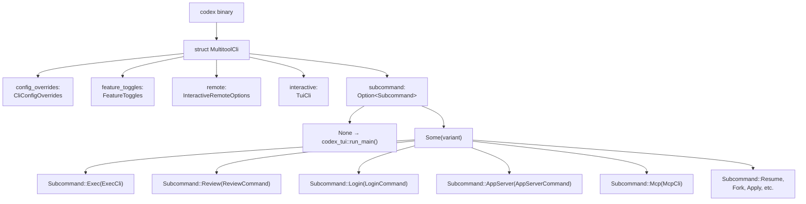
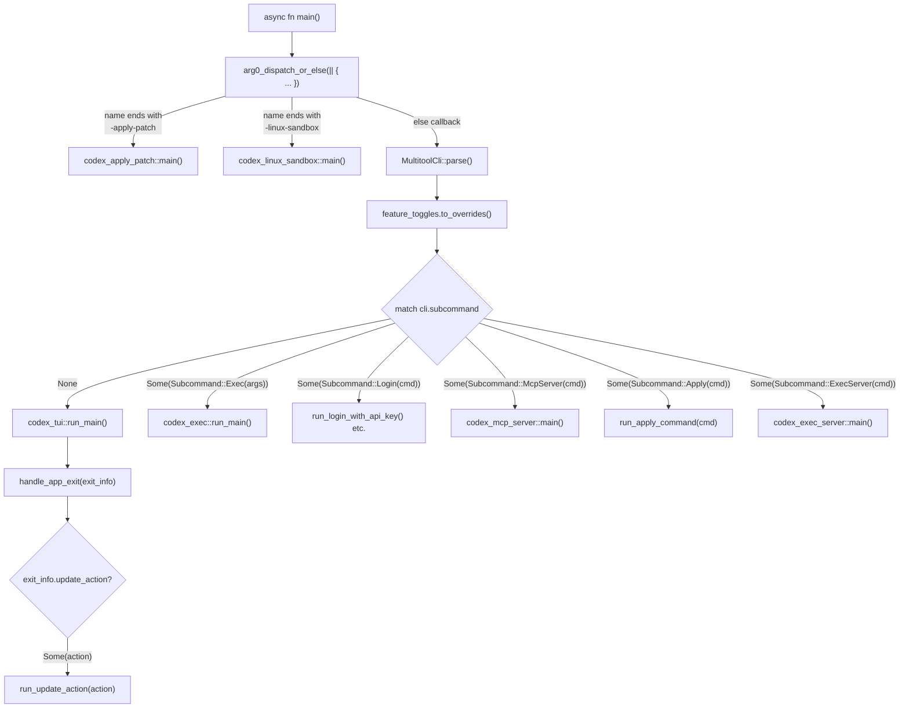
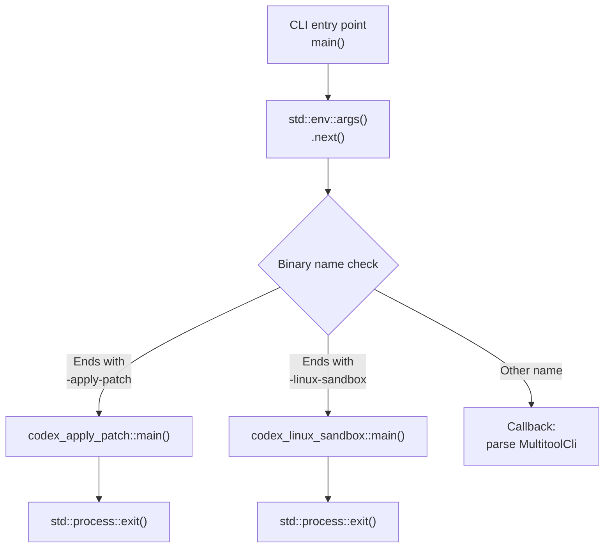

# CLI Entry Points와 Multitool Dispatch

관련 소스 파일

다음 파일들은 이 위키 페이지를 생성하기 위한 컨텍스트로 사용되었습니다.

- [codex-rs/Cargo.lock](codex-rs/Cargo.lock)
- [codex-rs/Cargo.toml](codex-rs/Cargo.toml)
- [codex-rs/cli/Cargo.toml](codex-rs/cli/Cargo.toml)
- [codex-rs/cli/src/lib.rs](codex-rs/cli/src/lib.rs)
- [codex-rs/cli/src/main.rs](codex-rs/cli/src/main.rs)
- [codex-rs/core/Cargo.toml](codex-rs/core/Cargo.toml)
- [codex-rs/core/src/lib.rs](codex-rs/core/src/lib.rs)
- [codex-rs/exec/Cargo.toml](codex-rs/exec/Cargo.toml)
- [codex-rs/exec/src/cli.rs](codex-rs/exec/src/cli.rs)
- [codex-rs/exec/src/event_processor.rs](codex-rs/exec/src/event_processor.rs)
- [codex-rs/exec/src/lib.rs](codex-rs/exec/src/lib.rs)
- [codex-rs/exec/src/main.rs](codex-rs/exec/src/main.rs)
- [codex-rs/mcp-server/Cargo.toml](codex-rs/mcp-server/Cargo.toml)
- [codex-rs/mcp-server/src/codex_tool_config.rs](codex-rs/mcp-server/src/codex_tool_config.rs)
- [codex-rs/mcp-server/src/lib.rs](codex-rs/mcp-server/src/lib.rs)
- [codex-rs/mcp-server/src/main.rs](codex-rs/mcp-server/src/main.rs)
- [codex-rs/mcp-server/src/message_processor.rs](codex-rs/mcp-server/src/message_processor.rs)
- [codex-rs/mcp-server/src/outgoing_message.rs](codex-rs/mcp-server/src/outgoing_message.rs)
- [codex-rs/mcp-server/tests/common/mcp_process.rs](codex-rs/mcp-server/tests/common/mcp_process.rs)
- [codex-rs/mcp-server/tests/suite/mod.rs](codex-rs/mcp-server/tests/suite/mod.rs)
- [codex-rs/tui/Cargo.toml](codex-rs/tui/Cargo.toml)
- [codex-rs/tui/src/cli.rs](codex-rs/tui/src/cli.rs)
- [codex-rs/tui/src/lib.rs](codex-rs/tui/src/lib.rs)
- [codex-rs/tui/src/main.rs](codex-rs/tui/src/main.rs)

## 목적과 범위

이 페이지는 Codex binary의 **CLI entry point architecture**를 문서화하며, 특히 `codex` executable이 command-line argument와 binary name을 기준으로 여러 execution mode(TUI, Exec, App Server 등)에 invocation을 routing하는 **multitool dispatcher**로 동작하는 방식을 설명합니다. dispatch mechanism은 subcommand routing이 있는 `clap` 기반 parser와 특수 binary invocation을 위한 **arg0 dispatch** system을 사용합니다.

**TUI mode** 자체에 대한 자세한 내용은 [4.1]()을 참조하세요. **Exec mode** 구현은 [4.2]()를 참조하세요. **App Server** protocol handling은 [4.5]()를 참조하세요. 이 페이지는 호출할 mode를 선택하는 routing layer에만 초점을 맞춥니다.

---

## MultitoolCli 구조와 Subcommand 계층

`codex` binary는 top-level command structure를 정의하는 단일 `MultitoolCli` parser를 사용합니다. subcommand가 제공되지 않으면 CLI는 기본적으로 **interactive TUI mode**를 사용합니다. parser structure는 [codex-rs/cli/src/main.rs:90-117]()에 정의되어 있습니다.

**다이어그램: MultitoolCli 구조와 Field 구성**

**출처**: [codex-rs/cli/src/main.rs:90-117](), [codex-rs/cli/src/main.rs:119-209]()

`MultitoolCli`의 `#[clap(subcommand_negates_reqs = true)]` attribute [codex-rs/cli/src/main.rs:95-95]()는 subcommand가 있을 때 top-level interactive argument가 validation되지 않게 하여 invocation mode에 따라 서로 다른 argument requirement를 허용합니다. `interactive: TuiCli` field는 `#[clap(flatten)]` [codex-rs/cli/src/main.rs:113-113]()를 통해 flatten되어 subcommand가 지정되지 않았을 때 TUI-specific flag를 top level에서 사용할 수 있게 합니다.

---

## Subcommand Routing Table

다음 표는 각 subcommand를 implementation crate와 주요 사용 사례에 매핑합니다.

| Subcommand | Enum Variant | Struct | Crate | 목적 |
|------------|--------------|--------|-------|---------|
| *(none)* | N/A | `TuiCli` | `codex-tui` | Interactive terminal UI(기본 mode) |
| `exec` | `Subcommand::Exec` | `ExecCli` | `codex-exec` | Headless, non-interactive execution |
| `review` | `Subcommand::Review` | `ReviewCommand` | `codex-cli` | Code review mode(exec에 delegate) |
| `login` | `Subcommand::Login` | `LoginCommand` | `codex-cli` | ChatGPT 또는 API key로 인증 |
| `logout` | `Subcommand::Logout` | `LogoutCommand` | `codex-cli` | 저장된 credential 제거 |
| `mcp` | `Subcommand::Mcp` | `McpCli` | `codex-cli` | 외부 MCP server 관리 |
| `mcp-server` | `Subcommand::McpServer` | `McpServerCommand` | `codex-cli` | Codex를 MCP server(stdio)로 실행 |
| `app-server` | `Subcommand::AppServer` | `AppServerCommand` | `codex-cli` | IDE 통합을 위한 JSON-RPC 2.0 server |
| `app` | `Subcommand::App` | `app_cmd::AppCommand` | `codex-cli` | Codex desktop app 실행(macOS/Windows) |
| `apply` | `Subcommand::Apply` | `ApplyCommand` | `codex-chatgpt` | agent-generated diff를 working tree에 적용 |
| `resume` | `Subcommand::Resume` | `ResumeCommand` | `codex-cli` | 이전 session 재개(TUI picker) |
| `fork` | `Subcommand::Fork` | `ForkCommand` | `codex-cli` | 이전 session fork |
| `sandbox` | `Subcommand::Sandbox` | `HostSandboxArgs` | `codex-cli` | sandbox execution 직접 test |
| `completion` | `Subcommand::Completion` | `CompletionCommand` | `codex-cli` | shell completion script 생성 |
| `features` | `Subcommand::Features` | `FeaturesCli` | `codex-cli` | feature flag 검사 |
| `cloud` | `Subcommand::Cloud` | `CloudTasksCli` | `codex-cloud-tasks` | Codex Cloud task 탐색 및 적용 |
| `debug` | `Subcommand::Debug` | `DebugCommand` | `codex-cli` | debugging utility |
| `exec-server` | `Subcommand::ExecServer` | `ExecServerCommand` | `codex-cli` | standalone exec-server service 실행 |
| `stdio-to-uds` | `Subcommand::StdioToUds` | `StdioToUdsCommand` | `codex-cli` | stdio를 Unix domain socket으로 relay |
| `responses-api-proxy` | `Subcommand::ResponsesApiProxy` | `ResponsesApiProxyArgs` | `codex-cli` | responses API proxy 실행 |

**출처**: [codex-rs/cli/src/main.rs:121-209]()

---

## Dispatch Flow와 Main Function

`main` function은 dispatch logic을 조율합니다. entry point는 모든 mode에 async runtime support를 제공하기 위해 `#[tokio::main]` attribute를 사용합니다.

**다이어그램: Main Function Dispatch Flow**

**출처**: [codex-rs/cli/src/main.rs:9-10](), [codex-rs/cli/src/main.rs:90-117]()

### 주요 Dispatch 지점

1.  **Arg0 dispatch**: `codex-arg0`의 `arg0_dispatch_or_else()` function은 CLI args parsing 전에 binary name(`std::env::args().next()`)을 확인합니다. 특수 pattern(예: `-apply-patch` 또는 `-linux-sandbox`로 끝남)과 match되면 handler가 즉시 실행되고 종료합니다 [codex-rs/cli/src/main.rs:9-10]().

2.  **MultitoolCli parsing**: arg0-dispatch되지 않으면 `MultitoolCli::parse()`가 `clap`을 사용해 모든 argument와 flag를 parse합니다 [codex-rs/cli/src/main.rs:3-3]().

3.  **Subcommand match**: `cli.subcommand`에 대한 큰 `match` statement가 execution을 적절한 handler function 또는 crate entry point로 routing합니다 [codex-rs/cli/src/main.rs:115-117]().

---

## 특수 Binary를 위한 Arg0 Dispatch

**arg0 dispatch** mechanism은 동일한 binary가 다른 이름으로 호출될 때 특수 동작을 trigger할 수 있게 합니다. 이는 `codex-arg0` crate에서 `arg0_dispatch_or_else` function을 통해 구현됩니다 [codex-rs/cli/src/main.rs:9-10]().

### 특수 Binary 이름

| Binary Name Pattern | Handler Function | Crate | 목적 |
|---------------------|-----------------|-------|---------|
| `*-apply-patch` | `codex_apply_patch::main()` | `codex-apply-patch` | stdin에서 patch를 읽어 filesystem에 적용 |
| `*-linux-sandbox` | `codex_linux_sandbox::main()` | `codex-linux-sandbox` | Linux에서 Landlock+seccomp 아래 command 실행 |

pattern matching은 **suffix-based**입니다. `-apply-patch` 또는 `-linux-sandbox`로 끝나는 모든 binary name은 각 handler를 trigger합니다 [codex-rs/arg0/src/lib.rs]().

### Arg0 Dispatch Flow

**출처**: [codex-rs/cli/src/main.rs:9-10]()

---

## Default Mode Selection: Subcommand가 없으면 TUI

subcommand가 제공되지 않으면 CLI는 기본적으로 **TUI mode**를 사용합니다. `TuiCli` 구조체는 `#[clap(flatten)]` [codex-rs/cli/src/main.rs:113-113]()를 통해 `MultitoolCli`에 flatten되므로 TUI-specific argument를 top level에서 사용할 수 있습니다.

### TUI Variant로서 Resume과 Fork

`resume` [codex-rs/cli/src/main.rs:177-177]() 및 `fork` [codex-rs/cli/src/main.rs:185-185]() subcommand는 특수한 TUI invocation입니다. main function은 이러한 subcommand를 특정 flag가 설정된 `TuiCli` 구조체로 매핑한 다음 TUI를 실행합니다.

**출처**: [codex-rs/cli/src/main.rs:177-186](), [codex-rs/tui/src/cli.rs:1-76]()

---

## 공통 CLI 인프라

### CliConfigOverrides

모든 mode는 `codex-utils-cli`의 `CliConfigOverrides` 구조체를 공유하며, 이는 runtime에 `config.toml` 값을 override하기 위한 `-c key=value` syntax를 제공합니다 [codex-rs/cli/src/main.rs:103-104]().

### FeatureToggles

`FeatureToggles` 구조체 [codex-rs/cli/src/main.rs:106-107]()는 feature를 enable 또는 disable하는 flag를 제공합니다. 이 flag들은 `codex-features`에 정의된 known feature를 기준으로 validation됩니다 [codex-rs/cli/src/main.rs:74-76]().

**출처**: [codex-rs/cli/src/main.rs:74-76](), [codex-rs/cli/src/main.rs:103-107]()

---

## Exit Handling과 Update Actions

TUI 또는 Exec mode가 완료되면 control은 main function으로 돌아갑니다. TUI에서 exit info는 `AppExitInfo`로 반환됩니다 [codex-rs/tui/src/lib.rs:21-21](). 이 구조체는 다음을 포함합니다.

1.  **ExitReason**: app이 닫힌 이유입니다(예: user quit, fatal error) [codex-rs/tui/src/lib.rs:22-22]().
2.  **UpdateAction**: session 중 사용자가 update를 요청한 경우, 수행할 version/action을 포함합니다 [codex-rs/tui/src/lib.rs:203-204]().
3.  **Token usage summary**: `TokenUsage`를 통해 소비된 token 수를 추적합니다 [codex-rs/tui/src/lib.rs:76-76]().

**출처**: [codex-rs/tui/src/lib.rs:21-22](), [codex-rs/tui/src/lib.rs:76-76](), [codex-rs/tui/src/lib.rs:203-204]()

---

## Entry Point 책임 요약

CLI entry point layer는 다음을 제공합니다.

1.  **Unified binary interface**: subcommand 기반 mode selection이 있는 단일 `codex` executable입니다 [codex-rs/cli/src/main.rs:115-117]().
2.  **Arg0 dispatch**: 다른 이름으로 호출될 때 특수 동작을 수행합니다 [codex-rs/cli/src/main.rs:9-10]().
3.  **Default to TUI**: interactive mode가 기본 경험입니다 [codex-rs/cli/src/main.rs:113-113]().
4.  **Config override propagation**: `-c`와 feature flag가 모든 mode로 전달됩니다 [codex-rs/cli/src/main.rs:103-107]().
5.  **Resume Hinting**: `resume_hint`를 통해 이전 session을 제안하는 logic입니다 [codex-rs/cli/src/main.rs:39-39]().

**출처**: [codex-rs/cli/src/main.rs:9-10](), [codex-rs/cli/src/main.rs:113-117]()
