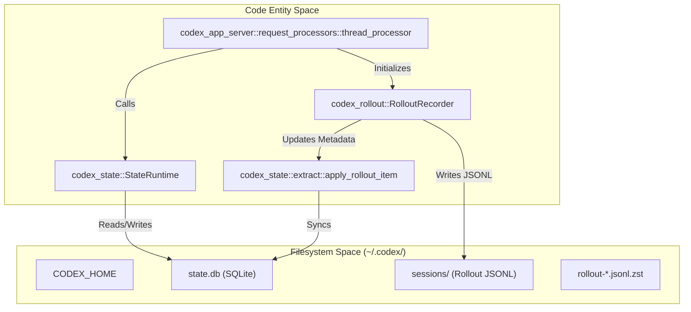
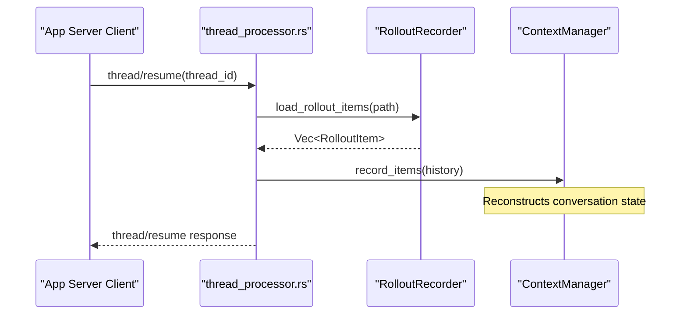

# Session Resumption과 Forking

관련 소스 파일

다음 파일들은 이 위키 페이지를 생성하기 위한 컨텍스트로 사용되었습니다.

- [codex-rs/app-server-protocol/src/protocol/v2/thread.rs](codex-rs/app-server-protocol/src/protocol/v2/thread.rs)
- [codex-rs/app-server/src/request_processors.rs](codex-rs/app-server/src/request_processors.rs)
- [codex-rs/app-server/src/request_processors/thread_lifecycle.rs](codex-rs/app-server/src/request_processors/thread_lifecycle.rs)
- [codex-rs/app-server/src/request_processors/thread_processor.rs](codex-rs/app-server/src/request_processors/thread_processor.rs)
- [codex-rs/app-server/src/request_processors/turn_processor.rs](codex-rs/app-server/src/request_processors/turn_processor.rs)
- [codex-rs/app-server/tests/suite/v2/thread_fork.rs](codex-rs/app-server/tests/suite/v2/thread_fork.rs)
- [codex-rs/app-server/tests/suite/v2/thread_resume.rs](codex-rs/app-server/tests/suite/v2/thread_resume.rs)
- [codex-rs/app-server/tests/suite/v2/thread_start.rs](codex-rs/app-server/tests/suite/v2/thread_start.rs)
- [codex-rs/app-server/tests/suite/v2/turn_start.rs](codex-rs/app-server/tests/suite/v2/turn_start.rs)
- [codex-rs/core/src/context/environment_context.rs](codex-rs/core/src/context/environment_context.rs)
- [codex-rs/core/src/context/environment_context_tests.rs](codex-rs/core/src/context/environment_context_tests.rs)
- [codex-rs/core/src/context_manager/history.rs](codex-rs/core/src/context_manager/history.rs)
- [codex-rs/core/src/context_manager/history_tests.rs](codex-rs/core/src/context_manager/history_tests.rs)
- [codex-rs/core/src/context_manager/mod.rs](codex-rs/core/src/context_manager/mod.rs)
- [codex-rs/core/src/context_manager/normalize.rs](codex-rs/core/src/context_manager/normalize.rs)
- [codex-rs/core/src/session/rollout_reconstruction_tests.rs](codex-rs/core/src/session/rollout_reconstruction_tests.rs)
- [codex-rs/core/tests/suite/resume_warning.rs](codex-rs/core/tests/suite/resume_warning.rs)
- [codex-rs/rollout-trace/src/protocol_event.rs](codex-rs/rollout-trace/src/protocol_event.rs)
- [codex-rs/rollout/Cargo.toml](codex-rs/rollout/Cargo.toml)
- [codex-rs/rollout/src/compression.rs](codex-rs/rollout/src/compression.rs)
- [codex-rs/rollout/src/compression_tests.rs](codex-rs/rollout/src/compression_tests.rs)
- [codex-rs/rollout/src/lib.rs](codex-rs/rollout/src/lib.rs)
- [codex-rs/rollout/src/list.rs](codex-rs/rollout/src/list.rs)
- [codex-rs/rollout/src/policy.rs](codex-rs/rollout/src/policy.rs)
- [codex-rs/rollout/src/recorder.rs](codex-rs/rollout/src/recorder.rs)
- [codex-rs/rollout/src/recorder_tests.rs](codex-rs/rollout/src/recorder_tests.rs)
- [codex-rs/rollout/src/search.rs](codex-rs/rollout/src/search.rs)
- [codex-rs/state/src/extract.rs](codex-rs/state/src/extract.rs)
- [codex-rs/thread-store/src/local/archive_thread.rs](codex-rs/thread-store/src/local/archive_thread.rs)
- [codex-rs/thread-store/src/local/list_threads.rs](codex-rs/thread-store/src/local/list_threads.rs)
- [codex-rs/thread-store/src/local/search_threads.rs](codex-rs/thread-store/src/local/search_threads.rs)
- [codex-rs/thread-store/src/local/test_support.rs](codex-rs/thread-store/src/local/test_support.rs)
- [codex-rs/thread-store/src/local/unarchive_thread.rs](codex-rs/thread-store/src/local/unarchive_thread.rs)
- [codex-rs/tui/src/chatwidget/snapshots/codex_tui__chatwidget__tests__image_generation_call_history_snapshot.snap](codex-rs/tui/src/chatwidget/snapshots/codex_tui__chatwidget__tests__image_generation_call_history_snapshot.snap)

## 목적과 범위

이 문서는 Codex가 resumption과 forking을 통해 session continuity를 관리하는 방식을 설명합니다. **Resumption**은 disk에 persist된 event를 replay하여 사용자가 이전 conversation thread를 계속할 수 있게 합니다. **Forking**은 parent thread의 history에서 분기되는 새 thread를 생성하여 original session을 변경하지 않고 다른 탐색 경로를 가능하게 합니다. 이러한 메커니즘은 session event를 JSONL file로 persist하고, 효율적인 retrieval과 state restoration을 위해 local SQLite database로 index하는 **Rollout System**에 의존합니다.

---

## 핵심 데이터 구조

### Session 식별과 Metadata
`ThreadId`는 각 session을 고유하게 식별합니다. 이 thread들의 metadata는 `codex-state` 및 `codex-rollout` crate를 통해 빠른 retrieval을 위해 관리되고 index됩니다.

| Component | Code Entity | 목적 |
|-----------|--------------|---------|
| `ThreadId` | `codex_protocol::ThreadId` | file naming과 database key에 사용되는 unique identifier입니다 [codex-rs/app-server/tests/suite/v2/thread_resume.rs:56](). |
| `SessionMeta` | `codex_protocol::protocol::SessionMeta` | `cwd`, `originator`, `model_provider` 같은 core metadata를 포함합니다 [codex-rs/rollout/src/recorder.rs:59](). |
| `RolloutItem` | `codex_protocol::protocol::RolloutItem` | rollout file에서 persistence의 기본 단위입니다 [codex-rs/rollout/src/recorder.rs:57](). |
| `ThreadMetadata` | `codex_state::model::ThreadMetadata` | git info와 token usage를 포함한 thread state의 SQLite-backed record입니다 [codex-rs/state/src/extract.rs:1](). |

**출처:** [codex-rs/app-server/tests/suite/v2/thread_resume.rs:56-76](), [codex-rs/rollout/src/recorder.rs:57-62](), [codex-rs/state/src/extract.rs:1-10]()

---

## Thread Storage와 Persistence

**다이어그램: Thread Storage와 Metadata Synchronization**

Thread는 조율되는 두 계층에 저장됩니다.
1. **Rollout Files**: `RolloutItem` entry의 전체 sequence를 포함하는 JSONL file입니다. 이 file들은 첫 user message 이후에만 materialize됩니다 [codex-rs/app-server/tests/suite/v2/thread_start.rs:110-112](). `RolloutRecorder`는 이러한 file에 대한 background write를 관리합니다 [codex-rs/rollout/src/recorder.rs:75-79]().
2. **State DB**: `StateRuntime`이 관리하는 SQLite database로, high-level index를 제공하기 위해 thread metadata(예: `git_sha`, `title`, `model`)를 추적합니다 [codex-rs/state/src/extract.rs:45-71](). `apply_rollout_item` 함수는 raw rollout item에서 검색 가능한 정보를 추출해 database에 저장합니다 [codex-rs/state/src/extract.rs:15-30]().

**출처:** [codex-rs/app-server/tests/suite/v2/thread_start.rs:110-112](), [codex-rs/rollout/src/recorder.rs:75-110](), [codex-rs/state/src/extract.rs:15-112]()

---

## Resumption과 Event Replay

Session resumption은 사용자가 existing thread를 이어서 진행할 수 있게 합니다. 시스템은 disk에서 rollout file을 찾고 이를 replay하여 agent state를 복원합니다.

### App Server Resume(v2 Protocol)
App Server는 `thread/resume` endpoint를 통해 resumption을 처리합니다. server는 진행하기 전에 요청된 `thread_id`에 materialized rollout file이 있는지 validate합니다 [codex-rs/app-server/tests/suite/v2/thread_resume.rs:148-174]().

**다이어그램: Resumption과 State Restoration**

### History Restoration과 Mismatch Detection
resumption 중 시스템은 configuration override(model, personality 등)가 active session state와 일치하는지 검증합니다. mismatch는 `collect_resume_override_mismatches`를 통해 log됩니다 [codex-rs/app-server/src/request_processors/thread_processor.rs:20-59](). resumed model이 현재 configuration과 다르면 `WarningEvent`가 emit됩니다 [codex-rs/core/tests/suite/resume_warning.rs:117-125]().

### Context Reconstruction
`ContextManager`는 resumed history의 ingestion을 처리하며, 복원된 state가 model의 context window에 맞도록 `TruncationPolicy`를 적용합니다 [codex-rs/core/src/context_manager/history.rs:91-105]().

**출처:** [codex-rs/app-server/tests/suite/v2/thread_resume.rs:148-174](), [codex-rs/app-server/src/request_processors/thread_processor.rs:20-59](), [codex-rs/core/tests/suite/resume_warning.rs:117-125](), [codex-rs/core/src/context_manager/history.rs:91-105]()

---

## Forking과 Snapshot

Forking은 parent thread에서 분기되는 새 thread를 생성합니다. 이는 original conversation을 수정하지 않고 alternative solution을 탐색하는 데 유용합니다.

### Forking 구현
`thread/fork`가 호출되면 시스템은 다음을 수행합니다.
1. 새 `ThreadId`와 `sessionId`를 생성합니다 [codex-rs/app-server/tests/suite/v2/thread_fork.rs:164-165]().
2. `forked_from_id` metadata를 parent ID로 설정합니다 [codex-rs/app-server/tests/suite/v2/thread_fork.rs:166]().
3. parent rollout이 변경되지 않도록 보장합니다 [codex-rs/app-server/tests/suite/v2/thread_fork.rs:159-162]().
4. fork된 thread는 parent의 turn들을 포함하지만, 자체 rollout path를 가진 별도 entity로 초기화됩니다 [codex-rs/app-server/tests/suite/v2/thread_fork.rs:170-172]().

### State Metadata Persistence
thread가 fork되면 `RolloutRecorder`는 `RolloutRecorderParams::Create`로 초기화되며, `forked_from_id`를 새 `SessionMeta`에 명시적으로 전달합니다 [codex-rs/rollout/src/recorder.rs:85-92]().

**출처:** [codex-rs/app-server/tests/suite/v2/thread_fork.rs:159-172](), [codex-rs/rollout/src/recorder.rs:83-92]()

---

## External Agent Session Migration

Codex는 external environment에서 history와 state를 import하고 session 간 consistency를 보장하는 것을 지원합니다.

### Personality Migration
시스템은 agent persona transition을 처리하기 위해 `PERSONALITY_MIGRATION_FILENAME`을 사용하는 `personality_migration` logic을 포함합니다 [codex-rs/app-server/tests/suite/v2/turn_start.rs:66]().

### Rollout Backfilling
시스템이 시작될 때 `sessions/` directory에서 발견된 existing rollout file과 SQLite `StateDb`를 sync하기 위해 "backfill" operation을 수행할 수 있습니다 [codex-rs/rollout/src/recorder_tests.rs:72-132](). 이를 통해 다른 instance나 external tool에서 migrate된 thread가 search와 resumption을 위해 올바르게 index됩니다 [codex-rs/rollout/src/recorder_tests.rs:134-143]().

### Legacy Support
`RolloutRecorder`에는 replay 중 `ghost_snapshot` line은 건너뛰면서도 `guardian_assessment` entry 같은 중요한 audit trail은 보존하는 등 legacy rollout format을 처리하는 logic이 포함되어 있습니다 [codex-rs/rollout/src/recorder_tests.rs:148-223]().

**출처:** [codex-rs/app-server/tests/suite/v2/turn_start.rs:66](), [codex-rs/rollout/src/recorder_tests.rs:72-223]()
