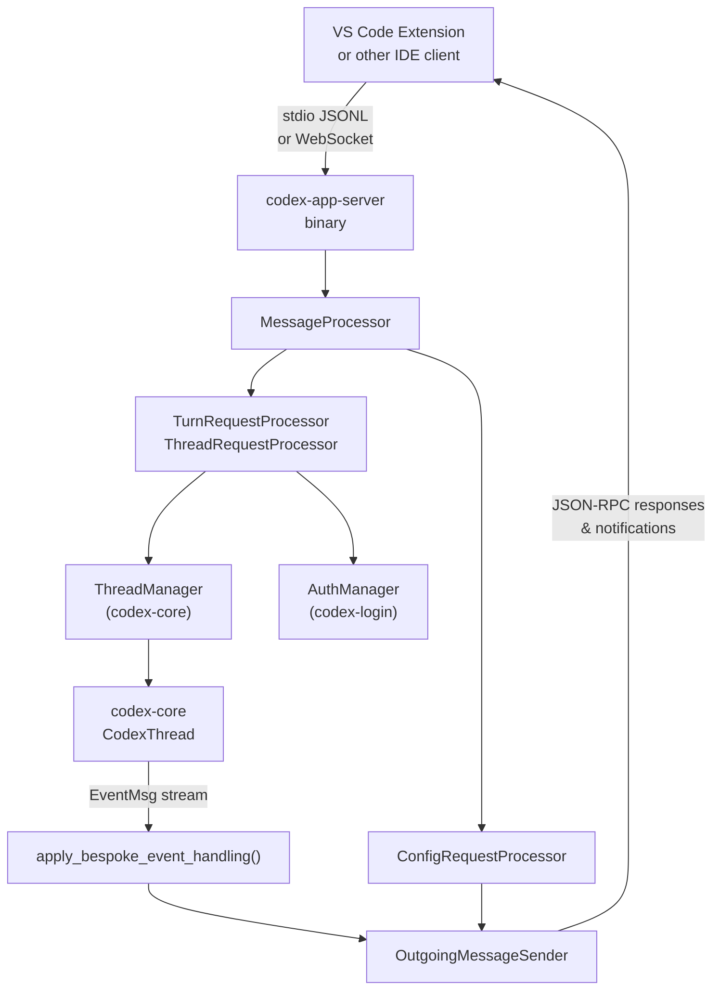
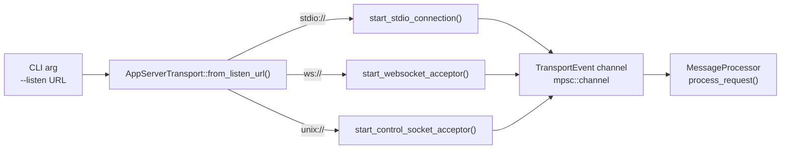
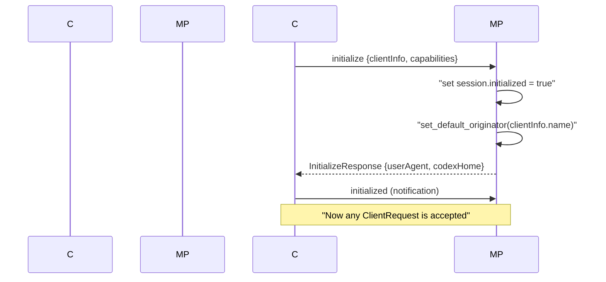
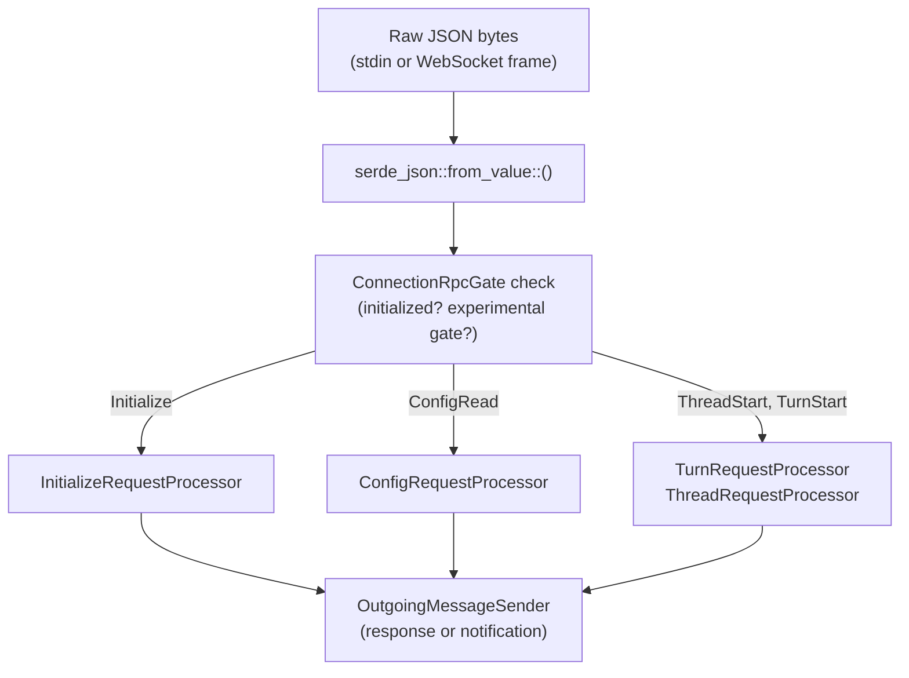
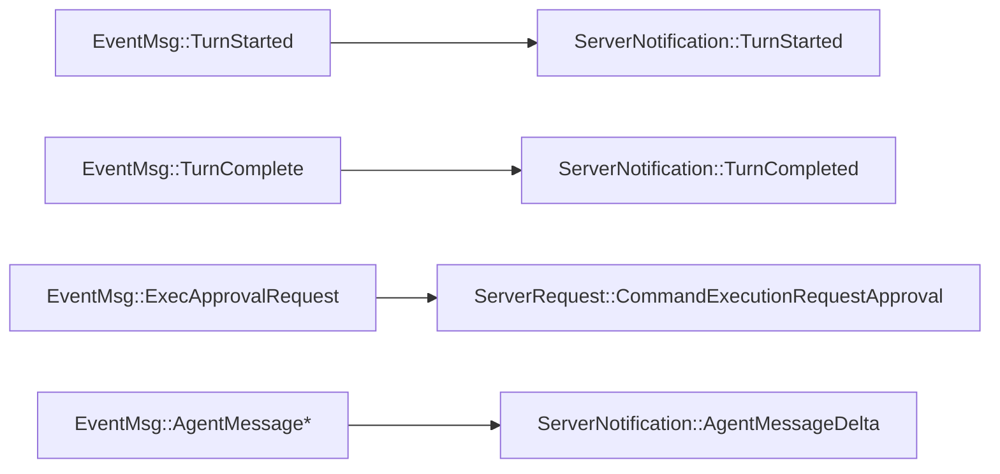

# App Server와 IDE 통합

관련 소스 파일

다음 파일들은 이 위키 페이지를 생성하기 위한 컨텍스트로 사용되었습니다:

- [codex-rs/app-server-client/Cargo.toml](codex-rs/app-server-client/Cargo.toml)
- [codex-rs/app-server-client/src/lib.rs](codex-rs/app-server-client/src/lib.rs)
- [codex-rs/app-server-client/src/remote.rs](codex-rs/app-server-client/src/remote.rs)
- [codex-rs/app-server-protocol/schema/json/ClientRequest.json](codex-rs/app-server-protocol/schema/json/ClientRequest.json)
- [codex-rs/app-server-protocol/schema/json/ServerNotification.json](codex-rs/app-server-protocol/schema/json/ServerNotification.json)
- [codex-rs/app-server-protocol/schema/json/codex_app_server_protocol.schemas.json](codex-rs/app-server-protocol/schema/json/codex_app_server_protocol.schemas.json)
- [codex-rs/app-server-protocol/schema/json/codex_app_server_protocol.v2.schemas.json](codex-rs/app-server-protocol/schema/json/codex_app_server_protocol.v2.schemas.json)
- [codex-rs/app-server-protocol/schema/typescript/ClientRequest.ts](codex-rs/app-server-protocol/schema/typescript/ClientRequest.ts)
- [codex-rs/app-server-protocol/schema/typescript/ServerNotification.ts](codex-rs/app-server-protocol/schema/typescript/ServerNotification.ts)
- [codex-rs/app-server-protocol/schema/typescript/v2/index.ts](codex-rs/app-server-protocol/schema/typescript/v2/index.ts)
- [codex-rs/app-server-protocol/src/protocol/common.rs](codex-rs/app-server-protocol/src/protocol/common.rs)
- [codex-rs/app-server/Cargo.toml](codex-rs/app-server/Cargo.toml)
- [codex-rs/app-server/README.md](codex-rs/app-server/README.md)
- [codex-rs/app-server/src/bespoke_event_handling.rs](codex-rs/app-server/src/bespoke_event_handling.rs)
- [codex-rs/app-server/src/extensions.rs](codex-rs/app-server/src/extensions.rs)
- [codex-rs/app-server/src/in_process.rs](codex-rs/app-server/src/in_process.rs)
- [codex-rs/app-server/src/lib.rs](codex-rs/app-server/src/lib.rs)
- [codex-rs/app-server/src/main.rs](codex-rs/app-server/src/main.rs)
- [codex-rs/app-server/src/mcp_refresh.rs](codex-rs/app-server/src/mcp_refresh.rs)
- [codex-rs/app-server/src/message_processor.rs](codex-rs/app-server/src/message_processor.rs)
- [codex-rs/app-server/src/outgoing_message.rs](codex-rs/app-server/src/outgoing_message.rs)
- [codex-rs/app-server/src/transport.rs](codex-rs/app-server/src/transport.rs)
- [codex-rs/app-server/tests/suite/v2/connection_handling_websocket.rs](codex-rs/app-server/tests/suite/v2/connection_handling_websocket.rs)

`codex-app-server` 크레이트([codex-rs/app-server/src/lib.rs]())는 Codex가 VS Code 확장 같은 풍부한 외부 클라이언트에 노출하는 인터페이스입니다. 이 크레이트는 JSON-RPC 2.0 채널로 통신하는 하위 프로세스로 실행되며, 소비자가 Rust를 직접 임베드하지 않아도 모든 Codex 에이전트 기능에 접근할 수 있게 합니다. 이 페이지에서는 서버 바이너리, 전송 계층, JSON-RPC 메시지 프로토콜, 그리고 클라이언트 요청을 `codex-core` 작업으로 변환하고 이벤트를 다시 스트리밍하는 런타임 파이프라인을 다룹니다.

app server가 위임하는 핵심 Op/Event 시스템에 대한 정보는 2.1 페이지(Protocol Layer)를 참조하세요. 이러한 API를 뒷받침하는 `ThreadManager`와 세션 수명주기는 3.1 페이지(Codex Interface and Session Lifecycle)를 참조하세요. 세부 하위 페이지에서는 특정 하위 시스템을 다룹니다:
- [CodexMessageProcessor and Request Handling](#4.5.1) — 요청 라우팅, 초기화 핸드셰이크, OutgoingMessageSender 양방향 통신을 문서화합니다.
- [Thread and Turn Management API](#4.5.2) — thread/* 및 turn/* 엔드포인트, 스레드 상태 추적, 구독 관리를 설명합니다.
- [Event Translation and Streaming](#4.5.3) — apply_bespoke_event_handling, 이벤트-알림 변환, 서버 요청 패턴을 문서화합니다.
- [Config API and Layer System](#4.5.4) — config/read 및 config/write 엔드포인트, 프로필 범위 지정, ConfigEditsBuilder를 설명합니다.
- [Authentication Modes and Account Management](#4.5.5) — 인증 모드(API 키, ChatGPT, 사용자 지정), 로그인/로그아웃 흐름, 계정 정보 조회를 문서화합니다.

---

## 아키텍처 개요

**상위 수준 컴포넌트 다이어그램**

출처: [codex-rs/app-server/src/lib.rs:23-27](), [codex-rs/app-server/src/message_processor.rs:165-177](), [codex-rs/app-server/src/bespoke_event_handling.rs:135-145]()

---

## 전송 계층

서버는 `--listen <url>`로 구성되는 여러 전송 모드를 지원합니다 [codex-rs/app-server/README.md:24-29]():

| 전송 방식 | 수신 URL | 형식 | 상태 |
|---|---|---|---|
| stdio | `stdio://` (기본값) | 줄바꿈으로 구분된 JSON(JSONL) | 안정 |
| WebSocket | `ws://IP:PORT` | 텍스트 프레임당 하나의 JSON-RPC 메시지 | 실험적 |
| Unix Socket | `unix://` | `.sock` 위의 WebSocket 프레임 | 안정 |

전송 구현은 JSON-RPC 2.0 메시지를 사용해 양방향 통신을 처리합니다 [codex-rs/app-server/README.md:20-23](). stdio가 IDE 하위 프로세스의 표준이지만, unix socket 전송은 `codex app-server proxy`를 통한 로컬 제어 평면 클라이언트에 사용됩니다 [codex-rs/app-server/README.md:39-42]().

**전송 디스패치 다이어그램**

출처: [codex-rs/app-server/src/lib.rs:34-42](), [codex-rs/app-server/src/transport.rs:1-100](), [codex-rs/app-server/README.md:24-30]()

백프레셔는 제한된 큐로 강제됩니다. 인그레스가 포화되면 새 요청은 JSON-RPC 오류 코드 `-32001`로 거부됩니다 [codex-rs/app-server/README.md:49-54]().

아웃바운드 경로는 전용 라우터 태스크를 사용합니다. 메시지는 `OutgoingEnvelope`에 배치되고 `OutgoingMessageSender`를 통해 연결별로 라우팅됩니다 [codex-rs/app-server/src/outgoing_message.rs:84-93]().

---

## 프로토콜

프로토콜은 JSON-RPC 2.0을 따르며, 일반적으로 와이어에서는 `"jsonrpc":"2.0"` 헤더가 생략됩니다 [codex-rs/app-server/README.md:22-23]().

| 방향 | 종류 | 설명 |
|---|---|---|
| Client → Server | `ClientRequest` | `id`, `method`, `params`가 있는 메서드 호출 |
| Client → Server | `ClientNotification` | `method`가 있는 클라이언트 알림(예: `initialized`) |
| Server → Client | `JSONRPCResponse` / `JSONRPCError` | `ClientRequest`에 대한 응답 |
| Server → Client | `ServerNotification` | 푸시 이벤트(예: `item/started`) |
| Server → Client | `ServerRequest` | 서버가 시작한 호출(예: `chatgpt/authTokens/refresh`) |

`ClientRequest`는 `client_request_definitions!` 매크로를 통해 정의된 `method` 태그 기반의 판별 유니언입니다 [codex-rs/app-server-protocol/src/protocol/common.rs:181-201]().

**주요 프로토콜 타입 다이어그램**

```mermaid
flowchart TD
    ClientRequest["ClientRequest\n(tagged union on method)"]
    Initialize["Initialize"]
    ThreadStart["Thread/start => 'thread/start'"]
    TurnStart["Turn/start => 'turn/start'"]
    ConfigRead["Config/read => 'config/read'"]
    
    ServerNotification["ServerNotification"]
    TurnStartedNotif["TurnStarted"]
    ItemStartedNotif["ItemStarted"]
    ItemCompletedNotif["ItemCompleted"]
    TurnCompletedNotif["TurnCompleted"]
    
    ServerRequest["ServerRequestPayload"]
    AuthRefresh["ChatgptAuthTokensRefresh"]
    CmdApproval["CommandExecutionRequestApproval"]
    
    ClientRequest --> Initialize
    ClientRequest --> ThreadStart
    ClientRequest --> TurnStart
    ClientRequest --> ConfigRead
    
    ServerNotification --> TurnStartedNotif
    ServerNotification --> ItemStartedNotif
    ServerNotification --> ItemCompletedNotif
    ServerNotification --> TurnCompletedNotif
    
    ServerRequest --> AuthRefresh
    ServerRequest --> CmdApproval
```

출처: [codex-rs/app-server-protocol/src/protocol/common.rs:181-201](), [codex-rs/app-server/src/message_processor.rs:165-177](), [codex-rs/app-server/src/bespoke_event_handling.rs:51-82]()

**스키마 생성**: 클라이언트는 `codex app-server generate-ts`로 TypeScript 타입을, `codex app-server generate-json-schema`로 JSON Schema를 추출할 수 있습니다 [codex-rs/app-server/README.md:57-62]().

---

## 초기화 핸드셰이크

모든 연결은 다른 요청을 보내기 전에 핸드셰이크를 완료해야 합니다 [codex-rs/app-server/README.md:76-85]().

출처: [codex-rs/app-server/src/message_processor.rs:165-177](), [codex-rs/app-server/README.md:83-89]()

`InitializeParams`의 주요 필드:
- `clientInfo.name`: 업스트림 서비스에서 클라이언트를 식별하는 데 사용됩니다 [codex-rs/app-server/README.md:91-94]().
- `capabilities.optOutNotificationMethods`: 이 연결에서 특정 알림 유형을 억제합니다 [codex-rs/app-server/README.md:86-88]().

---

## 메시지 처리 파이프라인

**계층을 통한 요청 라우팅**

출처: [codex-rs/app-server/src/message_processor.rs:165-177](), [codex-rs/app-server/src/message_processor.rs:19-38](), [codex-rs/app-server/src/lib.rs:81-102]()

`MessageProcessor` 구조체는 `ThreadRequestProcessor`, `ConfigRequestProcessor`, `FsRequestProcessor`, `McpRequestProcessor`를 포함한 특화 API 핸들러를 소유합니다 [codex-rs/app-server/src/message_processor.rs:165-177]().

---

## 핵심 프리미티브

API는 사용자 상호작용을 위한 세 가지 최상위 프리미티브를 노출합니다 [codex-rs/app-server/README.md:64-73]():

| 엔터티 | 설명 | 주요 코드 참조 |
|---|---|---|
| **Thread** | 여러 turn을 포함하는 대화 세션 | `codex_app_server_protocol::v2::ThreadId` [codex-rs/app-server-protocol/schema/json/codex_app_server_protocol.schemas.json:42]() |
| **Turn** | 하나의 상호작용(사용자 프롬프트 → 에이전트 응답) | `codex_app_server_protocol::Turn` [codex-rs/app-server/src/bespoke_event_handling.rs:72]() |
| **Item** | 원자적 단위(메시지, 도구 호출, 추론) | `codex_app_server_protocol::ThreadItem` [codex-rs/app-server/src/bespoke_event_handling.rs:54]() |

---

## 이벤트 변환과 스트리밍

[codex-rs/app-server/src/bespoke_event_handling.rs:135]()의 `apply_bespoke_event_handling` 함수는 `codex-core` 이벤트를 JSON-RPC 알림으로 변환합니다.

**EventMsg → ServerNotification 매핑**

출처: [codex-rs/app-server/src/bespoke_event_handling.rs:51-82](), [codex-rs/app-server/src/bespoke_event_handling.rs:135-145]()

---

## 정상 재시작

서버는 프로세스가 종료되기 전에 활성 turn이 완료되도록 정상 종료 메커니즘을 구현합니다 [codex-rs/app-server/src/lib.rs:161-166]().

1. **시그널 수신**: `ShutdownState`가 `requested = true`로 전환됩니다 [codex-rs/app-server/src/lib.rs:212]().
2. **드레인 단계**: 서버는 새 연결 수락을 중지하지만 `running_turn_count == 0`이 될 때까지 기다립니다 [codex-rs/app-server/src/lib.rs:224-230]().
3. **강제 종료**: 두 번째 시그널 또는 타임아웃이 즉시 종료를 강제합니다 [codex-rs/app-server/src/lib.rs:213-215]().

출처: [codex-rs/app-server/src/lib.rs:161-240]()
