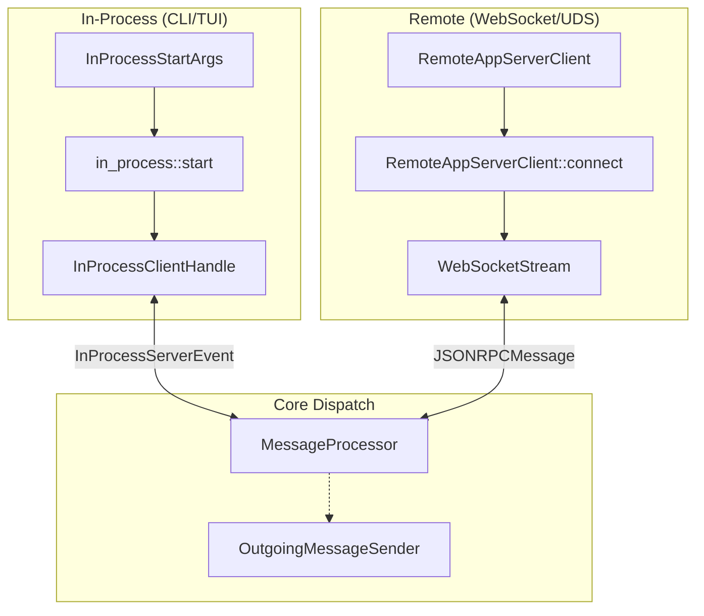

# CodexMessageProcessor와 요청 처리

관련 소스 파일

다음 파일들은 이 위키 페이지를 생성하기 위한 컨텍스트로 사용되었습니다:

- [codex-rs/app-server-client/Cargo.toml](codex-rs/app-server-client/Cargo.toml)
- [codex-rs/app-server-client/src/lib.rs](codex-rs/app-server-client/src/lib.rs)
- [codex-rs/app-server-client/src/remote.rs](codex-rs/app-server-client/src/remote.rs)
- [codex-rs/app-server/Cargo.toml](codex-rs/app-server/Cargo.toml)
- [codex-rs/app-server/src/extensions.rs](codex-rs/app-server/src/extensions.rs)
- [codex-rs/app-server/src/in_process.rs](codex-rs/app-server/src/in_process.rs)
- [codex-rs/app-server/src/lib.rs](codex-rs/app-server/src/lib.rs)
- [codex-rs/app-server/src/main.rs](codex-rs/app-server/src/main.rs)
- [codex-rs/app-server/src/mcp_refresh.rs](codex-rs/app-server/src/mcp_refresh.rs)
- [codex-rs/app-server/src/message_processor.rs](codex-rs/app-server/src/message_processor.rs)
- [codex-rs/app-server/src/outgoing_message.rs](codex-rs/app-server/src/outgoing_message.rs)
- [codex-rs/app-server/src/transport.rs](codex-rs/app-server/src/transport.rs)
- [codex-rs/app-server/tests/suite/v2/connection_handling_websocket.rs](codex-rs/app-server/tests/suite/v2/connection_handling_websocket.rs)

이 페이지는 `MessageProcessor`를 중심으로 한 Codex app-server의 요청 처리 아키텍처를 문서화합니다. 들어오는 JSON-RPC 바이트에서 도메인 핸들러 호출까지의 전체 파이프라인을 다루며, 초기화 핸드셰이크, `OutgoingMessageSender`를 통한 양방향 통신, 이벤트 변환을 포함합니다.

## 요청 파이프라인과 아키텍처

들어오는 요청은 다층 처리 아키텍처를 통과합니다. `MessageProcessor`는 연결 범위의 기본 진입점 역할을 하며, 도메인별 로직은 특화된 요청 프로세서에 위임됩니다.

**다이어그램: 요청 라우팅과 컴포넌트 연결**

```mermaid
flowchart TD
    subgraph "Transport Layer"
        T["AppServerTransport\n(stdio/WebSocket/Unix)"]
    end

    subgraph "Routing Layer"
        MP["MessageProcessor\nmessage_processor.rs"]
    end

    subgraph "Request Processors"
        IRP["InitializeRequestProcessor"]
        TRP["ThreadRequestProcessor"]
        TURN["TurnRequestProcessor"]
        CRP["ConfigRequestProcessor"]
        ERP["EnvironmentRequestProcessor"]
        ARP["AccountRequestProcessor"]
        APP["AppsRequestProcessor"]
        CAT["CatalogRequestProcessor"]
        CMD["CommandExecRequestProcessor"]
        EXT["ExternalAgentConfigRequestProcessor"]
        FB["FeedbackRequestProcessor"]
        FS["FsRequestProcessor"]
        GIT["GitRequestProcessor"]
        MCP["McpRequestProcessor"]
        MPL["MarketplaceRequestProcessor"]
        PLG["PluginRequestProcessor"]
        PROC["ProcessExecRequestProcessor"]
        REM["RemoteControlRequestProcessor"]
        SRCH["SearchRequestProcessor"]
        THG["ThreadGoalRequestProcessor"]
        WIN["WindowsSandboxRequestProcessor"]
    end

    T --> |"JSONRPCRequest"| MP
    MP --> |"initialize"| IRP
    MP --> |"thread/*"| TRP
    MP --> |"turn/*"| TURN
    MP --> |"config/*"| CRP
    MP --> |"environment/*"| ERP
    MP --> |"account/*"| ARP
    MP --> |"apps/*"| APP
    MP --> |"catalog/*"| CAT
    MP --> |"command_exec/*"| CMD
    MP --> |"external_agent_config/*"| EXT
    MP --> |"feedback/*"| FB
    MP --> |"fs/*"| FS
    MP --> |"git/*"| GIT
    MP --> |"mcp/*"| MCP
    MP --> |"marketplace/*"| MPL
    MP --> |"plugin/*"| PLG
    MP --> |"process_exec/*"| PROC
    MP --> |"remote_control/*"| REM
    MP --> |"search/*"| SRCH
    MP --> |"thread_goal/*"| THG
    MP --> |"windows_sandbox/*"| WIN

    IRP -.-> OMS["OutgoingMessageSender\noutgoing_message.rs"]
    TRP -.-> TM["ThreadManager\ncodex-core"]
    TURN -.-> TM
    CRP -.-> CM["ConfigManager\nconfig_manager.rs"]
    ERP -.-> EM["EnvironmentManager\ncodex-exec-server"]
```

출처: [codex-rs/app-server/src/message_processor.rs:165-219](), [codex-rs/app-server/src/lib.rs:25-26]()

---

## `MessageProcessor`와 초기화

`MessageProcessor`는 연결별 진입점입니다. 단일 클라이언트 세션의 수명주기를 관리하며, 다른 작업을 허용하기 전에 엄격한 초기화 핸드셰이크를 강제합니다.

### 초기화 핸드셰이크
클라이언트는 연결 직후 `initialize` 요청을 보내야 합니다. 서버는 다음 상태 머신을 강제합니다:
1.  **핸드셰이크 요구사항**: `initialize` 전에 전송된 모든 요청은 `Not initialized` 오류를 발생시킵니다. `MessageProcessor`는 대부분의 요청을 처리하기 전에 `ConnectionSessionState`를 확인해 연결이 초기화되었는지 보장합니다 [codex-rs/app-server/src/message_processor.rs:165-219]().
2.  **기능 협상**: 클라이언트는 `ClientInfo`와 `InitializeCapabilities`(예: 실험적 API opt-in, 알림 필터)를 포함하는 `InitializeParams`를 제공합니다 [codex-rs/app-server-protocol/src/lib.rs:35-40]().
3.  **상태 추적**: 클라이언트가 초기화되었는지, 어떤 실험적 API가 활성화되었는지 등 연결 상태는 `Arc<AtomicBool>` 플래그로 추적됩니다 [codex-rs/app-server/src/transport.rs:35-56]().

**주요 초기화 필드:**
| 필드 | 목적 |
| :--- | :--- |
| `experimental_api` | 실험적으로 표시된 기능을 사용하도록 opt-in합니다 [codex-rs/app-server-protocol/src/lib.rs:39-39](). |
| `opt_out_notification_methods` | 이 연결에서 특정 알림 유형을 억제합니다 [codex-rs/app-server/src/transport.rs:38-38](). |

출처: [codex-rs/app-server/src/message_processor.rs:165-219](), [codex-rs/app-server/src/transport.rs:35-56](), [codex-rs/app-server-protocol/src/lib.rs:35-40]()

---

## 양방향 통신

app-server는 양방향 통신 모델을 사용합니다. 클라이언트가 요청을 시작하지만, 서버도 비동기 알림이나 요청(예: 인증 갱신)을 클라이언트로 다시 보낼 수 있습니다.

### `OutgoingMessageSender`
`OutgoingMessageSender`는 서버에서 하나 이상의 클라이언트 연결로 메시지를 라우팅하는 역할을 합니다. 대기 중인 요청과 그에 연결된 콜백을 관리합니다 [codex-rs/app-server/src/outgoing_message.rs:96-105]().

*   **요청/응답**: `ServerRequestPayload` 전송과 `oneshot` 채널을 통한 `ClientRequestResult` 대기를 지원합니다 [codex-rs/app-server/src/outgoing_message.rs:133-144]().
*   **알림**: `ServerNotification` 메시지를 클라이언트에 디스패치합니다 [codex-rs/app-server/src/outgoing_message.rs:160-170]().
*   **범위 지정**: `ThreadScopedOutgoingMessageSender`는 전역 sender를 감싸 특정 `ThreadId`와 연결된 연결에만 메시지를 필터링합니다 [codex-rs/app-server/src/outgoing_message.rs:108-112]().

### 외부 인증 갱신 브리지
서버-클라이언트 요청의 구체적인 예는 `ExternalAuthRefreshBridge`입니다. 이 구조체는 `codex-login`의 `ExternalAuth` trait를 구현합니다 [codex-rs/app-server/src/message_processor.rs:111-163](). `codex-core`가 새 토큰을 필요로 할 때(예: ChatGPT 인증), `refresh`를 호출하며, 이는 app-server 프로토콜을 통해 클라이언트에 `ChatgptAuthTokensRefresh` 요청을 트리거합니다 [codex-rs/app-server/src/message_processor.rs:120-128](). 그런 다음 `OutgoingMessageSender`는 이 요청을 보내고 타임아웃을 두고 클라이언트의 응답을 기다립니다 [codex-rs/app-server/src/message_processor.rs:130-152]().

출처: [codex-rs/app-server/src/outgoing_message.rs:96-105](), [codex-rs/app-server/src/message_processor.rs:94-163]()

---

## In-Process와 Remote 처리

Codex는 원격 app-server(WebSocket/Unix socket 경유)와 CLI 및 TUI 같은 로컬 임베더를 위한 in-process 호스트를 모두 지원합니다.

**다이어그램: 전송과 라우팅 로직**

출처: [codex-rs/app-server/src/in_process.rs:118-151](), [codex-rs/app-server-client/src/remote.rs:163-182]()

### `InProcessClientHandle`
in-process 런타임 호스트는 프로토콜 의미론을 보존하면서 프로세스 경계를 피합니다. 소켓 대신 제한된 인메모리 채널을 사용합니다 [codex-rs/app-server/src/in_process.rs:1-40](). 이를 통해 다음이 가능합니다:
*   타입이 지정된 `ClientRequest` 값 전송 [codex-rs/app-server/src/in_process.rs:71-71]().
*   알림과 서버 요청을 포함하는 `InProcessServerEvent` 소비 [codex-rs/app-server/src/in_process.rs:158-167]().

---

## 동시성과 백프레셔

app-server는 높은 부하와 느린 클라이언트를 처리하기 위해 여러 메커니즘을 구현합니다:

1.  **제한된 채널**: 내부 통신은 기본 `CHANNEL_CAPACITY`(일반적으로 1024)를 가진 제한된 `mpsc` 채널을 사용합니다 [codex-rs/app-server/src/transport.rs:16-16]().
2.  **느린 클라이언트 연결 해제**: 연결의 아웃바운드 큐가 가득 차면, 서버는 백프레셔가 다른 연결에 영향을 주지 않도록 해당 클라이언트의 연결을 자동으로 끊습니다 [codex-rs/app-server/src/transport.rs:153-158]().
3.  **무손실 이벤트 계층**: 특정 알림(예: `TurnCompleted`, `AgentMessageDelta`, `ItemCompleted`)은 "무손실 계층"을 형성합니다. UI의 상태 손상을 방지하려면 반드시 전달되어야 합니다 [codex-rs/app-server-client/src/lib.rs:165-174]().
4.  **종료 로직**: 정상 종료 중 서버는 `CancellationToken`을 사용해 연결 해제를 알리고 드레인 기간을 기다립니다 [codex-rs/app-server/src/lib.rs:144-158](). `ShutdownState` 구조체는 요청된 종료와 강제 종료 사이의 전환을 관리합니다 [codex-rs/app-server/src/lib.rs:160-165]().

출처: [codex-rs/app-server/src/lib.rs:144-165](), [codex-rs/app-server/src/transport.rs:130-168](), [codex-rs/app-server/src/in_process.rs:104-111](), [codex-rs/app-server-client/src/lib.rs:165-174]()
