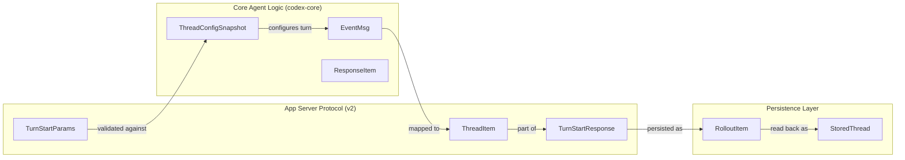

# Thread와 Turn 관리 API

<details>
<summary>관련 소스 파일</summary>

다음 파일들은 이 위키 페이지를 생성하기 위한 컨텍스트로 사용되었습니다:

- [codex-rs/app-server-protocol/src/protocol/v2/thread.rs](codex-rs/app-server-protocol/src/protocol/v2/thread.rs)
- [codex-rs/app-server/src/request_processors.rs](codex-rs/app-server/src/request_processors.rs)
- [codex-rs/app-server/src/request_processors/thread_lifecycle.rs](codex-rs/app-server/src/request_processors/thread_lifecycle.rs)
- [codex-rs/app-server/src/request_processors/thread_processor.rs](codex-rs/app-server/src/request_processors/thread_processor.rs)
- [codex-rs/app-server/src/request_processors/thread_processor_tests.rs](codex-rs/app-server/src/request_processors/thread_processor_tests.rs)
- [codex-rs/app-server/src/request_processors/turn_processor.rs](codex-rs/app-server/src/request_processors/turn_processor.rs)
- [codex-rs/app-server/tests/suite/conversation_summary.rs](codex-rs/app-server/tests/suite/conversation_summary.rs)
- [codex-rs/app-server/tests/suite/v2/remote_thread_store.rs](codex-rs/app-server/tests/suite/v2/remote_thread_store.rs)
- [codex-rs/app-server/tests/suite/v2/thread_fork.rs](codex-rs/app-server/tests/suite/v2/thread_fork.rs)
- [codex-rs/app-server/tests/suite/v2/thread_read.rs](codex-rs/app-server/tests/suite/v2/thread_read.rs)
- [codex-rs/app-server/tests/suite/v2/thread_resume.rs](codex-rs/app-server/tests/suite/v2/thread_resume.rs)
- [codex-rs/app-server/tests/suite/v2/thread_start.rs](codex-rs/app-server/tests/suite/v2/thread_start.rs)
- [codex-rs/app-server/tests/suite/v2/thread_unarchive.rs](codex-rs/app-server/tests/suite/v2/thread_unarchive.rs)
- [codex-rs/app-server/tests/suite/v2/turn_start.rs](codex-rs/app-server/tests/suite/v2/turn_start.rs)
- [codex-rs/thread-store/src/in_memory.rs](codex-rs/thread-store/src/in_memory.rs)
- [codex-rs/thread-store/src/lib.rs](codex-rs/thread-store/src/lib.rs)
- [codex-rs/thread-store/src/local/helpers.rs](codex-rs/thread-store/src/local/helpers.rs)
- [codex-rs/thread-store/src/local/mod.rs](codex-rs/thread-store/src/local/mod.rs)
- [codex-rs/thread-store/src/local/read_thread.rs](codex-rs/thread-store/src/local/read_thread.rs)
- [codex-rs/thread-store/src/store.rs](codex-rs/thread-store/src/store.rs)
- [codex-rs/thread-store/src/types.rs](codex-rs/thread-store/src/types.rs)

</details>


이 페이지는 `codex-app-server` JSON-RPC 2.0 인터페이스가 노출하는 thread와 turn의 전체 수명주기 API를 문서화합니다. `thread/*` 및 `turn/*` 메서드의 요청/호출 라우팅, 이들이 내보내는 알림, thread 상태 추적, 구독 관리를 다룹니다.

---

## 핵심 데이터 모델

API는 사용자와 Codex 사이의 상호작용을 나타내는 세 가지 최상위 프리미티브를 노출합니다:

| 객체 | 설명 |
|--------|-------------|
| **Thread** | 사용자와 Codex 에이전트 사이의 대화입니다. 각 thread는 여러 turn을 포함합니다 [codex-rs/app-server-protocol/src/protocol/v2/thread.rs:6-9](). |
| **Turn** | 대화의 한 turn으로, 일반적으로 사용자 메시지로 시작해 에이전트 메시지로 끝납니다 [codex-rs/app-server-protocol/src/protocol/v2/thread.rs:9-9](). |
| **Item** | 컨텍스트로 영속화되는 사용자 입력과 에이전트 출력(예: 메시지, 추론, 셸 명령, 파일 편집)을 나타냅니다 [codex-rs/app-server-protocol/src/protocol/v2/thread.rs:7-7](). |

### Thread와 Turn 상태 추적
Thread와 turn은 프로토콜 계층에 정의된 상태 enum을 통해 추적됩니다.

**Thread 상태 변형(`ThreadStatus`):**
- `idle`: thread가 로드되어 새 turn을 받을 준비가 된 상태입니다 [codex-rs/app-server/tests/suite/v2/thread_start.rs:105-105]().
- `active`: thread가 현재 turn을 실행 중입니다 [codex-rs/app-server/src/request_processors/thread_lifecycle.rs:42-42]().
- `notLoaded`: thread가 디스크에는 존재하지만 현재 메모리에서 활성 상태는 아닙니다 [codex-rs/app-server/tests/suite/v2/thread_read.rs:132-132]().

**Turn 상태 변형(`TurnStatus`):**
- `inProgress`: 모델 또는 도구가 현재 실행 중입니다 [codex-rs/app-server/tests/suite/v2/thread_fork.rs:29-29]().
- `completed`: turn이 성공적으로 완료되었습니다 [codex-rs/app-server/tests/suite/v2/turn_start.rs:48-48]().
- `interrupted`: 보통 fork나 수동 interrupt 중에 turn이 중지되었습니다 [codex-rs/app-server/tests/suite/v2/thread_fork.rs:184-184]().

출처: [codex-rs/app-server/tests/suite/v2/thread_start.rs:105-105](), [codex-rs/app-server/tests/suite/v2/thread_fork.rs:184-184](), [codex-rs/app-server/src/request_processors/thread_lifecycle.rs:42-42](), [codex-rs/app-server/tests/suite/v2/thread_fork.rs:29-29](), [codex-rs/app-server/tests/suite/v2/turn_start.rs:48-48](), [codex-rs/app-server/tests/suite/v2/thread_read.rs:132-132]()

---

## 요청/응답 아키텍처

app server는 중앙 프로세서를 사용해 들어오는 JSON-RPC 요청을 특정 thread 및 turn 핸들러로 라우팅합니다.

**CodexMessageProcessor 디스패치 흐름:**

```mermaid
graph TD
    [ClientConnection] -->|"JSON-RPC Request"| [MessageProcessor]
    [MessageProcessor] -->|"Dispatch"| [CodexMessageProcessor]
    
    subgraph "Thread Lifecycle Endpoints"
        [thread/start]
        [thread/resume]
        [thread/fork]
        [thread/list]
        [thread/read]
    end
    
    subgraph "Turn Lifecycle Endpoints"
        [turn/start]
        [turn/steer]
        [turn/interrupt]
    end
    
    [CodexMessageProcessor] --> [thread/start]
    [CodexMessageProcessor] --> [thread/resume]
    [CodexMessageProcessor] --> [thread/fork]
    [CodexMessageProcessor] --> [thread/list]
    [CodexMessageProcessor] --> [turn/start]
    [CodexMessageProcessor] --> [turn/steer]
```

출처: [codex-rs/app-server/src/request_processors.rs:39-45](), [codex-rs/app-server/src/request_processors/thread_processor.rs:1-5](), [codex-rs/app-server/src/request_processors/turn_processor.rs:98-150]()

**데이터 흐름(자연어 공간에서 코드 엔터티 공간으로):**



출처: [codex-rs/app-server/src/request_processors/thread_processor.rs:20-21](), [codex-rs/app-server/src/request_processors/turn_processor.rs:105-121](), [codex-rs/app-server/src/request_processors.rs:1-2](), [codex-rs/thread-store/src/local/read_thread.rs:21-25]()

---

## Thread 수명주기

### `thread/start`
새 대화를 생성합니다. thread 메타데이터를 초기화하지만, 첫 사용자 메시지가 전송되기 전까지는 디스크에 rollout 파일을 구체화하지 않습니다 [codex-rs/app-server/tests/suite/v2/thread_start.rs:109-112]().

**주요 Params(`ThreadStartParams`):**
- `model`: 선택적 모델 override(예: "gpt-5.2") [codex-rs/app-server/tests/suite/v2/thread_start.rs:69-69]().
- `thread_source`: originator를 식별합니다(예: `User`) [codex-rs/app-server/tests/suite/v2/thread_start.rs:70-70]().
- `cwd`: thread의 작업 디렉터리입니다 [codex-rs/app-server-protocol/src/protocol/v2/thread.rs:111-111]().

### `thread/resume`
기존 대화를 계속합니다. 유효한 `thread_id`와 기존 rollout 파일이 필요하며, 그렇지 않으면 오류를 반환합니다 [codex-rs/app-server/tests/suite/v2/thread_resume.rs:148-170](). 시스템은 요청과 활성 thread 상태 사이의 설정 불일치(model, cwd, sandbox policy)를 확인합니다 [codex-rs/app-server/src/request_processors/thread_processor.rs:24-117]().

### `thread/fork`
기존 thread에서 분기된 새 thread를 생성합니다. 원본 rollout 파일은 변경 불가능하게 유지됩니다 [codex-rs/app-server/tests/suite/v2/thread_fork.rs:158-162](). fork된 thread는 히스토리를 상속하지만 새 고유 ID를 받습니다 [codex-rs/app-server/tests/suite/v2/thread_fork.rs:164-165]().

### `thread/list`와 `thread/read`
- `thread/list`: thread의 페이지네이션된 목록을 가져오며, `archived` 상태, `cwd`, `search_term` 필터를 지원합니다 [codex-rs/app-server/src/request_processors/thread_processor.rs:11-18]().
- `thread/read`: 단일 thread의 요약을 반환하며, 전체 turn 히스토리를 포함하는 옵션을 제공합니다 [codex-rs/app-server/tests/suite/v2/thread_read.rs:110-112]().

출처: [codex-rs/app-server/tests/suite/v2/thread_start.rs:66-112](), [codex-rs/app-server/tests/suite/v2/thread_resume.rs:148-170](), [codex-rs/app-server/src/request_processors/thread_processor.rs:11-147](), [codex-rs/app-server/tests/suite/v2/thread_read.rs:83-135]()

---

## Turn과 롤백 관리

### `turn/start`
사용자 입력을 특정 thread에 제출합니다. 입력에는 `text`와 `LocalImage` 콘텐츠가 포함될 수 있습니다 [codex-rs/app-server/tests/suite/v2/turn_start.rs:154-157](). `TurnRequestProcessor`는 협업 모드와 워크스페이스 루트의 정규화를 처리합니다 [codex-rs/app-server/src/request_processors/turn_processor.rs:27-48]().

### `turn/steer`
에이전트가 실행 중인 동안 사용자가 피드백이나 추가 지침을 제공해 활성 turn의 방향을 조정할 수 있게 합니다 [codex-rs/app-server/src/request_processors/turn_processor.rs:134-142]().

### `turn/interrupt`
turn의 현재 실행을 중단합니다 [codex-rs/app-server/src/request_processors/turn_processor.rs:144-152]().

### 히스토리 재생과 주입
- **히스토리 재생**: resume 또는 fork 중 thread 상태 재구성은 영속화된 item을 재생하여 처리됩니다. fork된 thread의 경우 시스템은 상속된 컨텍스트가 보존되도록 보장합니다 [codex-rs/app-server/tests/suite/v2/thread_fork.rs:178-185]().
- **Item 주입**: `thread/injectItems` 엔드포인트는 시스템 알림이나 도구 결과 같은 item을 thread 히스토리에 직접 프로그래밍 방식으로 삽입할 수 있게 합니다 [codex-rs/app-server/src/request_processors/turn_processor.rs:115-122]().

출처: [codex-rs/app-server/src/request_processors/turn_processor.rs:27-152](), [codex-rs/app-server/tests/suite/v2/turn_start.rs:154-157](), [codex-rs/app-server/tests/suite/v2/thread_fork.rs:178-185]()

---

## 상태와 구독 관리

### Thread 상태 추적
서버는 활성 turn을 추적하고 interrupt를 처리하기 위해 대화별 상태를 유지합니다.

- **`resolve_thread_status`**: thread의 현재 상태(Idle, Active, NotLoaded)를 결정합니다 [codex-rs/app-server/src/request_processors.rs:16-16]().
- **`ThreadWatchManager`**: 연결된 클라이언트에 thread 상태 변경을 브로드캐스트하는 일을 관리합니다 [codex-rs/app-server/src/request_processors.rs:15-15]().

### Thread 수명주기 관리
Thread는 더 이상 필요하지 않을 때 리소스가 해제되도록 수명주기 프로세서가 자동으로 관리합니다.

- **`ensure_conversation_listener`**: 클라이언트가 thread와 상호작용할 때 백그라운드 listener 태스크가 thread에 연결되어 있는지 보장합니다 [codex-rs/app-server/src/request_processors/thread_lifecycle.rs:137-137]().
- **`SkillsWatcher`**: skill 디렉터리를 모니터링하고 로컬 `.codex/skills`가 수정되면 알림을 내보냅니다 [codex-rs/app-server/src/request_processors.rs:14-14]().

### 이벤트 변환
`apply_bespoke_event_handling` 함수는 `codex-core`에서 온 핵심 에이전트 이벤트를 `item/started`, `item/completed` 같은 프로토콜별 알림으로 변환합니다 [codex-rs/app-server/src/request_processors.rs:1-2]().

출처: [codex-rs/app-server/src/request_processors.rs:1-16](), [codex-rs/app-server/src/request_processors/thread_lifecycle.rs:137-137](), [codex-rs/app-server/src/request_processors/turn_processor.rs:105-121]()
