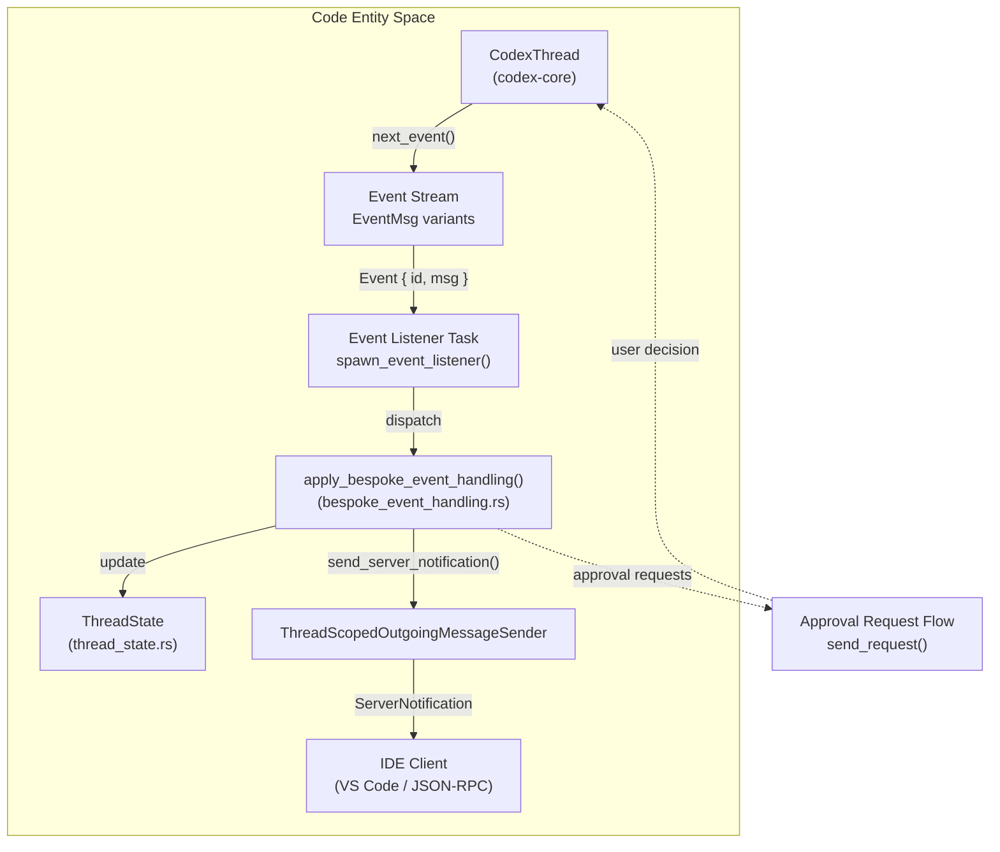
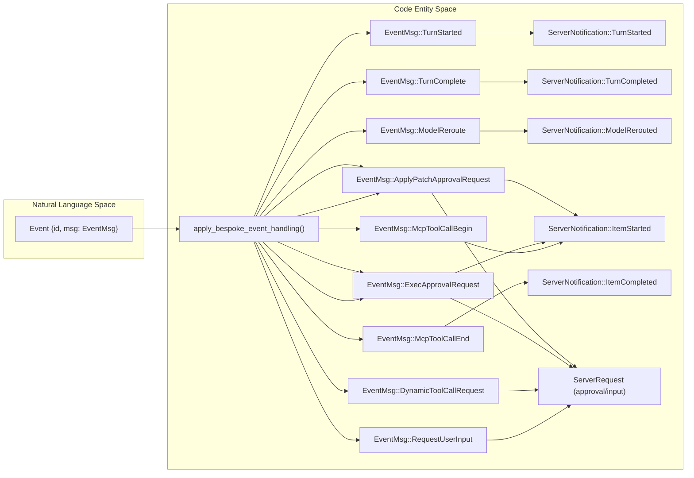
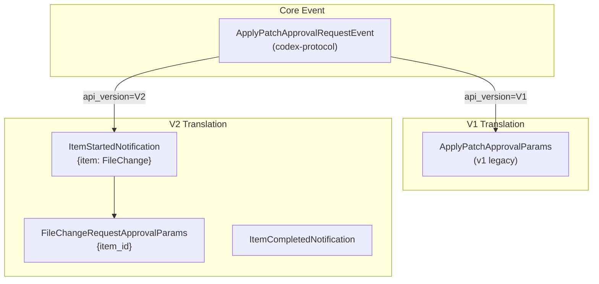
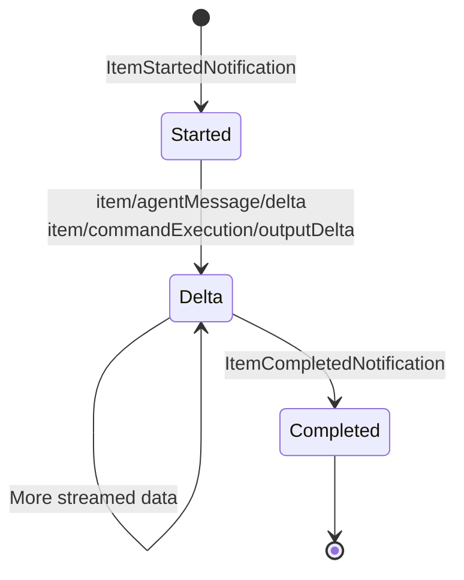
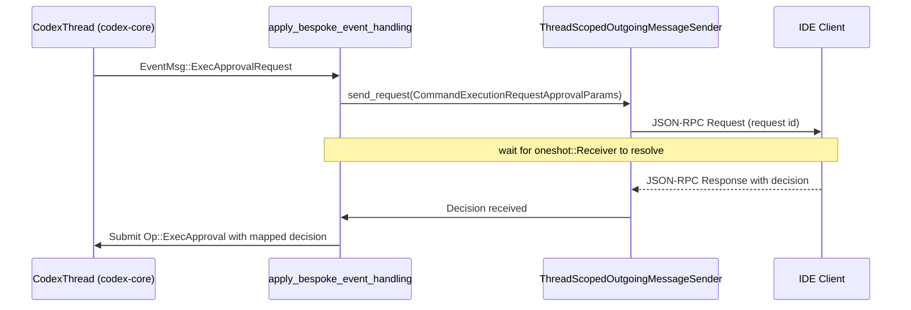
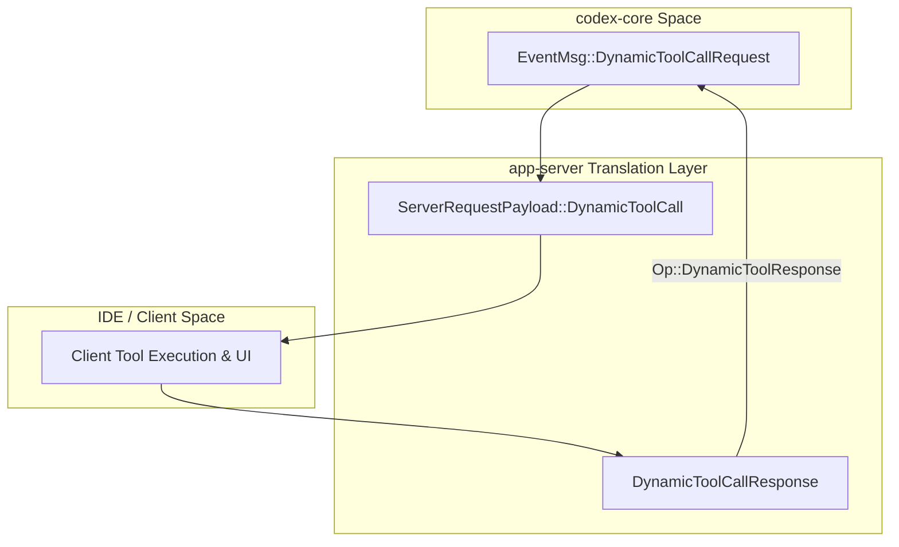
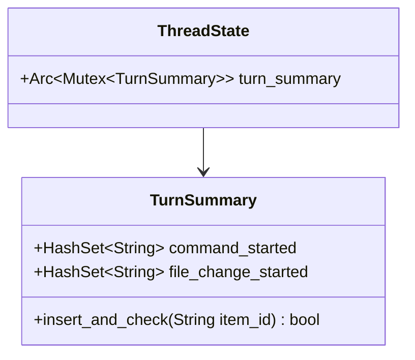
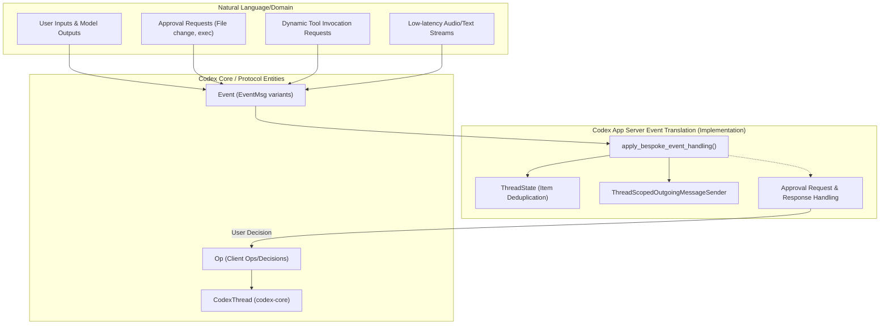

# 이벤트 변환과 스트리밍

관련 소스 파일

다음 파일들은 이 위키 페이지를 생성하기 위한 컨텍스트로 사용되었습니다:

- [codex-rs/app-server-client/Cargo.toml](codex-rs/app-server-client/Cargo.toml)
- [codex-rs/app-server-client/src/lib.rs](codex-rs/app-server-client/src/lib.rs)
- [codex-rs/app-server-client/src/remote.rs](codex-rs/app-server-client/src/remote.rs)
- [codex-rs/app-server-protocol/schema/json/ClientRequest.json](codex-rs/app-server-protocol/schema/json/ClientRequest.json)
- [codex-rs/app-server-protocol/schema/json/ServerNotification.json](codex-rs/app-server-protocol/schema/json/ServerNotification.json)
- [codex-rs/app-server-protocol/schema/json/codex_app_server_protocol.schemas.json](codex-rs/app-server-protocol/schema/json/codex_app_server_protocol.schemas.json)
- [codex-rs/app-server-protocol/schema/json/codex_app_server_protocol.v2.schemas.json](codex-rs/app-server-protocol/schema/json/codex_app_server_protocol.v2.schemas.json)
- [codex-rs/app-server-protocol/schema/typescript/ClientRequest.ts](codex-rs/app-server-protocol/schema/typescript/ClientRequest.ts)
- [codex-rs/app-server-protocol/schema/typescript/ServerNotification.ts](codex-rs/app-server-protocol/schema/typescript/ServerNotification.ts)
- [codex-rs/app-server-protocol/schema/typescript/v2/index.ts](codex-rs/app-server-protocol/schema/typescript/v2/index.ts)
- [codex-rs/app-server-protocol/src/protocol/common.rs](codex-rs/app-server-protocol/src/protocol/common.rs)
- [codex-rs/app-server/Cargo.toml](codex-rs/app-server/Cargo.toml)
- [codex-rs/app-server/README.md](codex-rs/app-server/README.md)
- [codex-rs/app-server/src/bespoke_event_handling.rs](codex-rs/app-server/src/bespoke_event_handling.rs)
- [codex-rs/app-server/src/extensions.rs](codex-rs/app-server/src/extensions.rs)
- [codex-rs/app-server/src/in_process.rs](codex-rs/app-server/src/in_process.rs)
- [codex-rs/app-server/src/lib.rs](codex-rs/app-server/src/lib.rs)
- [codex-rs/app-server/src/main.rs](codex-rs/app-server/src/main.rs)
- [codex-rs/app-server/src/mcp_refresh.rs](codex-rs/app-server/src/mcp_refresh.rs)
- [codex-rs/app-server/src/message_processor.rs](codex-rs/app-server/src/message_processor.rs)
- [codex-rs/app-server/src/outgoing_message.rs](codex-rs/app-server/src/outgoing_message.rs)
- [codex-rs/app-server/src/transport.rs](codex-rs/app-server/src/transport.rs)
- [codex-rs/app-server/tests/suite/v2/connection_handling_websocket.rs](codex-rs/app-server/tests/suite/v2/connection_handling_websocket.rs)

## 목적과 범위

이 페이지는 `codex-app-server` 내부의 이벤트 변환 시스템을 문서화합니다. 이 시스템은 핵심 에이전트의 내부 이벤트 모델(`codex-protocol`)과 클라이언트가 바라보는 JSON-RPC 프로토콜(`codex-app-server-protocol`)을 연결합니다. 모델 호출, 도구 실행, 기타 사이드 이펙트로 구성되는 대화 thread 동안 core는 다양한 이벤트를 내보냅니다. app server는 이러한 core 이벤트를 Codex VS Code 확장 같은 IDE 클라이언트에 적합한 구조화된 알림과 요청으로 변환합니다.

요청 처리와 thread 관리에 대한 보완 문서는 [Thread and Turn Management API (4.5.2)]()를 참조하세요. 메시지 처리의 아키텍처 개요는 [CodexMessageProcessor and Request Handling (4.5.1)]()을 참조하세요.

---

## 이벤트 변환 흐름 개요

이벤트 변환 계층은 핵심 에이전트 thread(`CodexThread`)와 클라이언트로 나가는 메시지 사이의 파이프라인 역할을 합니다. thread가 내보내는 이벤트를 수신하고, bespoke 핸들러로 처리하며, 내부 서버 측 thread 상태를 업데이트하고, JSON-RPC 알림 또는 서버 요청을 내보냅니다.

**설명:**

- `CodexThread` [codex-rs/app-server/src/bespoke_event_handling.rs:87]()는 `Event` 객체의 비동기 스트림을 생성합니다 [codex-rs/app-server/src/bespoke_event_handling.rs:96]().
- 이벤트 listener 태스크는 각 이벤트를 가져와 `apply_bespoke_event_handling`으로 디스패치합니다 [codex-rs/app-server/src/bespoke_event_handling.rs:135-138]().
- 이 함수는 이벤트 메시지(`EventMsg`)를 해석하고, `ThreadState`로 상태 업데이트를 수행하며, `ThreadScopedOutgoingMessageSender`를 통해 대응하는 알림 또는 요청을 보냅니다 [codex-rs/app-server/src/bespoke_event_handling.rs:141-145]().
- 사용자 개입이 필요한 이벤트(예: 명령 승인)의 경우, 시스템은 승인 요청 사이클을 시작합니다 [codex-rs/app-server/src/bespoke_event_handling.rs:390-435]().

**출처:** [codex-rs/app-server/src/bespoke_event_handling.rs:133-145](), [codex-rs/app-server/README.md:79-82]()

---

## 핵심 변환 함수: `apply_bespoke_event_handling`

`bespoke_event_handling.rs`의 `apply_bespoke_event_handling` async 함수는 core 이벤트를 app-server 프로토콜 메시지로 변환하는 중앙 디스패치 지점입니다. `EventMsg` enum에 대해 패턴 매칭을 수행해 구조화된 알림을 생성하고, 필요한 경우 사용자 입력을 기다리는 서버 요청을 발행합니다.

**주요 `EventMsg`에서 서버 메시지로의 매핑:**

| `EventMsg` Variant                | 서버 메시지                         | 프로토콜 버전 | 참고                                                |
|---------------------------------|----------------------------------|------------------|-----------------------------------------------------|
| `TurnStarted`                   | `TurnStartedNotification`         | V2               | turn 시작의 스냅샷을 내보냅니다 [codex-rs/app-server/src/bespoke_event_handling.rs:351-365]() |
| `TurnComplete`                  | `TurnCompletedNotification`       | V1/V2            | turn을 마무리합니다 [codex-rs/app-server/src/bespoke_event_handling.rs:366-382]() |
| `ModelReroute`                  | `ModelReroutedNotification`       | V2               | 모델 전환을 클라이언트에 알립니다 [codex-rs/app-server/src/bespoke_event_handling.rs:307-314]() |
| `ApplyPatchApprovalRequest`     | `ItemStartedNotification` + Server Request | V1/V2            | 파일 변경 승인 UI를 트리거합니다 [codex-rs/app-server/src/bespoke_event_handling.rs:182-205]() |
| `ExecApprovalRequest`           | `ItemStartedNotification` + Server Request | V1/V2            | 명령 실행 승인을 트리거합니다 [codex-rs/app-server/src/bespoke_event_handling.rs:141-181]() |
| `McpToolCallBegin`              | `ItemStartedNotification`         | V2               | MCP 도구 호출의 시작을 나타냅니다 [codex-rs/app-server/src/bespoke_event_handling.rs:271-282]() |
| `McpToolCallEnd`                | `ItemCompletedNotification`       | V2               | MCP 도구 호출 완료를 표시합니다 [codex-rs/app-server/src/bespoke_event_handling.rs:283-293]() |
| `DynamicToolCallRequest`        | Server Request                    | V2               | 클라이언트 도구 실행 협상 [codex-rs/app-server/src/bespoke_event_handling.rs:315-349]() |
| `RequestUserInput`              | Server Request                    | V2               | 대화형 사용자 입력용 [codex-rs/app-server/src/bespoke_event_handling.rs:436-449]() |

**출처:** [codex-rs/app-server/src/bespoke_event_handling.rs:133-450](), [codex-rs/app-server-protocol/src/protocol/common.rs:181-201]()

---

## API 버전 처리와 Item 수명주기 차이

app server는 클라이언트 통신을 위해 두 가지 프로토콜 버전을 지원합니다. 버전 2는 명시적인 Item 수명주기(Started -> Delta* -> Completed)를 도입하여 클라이언트에서 더 세밀한 UI 업데이트를 가능하게 합니다 [codex-rs/app-server/README.md:80-81]().

### 파일 변경에 대한 V1과 V2 변환 예시

V2 API는 item 수명주기 이벤트를 승인과 분리합니다. 승인은 명시적인 item ID와 연결되므로, 더 풍부한 클라이언트 측 스트리밍과 UI affordance가 가능합니다 [codex-rs/app-server/src/bespoke_event_handling.rs:182-205]().

**출처:** [codex-rs/app-server/src/bespoke_event_handling.rs:133-199](), [codex-rs/app-server-protocol/schema/json/codex_app_server_protocol.schemas.json:34-72]()

---

## Item 수명주기 패턴(V2 프로토콜)

V2에서 각 개념적 "Item"(예: 에이전트 메시지, 명령, 파일 변경)은 잘 정의된 수명주기를 따르며, 클라이언트가 진행 상황을 점진적으로 렌더링할 수 있게 합니다.

| Item Type        | Started Event (`item/started`) | Delta Events (streaming intermediate data)         | Completed Event (`item/completed`)   |
|------------------|-------------------------------|----------------------------------------------------|-------------------------------------|
| AgentMessage     | `item/started` [codex-rs/app-server/src/bespoke_event_handling.rs:36]() | `item/agentMessage/delta` [codex-rs/app-server-protocol/schema/json/codex_app_server_protocol.v2.schemas.json:141-162]() | `item/completed` [codex-rs/app-server/src/bespoke_event_handling.rs:35]() |
| CommandExecution | `item/started` [codex-rs/app-server/src/bespoke_event_handling.rs:36]() | `item/commandExecution/outputDelta` [codex-rs/app-server-protocol/schema/typescript/v2/index.ts:66]() | `item/completed` [codex-rs/app-server/src/bespoke_event_handling.rs:35]() |

**출처:** [codex-rs/app-server/src/bespoke_event_handling.rs:35-36](), [codex-rs/app-server-protocol/schema/json/codex_app_server_protocol.v2.schemas.json:141-162]()

---

## 승인 요청과 서버 요청 패턴

특정 이벤트는 진행하기 전에 명시적인 사람의 승인이 필요합니다. 이러한 이벤트는 클라이언트로 전송되는 `ServerRequestPayload` 객체를 생성합니다 [codex-rs/app-server/src/bespoke_event_handling.rs:390-435]().

### 승인 사이클

승인 결정은 `CommandExecutionApprovalDecision` enum [codex-rs/app-server/src/bespoke_event_handling.rs:18]()을 사용하며, 서버는 이를 core `ReviewDecision`으로 매핑합니다 [codex-rs/app-server/src/bespoke_event_handling.rs:410-430]():

| 클라이언트 결정             | Core `ReviewDecision`            |
|----------------------------|---------------------------------|
| `Accept`                   | `Approved` [codex-rs/app-server/src/bespoke_event_handling.rs:101]() |
| `AcceptForSession`          | `ApprovedForSession`            |
| `Decline`                  | `Denied`                       |
| `Cancel`                   | `Abort`                        |

**출처:** [codex-rs/app-server/src/bespoke_event_handling.rs:390-435](), [codex-rs/app-server-protocol/schema/json/codex_app_server_protocol.schemas.json:18-85]()

---

## Dynamic Tool Call 처리

Dynamic tool call은 에이전트가 core 외부, 일반적으로 클라이언트 측에서 호스팅되는 도구 실행을 트리거할 수 있게 합니다. core는 `DynamicToolCallRequest` 이벤트를 내보내고, 서버는 이를 `ServerRequestPayload::DynamicToolCall`로 변환합니다 [codex-rs/app-server/src/bespoke_event_handling.rs:315-349]().

**출처:** [codex-rs/app-server/src/bespoke_event_handling.rs:315-349](), [codex-rs/app-server-protocol/schema/json/codex_app_server_protocol.schemas.json:24-25]()

---

## Thread 상태와 Item 중복 제거

중복 `ItemStartedNotification` 이벤트를 방지하기 위해 app server는 `TurnSummary`를 통해 이미 알림이 공지된 item을 추적하는 thread별 상태를 유지합니다 [codex-rs/app-server/src/bespoke_event_handling.rs:153-159]().

- `TurnSummary` [codex-rs/app-server/src/thread_state.rs:10]()는 이미 "started" 알림을 내보낸 item ID를 추적합니다.
- 중복 제거 로직은 세션 재개 중 이벤트 재생을 처리하는 데 필수적입니다 [codex-rs/app-server/src/bespoke_event_handling.rs:155-160]().

**출처:** [codex-rs/app-server/src/thread_state.rs:9-11](), [codex-rs/app-server/src/bespoke_event_handling.rs:153-159]()

---

## 실시간 대화 스트리밍

app server는 `RealtimeEvent` 타입을 통해 낮은 지연시간의 실시간 대화 스트림을 지원합니다 [codex-rs/app-server/src/bespoke_event_handling.rs:206-261]().

| Core Event Subtype             | 서버 알림                              |
|-------------------------------|---------------------------------------|
| `Started`                     | `ThreadRealtimeStartedNotification` [codex-rs/app-server/src/bespoke_event_handling.rs:60]() |
| `OutputAudioDelta`            | `ThreadRealtimeOutputAudioDeltaNotification` [codex-rs/app-server/src/bespoke_event_handling.rs:58]() |
| `ItemAdded`                   | `ThreadRealtimeItemAddedNotification` [codex-rs/app-server/src/bespoke_event_handling.rs:57]() |
| `Error`                      | `ThreadRealtimeErrorNotification` [codex-rs/app-server/src/bespoke_event_handling.rs:56]() |
| `Closed`                     | `ThreadRealtimeClosedNotification` [codex-rs/app-server/src/bespoke_event_handling.rs:55]() |

**출처:** [codex-rs/app-server/src/bespoke_event_handling.rs:206-261](), [codex-rs/app-server/src/bespoke_event_handling.rs:55-62]()

---

# 요약 다이어그램: 자연어와 코드 엔터티 연결

---

# 주요 구현 아티팩트

| 아티팩트                       | 설명                                                | 위치와 줄                                      |
|--------------------------------|-----------------------------------------------------|----------------------------------------------|
| `apply_bespoke_event_handling` | 이벤트를 알림/요청으로 변환하는 메인 core 이벤트 디스패처 | [codex-rs/app-server/src/bespoke_event_handling.rs:135-450]() |
| `ThreadState`                  | item 중복 제거를 위한 thread별 이벤트 상태 추적 | [codex-rs/app-server/src/thread_state.rs:9-11]() |
| `ThreadScopedOutgoingMessageSender` | 클라이언트에 알림/요청을 보내기 위한 아웃바운드 스트림 | [codex-rs/app-server/src/outgoing_message.rs:108-112]() |
| `EventMsg`                     | 변환 대상 core 이벤트 변형을 정의하는 enum | [codex-rs/app-server/src/bespoke_event_handling.rs:97]() |

**출처:**

- [codex-rs/app-server/src/bespoke_event_handling.rs:1-450]()  
- [codex-rs/app-server/src/thread_state.rs:1-11]()  
- [codex-rs/app-server/src/outgoing_message.rs:108-208]()
- [codex-rs/app-server-protocol/schema/json/codex_app_server_protocol.v2.schemas.json:141-162]()
