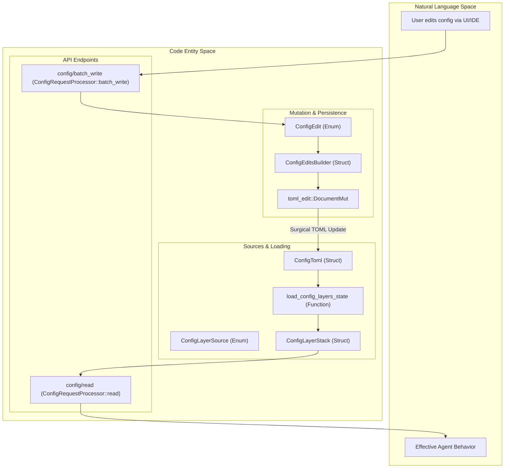
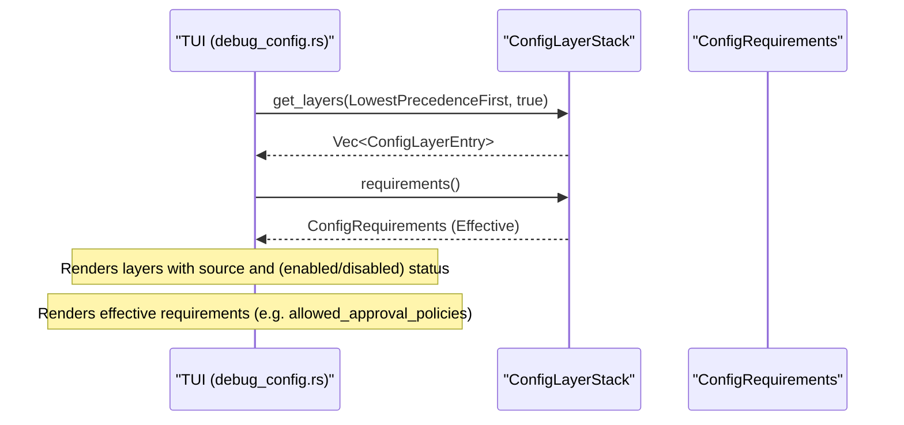

# Config API와 Layer System

관련 소스 파일

다음 파일들은 이 위키 페이지를 생성하기 위한 컨텍스트로 사용되었습니다:

- [codex-rs/app-server-protocol/schema/json/v2/ConfigRequirementsReadResponse.json](codex-rs/app-server-protocol/schema/json/v2/ConfigRequirementsReadResponse.json)
- [codex-rs/app-server-protocol/schema/typescript/v2/ConfigRequirements.ts](codex-rs/app-server-protocol/schema/typescript/v2/ConfigRequirements.ts)
- [codex-rs/app-server-protocol/src/protocol/v2/config.rs](codex-rs/app-server-protocol/src/protocol/v2/config.rs)
- [codex-rs/app-server-protocol/src/protocol/v2/tests.rs](codex-rs/app-server-protocol/src/protocol/v2/tests.rs)
- [codex-rs/app-server/src/request_processors/config_processor.rs](codex-rs/app-server/src/request_processors/config_processor.rs)
- [codex-rs/config/src/config_requirements.rs](codex-rs/config/src/config_requirements.rs)
- [codex-rs/config/src/lib.rs](codex-rs/config/src/lib.rs)
- [codex-rs/config/src/types.rs](codex-rs/config/src/types.rs)
- [codex-rs/config/src/types_tests.rs](codex-rs/config/src/types_tests.rs)
- [codex-rs/core/src/config/config_loader_tests.rs](codex-rs/core/src/config/config_loader_tests.rs)
- [codex-rs/core/src/config/edit.rs](codex-rs/core/src/config/edit.rs)
- [codex-rs/tui/src/debug_config.rs](codex-rs/tui/src/debug_config.rs)

## 목적과 범위

이 페이지는 app-server가 노출하는 설정 API와 Codex의 런타임 동작을 뒷받침하는 계층형 설정 시스템을 문서화합니다. Config API는 설정 값을 읽고 쓰기 위한 JSON-RPC 엔드포인트를 제공하며, layer system은 여러 소스(MDM, 시스템 파일, 사용자 파일, 프로젝트 파일, 세션 플래그)의 설정이 우선순위 규칙에 따라 어떻게 병합되는지 결정합니다.

출처: [codex-rs/app-server-protocol/src/protocol/v2/config.rs:26-82](), [codex-rs/config/src/loader/mod.rs:92-112]()

---

## 시스템 개요

Codex 설정 시스템은 두 개의 구분된 평면에서 동작합니다:

1.  **Layer System(로드 시점)**: 여러 소스의 설정을 병합합니다. 각 소스에는 우선순위 수준이 할당되며, 더 높은 우선순위의 layer가 더 낮은 layer를 override합니다(예: `SessionFlags`는 `User` config를 override) [codex-rs/app-server-protocol/src/protocol/v2/config.rs:103-120](). 핵심 로직은 `ConfigLayerStack`과 `ConfigLayerSource`가 관리합니다 [codex-rs/config/src/lib.rs:139-141]().
2.  **Config API(런타임)**: 유효 설정을 검사하고 `ConfigEditsBuilder` 엔진을 통해 사용자의 `config.toml`에 변경 사항을 영속화하기 위한 JSON-RPC 엔드포인트(`config/read`, `config/write`)를 제공합니다 [codex-rs/app-server/src/request_processors/config_processor.rs:80-138]().

### 설정 데이터 흐름

다음 다이어그램은 자연어 공간(User Config)을 코드 엔터티 공간(struct와 enum)과 연결합니다.

출처: [codex-rs/config/src/lib.rs:109-141](), [codex-rs/app-server/src/request_processors/config_processor.rs:80-138](), [codex-rs/app-server-protocol/src/protocol/v2/config.rs:26-104](), [codex-rs/core/src/config/edit.rs:31-77]()

---

## 설정 Layer System

### Layer 소스와 우선순위

`ConfigLayerSource` enum은 설정 데이터의 출처를 정의합니다. 동일한 키가 여러 layer에 존재할 때 충돌을 해결하려면 우선순위가 중요합니다 [codex-rs/app-server-protocol/src/protocol/v2/config.rs:28-97]().

| 소스 유형 | 우선순위 | 설명 |
| :--- | :--- | :--- |
| `Mdm` | 0 | MDM으로 전달되는 관리형 환경설정(macOS 전용) [codex-rs/app-server-protocol/src/protocol/v2/config.rs:104](). |
| `System` | 10 | 관리형 config 파일(예: `managed_config.toml`) [codex-rs/app-server-protocol/src/protocol/v2/config.rs:105](). |
| `EnterpriseManaged` | 15 | 클라우드로 전달되는 enterprise configuration bundle [codex-rs/app-server-protocol/src/protocol/v2/config.rs:106](). |
| `User` | 20 | `$CODEX_HOME/config.toml`에 있는 사용자의 기본 config [codex-rs/app-server-protocol/src/protocol/v2/config.rs:111](). |
| `User (Profile)` | 21 | 기본 사용자 config 위에 쌓이는 특정 profile-v2 [codex-rs/app-server-protocol/src/protocol/v2/config.rs:108-109](). |
| `Project` | 25 | 워크스페이스 트리 내 `.codex/` 폴더에서 발견된 config [codex-rs/app-server-protocol/src/protocol/v2/config.rs:114](). |
| `SessionFlags` | 30 | CLI 인자(`-c`)를 통해 제공되는 런타임 override [codex-rs/app-server-protocol/src/protocol/v2/config.rs:115](). |
| `LegacyManaged...` | 40-50 | 레거시 호환성 layer [codex-rs/app-server-protocol/src/protocol/v2/config.rs:116-117](). |

출처: [codex-rs/app-server-protocol/src/protocol/v2/config.rs:99-120]()

### Requirements 시스템
Codex는 사용자 또는 프로젝트 config로 override할 수 없는 필수 정책인 **Requirements**(예: `ConfigRequirements`)를 강제합니다 [codex-rs/config/src/config_requirements.rs:144-165](). 여기에는 허용되는 sandbox 모드, 승인 정책, 네트워크 제약이 포함됩니다 [codex-rs/config/src/config_requirements.rs:145-165]().

Requirements는 `RequirementSource::MdmManagedPreferences`, `RequirementSource::SystemRequirementsToml`, `RequirementSource::EnterpriseManaged` 같은 소스에서 조합됩니다 [codex-rs/config/src/config_requirements.rs:26-50]().

출처: [codex-rs/config/src/config_requirements.rs:26-165](), [codex-rs/config/src/lib.rs:57-79]()

---

## Config API 엔드포인트

### config/read 구현

`ConfigRequestProcessor::read`가 처리하는 `config/read` 엔드포인트는 출처와 layer에 대한 메타데이터와 함께 병합된 유효 설정을 반환합니다 [codex-rs/app-server/src/request_processors/config_processor.rs:80-107]().

*   **실험적 기능**: 프로세서는 현재 config에 대해 `codex_features` registry를 확인하여 `memories`, `tool_suggest`, `remote_control` 같은 기능의 활성화 상태를 주입합니다 [codex-rs/app-server/src/request_processors/config_processor.rs:87-106]().
*   **Requirements**: `config_requirements_read` 엔드포인트는 현재 적용 중인 필수 `ConfigRequirements`를 반환합니다 [codex-rs/app-server/src/request_processors/config_processor.rs:109-120]().

출처: [codex-rs/app-server/src/request_processors/config_processor.rs:80-120](), [codex-rs/app-server/src/request_processors/config_processor.rs:48-55]()

### config/write와 ConfigEditsBuilder

설정 영속화는 `ConfigEditsBuilder`와 `ConfigEdit` enum이 관리합니다. 이러한 mutation은 사용자 formatting을 보존하기 위해 TOML 문서에 정밀하게 적용됩니다 [codex-rs/config/src/lib.rs:109](), [codex-rs/core/src/config/edit.rs:29-31]().

**일반적인 Mutation(`ConfigEdit` variants):**
*   **`SetModel`**: 모델 선택과 reasoning effort를 업데이트합니다 [codex-rs/core/src/config/edit.rs:33-36]().
*   **`ReplaceMcpServers`**: 전체 `[mcp_servers]` 테이블을 교체합니다 [codex-rs/core/src/config/edit.rs:59-60]().
*   **`SetPath` / `ClearPath`**: `[tui].theme` 같은 키를 위한 범용 dotted-path mutation입니다 [codex-rs/core/src/config/edit.rs:71-77]().
*   **`SetProjectTrustLevel`**: 특정 프로젝트 경로의 trust level을 설정합니다 [codex-rs/core/src/config/edit.rs:67-69]().

출처: [codex-rs/core/src/config/edit.rs:31-77](), [codex-rs/app-server/src/request_processors/config_processor.rs:122-138]()

---

## 디버깅과 TUI 통합

TUI는 현재 설정 stack과 활성 requirements를 시각화하기 위한 `/debug-config` 명령을 제공합니다.

출처: [codex-rs/tui/src/debug_config.rs:83-116](), [codex-rs/tui/src/debug_config.rs:120-160]()

---

## 주요 구조체

| 구조체 | 역할 |
| :--- | :--- |
| `ConfigLayerStack` | 설정 layer의 순서 있는 목록과 해당 requirements를 관리합니다 [codex-rs/config/src/state.rs:140-141](). |
| `ConfigRequirements` | requirements layer에서 파생된 정규화된 필수 정책(sandbox, network, feature requirements)입니다 [codex-rs/config/src/config_requirements.rs:144-165](). |
| `ConfigLayerSource` | 설정 layer의 출처와 우선순위를 식별합니다 [codex-rs/app-server-protocol/src/protocol/v2/config.rs:28-97](). |
| `ConfigEdit` | 영속화 엔진이 지원하는 개별 mutation입니다(예: `SetModel`, `SetPath`) [codex-rs/core/src/config/edit.rs:31-77](). |
| `ConstrainedWithSource<T>` | 값을 필수 제약 상태 및 이를 강제한 `RequirementSource`와 함께 감쌉니다 [codex-rs/config/src/config_requirements.rs:116-119](). |

출처: [codex-rs/config/src/config_requirements.rs:116-165](), [codex-rs/app-server-protocol/src/protocol/v2/config.rs:28-97](), [codex-rs/config/src/lib.rs:109-141](), [codex-rs/core/src/config/edit.rs:31-77]()
