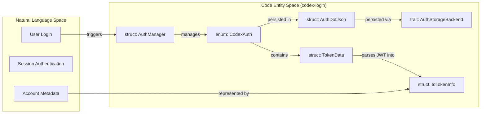
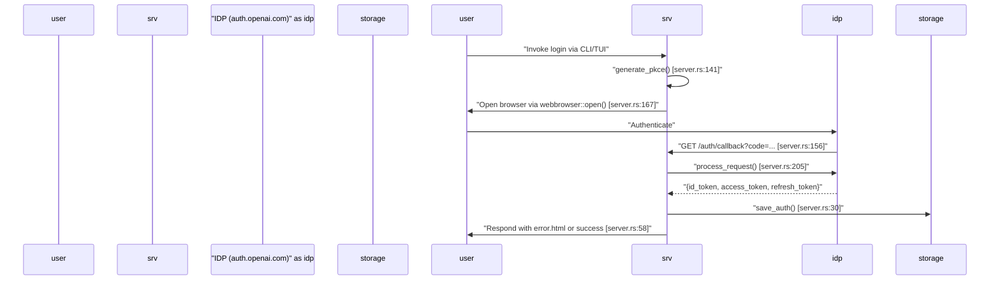
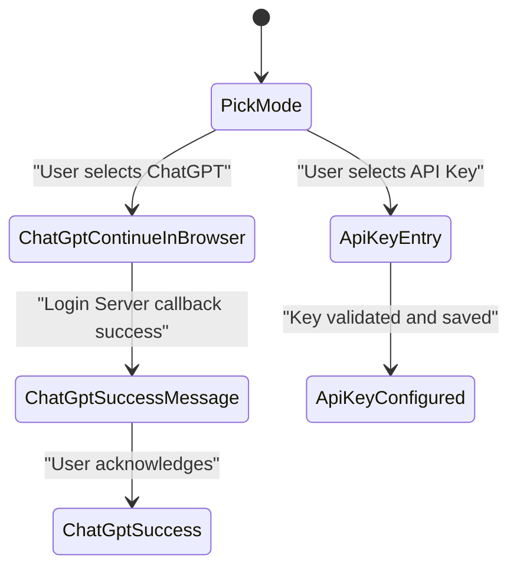

# 인증 모드와 계정 관리

관련 소스 파일

다음 파일들은 이 위키 페이지를 생성하기 위한 컨텍스트로 사용되었습니다:

- [codex-rs/agent-identity/Cargo.toml](codex-rs/agent-identity/Cargo.toml)
- [codex-rs/agent-identity/src/lib.rs](codex-rs/agent-identity/src/lib.rs)
- [codex-rs/app-server-protocol/schema/json/v2/GetAccountTokenUsageResponse.json](codex-rs/app-server-protocol/schema/json/v2/GetAccountTokenUsageResponse.json)
- [codex-rs/app-server-protocol/schema/typescript/v2/AccountTokenUsageDailyBucket.ts](codex-rs/app-server-protocol/schema/typescript/v2/AccountTokenUsageDailyBucket.ts)
- [codex-rs/app-server-protocol/schema/typescript/v2/AccountTokenUsageSummary.ts](codex-rs/app-server-protocol/schema/typescript/v2/AccountTokenUsageSummary.ts)
- [codex-rs/app-server-protocol/schema/typescript/v2/GetAccountTokenUsageResponse.ts](codex-rs/app-server-protocol/schema/typescript/v2/GetAccountTokenUsageResponse.ts)
- [codex-rs/app-server-protocol/src/protocol/v2/account.rs](codex-rs/app-server-protocol/src/protocol/v2/account.rs)
- [codex-rs/app-server/tests/common/auth_fixtures.rs](codex-rs/app-server/tests/common/auth_fixtures.rs)
- [codex-rs/app-server/tests/suite/v2/rate_limits.rs](codex-rs/app-server/tests/suite/v2/rate_limits.rs)
- [codex-rs/backend-client/src/client.rs](codex-rs/backend-client/src/client.rs)
- [codex-rs/backend-client/src/lib.rs](codex-rs/backend-client/src/lib.rs)
- [codex-rs/backend-client/src/types.rs](codex-rs/backend-client/src/types.rs)
- [codex-rs/cli/src/login.rs](codex-rs/cli/src/login.rs)
- [codex-rs/cli/tests/login.rs](codex-rs/cli/tests/login.rs)
- [codex-rs/login/BUILD.bazel](codex-rs/login/BUILD.bazel)
- [codex-rs/login/Cargo.toml](codex-rs/login/Cargo.toml)
- [codex-rs/login/src/assets/error.html](codex-rs/login/src/assets/error.html)
- [codex-rs/login/src/auth/agent_identity.rs](codex-rs/login/src/auth/agent_identity.rs)
- [codex-rs/login/src/auth/auth_tests.rs](codex-rs/login/src/auth/auth_tests.rs)
- [codex-rs/login/src/auth/manager.rs](codex-rs/login/src/auth/manager.rs)
- [codex-rs/login/src/auth/mod.rs](codex-rs/login/src/auth/mod.rs)
- [codex-rs/login/src/auth/revoke.rs](codex-rs/login/src/auth/revoke.rs)
- [codex-rs/login/src/auth/storage.rs](codex-rs/login/src/auth/storage.rs)
- [codex-rs/login/src/auth/storage_tests.rs](codex-rs/login/src/auth/storage_tests.rs)
- [codex-rs/login/src/lib.rs](codex-rs/login/src/lib.rs)
- [codex-rs/login/src/server.rs](codex-rs/login/src/server.rs)
- [codex-rs/login/tests/suite/auth_refresh.rs](codex-rs/login/tests/suite/auth_refresh.rs)
- [codex-rs/login/tests/suite/login_server_e2e.rs](codex-rs/login/tests/suite/login_server_e2e.rs)
- [codex-rs/login/tests/suite/logout.rs](codex-rs/login/tests/suite/logout.rs)
- [codex-rs/login/tests/suite/mod.rs](codex-rs/login/tests/suite/mod.rs)
- [codex-rs/model-provider/src/auth.rs](codex-rs/model-provider/src/auth.rs)
- [codex-rs/models-manager/src/manager.rs](codex-rs/models-manager/src/manager.rs)
- [codex-rs/models-manager/src/manager_tests.rs](codex-rs/models-manager/src/manager_tests.rs)
- [codex-rs/tui/src/config_update.rs](codex-rs/tui/src/config_update.rs)
- [codex-rs/tui/src/local_chatgpt_auth.rs](codex-rs/tui/src/local_chatgpt_auth.rs)
- [codex-rs/tui/src/onboarding/auth.rs](codex-rs/tui/src/onboarding/auth.rs)
- [codex-rs/tui/src/onboarding/mod.rs](codex-rs/tui/src/onboarding/mod.rs)
- [codex-rs/tui/src/onboarding/onboarding_screen.rs](codex-rs/tui/src/onboarding/onboarding_screen.rs)
- [codex-rs/tui/src/onboarding/trust_directory.rs](codex-rs/tui/src/onboarding/trust_directory.rs)
- [codex-rs/tui/src/onboarding/welcome.rs](codex-rs/tui/src/onboarding/welcome.rs)

이 페이지는 Codex가 사용자를 인증하고, 자격 증명을 저장하며, 토큰을 갱신하고, 런타임에 로그인 상태를 관리하는 방식을 문서화합니다. `codex-login`의 `CodexAuth` 및 `AuthManager` 타입, OAuth/PKCE 브라우저 로그인 서버, device-code flow, API key 인증, 그리고 최초 사용자의 로그인을 안내하는 TUI onboarding 화면을 다룹니다.

---

## 인증 모드

Codex는 app-server 프로토콜의 `AuthMode` enum으로 표현되는 여러 인증 모드를 지원합니다:

[codex-rs/login/src/server.rs:39-39]()

| `AuthMode` variant | 설명 |
|---|---|
| `ApiKey` | 원시 OpenAI API key가 사용됩니다. 사용량은 일반적으로 토큰 단위로 과금됩니다. |
| `Chatgpt` | ChatGPT 계정에서 얻은 OAuth access token이 사용됩니다. rate limit과 과금은 사용자의 ChatGPT 플랜을 따릅니다. |
| `AgentIdentity` | 자동화 또는 enterprise 환경을 위한 machine-to-machine identity를 사용합니다. |
| `PersonalAccessToken` | 인증에 장기 personal access token을 사용합니다. |
| `BedrockApiKey` | 모델 접근에 AWS Bedrock API key를 사용합니다. |

`CodexAuth` enum(`codex-login`에 정의됨)은 이러한 모드의 구체적인 인증 payload를 보관합니다:

[codex-rs/login/src/auth/manager.rs:55-62]()

| `CodexAuth` variant | 설명 |
|---|---|
| `ApiKey(ApiKeyAuth)` | 원시 API key 문자열을 보관합니다. |
| `Chatgpt(ChatgptAuth)` | OAuth token과 상태 저장 persistence를 위한 storage backend 참조를 보관합니다. |
| `ChatgptAuthTokens` | 직접적인 storage 참조 없이 ChatGPT flow의 token 상태를 특별히 보관합니다. |
| `AgentIdentity(AgentIdentityAuth)` | Agent Identity flow의 자격 증명을 보관합니다. |
| `PersonalAccessToken(...)` | Personal Access Token을 보관합니다. |
| `BedrockApiKey(...)` | Bedrock 전용 API 자격 증명을 보관합니다. |

**Auth Mode와 Entity 매핑**

다음 다이어그램은 "Login"이라는 자연어 개념을 `codex-login` 크레이트의 특정 코드 엔터티와 연결합니다.

출처: [codex-rs/login/src/auth/manager.rs:55-62](), [codex-rs/login/src/auth/manager.rs:31-33](), [codex-rs/login/src/token_data.rs:11-25]()

---

## Token Storage: `AuthDotJson`과 `TokenData`

자격 증명은 `AuthDotJson` 구조체로 직렬화되어 영속화됩니다. 기본 위치는 일반적으로 `codex_home` 디렉터리 내부의 `auth.json`입니다.

### `TokenData` 구조
`TokenData` 구조체는 JWT에서 파싱된 flat info를 처리합니다:
[codex-rs/login/src/token_data.rs:11-25]()

| 필드 | 타입 | 목적 |
|---|---|---|
| `id_token` | `IdTokenInfo` | 파싱된 claim 하위 집합(email, plan type, user ID)입니다. |
| `access_token` | `String` | API 요청에 사용되는 활성 JWT입니다. |
| `refresh_token` | `String` | 만료 시 새 access token을 얻는 데 사용되는 token입니다. |
| `account_id` | `Option<String>` | ChatGPT organization/workspace 식별자입니다. |

### `AuthCredentialsStoreMode`
이러한 자격 증명의 persistence 전략을 제어합니다:
[codex-rs/login/src/lib.rs:10-10]()

| 모드 | 동작 |
|---|---|
| `File` | `FileAuthStorage`를 통해 디스크의 `auth.json`을 읽고 씁니다. [codex-rs/login/src/auth/auth_tests.rs:82-88]() |
| `Ephemeral` | 자격 증명을 프로세스 메모리에만 저장합니다. |
| `Keyring` | `codex-keyring-store`를 통해 플랫폼별 보안 저장소를 사용합니다. [codex-rs/login/Cargo.toml:18-18]() |

출처: [codex-rs/login/src/token_data.rs:11-25](), [codex-rs/login/src/auth/manager.rs:35-37](), [codex-rs/login/src/auth/auth_tests.rs:82-88]()

---

## ChatGPT 브라우저 로그인 Flow(PKCE)

브라우저 기반 ChatGPT 로그인은 `codex-rs/login/src/server.rs`에 있습니다. 이는 CLI(`codex login`)와 TUI onboarding 화면에서 모두 사용됩니다.

**시퀀스: 브라우저 로그인 구현**

주요 구현 세부사항:
- **Port**: 기본값은 `1455`입니다 [codex-rs/login/src/server.rs:55-55]().
- **PKCE**: `generate_pkce()`를 사용해 code challenge와 verifier를 생성합니다 [codex-rs/login/src/server.rs:141-141]().
- **Server**: `tiny_http::Server`를 사용해 로컬 callback을 수신합니다 [codex-rs/login/src/server.rs:48-48]().
- **Shutdown**: 루프 종료를 알리기 위해 `ShutdownHandle`이 제공됩니다 [codex-rs/login/src/server.rs:128-137]().

출처: [codex-rs/login/src/server.rs:1-206]()

---

## Device Code 로그인

헤드리스 또는 원격 환경을 위해 Codex는 OAuth device code flow를 지원합니다.

### Flow 단계:
1. **코드 요청**: `request_device_code()`가 issuer에 연락해 `user_code`와 `verification_url`을 얻습니다 [codex-rs/login/src/lib.rs:13-13]().
2. **사용자 상호작용**: 사용자에게 URL과 코드가 표시됩니다. TUI는 이를 `ContinueWithDeviceCodeState`에 표시합니다 [codex-rs/tui/src/onboarding/auth.rs:128-133]().
3. **완료**: `complete_device_code_login()`이 결과 authorization code를 token으로 교환하고 이를 영속화합니다 [codex-rs/login/src/lib.rs:12-12]().

출처: [codex-rs/login/src/lib.rs:11-14](), [codex-rs/tui/src/onboarding/auth.rs:128-172]()

---

## TUI Onboarding 화면

`OnboardingScreen`은 인증과 디렉터리 trust를 포함한 초기 설정을 사용자에게 안내합니다.

[codex-rs/tui/src/onboarding/onboarding_screen.rs:77-82]()

### `AuthModeWidget` 상태 머신
`AuthModeWidget`은 `SignInState` enum을 사용해 대화형 로그인 UI를 관리합니다:
[codex-rs/tui/src/onboarding/auth.rs:77-86]()

### Keyboard 처리
- **탐색**: `MOVE_UP`/`MOVE_DOWN`으로 옵션 사이를 이동합니다 [codex-rs/tui/src/onboarding/auth.rs:180-187]().
- **선택**: `CONFIRM`으로 강조 표시된 모드를 확정합니다 [codex-rs/tui/src/onboarding/auth.rs:200-212]().
- **직접 입력**: 인증 모드를 빠르게 선택하기 위한 `SELECT_FIRST`, `SELECT_SECOND`, `SELECT_THIRD` 키 [codex-rs/tui/src/onboarding/auth.rs:188-199]().

### 디렉터리 Trust
진행하기 전에 사용자는 현재 작업 디렉터리를 trust할지 결정해야 합니다. 디렉터리를 trust하면 Codex가 프로젝트 로컬 config, hook, 실행 정책을 로드할 수 있습니다.
[codex-rs/tui/src/onboarding/trust_directory.rs:69-79]()

출처: [codex-rs/tui/src/onboarding/auth.rs:77-212](), [codex-rs/tui/src/onboarding/onboarding_screen.rs:55-59](), [codex-rs/tui/src/onboarding/trust_directory.rs:165-179]()

---

## CLI 진입점

`codex-cli`는 계정 관리를 위한 직접 명령을 제공합니다:

| 명령 | 함수 | 설명 |
|---|---|---|
| `codex login` | `run_login_with_chatgpt()` | 로컬 브라우저 서버 flow를 시작합니다 [codex-rs/cli/src/login.rs:134-162](). |
| `codex login --device-auth` | `run_device_code_login()` | 헤드리스 device code flow를 시작합니다 [codex-rs/cli/src/login.rs:19-19](). |
| `codex login --with-api-key` | `run_login_with_api_key()` | stdin에서 API key를 읽고 저장합니다 [codex-rs/cli/src/login.rs:164-191](). |
| `codex logout` | `logout()` | 저장된 자격 증명을 `auth.json`에서 제거합니다 [codex-rs/login/src/lib.rs:43-43](). |

### 로깅과 관측 가능성
직접 CLI 로그인 flow는 `init_login_file_logging()`을 사용해 `codex-login.log` 아티팩트를 생성합니다. 이는 TUI 로깅과 별개이며, 일회성 명령을 가볍게 유지하면서도 진단 가능하게 하기 위함입니다.
[codex-rs/cli/src/login.rs:49-108]()

출처: [codex-rs/cli/src/login.rs:1-191](), [codex-rs/login/src/lib.rs:41-47]()
