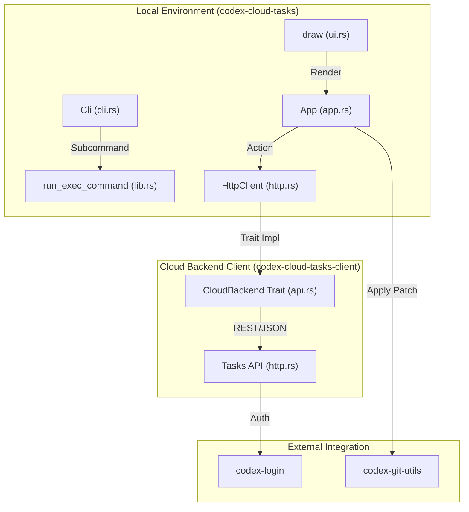
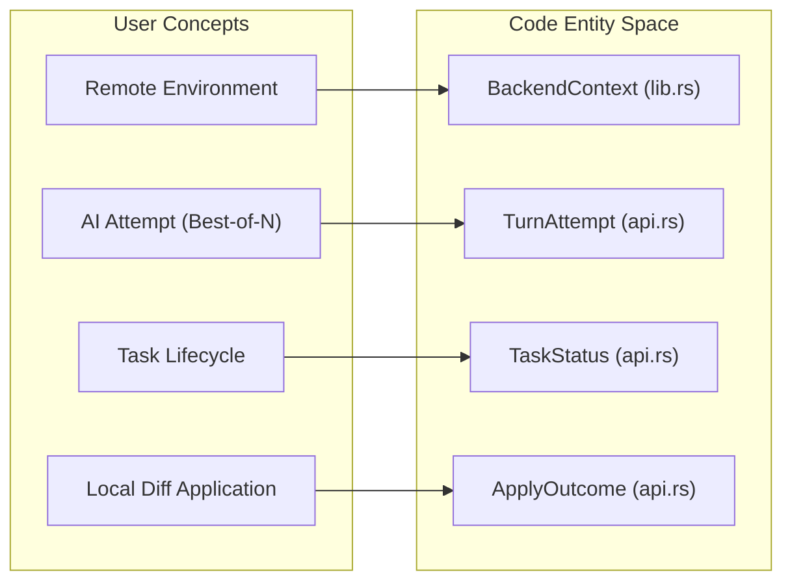

# Cloud Tasks(codex cloud)

관련 소스 파일

다음 파일들은 이 위키 페이지를 생성하기 위한 컨텍스트로 사용되었습니다:

- [codex-rs/cloud-tasks-client/BUILD.bazel](codex-rs/cloud-tasks-client/BUILD.bazel)
- [codex-rs/cloud-tasks-client/Cargo.toml](codex-rs/cloud-tasks-client/Cargo.toml)
- [codex-rs/cloud-tasks-client/src/api.rs](codex-rs/cloud-tasks-client/src/api.rs)
- [codex-rs/cloud-tasks-client/src/http.rs](codex-rs/cloud-tasks-client/src/http.rs)
- [codex-rs/cloud-tasks-client/src/lib.rs](codex-rs/cloud-tasks-client/src/lib.rs)
- [codex-rs/cloud-tasks-mock-client/BUILD.bazel](codex-rs/cloud-tasks-mock-client/BUILD.bazel)
- [codex-rs/cloud-tasks-mock-client/Cargo.toml](codex-rs/cloud-tasks-mock-client/Cargo.toml)
- [codex-rs/cloud-tasks-mock-client/src/lib.rs](codex-rs/cloud-tasks-mock-client/src/lib.rs)
- [codex-rs/cloud-tasks-mock-client/src/mock.rs](codex-rs/cloud-tasks-mock-client/src/mock.rs)
- [codex-rs/cloud-tasks/Cargo.toml](codex-rs/cloud-tasks/Cargo.toml)
- [codex-rs/cloud-tasks/src/app.rs](codex-rs/cloud-tasks/src/app.rs)
- [codex-rs/cloud-tasks/src/cli.rs](codex-rs/cloud-tasks/src/cli.rs)
- [codex-rs/cloud-tasks/src/lib.rs](codex-rs/cloud-tasks/src/lib.rs)
- [codex-rs/cloud-tasks/src/ui.rs](codex-rs/cloud-tasks/src/ui.rs)
- [codex-rs/cloud-tasks/src/util.rs](codex-rs/cloud-tasks/src/util.rs)
- [codex-rs/cloud-tasks/tests/env_filter.rs](codex-rs/cloud-tasks/tests/env_filter.rs)
- [codex-rs/tui/src/chatwidget/snapshots/codex_tui__chatwidget__tests__exploring_step1_start_ls.snap](codex-rs/tui/src/chatwidget/snapshots/codex_tui__chatwidget__tests__exploring_step1_start_ls.snap)
- [codex-rs/tui/src/chatwidget/snapshots/codex_tui__chatwidget__tests__exploring_step3_start_cat_foo.snap](codex-rs/tui/src/chatwidget/snapshots/codex_tui__chatwidget__tests__exploring_step3_start_cat_foo.snap)

`codex-cloud-tasks` 크레이트는 `codex cloud` 하위 명령의 구현을 제공하며, Codex Cloud와 상호작용하기 위한 Terminal User Interface(TUI)와 Command Line Interface(CLI)를 제공합니다. 사용자는 이를 통해 원격 환경에 태스크를 제출하고, 태스크 이력을 탐색하며, 실행 상태를 모니터링하고, 생성된 diff를 로컬 워크스페이스에 적용할 수 있습니다 [codex-rs/cloud-tasks/src/lib.rs:1-8]().

## 아키텍처와 데이터 흐름

이 시스템은 `CloudBackend` 추상화를 중심으로 구성되어 있어, 애플리케이션이 실제 `HttpClient`와 테스트용 `MockClient` 사이를 전환할 수 있습니다 [codex-rs/cloud-tasks/src/lib.rs:38-60]().

### Cloud Task 상호작용 다이어그램
이 다이어그램은 사용자 명령에서 백엔드 클라이언트를 거쳐 Codex Cloud API로 이어지는 흐름을 보여줍니다.

출처: [codex-rs/cloud-tasks/src/lib.rs:157-180](), [codex-rs/cloud-tasks-client/src/http.rs:64-127](), [codex-rs/cloud-tasks/src/cli.rs:15-27](), [codex-rs/cloud-tasks-client/src/api.rs:133-170]()

### 컴포넌트 매핑: 자연어에서 코드 엔터티로
이 다이어그램은 사용자에게 보이는 개념을 cloud task 관리에 사용되는 내부 Rust struct와 trait에 매핑합니다.

출처: [codex-rs/cloud-tasks/src/lib.rs:38-41](), [codex-rs/cloud-tasks-client/src/api.rs:64-71](), [codex-rs/cloud-tasks-client/src/api.rs:26-31](), [codex-rs/cloud-tasks-client/src/api.rs:82-90]()

## 백엔드 추상화(CloudBackend)

`CloudBackend` trait(`codex-cloud-tasks-client`에 정의됨)는 UI와 CLI를 네트워크 구현에서 분리합니다 [codex-rs/cloud-tasks-client/src/api.rs:133-170]().

### HttpClient 구현
`HttpClient`는 ChatGPT 백엔드로의 인증과 요청 라우팅을 처리합니다 [codex-rs/cloud-tasks-client/src/http.rs:24-27]().
*   **인증**: `codex-login`을 사용해 자격 증명을 로드합니다 [codex-rs/cloud-tasks/src/lib.rs:71-75](). ChatGPT 계정 ID를 추출하여 `with_chatgpt_account_id`를 통해 헤더에 주입합니다 [codex-rs/cloud-tasks-client/src/http.rs:46-49]().
*   **경로 정규화**: `normalize_base_url` 유틸리티는 ChatGPT 호스트 이름이 내부 "WHAM" 경로로 라우팅되도록 `/backend-api` 접미사를 포함하게 보장합니다 [codex-rs/cloud-tasks/src/util.rs:30-42]().
*   **API 구성**: 내부적으로 `Tasks`, `Attempts`, `Apply` 로직을 위한 특화된 하위 클라이언트로 구성됩니다 [codex-rs/cloud-tasks-client/src/http.rs:51-61]().

### Mock 백엔드
개발과 테스트를 위해 `CODEX_CLOUD_TASKS_MODE=mock`을 설정하면 구현이 `MockClient`로 교체됩니다 [codex-rs/cloud-tasks/src/lib.rs:44-60](). 이를 통해 활성 네트워크 자격 증명이나 cloud environment 가용성 없이 TUI를 테스트할 수 있습니다. mock 백엔드는 environment filter에 따라 다른 task list를 시뮬레이션할 수 있습니다 [codex-rs/cloud-tasks/tests/env_filter.rs:5-39]().

출처: [codex-rs/cloud-tasks/src/lib.rs:43-107](), [codex-rs/cloud-tasks-client/src/http.rs:24-62](), [codex-rs/cloud-tasks/src/util.rs:30-42](), [codex-rs/cloud-tasks/tests/env_filter.rs:5-39]()

## CLI 명령

`codex cloud` 명령은 `Cli` struct를 통해 여러 비대화형 하위 명령을 지원합니다 [codex-rs/cloud-tasks/src/cli.rs:5-13]().

| 명령 | Struct | 설명 |
| :--- | :--- | :--- |
| `exec` | `ExecCommand` | 새 태스크를 cloud에 제출하고 브라우저 친화적인 태스크 URL을 반환합니다 [codex-rs/cloud-tasks/src/cli.rs:30-50](). |
| `list` | `ListCommand` | 선택적 environment filtering, pagination 지원, JSON 출력을 포함해 태스크를 나열합니다 [codex-rs/cloud-tasks/src/cli.rs:82-98](). |
| `status`| `StatusCommand` | 태스크의 현재 실행 상태(예: Pending, Ready, Applied)를 확인합니다 [codex-rs/cloud-tasks/src/cli.rs:75-79](). |
| `apply` | `ApplyCommand` | 태스크의 diff를 가져와 현재 워크스페이스에 로컬로 적용합니다 [codex-rs/cloud-tasks/src/cli.rs:101-109](). |
| `diff`  | `DiffCommand`  | cloud task의 unified diff를 터미널에 직접 표시합니다 [codex-rs/cloud-tasks/src/cli.rs:112-120](). |

### 실행 로직
`run_exec_command` 함수는 제출 흐름을 조율합니다:
1.  **백엔드 초기화**: user-agent suffix와 함께 `BackendContext`를 초기화합니다 [codex-rs/cloud-tasks/src/lib.rs:164]().
2.  **Environment 해석**: `resolve_environment_id`를 사용해 대상 environment ID를 해석하며, 이는 워크스페이스에 사용 가능한 environment를 나열합니다 [codex-rs/cloud-tasks/src/lib.rs:182-225]().
3.  **Git Ref 해석**: cloud에서 사용할 branch를 결정합니다. Git 정보를 사용할 수 없으면 현재 로컬 branch 또는 "main"을 기본값으로 사용합니다 [codex-rs/cloud-tasks/src/lib.rs:129-155]().
4.  **태스크 생성**: `CloudBackend::create_task`를 호출하고 `util::task_url`이 생성한 태스크 URL을 출력합니다 [codex-rs/cloud-tasks/src/lib.rs:168-178]().

출처: [codex-rs/cloud-tasks/src/cli.rs:15-27](), [codex-rs/cloud-tasks/src/lib.rs:157-180](), [codex-rs/cloud-tasks/src/util.rs:81-93]()

## Terminal User Interface(TUI)

TUI는 태스크 탐색, diff 보기, 새 요청 제출을 위한 풍부한 인터페이스를 제공합니다. 이는 `App` struct가 관리합니다 [codex-rs/cloud-tasks/src/app.rs:47-75]().

### UI 컴포넌트와 렌더링
`ui.rs`의 `draw` 함수는 메인 레이아웃과 modal overlay를 관리합니다 [codex-rs/cloud-tasks/src/ui.rs:28-57]().
*   **Task List**: 상태 표시기와 상대 timestamp가 있는 `TaskSummary` item 목록을 렌더링합니다 [codex-rs/cloud-tasks/src/ui.rs:176-214]().
*   **New Task Page**: prompt 작성, environment 선택, "Best-of-N" attempt 구성을 위한 특화된 view입니다 [codex-rs/cloud-tasks/src/ui.rs:104-174]().
*   **Diff Overlay**: task diff와 assistant message를 검사하기 위한 전체 화면 overlay입니다 [codex-rs/cloud-tasks/src/ui.rs:45-47]().
*   **Modals**: environment 선택(`EnvModalState`), attempt 선택(`BestOfModalState`), 적용 결과(`ApplyModalState`)를 지원합니다 [codex-rs/cloud-tasks/src/app.rs:14-40]().

### Best-of-N과 Attempts
Codex Cloud는 단일 태스크에 대해 여러 assistant attempt를 지원합니다 [codex-rs/cloud-tasks/src/cli.rs:39-45]().
*   TUI는 사용자가 `DiffOverlay` 내의 `step_attempt`를 사용해 attempt 사이를 순환할 수 있게 합니다 [codex-rs/cloud-tasks/src/app.rs:229-243]().
*   `AttemptView` struct는 상태, diff line, text output을 포함해 각 attempt의 특정 데이터를 저장합니다 [codex-rs/cloud-tasks/src/app.rs:153-161]().

출처: [codex-rs/cloud-tasks/src/ui.rs:28-57](), [codex-rs/cloud-tasks/src/app.rs:47-101](), [codex-rs/cloud-tasks/src/app.rs:136-150]()

## 로컬 Patch 적용

cloud task diff를 적용하는 과정은 patch data를 가져오고 `codex-git-utils`를 사용해 파일시스템을 수정하는 것으로 이루어집니다 [codex-rs/cloud-tasks-client/src/http.rs:19-21]().

1.  **백엔드 상호작용**: `HttpClient`는 `apply_task`와 `apply_task_preflight`를 구현합니다 [codex-rs/cloud-tasks-client/src/http.rs:99-113]().
2.  **Git 통합**: 실제 적용 로직은 `ApplyGitRequest`를 사용하여 `codex_git_utils::apply_git_patch`에 위임됩니다 [codex-rs/cloud-tasks-client/src/http.rs:20-21]().
3.  **Attempt 선택**: 사용자는 CLI의 `--attempt` 플래그나 TUI apply modal을 통해 로컬로 적용할 attempt(1부터 시작하는 index)를 지정할 수 있습니다 [codex-rs/cloud-tasks/src/cli.rs:107-108](), [codex-rs/cloud-tasks/src/app.rs:32-40]().

출처: [codex-rs/cloud-tasks-client/src/http.rs:99-113](), [codex-rs/cloud-tasks/src/cli.rs:101-109](), [codex-rs/cloud-tasks-client/src/http.rs:19-21]()
