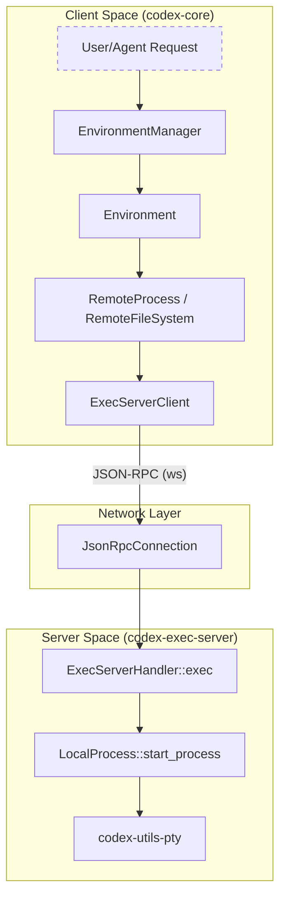
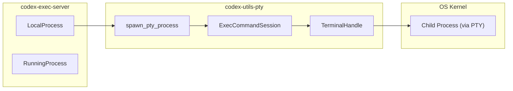

# Exec Server

관련 소스 파일

다음 파일들은 이 위키 페이지를 생성하기 위한 컨텍스트로 사용되었습니다:

- [codex-rs/app-server/src/config_manager.rs](codex-rs/app-server/src/config_manager.rs)
- [codex-rs/app-server/src/config_manager_service.rs](codex-rs/app-server/src/config_manager_service.rs)
- [codex-rs/app-server/src/config_manager_service_tests.rs](codex-rs/app-server/src/config_manager_service_tests.rs)
- [codex-rs/config/src/loader/mod.rs](codex-rs/config/src/loader/mod.rs)
- [codex-rs/config/src/loader/tests.rs](codex-rs/config/src/loader/tests.rs)
- [codex-rs/config/src/state.rs](codex-rs/config/src/state.rs)
- [codex-rs/core/src/environment_selection.rs](codex-rs/core/src/environment_selection.rs)
- [codex-rs/core/src/unified_exec/mod_tests.rs](codex-rs/core/src/unified_exec/mod_tests.rs)
- [codex-rs/core/src/unified_exec/process_tests.rs](codex-rs/core/src/unified_exec/process_tests.rs)
- [codex-rs/core/tests/suite/remote_env.rs](codex-rs/core/tests/suite/remote_env.rs)
- [codex-rs/exec-server/Cargo.toml](codex-rs/exec-server/Cargo.toml)
- [codex-rs/exec-server/README.md](codex-rs/exec-server/README.md)
- [codex-rs/exec-server/src/client.rs](codex-rs/exec-server/src/client.rs)
- [codex-rs/exec-server/src/client_api.rs](codex-rs/exec-server/src/client_api.rs)
- [codex-rs/exec-server/src/client_transport.rs](codex-rs/exec-server/src/client_transport.rs)
- [codex-rs/exec-server/src/connection.rs](codex-rs/exec-server/src/connection.rs)
- [codex-rs/exec-server/src/environment.rs](codex-rs/exec-server/src/environment.rs)
- [codex-rs/exec-server/src/environment_path.rs](codex-rs/exec-server/src/environment_path.rs)
- [codex-rs/exec-server/src/environment_provider.rs](codex-rs/exec-server/src/environment_provider.rs)
- [codex-rs/exec-server/src/environment_toml.rs](codex-rs/exec-server/src/environment_toml.rs)
- [codex-rs/exec-server/src/fs_helper.rs](codex-rs/exec-server/src/fs_helper.rs)
- [codex-rs/exec-server/src/fs_sandbox.rs](codex-rs/exec-server/src/fs_sandbox.rs)
- [codex-rs/exec-server/src/lib.rs](codex-rs/exec-server/src/lib.rs)
- [codex-rs/exec-server/src/local_file_system.rs](codex-rs/exec-server/src/local_file_system.rs)
- [codex-rs/exec-server/src/local_process.rs](codex-rs/exec-server/src/local_process.rs)
- [codex-rs/exec-server/src/process.rs](codex-rs/exec-server/src/process.rs)
- [codex-rs/exec-server/src/protocol.rs](codex-rs/exec-server/src/protocol.rs)
- [codex-rs/exec-server/src/relay.rs](codex-rs/exec-server/src/relay.rs)
- [codex-rs/exec-server/src/remote.rs](codex-rs/exec-server/src/remote.rs)
- [codex-rs/exec-server/src/remote_file_system.rs](codex-rs/exec-server/src/remote_file_system.rs)
- [codex-rs/exec-server/src/remote_process.rs](codex-rs/exec-server/src/remote_process.rs)
- [codex-rs/exec-server/src/rpc.rs](codex-rs/exec-server/src/rpc.rs)
- [codex-rs/exec-server/src/sandboxed_file_system.rs](codex-rs/exec-server/src/sandboxed_file_system.rs)
- [codex-rs/exec-server/src/server.rs](codex-rs/exec-server/src/server.rs)
- [codex-rs/exec-server/src/server/file_system_handler.rs](codex-rs/exec-server/src/server/file_system_handler.rs)
- [codex-rs/exec-server/src/server/handler.rs](codex-rs/exec-server/src/server/handler.rs)
- [codex-rs/exec-server/src/server/handler/tests.rs](codex-rs/exec-server/src/server/handler/tests.rs)
- [codex-rs/exec-server/src/server/process_handler.rs](codex-rs/exec-server/src/server/process_handler.rs)
- [codex-rs/exec-server/src/server/processor.rs](codex-rs/exec-server/src/server/processor.rs)
- [codex-rs/exec-server/src/server/registry.rs](codex-rs/exec-server/src/server/registry.rs)
- [codex-rs/exec-server/src/server/transport.rs](codex-rs/exec-server/src/server/transport.rs)
- [codex-rs/exec-server/src/server/transport_tests.rs](codex-rs/exec-server/src/server/transport_tests.rs)
- [codex-rs/exec-server/tests/common/exec_server.rs](codex-rs/exec-server/tests/common/exec_server.rs)
- [codex-rs/exec-server/tests/common/mod.rs](codex-rs/exec-server/tests/common/mod.rs)
- [codex-rs/exec-server/tests/exec_process.rs](codex-rs/exec-server/tests/exec_process.rs)
- [codex-rs/exec-server/tests/file_system.rs](codex-rs/exec-server/tests/file_system.rs)
- [codex-rs/exec-server/tests/initialize.rs](codex-rs/exec-server/tests/initialize.rs)
- [codex-rs/exec-server/tests/process.rs](codex-rs/exec-server/tests/process.rs)
- [codex-rs/exec-server/tests/relay.rs](codex-rs/exec-server/tests/relay.rs)
- [codex-rs/exec-server/tests/websocket.rs](codex-rs/exec-server/tests/websocket.rs)

`codex-exec-server` 크레이트는 하위 프로세스 실행과 파일시스템 작업을 관리하도록 설계된 독립 실행형 JSON-RPC WebSocket 서버를 제공합니다. 이는 Codex 세션과 잠재적으로 원격이거나 sandbox된 실행 환경 사이의 브리지 역할을 합니다. `codex-utils-pty`를 활용하여 여러 운영체제에서 대화형 PTY 기반 세션과 비대화형 파이프 실행을 모두 지원합니다 [codex-rs/exec-server/Cargo.toml:21-26]().

## 개요와 아키텍처

Exec Server는 Codex 에이전트의 로직을 코드가 실행되는 환경과 분리합니다. 이는 원격 실행 환경(예: cloud 기반 sandbox) 또는 엄격한 보안 경계를 가진 로컬 실행을 지원하는 데 필수적입니다.

### 주요 컴포넌트
- **`ExecServerClient`**: 클라이언트가 WebSocket을 통해 원격 실행 서버와 상호작용하기 위한 기본 인터페이스입니다 [codex-rs/exec-server/src/lib.rs:27-27]().
- **`EnvironmentManager`**: 실행 환경의 수명주기를 관리하는 공유 registry로, `CODEX_EXEC_SERVER_URL` 또는 `environments.toml` 설정에 따라 로컬 또는 원격 `Environment` 인스턴스를 생성합니다 [codex-rs/exec-server/src/environment.rs:41-46]().
- **`ExecBackend`**: 하위 프로세스 생성과 관리를 추상화하는 trait이며, `LocalProcess`와 `RemoteProcess`가 구현합니다 [codex-rs/exec-server/src/lib.rs:54-55]().
- **`ExecutorFileSystem`**: 파일시스템 작업(read, write, metadata)을 제공하는 trait이며, 로컬로 또는 원격 서버용 RPC를 통해 구현됩니다 [codex-rs/exec-server/src/lib.rs:36-36]().

### 자연어에서 코드 엔터티로의 매핑: 실행 흐름
다음 다이어그램은 개념적 "Run Command" 요청을 디스패치와 실행에 관여하는 특정 코드 엔터티에 매핑합니다.

**실행 디스패치 경로**

**출처:** [codex-rs/exec-server/src/environment.rs:148-156](), [codex-rs/exec-server/src/client.rs:163-172](), [codex-rs/exec-server/src/local_process.rs:149-152]().

## Wire Protocol과 Handshake

서버와의 통신은 `JsonRpcConnection`이 관리하는 JSON-RPC 2.0 호환 프로토콜을 사용해 WebSocket 위에서 이루어집니다 [codex-rs/exec-server/src/connection.rs:222-228]().

### 1. Initialize Handshake
명령이 실행되기 전에 클라이언트는 `initialize` 요청을 보내야 합니다. 이는 클라이언트 identity를 설정하고 세션 재개를 가능하게 합니다 [codex-rs/exec-server/src/protocol.rs:13-14]().
- **요청**: `client_name`과 선택적 `resume_session_id`를 포함하는 `InitializeParams` [codex-rs/exec-server/src/protocol.rs:55-61]().
- **응답**: 고유한 `session_id`를 포함하는 `InitializeResponse` [codex-rs/exec-server/src/protocol.rs:63-67]().

### 2. Process Management RPC
| Method | Params | 설명 |
| :--- | :--- | :--- |
| `process/start` | `ExecParams` | 새 프로세스(PTY 또는 Pipe)를 생성합니다 [codex-rs/exec-server/src/protocol.rs:15-15](). |
| `process/read` | `ReadParams` | 특정 프로세스의 출력을 long-poll합니다 [codex-rs/exec-server/src/protocol.rs:16-16](). |
| `process/write` | `WriteParams` | 실행 중인 프로세스의 `stdin`에 데이터를 씁니다 [codex-rs/exec-server/src/protocol.rs:17-17](). |
| `process/terminate` | `TerminateParams` | 실행 중인 프로세스를 종료합니다 [codex-rs/exec-server/src/protocol.rs:19-19](). |

### 3. 알림(서버에서 클라이언트로)
서버는 프로세스 이벤트를 클라이언트로 스트리밍할 수 있습니다:
- `process/output`: `stdout` 또는 `stderr`의 raw byte가 담긴 `ExecOutputDeltaNotification`을 포함합니다 [codex-rs/exec-server/src/protocol.rs:20-20]().
- `process/exited`: 프로세스가 종료될 때 전송되며 exit code를 포함합니다 [codex-rs/exec-server/src/protocol.rs:21-21]().
- `process/closed`: 출력 스트림이 완전히 drain되었을 때 전송됩니다 [codex-rs/exec-server/src/protocol.rs:22-22]().

**출처:** [codex-rs/exec-server/src/protocol.rs:13-35](), [codex-rs/exec-server/src/local_process.rs:28-33]().

## 하위 프로세스 실행(codex-utils-pty)

`codex-exec-server`는 프로세스 생성의 저수준 핵심 작업을 `codex-utils-pty`에 의존합니다.

### 실행 모드
1. **PTY 모드**: 대화형 도구에 사용됩니다. `codex-utils-pty`를 통해 완전한 터미널 환경을 제공합니다 [codex-rs/exec-server/src/protocol.rs:97-97]().
2. **Pipe 모드**: 비대화형 명령에 사용됩니다. 표준 OS pipe를 통해 `stdout`과 `stderr`를 캡처합니다 [codex-rs/exec-server/src/protocol.rs:99-100]().

**엔터티 매핑: PTY 수명주기**

**출처:** [codex-rs/exec-server/src/local_process.rs:170-179](), [codex-rs/exec-server/src/connection.rs:145-150]().

## Filesystem RPC

서버는 `ExecutorFileSystem` trait를 통해 포괄적인 파일시스템 작업 집합을 제공하므로, Codex 에이전트가 다른 머신에서 실행 중이더라도 워크스페이스를 조작할 수 있습니다.

| RPC Method | Parameters | 설명 |
| :--- | :--- | :--- |
| `fs/readFile` | `FsReadFileParams` | 파일 내용을 읽습니다 [codex-rs/exec-server/src/protocol.rs:24-24](). |
| `fs/writeFile` | `FsWriteFileParams` | 데이터를 파일에 씁니다 [codex-rs/exec-server/src/protocol.rs:25-25](). |
| `fs/createDirectory` | `FsCreateDirectoryParams` | 디렉터리를 생성합니다 [codex-rs/exec-server/src/protocol.rs:26-26](). |
| `fs/getMetadata` | `FsGetMetadataParams` | 파일 metadata를 조회합니다 [codex-rs/exec-server/src/protocol.rs:27-27](). |
| `fs/readDirectory` | `FsReadDirectoryParams` | 디렉터리 내용을 나열합니다 [codex-rs/exec-server/src/protocol.rs:31-31](). |
| `fs/remove` | `FsRemoveParams` | 파일 또는 디렉터리를 삭제합니다 [codex-rs/exec-server/src/protocol.rs:32-32](). |

**출처:** [codex-rs/exec-server/src/protocol.rs:24-33](), [codex-rs/exec-server/src/client.rs:47-56]().

## 구현 세부사항

### Environment 선택
`EnvironmentManager`는 `CODEX_EXEC_SERVER_URL` 환경 변수 또는 `environments.toml`을 확인하여 사용 가능한 backend를 결정합니다 [codex-rs/exec-server/src/environment.rs:30-35]().
- **Local**: `LocalProcess`와 `LocalFileSystem`을 사용합니다 [codex-rs/exec-server/src/environment.rs:154-159]().
- **Remote**: `ExecServerClient`를 통해 통신하는 `RemoteProcess`와 `RemoteFileSystem`을 사용합니다 [codex-rs/exec-server/src/environment.rs:43-45]().

### Sandboxing 통합
`FileSystemSandboxRunner`는 제한된 환경에서 파일시스템 작업 실행을 관리합니다 [codex-rs/exec-server/src/fs_sandbox.rs:43-46](). 이는 `SandboxManager`를 사용해 `FileSystemSandboxContext`에 따라 실행 요청을 선택하고 변환합니다 [codex-rs/exec-server/src/fs_sandbox.rs:88-96](). 이 컨텍스트에는 `PermissionProfile`(예: `ReadOnly` 또는 `Restricted`)과 대상 `WindowsSandboxLevel`이 포함됩니다 [codex-rs/exec-server/src/fs_sandbox.rs:114-115]().

### ExecServerClient 구현
`ExecServerClient`는 내부 `RpcClient`를 사용해 WebSocket 위의 JSON-RPC request-response 수명주기를 관리합니다 [codex-rs/exec-server/src/client.rs:169-171](). 활성 `sessions`의 registry를 유지하여(스레드 안전 접근을 위해 `ArcSwap` 사용) 들어오는 `process/output` 알림을 올바른 프로세스별 event log로 라우팅합니다 [codex-rs/exec-server/src/client.rs:175-178]().

### Remote Relay와 신뢰성
서버는 신뢰할 수 없는 네트워크 또는 rendezvous point를 통한 통신을 위해 relay 메커니즘을 지원합니다.
- **Relay Protocols**: `relay` 및 `relay_proto` 모듈에 구현되어 있습니다 [codex-rs/exec-server/src/lib.rs:17-18]().
- **신뢰성**: 클라이언트 구현은 서로 다른 서버 태스크에서 도착할 수 있는 순서가 뒤섞인 알림(output, exit, closed)을 처리하기 위해 `OrderedSessionEvents`에 ordering 로직을 포함합니다 [codex-rs/exec-server/src/client.rs:153-160]().

**출처:** [codex-rs/exec-server/src/environment.rs:89-166](), [codex-rs/exec-server/src/fs_sandbox.rs:43-118](), [codex-rs/exec-server/src/client.rs:163-190]().
