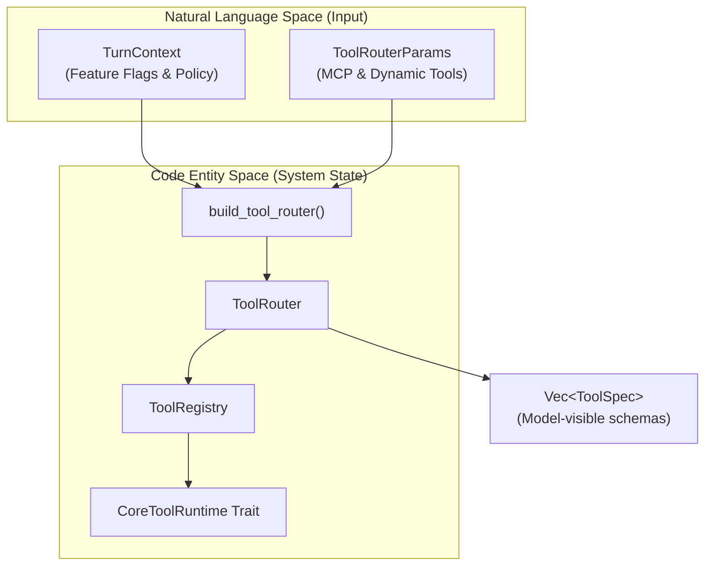
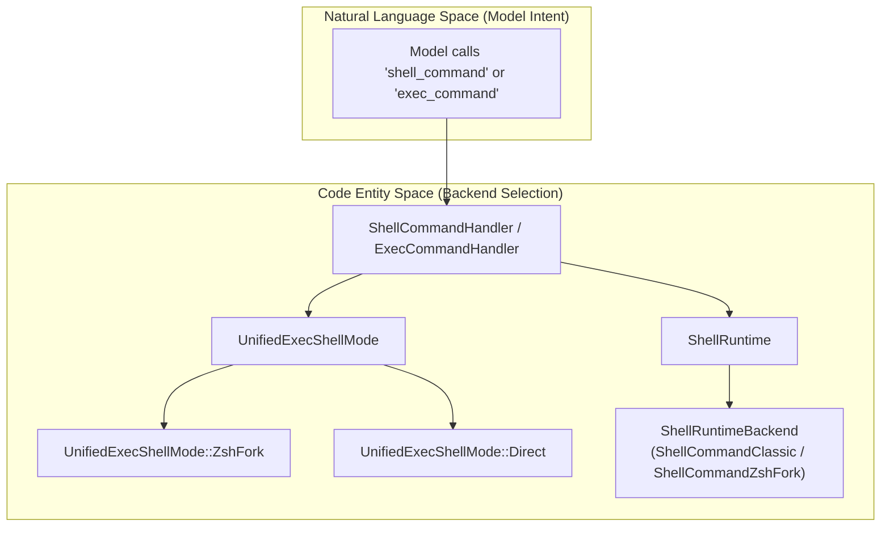

# Tool System

관련 소스 파일

다음 파일들은 이 위키 페이지를 생성하기 위한 컨텍스트로 사용되었습니다:

- [codex-rs/core/src/tools/events.rs](codex-rs/core/src/tools/events.rs)
- [codex-rs/core/src/tools/handlers/apply_patch.rs](codex-rs/core/src/tools/handlers/apply_patch.rs)
- [codex-rs/core/src/tools/handlers/shell.rs](codex-rs/core/src/tools/handlers/shell.rs)
- [codex-rs/core/src/tools/handlers/unified_exec.rs](codex-rs/core/src/tools/handlers/unified_exec.rs)
- [codex-rs/core/src/tools/handlers/view_image.rs](codex-rs/core/src/tools/handlers/view_image.rs)
- [codex-rs/core/src/tools/network_approval.rs](codex-rs/core/src/tools/network_approval.rs)
- [codex-rs/core/src/tools/orchestrator.rs](codex-rs/core/src/tools/orchestrator.rs)
- [codex-rs/core/src/tools/runtimes/apply_patch.rs](codex-rs/core/src/tools/runtimes/apply_patch.rs)
- [codex-rs/core/src/tools/runtimes/mod.rs](codex-rs/core/src/tools/runtimes/mod.rs)
- [codex-rs/core/src/tools/runtimes/mod_tests.rs](codex-rs/core/src/tools/runtimes/mod_tests.rs)
- [codex-rs/core/src/tools/runtimes/shell.rs](codex-rs/core/src/tools/runtimes/shell.rs)
- [codex-rs/core/src/tools/runtimes/unified_exec.rs](codex-rs/core/src/tools/runtimes/unified_exec.rs)
- [codex-rs/core/src/tools/sandboxing.rs](codex-rs/core/src/tools/sandboxing.rs)
- [codex-rs/core/src/turn_diff_tracker.rs](codex-rs/core/src/turn_diff_tracker.rs)
- [codex-rs/core/src/turn_diff_tracker_tests.rs](codex-rs/core/src/turn_diff_tracker_tests.rs)
- [codex-rs/core/src/unified_exec/mod.rs](codex-rs/core/src/unified_exec/mod.rs)
- [codex-rs/core/src/unified_exec/process_manager.rs](codex-rs/core/src/unified_exec/process_manager.rs)
- [codex-rs/core/tests/suite/unified_exec.rs](codex-rs/core/tests/suite/unified_exec.rs)
- [codex-rs/tools/Cargo.toml](codex-rs/tools/Cargo.toml)
- [codex-rs/tools/README.md](codex-rs/tools/README.md)
- [codex-rs/tools/src/dynamic_tool.rs](codex-rs/tools/src/dynamic_tool.rs)
- [codex-rs/tools/src/dynamic_tool_tests.rs](codex-rs/tools/src/dynamic_tool_tests.rs)
- [codex-rs/tools/src/json_schema.rs](codex-rs/tools/src/json_schema.rs)
- [codex-rs/tools/src/json_schema_tests.rs](codex-rs/tools/src/json_schema_tests.rs)
- [codex-rs/tools/src/lib.rs](codex-rs/tools/src/lib.rs)
- [codex-rs/tools/src/mcp_tool.rs](codex-rs/tools/src/mcp_tool.rs)
- [codex-rs/tools/src/mcp_tool_tests.rs](codex-rs/tools/src/mcp_tool_tests.rs)
- [codex-rs/tools/src/tool_definition.rs](codex-rs/tools/src/tool_definition.rs)
- [codex-rs/tools/src/tool_definition_tests.rs](codex-rs/tools/src/tool_definition_tests.rs)
- [codex-rs/tools/tests/fixtures/json_schema_policy/google_calendar.json](codex-rs/tools/tests/fixtures/json_schema_policy/google_calendar.json)
- [codex-rs/tools/tests/fixtures/json_schema_policy/google_drive.json](codex-rs/tools/tests/fixtures/json_schema_policy/google_drive.json)
- [codex-rs/tools/tests/fixtures/json_schema_policy/microsoft_outlook_email.json](codex-rs/tools/tests/fixtures/json_schema_policy/microsoft_outlook_email.json)
- [codex-rs/tools/tests/fixtures/json_schema_policy/notion.json](codex-rs/tools/tests/fixtures/json_schema_policy/notion.json)
- [codex-rs/tools/tests/fixtures/json_schema_policy/oversized_notion_create_page_input_schema.json](codex-rs/tools/tests/fixtures/json_schema_policy/oversized_notion_create_page_input_schema.json)
- [codex-rs/tools/tests/fixtures/json_schema_policy/slack.json](codex-rs/tools/tests/fixtures/json_schema_policy/slack.json)
- [codex-rs/tools/tests/json_schema_policy_fixtures.rs](codex-rs/tools/tests/json_schema_policy_fixtures.rs)

## 목적과 범위

Tool System은 모델이 대화 turn 중 호출할 수 있는 도구의 등록, 설정, 오케스트레이션, 실행을 관리합니다. 이는 다음을 위한 통합 프레임워크를 제공합니다:

- **도구 등록과 라우팅**: `ToolRouter` [codex-rs/core/src/tools/router.rs:34-37]() 및 `ToolRegistry` [codex-rs/core/src/tools/registry.rs:21748]()를 통해 feature flag와 모델 capability를 기준으로 수행됩니다.
- **도구 명세**: 함수 parameter에 `ToolSpec`과 `JsonSchema`를 사용합니다 [codex-rs/tools/src/lib.rs:105-106]().
- **도구 오케스트레이션**: `ToolCallRuntime`을 통해 병렬 실행 관리와 cancellation을 포함합니다 [codex-rs/core/src/tools/parallel.rs:31-37]().
- **도구 실행**: `CoreToolRuntime` trait를 구현하는 여러 handler(Shell, Unified Exec, `apply_patch`, MCP 등)를 통해 수행됩니다 [codex-rs/core/src/tools/registry.rs:48-51]().
- **Discovery와 Dynamic Loading**: `ToolSearchHandler` [codex-rs/core/src/tools/handlers/tool_search.rs:23-27]() 및 `DynamicToolHandler` [codex-rs/core/src/tools/spec_plan.rs:10]()를 통해 MCP 서버와 plugin marketplace에서 도구를 발견하고 동적으로 로드합니다.
- **Hook 통합**: 도구 수명주기(Pre/Post tool use)를 가로채 입력 재작성 또는 추가 컨텍스트 주입을 허용합니다 [codex-rs/core/src/tools/registry.rs:69-112]().

도구 registry에 대한 자세한 내용은 [Tool Registry and Configuration](#5.1)을 참조하세요. PTY 기반 대화형 process system에 대한 자세한 내용은 [Unified Exec Process Management](#5.3)를 참조하세요.

---

## Tool Registry와 설정

`ToolRouter`는 도구 디스패치의 기본 진입점 역할을 합니다. 이는 세션 parameter, MCP 도구, dynamic tool을 기준으로 도구 가용성을 결정하는 `ToolRouterParams`에서 구성됩니다 [codex-rs/core/src/tools/router.rs:39-45](). `ToolRegistry`는 `ToolName`에서 `CoreToolRuntime` executor로의 mapping을 저장합니다 [codex-rs/core/src/tools/registry.rs:48-51]().

**다이어그램: 도구 설정과 디스패치 흐름**

출처: [codex-rs/core/src/tools/router.rs:34-57](), [codex-rs/core/src/tools/spec_plan.rs:153-159](), [codex-rs/core/src/tools/registry.rs:48-51]()

### 병렬 실행
시스템은 병렬 tool call을 지원합니다. `ToolRouter`는 `tool_supports_parallel`을 통해 도구가 병렬성을 지원하는지 확인합니다 [codex-rs/core/src/tools/router.rs:83-87](). 실행은 `ToolCallRuntime`이 관리하며, 이는 병렬 도구와 순차 도구 사이의 접근을 조율하기 위해 `RwLock`을 사용합니다 [codex-rs/core/src/tools/parallel.rs:115-119]().

자세한 내용은 [Tool Registry and Configuration](#5.1)을 참조하세요.

---

## Shell 실행 도구

Codex는 여러 shell 실행 backend를 지원합니다. `ShellCommandHandler`는 표준 명령 실행을 관리하고 [codex-rs/core/src/tools/handlers/shell.rs:32](), `ExecCommandHandler`는 Unified Exec system을 통한 대화형 세션을 처리합니다 [codex-rs/core/src/tools/handlers/unified_exec.rs:23](). 선택은 `ShellCommandBackendConfig`의 영향을 받습니다 [codex-rs/tools/src/lib.rs:71]().

**다이어그램: Shell 도구 선택 로직**

출처: [codex-rs/core/src/tools/handlers/shell.rs:32-58](), [codex-rs/core/src/tools/runtimes/shell.rs:74-86](), [codex-rs/tools/src/lib.rs:71-80]()

자세한 내용은 [Shell Execution Tools](#5.2)를 참조하세요.

---

## Unified Exec Process Management

`UnifiedExecProcessManager`는 대화형 PTY(Pseudo-Terminal) 세션을 오케스트레이션합니다. 이 시스템을 통해 모델은 process를 시작하고 이후 `write_stdin`을 통해 상호작용할 수 있습니다 [codex-rs/core/src/unified_exec/mod.rs:133-136]().

### Process Management
- **수명주기**: 활성 `UnifiedExecProcess` entry를 추적하는 `ProcessStore`와 `UnifiedExecProcessManager`를 통해 관리됩니다 [codex-rs/core/src/unified_exec/mod.rs:121-131]().
- **오케스트레이션**: 생성 전에 승인과 플랫폼별 sandboxing을 처리하기 위해 `ToolOrchestrator`를 사용합니다 [codex-rs/core/src/unified_exec/mod.rs:5-10]().
- **Pruning**: 시스템 리소스를 유지하기 위해 `MAX_UNIFIED_EXEC_PROCESSES`를 통한 LRU pruning을 구현합니다 [codex-rs/core/src/unified_exec/mod.rs:72]().

출처: [codex-rs/core/src/unified_exec/mod.rs:1-165](), [codex-rs/core/src/unified_exec/process_manager.rs:169-183](), [codex-rs/core/src/tools/runtimes/unified_exec.rs:96-100]()

자세한 내용은 [Unified Exec Process Management](#5.3)를 참조하세요.

---

## Apply Patch System

`apply_patch` 시스템은 파일 수정을 위한 특화 도구입니다.
- **Handlers**: freeform patch와 structured patch를 모두 처리하는 `ApplyPatchHandler`가 관리합니다 [codex-rs/core/src/tools/handlers/apply_patch.rs:60-62]().
- **Streaming**: 모델이 patch content를 아직 스트리밍하는 동안 `PatchApplyUpdated` 프로토콜 이벤트를 내보내기 위해 `ApplyPatchArgumentDiffConsumer`를 지원합니다 [codex-rs/core/src/tools/handlers/apply_patch.rs:71-83]().
- **Runtime**: `ApplyPatchRuntime`은 orchestrator 아래에서 검증된 patch를 실행하며, `FileSystemSandboxContext`를 통해 sandboxing이 강제되도록 보장합니다 [codex-rs/core/src/tools/runtimes/apply_patch.rs:58-60]().

출처: [codex-rs/core/src/tools/handlers/apply_patch.rs:1-135](), [codex-rs/core/src/tools/runtimes/apply_patch.rs:89-106]()

자세한 내용은 [Apply Patch System](#5.4)을 참조하세요.

---

## Tool Orchestration과 Approval

tool system은 safety를 위한 로직, 특히 permission과 lifecycle hook 처리를 중앙화합니다.

1. **오케스트레이션**: `ToolOrchestrator`는 approval 확인, sandbox 선택, 거부 시 retry라는 복잡한 흐름을 처리합니다 [codex-rs/core/src/unified_exec/mod.rs:5-10]().
2. **Approvals**: `Approvable` trait는 `ShellRuntime` 및 `UnifiedExecRuntime` 같은 runtime이 `ApprovalKey`를 정의하고 async approval request를 트리거할 수 있게 합니다 [codex-rs/core/src/tools/runtimes/shell.rs:123-149]().
3. **Guardian 통합**: Runtime은 `review_approval_request`를 통해 검토를 `Guardian` sub-agent에 위임할 수 있습니다 [codex-rs/core/src/tools/runtimes/unified_exec.rs:163-178]().

출처: [codex-rs/core/src/tools/runtimes/shell.rs:123-187](), [codex-rs/core/src/tools/runtimes/unified_exec.rs:134-180](), [codex-rs/core/src/tools/orchestrator.rs:1-20]()

자세한 내용은 [Tool Orchestration and Approval](#5.5)을 참조하세요.

---

## Tool Event Emission과 Output

도구 실행 진행 상황과 결과는 `ToolEmitter`를 통해 세션으로 다시 전달됩니다 [codex-rs/core/src/tools/events.rs:122]().

- **Event Lifecycle**: Emitter는 `Begin`, `Success`, `Failure` 단계를 처리합니다 [codex-rs/core/src/tools/events.rs:54-61]().
- **Unified Exec Watcher**: `async_watcher`를 사용해 PTY output과 process exit을 모니터링하고 `ExecCommandEnd` 같은 이벤트를 내보냅니다 [codex-rs/core/src/unified_exec/process_manager.rs:42-45]().
- **Output Truncation**: `TruncationPolicy` 같은 정책은 대규모 도구 output이 token budget을 초과하지 않도록 보장합니다 [codex-rs/core/src/unified_exec/mod.rs:69-71]().

출처: [codex-rs/core/src/tools/events.rs:1-200](), [codex-rs/core/src/unified_exec/process_manager.rs:42-52](), [codex-rs/core/src/unified_exec/mod.rs:69-71]()

자세한 내용은 [Tool Event Emission and Output](#5.7)을 참조하세요.

---

## Skills와 Plugins

tool system은 외부 프로토콜과 discovery를 통해 확장 가능합니다:
- **MCP**: 외부 도구는 Model Context Protocol을 통해 통합되며, `mcp_tool_to_responses_api_tool`을 사용해 model call을 연결합니다 [codex-rs/tools/src/lib.rs:63]().
- **Tool Search**: `TOOL_SEARCH_TOOL_NAME`은 모델이 대규모 registry에서 관련 도구를 찾을 수 있게 합니다 [codex-rs/tools/src/lib.rs:91]().
- **Plugins**: `REQUEST_PLUGIN_INSTALL_TOOL_NAME` 및 `LIST_AVAILABLE_PLUGINS_TO_INSTALL_TOOL_NAME`을 통해 관리됩니다 [codex-rs/tools/src/lib.rs:86-88]().

출처: [codex-rs/tools/src/lib.rs:1-107](), [codex-rs/core/src/tools/handlers/view_image.rs:70-76]()

자세한 내용은 [Skills System](#5.9), [Plugins System](#5.11), [Model Context Protocol (MCP)](#6)를 참조하세요.
