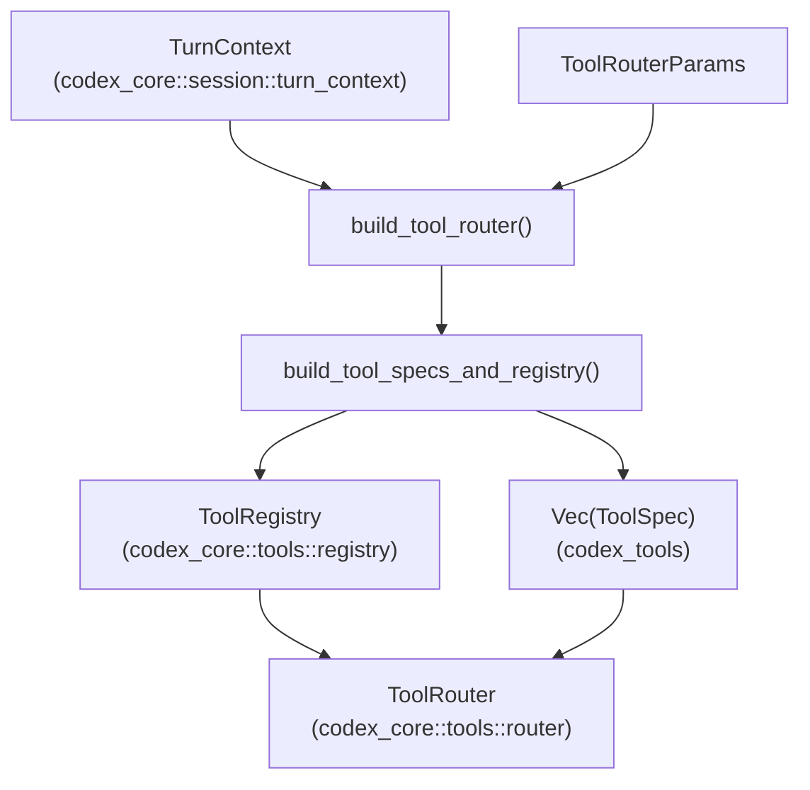
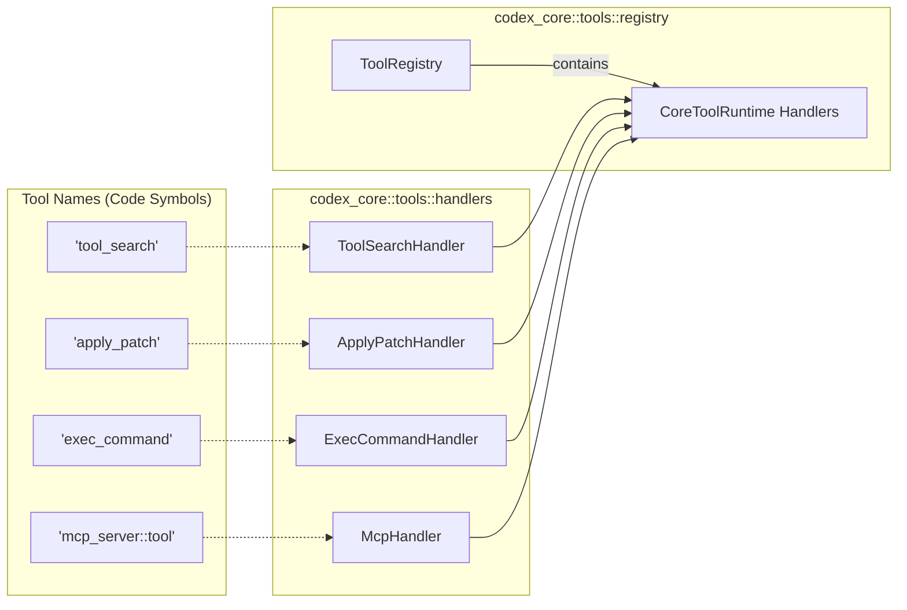
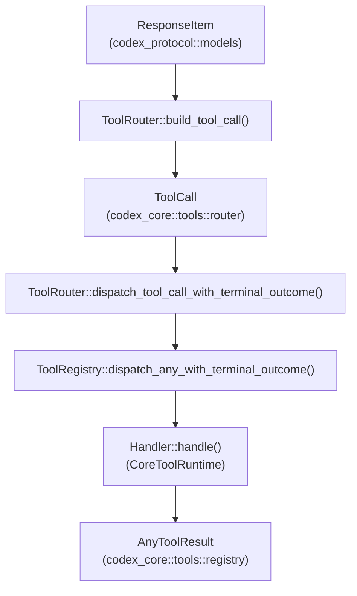

# Tool Registry와 Configuration

관련 소스 파일

다음 파일들은 이 위키 페이지를 생성하기 위한 컨텍스트로 사용되었습니다:

- [codex-rs/core/src/state/session.rs](codex-rs/core/src/state/session.rs)
- [codex-rs/core/src/tools/code_mode/execute_handler.rs](codex-rs/core/src/tools/code_mode/execute_handler.rs)
- [codex-rs/core/src/tools/code_mode/mod.rs](codex-rs/core/src/tools/code_mode/mod.rs)
- [codex-rs/core/src/tools/code_mode/wait_handler.rs](codex-rs/core/src/tools/code_mode/wait_handler.rs)
- [codex-rs/core/src/tools/context.rs](codex-rs/core/src/tools/context.rs)
- [codex-rs/core/src/tools/context_tests.rs](codex-rs/core/src/tools/context_tests.rs)
- [codex-rs/core/src/tools/handlers/dynamic.rs](codex-rs/core/src/tools/handlers/dynamic.rs)
- [codex-rs/core/src/tools/handlers/extension_tools.rs](codex-rs/core/src/tools/handlers/extension_tools.rs)
- [codex-rs/core/src/tools/handlers/mcp.rs](codex-rs/core/src/tools/handlers/mcp.rs)
- [codex-rs/core/src/tools/handlers/mod.rs](codex-rs/core/src/tools/handlers/mod.rs)
- [codex-rs/core/src/tools/handlers/tool_search.rs](codex-rs/core/src/tools/handlers/tool_search.rs)
- [codex-rs/core/src/tools/parallel.rs](codex-rs/core/src/tools/parallel.rs)
- [codex-rs/core/src/tools/registry.rs](codex-rs/core/src/tools/registry.rs)
- [codex-rs/core/src/tools/registry_tests.rs](codex-rs/core/src/tools/registry_tests.rs)
- [codex-rs/core/src/tools/router.rs](codex-rs/core/src/tools/router.rs)
- [codex-rs/core/src/tools/router_tests.rs](codex-rs/core/src/tools/router_tests.rs)
- [codex-rs/core/src/tools/spec_plan.rs](codex-rs/core/src/tools/spec_plan.rs)
- [codex-rs/core/src/tools/spec_plan_tests.rs](codex-rs/core/src/tools/spec_plan_tests.rs)
- [codex-rs/core/tests/suite/code_mode.rs](codex-rs/core/tests/suite/code_mode.rs)
- [codex-rs/tools/Cargo.toml](codex-rs/tools/Cargo.toml)
- [codex-rs/tools/README.md](codex-rs/tools/README.md)
- [codex-rs/tools/src/dynamic_tool.rs](codex-rs/tools/src/dynamic_tool.rs)
- [codex-rs/tools/src/dynamic_tool_tests.rs](codex-rs/tools/src/dynamic_tool_tests.rs)
- [codex-rs/tools/src/json_schema.rs](codex-rs/tools/src/json_schema.rs)
- [codex-rs/tools/src/json_schema_tests.rs](codex-rs/tools/src/json_schema_tests.rs)
- [codex-rs/tools/src/lib.rs](codex-rs/tools/src/lib.rs)
- [codex-rs/tools/src/mcp_tool.rs](codex-rs/tools/src/mcp_tool.rs)
- [codex-rs/tools/src/mcp_tool_tests.rs](codex-rs/tools/src/mcp_tool_tests.rs)
- [codex-rs/tools/src/tool_call.rs](codex-rs/tools/src/tool_call.rs)
- [codex-rs/tools/src/tool_definition.rs](codex-rs/tools/src/tool_definition.rs)
- [codex-rs/tools/src/tool_definition_tests.rs](codex-rs/tools/src/tool_definition_tests.rs)
- [codex-rs/tools/tests/fixtures/json_schema_policy/google_calendar.json](codex-rs/tools/tests/fixtures/json_schema_policy/google_calendar.json)
- [codex-rs/tools/tests/fixtures/json_schema_policy/google_drive.json](codex-rs/tools/tests/fixtures/json_schema_policy/google_drive.json)
- [codex-rs/tools/tests/fixtures/json_schema_policy/microsoft_outlook_email.json](codex-rs/tools/tests/fixtures/json_schema_policy/microsoft_outlook_email.json)
- [codex-rs/tools/tests/fixtures/json_schema_policy/notion.json](codex-rs/tools/tests/fixtures/json_schema_policy/notion.json)
- [codex-rs/tools/tests/fixtures/json_schema_policy/oversized_notion_create_page_input_schema.json](codex-rs/tools/tests/fixtures/json_schema_policy/oversized_notion_create_page_input_schema.json)
- [codex-rs/tools/tests/fixtures/json_schema_policy/slack.json](codex-rs/tools/tests/fixtures/json_schema_policy/slack.json)
- [codex-rs/tools/tests/json_schema_policy_fixtures.rs](codex-rs/tools/tests/json_schema_policy_fixtures.rs)

이 페이지는 Codex가 특정 세션에서 모델에 제공할 도구를 결정하는 방식을 문서화합니다. `ToolSpec` 정의, `ToolRegistry`, `ToolRouter`, 그리고 `CoreToolRuntime` 및 `ToolExecutor` trait를 다룹니다.

도구 자체가 어떻게 *실행*되는지(예: shell, apply_patch, unified exec)는 **5.2**-**5.8** 페이지를 참조하세요. MCP별 도구 설정과 위임은 **6.1** 및 **6.2**를 참조하세요. 전체 sandbox와 approval system은 **2.4** 및 **5.5**를 참조하세요.

---

## 개요

모든 에이전트 세션은 첫 API 요청 전에 도구 집합을 계산합니다. 도구 계획은 모델 capability, 활성화된 feature flag(예: `CodeMode` 또는 `UnifiedExec`), 세션 source를 통합하는 `TurnContext` [codex-rs/core/src/tools/router.rs:48-50]()에 의해 구동됩니다.

이 입력들은 결합되어 `ToolRegistry`와 `ToolRouter`를 빌드합니다:

- **`ToolRegistry`**: 구체적인 런타임 도구 handler(`CoreToolRuntime`)를 보관하고 tool call의 dispatch를 관리합니다 [codex-rs/core/src/tools/registry.rs:48-143]().
- **`ToolRouter`**: registry와 모델에 전송되는 필터링된 `ToolSpec` 집합을 결합하는 세션 범위 인터페이스를 제공합니다 [codex-rs/core/src/tools/router.rs:34-37]().

컨텍스트에서 router로 이어지는 데이터 흐름은 다음과 같습니다:

### 자연어 공간에서 코드 엔터티 공간으로: 도구 계획
Title: Tool Planning Data Flow

**범례:**
- `ToolSpec`은 모델에 보이는 도구 설명을 나타냅니다.
- `ToolRegistry`는 `ToolName`을 키로 하는 도구 handler를 조립합니다.
- `ToolRouter`는 registry를 사용해 런타임 tool call을 라우팅합니다.

출처: [codex-rs/core/src/tools/router.rs:34-57](), [codex-rs/core/src/tools/spec_plan.rs:153-156](), [codex-rs/core/src/tools/registry.rs:48-143]()

---

## 도구 계획과 `ToolSpec`

계획 단계는 어떤 도구가 모델에 노출되는지 결정합니다. 이는 `spec_plan.rs`의 `build_tool_specs_and_registry`가 처리합니다 [codex-rs/core/src/tools/spec_plan.rs:161-164]().

### 도구 소스
시스템은 여러 소스에서 도구를 집계합니다:
1.  **내장 Handler**: `shell_command`, `exec_command`, `apply_patch` 같은 core 도구 [codex-rs/core/src/tools/spec_plan.rs:6-29]().
2.  **MCP 도구**: 외부 Model Context Protocol 서버가 제공하는 도구 [codex-rs/core/src/tools/handlers/mcp.rs:32-35]().
3.  **Dynamic 도구**: 사용자 정의 또는 런타임 주입 도구 [codex-rs/core/src/tools/handlers/dynamic.rs:1-10]().
4.  **Extension 도구**: plugin 또는 외부 extension이 제공하는 도구 [codex-rs/core/src/tools/handlers/extension_tools.rs:1-10]().

### 도구 노출
도구는 서로 다른 노출 수준을 가질 수 있습니다 [codex-rs/core/src/tools/registry.rs:42-42]():
-   **Model-Visible**: LLM에 전송되는 `ToolSpec` 목록에 포함됩니다 [codex-rs/core/src/tools/router.rs:59-61]().
-   **Hidden/Dispatch-Only**: 실행을 위해 `ToolRegistry`에 등록되지만(예: Code Mode를 통해), 모델에는 광고되지 않습니다 [codex-rs/core/src/tools/spec_plan.rs:125-130]().

출처: [codex-rs/core/src/tools/spec_plan.rs:99-139](), [codex-rs/core/src/tools/router.rs:59-61](), [codex-rs/tools/src/lib.rs:105-105]()

---

## Tool Registry와 `CoreToolRuntime`

### `CoreToolRuntime` Trait
`CoreToolRuntime` trait는 로컬에서 실행되는 도구를 위한 타입 지정 런타임 계약입니다 [codex-rs/core/src/tools/registry.rs:48-48](). 이는 `ToolExecutor<ToolInvocation>`을 확장하며 다음을 제공합니다:

-   **Hook Payloads**: Hooks System을 위한 `pre_tool_use_payload`와 `post_tool_use_payload` [codex-rs/core/src/tools/registry.rs:69-112]().
-   **Input Rewriting**: `with_updated_hook_input`은 hook이 실행 전에 도구 인자를 수정할 수 있게 합니다 [codex-rs/core/src/tools/registry.rs:118-140]().
-   **Telemetry**: observability를 위한 `telemetry_tags` [codex-rs/core/src/tools/registry.rs:62-67]().
-   **Diff Consumers**: 스트리밍되는 도구 인자 처리를 위한 `create_diff_consumer` [codex-rs/core/src/tools/registry.rs:142-144]().

### 주요 Handler

| Handler Class | Tool Name | 구현 모듈 |
| :--- | :--- | :--- |
| `ShellCommandHandler` | `shell_command` | [codex-rs/core/src/tools/handlers/shell/mod.rs]() |
| `ExecCommandHandler` | `exec_command` | [codex-rs/core/src/tools/handlers/unified_exec/mod.rs]() |
| `ApplyPatchHandler` | `apply_patch` | [codex-rs/core/src/tools/handlers/apply_patch/mod.rs]() |
| `McpHandler` | (Dynamic) | [codex-rs/core/src/tools/handlers/mcp.rs:32-35]() |
| `ToolSearchHandler` | `tool_search` | [codex-rs/core/src/tools/handlers/tool_search.rs]() |

### 코드 엔터티 공간 — Registry Mapping
Title: Tool Handler Registry Mapping

출처: [codex-rs/core/src/tools/registry.rs:48-145](), [codex-rs/core/src/tools/spec_plan.rs:4-29](), [codex-rs/core/src/tools/handlers/mod.rs:52-76]()

---

## `ToolRouter`와 Dispatch

`ToolRouter`는 `Session`이 도구와 상호작용하기 위한 기본 인터페이스입니다. 모델 응답에서 도구 실행으로 변환하는 과정을 처리합니다.

### Tool Call 구성
`build_tool_call` 함수는 LLM에서 온 `ResponseItem`을 `ToolCall` 객체로 변환합니다 [codex-rs/core/src/tools/router.rs:96-143](). 이는 다음을 지원합니다:
-   **Function Calls**: 표준 namespaced function call [codex-rs/core/src/tools/router.rs:98-111]().
-   **Tool Search**: `tool_search` parameter를 위한 특정 parsing [codex-rs/core/src/tools/router.rs:112-130]().
-   **Custom Tool Calls**: dynamic tool을 위한 generic input [codex-rs/core/src/tools/router.rs:131-140]().

### 실행 Dispatch
`ToolRouter`는 `ToolRegistry`를 통해 call을 dispatch합니다. 병렬 실행에 사용되는 `ToolCallRuntime`은 router를 사용해 개별 call을 처리합니다 [codex-rs/core/src/tools/parallel.rs:31-37]().

### 병렬 실행
router는 `tool_supports_parallel` [codex-rs/core/src/tools/router.rs:83-87]()을 확인해 도구가 동시에 실행될 수 있는지 결정합니다. 가능하다면 `ToolCallRuntime`은 read lock을 획득하고, 그렇지 않으면 독점 접근을 보장하기 위해 write lock을 획득합니다 [codex-rs/core/src/tools/parallel.rs:115-119]().

출처: [codex-rs/core/src/tools/router.rs:96-143](), [codex-rs/core/src/tools/parallel.rs:82-133](), [codex-rs/core/src/tools/registry.rs:48-60]()

---

## Tool Outputs와 Context Injection

도구는 `ToolOutput`을 포함하는 `AnyToolResult` [codex-rs/core/src/tools/registry.rs:160-165]()를 반환합니다.

### `ToolOutput` Trait
`ToolOutput` 구현체는 결과가 어떻게 표시되는지 정의합니다:
-   **`to_response_item()`**: 결과를 모델의 대화 기록을 위한 `ResponseInputItem`으로 변환합니다 [codex-rs/core/src/tools/context.rs:88-93]().
-   **`code_mode_result()`**: JavaScript REPL 소비를 위한 JSON 값을 제공합니다 [codex-rs/core/src/tools/context.rs:95-99]().
-   **`log_preview()`**: telemetry와 logging을 위한 잘린 문자열을 반환합니다 [codex-rs/core/src/tools/context.rs:75-82]().

### Code Mode 통합
Code Mode에서 `CodeModeService`는 `CodeModeDispatchWorker`를 시작합니다 [codex-rs/core/src/tools/code_mode/mod.rs:112-118](). 이 worker는 중첩 tool call을 위해 JavaScript runtime을 다시 `ToolRouter`로 연결합니다 [codex-rs/core/src/tools/code_mode/mod.rs:131-132]().

출처: [codex-rs/core/src/tools/context.rs:28-108](), [codex-rs/core/src/tools/registry.rs:160-184](), [codex-rs/core/src/tools/code_mode/mod.rs:60-140]()

---

## 주요 클래스와 Trait 요약

| Type | 설명 | 정의 위치 |
| :--- | :--- | :--- |
| `ToolSpec` | LLM을 위한 도구 schema와 metadata의 명세입니다. | [codex-rs/tools/src/lib.rs:105-105]() |
| `CoreToolRuntime` | Codex native 도구 실행 로직을 위한 내부 trait입니다. | [codex-rs/core/src/tools/registry.rs:48-145]() |
| `ToolRegistry` | 한 turn에서 활성화된 모든 도구 handler의 registry입니다. | [codex-rs/core/src/tools/registry.rs:1-10]() |
| `ToolRouter` | tool call을 빌드하고 dispatch하기 위한 고수준 인터페이스입니다. | [codex-rs/core/src/tools/router.rs:34-37]() |
| `ToolInvocation` | 특정 도구 실행 시도에 대한 contextual information입니다. | [codex-rs/core/src/tools/context.rs:54-63]() |
| `ToolCallRuntime` | turn 중 tool call의 수명주기와 concurrency를 관리합니다. | [codex-rs/core/src/tools/parallel.rs:31-37]() |

출처: [codex-rs/core/src/tools/registry.rs:48-48](), [codex-rs/core/src/tools/router.rs:34-37](), [codex-rs/core/src/tools/context.rs:54-63](), [codex-rs/core/src/tools/parallel.rs:31-37]()
