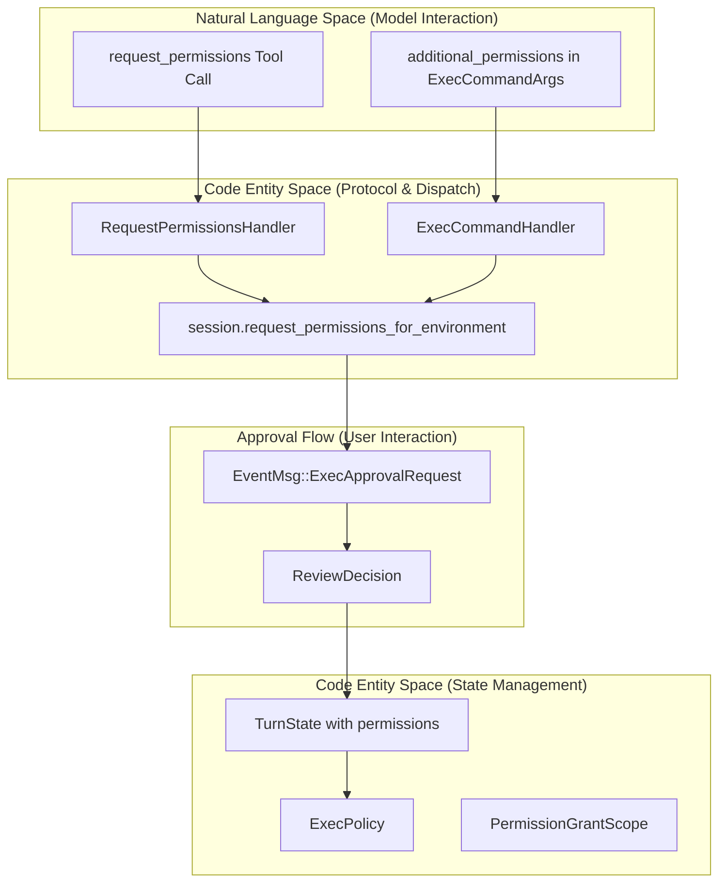
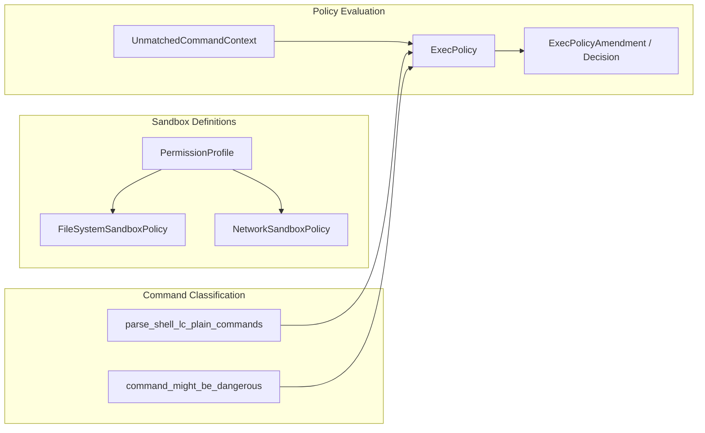

# Permission Request System

관련 소스 파일

다음 파일들은 이 위키 페이지를 생성하기 위한 컨텍스트로 사용되었습니다:

- [codex-rs/app-server/tests/suite/v2/request_user_input.rs](codex-rs/app-server/tests/suite/v2/request_user_input.rs)
- [codex-rs/core/src/exec_policy.rs](codex-rs/core/src/exec_policy.rs)
- [codex-rs/core/src/exec_policy_tests.rs](codex-rs/core/src/exec_policy_tests.rs)
- [codex-rs/core/src/exec_policy_windows_tests.rs](codex-rs/core/src/exec_policy_windows_tests.rs)
- [codex-rs/core/src/tools/handlers/plan.rs](codex-rs/core/src/tools/handlers/plan.rs)
- [codex-rs/core/src/tools/handlers/request_permissions.rs](codex-rs/core/src/tools/handlers/request_permissions.rs)
- [codex-rs/core/src/tools/handlers/request_user_input.rs](codex-rs/core/src/tools/handlers/request_user_input.rs)
- [codex-rs/core/src/tools/handlers/shell/shell_command.rs](codex-rs/core/src/tools/handlers/shell/shell_command.rs)
- [codex-rs/core/src/tools/handlers/test_sync.rs](codex-rs/core/src/tools/handlers/test_sync.rs)
- [codex-rs/core/src/tools/handlers/unified_exec/exec_command.rs](codex-rs/core/src/tools/handlers/unified_exec/exec_command.rs)
- [codex-rs/core/src/tools/handlers/unified_exec/write_stdin.rs](codex-rs/core/src/tools/handlers/unified_exec/write_stdin.rs)
- [codex-rs/core/src/tools/runtimes/shell/unix_escalation.rs](codex-rs/core/src/tools/runtimes/shell/unix_escalation.rs)
- [codex-rs/core/src/tools/runtimes/shell/unix_escalation_tests.rs](codex-rs/core/src/tools/runtimes/shell/unix_escalation_tests.rs)
- [codex-rs/core/tests/common/zsh_fork.rs](codex-rs/core/tests/common/zsh_fork.rs)
- [codex-rs/core/tests/suite/agent_websocket.rs](codex-rs/core/tests/suite/agent_websocket.rs)
- [codex-rs/core/tests/suite/approvals.rs](codex-rs/core/tests/suite/approvals.rs)
- [codex-rs/core/tests/suite/exec_policy.rs](codex-rs/core/tests/suite/exec_policy.rs)
- [codex-rs/core/tests/suite/request_user_input.rs](codex-rs/core/tests/suite/request_user_input.rs)
- [codex-rs/core/tests/suite/skill_approval.rs](codex-rs/core/tests/suite/skill_approval.rs)
- [codex-rs/core/tests/suite/turn_state.rs](codex-rs/core/tests/suite/turn_state.rs)
- [codex-rs/core/tests/suite/unified_exec_zsh_fork_approvals.rs](codex-rs/core/tests/suite/unified_exec_zsh_fork_approvals.rs)
- [codex-rs/core/tests/suite/websocket_fallback.rs](codex-rs/core/tests/suite/websocket_fallback.rs)

Permission Request System은 AI 에이전트가 실행 중에 추가 sandbox permission(filesystem, network, platform-specific capability)을 동적으로 요청할 수 있게 합니다. 이 시스템은 명시적인 사용자 approval을 통해 기본 `SandboxPolicy`를 넘어서는 controlled escalation을 허용하며, grant는 단일 turn 또는 전체 session 동안 유지될 수 있습니다.

기본 sandbox policy와 enforcement mechanism에 대한 정보는 [Sandbox and Approval Policies (2.4)]()를 참조하세요. 도구 실행 orchestration 및 approval workflow는 [Tool Orchestration and Approval (5.5)]()를 참조하세요.

---

## 개요

permission request system은 두 가지 주요 mechanism을 통해 동작합니다:

1.  **Standalone `request_permissions` 도구**: 실행 전 명시적인 permission request입니다. 이는 `RequestPermissionsHandler`가 처리합니다 [codex-rs/core/src/tools/handlers/request_permissions.rs:20-20]().
2.  **Inline `additional_permissions` 필드**: 실행 tool call(예: `shell_command`, `exec_command`)과 함께 요청되는 permission입니다. 이는 `AdditionalPermissionProfile` struct를 통해 제공됩니다 [codex-rs/core/src/tools/handlers/unified_exec/exec_command.rs:170-170]().

두 mechanism 모두 turn-scoped 또는 session-scoped grant로 저장될 수 있는 normalized permission structure를 생성합니다. 이러한 grant는 이후 tool call이 반복적인 user prompt 없이 이전에 승인된 permission을 자동으로 상속하는 "sticky permissions" pattern을 가능하게 합니다.

**출처:** [codex-rs/core/src/tools/handlers/request_permissions.rs:28-40](), [codex-rs/core/src/tools/handlers/unified_exec/exec_command.rs:178-192](), [codex-rs/core/tests/suite/approvals.rs:10-27]()

---

## 시스템 아키텍처

### Permission Data Flow와 Components

다음 다이어그램은 모델의 자연어 tool call을 Core system 내에서 state와 validation을 관리하는 기반 코드 엔터티와 연결합니다.

Title: Permission Request and Validation Flow

**출처:** [codex-rs/core/src/tools/handlers/request_permissions.rs:84-91](), [codex-rs/core/src/tools/handlers/unified_exec/exec_command.rs:178-192](), [codex-rs/core/src/exec_policy.rs:121-129](), [codex-rs/core/tests/suite/approvals.rs:21-27]()

---

## 구현 세부사항

### Validation과 Execution Policy
시스템은 실행 전에 명령에 명시적인 approval이 필요한지 평가하기 위해 `ExecPolicy`를 사용합니다. `prompt_is_rejected_by_policy` 함수는 현재 `AskForApproval` 설정을 기준으로 request를 차단해야 하는지 결정합니다 [codex-rs/core/src/exec_policy.rs:174-197]().

주요 validation component는 다음을 포함합니다:
*   **`ExecPolicyCommandOrigin`**: generic shell command와 PowerShell-specific heuristic을 구분합니다 [codex-rs/core/src/exec_policy.rs:110-118]().
*   **`UnmatchedCommandContext`**: evaluation 중 사용되는 sandbox permission과 approval policy를 포함합니다 [codex-rs/core/src/exec_policy.rs:121-128]().
*   **Shell Parsing**: 시스템은 policy matching을 위해 실제 기반 operation을 식별하는 특수 parser를 사용합니다. 예: `parse_shell_lc_plain_commands` [codex-rs/core/src/exec_policy.rs:38-39]().

### Approval Rejection Logic
시스템은 granular approval setting을 강제합니다. 예를 들어 policy rule에 approval이 필요하지만 `AskForApproval::Granular.rules`가 false이면 request는 `REJECT_RULES_APPROVAL_REASON`으로 거부됩니다 [codex-rs/core/src/exec_policy.rs:47-48](), [codex-rs/core/src/exec_policy.rs:184-187](). 비슷한 logic은 sandbox escalation에도 적용됩니다 [codex-rs/core/src/exec_policy.rs:45-46](), [codex-rs/core/src/exec_policy.rs:190-192]().

Title: Permission Logic and Policy Entities

**출처:** [codex-rs/core/src/exec_policy.rs:121-129](), [codex-rs/core/src/exec_policy.rs:174-197](), [codex-rs/core/src/tools/runtimes/shell/unix_escalation.rs:80-85](), [codex-rs/core/tests/suite/approvals.rs:21-27]()

---

## Grant Scopes와 Persistence

Permission은 서로 다른 lifecycle로 grant될 수 있으며, 일반적으로 "Turn" scope와 "Session" scope로 구분됩니다.

| Scope | 설명 |
|-------|-------------|
| **Turn** | 현재 operation에만 유효합니다. |
| **Session** | session의 나머지 기간 동안 유지됩니다. |

### Sticky Permissions Pattern
"sticky" 동작은 session-scoped approval cache와 `ExecPolicy` amendment를 통해 구현됩니다. 사용자가 amendment와 함께 request를 승인하면, 시스템은 특정 command prefix 허용 같은 rule을 policy에 append할 수 있습니다 [codex-rs/core/src/exec_policy.rs:20-21]().

이후 call은 `is_policy_match`를 사용해 이러한 amended rule에 대해 검사됩니다 [codex-rs/core/src/exec_policy.rs:161-166](). `PrefixRuleMatch` category에서 match가 발견되면 명령은 추가 상호작용 없이 허용됩니다 [codex-rs/core/src/exec_policy.rs:162-163]().

**출처:** [codex-rs/core/src/exec_policy.rs:161-166](), [codex-rs/core/src/tools/handlers/unified_exec/exec_command.rs:179-186](), [codex-rs/core/tests/suite/approvals.rs:113-116]()

---

## Network Permission 통합

Network access는 `NetworkSandboxPolicy`로 관리되며, `NetworkPolicyAmendment`를 통해 수정될 수 있습니다 [codex-rs/core/tests/suite/approvals.rs:11-12](). 

시스템은 network protocol과 action에 대한 granular rule을 지원합니다:
*   **`NetworkPolicyRuleAction`**: host/port가 허용되는지 또는 거부되는지 정의합니다 [codex-rs/core/tests/suite/approvals.rs:12-12]().
*   **`NetworkApprovalProtocol`**: 서로 다른 traffic type(예: HTTPS, SOCKS5)을 구분합니다 [codex-rs/core/tests/suite/approvals.rs:10-10]().

이러한 rule은 tool execution phase 중 평가되어, `curl` 또는 `python` request 같은 network-bound process가 현재 session policy를 준수하도록 보장합니다 [codex-rs/core/src/tools/runtimes/shell/unix_escalation.rs:159-160]().

**출처:** [codex-rs/core/tests/suite/approvals.rs:10-18](), [codex-rs/core/src/tools/runtimes/shell/unix_escalation.rs:159-160](), [codex-rs/core/src/exec_policy.rs:16-17]()
