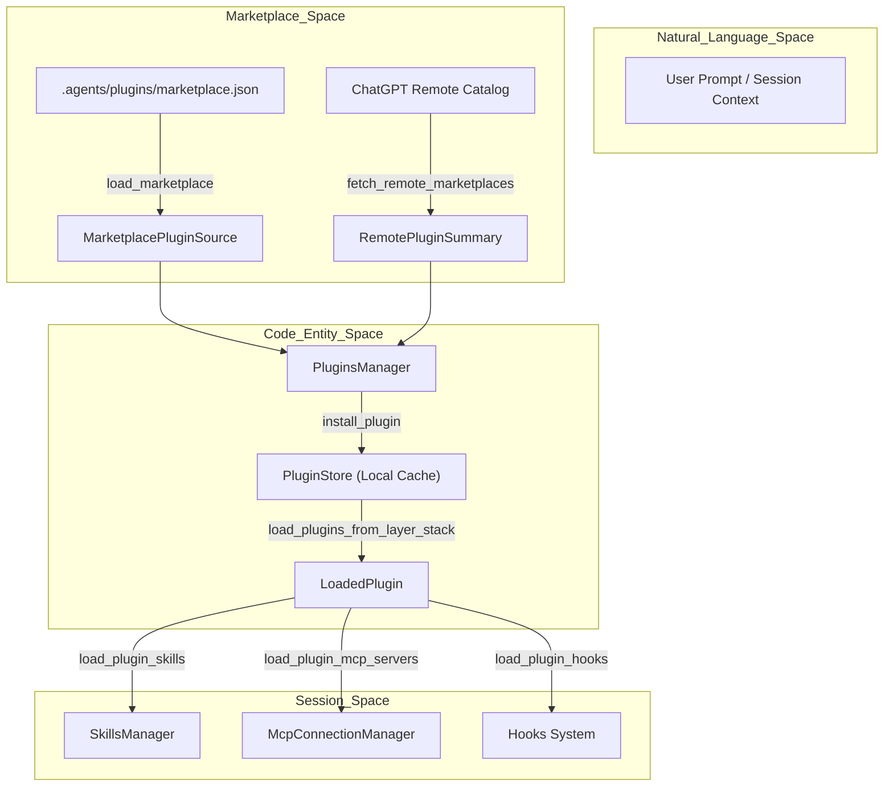
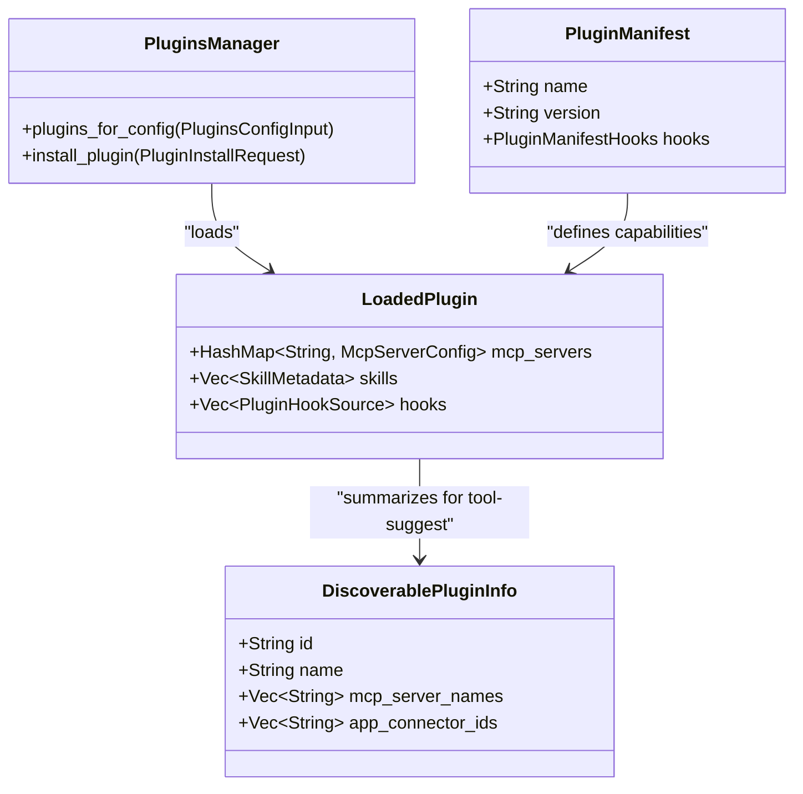

# Plugins System

관련 소스 파일

다음 파일들은 이 위키 페이지를 생성하기 위한 컨텍스트로 사용되었습니다:

- [codex-rs/app-server-protocol/schema/json/v2/PluginListResponse.json](codex-rs/app-server-protocol/schema/json/v2/PluginListResponse.json)
- [codex-rs/app-server-protocol/schema/json/v2/PluginReadResponse.json](codex-rs/app-server-protocol/schema/json/v2/PluginReadResponse.json)
- [codex-rs/app-server-protocol/schema/json/v2/PluginShareListResponse.json](codex-rs/app-server-protocol/schema/json/v2/PluginShareListResponse.json)
- [codex-rs/app-server-protocol/src/protocol/v2/plugin.rs](codex-rs/app-server-protocol/src/protocol/v2/plugin.rs)
- [codex-rs/app-server/src/request_processors/catalog_processor.rs](codex-rs/app-server/src/request_processors/catalog_processor.rs)
- [codex-rs/app-server/src/request_processors/plugins.rs](codex-rs/app-server/src/request_processors/plugins.rs)
- [codex-rs/app-server/tests/suite/v2/hooks_list.rs](codex-rs/app-server/tests/suite/v2/hooks_list.rs)
- [codex-rs/app-server/tests/suite/v2/plugin_install.rs](codex-rs/app-server/tests/suite/v2/plugin_install.rs)
- [codex-rs/app-server/tests/suite/v2/plugin_list.rs](codex-rs/app-server/tests/suite/v2/plugin_list.rs)
- [codex-rs/app-server/tests/suite/v2/plugin_read.rs](codex-rs/app-server/tests/suite/v2/plugin_read.rs)
- [codex-rs/app-server/tests/suite/v2/plugin_share.rs](codex-rs/app-server/tests/suite/v2/plugin_share.rs)
- [codex-rs/app-server/tests/suite/v2/plugin_uninstall.rs](codex-rs/app-server/tests/suite/v2/plugin_uninstall.rs)
- [codex-rs/cli/src/marketplace_cmd.rs](codex-rs/cli/src/marketplace_cmd.rs)
- [codex-rs/cli/src/plugin_cmd.rs](codex-rs/cli/src/plugin_cmd.rs)
- [codex-rs/cli/tests/marketplace_add.rs](codex-rs/cli/tests/marketplace_add.rs)
- [codex-rs/cli/tests/marketplace_remove.rs](codex-rs/cli/tests/marketplace_remove.rs)
- [codex-rs/cli/tests/marketplace_upgrade.rs](codex-rs/cli/tests/marketplace_upgrade.rs)
- [codex-rs/cli/tests/plugin_cli.rs](codex-rs/cli/tests/plugin_cli.rs)
- [codex-rs/cli/tests/update.rs](codex-rs/cli/tests/update.rs)
- [codex-rs/config/src/marketplace_edit.rs](codex-rs/config/src/marketplace_edit.rs)
- [codex-rs/core-plugins/src/discoverable.rs](codex-rs/core-plugins/src/discoverable.rs)
- [codex-rs/core-plugins/src/lib.rs](codex-rs/core-plugins/src/lib.rs)
- [codex-rs/core-plugins/src/loader.rs](codex-rs/core-plugins/src/loader.rs)
- [codex-rs/core-plugins/src/manager.rs](codex-rs/core-plugins/src/manager.rs)
- [codex-rs/core-plugins/src/manager_tests.rs](codex-rs/core-plugins/src/manager_tests.rs)
- [codex-rs/core-plugins/src/marketplace.rs](codex-rs/core-plugins/src/marketplace.rs)
- [codex-rs/core-plugins/src/marketplace_tests.rs](codex-rs/core-plugins/src/marketplace_tests.rs)
- [codex-rs/core-plugins/src/remote.rs](codex-rs/core-plugins/src/remote.rs)
- [codex-rs/core-plugins/src/remote/share.rs](codex-rs/core-plugins/src/remote/share.rs)
- [codex-rs/core-plugins/src/remote/share/tests.rs](codex-rs/core-plugins/src/remote/share/tests.rs)
- [codex-rs/core/src/plugins/discoverable.rs](codex-rs/core/src/plugins/discoverable.rs)
- [codex-rs/core/src/plugins/discoverable_tests.rs](codex-rs/core/src/plugins/discoverable_tests.rs)
- [codex-rs/core/src/tools/handlers/request_plugin_install_tests.rs](codex-rs/core/src/tools/handlers/request_plugin_install_tests.rs)
- [codex-rs/tools/src/request_plugin_install.rs](codex-rs/tools/src/request_plugin_install.rs)
- [codex-rs/tools/src/request_plugin_install_tests.rs](codex-rs/tools/src/request_plugin_install_tests.rs)
- [codex-rs/tools/src/tool_discovery.rs](codex-rs/tools/src/tool_discovery.rs)
- [codex-rs/tools/src/tool_discovery_tests.rs](codex-rs/tools/src/tool_discovery_tests.rs)
- [codex-rs/tui/src/snapshots/codex_tui__startup_hooks_review__tests__startup_hooks_review_prompt.snap](codex-rs/tui/src/snapshots/codex_tui__startup_hooks_review__tests__startup_hooks_review_prompt.snap)
- [codex-rs/tui/src/snapshots/codex_tui__startup_hooks_review__tests__startup_hooks_review_prompt_with_trust_error.snap](codex-rs/tui/src/snapshots/codex_tui__startup_hooks_review__tests__startup_hooks_review_prompt_with_trust_error.snap)
- [codex-rs/tui/src/startup_hooks_review.rs](codex-rs/tui/src/startup_hooks_review.rs)

Plugins System은 Codex를 위한 확장성 framework를 제공하여 third-party capability의 discovery, installation, execution을 가능하게 합니다. Plugin은 **Skills**(자연어 instruction), **MCP Servers**(외부 tool provider), **App Connectors**(웹 서비스 integration), **Hooks**(자동화된 session event)를 포함한 여러 entity를 bundle합니다 [[codex-rs/core-plugins/src/remote.rs:167-173]]() [[codex-rs/core-plugins/src/loader.rs:58-62]]().

## 개요와 Marketplace

Plugin은 `marketplace.json` manifest file로 정의되는 **Marketplaces**를 통해 배포됩니다 [[codex-rs/app-server/tests/suite/v2/plugin_list.rs:78-80]](). Codex는 local marketplace(보통 repository의 `.agents/plugins/` 또는 `.claude-plugin/` directory)와 ChatGPT backend를 통해 관리되는 remote marketplace를 지원합니다 [[codex-rs/app-server/tests/suite/v2/plugin_list.rs:43-44]]() [[codex-rs/core-plugins/src/remote.rs:53-59]]().

### Plugin Discovery와 Activation

시스템은 설정된 marketplace에서 plugin metadata를 조회하고 local installation state와 matching하여 plugin을 해석합니다.

**Plugin Activation Flow**

출처: [[codex-rs/core-plugins/src/manager.rs:42]](), [[codex-rs/core-plugins/src/loader.rs:128-147]](), [[codex-rs/core-plugins/src/remote.rs:130-142]](), [[codex-rs/core-plugins/src/store.rs:48]]()

## PluginsManager와 App Server 통합

`PluginsManager`는 plugin 작업을 조율하며, app-server의 `PluginRequestProcessor`는 이러한 capability를 JSON-RPC로 노출합니다 [[codex-rs/core-plugins/src/manager.rs:42]]() [[codex-rs/app-server/src/request_processors/plugins.rs:25-32]]().

### 주요 구조체
| Struct | 설명 |
| :--- | :--- |
| `LoadedPlugin` | disk에서 검증 및 로드된 plugin을 나타내며, skills와 MCP servers를 포함합니다 [[codex-rs/core-plugins/src/lib.rs:23]](). |
| `PluginsManager` | local 및 remote source 전반에서 plugin을 listing, installing, loading하는 기본 orchestrator입니다 [[codex-rs/core-plugins/src/manager.rs:42]](). |
| `PluginStore` | plugins cache directory의 실제 file과 versioning을 관리합니다 [[codex-rs/core-plugins/src/store.rs:48]](). |
| `RemotePluginDetail` | bundle download URL을 포함하여 remote service에 hosted된 plugin의 상세 metadata입니다 [[codex-rs/core-plugins/src/remote.rs:162-174]](). |
| `PluginSummary` | marketplace listing에서 UI 표시를 위해 사용되는 protocol-level summary입니다 [[codex-rs/app-server/src/request_processors/plugins.rs:133-153]](). |

출처: [[codex-rs/core-plugins/src/lib.rs:23-42]](), [[codex-rs/core-plugins/src/remote.rs:162-174]](), [[codex-rs/app-server/src/request_processors/plugins.rs:25-58]]()

## Plugin Installation과 Storage

Plugin은 session stability를 보장하기 위해 versioning되어 local cache directory에 저장됩니다.

### Storage Hierarchy
`PluginStore`는 Codex home 내부에서 directory structure를 강제합니다:
*   **Cache Root**: `plugins/cache/` [[codex-rs/core-plugins/src/store.rs:1]]().
*   **Structure**: `plugins/cache/{marketplace}/{plugin_name}/{version}/` - immutable plugin bundle을 포함합니다 [[codex-rs/app-server/tests/suite/v2/plugin_install.rs:198-200]]().
*   **Manifests**: 모든 plugin은 `.codex-plugin/plugin.json` manifest를 포함해야 합니다 [[codex-rs/core-plugins/src/manager_tests.rs:78-82]]().

### Installation Workflow
1.  **Request**: `marketplacePath` 또는 `remoteMarketplaceName`과 함께 `plugin/install`을 통해 trigger됩니다 [[codex-rs/app-server/tests/suite/v2/plugin_install.rs:106-111]]().
2.  **Validation**: 시스템은 정확히 하나의 source가 제공되었는지 보장하고 plugin ID를 validate합니다 [[codex-rs/app-server/tests/suite/v2/plugin_install.rs:129-157]]() [[codex-rs/core-plugins/src/manager.rs:17-18]]().
3.  **Download/Materialization**: remote plugin의 경우 `.tar.gz` bundle을 download, verify, cache에 extract합니다 [[codex-rs/app-server/tests/suite/v2/plugin_install.rs:208-213]]().
4.  **Registration**: plugin은 사용자의 `config.toml` 내 `[plugins]` table에 등록되어 future session에서 활성화됩니다 [[codex-rs/core-plugins/src/manager_tests.rs:131-138]]().

출처: [[codex-rs/app-server/tests/suite/v2/plugin_install.rs:73-213]](), [[codex-rs/core-plugins/src/store.rs:1-2]](), [[codex-rs/core-plugins/src/manager.rs:148-152]]()

## Remote Plugins와 Sharing

Codex는 ChatGPT ecosystem과 plugin을 sync할 수 있는 "Remote Plugin" 기능을 지원합니다 [[codex-rs/core-plugins/src/remote.rs:53-64]]().

### Remote Marketplace Sync
시스템은 global 및 workspace-specific remote marketplace와 sync합니다:
*   **Marketplaces**: `openai-curated-remote`, `workspace-directory`, `workspace-shared-with-me` [[codex-rs/core-plugins/src/remote.rs:53-59]]().
*   **Sync Logic**: `sync_remote_installed_plugin_bundles_once`는 remote account에서 "installed"로 표시된 plugin의 bundle이 local에 존재하도록 보장합니다 [[codex-rs/core-plugins/src/remote.rs:35]]().
*   **Cache Management**: `mark_remote_plugin_cache_mutation_in_flight`는 concurrent sync operation 중 race condition을 방지합니다 [[codex-rs/core-plugins/src/remote.rs:33]]().

### Plugin Sharing
사용자는 local plugin을 remote catalog에 upload하여 공유할 수 있습니다:
1.  **Discoverability**: Plugin은 `Public`, `Unlisted`, `Private`일 수 있습니다 [[codex-rs/core-plugins/src/remote.rs:148]]().
2.  **Principals**: Sharing은 `Reader` 또는 `Editor` role로 특정 user 또는 group을 대상으로 할 수 있습니다 [[codex-rs/core-plugins/src/remote.rs:38-40]]().
3.  **Persistence**: `save_remote_plugin_share`는 remote service에서 share 등록을 처리합니다 [[codex-rs/core-plugins/src/remote.rs:50]]().

출처: [[codex-rs/core-plugins/src/remote.rs:30-64]](), [[codex-rs/app-server/src/request_processors/plugins.rs:99-110]]()

## Session Injection과 Entity Mapping

Session initialization 중 `PluginsManager`는 core agent에 필요한 injection을 제공합니다.

**Plugin Entity Mapping**

출처: [[codex-rs/core-plugins/src/manager.rs:42]](), [[codex-rs/core-plugins/src/loader.rs:128-185]](), [[codex-rs/core/src/plugins/discoverable.rs:36-53]](), [[codex-rs/core-plugins/src/lib.rs:23-24]]()

### Injection Types
*   **Tool Suggestions**: `list_tool_suggest_discoverable_plugins`는 installed apps를 기준으로 사용자에게 제안할 uninstalled plugin을 allowlist(예: `slack@openai-curated`)에서 식별합니다 [[codex-rs/core/src/plugins/discoverable.rs:9-38]]() [[codex-rs/core/src/plugins/discoverable_tests.rs:84-102]]().
*   **Skills Injection**: `load_plugin_skills`는 plugin의 `skills/` directory에서 자연어 capability를 추출합니다 [[codex-rs/core-plugins/src/loader.rs:18]]() [[codex-rs/core-plugins/src/manager_tests.rs:83]]().
*   **Hook Dispatch**: `load_plugin_hooks`는 plugin의 `hooks/hooks.json`에 정의된 automated trigger(예: `SessionStart`)를 식별합니다 [[codex-rs/core-plugins/src/loader.rs:9]]() [[codex-rs/core-plugins/src/loader.rs:51]]().

출처: [[codex-rs/core/src/plugins/discoverable.rs:9-53]](), [[codex-rs/core-plugins/src/loader.rs:1-53]](), [[codex-rs/core-plugins/src/manager_tests.rs:66-85]]()
