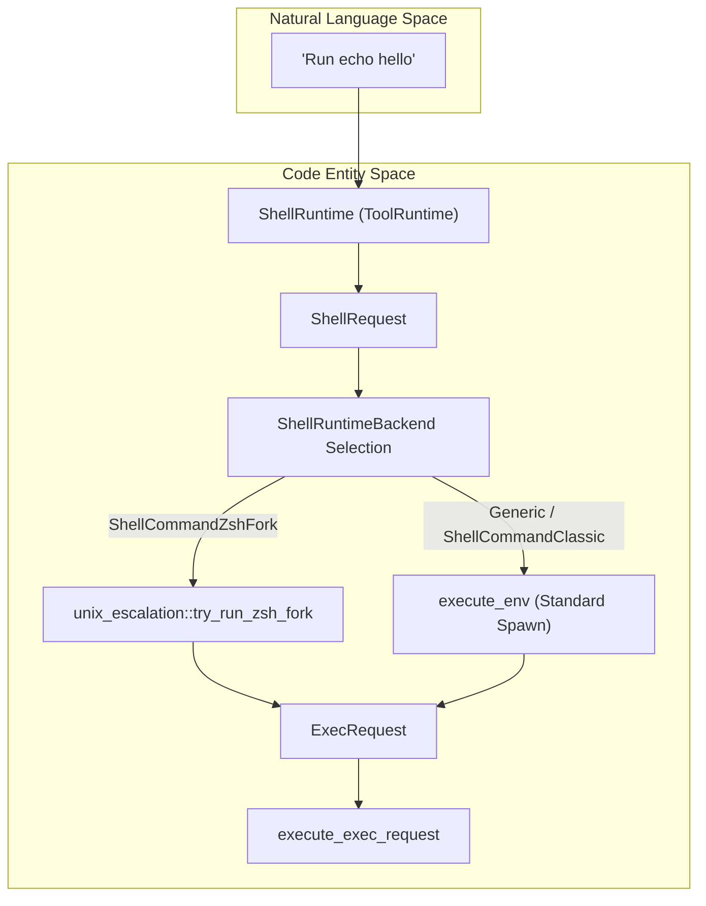
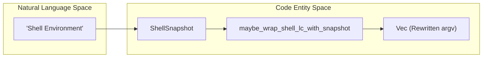

# Shell 실행 도구

관련 소스 파일

다음 파일들은 이 위키 페이지를 생성하기 위한 컨텍스트로 사용되었습니다:

- [codex-rs/core/src/exec_policy.rs](codex-rs/core/src/exec_policy.rs)
- [codex-rs/core/src/exec_policy_tests.rs](codex-rs/core/src/exec_policy_tests.rs)
- [codex-rs/core/src/exec_policy_windows_tests.rs](codex-rs/core/src/exec_policy_windows_tests.rs)
- [codex-rs/core/src/tools/events.rs](codex-rs/core/src/tools/events.rs)
- [codex-rs/core/src/tools/handlers/apply_patch.rs](codex-rs/core/src/tools/handlers/apply_patch.rs)
- [codex-rs/core/src/tools/handlers/shell.rs](codex-rs/core/src/tools/handlers/shell.rs)
- [codex-rs/core/src/tools/handlers/unified_exec.rs](codex-rs/core/src/tools/handlers/unified_exec.rs)
- [codex-rs/core/src/tools/handlers/view_image.rs](codex-rs/core/src/tools/handlers/view_image.rs)
- [codex-rs/core/src/tools/network_approval.rs](codex-rs/core/src/tools/network_approval.rs)
- [codex-rs/core/src/tools/orchestrator.rs](codex-rs/core/src/tools/orchestrator.rs)
- [codex-rs/core/src/tools/runtimes/apply_patch.rs](codex-rs/core/src/tools/runtimes/apply_patch.rs)
- [codex-rs/core/src/tools/runtimes/mod.rs](codex-rs/core/src/tools/runtimes/mod.rs)
- [codex-rs/core/src/tools/runtimes/mod_tests.rs](codex-rs/core/src/tools/runtimes/mod_tests.rs)
- [codex-rs/core/src/tools/runtimes/shell.rs](codex-rs/core/src/tools/runtimes/shell.rs)
- [codex-rs/core/src/tools/runtimes/shell/unix_escalation.rs](codex-rs/core/src/tools/runtimes/shell/unix_escalation.rs)
- [codex-rs/core/src/tools/runtimes/shell/unix_escalation_tests.rs](codex-rs/core/src/tools/runtimes/shell/unix_escalation_tests.rs)
- [codex-rs/core/src/tools/runtimes/unified_exec.rs](codex-rs/core/src/tools/runtimes/unified_exec.rs)
- [codex-rs/core/src/tools/sandboxing.rs](codex-rs/core/src/tools/sandboxing.rs)
- [codex-rs/core/src/turn_diff_tracker.rs](codex-rs/core/src/turn_diff_tracker.rs)
- [codex-rs/core/src/turn_diff_tracker_tests.rs](codex-rs/core/src/turn_diff_tracker_tests.rs)
- [codex-rs/core/src/unified_exec/mod.rs](codex-rs/core/src/unified_exec/mod.rs)
- [codex-rs/core/src/unified_exec/process_manager.rs](codex-rs/core/src/unified_exec/process_manager.rs)
- [codex-rs/core/tests/common/zsh_fork.rs](codex-rs/core/tests/common/zsh_fork.rs)
- [codex-rs/core/tests/suite/approvals.rs](codex-rs/core/tests/suite/approvals.rs)
- [codex-rs/core/tests/suite/exec_policy.rs](codex-rs/core/tests/suite/exec_policy.rs)
- [codex-rs/core/tests/suite/skill_approval.rs](codex-rs/core/tests/suite/skill_approval.rs)
- [codex-rs/core/tests/suite/unified_exec.rs](codex-rs/core/tests/suite/unified_exec.rs)
- [codex-rs/core/tests/suite/unified_exec_zsh_fork_approvals.rs](codex-rs/core/tests/suite/unified_exec_zsh_fork_approvals.rs)
- [codex-rs/shell-command/src/command_safety/is_dangerous_command.rs](codex-rs/shell-command/src/command_safety/is_dangerous_command.rs)
- [codex-rs/shell-command/src/command_safety/is_safe_command.rs](codex-rs/shell-command/src/command_safety/is_safe_command.rs)
- [codex-rs/shell-command/src/command_safety/mod.rs](codex-rs/shell-command/src/command_safety/mod.rs)
- [codex-rs/shell-command/src/command_safety/powershell_parser.ps1](codex-rs/shell-command/src/command_safety/powershell_parser.ps1)
- [codex-rs/shell-command/src/command_safety/powershell_parser.rs](codex-rs/shell-command/src/command_safety/powershell_parser.rs)
- [codex-rs/shell-command/src/command_safety/windows_dangerous_commands.rs](codex-rs/shell-command/src/command_safety/windows_dangerous_commands.rs)
- [codex-rs/shell-command/src/command_safety/windows_safe_commands.rs](codex-rs/shell-command/src/command_safety/windows_safe_commands.rs)
- [codex-rs/shell-command/src/powershell.rs](codex-rs/shell-command/src/powershell.rs)

이 페이지는 Codex가 사용자 시스템에서 명령을 실행할 수 있게 하는 shell 실행 도구를 문서화합니다. 이 도구들은 shell 명령 실행, 대화형 process 관리, multi-turn 명령 상호작용 처리를 위한 기본 인터페이스입니다. 핵심 `shell` 추상화, Zsh용 특수 `unix_escalation` 프로토콜, 통합 대화형 실행 시스템을 다룹니다.

## 개요

Codex는 비대화형 script 실행과 대화형 PTY 세션을 모두 처리하는 도구를 통해 shell 실행 기능을 제공합니다. 이 시스템은 표준 process spawner와 향상된 제어 및 안전성을 위한 특수 `zsh` fork를 포함한 여러 backend를 지원합니다.

| Tool Name | 목적 | 구현 Runtime | Backend Options |
|-----------|---------|------------------------|-----------------|
| `shell_command` | script 스타일 명령 실행 | `ShellRuntime` [codex-rs/core/src/tools/runtimes/shell.rs:88]() | Classic, ZshFork |
| `exec_command` | 대화형 PTY 세션 | `UnifiedExecRuntime` [codex-rs/core/src/tools/runtimes/unified_exec.rs:96]() | Direct 또는 ZshFork |
| `write_stdin` | 실행 중인 PTY에 입력 전송 | `WriteStdinHandler` [codex-rs/core/src/tools/handlers/unified_exec.rs:25]() | `UnifiedExecProcessManager` |

실행 환경은 명령 인자, 작업 디렉터리, 환경 변수, sandbox 정책을 캡슐화하는 `ExecParams` [codex-rs/core/src/exec.rs:85-97]()와 `ExecRequest` [codex-rs/core/src/sandboxing/mod.rs:45-63]()에 의해 제어됩니다.

**출처:** [codex-rs/core/src/exec.rs:85-97](), [codex-rs/core/src/sandboxing/mod.rs:45-63](), [codex-rs/core/src/tools/runtimes/shell.rs:54-70]()

## Backend 선택과 실행 흐름

시스템은 설정과 사용자 환경을 기준으로 backend를 선택합니다. Unix 시스템에서는 `execve` 호출을 가로채고 세밀한 보안 정책을 적용할 수 있는 `zsh` fork가 선호됩니다.

**다이어그램: Shell 실행 Backend 라우팅**

**구현 세부사항:**
- **ZshFork**: `Feature::ShellZshFork`가 활성화되어 있고 사용자 shell이 Zsh이면 [codex-rs/core/src/tools/runtimes/shell/unix_escalation.rs:113-120](), 시스템은 patch된 `zsh` 바이너리와 `codex-shell-escalation` 서버를 사용합니다 [codex-rs/core/src/tools/runtimes/shell/unix_escalation.rs:54-65]().
- **표준 실행**: `execute_exec_request`를 호출하는 `execute_env`로 fallback합니다 [codex-rs/core/src/sandboxing/mod.rs:169-174]().

**출처:** [codex-rs/core/src/tools/runtimes/shell/unix_escalation.rs:102-120](), [codex-rs/core/src/sandboxing/mod.rs:169-174](), [codex-rs/core/src/tools/runtimes/shell.rs:74-86]()

## Unified Exec: 대화형 Process Management

Unified Exec 시스템은 여러 모델 turn에 걸쳐 지속되는 장기 실행 대화형 process(PTY)를 관리합니다. 이는 `UnifiedExecProcessManager`가 오케스트레이션합니다 [codex-rs/core/src/unified_exec/mod.rs:133-136]().

### Process 수명주기
1. **오케스트레이션**: `UnifiedExecRuntime` [codex-rs/core/src/tools/runtimes/unified_exec.rs:96]()은 `ToolOrchestrator`를 통해 approval과 sandbox 선택을 처리합니다.
2. **실행**: `ExecCommandRequest` [codex-rs/core/src/unified_exec/mod.rs:91-109]()는 process manager에 대한 해석된 parameter를 캡슐화합니다.
3. **Capture Policy**: 과거 output cap과 timeout 동작을 유지하기 위해 `ExecCapturePolicy::ShellTool`을 사용합니다 [codex-rs/core/src/exec.rs:128-131]().
4. **Pruning**: `ProcessStore` [codex-rs/core/src/unified_exec/mod.rs:121-124]()는 활성 handle을 관리하고 `MAX_UNIFIED_EXEC_PROCESSES` 제한(64)에 도달하면 LRU 정책으로 이를 pruning합니다 [codex-rs/core/src/unified_exec/mod.rs:72]().

### Output Streaming
실시간 output은 `EventMsg::ExecCommandOutputDelta` [codex-rs/core/src/exec.rs:39]()를 통해 세션으로 다시 스트리밍됩니다. 시스템은 flooding을 방지하기 위해 call당 10,000개의 delta event 제한을 적용합니다 [codex-rs/core/src/exec.rs:73](). Output은 큰 stream을 처리하면서 중요한 exit context를 보존하기 위해 `HeadTailBuffer` [codex-rs/core/src/unified_exec/head_tail_buffer.rs:1]()에 buffer됩니다. hard cap은 `UNIFIED_EXEC_OUTPUT_MAX_BYTES`(1 MiB) [codex-rs/core/src/unified_exec/mod.rs:70]()로 강제됩니다.

**출처:** [codex-rs/core/src/unified_exec/mod.rs:1-180](), [codex-rs/core/src/exec.rs:39-73](), [codex-rs/core/src/exec.rs:128-131](), [codex-rs/core/src/unified_exec/process_manager.rs:1-205]()

## Unix Escalation Protocol(Zsh Fork)

`unix_escalation` 모듈 [codex-rs/core/src/tools/runtimes/shell/unix_escalation.rs:1]()은 patch된 Zsh process를 통해 shell 실행을 관리하기 위한 프로토콜을 구현합니다. 이를 통해 Codex는 하위 명령을 가로채고 "Just-in-Time"(JIT) approval을 적용할 수 있습니다.

### 주요 컴포넌트
- **CoreShellCommandExecutor**: escalation server 아래에서 실제 명령 생성을 처리하기 위해 `ShellCommandExecutor` trait를 구현합니다 [codex-rs/core/src/tools/runtimes/shell/unix_escalation.rs:172-185]().
- **EscalateServer**: core agent와 patch된 shell 사이의 통신 브리지입니다 [codex-rs/core/src/tools/runtimes/shell/unix_escalation.rs:54]().
- **codex-execve-wrapper**: `EXEC_WRAPPER` 환경 변수를 통해 실행 시도를 가로채는 데 사용되는 wrapper binary입니다.

### Approval 로직
명령에 approval이 필요한 경우(`AskForApproval` 설정 기준), 시스템은 실행을 일시 중지하고 사용자 개입을 요청할 수 있습니다. 특히 다음을 처리합니다:
- **Sandbox Approval**: 명령이 기본 sandbox 제약을 벗어나려 할 때 필요합니다 [codex-rs/core/src/tools/runtimes/shell/unix_escalation.rs:82-83]().
- **Rule-Based Approval**: 특정 `exec_policy` match에 의해 트리거됩니다 [codex-rs/core/src/tools/runtimes/shell/unix_escalation.rs:84-85]().

**출처:** [codex-rs/core/src/tools/runtimes/shell/unix_escalation.rs:54-185](), [codex-rs/core/src/tools/runtimes/shell/unix_escalation.rs:80-85]()

## Command Safety와 Policy

실행은 규칙 집합에 대해 명령을 평가하는 `exec_policy` [codex-rs/core/src/exec_policy.rs:17]()에 의해 제어됩니다.

### 안전/위험 명령 감지
Codex는 heuristic 기반 safety checker를 사용해 무해한 명령을 자동 승인하고 위험한 명령에 flag를 지정합니다.
- **안전 명령**: `is_known_safe_command` 함수 [codex-rs/shell-command/src/command_safety/is_safe_command.rs:12]()는 `ls`, `cat`, `pwd` 같은 읽기 전용 또는 무해한 명령을 식별합니다 [codex-rs/shell-command/src/command_safety/is_safe_command.rs:76-102]().
- **위험 명령**: `command_might_be_dangerous` 함수 [codex-rs/shell-command/src/command_safety/is_dangerous_command.rs:7]()는 `rm -rf` 같은 위험한 패턴을 식별합니다 [codex-rs/shell-command/src/command_safety/is_dangerous_command.rs:149]().
- **Script 검사**: 두 checker 모두 `bash -lc` 또는 `zsh -lc` script를 parsing하여 내부 명령을 검사하는 것을 지원합니다 [codex-rs/shell-command/src/command_safety/is_safe_command.rs:41-48](), [codex-rs/shell-command/src/command_safety/is_dangerous_command.rs:20-26]().

### Windows Safety
Windows에서 safety는 PowerShell cmdlet의 작은 allow-list로 제한됩니다 [codex-rs/shell-command/src/command_safety/windows_safe_commands.rs:8-17](). 시스템은 `parse_with_powershell_ast` [codex-rs/shell-command/src/command_safety/windows_safe_commands.rs:98]()를 사용해 script를 tokenize하고 validate합니다. `Set-Content` 또는 `Remove-Item` 같은 중첩된 안전하지 않은 cmdlet을 명시적으로 거부합니다 [codex-rs/shell-command/src/command_safety/windows_safe_commands.rs:152-173]().

**출처:** [codex-rs/shell-command/src/command_safety/is_safe_command.rs:12-102](), [codex-rs/shell-command/src/command_safety/is_dangerous_command.rs:7-149](), [codex-rs/shell-command/src/command_safety/windows_safe_commands.rs:8-173]()

## Environment와 Context Management

실행 전에 Codex는 shell이 올바르게 동작하도록 보장하면서 민감한 정보 누출을 방지하기 위해 sanitized environment를 구성합니다.

### 환경 변수 Policy
`exec_env_for_sandbox_permissions` 함수 [codex-rs/core/src/tools/runtimes/mod.rs:54-65]()는 escalated permission이 필요한 경우 관리형 proxy environment variable을 제거합니다 [codex-rs/core/src/tools/runtimes/mod.rs:59-63](). 이는 `PROXY_ENV_KEYS`와 `CUSTOM_CA_ENV_KEYS` 같은 key를 제거하는 `strip_managed_proxy_env` [codex-rs/core/src/tools/runtimes/mod.rs:67-87]()를 통해 구현됩니다.

### Snapshot 통합
POSIX shell(Bash/Zsh/sh)의 경우, Codex는 실행 전에 shell snapshot을 source하도록 명령을 감쌀 수 있습니다 [codex-rs/core/src/tools/runtimes/mod.rs:175-220](). 이를 통해 사용자의 대화형 세션에 있는 alias, function, exported variable을 에이전트가 사용할 수 있습니다.

**다이어그램: Environment Context에서 재작성된 Shell Command로의 매핑**

**출처:** [codex-rs/core/src/tools/runtimes/mod.rs:54-87](), [codex-rs/core/src/tools/runtimes/mod.rs:175-220]()

## User Shell Commands

UI의 `/shell` 명령은 사용자가 직접 명령을 실행할 수 있게 합니다. 이는 `UserShellCommandTask` [codex-rs/core/src/tasks/user_shell.rs:53-61]()가 처리합니다.

- **Permissions**: `PermissionProfile::Disabled`(full-access escape hatch)로 실행됩니다 [codex-rs/core/src/tasks/user_shell.rs:166-179]().
- **Mode**: `StandaloneTurn`(새 turn 수명주기) 또는 `ActiveTurnAuxiliary`(기존 turn 내부)로 실행될 수 있습니다 [codex-rs/core/src/tasks/user_shell.rs:43-50]().
- **Timeout**: 사용자가 시작한 명령의 기본값은 1시간(`USER_SHELL_TIMEOUT_MS`)입니다 [codex-rs/core/src/tasks/user_shell.rs:40]().

**출처:** [codex-rs/core/src/tasks/user_shell.rs:40-61](), [codex-rs/core/src/tasks/user_shell.rs:166-179]()
