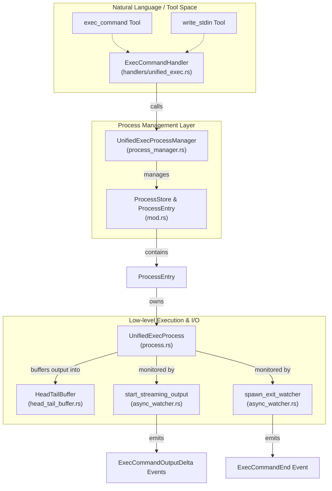
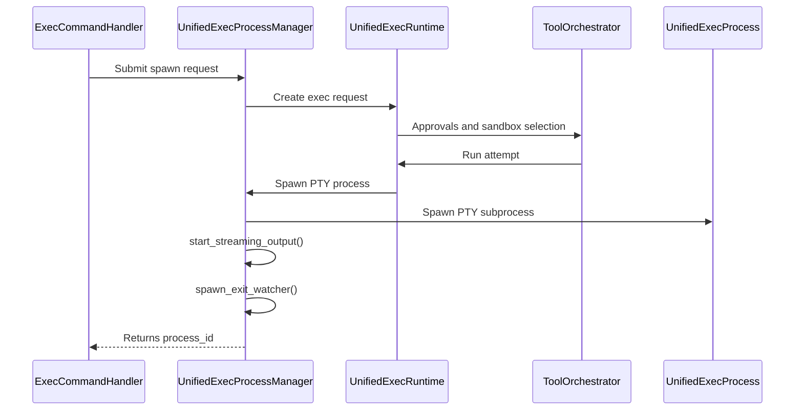
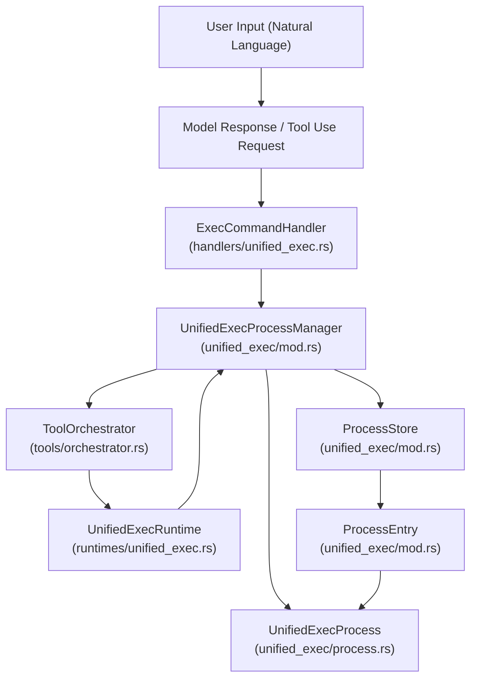

# Unified Exec Process Management

<details>
<summary>관련 소스 파일</summary>

다음 파일들은 이 위키 페이지를 생성하기 위한 컨텍스트로 사용되었습니다:

- [codex-rs/core/src/environment_selection.rs](codex-rs/core/src/environment_selection.rs)
- [codex-rs/core/src/tools/events.rs](codex-rs/core/src/tools/events.rs)
- [codex-rs/core/src/tools/handlers/apply_patch.rs](codex-rs/core/src/tools/handlers/apply_patch.rs)
- [codex-rs/core/src/tools/handlers/shell.rs](codex-rs/core/src/tools/handlers/shell.rs)
- [codex-rs/core/src/tools/handlers/unified_exec.rs](codex-rs/core/src/tools/handlers/unified_exec.rs)
- [codex-rs/core/src/tools/handlers/view_image.rs](codex-rs/core/src/tools/handlers/view_image.rs)
- [codex-rs/core/src/tools/network_approval.rs](codex-rs/core/src/tools/network_approval.rs)
- [codex-rs/core/src/tools/orchestrator.rs](codex-rs/core/src/tools/orchestrator.rs)
- [codex-rs/core/src/tools/runtimes/apply_patch.rs](codex-rs/core/src/tools/runtimes/apply_patch.rs)
- [codex-rs/core/src/tools/runtimes/mod.rs](codex-rs/core/src/tools/runtimes/mod.rs)
- [codex-rs/core/src/tools/runtimes/mod_tests.rs](codex-rs/core/src/tools/runtimes/mod_tests.rs)
- [codex-rs/core/src/tools/runtimes/shell.rs](codex-rs/core/src/tools/runtimes/shell.rs)
- [codex-rs/core/src/tools/runtimes/unified_exec.rs](codex-rs/core/src/tools/runtimes/unified_exec.rs)
- [codex-rs/core/src/tools/sandboxing.rs](codex-rs/core/src/tools/sandboxing.rs)
- [codex-rs/core/src/turn_diff_tracker.rs](codex-rs/core/src/turn_diff_tracker.rs)
- [codex-rs/core/src/turn_diff_tracker_tests.rs](codex-rs/core/src/turn_diff_tracker_tests.rs)
- [codex-rs/core/src/unified_exec/mod.rs](codex-rs/core/src/unified_exec/mod.rs)
- [codex-rs/core/src/unified_exec/mod_tests.rs](codex-rs/core/src/unified_exec/mod_tests.rs)
- [codex-rs/core/src/unified_exec/process.rs](codex-rs/core/src/unified_exec/process.rs)
- [codex-rs/core/src/unified_exec/process_manager.rs](codex-rs/core/src/unified_exec/process_manager.rs)
- [codex-rs/core/src/unified_exec/process_tests.rs](codex-rs/core/src/unified_exec/process_tests.rs)
- [codex-rs/core/tests/suite/unified_exec.rs](codex-rs/core/tests/suite/unified_exec.rs)
- [codex-rs/exec-server/Cargo.toml](codex-rs/exec-server/Cargo.toml)
- [codex-rs/exec-server/src/client.rs](codex-rs/exec-server/src/client.rs)
- [codex-rs/exec-server/src/environment.rs](codex-rs/exec-server/src/environment.rs)
- [codex-rs/exec-server/src/environment_provider.rs](codex-rs/exec-server/src/environment_provider.rs)
- [codex-rs/exec-server/src/environment_toml.rs](codex-rs/exec-server/src/environment_toml.rs)
- [codex-rs/exec-server/src/lib.rs](codex-rs/exec-server/src/lib.rs)
- [codex-rs/exec-server/src/local_process.rs](codex-rs/exec-server/src/local_process.rs)
- [codex-rs/exec-server/src/process.rs](codex-rs/exec-server/src/process.rs)
- [codex-rs/exec-server/src/protocol.rs](codex-rs/exec-server/src/protocol.rs)
- [codex-rs/exec-server/src/remote_process.rs](codex-rs/exec-server/src/remote_process.rs)
- [codex-rs/exec-server/src/server/handler.rs](codex-rs/exec-server/src/server/handler.rs)
- [codex-rs/exec-server/src/server/process_handler.rs](codex-rs/exec-server/src/server/process_handler.rs)
- [codex-rs/exec-server/src/server/registry.rs](codex-rs/exec-server/src/server/registry.rs)
- [codex-rs/exec-server/tests/exec_process.rs](codex-rs/exec-server/tests/exec_process.rs)
- [codex-rs/utils/pty/Cargo.toml](codex-rs/utils/pty/Cargo.toml)
- [codex-rs/utils/pty/README.md](codex-rs/utils/pty/README.md)
- [codex-rs/utils/pty/src/lib.rs](codex-rs/utils/pty/src/lib.rs)
- [codex-rs/utils/pty/src/pipe.rs](codex-rs/utils/pty/src/pipe.rs)
- [codex-rs/utils/pty/src/process.rs](codex-rs/utils/pty/src/process.rs)
- [codex-rs/utils/pty/src/process_group.rs](codex-rs/utils/pty/src/process_group.rs)
- [codex-rs/utils/pty/src/pty.rs](codex-rs/utils/pty/src/pty.rs)
- [codex-rs/utils/pty/src/tests.rs](codex-rs/utils/pty/src/tests.rs)
- [codex-rs/utils/pty/src/win/conpty.rs](codex-rs/utils/pty/src/win/conpty.rs)
- [codex-rs/utils/pty/src/win/mod.rs](codex-rs/utils/pty/src/win/mod.rs)
- [codex-rs/utils/pty/src/win/procthreadattr.rs](codex-rs/utils/pty/src/win/procthreadattr.rs)
- [codex-rs/utils/pty/src/win/psuedocon.rs](codex-rs/utils/pty/src/win/psuedocon.rs)
- [codex-rs/windows-sandbox-rs/src/conpty/mod.rs](codex-rs/windows-sandbox-rs/src/conpty/mod.rs)
- [codex-rs/windows-sandbox-rs/src/elevated/ipc_framed.rs](codex-rs/windows-sandbox-rs/src/elevated/ipc_framed.rs)
- [third_party/wezterm/LICENSE](third_party/wezterm/LICENSE)

</details>


## 목적과 범위

Unified Exec 시스템은 approval 및 sandboxing과 함께 오케스트레이션되는 **대화형 PTY 기반 process 실행**을 제공하여, 여러 tool call에 걸쳐 상태를 유지할 수 있는 지속적 shell 세션을 가능하게 합니다. PTY 기반 하위 process, 해당 수명주기, cap이 적용된 output buffering을 관리하고, 공유 orchestrator를 사용해 중앙화된 approval 및 sandboxing policy를 강제합니다.

이 페이지는 Unified Exec process management layer의 구현, 핵심 도구인 `exec_command`와 `write_stdin`, 활성 process 추적을 위한 `ProcessStore`, 리소스 제어를 위한 LRU pruning 메커니즘을 자세히 설명합니다.

출처: [codex-rs/core/src/unified_exec/mod.rs:1-23]()

---

## 아키텍처 개요

Unified Exec 아키텍처는 고수준 tool invocation을 기반 PTY process management 및 비동기 event streaming과 연결합니다.

Title: Unified Exec Component Interaction


**주요 컴포넌트:**

- **UnifiedExecProcessManager**: process 생성, 재사용, 수명주기, pruning을 처리하는 중앙 coordinator입니다 [codex-rs/core/src/unified_exec/mod.rs:133-136]().
- **ProcessStore**: 활성 process entry와 예약된 ID를 추적하는 thread-safe store입니다 [codex-rs/core/src/unified_exec/mod.rs:121-124]().
- **ProcessEntry**: process handle, call ID, LRU를 위한 마지막 사용 timestamp, 연관 session 정보를 포함하는 각 process의 metadata입니다 [codex-rs/core/src/unified_exec/mod.rs:154-165]().
- **UnifiedExecProcess**: I/O와 exit status tracking을 구현하는 PTY 기반 process handle입니다 [codex-rs/core/src/unified_exec/mod.rs:62-62]().
- **HeadTailBuffer**: 고정된 최대 크기로 앞부분과 뒷부분 output을 보존하고, 메모리 제어를 위해 필요할 때 중간 output을 drop하는 효율적인 output buffer입니다 [codex-rs/core/src/unified_exec/process_manager.rs:48-48]().
- **Async watchers**: `UnifiedExecProcess`의 incremental output과 process exit을 모니터링하고, Codex session/event stream에 구조화된 event를 내보내는 background task입니다 [codex-rs/core/src/unified_exec/process_manager.rs:42-45]().

출처: [codex-rs/core/src/unified_exec/mod.rs:25-165](), [codex-rs/core/src/unified_exec/process_manager.rs:1-51]()

---

## UnifiedExecProcessManager와 ProcessStore

### UnifiedExecProcessManager

`UnifiedExecProcessManager`는 Unified Exec process의 수명주기를 관리하는 고수준 인터페이스입니다. 동시 접근을 조율하기 위해 비동기 `Mutex`로 보호되는 `ProcessStore`를 캡슐화합니다.

```rust
pub(crate) struct UnifiedExecProcessManager {
    process_store: Mutex<ProcessStore>,
    max_write_stdin_yield_time_ms: u64,
}
```

- `max_write_stdin_yield_time_ms`는 stdin input을 쓴 뒤 output을 기다리는 최대 대기 시간의 clamp를 정의합니다 [codex-rs/core/src/unified_exec/mod.rs:135-135]().
- 새 process 생성(`exec_command` call용) 또는 기존 process에 input 쓰기(`write_stdin`)를 위한 method를 제공합니다.
- 활성 process의 최대 개수를 유지하기 위한 LRU pruning 로직을 구현하며, 현재 64개로 제한됩니다 [codex-rs/core/src/unified_exec/mod.rs:72-72]().

출처: [codex-rs/core/src/unified_exec/mod.rs:133-146](), [codex-rs/core/src/unified_exec/process_manager.rs:39-40]()

### ProcessStore

`ProcessStore`는 integer process ID를 key로 활성 process를 보관하고, 할당된 ID의 reservation set을 유지합니다.

```rust
pub(crate) struct ProcessStore {
    processes: HashMap<i32, ProcessEntry>,
    reserved_process_ids: HashSet<i32>,
}
```

- `remove`를 통해 process를 안전하게 제거합니다 [codex-rs/core/src/unified_exec/mod.rs:127-130]().
- 용량을 초과하면 `ProcessEntry`에 저장된 timestamp를 사용해 가장 오래 사용되지 않은 process를 pruning합니다 [codex-rs/core/src/unified_exec/mod.rs:164-164]().

출처: [codex-rs/core/src/unified_exec/mod.rs:121-131]()

### ProcessEntry

저장된 각 process는 관리, LRU tracking, context association에 필요한 metadata를 포함합니다:

```rust
struct ProcessEntry {
    process: Arc<UnifiedExecProcess>,
    call_id: String,
    process_id: i32,
    cwd: AbsolutePathBuf,
    initial_exec_command_active: Arc<std::sync::atomic::AtomicBool>,
    hook_command: String,
    tty: bool,
    network_approval: Option<DeferredNetworkApproval>,
    session: Weak<Session>,
    last_used: tokio::time::Instant,
}
```

- 실제 process handle(`UnifiedExecProcess`)을 참조합니다 [codex-rs/core/src/unified_exec/mod.rs:155-155]().
- reference cycle을 방지하기 위해 weak reference를 통한 session linkage를 포함합니다 [codex-rs/core/src/unified_exec/mod.rs:163-163]().
- LRU pruning을 위해 `last_used` instant를 추적합니다 [codex-rs/core/src/unified_exec/mod.rs:164-164]().
- network access tracking을 위한 선택적 `DeferredNetworkApproval`을 보관합니다 [codex-rs/core/src/unified_exec/mod.rs:162-162]().

출처: [codex-rs/core/src/unified_exec/mod.rs:154-165]()

---

## 도구: exec_command와 write_stdin

### exec_command Tool

`exec_command` 도구는 PTY 기반 process를 생성하여 새 process를 시작하거나 기존 process를 재사용합니다.

- `ExecCommandHandler`가 처리합니다 [codex-rs/core/src/tools/handlers/unified_exec.rs:23-24]().
- `cmd`, `workdir`, `shell` 같은 argument와 `tty`, `login`, `max_output_tokens` 같은 option을 parsing합니다 [codex-rs/core/src/tools/handlers/unified_exec.rs:28-50]().
- session shell과 shell mode(`Direct` 또는 `ZshFork`)를 고려하여 유효한 shell command invocation을 해석합니다 [codex-rs/core/src/tools/handlers/unified_exec.rs:99-145]().
- protocol 수준의 approval 및 sandboxing orchestration을 `ToolOrchestrator`와 `UnifiedExecRuntime`에 위임합니다 [codex-rs/core/src/tools/runtimes/unified_exec.rs:147-180]().

Title: exec_command tool execution flow


출처: [codex-rs/core/src/tools/handlers/unified_exec.rs:20-145](), [codex-rs/core/src/tools/runtimes/unified_exec.rs:95-121](), [codex-rs/core/src/tools/orchestrator.rs:25-25]()

### write_stdin Tool

`write_stdin` 도구는 `process_id`를 통해 기존 process에 input을 보냅니다.

- `WriteStdinHandler`가 관리합니다 [codex-rs/core/src/tools/handlers/unified_exec.rs:25-25]().
- 요청된 ID로 `ProcessStore`에서 process entry를 조회합니다.
- output 생성을 기다리기 위해 yield time을 사용하며, 기본값은 최소 250ms로 clamp되고 [codex-rs/core/src/unified_exec/mod.rs:64-64](), input이 비어 있으면 최소 5초로 clamp됩니다 [codex-rs/core/src/unified_exec/mod.rs:66-66]().

출처: [codex-rs/core/src/unified_exec/mod.rs:112-118](), [codex-rs/core/src/unified_exec/process_manager.rs:41-41]()

---

## Output Buffering과 Streaming

### HeadTailBuffer

Process의 output은 `HeadTailBuffer`에 buffer됩니다. 이는 앞부분과 뒷부분 output segment를 저장하고, output이 설정된 제한을 초과하면 중간 content를 drop합니다 [codex-rs/core/src/unified_exec/process_manager.rs:48-48]().

### Async Output Streaming

Process가 생성되면 `start_streaming_output`이 호출됩니다:

- 비동기로 실행되며 `UnifiedExecProcess`에서 output chunk를 읽습니다 [codex-rs/core/src/unified_exec/process_manager.rs:45-45]().
- output delta event를 session event stream에 점진적으로 내보냅니다.
- 최대 output token 제한(기본 10,000 token) [codex-rs/core/src/unified_exec/mod.rs:69-69]()과 전체 byte cap(1 MiB) [codex-rs/core/src/unified_exec/mod.rs:70-70]()을 준수합니다.

`spawn_exit_watcher`가 생성한 exit watcher는 process 종료를 기다린 뒤 최종 `ExecCommandEnd` event를 내보냅니다 [codex-rs/core/src/unified_exec/process_manager.rs:44-44]().

출처: [codex-rs/core/src/unified_exec/process_manager.rs:41-45](), [codex-rs/core/src/unified_exec/mod.rs:68-71]()

---

## Process ID와 Yield Time 제어

### Process ID 생성

Process ID는 production에서는 random range를 사용해 생성되지만, test를 위해 deterministic value로 강제할 수 있습니다 [codex-rs/core/src/unified_exec/process_manager.rs:82-92]().

```rust
pub(crate) fn generate_chunk_id() -> String {
    let mut rng = rng();
    (0..6)
        .map(|_| format!("{:x}", rng.random_range(0..16)))
        .collect()
}
```

출처: [codex-rs/core/src/unified_exec/mod.rs:175-180](), [codex-rs/core/src/unified_exec/process_manager.rs:82-92]()

### Yield Time Clamping

명령 또는 input write 후 output 대기 시간은 clamp됩니다:

| Constant                   | Value (ms) | 설명                                |
|----------------------------|------------|------------------------------------|
| `MIN_YIELD_TIME_MS`           | 250        | output을 위한 최소 일반 yield time [codex-rs/core/src/unified_exec/mod.rs:64-64]() |
| `MIN_EMPTY_YIELD_TIME_MS`     | 5,000      | input이 비어 있을 때의 최소 대기 시간 [codex-rs/core/src/unified_exec/mod.rs:66-66]() |
| `MAX_YIELD_TIME_MS`           | 30,000     | 허용되는 최대 yield time [codex-rs/core/src/unified_exec/mod.rs:67-67]() |

출처: [codex-rs/core/src/unified_exec/mod.rs:64-67](), [codex-rs/core/src/unified_exec/process_manager.rs:33-35]()

---

## LRU Pruning과 Resource Limits

`UnifiedExecProcessManager`는 동시에 활성화될 수 있는 process 수의 상한을 강제합니다:

| Constant                 | Value | 설명                                      |
|-------------------------|-------|--------------------------------------------|
| `MAX_UNIFIED_EXEC_PROCESSES` | 64    | 허용되는 최대 동시 PTY process 수 [codex-rs/core/src/unified_exec/mod.rs:72-72]() |

용량에 도달한 상태에서 새 process를 생성하면 manager는 `last_used` timestamp 기준으로 entry를 정렬하여 가장 오래 사용되지 않은(LRU) process를 pruning합니다 [codex-rs/core/src/unified_exec/mod.rs:164-164]().

출처: [codex-rs/core/src/unified_exec/mod.rs:72-72](), [codex-rs/core/src/unified_exec/process_manager.rs:32-32]()

---

## 요약 표: 핵심 엔터티의 책임

| Component/Entity              | 책임 / 역할                                           | 파일과 위치                                  |
|------------------------------|---------------------------------------------------------------|---------------------------------------------|
| `UnifiedExecProcessManager`  | process 수명주기 보호: spawn, reuse, prune; ID 관리 | [codex-rs/core/src/unified_exec/mod.rs:133-146]() |
| `ProcessStore`               | 활성 process의 저장과 bookkeeping | [codex-rs/core/src/unified_exec/mod.rs:121-124]() |
| `ProcessEntry`               | 활성 process별 metadata: call_id, timestamp, session ref | [codex-rs/core/src/unified_exec/mod.rs:154-165]() |
| `UnifiedExecProcess`          | 저수준 PTY 및 OS process handle | [codex-rs/core/src/unified_exec/mod.rs:62-62]() |
| `ExecCommandHandler`          | `exec_command`의 tool handler entrypoint | [codex-rs/core/src/tools/handlers/unified_exec.rs:23-24]() |
| `WriteStdinHandler`           | `write_stdin`의 tool handler entrypoint | [codex-rs/core/src/tools/handlers/unified_exec.rs:25-25]() |
| `ToolOrchestrator`            | 중앙 approval 및 sandbox orchestration | [codex-rs/core/src/tools/orchestrator.rs:25-25]() |
| `UnifiedExecRuntime`          | manager와 orchestrator를 통합하는 ToolRuntime 구현 | [codex-rs/core/src/tools/runtimes/unified_exec.rs:96-99]() |

---

# 자연어와 코드 엔터티를 연결하는 다이어그램

### 다이어그램 1: 사용자 prompt에서 exec_command 도구를 거쳐 관리되는 process 수명주기까지

Title: User Intent to Managed Process


### 다이어그램 2: process stdin 쓰기와 output streaming chain

Title: write_stdin tool and output event chain


출처: [codex-rs/core/src/unified_exec/mod.rs:1-180](), [codex-rs/core/src/unified_exec/process_manager.rs:1-180](), [codex-rs/core/src/tools/handlers/unified_exec.rs:1-145](), [codex-rs/core/src/tools/runtimes/unified_exec.rs:1-180](), [codex-rs/core/src/tools/orchestrator.rs:21-25]()
