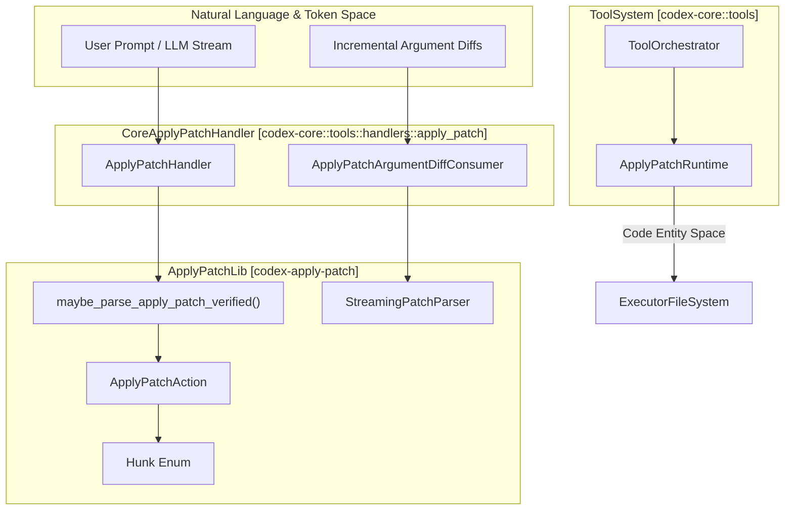
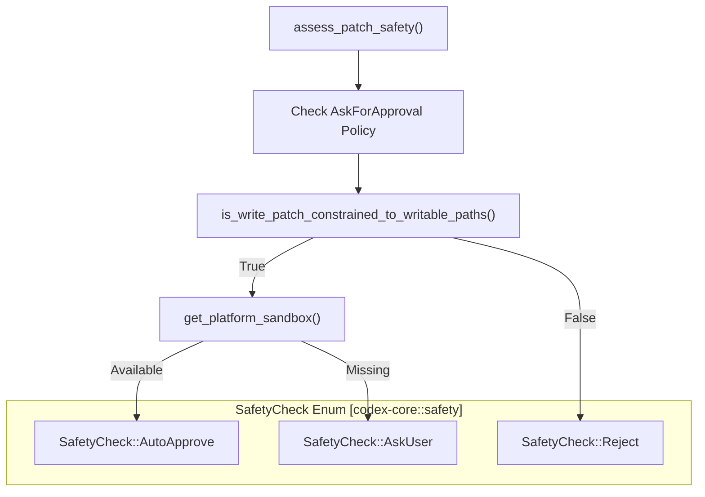
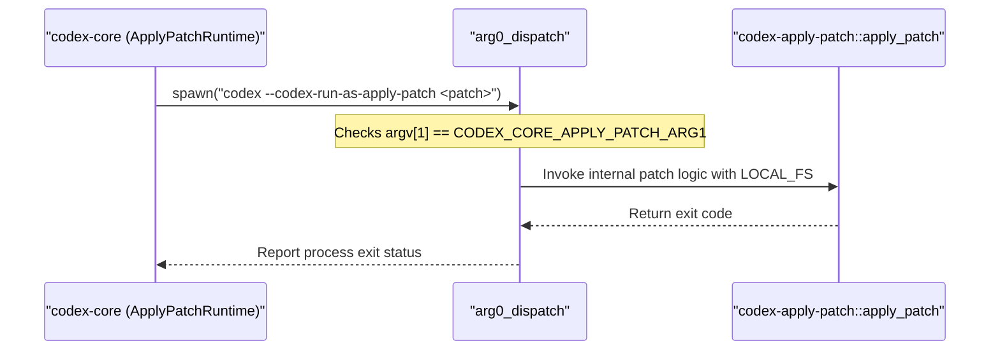

# Apply Patch System

관련 소스 파일

다음 파일들은 이 위키 페이지를 생성하기 위한 컨텍스트로 사용되었습니다:

- [codex-rs/apply-patch/src/invocation.rs](codex-rs/apply-patch/src/invocation.rs)
- [codex-rs/apply-patch/src/lib.rs](codex-rs/apply-patch/src/lib.rs)
- [codex-rs/apply-patch/src/parser.rs](codex-rs/apply-patch/src/parser.rs)
- [codex-rs/apply-patch/src/standalone_executable.rs](codex-rs/apply-patch/src/standalone_executable.rs)
- [codex-rs/apply-patch/src/streaming_parser.rs](codex-rs/apply-patch/src/streaming_parser.rs)
- [codex-rs/apply-patch/tests/fixtures/scenarios/020_whitespace_padded_patch_marker_lines/expected/file.txt](codex-rs/apply-patch/tests/fixtures/scenarios/020_whitespace_padded_patch_marker_lines/expected/file.txt)
- [codex-rs/apply-patch/tests/fixtures/scenarios/020_whitespace_padded_patch_marker_lines/input/file.txt](codex-rs/apply-patch/tests/fixtures/scenarios/020_whitespace_padded_patch_marker_lines/input/file.txt)
- [codex-rs/apply-patch/tests/fixtures/scenarios/020_whitespace_padded_patch_marker_lines/patch.txt](codex-rs/apply-patch/tests/fixtures/scenarios/020_whitespace_padded_patch_marker_lines/patch.txt)
- [codex-rs/arg0/Cargo.toml](codex-rs/arg0/Cargo.toml)
- [codex-rs/arg0/src/lib.rs](codex-rs/arg0/src/lib.rs)
- [codex-rs/core/src/apply_patch.rs](codex-rs/core/src/apply_patch.rs)
- [codex-rs/core/src/safety.rs](codex-rs/core/src/safety.rs)
- [codex-rs/core/src/tools/events.rs](codex-rs/core/src/tools/events.rs)
- [codex-rs/core/src/tools/handlers/apply_patch.rs](codex-rs/core/src/tools/handlers/apply_patch.rs)
- [codex-rs/core/src/tools/handlers/apply_patch_spec.rs](codex-rs/core/src/tools/handlers/apply_patch_spec.rs)
- [codex-rs/core/src/tools/handlers/apply_patch_spec_tests.rs](codex-rs/core/src/tools/handlers/apply_patch_spec_tests.rs)
- [codex-rs/core/src/tools/handlers/apply_patch_tests.rs](codex-rs/core/src/tools/handlers/apply_patch_tests.rs)
- [codex-rs/core/src/tools/handlers/shell.rs](codex-rs/core/src/tools/handlers/shell.rs)
- [codex-rs/core/src/tools/handlers/unified_exec.rs](codex-rs/core/src/tools/handlers/unified_exec.rs)
- [codex-rs/core/src/tools/handlers/view_image.rs](codex-rs/core/src/tools/handlers/view_image.rs)
- [codex-rs/core/src/tools/network_approval.rs](codex-rs/core/src/tools/network_approval.rs)
- [codex-rs/core/src/tools/orchestrator.rs](codex-rs/core/src/tools/orchestrator.rs)
- [codex-rs/core/src/tools/runtimes/apply_patch.rs](codex-rs/core/src/tools/runtimes/apply_patch.rs)
- [codex-rs/core/src/tools/runtimes/apply_patch_tests.rs](codex-rs/core/src/tools/runtimes/apply_patch_tests.rs)
- [codex-rs/core/src/tools/runtimes/mod.rs](codex-rs/core/src/tools/runtimes/mod.rs)
- [codex-rs/core/src/tools/runtimes/mod_tests.rs](codex-rs/core/src/tools/runtimes/mod_tests.rs)
- [codex-rs/core/src/tools/runtimes/shell.rs](codex-rs/core/src/tools/runtimes/shell.rs)
- [codex-rs/core/src/tools/runtimes/unified_exec.rs](codex-rs/core/src/tools/runtimes/unified_exec.rs)
- [codex-rs/core/src/tools/sandboxing.rs](codex-rs/core/src/tools/sandboxing.rs)
- [codex-rs/core/src/turn_diff_tracker.rs](codex-rs/core/src/turn_diff_tracker.rs)
- [codex-rs/core/src/turn_diff_tracker_tests.rs](codex-rs/core/src/turn_diff_tracker_tests.rs)
- [codex-rs/core/src/unified_exec/mod.rs](codex-rs/core/src/unified_exec/mod.rs)
- [codex-rs/core/src/unified_exec/process_manager.rs](codex-rs/core/src/unified_exec/process_manager.rs)
- [codex-rs/core/tests/suite/unified_exec.rs](codex-rs/core/tests/suite/unified_exec.rs)

## 목적과 범위

`apply_patch` 시스템은 Codex 에이전트가 AI 생성 diff에 맞춰 설계된 custom patch format을 사용하여 파일을 안전하고 정밀하게 수정할 수 있게 합니다. structured JSON(function call)과 freeform text라는 여러 호출 스타일을 지원하면서, 견고한 safety check, approval workflow, sandboxed execution을 제공합니다. 이 시스템은 workspace integrity를 해치지 않고 코드 수정을 자동화하기 위한 Codex toolset의 핵심 부분입니다.

구현은 두 가지 주요 컴포넌트로 나뉩니다:

- **`codex-apply-patch` 크레이트**: core patch parsing, validation, standalone execution logic, partial patch read를 위한 streaming incremental parsing tool을 제공합니다 [codex-rs/apply-patch/src/lib.rs:1-26]().
- **`codex-core` 통합**: tool call을 patch runtime에 연결하는 `ApplyPatchHandler`, approval policy enforcement, sandbox dispatch, self-invocation subprocess management를 포함합니다 [codex-rs/core/src/tools/handlers/apply_patch.rs:59-68]().

출처: [codex-rs/apply-patch/src/lib.rs:1-30](), [codex-rs/core/src/tools/handlers/apply_patch.rs:59-68]()

---

## Patch Format과 Parsing

Codex가 사용하는 patch format은 사람이 읽기 쉽고 LLM 친화적이도록 설계된 custom textual format입니다. Patch는 명시적인 marker로 구분되며 섬세한 file operation을 지원합니다.

### Patch Delimiters와 Markers

- Patch는 `*** Begin Patch`로 시작하고 `*** End Patch`로 끝납니다 [codex-rs/apply-patch/src/lib.rs:165-171]().
- 개별 file diff는 `*** Add File: <path>`, `*** Delete File: <path>`, `*** Update File: <path>` 같은 directive로 시작합니다 [codex-rs/apply-patch/src/lib.rs:167-168]().
- Update는 선택적 context line이 있는 unified diff format을 사용하며, file rename을 위한 `move_path`를 선택적으로 지정할 수 있습니다 [codex-rs/apply-patch/src/lib.rs:109-115]().

### Hunk Types

Patch의 기본 단위는 `codex-apply-patch`에 정의된 `Hunk`이며, 그 variant는 서로 다른 file action을 나타냅니다:

| Hunk Variant     | 설명                                  | 코드 참조                                                 |
| ---------------- | ------------------------------------ | ---------------------------------------------------------|
| `AddFile`        | 주어진 내용으로 새 파일을 추가합니다 | [codex-rs/apply-patch/src/lib.rs:103-105]()              |
| `DeleteFile`     | 기존 파일을 삭제합니다               | [codex-rs/apply-patch/src/lib.rs:106-108]()              |
| `UpdateFile`     | 파일에 unified diff를 적용합니다     | [codex-rs/apply-patch/src/lib.rs:109-115]()              |

### Verification과 Extraction

- freeform 및 shell-embedded patch를 수용하기 위해 시스템은 잠재적으로 escape되었거나 heredoc으로 감싼 command string에서 추출한 patch argument를 parsing하고 verify하려는 `maybe_parse_apply_patch_verified`를 사용합니다 [codex-rs/apply-patch/src/lib.rs:28-28]().
- 이 verification process를 통해 시스템은 주어진 argument가 유효한 `apply_patch` 호출에 해당하는지 구별하거나, malformed input을 graceful하게 거부할 수 있습니다 [codex-rs/apply-patch/src/lib.rs:118-130]().
- 추출된 patch body와 hunk는 permission 계산 또는 file system sandboxing을 위한 path 식별을 위해 완전히 parsing됩니다 [codex-rs/core/src/tools/handlers/apply_patch.rs:201-205]().

출처: [codex-rs/apply-patch/src/lib.rs:91-130](), [codex-rs/core/src/tools/handlers/apply_patch.rs:137-167](), [codex-rs/apply-patch/src/parser.rs:1-50]()

---

## 아키텍처와 데이터 흐름

### 개요

`ApplyPatchHandler`는 Codex 내에서 `apply_patch` tool call을 처리하는 중앙 진입점입니다. invocation argument parsing, incremental argument diff processing, safety check, 실제 patch 적용을 처리합니다.

Handler는 다음을 활용합니다:

- `StreamingPatchParser`: streaming token diff input에서 patch hunk를 점진적으로 parsing하고 build하며 progressive `PatchApplyUpdatedEvent`를 내보냅니다 [codex-rs/core/src/tools/handlers/apply_patch.rs:71-96]().
- `ToolOrchestrator`: approval 및 sandboxing policy를 관리하며, patch 적용 전에 필요하면 사용자에게 prompt합니다 [codex-rs/core/src/tools/orchestrator.rs:1-50]().
- `ApplyPatchRuntime`: local 및 remote environment를 모두 지원하며, 검증된 patch를 target filesystem에 대해 실행합니다 [codex-rs/core/src/tools/runtimes/apply_patch.rs:47-60]().

### 컴포넌트 상호작용 다이어그램

- `ApplyPatchArgumentDiffConsumer`는 incremental `StreamingPatchParser`와 조율하고, UI streaming을 위한 partial patch update event emission을 throttle합니다(기본 500ms interval) [codex-rs/core/src/tools/handlers/apply_patch.rs:56-120]().
- Approval과 execution은 `ToolOrchestrator` framework를 통해 진행되며, `ApplyPatchApprovalKey`를 통한 caching을 지원합니다 [codex-rs/core/src/tools/runtimes/apply_patch.rs:40-44]().

출처: [codex-rs/core/src/tools/handlers/apply_patch.rs:56-135](), [codex-rs/apply-patch/src/lib.rs:25-29](), [codex-rs/core/src/tools/runtimes/apply_patch.rs:40-60]()

---

## Approval과 Safety Workflow

### Safety Assessment

- `assess_patch_safety` 함수는 현재 `AskForApproval` policy와 사용자의 `PermissionProfile`에 대해 patch action을 평가합니다 [codex-rs/core/src/safety.rs:33-40]().
- Auto-approval은 `is_write_patch_constrained_to_writable_paths`가 판단한 허용된 writable path로 patch가 엄격히 제한되는 경우에만 가능합니다 [codex-rs/core/src/safety.rs:70-91]().
- 승인되지 않았거나 read-only sandbox path를 건드리는 patch는 `PATCH_REJECTED_OUTSIDE_PROJECT_REASON` 같은 특정 reason과 함께 rejection을 트리거합니다 [codex-rs/core/src/safety.rs:16-19]().

### Safety Logic Diagram

### Streaming Patch Updates

- patch diff가 포함된 token stream이 도착하면, `ApplyPatchArgumentDiffConsumer`는 `StreamingPatchParser`를 사용해 hunk를 점진적으로 parsing합니다 [codex-rs/core/src/tools/handlers/apply_patch.rs:99-105]().
- 이 메커니즘은 모델이 아직 content를 생성하는 동안 `PatchApplyUpdatedEvent`를 통해 partial patch progress를 보여주는 실시간 UI feedback을 가능하게 합니다 [codex-rs/core/src/tools/handlers/apply_patch.rs:88-90]().

출처: [codex-rs/core/src/safety.rs:21-116](), [codex-rs/core/src/tools/handlers/apply_patch.rs:77-135]()

---

## Self-Invocation을 통한 실행

안전하고 격리된 환경을 유지하기 위해 Codex는 patch application command를 실행하는 sandboxed subprocess를 생성하여 patch를 적용할 수 있습니다.

### Subprocess Dispatch Mechanism

1. 하위 process command line은 binary가 isolated apply_patch executor로 동작하라는 신호를 주는 특수 constant flag `--codex-run-as-apply-patch`(constant `CODEX_CORE_APPLY_PATCH_ARG1`)를 사용합니다 [codex-rs/apply-patch/src/lib.rs:41-41]().
2. `arg0_dispatch` 함수는 startup 초기에 이 flag를 인식하고 내부 `codex_apply_patch::apply_patch` logic을 실행합니다 [codex-rs/arg0/src/lib.rs:100-117]().
3. 이는 실제 I/O에 `LOCAL_FS`를 사용하면서 filesystem modification logic을 main agent process에서 격리합니다 [codex-rs/arg0/src/lib.rs:122-124]().

출처: [codex-rs/apply-patch/src/lib.rs:34-41](), [codex-rs/arg0/src/lib.rs:54-135](), [codex-rs/core/src/tools/runtimes/apply_patch.rs:1-20]()

---

## Unified Exec Interception

`UnifiedExecProcessManager`는 approval과 sandboxing이 적용된 대화형 process를 관리합니다 [codex-rs/core/src/unified_exec/mod.rs:133-136]().

- shell command가 `shell_command` 또는 `exec_command`를 통해 제출되면, 해당 command는 `apply_patch` pattern 여부를 검사받습니다 [codex-rs/core/src/tools/handlers/shell.rs:136-144]().
- `intercept_apply_patch` 함수(`codex-rs/core/src/tools/handlers/apply_patch.rs`에 정의됨)는 이러한 call을 감지하고 structured `ApplyPatchHandler` logic으로 reroute합니다 [codex-rs/core/src/tools/handlers/shell.rs:17-17]().
- 이는 모델이 raw shell command로 `apply_patch`를 실행하려 해도 patch system의 특수 safety check와 streaming UI event가 적용되도록 보장합니다 [codex-rs/core/src/tools/handlers/shell.rs:145-148]().

출처: [codex-rs/core/src/unified_exec/mod.rs:1-50](), [codex-rs/core/src/tools/handlers/shell.rs:60-151](), [codex-rs/core/src/tools/handlers/unified_exec.rs:23-49]()
