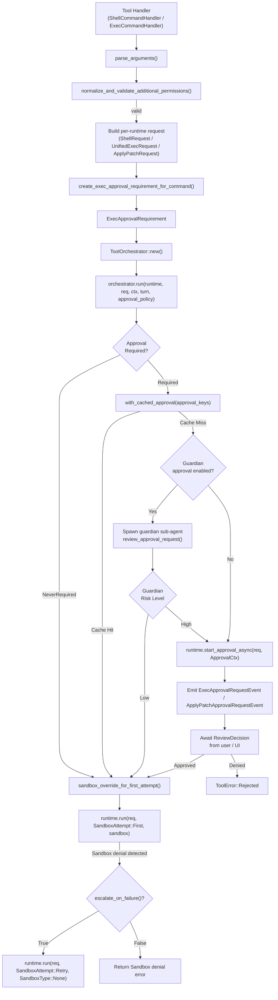
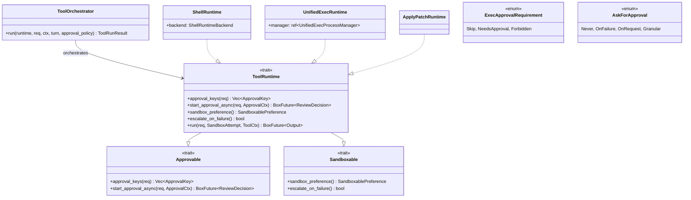
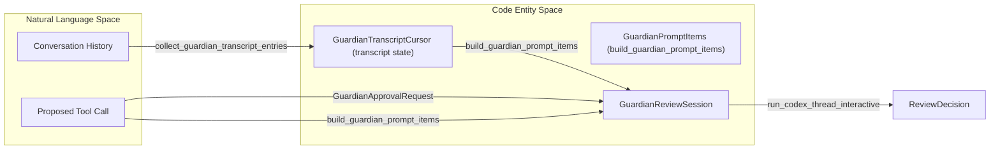

# Tool Orchestration과 Approval

<details>
<summary>관련 소스 파일</summary>

다음 파일들은 이 위키 페이지를 생성하기 위한 컨텍스트로 사용되었습니다:

- [codex-rs/core/src/exec_policy.rs](codex-rs/core/src/exec_policy.rs)
- [codex-rs/core/src/exec_policy_tests.rs](codex-rs/core/src/exec_policy_tests.rs)
- [codex-rs/core/src/exec_policy_windows_tests.rs](codex-rs/core/src/exec_policy_windows_tests.rs)
- [codex-rs/core/src/guardian/approval_request.rs](codex-rs/core/src/guardian/approval_request.rs)
- [codex-rs/core/src/guardian/mod.rs](codex-rs/core/src/guardian/mod.rs)
- [codex-rs/core/src/guardian/policy.md](codex-rs/core/src/guardian/policy.md)
- [codex-rs/core/src/guardian/policy_template.md](codex-rs/core/src/guardian/policy_template.md)
- [codex-rs/core/src/guardian/prompt.rs](codex-rs/core/src/guardian/prompt.rs)
- [codex-rs/core/src/guardian/review.rs](codex-rs/core/src/guardian/review.rs)
- [codex-rs/core/src/guardian/review_session.rs](codex-rs/core/src/guardian/review_session.rs)
- [codex-rs/core/src/guardian/snapshots/codex_core__guardian__tests__guardian_followup_review_request_layout.snap](codex-rs/core/src/guardian/snapshots/codex_core__guardian__tests__guardian_followup_review_request_layout.snap)
- [codex-rs/core/src/guardian/snapshots/codex_core__guardian__tests__guardian_review_request_layout.snap](codex-rs/core/src/guardian/snapshots/codex_core__guardian__tests__guardian_review_request_layout.snap)
- [codex-rs/core/src/guardian/snapshots/codex_core__guardian__tests__network_access_guardian_prompt_layout.snap](codex-rs/core/src/guardian/snapshots/codex_core__guardian__tests__network_access_guardian_prompt_layout.snap)
- [codex-rs/core/src/guardian/tests.rs](codex-rs/core/src/guardian/tests.rs)
- [codex-rs/core/src/tools/events.rs](codex-rs/core/src/tools/events.rs)
- [codex-rs/core/src/tools/handlers/apply_patch.rs](codex-rs/core/src/tools/handlers/apply_patch.rs)
- [codex-rs/core/src/tools/handlers/shell.rs](codex-rs/core/src/tools/handlers/shell.rs)
- [codex-rs/core/src/tools/handlers/unified_exec.rs](codex-rs/core/src/tools/handlers/unified_exec.rs)
- [codex-rs/core/src/tools/handlers/view_image.rs](codex-rs/core/src/tools/handlers/view_image.rs)
- [codex-rs/core/src/tools/network_approval.rs](codex-rs/core/src/tools/network_approval.rs)
- [codex-rs/core/src/tools/orchestrator.rs](codex-rs/core/src/tools/orchestrator.rs)
- [codex-rs/core/src/tools/runtimes/apply_patch.rs](codex-rs/core/src/tools/runtimes/apply_patch.rs)
- [codex-rs/core/src/tools/runtimes/mod.rs](codex-rs/core/src/tools/runtimes/mod.rs)
- [codex-rs/core/src/tools/runtimes/mod_tests.rs](codex-rs/core/src/tools/runtimes/mod_tests.rs)
- [codex-rs/core/src/tools/runtimes/shell.rs](codex-rs/core/src/tools/runtimes/shell.rs)
- [codex-rs/core/src/tools/runtimes/shell/unix_escalation.rs](codex-rs/core/src/tools/runtimes/shell/unix_escalation.rs)
- [codex-rs/core/src/tools/runtimes/shell/unix_escalation_tests.rs](codex-rs/core/src/tools/runtimes/shell/unix_escalation_tests.rs)
- [codex-rs/core/src/tools/runtimes/unified_exec.rs](codex-rs/core/src/tools/runtimes/unified_exec.rs)
- [codex-rs/core/src/tools/sandboxing.rs](codex-rs/core/src/tools/sandboxing.rs)
- [codex-rs/core/src/turn_diff_tracker.rs](codex-rs/core/src/turn_diff_tracker.rs)
- [codex-rs/core/src/turn_diff_tracker_tests.rs](codex-rs/core/src/turn_diff_tracker_tests.rs)
- [codex-rs/core/src/unified_exec/mod.rs](codex-rs/core/src/unified_exec/mod.rs)
- [codex-rs/core/src/unified_exec/process_manager.rs](codex-rs/core/src/unified_exec/process_manager.rs)
- [codex-rs/core/tests/common/zsh_fork.rs](codex-rs/core/tests/common/zsh_fork.rs)
- [codex-rs/core/tests/suite/approvals.rs](codex-rs/core/tests/suite/approvals.rs)
- [codex-rs/core/tests/suite/exec_policy.rs](codex-rs/core/tests/suite/exec_policy.rs)
- [codex-rs/core/tests/suite/skill_approval.rs](codex-rs/core/tests/suite/skill_approval.rs)
- [codex-rs/core/tests/suite/unified_exec.rs](codex-rs/core/tests/suite/unified_exec.rs)
- [codex-rs/core/tests/suite/unified_exec_zsh_fork_approvals.rs](codex-rs/core/tests/suite/unified_exec_zsh_fork_approvals.rs)

</details>


## 목적과 범위

이 페이지는 모든 실행 가능한 tool runtime에 대해 **approval prompting**, **additional permissions handling**, **sandbox type selection**, **retry-on-denial** 의미론을 중앙화하는 `ToolOrchestrator` [codex-rs/core/src/tools/orchestrator.rs]()와 주변 인프라를 문서화합니다. 공유 trait(`Approvable`, `Sandboxable`, `ToolRuntime`), `ExecApprovalRequirement` [codex-rs/core/src/tools/sandboxing.rs:37-37]() 계산, permission validation, guardian sub-agent approval, 그리고 이러한 요소가 구체적인 runtime인 `ShellRuntime` [codex-rs/core/src/tools/runtimes/shell.rs:23-24](), `UnifiedExecRuntime` [codex-rs/core/src/tools/runtimes/unified_exec.rs:96-99](), `ApplyPatchRuntime` [codex-rs/core/src/tools/runtimes/apply_patch.rs:35-36]() 전반에서 조율되는 방식을 다룹니다.

다루는 주요 approval flow:
- **Sandbox escalation approval**: `RequireEscalated` sandbox permission이 필요한 명령 [codex-rs/core/src/tools/handlers/shell.rs:121-124]().
- **Additional permissions approval**: `AdditionalPermissionProfile`을 통해 세분화된 filesystem/network permission을 요청하는 명령 [codex-rs/core/src/tools/handlers/shell.rs:86-94]().
- **Guardian auto-approval**: AI 기반 low-risk command pre-approval [codex-rs/core/src/guardian/review_session.rs:61-62]().
- **Exec Policy Rules**: `Policy`를 통한 `.rules` 파일 강제 [codex-rs/core/src/exec_policy.rs:17-18]().

출처: [codex-rs/core/src/tools/orchestrator.rs](), [codex-rs/core/src/tools/sandboxing.rs:37-37](), [codex-rs/core/src/tools/runtimes/shell.rs:23-24](), [codex-rs/core/src/tools/runtimes/unified_exec.rs:96-99](), [codex-rs/core/src/tools/runtimes/apply_patch.rs:35-36]().

---

## 아키텍처 개요

실행 가능한 모든 tool call은 `ToolOrchestrator`가 관리하는 공통 approval 및 sandbox management pipeline을 통해 오케스트레이션됩니다. 이 orchestrator는 다음을 수행합니다:

1. Exec Policy 계산을 사용해 tool invocation에 approval이 필요한지 결정합니다 [codex-rs/core/src/tools/handlers/shell.rs:163-178]().
2. 사용 가능한 경우 cached approval을 재사용하여 user prompt를 건너뜁니다 [codex-rs/core/src/tools/sandboxing.rs:39-39]().
3. low-risk AI 기반 auto-approval을 위해 활성화된 경우 Guardian sub-agent를 호출합니다 [codex-rs/core/src/guardian/review_session.rs:163-178]().
4. 필요한 경우 interactive user approval로 fallback합니다 [codex-rs/core/src/tools/handlers/shell.rs:163-178]().
5. 실행에 적절한 sandbox environment를 선택합니다 [codex-rs/core/src/tools/sandboxing.rs:33-33]().
6. policy에 따라 sandbox denial 시 완화된 sandboxing으로 실행을 retry합니다 [codex-rs/core/src/unified_exec/mod.rs:7-10]().

**Orchestration Pipeline:**



출처: [codex-rs/core/src/tools/handlers/shell.rs:60-116](), [codex-rs/core/src/tools/handlers/shell.rs:163-178](), [codex-rs/core/src/unified_exec/mod.rs:12-23](), [codex-rs/core/src/tools/orchestrator.rs](), [codex-rs/core/src/tools/runtimes/unified_exec.rs:163-178]().

---

## 주요 타입과 코드 엔터티

이 시스템은 자연어 의도를 코드 action까지 오케스트레이션하기 위해 여러 trait와 struct를 사용합니다:



| Type | File | 역할 |
| :--- | :--- | :--- |
| `ToolOrchestrator` | [codex-rs/core/src/tools/orchestrator.rs]() | approval → sandbox → run → retry 수명주기를 조율하는 중앙 orchestrator입니다. |
| `ExecApprovalRequirement` | [codex-rs/core/src/tools/sandboxing.rs:37-37]() | exec policy와 permission에서 계산된 approval requirement를 나타내는 enum입니다. |
| `ToolRuntime` | [codex-rs/core/src/tools/sandboxing.rs:36-36]() | runtime 구현을 위한 approval 및 sandbox interface를 결합하는 trait입니다. |
| `ShellRuntime` | [codex-rs/core/src/tools/runtimes/shell.rs:23-23]() | shell command 실행을 위한 구체 runtime입니다. |
| `UnifiedExecRuntime` | [codex-rs/core/src/tools/runtimes/unified_exec.rs:96-96]() | PTY 기반 unified exec command 실행을 위한 구체 runtime입니다. |
| `ApplyPatchRuntime` | [codex-rs/core/src/tools/runtimes/apply_patch.rs:36-36]() | 검증된 code patch를 적용하기 위한 구체 runtime입니다. |
| `UnifiedExecProcessManager` | [codex-rs/core/src/unified_exec/mod.rs:133-136]() | Unified Exec mode에서 대화형 process의 수명주기를 관리합니다. |

출처: [codex-rs/core/src/tools/sandboxing.rs:36-37](), [codex-rs/core/src/unified_exec/mod.rs:133-136](), [codex-rs/core/src/tools/runtimes/shell.rs:23-24](), [codex-rs/core/src/tools/runtimes/unified_exec.rs:96-96]().

---

## ExecApprovalRequirement 계산

명령의 실행 approval requirement는 runtime invocation 전에 policy, 요청된 permission, sandboxing context를 기준으로 계산됩니다. `ExecPolicyManager`는 approval decision과 관련된 세부사항을 캡처하기 위해 `UnmatchedCommandContext` struct를 사용합니다 [codex-rs/core/src/exec_policy.rs:121-128]().

```rust
pub(crate) struct UnmatchedCommandContext<'a> {
    pub(crate) approval_policy: AskForApproval,
    pub(crate) permission_profile: &'a PermissionProfile,
    pub(crate) windows_sandbox_level: WindowsSandboxLevel,
    pub(crate) sandbox_permissions: SandboxPermissions,
    pub(crate) used_complex_parsing: bool,
    pub(crate) command_origin: ExecPolicyCommandOrigin,
}
```

이 context는 execution에 approval이 필요한지, 건너뛸지, 또는 금지할지를 결정하며, 이는 `ExecApprovalRequirement` [codex-rs/core/src/tools/sandboxing.rs:37-37]()의 variant로 캡처됩니다.

고려되는 주요 측면:
- approval policy(`AskForApproval`)가 prompting을 요구하는지 여부 [codex-rs/core/src/exec_policy.rs:174-197]().
- 명령이 prefix 또는 blacklist rule과 일치하는지 여부 [codex-rs/core/src/exec_policy.rs:52-99]().
- 요청된 sandbox permission과의 교차점, 특히 escalation [codex-rs/core/src/tools/handlers/shell.rs:121-134]().

출처: [codex-rs/core/src/exec_policy.rs:121-128](), [codex-rs/core/src/tools/sandboxing.rs:37-37](), [codex-rs/core/src/tools/handlers/shell.rs:163-178](), [codex-rs/core/src/exec_policy.rs:174-197]().

---

## AskForApproval과 Granular Policies

`AskForApproval` [codex-rs/core/src/exec_policy.rs:122-122]()은 tool run에 approval prompt를 언제 내보낼 수 있는지 제어합니다.

| Variant | 동작 |
| :--- | :--- |
| `Never` | approval prompt를 절대 내보내지 않습니다. 명령은 직접 실행되거나 충돌 시 오류가 납니다 [codex-rs/core/src/exec_policy.rs:179-179](). |
| `OnFailure` | sandbox failure 또는 denial이 발생한 뒤에만 prompt합니다 [codex-rs/core/src/exec_policy.rs:180-180](). |
| `OnRequest` | 모델이 elevated permission을 명시적으로 요청할 때 prompt합니다 [codex-rs/core/src/exec_policy.rs:181-181](). |
| `Granular` | rule과 sandbox escalation prompt를 독립적으로 세밀하게 제어합니다 [codex-rs/core/src/exec_policy.rs:183-195](). |

prompt가 필요한 상황에서 `AskForApproval::Never`를 사용하면 tool invocation은 `PROMPT_CONFLICT_REASON` 오류와 함께 거부됩니다 [codex-rs/core/src/exec_policy.rs:43-44]().

출처: [codex-rs/core/src/exec_policy.rs:178-197](), [codex-rs/core/src/exec_policy.rs:43-44]().

---

## SandboxPermissions와 Additional Permissions

Tool runtime은 `SandboxPermissions` [codex-rs/core/src/unified_exec/mod.rs:40-40]()와 `AdditionalPermissionProfile` [codex-rs/core/src/unified_exec/mod.rs:32-32]()을 통해 sandboxing 및 permission escalation을 처리합니다.

- `RequireEscalated` permission은 sandbox 외부(full system access) 실행을 강제합니다 [codex-rs/core/src/tools/handlers/shell.rs:121-124]().
- `WithAdditionalPermissions`는 세분화된 filesystem path 또는 network에 대한 접근을 요청합니다 [codex-rs/core/src/tools/handlers/shell.rs:171-175]().
- Permission request는 자동으로(feature flag/Guardian) 또는 interactive하게 승인되어야 합니다.

`apply_granted_turn_permissions` 함수 [codex-rs/core/src/tools/handlers/shell.rs:87-94]()는 runtime execution attempt 전에 additional permission profile을 정리하고 검증하여, 요청된 permission이 현재 turn의 approval policy 및 feature flag 아래에서 유효한지 보장합니다.

출처: [codex-rs/core/src/tools/handlers/shell.rs:87-116](), [codex-rs/core/src/unified_exec/mod.rs:32-40]().

---

## Guardian Approval Sub-Agent

Guardian 시스템은 AI 기반 sub-agent로, low-risk tool execution을 자동 승인하여 사용자 부담을 줄일 수 있습니다.

### 데이터 흐름과 상호작용



Guardian은 먼저 context delta prompt를 위해 `GuardianTranscriptCursor`를 통해 관련 대화 history를 수집합니다 [codex-rs/core/src/guardian/review_session.rs:54-54](). 그런 다음 제안된 tool call을 `GuardianApprovalRequest`로 감싸 받습니다 [codex-rs/core/src/guardian/review_session.rs:52-52](). `GuardianPromptItems` builder를 사용해 시스템은 AI prompt를 합성하고, review 전용 독립 Codex thread를 `run_codex_thread_interactive`로 실행합니다 [codex-rs/core/src/guardian/review_session.rs:35-35]().

완료 시 Guardian은 approval, rejection 또는 conditional action을 나타내는 `ReviewDecision`을 반환합니다 [codex-rs/core/src/guardian/review_session.rs:61-62]().

### Risk Assessment 세부사항

- **Transcript Delta:** 가능하면 시스템은 `GuardianPromptMode::Delta`를 통해 마지막 review 이후의 새 history만 전송하여 prompt size를 줄입니다 [codex-rs/core/src/guardian/review_session.rs:112-114]().
- **GuardianRejectionCircuitBreaker:** Guardian denial이 연속 3회 또는 최근 총 10회 발생하면 turn을 interrupt하여 infinite loop 또는 flooding을 방지합니다 [codex-rs/core/src/guardian/tests.rs:84-149]().
- **Outcome:** `GuardianReviewSessionOutcome` enum으로 표현됩니다. result가 있는 completion, prompt build failure, session failure, timeout 또는 abortion을 포함합니다 [codex-rs/core/src/guardian/review_session.rs:61-70]().

출처: [codex-rs/core/src/guardian/review_session.rs:35-131](), [codex-rs/core/src/guardian/tests.rs:84-149]().

---

# 요약

Codex의 tool orchestration 및 approval 하위 시스템은 execution policy evaluation, sandboxing, approval prompting, Guardian sub-agent를 통한 보조 AI 기반 review에 걸친 복잡한 상호작용을 중앙화합니다. 이를 통해 sandbox denial 시 retry할 수 있는 유연성을 유지하면서도 일관되고, policy-driven이며, 사용자에게 투명한 tool execution이 가능해집니다.

이 페이지는 다음을 자세히 설명하여 user intent를 codebase의 tool execution과 연결합니다:

- approval lifecycle을 관리하는 `ToolOrchestrator`의 역할.
- config, policy, 요청된 permission에서 `ExecApprovalRequirement`가 계산되는 방식.
- `AskForApproval` 같은 approval policy와 sandbox escalation의 통합.
- 도구가 요청한 permission의 validation 및 normalization.
- state management와 circuit breaker logic을 포함한 low-risk auto-approval용 AI 기반 Guardian sub-agent.

출처:
[codex-rs/core/src/tools/orchestrator.rs]()
[codex-rs/core/src/tools/handlers/shell.rs:163-178]()
[codex-rs/core/src/tools/sandboxing.rs:36-37]()
[codex-rs/core/src/exec_policy.rs:121-128]()
[codex-rs/core/src/guardian/review_session.rs:61-70]()
[codex-rs/core/src/guardian/tests.rs:84-149]()
