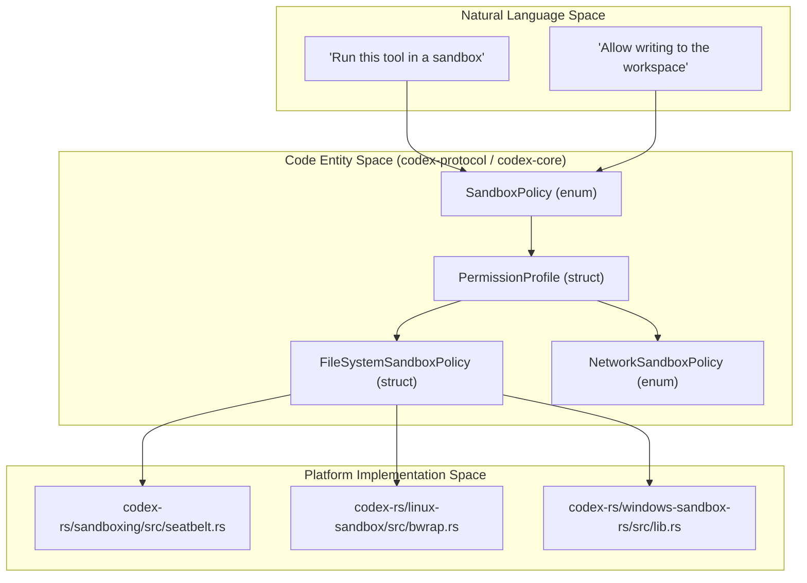
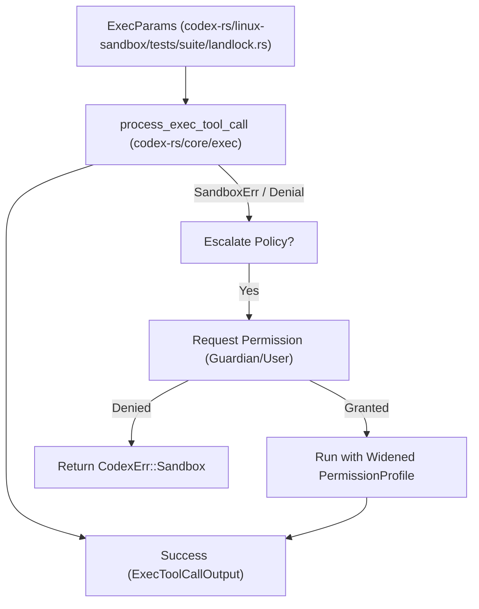

# Sandboxing 구현

관련 소스 파일

다음 파일들은 이 위키 페이지를 생성하기 위한 컨텍스트로 사용되었습니다:

- [codex-rs/chatgpt/Cargo.toml](codex-rs/chatgpt/Cargo.toml)
- [codex-rs/cli/src/sandbox_setup.rs](codex-rs/cli/src/sandbox_setup.rs)
- [codex-rs/core/README.md](codex-rs/core/README.md)
- [codex-rs/core/src/landlock.rs](codex-rs/core/src/landlock.rs)
- [codex-rs/core/src/safety_tests.rs](codex-rs/core/src/safety_tests.rs)
- [codex-rs/core/src/windows_sandbox.rs](codex-rs/core/src/windows_sandbox.rs)
- [codex-rs/core/tests/suite/exec.rs](codex-rs/core/tests/suite/exec.rs)
- [codex-rs/core/tests/suite/windows_sandbox.rs](codex-rs/core/tests/suite/windows_sandbox.rs)
- [codex-rs/exec/tests/suite/sandbox.rs](codex-rs/exec/tests/suite/sandbox.rs)
- [codex-rs/linux-sandbox/Cargo.toml](codex-rs/linux-sandbox/Cargo.toml)
- [codex-rs/linux-sandbox/README.md](codex-rs/linux-sandbox/README.md)
- [codex-rs/linux-sandbox/src/bwrap.rs](codex-rs/linux-sandbox/src/bwrap.rs)
- [codex-rs/linux-sandbox/src/landlock.rs](codex-rs/linux-sandbox/src/landlock.rs)
- [codex-rs/linux-sandbox/src/launcher.rs](codex-rs/linux-sandbox/src/launcher.rs)
- [codex-rs/linux-sandbox/src/lib.rs](codex-rs/linux-sandbox/src/lib.rs)
- [codex-rs/linux-sandbox/src/linux_run_main.rs](codex-rs/linux-sandbox/src/linux_run_main.rs)
- [codex-rs/linux-sandbox/src/linux_run_main_tests.rs](codex-rs/linux-sandbox/src/linux_run_main_tests.rs)
- [codex-rs/linux-sandbox/tests/suite/landlock.rs](codex-rs/linux-sandbox/tests/suite/landlock.rs)
- [codex-rs/linux-sandbox/tests/suite/managed_proxy.rs](codex-rs/linux-sandbox/tests/suite/managed_proxy.rs)
- [codex-rs/sandboxing/BUILD.bazel](codex-rs/sandboxing/BUILD.bazel)
- [codex-rs/sandboxing/Cargo.toml](codex-rs/sandboxing/Cargo.toml)
- [codex-rs/sandboxing/src/bwrap.rs](codex-rs/sandboxing/src/bwrap.rs)
- [codex-rs/sandboxing/src/bwrap_tests.rs](codex-rs/sandboxing/src/bwrap_tests.rs)
- [codex-rs/sandboxing/src/lib.rs](codex-rs/sandboxing/src/lib.rs)
- [codex-rs/sandboxing/src/seatbelt.rs](codex-rs/sandboxing/src/seatbelt.rs)
- [codex-rs/sandboxing/src/seatbelt_base_policy.sbpl](codex-rs/sandboxing/src/seatbelt_base_policy.sbpl)
- [codex-rs/sandboxing/src/seatbelt_network_policy.sbpl](codex-rs/sandboxing/src/seatbelt_network_policy.sbpl)
- [codex-rs/sandboxing/src/seatbelt_tests.rs](codex-rs/sandboxing/src/seatbelt_tests.rs)
- [codex-rs/windows-sandbox-rs/src/allow.rs](codex-rs/windows-sandbox-rs/src/allow.rs)
- [codex-rs/windows-sandbox-rs/src/audit.rs](codex-rs/windows-sandbox-rs/src/audit.rs)
- [codex-rs/windows-sandbox-rs/src/bin/command_runner/win.rs](codex-rs/windows-sandbox-rs/src/bin/command_runner/win.rs)
- [codex-rs/windows-sandbox-rs/src/bin/setup_main/win.rs](codex-rs/windows-sandbox-rs/src/bin/setup_main/win.rs)
- [codex-rs/windows-sandbox-rs/src/bin/setup_main/win/firewall.rs](codex-rs/windows-sandbox-rs/src/bin/setup_main/win/firewall.rs)
- [codex-rs/windows-sandbox-rs/src/bin/setup_main/win/sandbox_users.rs](codex-rs/windows-sandbox-rs/src/bin/setup_main/win/sandbox_users.rs)
- [codex-rs/windows-sandbox-rs/src/bin/setup_main/win/setup_runtime_bin.rs](codex-rs/windows-sandbox-rs/src/bin/setup_main/win/setup_runtime_bin.rs)
- [codex-rs/windows-sandbox-rs/src/elevated/runner_client.rs](codex-rs/windows-sandbox-rs/src/elevated/runner_client.rs)
- [codex-rs/windows-sandbox-rs/src/elevated/runner_pipe.rs](codex-rs/windows-sandbox-rs/src/elevated/runner_pipe.rs)
- [codex-rs/windows-sandbox-rs/src/elevated_impl.rs](codex-rs/windows-sandbox-rs/src/elevated_impl.rs)
- [codex-rs/windows-sandbox-rs/src/identity.rs](codex-rs/windows-sandbox-rs/src/identity.rs)
- [codex-rs/windows-sandbox-rs/src/lib.rs](codex-rs/windows-sandbox-rs/src/lib.rs)
- [codex-rs/windows-sandbox-rs/src/resolved_permissions.rs](codex-rs/windows-sandbox-rs/src/resolved_permissions.rs)
- [codex-rs/windows-sandbox-rs/src/setup.rs](codex-rs/windows-sandbox-rs/src/setup.rs)
- [codex-rs/windows-sandbox-rs/src/setup_error.rs](codex-rs/windows-sandbox-rs/src/setup_error.rs)
- [codex-rs/windows-sandbox-rs/src/spawn_prep.rs](codex-rs/windows-sandbox-rs/src/spawn_prep.rs)
- [codex-rs/windows-sandbox-rs/src/unified_exec/backends/elevated.rs](codex-rs/windows-sandbox-rs/src/unified_exec/backends/elevated.rs)
- [codex-rs/windows-sandbox-rs/src/unified_exec/backends/legacy.rs](codex-rs/windows-sandbox-rs/src/unified_exec/backends/legacy.rs)
- [codex-rs/windows-sandbox-rs/src/unified_exec/backends/windows_common.rs](codex-rs/windows-sandbox-rs/src/unified_exec/backends/windows_common.rs)
- [codex-rs/windows-sandbox-rs/src/unified_exec/mod.rs](codex-rs/windows-sandbox-rs/src/unified_exec/mod.rs)
- [codex-rs/windows-sandbox-rs/src/unified_exec/tests.rs](codex-rs/windows-sandbox-rs/src/unified_exec/tests.rs)
- [scripts/test-remote-env.sh](scripts/test-remote-env.sh)

이 페이지는 도구 실행을 위한 플랫폼별 process isolation을 제공하는 Codex sandboxing system의 구현을 문서화합니다. 이 시스템은 고수준 `SandboxPolicy` 요구사항을 OS native primitive로 변환합니다: macOS의 **Seatbelt**, Linux의 **Bubblewrap/Landlock**, Windows의 **Restricted Tokens/ACLs**입니다.

---

## 개요

sandboxing 아키텍처는 policy definition, 플랫폼별 driver, setup orchestration layer로 나뉩니다. 시스템은 요청된 policy와 host 운영체제를 기준으로 적절한 sandbox type을 선택합니다.

Title: Sandbox Policy to Code Entity Mapping

출처: [codex-rs/linux-sandbox/src/bwrap.rs:27-33](), [codex-rs/linux-sandbox/src/linux_run_main.rs:96-101](), [codex-rs/windows-sandbox-rs/src/lib.rs:232-232]()

---

## macOS: Seatbelt(sandbox-exec)

macOS에서 Codex는 시스템의 `sandbox-exec` 유틸리티를 사용합니다. 구현은 요청된 permission을 기준으로 Sandbox Profile Language(SBPL) 스크립트를 동적으로 생성합니다.

### 구현 세부사항
핵심 로직은 `codex-sandboxing`이 관리하며, 다음을 수행합니다:
1.  `create_seatbelt_command_args`를 통해 `PermissionProfile` 기준으로 SBPL argument를 구성합니다. [codex-rs/sandboxing/src/seatbelt_tests.rs:7-8]()
2.  `WorkspaceWrite` 모드에서도 `.git`, `.agents`, `.codex` 디렉터리가 read-only로 유지되도록 보장합니다. [codex-rs/core/README.md:13-15]()
3.  `/usr/bin/sandbox-exec`에 위치한 `sandbox-exec` binary를 spawn하여 명령을 실행합니다. [codex-rs/core/README.md:11-11]()

### Network와 Filesystem Policies
Seatbelt profile은 resolved policy를 소비하고 이를 강제하며, `dynamic_network_policy`를 통한 network access 제어를 포함합니다. [codex-rs/sandboxing/src/seatbelt_tests.rs:9-9]() `FileSystemSandboxEntry`를 SBPL `allow` 또는 `deny` rule에 mapping하여 `FileSystemSandboxPolicy`를 처리합니다. [codex-rs/sandboxing/src/seatbelt_tests.rs:22-26]()

출처: [codex-rs/core/README.md:9-22](), [codex-rs/sandboxing/src/seatbelt_tests.rs:1-30](), [codex-rs/sandboxing/src/seatbelt_tests.rs:187-200]()

---

## Linux: Bubblewrap과 Landlock

Linux 구현은 주로 **Bubblewrap**(`bwrap`)을 사용해 제한된 filesystem view를 구성하고, **Landlock**을 보조 restriction 또는 legacy fallback으로 사용합니다.

### Bubblewrap(기본 Pipeline)
Bubblewrap은 선호되는 filesystem sandbox입니다. 기본 read-only 환경을 강제하고 `--bind`를 사용해 writable root를 layer로 쌓습니다. [codex-rs/linux-sandbox/src/bwrap.rs:3-7](), [codex-rs/core/README.md:28-32]()

Bubblewrap 구현의 주요 기능:
- **Namespace Isolation**: `--unshare-user`, `--unshare-pid`, `--unshare-net`을 통해 user, PID, network namespace를 명시적으로 격리합니다. [codex-rs/linux-sandbox/README.md:84-87]()
- **Sensitive Path Protection**: writable root 내부에서도 `.git`, `.agents`, `.codex` 같은 민감한 하위 path에 read-only mount를 다시 적용합니다. [codex-rs/linux-sandbox/src/bwrap.rs:6-7]()
- **Network Modes**: `BwrapNetworkMode`를 통해 `Isolated`, `ProxyOnly`, `FullAccess` 모드를 지원합니다. [codex-rs/linux-sandbox/src/bwrap.rs:87-98]()
- **Glob Masking**: 읽을 수 없는 glob entry는 launch 전에 `ripgrep` 또는 내부 globset walker를 사용해 확장되고, matching file은 bubblewrap에서 mask됩니다. [codex-rs/linux-sandbox/README.md:62-69]()

### Landlock과 Seccomp
helper는 process 내부에서 `PR_SET_NO_NEW_PRIVS`와 seccomp network filter를 적용합니다. [codex-rs/linux-sandbox/README.md:49-50]()
- **Landlock**: legacy fallback 또는 추가 layer로 사용됩니다. `install_filesystem_landlock_rules_on_current_thread`에 정의된 ruleset을 사용해 access를 제한합니다. [codex-rs/linux-sandbox/src/landlock.rs:137-143]()
- **Seccomp**: filesystem view가 설정된 뒤 `connect`, `bind`, `ptrace` 같은 syscall을 제한합니다. [codex-rs/linux-sandbox/src/landlock.rs:169-185]()

출처: [codex-rs/linux-sandbox/src/bwrap.rs:1-11](), [codex-rs/linux-sandbox/src/linux_run_main.rs:147-196](), [codex-rs/linux-sandbox/README.md:49-94](), [codex-rs/linux-sandbox/src/landlock.rs:42-88]()

---

## Windows: Restricted Tokens와 ACLs

Windows sandboxing은 process를 격리하기 위해 Access Control Lists(ACLs)와 특수 restricted token을 관리합니다.

### Audit와 ACL Management
sandbox된 process를 spawn하기 전에 Codex는 보안을 보장하기 위한 preflight audit을 수행합니다:
1.  **Audit Preflight**: sandbox restriction을 우회할 수 있는 world-writable directory(예: `TEMP`, `PATH`, `USERPROFILE`) scan을 `audit_everyone_writable`이 수행합니다. [codex-rs/windows-sandbox-rs/src/audit.rs:95-104]()
2.  **ACL Management**: `add_deny_read_ace`, `add_deny_write_ace` 같은 함수가 sandbox identity에 대한 directory permission을 조작하는 데 사용됩니다. [codex-rs/windows-sandbox-rs/src/lib.rs:120-123]()

### Restricted Token을 통한 실행
명령은 restricted token과 함께 `create_process_as_user`를 사용해 launch될 수 있습니다. [codex-rs/windows-sandbox-rs/src/lib.rs:226-226]() 시스템은 restricted token을 통해 legacy `ReadOnly` 및 `WorkspaceWrite` 동작을 지원합니다. [codex-rs/core/README.md:67-72]()

### Elevated Sandbox Capture
high-integrity execution의 경우, `run_windows_sandbox_capture_for_permission_profile`이 framed IPC pipe로 통신하는 elevated runner를 오케스트레이션합니다. [codex-rs/windows-sandbox-rs/src/elevated_impl.rs:97-99]() 이는 policy와 command detail을 runner에 전달하기 위해 `SpawnRequest`를 사용합니다. [codex-rs/windows-sandbox-rs/src/elevated_impl.rs:181-183]()

출처: [codex-rs/windows-sandbox-rs/src/lib.rs:120-226](), [codex-rs/windows-sandbox-rs/src/audit.rs:95-104](), [codex-rs/windows-sandbox-rs/src/elevated_impl.rs:7-183](), [codex-rs/core/README.md:58-72]()

---

## Sandbox Denial Detection과 Retry Logic

Codex는 tool이 sandbox restriction 때문에 실패했는지 구체적으로 감지하는 로직을 구현하여, 자동 또는 user-prompted retry를 가능하게 합니다.

### Detection Patterns
시스템은 특정 exit code와 error signal을 찾습니다:
- **SandboxErr**: execution 중 `LandlockRestrict` 또는 일반 sandbox failure 같은 error를 캡처합니다. [codex-rs/linux-sandbox/tests/suite/landlock.rs:12-12]()
- **Bwrap Failures**: "bubblewrap is unavailable" 또는 "Can't mount proc on /newroot/proc" 같은 특정 stderr pattern은 environment 관련 sandbox issue를 식별하기 위해 `is_bwrap_unavailable_output`이 감지합니다. [codex-rs/linux-sandbox/tests/suite/landlock.rs:201-210]()

Title: Sandbox Execution and Escalation Flow

출처: [codex-rs/linux-sandbox/tests/suite/landlock.rs:174-186](), [codex-rs/linux-sandbox/tests/suite/landlock.rs:189-198]()

### Retry Logic 구현
`process_exec_tool_call` 함수는 sandboxed process의 실제 spawning을 오케스트레이션하며, `PermissionProfile`과 `ExecParams`를 플랫폼별 helper(예: `spawn_command_under_linux_sandbox`)에 전달합니다. [codex-rs/linux-sandbox/tests/suite/landlock.rs:189-198](), [codex-rs/core/src/landlock.rs:22-32]() 실패가 발생하면, 더 높은 수준의 tool orchestrator가 failure가 sandbox denial(예: `Operation not permitted`)인지 평가하고 `Permission Request System`을 통해 permission escalation을 prompt할 수 있습니다. [codex-rs/linux-sandbox/tests/suite/landlock.rs:201-210]()

출처: [codex-rs/linux-sandbox/tests/suite/landlock.rs:166-210](), [codex-rs/core/src/landlock.rs:22-70](), [codex-rs/linux-sandbox/src/linux_run_main.rs:147-160]()
