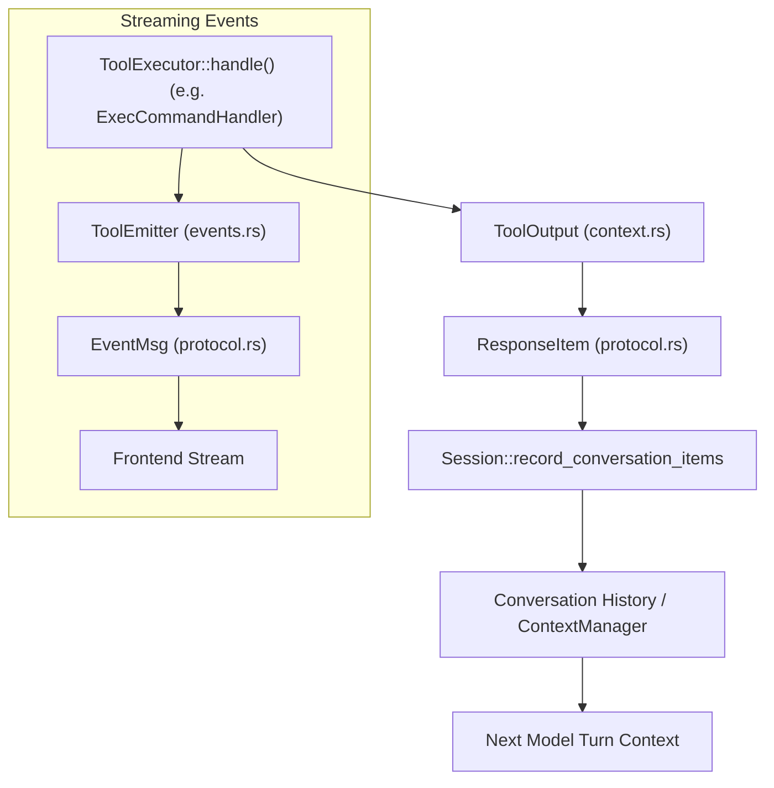
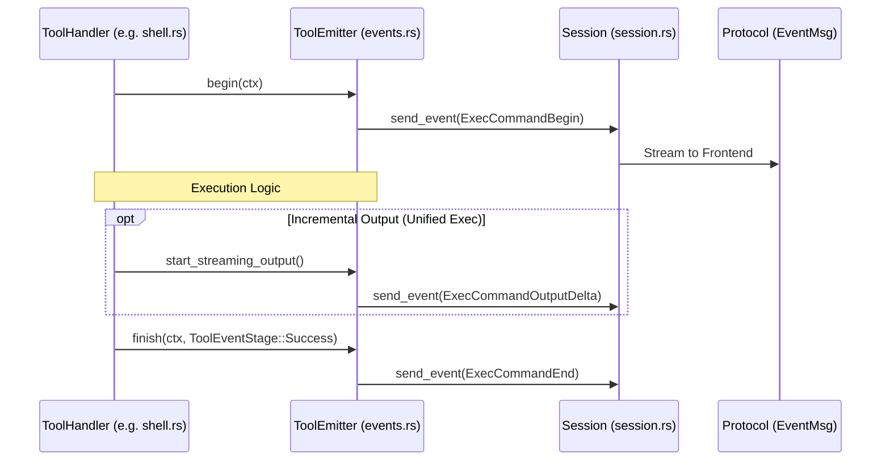
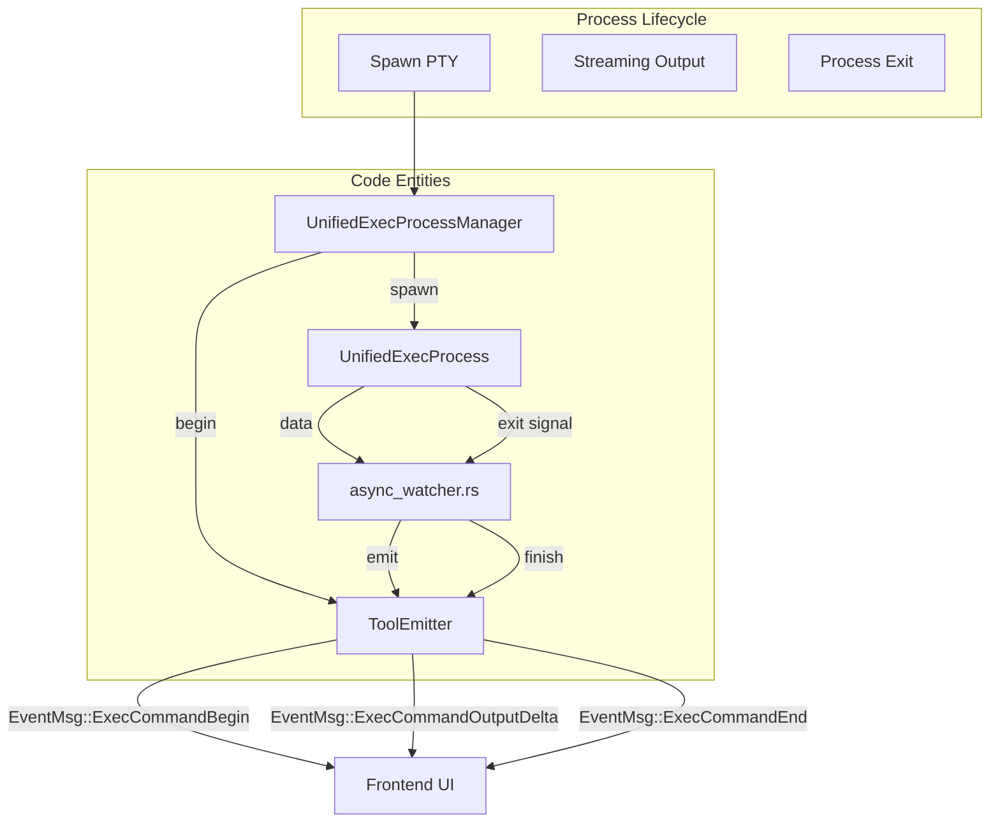

# Tool Event Emission과 Output

<details>
<summary>관련 소스 파일</summary>

다음 파일들은 이 위키 페이지를 생성하기 위한 컨텍스트로 사용되었습니다:

- [codex-rs/app-server/tests/suite/v2/imagegen_extension.rs](codex-rs/app-server/tests/suite/v2/imagegen_extension.rs)
- [codex-rs/core/src/session/turn_tests.rs](codex-rs/core/src/session/turn_tests.rs)
- [codex-rs/core/src/stream_events_utils.rs](codex-rs/core/src/stream_events_utils.rs)
- [codex-rs/core/src/stream_events_utils_tests.rs](codex-rs/core/src/stream_events_utils_tests.rs)
- [codex-rs/core/src/tools/events.rs](codex-rs/core/src/tools/events.rs)
- [codex-rs/core/src/tools/handlers/apply_patch.rs](codex-rs/core/src/tools/handlers/apply_patch.rs)
- [codex-rs/core/src/tools/handlers/shell.rs](codex-rs/core/src/tools/handlers/shell.rs)
- [codex-rs/core/src/tools/handlers/unified_exec.rs](codex-rs/core/src/tools/handlers/unified_exec.rs)
- [codex-rs/core/src/tools/handlers/view_image.rs](codex-rs/core/src/tools/handlers/view_image.rs)
- [codex-rs/core/src/tools/network_approval.rs](codex-rs/core/src/tools/network_approval.rs)
- [codex-rs/core/src/tools/orchestrator.rs](codex-rs/core/src/tools/orchestrator.rs)
- [codex-rs/core/src/tools/runtimes/apply_patch.rs](codex-rs/core/src/tools/runtimes/apply_patch.rs)
- [codex-rs/core/src/tools/runtimes/mod.rs](codex-rs/core/src/tools/runtimes/mod.rs)
- [codex-rs/core/src/tools/runtimes/mod_tests.rs](codex-rs/core/src/tools/runtimes/mod_tests.rs)
- [codex-rs/core/src/tools/runtimes/shell.rs](codex-rs/core/src/tools/runtimes/shell.rs)
- [codex-rs/core/src/tools/runtimes/unified_exec.rs](codex-rs/core/src/tools/runtimes/unified_exec.rs)
- [codex-rs/core/src/tools/sandboxing.rs](codex-rs/core/src/tools/sandboxing.rs)
- [codex-rs/core/src/turn_diff_tracker.rs](codex-rs/core/src/turn_diff_tracker.rs)
- [codex-rs/core/src/turn_diff_tracker_tests.rs](codex-rs/core/src/turn_diff_tracker_tests.rs)
- [codex-rs/core/src/unified_exec/mod.rs](codex-rs/core/src/unified_exec/mod.rs)
- [codex-rs/core/src/unified_exec/process_manager.rs](codex-rs/core/src/unified_exec/process_manager.rs)
- [codex-rs/core/tests/suite/unified_exec.rs](codex-rs/core/tests/suite/unified_exec.rs)
- [codex-rs/ext/image-generation/Cargo.toml](codex-rs/ext/image-generation/Cargo.toml)
- [codex-rs/ext/image-generation/imagegen_description.md](codex-rs/ext/image-generation/imagegen_description.md)
- [codex-rs/ext/image-generation/src/extension.rs](codex-rs/ext/image-generation/src/extension.rs)
- [codex-rs/ext/image-generation/src/tests.rs](codex-rs/ext/image-generation/src/tests.rs)
- [codex-rs/ext/image-generation/src/tool.rs](codex-rs/ext/image-generation/src/tool.rs)

</details>


## 목적과 범위

이 페이지는 도구 실행 output이 event로 emit되고 AI 모델에 반환되도록 packaging되는 메커니즘을 자세히 설명합니다. 초점은 다음과 같습니다:

- lifecycle event를 emit하기 위해 tool invocation context를 감싸는 `ToolEmitter` factory pattern [codex-rs/core/src/tools/events.rs:122-141]().
- tool event lifecycle phase: `begin`, `emit`, `finish` [codex-rs/core/src/tools/events.rs:182-262]().
- 주로 `UnifiedExecProcessManager`가 tool output을 점진적으로 stream하기 위해 사용하는 background asynchronous watcher task [codex-rs/core/src/unified_exec/process_manager.rs:42-45]().
- 결과를 conversation history로 다시 dispatch하기 위한 `ToolRegistry` 및 `ToolRouter`와의 통합 [codex-rs/core/src/stream_events_utils.rs:191-212]().
- image generation과 patch 같은 특수 output 처리 [codex-rs/core/src/stream_events_utils.rs:130-166](), [codex-rs/core/src/tools/handlers/apply_patch.rs:77-96]().

관련 주제는 **Shell Execution Tools (5.2)**, **Apply Patch System (5.4)**, **Tool Orchestration and Approval (5.5)**, **Unified Exec Process Management (5.3)**을 참조하세요.

---

## Core Output Types

### `ToolOutput` Trait

모든 tool handler는 `codex-rs/core/src/tools/context.rs`에 정의된 이 trait를 구현하는 타입을 반환합니다. MCP tool, image viewing [codex-rs/core/src/tools/handlers/view_image.rs:18-21](), 표준 function tool을 위한 구현이 존재합니다.

- **`to_response_item`**: 내부 output을 conversation history를 위한 wire protocol type(`ResponseInputItem`)으로 변환합니다 [codex-rs/core/src/stream_events_utils.rs:29-30]().
- **`post_tool_use_response`**: post-tool hook을 위한 데이터를 제공하여 외부 시스템이 결과를 inspect할 수 있게 합니다 [codex-rs/core/src/tools/handlers/unified_exec.rs:80-97]().
- **`log_preview`**: telemetry와 logging을 위한 잘린 문자열 표현을 생성합니다.

### `ResponseItem`과 `ResponseInputItem`

`ResponseItem` enum은 conversation history의 item을 나타냅니다 [codex-rs/core/src/stream_events_utils.rs:30-30](). 도구가 완료되면 해당 결과가 session에 기록됩니다 [codex-rs/core/src/stream_events_utils.rs:191-195]().

| Variant | 관련 Tool Type | 설명 |
|---------|---------------------|-------------|
| `FunctionCallOutput` | 대부분의 도구(shell, unified exec) | tool result text를 감싸는 표준 function call output [codex-rs/core/tests/suite/unified_exec.rs:173-177](). |
| `ImageView` | `view_image` | image data URL을 위한 특수 output [codex-rs/core/src/tools/handlers/view_image.rs:205-208](). |
| `ImageGeneration` | `image_generation` | image generation의 결과이며, 종종 disk에 저장됩니다 [codex-rs/core/src/stream_events_utils.rs:130-134](). |

출처: [codex-rs/core/src/stream_events_utils.rs:26-30](), [codex-rs/core/src/tools/handlers/view_image.rs:205-208](), [codex-rs/core/src/tools/handlers/unified_exec.rs:80-97]()

---

## 데이터 흐름: Tool Handler에서 API Request까지

tool output lifecycle은 tool handler가 `ToolOutput` 결과를 생성하는 데서 시작합니다. `ToolRouter`가 call을 dispatch하고, 결과 `ResponseItem`이 `Session`에 기록됩니다.

### 단순화된 Flow Diagram



출처: [codex-rs/core/src/stream_events_utils.rs:191-212](), [codex-rs/core/src/tools/handlers/unified_exec.rs:80-97](), [codex-rs/core/src/tools/events.rs:182-183]()

---

## Tool Event Emission: `ToolEmitter` Factory

`ToolEmitter`는 여러 tool family의 event emission을 중앙화하여, frontend가 일관된 lifecycle update를 받도록 보장합니다 [codex-rs/core/src/tools/events.rs:122-141]().

### `ToolEmitter` Variants

| Variant | 설명 | Emit되는 event |
|---------|-------------|----------------|
| `Shell` | 표준 shell 실행 | `ExecCommandBegin`, `ExecCommandEnd` [codex-rs/core/src/tools/events.rs:123-128]() |
| `ApplyPatch` | patch 적용 | `FileChange` (TurnItem), `PatchApplyUpdated` [codex-rs/core/src/tools/events.rs:129-133]() |
| `UnifiedExec` | 대화형 PTY process | `ExecCommandBegin`, `ExecCommandEnd` [codex-rs/core/src/tools/events.rs:134-140]() |

### `ToolEventCtx`

event dispatch에 필요한 reference를 보관하여 emitter에 전달되는 context struct입니다 [codex-rs/core/src/tools/events.rs:31-36]():

```rust
pub(crate) struct ToolEventCtx<'a> {
    pub session: &'a Session,
    pub turn: &'a TurnContext,
    pub call_id: &'a str,
    pub turn_diff_tracker: Option<&'a SharedTurnDiffTracker>,
}
```

출처: [codex-rs/core/src/tools/events.rs:31-52](), [codex-rs/core/src/tools/events.rs:122-141]()

---

## Tool Event Lifecycle: Begin → Emit → Finish

### 1. Begin Phase
도구 시작을 알립니다. 실행 도구의 경우 command, `cwd`, `source`를 포함하는 `ExecCommandBegin`을 emit합니다 [codex-rs/core/src/tools/events.rs:95-120](). patch의 경우 `TurnItemStarted` event를 emit합니다 [codex-rs/core/src/tools/events.rs:212-226]().

### 2. Intermediate Emit Phase
streaming update에 사용됩니다.
- **Unified Exec**: `start_streaming_output`이 PTY를 watch하고 output chunk를 emit합니다 [codex-rs/core/src/unified_exec/process_manager.rs:45]().
- **Apply Patch**: `ApplyPatchArgumentDiffConsumer`가 incoming delta를 parsing하고 `PatchApplyUpdated` event를 emit합니다 [codex-rs/core/src/tools/handlers/apply_patch.rs:77-89]().

### 3. Finish Phase
완료를 알립니다. `emit_exec_end_for_unified_exec` 또는 `emit_failed_exec_end_for_unified_exec`가 최종 status, exit code, wall time을 보냅니다 [codex-rs/core/src/unified_exec/process_manager.rs:42-43]().

### Event Sequence Diagram



출처: [codex-rs/core/src/tools/events.rs:182-262](), [codex-rs/core/src/unified_exec/process_manager.rs:41-45](), [codex-rs/core/src/tools/handlers/shell.rs:154-161]()

---

## Unified Exec: Background Async Watchers

`UnifiedExecProcessManager`는 PTY output과 process termination의 비동기 특성을 처리하기 위해 background task를 사용합니다 [codex-rs/core/src/unified_exec/process_manager.rs:41-45]().

- **`spawn_exit_watcher`**: process exit signal을 subscribe합니다. 종료 시 end-of-execution event를 trigger합니다 [codex-rs/core/src/unified_exec/process_manager.rs:44]().
- **`start_streaming_output`**: `OutputBuffer`를 monitor하고 real-time UI update를 위해 data를 `ToolEmitter`에 push합니다 [codex-rs/core/src/unified_exec/process_manager.rs:45]().
- **`emit_exec_end_for_unified_exec`**: wall time과 exit code를 포함하는 최종 `ExecCommandEndEvent`를 구성하는 helper입니다 [codex-rs/core/src/unified_exec/process_manager.rs:42]().

출처: [codex-rs/core/src/unified_exec/process_manager.rs:41-45](), [codex-rs/core/src/unified_exec/mod.rs:46-51]()

---

## 자연어와 코드 엔터티 공간 연결

### Diagram 1: Tool Output Transformation Pipeline

이 다이어그램은 tool result가 raw execution output에서 모델을 위한 구조화된 `ResponseItem`으로 처리되는 방식을 보여줍니다.

```mermaid
flowchart LR
    NL["NL: 'Apply this fix'"] --> TC["ToolCall (router.rs)"]
    TC --> APH["ApplyPatchHandler (apply_patch.rs)"]
    APH --> APR["ApplyPatchRuntime (apply_patch.rs)"]
    APR --> APD["AppliedPatchDelta (events.rs)"]
    APD --> TE["ToolEmitter (events.rs)"]
    TE --> RI["ResponseItem (protocol.rs)"]
    RI --> SESS["Session::record_conversation_items"]

    click TC "codex-rs/core/src/stream_events_utils.rs:19-20"
    click APH "codex-rs/core/src/tools/handlers/apply_patch.rs:60-60"
    click APR "codex-rs/core/src/tools/runtimes/apply_patch.rs:58-58"
    click TE "codex-rs/core/src/tools/events.rs:122-122"
```



### Diagram 2: Unified Exec Event Lifecycle

이 다이어그램은 대화형 process 동안 event를 emit하는 특정 코드 엔터티와 고수준 실행 상태를 연결합니다.



출처: [codex-rs/core/src/unified_exec/process_manager.rs:41-45](), [codex-rs/core/src/tools/events.rs:122-141](), [codex-rs/core/src/tools/handlers/apply_patch.rs:60-68]()
