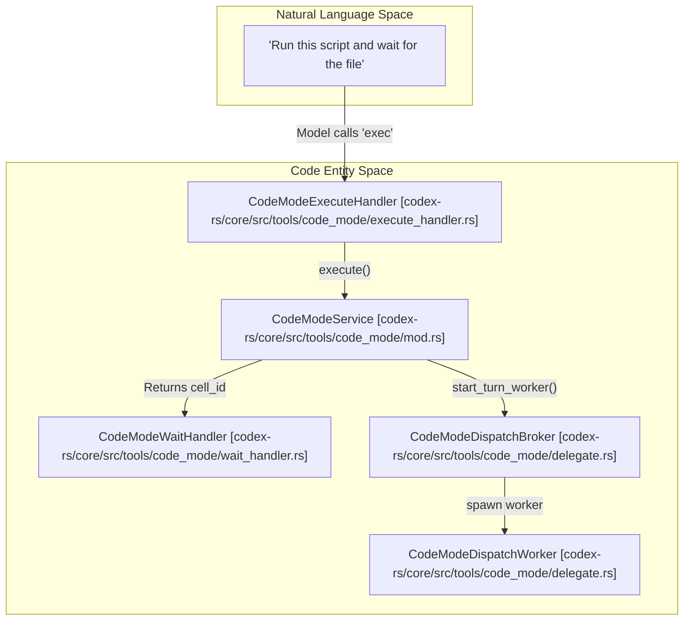
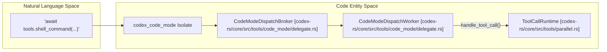

# Code Mode와 JavaScript REPL

관련 소스 파일

다음 파일들은 이 위키 페이지를 생성하기 위한 컨텍스트로 사용되었습니다:

- [codex-rs/code-mode/Cargo.toml](codex-rs/code-mode/Cargo.toml)
- [codex-rs/code-mode/src/description.rs](codex-rs/code-mode/src/description.rs)
- [codex-rs/code-mode/src/lib.rs](codex-rs/code-mode/src/lib.rs)
- [codex-rs/code-mode/src/runtime/callbacks.rs](codex-rs/code-mode/src/runtime/callbacks.rs)
- [codex-rs/code-mode/src/runtime/globals.rs](codex-rs/code-mode/src/runtime/globals.rs)
- [codex-rs/code-mode/src/runtime/mod.rs](codex-rs/code-mode/src/runtime/mod.rs)
- [codex-rs/code-mode/src/service.rs](codex-rs/code-mode/src/service.rs)
- [codex-rs/core/src/context/image_generation_instructions.rs](codex-rs/core/src/context/image_generation_instructions.rs)
- [codex-rs/core/src/state/session.rs](codex-rs/core/src/state/session.rs)
- [codex-rs/core/src/tools/code_mode/delegate.rs](codex-rs/core/src/tools/code_mode/delegate.rs)
- [codex-rs/core/src/tools/code_mode/execute_handler.rs](codex-rs/core/src/tools/code_mode/execute_handler.rs)
- [codex-rs/core/src/tools/code_mode/mod.rs](codex-rs/core/src/tools/code_mode/mod.rs)
- [codex-rs/core/src/tools/code_mode/wait_handler.rs](codex-rs/core/src/tools/code_mode/wait_handler.rs)
- [codex-rs/core/src/tools/context.rs](codex-rs/core/src/tools/context.rs)
- [codex-rs/core/src/tools/context_tests.rs](codex-rs/core/src/tools/context_tests.rs)
- [codex-rs/core/src/tools/handlers/dynamic.rs](codex-rs/core/src/tools/handlers/dynamic.rs)
- [codex-rs/core/src/tools/handlers/extension_tools.rs](codex-rs/core/src/tools/handlers/extension_tools.rs)
- [codex-rs/core/src/tools/handlers/mcp.rs](codex-rs/core/src/tools/handlers/mcp.rs)
- [codex-rs/core/src/tools/handlers/mod.rs](codex-rs/core/src/tools/handlers/mod.rs)
- [codex-rs/core/src/tools/handlers/tool_search.rs](codex-rs/core/src/tools/handlers/tool_search.rs)
- [codex-rs/core/src/tools/parallel.rs](codex-rs/core/src/tools/parallel.rs)
- [codex-rs/core/src/tools/registry.rs](codex-rs/core/src/tools/registry.rs)
- [codex-rs/core/src/tools/registry_tests.rs](codex-rs/core/src/tools/registry_tests.rs)
- [codex-rs/core/src/tools/router.rs](codex-rs/core/src/tools/router.rs)
- [codex-rs/core/src/tools/router_tests.rs](codex-rs/core/src/tools/router_tests.rs)
- [codex-rs/core/src/tools/spec_plan.rs](codex-rs/core/src/tools/spec_plan.rs)
- [codex-rs/core/src/tools/spec_plan_tests.rs](codex-rs/core/src/tools/spec_plan_tests.rs)
- [codex-rs/core/tests/suite/code_mode.rs](codex-rs/core/tests/suite/code_mode.rs)
- [codex-rs/tools/src/code_mode.rs](codex-rs/tools/src/code_mode.rs)
- [codex-rs/tools/src/code_mode_tests.rs](codex-rs/tools/src/code_mode_tests.rs)
- [codex-rs/tools/src/tool_call.rs](codex-rs/tools/src/tool_call.rs)

이 페이지는 Codex의 JavaScript 실행 시스템을 문서화하며, Code Mode의 yielding execution model, nested tool 오케스트레이션, stateful REPL 상호작용을 위한 V8 isolate 통합에 초점을 둡니다.

---

## 개요와 Feature Gates

Code Mode와 관련 REPL 기능은 `Config`와 `TurnContext` 내부의 feature flag로 제어됩니다. 이러한 flag는 도구의 가용성과 모델에 대한 nested tool definition의 가시성을 결정합니다.

| Feature flag | 효과 |
| :--- | :--- |
| `Feature::CodeMode` | yielding JavaScript 실행을 위한 `exec` 및 `wait` 도구를 활성화합니다. [codex-rs/core/tests/suite/code_mode.rs:188-188]() |
| `ToolMode::CodeMode` | 모델이 도구 상호작용에 JavaScript를 사용할 것으로 기대되는 turn의 runtime state입니다. [codex-rs/core/src/tools/code_mode/mod.rs:119-119]() |

출처: [codex-rs/core/tests/suite/code_mode.rs:188-188](), [codex-rs/core/src/tools/code_mode/mod.rs:119-119]()

---

## Code Mode System

### 목적과 아키텍처

Code Mode는 JavaScript를 위한 **yielding execution model**을 제공합니다. Script가 V8 isolate에서 실행되고, 제어를 모델에 다시 yield하며(예: 외부 event 또는 async tool output 대기), `CellId` 관리를 사용해 여러 turn에 걸쳐 실행 상태를 유지할 수 있게 합니다. [codex-rs/core/src/tools/code_mode/mod.rs:60-74]()

**Code Mode System Architecture (Natural Language to Code Entity Space)**

출처: [codex-rs/core/src/tools/code_mode/mod.rs:60-63](), [codex-rs/core/src/tools/code_mode/execute_handler.rs:1-10](), [codex-rs/core/src/tools/code_mode/wait_handler.rs:1-10](), [codex-rs/core/src/tools/code_mode/delegate.rs:39-41]()

### Tool Registration과 Specs

Code Mode 도구는 `CodeModeExecuteHandler`와 `CodeModeWaitHandler`를 통해 등록됩니다. `exec` 도구는 persistent session에서 JS 실행을 허용하고, `wait`는 yielded script의 결과 polling을 허용합니다. [codex-rs/core/src/tools/code_mode/mod.rs:45-46]()

| Constant | Value | Handler Class | 목적 |
| :--- | :--- | :--- | :--- |
| `PUBLIC_TOOL_NAME` | `"exec"` | `CodeModeExecuteHandler` | V8 isolate에서 JS를 실행합니다. raw source text를 지원합니다. [codex-rs/core/src/tools/code_mode/execute_handler.rs:41-41]() |
| `WAIT_TOOL_NAME` | `"wait"` | `CodeModeWaitHandler` | `cell_id`를 사용해 yielded cell을 resume하거나 poll합니다. [codex-rs/core/src/tools/code_mode/wait_handler.rs:43-43]() |

**Pragma와 Parameters:**
`exec` 도구는 script가 suspend되고 resume될 수 있는 yielding execution을 지원합니다. `DEFAULT_WAIT_YIELD_TIME_MS`는 `codex_code_mode` 크레이트에 정의된 값으로 설정됩니다. [codex-rs/core/src/tools/code_mode/mod.rs:47-47]()

출처: [codex-rs/core/src/tools/code_mode/mod.rs:45-47](), [codex-rs/core/src/tools/code_mode/execute_handler.rs:41-41](), [codex-rs/core/src/tools/code_mode/wait_handler.rs:43-43]()

---

## Tool Orchestration과 Nested Calls

Code Mode는 다른 도구의 orchestrator 역할을 하여, 복잡한 로직을 JS로 정의하고 Codex toolset에 대해 실행할 수 있게 합니다.

### Nested Tool Discovery
도구는 `CodeModeDispatchBroker`를 통해 V8 환경에 노출됩니다. 이 broker는 이러한 nested call을 위한 인프라를 제공하고, Code Mode 내부에서 실행된 도구가 core session으로 올바르게 다시 라우팅되도록 보장합니다. [codex-rs/core/src/tools/code_mode/delegate.rs:62-63]()

### CodeModeSessionDelegate와 Tool Invocation
`CodeModeDispatchBroker`는 V8 isolate와 Codex tool registry 사이의 bridge 역할을 합니다. [codex-rs/core/src/tools/code_mode/mod.rs:62-63]()

1.  **Tool Dispatch**: JS script가 도구를 실행하면 요청이 `CodeModeDispatchWorker`를 통해 라우팅됩니다. [codex-rs/core/src/tools/code_mode/delegate.rs:40-40]()
2.  **Context Management**: `ExecContext`는 tool permission과 state를 해석하는 데 필요한 `Session` 및 `TurnContext` 참조를 보관합니다. [codex-rs/core/src/tools/code_mode/mod.rs:55-58]()

**Nested Tool Data Flow (Natural Language to Code Entity Space)**

출처: [codex-rs/core/src/tools/code_mode/delegate.rs:39-41](), [codex-rs/core/src/tools/parallel.rs:31-37](), [codex-rs/core/src/tools/code_mode/mod.rs:112-118]()

---

## Execution Management와 State

### Cell Management
`CodeModeService`는 execution cell의 수명주기를 관리합니다. [codex-rs/core/src/tools/code_mode/mod.rs:60-63]() 활성 cell을 추적하고 이를 `execute`, `wait`, `terminate`하는 method를 제공합니다. [codex-rs/core/src/tools/code_mode/mod.rs:76-95]()

### Multi-Session Support
동일 session 내 서로 다른 `exec` call에 걸쳐 state를 유지하기 위해 `CodeModeService`는 `CodeModeSession`을 유지합니다. [codex-rs/core/src/tools/code_mode/mod.rs:61-61]() 이를 통해 JS 환경은 turn 사이에서 variable 또는 storage를 유지할 수 있습니다.

### Truncation과 Sanitization
Code Mode의 결과에는 다음이 적용됩니다:
*   **Truncation**: `truncate_code_mode_result`는 context window overflow를 방지하기 위해 `max_output_tokens` 기준으로 output을 제한합니다. [codex-rs/core/src/tools/code_mode/mod.rs:154-154]()
*   **Image Sanitization**: `sanitize_runtime_image_detail`은 `can_request_original_image_detail`을 사용해 session permission 기준으로 image detail request를 필터링합니다. [codex-rs/core/src/tools/code_mode/mod.rs:188-190]()

---

## JavaScript REPL 통합

시스템은 variable binding과 state가 call 사이에서 유지되는 persistent REPL 유사 경험을 지원합니다.

*   **Yield Control Pattern**: Script는 background에서 활성 상태로 남아 있으면서 제어를 모델에 다시 yield할 수 있습니다. 이는 `wait` 도구가 처리합니다. [codex-rs/core/src/tools/code_mode/wait_handler.rs:21-25]()
*   **Result Mapping**: Runtime response(Yielded, Terminated 또는 Result)는 모델을 위한 `FunctionToolOutput`으로 변환됩니다. [codex-rs/core/src/tools/code_mode/mod.rs:142-147]()
*   **Parallelism**: Code Mode 실행은 tool call이 병렬로 실행될 수 있는지 또는 직렬화되어야 하는지 관리하는 `ToolCallRuntime`과 상호작용합니다. [codex-rs/core/src/tools/parallel.rs:88-95]()

출처: [codex-rs/core/src/tools/code_mode/mod.rs:142-186](), [codex-rs/core/src/tools/parallel.rs:88-95](), [codex-rs/core/src/tools/code_mode/wait_handler.rs:21-25]()
