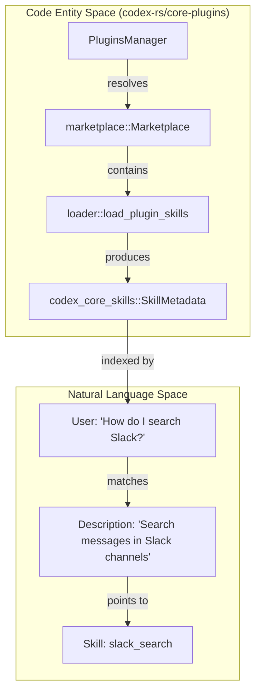
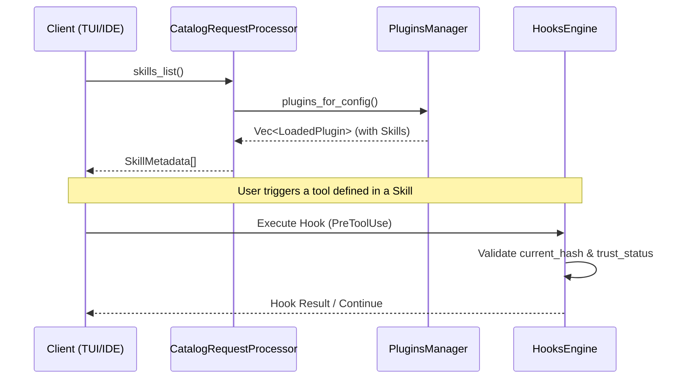

# Skills System

관련 소스 파일

다음 파일들은 이 위키 페이지를 생성하기 위한 컨텍스트로 사용되었습니다:

- [codex-rs/app-server/src/request_processors/catalog_processor.rs](codex-rs/app-server/src/request_processors/catalog_processor.rs)
- [codex-rs/app-server/tests/suite/v2/hooks_list.rs](codex-rs/app-server/tests/suite/v2/hooks_list.rs)
- [codex-rs/core-plugins/src/discoverable.rs](codex-rs/core-plugins/src/discoverable.rs)
- [codex-rs/core-plugins/src/lib.rs](codex-rs/core-plugins/src/lib.rs)
- [codex-rs/core-plugins/src/loader.rs](codex-rs/core-plugins/src/loader.rs)
- [codex-rs/core-plugins/src/manager.rs](codex-rs/core-plugins/src/manager.rs)
- [codex-rs/core-plugins/src/manager_tests.rs](codex-rs/core-plugins/src/manager_tests.rs)
- [codex-rs/core-plugins/src/marketplace.rs](codex-rs/core-plugins/src/marketplace.rs)
- [codex-rs/core-plugins/src/marketplace_tests.rs](codex-rs/core-plugins/src/marketplace_tests.rs)
- [codex-rs/core/src/plugins/discoverable.rs](codex-rs/core/src/plugins/discoverable.rs)
- [codex-rs/core/src/plugins/discoverable_tests.rs](codex-rs/core/src/plugins/discoverable_tests.rs)
- [codex-rs/core/src/tools/handlers/request_plugin_install_tests.rs](codex-rs/core/src/tools/handlers/request_plugin_install_tests.rs)
- [codex-rs/tools/src/request_plugin_install.rs](codex-rs/tools/src/request_plugin_install.rs)
- [codex-rs/tools/src/request_plugin_install_tests.rs](codex-rs/tools/src/request_plugin_install_tests.rs)
- [codex-rs/tools/src/tool_discovery.rs](codex-rs/tools/src/tool_discovery.rs)
- [codex-rs/tools/src/tool_discovery_tests.rs](codex-rs/tools/src/tool_discovery_tests.rs)
- [codex-rs/tui/src/snapshots/codex_tui__startup_hooks_review__tests__startup_hooks_review_prompt.snap](codex-rs/tui/src/snapshots/codex_tui__startup_hooks_review__tests__startup_hooks_review_prompt.snap)
- [codex-rs/tui/src/snapshots/codex_tui__startup_hooks_review__tests__startup_hooks_review_prompt_with_trust_error.snap](codex-rs/tui/src/snapshots/codex_tui__startup_hooks_review__tests__startup_hooks_review_prompt_with_trust_error.snap)
- [codex-rs/tui/src/startup_hooks_review.rs](codex-rs/tui/src/startup_hooks_review.rs)

`codex-rs`의 Skills System은 고수준 instruction, toolset, hook configuration을 발견하고 로드하여 에이전트 session에 주입하기 위한 framework입니다. 이를 통해 에이전트는 repository-local definition, 내장 "core" skill, 그리고 `PluginsManager`로 관리되는 plugin 제공 기능을 사용해 capability를 확장할 수 있습니다.

---

## 개요

Skills System은 "Skill"의 수명주기를 관리합니다. Skill은 자연어 instruction(일반적으로 Markdown)과 선택적 metadata를 포함하는 선별된 package입니다. 이러한 skill은 base prompt에 hardcoding하지 않고도 domain-specific knowledge 또는 복잡한 tool-use strategy를 모델에 제공합니다.

시스템 아키텍처는 다음으로 나뉩니다:
1.  **Discovery**: `.codex/skills`, `.agents/skills`, plugin cache directory 같은 특정 directory root에서 skill definition을 찾습니다 [codex-rs/core-plugins/src/loader.rs:50-53]().
2.  **Loading**: `PluginsManager`와 `load_plugin_skills`를 통해 `SKILL.md` 파일과 metadata를 parsing합니다 [codex-rs/core-plugins/src/loader.rs:12-13]().
3.  **Management**: `PluginsManager`는 local 및 remote source(Marketplaces)의 활성 skill registry를 유지합니다 [codex-rs/core-plugins/src/manager.rs:42-48]().
4.  **Injection**: skill content를 conversation history에 동적으로 주입하며, frontend 표시를 위해 `CatalogRequestProcessor`가 이를 지원하는 경우가 많습니다 [codex-rs/app-server/src/request_processors/catalog_processor.rs:18-21]().

---

## Skill Discovery와 Plugins

Skill은 local directory와 설치된 plugin을 포함한 여러 source에서 집계됩니다. `PluginsManager`는 현재 configuration과 environment를 기준으로 어떤 skill을 사용할 수 있는지 해석하는 중앙 권한입니다.

### Skill Discovery Hierarchy
시스템은 다음 위치에서 skill을 집계합니다:
*   **Project Root**: 현재 workspace 내부의 `.codex/skills` 또는 `.agents/skills` [codex-rs/core-plugins/src/loader.rs:50-53]().
*   **Plugin Cache**: `plugins/cache/{marketplace}/{name}`에 위치한 설치된 plugin 내부에 bundled된 skill [codex-rs/core-plugins/src/manager_tests.rs:178-183]().
*   **Core Skills**: `codex-core-skills` 크레이트가 제공하는 내장 skill [codex-rs/core-plugins/src/manager.rs:56-58]().

### Plugin Integration
`PluginsManager`는 skill, MCP server, hook을 bundle할 수 있는 plugin의 설치와 활성화 상태를 추적합니다 [codex-rs/core-plugins/src/manager.rs:167-182](). plugin이 로드되면 해당 skill이 materialize되고 index됩니다.

| Component | 역할 | 파일 참조 |
| :--- | :--- | :--- |
| `PluginsManager` | plugin lifecycle과 skill loading을 오케스트레이션합니다. | [codex-rs/core-plugins/src/manager.rs:42-48]() |
| `PluginLoadOutcome` | 로드된 skill을 포함하는 plugin load attempt의 결과입니다. | [codex-rs/core-plugins/src/lib.rs:24-24]() |
| `SkillMetadata` | 이름, 설명, dependency를 포함하는 skill metadata입니다. | [codex-rs/app-server/src/request_processors/catalog_processor.rs:18-21]() |

출처: [codex-rs/core-plugins/src/loader.rs:128-147](), [codex-rs/core-plugins/src/manager.rs:167-185](), [codex-rs/core-plugins/src/manager_tests.rs:178-188]()

---

## Tool Suggestion과 Discoverability

Skill은 단순한 static instruction이 아니며, 종종 도구와 연결됩니다. 시스템은 discoverability layer를 사용해 관련 plugin과 skill을 사용자 또는 모델에 제안합니다.

### Discoverable Plugins
`list_tool_suggest_discoverable_plugins` 함수는 사용자의 현재 설치된 app과 configuration을 기준으로 marketplace(`openai-curated` 또는 `openai-bundled` 등)의 사용 가능한 plugin을 필터링합니다 [codex-rs/core-plugins/src/discoverable.rs:80-84]().

출처: [codex-rs/core-plugins/src/discoverable.rs:80-114](), [codex-rs/core-plugins/src/loader.rs:12-13](), [codex-rs/tools/src/tool_discovery.rs:94-102]()

---

## Skills와 Hooks 통합

Skills system은 Hooks system과 긴밀하게 결합되어 있습니다. Plugin은 특정 skill 또는 tool이 trigger될 때 실행되는 `PreToolUse` 또는 `PostToolUse` hook을 정의할 수 있습니다 [codex-rs/app-server/tests/suite/v2/hooks_list.rs:190-211]().

### Hook Metadata와 Discovery
`CatalogRequestProcessor`는 `hooks_list` 및 `skills_list` RPC endpoint를 제공하여 frontend(TUI 등)가 사용 가능한 capability를 표시할 수 있게 합니다 [codex-rs/app-server/src/request_processors/catalog_processor.rs:120-136]().

*   **Managed Hooks**: `.codex/config.toml` 또는 plugin manifest에 정의된 hook [codex-rs/app-server/tests/suite/v2/hooks_list.rs:69-83]().
*   **Trust Status**: Hook은 실행 중 보안을 보장하기 위해 `HookTrustStatus`(예: `Untrusted`, `Trusted`)로 분류됩니다 [codex-rs/app-server/tests/suite/v2/hooks_list.rs:180-180]().

### 데이터 흐름: Skill Activation에서 Hook Execution까지

출처: [codex-rs/app-server/src/request_processors/catalog_processor.rs:18-62](), [codex-rs/app-server/tests/suite/v2/hooks_list.rs:155-185](), [codex-rs/core-plugins/src/loader.rs:188-206]()

---

## Configuration과 Rules

Skill 동작은 `SkillConfigRules`를 통해 수정할 수 있습니다. 이를 통해 특정 skill path를 비활성화하거나 product-level restriction을 강제할 수 있습니다 [codex-rs/core-plugins/src/loader.rs:19-21]().

*   **SkillConfigRules**: `ConfigLayerStack`에서 해석되며, 주어진 session에서 어떤 skill이 활성화되는지 결정합니다 [codex-rs/core-plugins/src/loader.rs:135-136]().
*   **Product Gating**: 일부 skill 또는 plugin은 `restriction_product` check를 통해 특정 product(예: `Product::Claude`)로 제한됩니다 [codex-rs/core-plugins/src/loader.rs:132-134]().
*   **Marketplace Policies**: Marketplace는 사용자에게 처음 제공되는 skill set을 결정하는 `MarketplacePluginInstallPolicy`(예: `INSTALLED_BY_DEFAULT`)를 정의합니다 [codex-rs/core-plugins/src/marketplace.rs:91-100]().

출처: [codex-rs/core-plugins/src/loader.rs:19-21](), [codex-rs/core-plugins/src/marketplace.rs:91-109](), [codex-rs/core-plugins/src/manager.rs:56-58]()
