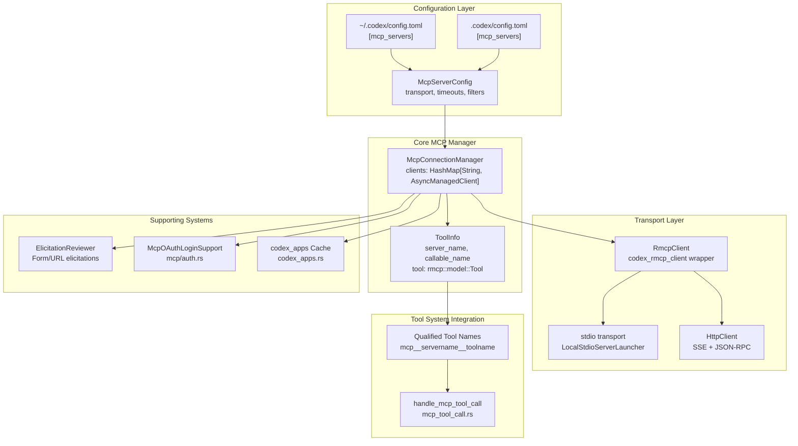
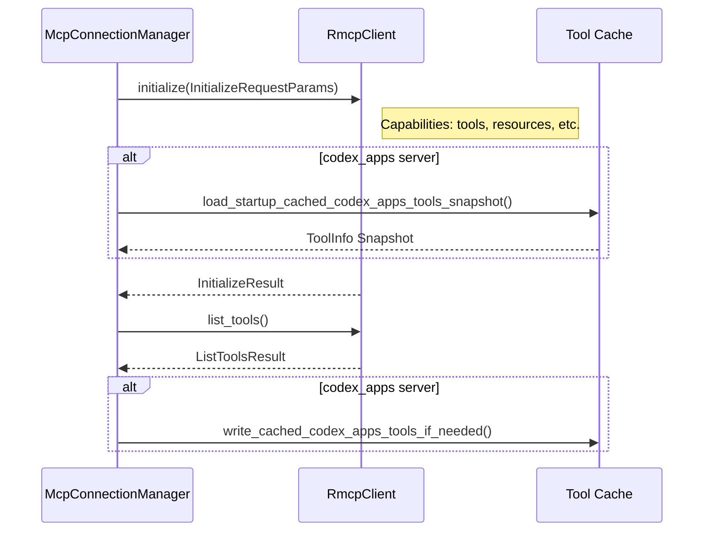
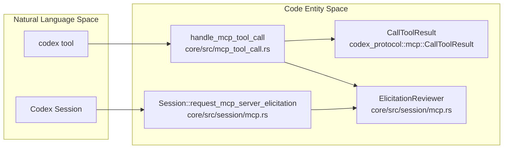

# Model Context Protocol (MCP)

관련 소스 파일

다음 파일들은 이 위키 페이지를 생성하기 위한 컨텍스트로 사용되었습니다.

- [codex-rs/app-server/tests/suite/v2/app_list.rs](codex-rs/app-server/tests/suite/v2/app_list.rs)
- [codex-rs/app-server/tests/suite/v2/experimental_feature_list.rs](codex-rs/app-server/tests/suite/v2/experimental_feature_list.rs)
- [codex-rs/app-server/tests/suite/v2/mcp_tool.rs](codex-rs/app-server/tests/suite/v2/mcp_tool.rs)
- [codex-rs/chatgpt/src/connectors.rs](codex-rs/chatgpt/src/connectors.rs)
- [codex-rs/codex-mcp/src/codex_apps.rs](codex-rs/codex-mcp/src/codex_apps.rs)
- [codex-rs/codex-mcp/src/connection_manager.rs](codex-rs/codex-mcp/src/connection_manager.rs)
- [codex-rs/codex-mcp/src/connection_manager_tests.rs](codex-rs/codex-mcp/src/connection_manager_tests.rs)
- [codex-rs/codex-mcp/src/lib.rs](codex-rs/codex-mcp/src/lib.rs)
- [codex-rs/codex-mcp/src/mcp/mod.rs](codex-rs/codex-mcp/src/mcp/mod.rs)
- [codex-rs/codex-mcp/src/mcp/mod_tests.rs](codex-rs/codex-mcp/src/mcp/mod_tests.rs)
- [codex-rs/codex-mcp/src/rmcp_client.rs](codex-rs/codex-mcp/src/rmcp_client.rs)
- [codex-rs/codex-mcp/src/runtime.rs](codex-rs/codex-mcp/src/runtime.rs)
- [codex-rs/codex-mcp/src/tools.rs](codex-rs/codex-mcp/src/tools.rs)
- [codex-rs/core/src/connectors.rs](codex-rs/core/src/connectors.rs)
- [codex-rs/core/src/connectors_tests.rs](codex-rs/core/src/connectors_tests.rs)
- [codex-rs/core/src/mcp_skill_dependencies.rs](codex-rs/core/src/mcp_skill_dependencies.rs)
- [codex-rs/core/src/mcp_tool_call.rs](codex-rs/core/src/mcp_tool_call.rs)
- [codex-rs/core/src/mcp_tool_call_tests.rs](codex-rs/core/src/mcp_tool_call_tests.rs)
- [codex-rs/core/src/session/mcp.rs](codex-rs/core/src/session/mcp.rs)
- [codex-rs/core/tests/common/apps_test_server.rs](codex-rs/core/tests/common/apps_test_server.rs)
- [codex-rs/core/tests/suite/plugins.rs](codex-rs/core/tests/suite/plugins.rs)
- [codex-rs/core/tests/suite/search_tool.rs](codex-rs/core/tests/suite/search_tool.rs)
- [codex-rs/exec-server/src/client/http_response_body_stream.rs](codex-rs/exec-server/src/client/http_response_body_stream.rs)
- [codex-rs/exec-server/src/client/reqwest_http_client.rs](codex-rs/exec-server/src/client/reqwest_http_client.rs)
- [codex-rs/exec-server/src/client/rpc_http_client.rs](codex-rs/exec-server/src/client/rpc_http_client.rs)
- [codex-rs/rmcp-client/Cargo.toml](codex-rs/rmcp-client/Cargo.toml)
- [codex-rs/rmcp-client/src/auth_status.rs](codex-rs/rmcp-client/src/auth_status.rs)
- [codex-rs/rmcp-client/src/bin/rmcp_test_server.rs](codex-rs/rmcp-client/src/bin/rmcp_test_server.rs)
- [codex-rs/rmcp-client/src/bin/test_stdio_server.rs](codex-rs/rmcp-client/src/bin/test_stdio_server.rs)
- [codex-rs/rmcp-client/src/bin/test_streamable_http_server.rs](codex-rs/rmcp-client/src/bin/test_streamable_http_server.rs)
- [codex-rs/rmcp-client/src/http_client_adapter.rs](codex-rs/rmcp-client/src/http_client_adapter.rs)
- [codex-rs/rmcp-client/src/lib.rs](codex-rs/rmcp-client/src/lib.rs)
- [codex-rs/rmcp-client/src/oauth.rs](codex-rs/rmcp-client/src/oauth.rs)
- [codex-rs/rmcp-client/src/perform_oauth_login.rs](codex-rs/rmcp-client/src/perform_oauth_login.rs)
- [codex-rs/rmcp-client/src/rmcp_client.rs](codex-rs/rmcp-client/src/rmcp_client.rs)
- [codex-rs/rmcp-client/src/streamable_http_retry.rs](codex-rs/rmcp-client/src/streamable_http_retry.rs)
- [codex-rs/rmcp-client/src/streamable_http_retry_tests.rs](codex-rs/rmcp-client/src/streamable_http_retry_tests.rs)
- [codex-rs/rmcp-client/tests/streamable_http_oauth_startup.rs](codex-rs/rmcp-client/tests/streamable_http_oauth_startup.rs)
- [codex-rs/rmcp-client/tests/streamable_http_recovery.rs](codex-rs/rmcp-client/tests/streamable_http_recovery.rs)
- [codex-rs/rmcp-client/tests/streamable_http_test_support.rs](codex-rs/rmcp-client/tests/streamable_http_test_support.rs)

Model Context Protocol (MCP) 시스템은 Codex가 외부 도구 서버와 통합되도록 하여 내장 도구를 넘어 기능을 확장합니다. MCP 서버는 에이전트가 대화 턴 중 호출할 수 있는 도구, 리소스, 프롬프트를 노출합니다. 이 문서는 MCP 서버 구성, 연결 관리, 도구 발견, 인증, elicitation 처리를 다룹니다.

내장 도구 실행에 대한 정보는 [Tool System](#5)을 참조하세요. 일반적인 구성 관리에 대해서는 [Configuration System](#2.2)을 참조하세요.

---

## 개요

MCP 통합은 세 가지 주요 하위 시스템으로 구성됩니다.

1.  **연결 관리** - 구성된 서버별 `RmcpClient` 인스턴스의 수명 주기를 관리합니다.
2.  **도구 집계** - 도구 호출을 발견하고, 한정 이름을 부여하며, 적절한 서버로 라우팅합니다.
3.  **인증 및 Elicitation** - OAuth 흐름과 사용자 입력을 위한 대화형 서버 요청을 처리합니다.

MCP 서버는 `~/.codex/config.toml`에 전역으로 구성하거나, `.codex/config.toml`의 `[mcp_servers]` 테이블 아래에 프로젝트별로 구성할 수 있습니다. 각 서버는 자체 전송 방식(stdio 또는 HTTP), 시간 제한 설정, 도구 필터를 가지고 독립적으로 동작합니다.

---

## 시스템 아키텍처

### MCP 통합 개요
다음 다이어그램은 `McpConnectionManager`가 `rmcp` 프로토콜을 통해 Codex 세션 로직을 외부 MCP 서버에 연결하는 방식을 보여줍니다.

**출처:** [codex-rs/codex-mcp/src/connection_manager.rs:1-15](), [codex-rs/codex-mcp/src/mcp/mod.rs:40-43](), [codex-rs/codex-mcp/src/lib.rs:1-13]()

`McpConnectionManager`(`codex-mcp`에 정의됨)는 MCP 연결의 수명 주기를 소유합니다. 이 관리자는 모든 서버의 도구를 `ToolInfo` 객체의 통합 맵으로 집계하며, 모델에 노출되는 한정 이름을 키로 사용합니다.

---

## MCP 서버 구성

### 구성 구조
MCP 서버는 전송 세부 정보와 실행 정책을 포함하는 `McpServerConfig` 구조체를 사용해 정의됩니다. `McpConfig` 구조체는 이러한 설정과 `codex_home`, `approval_policy` 같은 환경 전반의 기본값을 담는 컨테이너 역할을 합니다.

**출처:** [codex-rs/codex-mcp/src/mcp/mod.rs:107-143](), [codex-rs/codex-mcp/src/lib.rs:11-13]()

### 전송 유형

#### stdio 전송
명령줄을 통해 하위 프로세스를 실행합니다.
*   **구현:** `LocalStdioServerLauncher` 또는 `ExecutorStdioServerLauncher`를 사용해 stdin/stdout 파이프를 관리합니다.
*   **런처:** `codex_rmcp_client::StdioServerLauncher`.

**출처:** [codex-rs/rmcp-client/src/rmcp_client.rs:88-90](), [codex-rs/rmcp-client/src/lib.rs:37-39]()

#### HTTP 전송
Model Context Protocol의 SSE 기반 전송을 사용해 원격 HTTP 서버에 연결합니다.
*   **구현:** `HttpClient` 어댑터와 함께 `StreamableHttpClientTransport`를 사용합니다.
*   **OAuth 지원:** OAuth로 보호되는 엔드포인트의 경우 `AuthClient`로 감쌀 수 있습니다.

**출처:** [codex-rs/rmcp-client/src/rmcp_client.rs:91-97](), [codex-rs/rmcp-client/src/lib.rs:14-17]()

모든 구성 필드에 대한 자세한 내용은 [MCP Server Configuration](#6.1)을 참조하세요.

---

## 서버 수명 주기와 시작

### 시작 흐름
`McpConnectionManager`는 MCP 명세에 정의된 `InitializeRequestParams`를 사용해 서버를 초기화합니다. 특수한 `codex_apps` 서버의 경우, 백그라운드 초기화가 진행되는 동안 디스크 캐시가 가용성을 제공합니다.

**출처:** [codex-rs/codex-mcp/src/mcp/mod.rs:39-44](), [codex-rs/rmcp-client/src/rmcp_client.rs:33-37](), [codex-rs/codex-mcp/src/lib.rs:24-25]()

클라이언트 수명 주기와 상태 관리에 대한 자세한 내용은 [MCP Connection Manager](#6.2)를 참조하세요.

---

## 도구 발견과 한정 이름

### 도구 한정 이름 처리 과정
MCP 도구는 모델의 도구 호출 제약을 따르는 한정 이름으로 변환되어야 합니다.

1.  **형식:** 표준 형식은 `qualified_mcp_tool_name_prefix`로 정의된 `mcp__{server_name}__toolname`입니다.
2.  **접두사:** 표준 접두사로 `mcp`를 사용하고, 구분자로 `__`를 사용합니다.
3.  **정리:** 시스템은 `sanitize_responses_api_tool_name`을 사용해 이름이 모델에 노출되는 도구 정의와 호환되도록 보장합니다.

**출처:** [codex-rs/codex-mcp/src/mcp/mod.rs:44-46](), [codex-rs/codex-mcp/src/mcp/mod.rs:62-66]()

---

## OAuth 인증

MCP 서버는 OAuth 인증을 요구할 수 있으며, 이는 `McpOAuthLoginSupport`를 통해 관리됩니다.

*   **흐름:** `perform_oauth_login`을 통해 시작되며, 범위 발견과 상태 계산을 처리합니다.
*   **자격 증명 저장:** `OAuthPersistor`를 통해 `OAuthCredentialsStoreMode`(Keyring 또는 로컬 파일)에 따라 관리됩니다.
*   **통합:** `RmcpClient`는 전송 설정 중 토큰 해석을 처리하기 위해 `StoredOAuthTokens`를 사용합니다.

**출처:** [codex-rs/rmcp-client/src/perform_oauth_login.rs:80-91](), [codex-rs/rmcp-client/src/rmcp_client.rs:94-97](), [codex-rs/codex-mcp/src/mcp/mod.rs:1-10]()

자세한 내용은 [OAuth Authentication for MCP](#6.5)를 참조하세요.

---

## Codex 도구 실행

Codex는 프로토콜 브리지, 승인 로직, 결과 형식을 관리하는 특수 핸들러를 통해 MCP 도구를 호출합니다.

### 실행 구성 요소
다음 다이어그램은 도구 호출 처리 아키텍처를 내부 코드 엔티티에 매핑합니다.

*   **도구 디스패치:** `handle_mcp_tool_call`은 `run_permission_request_hooks`를 통한 권한 확인과 OpenAI 파일을 위한 인수 재작성까지 포함하여 MCP 도구 호출의 전체 수명 주기를 관리합니다.
*   **Elicitation:** 서버는 `CreateElicitationRequestParams`를 통해 사용자 입력을 요청할 수 있습니다. Codex는 세션의 `request_mcp_server_elicitation`을 통해 이를 처리하며, 이 함수는 `EventMsg::ElicitationRequest` 이벤트를 내보냅니다.
*   **Guardian 통합:** `GuardianMcpElicitationReviewer`는 MCP elicitations와 Codex Guardian/Approval 시스템 사이의 브리지를 제공합니다.

**출처:** [codex-rs/core/src/mcp_tool_call.rs:107-115](), [codex-rs/core/src/session/mcp.rs:85-90](), [codex-rs/core/src/session/mcp.rs:174-179](), [codex-rs/core/src/session/mcp.rs:61-74]()

자세한 내용은 [MCP Server Implementation (codex-mcp-server)](#6.4)을 참조하세요.

---

## 샌드박스 상태 동기화

MCP 서버는 도구 실행이 에이전트 권한과 일치하도록 현재 샌드박스 상태에 대한 알림을 받을 수 있습니다.

*   **기능:** 서버는 `codex/sandbox-state-meta` 기능을 선언할 수 있습니다.
*   **메타데이터 전파:** 지원되는 경우, `SandboxState`가 도구 호출 요청 메타데이터에 포함되어 서버에 파일 시스템 및 네트워크 정책을 알려줍니다.

**출처:** [codex-rs/codex-mcp/src/mcp/mod.rs:124-127](), [codex-rs/core/src/mcp_tool_call.rs:40-41](), [codex-rs/core/src/mcp_tool_call.rs:150-155]()

자세한 내용은 [Sandbox State Synchronization](#6.6)을 참조하세요.

---

## CLI 명령

`codex mcp` 하위 명령은 사용자가 외부 서버 통합을 관리할 수 있게 합니다.

| 명령 | 설명 |
| :--- | :--- |
| `list` | 구성된 서버와 현재 인증/연결 상태를 나열합니다. |
| `add` | 새 stdio 또는 HTTP 서버를 `config.toml`에 구성합니다. |
| `login` | 원격 서버에 대한 OAuth 로그인 흐름을 시작합니다. |
| `logout` | 특정 서버에 대해 저장된 자격 증명과 토큰을 지웁니다. |

자세한 내용은 [MCP CLI Commands](#6.3)를 참조하세요.
