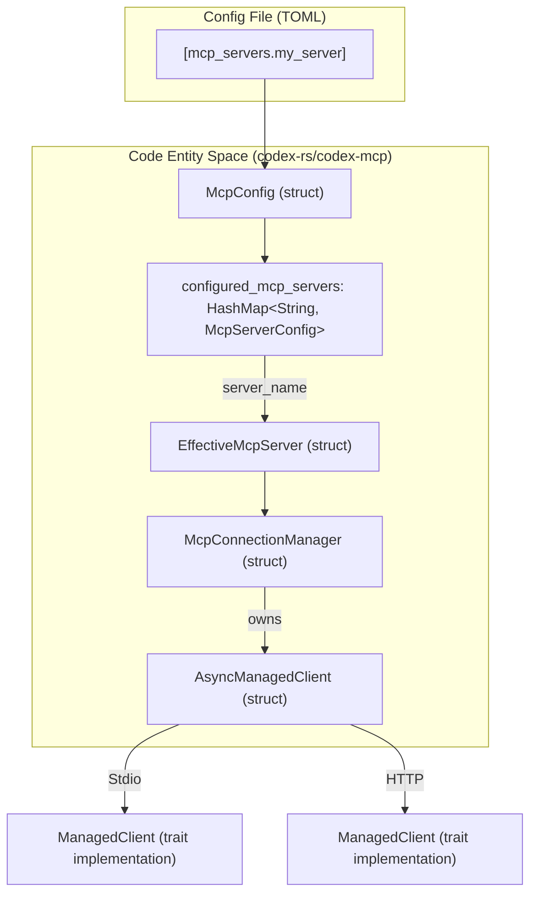
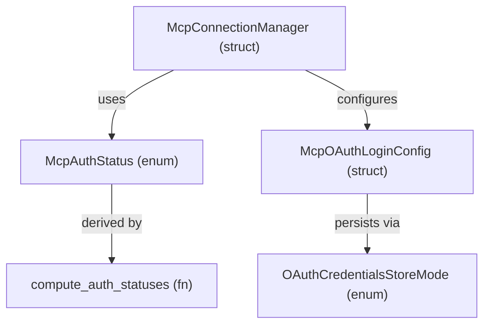

# MCP 서버 구성

관련 소스 파일

다음 파일들은 이 위키 페이지를 생성하기 위한 컨텍스트로 사용되었습니다.

- [codex-rs/app-server/tests/suite/v2/app_list.rs](codex-rs/app-server/tests/suite/v2/app_list.rs)
- [codex-rs/app-server/tests/suite/v2/experimental_feature_list.rs](codex-rs/app-server/tests/suite/v2/experimental_feature_list.rs)
- [codex-rs/app-server/tests/suite/v2/mcp_tool.rs](codex-rs/app-server/tests/suite/v2/mcp_tool.rs)
- [codex-rs/chatgpt/src/connectors.rs](codex-rs/chatgpt/src/connectors.rs)
- [codex-rs/codex-mcp/src/codex_apps.rs](codex-rs/codex-mcp/src/codex_apps.rs)
- [codex-rs/codex-mcp/src/connection_manager.rs](codex-rs/codex-mcp/src/connection_manager.rs)
- [codex-rs/codex-mcp/src/connection_manager_tests.rs](codex-rs/codex-mcp/src/connection_manager_tests.rs)
- [codex-rs/codex-mcp/src/lib.rs](codex-rs/codex-mcp/src/lib.rs)
- [codex-rs/codex-mcp/src/mcp/mod.rs](codex-rs/codex-mcp/src/mcp/mod.rs)
- [codex-rs/codex-mcp/src/mcp/mod_tests.rs](codex-rs/codex-mcp/src/mcp/mod_tests.rs)
- [codex-rs/codex-mcp/src/rmcp_client.rs](codex-rs/codex-mcp/src/rmcp_client.rs)
- [codex-rs/codex-mcp/src/runtime.rs](codex-rs/codex-mcp/src/runtime.rs)
- [codex-rs/codex-mcp/src/tools.rs](codex-rs/codex-mcp/src/tools.rs)
- [codex-rs/core/src/connectors.rs](codex-rs/core/src/connectors.rs)
- [codex-rs/core/src/connectors_tests.rs](codex-rs/core/src/connectors_tests.rs)
- [codex-rs/core/src/mcp_skill_dependencies.rs](codex-rs/core/src/mcp_skill_dependencies.rs)
- [codex-rs/core/src/mcp_tool_call.rs](codex-rs/core/src/mcp_tool_call.rs)
- [codex-rs/core/src/mcp_tool_call_tests.rs](codex-rs/core/src/mcp_tool_call_tests.rs)
- [codex-rs/core/src/session/mcp.rs](codex-rs/core/src/session/mcp.rs)
- [codex-rs/core/tests/common/apps_test_server.rs](codex-rs/core/tests/common/apps_test_server.rs)
- [codex-rs/core/tests/suite/plugins.rs](codex-rs/core/tests/suite/plugins.rs)
- [codex-rs/core/tests/suite/search_tool.rs](codex-rs/core/tests/suite/search_tool.rs)

이 문서는 Codex의 MCP(Model Context Protocol) 서버에 대한 기술적 구현과 구성 스키마를 설명합니다. MCP 서버는 AI가 대화 중 접근할 수 있는 외부 도구, 리소스, 데이터 소스를 제공하여 Codex의 기능을 확장합니다.

---

## 구성 구조

MCP 서버는 `config.toml` 파일의 `[mcp_servers]` 테이블 아래에 구성됩니다. 구성은 루트 구성에서 파생된 런타임 설정을 집계하는 `McpConfig` 구조체 [codex-rs/codex-mcp/src/mcp/mod.rs:107-147]()가 관리합니다.

### McpServerConfig 필드

`McpServerConfig` 구조체 [codex-rs/core/src/mcp_tool_call_tests.rs:17-18]()는 Codex가 MCP 서버에 연결하고 이를 관리하는 방식을 정의합니다.

| 필드 | 타입 | 설명 |
|-------|------|-------------|
| `transport` | `McpServerTransportConfig` | 연결 방식(Stdio 또는 HTTP)을 정의합니다 [codex-rs/core/tests/suite/search_tool.rs:6](). |
| `enabled` | `bool` | 서버가 활성 상태인지 여부입니다. 기본값은 `true`입니다. |
| `required` | `bool` | `true`이면 이 서버를 시작할 수 없을 때 세션 초기화가 실패합니다 [codex-rs/codex-mcp/src/connection_manager.rs:138-141](). |
| `supports_parallel_tool_calls` | `bool` | 이 서버의 도구에 대해 동시 실행을 활성화합니다 [codex-rs/codex-mcp/src/connection_manager.rs:35](). |
| `default_tools_approval_mode` | `AppToolApproval` | 이 서버의 모든 도구에 대한 기본 동작(`auto`, `prompt`, `approve`)입니다 [codex-rs/core/src/mcp_tool_call.rs:34](). |
| `tools` | `HashMap<String, McpServerToolConfig>` | 도구별 재정의(예: `enabled`, `approval_mode`)입니다 [codex-rs/core/src/mcp_tool_call_tests.rs:18](). |
| `oauth` | `McpOAuthLoginConfig` | OAuth 기반 인증을 위한 구성입니다 [codex-rs/codex-mcp/src/mcp/mod.rs:2](). |
| `startup_timeout_sec` | `Option<f64>` | 서버 초기화를 위한 사용자 지정 시간 제한입니다 [codex-rs/core/tests/suite/plugins.rs:78](). |

**출처:** [codex-rs/codex-mcp/src/mcp/mod.rs:107-147](), [codex-rs/codex-mcp/src/connection_manager.rs:138-143](), [codex-rs/core/src/mcp_tool_call_tests.rs:12-18]()

---

## 전송 유형

Codex는 MCP 통신을 위해 두 가지 주요 전송 메커니즘을 지원하며, 이는 `McpServerTransportConfig` enum [codex-rs/core/tests/suite/search_tool.rs:6]()에 정의되어 있습니다.

### Stdio 전송
서버를 로컬 하위 프로세스로 실행합니다.
- **`command`**: 실행할 실행 파일입니다 [codex-rs/core/tests/suite/plugins.rs:76]().
- **`env`**: 자식 프로세스에 전달되는 환경 변수입니다.
- **`cwd`**: 서버 프로세스의 현재 작업 디렉터리입니다 [codex-rs/core/tests/suite/plugins.rs:77]().

### HTTP 전송
`http` variant [codex-rs/core/src/mcp_tool_call_tests.rs:113-114]()를 사용해 원격 또는 로컬 HTTP 엔드포인트에 연결합니다.
- **`url`**: MCP 서버의 기본 URL입니다 [codex-rs/core/src/mcp_tool_call_tests.rs:114]().

### 구성과 코드 엔티티 매핑

다음 다이어그램은 구성 파일과 내부 구현을 연결하며, 특히 `McpConnectionManager`가 이러한 전송 방식을 초기화하는 방식에 초점을 둡니다.

**출처:** [codex-rs/codex-mcp/src/mcp/mod.rs:107-147](), [codex-rs/codex-mcp/src/connection_manager.rs:106-115](), [codex-rs/codex-mcp/src/connection_manager.rs:24-31]()

---

## 도구 필터와 승인

Codex는 MCP 도구에 대해 계층적 승인 시스템을 구현합니다. 유효한 승인 모드는 도구별 구성과 전역 `approval_policy`를 확인해 결정됩니다.

### 자동 승인 로직
`mcp_permission_prompt_is_auto_approved` 함수 [codex-rs/codex-mcp/src/mcp/mod.rs:71-90]()는 프롬프트를 우회해야 하는지 판단합니다.
- `tool_approval_mode`가 `AppToolApproval::Approve`이면 `true`를 반환합니다 [codex-rs/codex-mcp/src/mcp/mod.rs:76-78]().
- `approval_policy`가 `AskForApproval::Never`이면 `PermissionProfile`을 확인합니다 [codex-rs/codex-mcp/src/mcp/mod.rs:80-89](). 전체 디스크 쓰기 접근 권한이 있는 관리형 프로필은 자동 승인됩니다 [codex-rs/codex-mcp/src/mcp/mod.rs:86-88]().

### 도구 필터링과 가시성
도구는 가시성 메타데이터를 기준으로 필터링될 수 있습니다. `tool_is_model_visible` [codex-rs/codex-mcp/src/connection_manager.rs:87-103]()은 도구가 가시성 메타데이터에 `model`을 명시적으로 포함하지 않는 한 도구를 숨깁니다. 또한 도구는 `normalize_tools_for_model_with_prefix` [codex-rs/codex-mcp/src/connection_manager.rs:37]()를 통해 모델 가시성에 맞게 추가로 정규화됩니다(예: 이름에 접두사 추가).

**출처:** [codex-rs/codex-mcp/src/mcp/mod.rs:71-90](), [codex-rs/codex-mcp/src/connection_manager.rs:87-103](), [codex-rs/codex-mcp/src/connection_manager.rs:35-38]()

---

## OAuth 설정과 흐름

Codex는 MCP 서버에 대해 OAuth 2.0을 지원합니다. 인증 상태는 `McpAuthStatusEntry` [codex-rs/codex-mcp/src/mcp/mod.rs:1]()를 통해 관리됩니다.

### OAuth 흐름과 구성 요소
시스템은 `discover_supported_scopes` [codex-rs/codex-mcp/src/mcp/mod.rs:7]()를 통해 scope 발견을 처리하고, scope로 제한된 요청이 실패하면 `should_retry_without_scopes` [codex-rs/codex-mcp/src/mcp/mod.rs:10]()를 통해 재시도를 관리합니다.

**출처:** [codex-rs/codex-mcp/src/mcp/mod.rs:1-10](), [codex-rs/codex-mcp/src/mcp/mod.rs:114-119](), [codex-rs/codex-mcp/src/connection_manager.rs:121-122]()

---

## Elicitation과 샌드박스 상태

MCP 서버는 **Elicitation Requests** [codex-rs/core/src/session/mcp.rs:85-90]()를 통해 사용자에게 정보를 요청할 수 있습니다.

1. **처리**: `request_mcp_server_elicitation`은 MCP 서버에서 들어오는 요청을 처리합니다 [codex-rs/core/src/session/mcp.rs:85-144](). 사용자에게 프롬프트를 표시하기 전에 `elicitations_auto_deny()`를 확인합니다 [codex-rs/core/src/session/mcp.rs:91-96]().
2. **승인**: 요청은 보안 정책을 준수하는지 확인하기 위해 `GuardianMcpElicitationReviewer` [codex-rs/core/src/session/mcp.rs:61-74]()의 검토를 받습니다.
3. **샌드박스 동기화**: 시스템은 샌드박스 상태(예: Landlock/Seatbelt 정책)를 MCP 서버와 동기화하여 서버가 에이전트의 현재 권한을 인식하도록 합니다 [codex-rs/codex-mcp/src/mcp/mod.rs:41]().

**출처:** [codex-rs/core/src/session/mcp.rs:61-184](), [codex-rs/codex-mcp/src/connection_manager.rs:113-115](), [codex-rs/codex-mcp/src/mcp/mod.rs:41-43]()

---

## 성능과 캐싱

MCP 작업은 응답성을 유지하기 위해 특정 시간 제한과 캐싱 전략을 사용합니다.
- **`DEFAULT_STARTUP_TIMEOUT`**: 서버가 초기화될 때 허용되는 기본 시간(60초)입니다 [codex-rs/codex-mcp/src/connection_manager.rs:25]().
- **캐싱**: 내부 `codex_apps` 서버의 경우, `write_cached_codex_apps_tools_if_needed` [codex-rs/codex-mcp/src/connection_manager.rs:19]()를 사용해 후속 시작 속도를 높이도록 도구를 캐시합니다.
- **메트릭**: 시스템은 `MCP_TOOLS_LIST_DURATION_METRIC` [codex-rs/codex-mcp/src/connection_manager.rs:27]()를 통해 도구 목록 조회 시간을 추적합니다.

**출처:** [codex-rs/codex-mcp/src/connection_manager.rs:17-30](), [codex-rs/codex-mcp/src/connection_manager.rs:47-48]()
