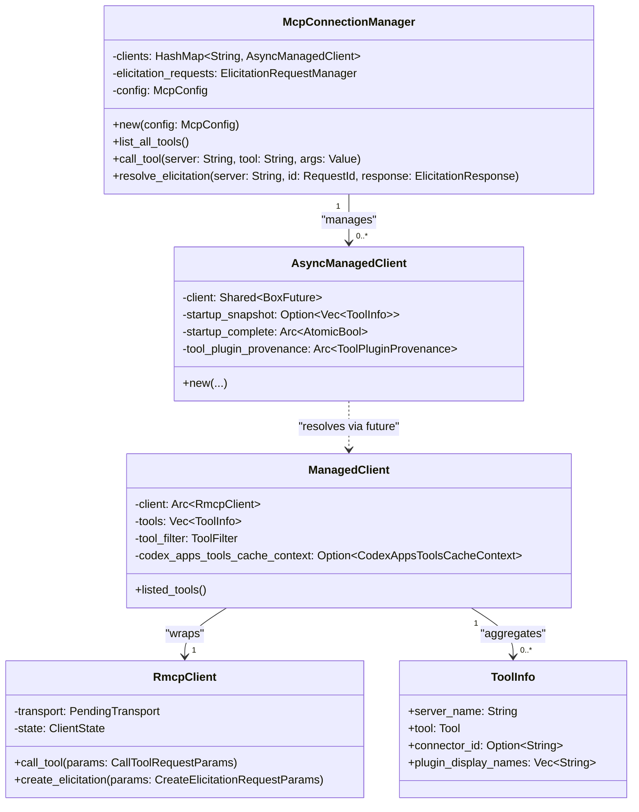
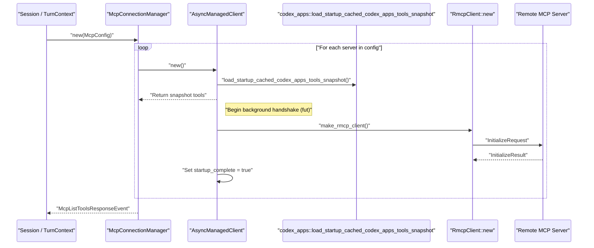
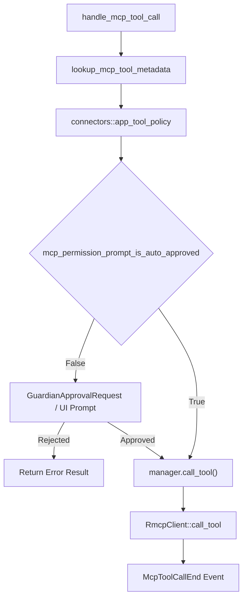

# MCP 연결 관리자

관련 소스 파일

다음 파일들은 이 위키 페이지를 생성하기 위한 컨텍스트로 사용되었습니다.

- [codex-rs/app-server/tests/suite/v2/app_list.rs](codex-rs/app-server/tests/suite/v2/app_list.rs)
- [codex-rs/app-server/tests/suite/v2/experimental_feature_list.rs](codex-rs/app-server/tests/suite/v2/experimental_feature_list.rs)
- [codex-rs/app-server/tests/suite/v2/mcp_tool.rs](codex-rs/app-server/tests/suite/v2/mcp_tool.rs)
- [codex-rs/chatgpt/src/connectors.rs](codex-rs/chatgpt/src/connectors.rs)
- [codex-rs/codex-mcp/src/codex_apps.rs](codex-rs/codex-mcp/src/codex_apps.rs)
- [codex-rs/codex-mcp/src/connection_manager.rs](codex-rs/codex-mcp/src/connection_manager.rs)
- [codex-rs/codex-mcp/src/connection_manager_tests.rs](codex-rs/codex-mcp/src/connection_manager_tests.rs)
- [codex-rs/codex-mcp/src/lib.rs](codex-rs/codex-mcp/src/lib.rs)
- [codex-rs/codex-mcp/src/mcp/mod.rs](codex-rs/codex-mcp/src/mcp/mod.rs)
- [codex-rs/codex-mcp/src/mcp/mod_tests.rs](codex-rs/codex-mcp/src/mcp/mod_tests.rs)
- [codex-rs/codex-mcp/src/rmcp_client.rs](codex-rs/codex-mcp/src/rmcp_client.rs)
- [codex-rs/codex-mcp/src/runtime.rs](codex-rs/codex-mcp/src/runtime.rs)
- [codex-rs/codex-mcp/src/tools.rs](codex-rs/codex-mcp/src/tools.rs)
- [codex-rs/core/src/connectors.rs](codex-rs/core/src/connectors.rs)
- [codex-rs/core/src/connectors_tests.rs](codex-rs/core/src/connectors_tests.rs)
- [codex-rs/core/src/mcp_skill_dependencies.rs](codex-rs/core/src/mcp_skill_dependencies.rs)
- [codex-rs/core/src/mcp_tool_call.rs](codex-rs/core/src/mcp_tool_call.rs)
- [codex-rs/core/src/mcp_tool_call_tests.rs](codex-rs/core/src/mcp_tool_call_tests.rs)
- [codex-rs/core/src/session/mcp.rs](codex-rs/core/src/session/mcp.rs)
- [codex-rs/core/tests/common/apps_test_server.rs](codex-rs/core/tests/common/apps_test_server.rs)
- [codex-rs/core/tests/suite/plugins.rs](codex-rs/core/tests/suite/plugins.rs)
- [codex-rs/core/tests/suite/search_tool.rs](codex-rs/core/tests/suite/search_tool.rs)
- [codex-rs/exec-server/src/client/http_response_body_stream.rs](codex-rs/exec-server/src/client/http_response_body_stream.rs)
- [codex-rs/exec-server/src/client/reqwest_http_client.rs](codex-rs/exec-server/src/client/reqwest_http_client.rs)
- [codex-rs/exec-server/src/client/rpc_http_client.rs](codex-rs/exec-server/src/client/rpc_http_client.rs)
- [codex-rs/rmcp-client/Cargo.toml](codex-rs/rmcp-client/Cargo.toml)
- [codex-rs/rmcp-client/src/auth_status.rs](codex-rs/rmcp-client/src/auth_status.rs)
- [codex-rs/rmcp-client/src/bin/rmcp_test_server.rs](codex-rs/rmcp-client/src/bin/rmcp_test_server.rs)
- [codex-rs/rmcp-client/src/bin/test_stdio_server.rs](codex-rs/rmcp-client/src/bin/test_stdio_server.rs)
- [codex-rs/rmcp-client/src/bin/test_streamable_http_server.rs](codex-rs/rmcp-client/src/bin/test_streamable_http_server.rs)
- [codex-rs/rmcp-client/src/http_client_adapter.rs](codex-rs/rmcp-client/src/http_client_adapter.rs)
- [codex-rs/rmcp-client/src/lib.rs](codex-rs/rmcp-client/src/lib.rs)
- [codex-rs/rmcp-client/src/oauth.rs](codex-rs/rmcp-client/src/oauth.rs)
- [codex-rs/rmcp-client/src/perform_oauth_login.rs](codex-rs/rmcp-client/src/perform_oauth_login.rs)
- [codex-rs/rmcp-client/src/rmcp_client.rs](codex-rs/rmcp-client/src/rmcp_client.rs)
- [codex-rs/rmcp-client/src/streamable_http_retry.rs](codex-rs/rmcp-client/src/streamable_http_retry.rs)
- [codex-rs/rmcp-client/src/streamable_http_retry_tests.rs](codex-rs/rmcp-client/src/streamable_http_retry_tests.rs)
- [codex-rs/rmcp-client/tests/streamable_http_oauth_startup.rs](codex-rs/rmcp-client/tests/streamable_http_oauth_startup.rs)
- [codex-rs/rmcp-client/tests/streamable_http_recovery.rs](codex-rs/rmcp-client/tests/streamable_http_recovery.rs)
- [codex-rs/rmcp-client/tests/streamable_http_test_support.rs](codex-rs/rmcp-client/tests/streamable_http_test_support.rs)

MCP Connection Manager는 외부 MCP(Model Context Protocol) 서버와의 연결을 설정하고 유지하는 일을 담당하는 `codex-core` 및 `codex-mcp`의 런타임 구성 요소입니다. 이 관리자는 `RmcpClient` 인스턴스의 수명 주기를 관리하고, 도구/리소스 목록을 집계하며, 도구 호출을 라우팅하고, elicitation 요청을 처리합니다. [codex-rs/codex-mcp/src/connection_manager.rs:40-45]()

이 페이지는 `McpConnectionManager`, `RmcpClient` 래퍼, 도구 실행 및 elicitation을 위한 데이터 흐름의 내부 메커니즘을 문서화합니다.

---

## 구조 개요

`McpConnectionManager`는 중앙 오케스트레이터 역할을 합니다. 구성에 정의된 특정 MCP 서버와의 연결을 각각 나타내는 `AsyncManagedClient` 객체의 맵을 유지합니다. [codex-rs/codex-mcp/src/connection_manager.rs:40-45]()

### 클래스 관계 다이어그램

출처: [codex-rs/codex-mcp/src/connection_manager.rs:40-45](), [codex-rs/codex-mcp/src/rmcp_client.rs:86-94](), [codex-rs/codex-mcp/src/rmcp_client.rs:124-130](), [codex-rs/rmcp-client/src/rmcp_client.rs:100-109](), [codex-rs/codex-mcp/src/tools.rs:25-33]()

---

## 초기화와 시작 시퀀스

`McpConnectionManager` 초기화는 구성된 각 MCP 서버에 대해 비동기 작업을 생성하는 과정을 포함합니다. 이 과정은 `codex_apps_tools_cache_key`를 통해 관리되는 로컬 캐시에서 도구 정의를 로드하는 "startup snapshot" 메커니즘을 사용하여, 모든 원격 연결이 완전히 설정되기 전에 모델이 계획을 시작할 수 있게 합니다. [codex-rs/codex-mcp/src/rmcp_client.rs:153-157]()

### 시작 흐름 다이어그램

출처: [codex-rs/codex-mcp/src/rmcp_client.rs:148-160](), [codex-rs/codex-mcp/src/rmcp_client.rs:168-177](), [codex-rs/codex-mcp/src/rmcp_client.rs:182-190](), [codex-rs/codex-mcp/src/codex_apps.rs:40-40]()

---

## 도구 실행과 승인 파이프라인

모델에서 시작된 도구 호출은 `handle_mcp_tool_call`에서 처리됩니다. 이 함수는 보안 정책을 결정하고, 필요한 경우 사용자 승인을 요청하며, 호출을 관리자에게 디스패치합니다. [codex-rs/core/src/mcp_tool_call.rs:108-116]()

### 실행 흐름

출처: [codex-rs/core/src/mcp_tool_call.rs:141-149](), [codex-rs/core/src/mcp_tool_call.rs:150-160](), [codex-rs/core/src/mcp_tool_call.rs:320-330]()

### 승인 로직
승인 요구 사항은 `mcp_permission_prompt_is_auto_approved`가 관리합니다. 자동 승인은 다음 경우에 발생합니다.
- `tool_approval_mode`가 `Approve`인 경우. [codex-rs/codex-mcp/src/mcp/mod.rs:76-78]()
- `AskForApproval` 정책이 `Never`이고 `PermissionProfile`이 (샌드박스 정책을 통해) 전체 디스크 쓰기 접근 권한을 가진 경우. [codex-rs/codex-mcp/src/mcp/mod.rs:80-90]()

---

## Elicitation 처리

Elicitation을 통해 MCP 서버는 도구 실행 중 사용자 입력(예: 자격 증명 또는 확인)을 요청할 수 있습니다. `McpConnectionManager`는 `ElicitationRequestManager`를 통해 이러한 요청을 관리합니다. [codex-rs/codex-mcp/src/connection_manager.rs:43-43]()

### Elicitation 데이터 흐름

| 구성 요소 | 역할 | 코드 위치 |
| :--- | :--- | :--- |
| `CreateElicitationRequestParams` | 서버가 내보내는 프로토콜 메시지입니다. | [codex-rs/rmcp-client/src/rmcp_client.rs:27-27]() |
| `ElicitationAction` | 요청 작업의 유형입니다(예: Accept). | [codex-rs/rmcp-client/src/rmcp_client.rs:31-31]() |
| `ElicitationResponse` | 서버로 다시 전송되는 사용자의 응답입니다. | [codex-rs/rmcp-client/src/rmcp_client.rs:76-76]() |

서버가 elicitation을 요청하면 `Session`은 `request_mcp_server_elicitation`을 통해 프론트엔드에 `EventMsg::ElicitationRequest`를 내보냅니다. [codex-rs/core/src/session/mcp.rs:85-90]() 도구 호출은 해결될 때까지 `TurnState`에서 대기 상태로 남습니다. [codex-rs/core/src/session/mcp.rs:151-156]()

### Elicitation 일시 중지 메커니즘
`RmcpClient` 구현에는 활성 elicitation 프롬프트 중 시간 제한을 관리하기 위한 `ElicitationPauseState`가 포함되어 있습니다. 이 상태는 `active_count`를 추적하고 `watch` 채널을 사용해 작업을 일시 중지하거나 재개해야 하는 시점을 알리며, 사용자 입력을 기다리는 동안 백그라운드 시간 초과가 발생하지 않도록 합니다. [codex-rs/rmcp-client/src/rmcp_client.rs:139-142]()

---

## 도구 메타데이터와 정리

충돌을 방지하기 위해 도구는 서버 이름으로 네임스페이스가 지정됩니다.

1. **한정 이름**: 도구는 `mcp__{server_name}__{tool_name}` 형식으로 모델에 노출됩니다. [codex-rs/codex-mcp/src/mcp/mod.rs:63-67]()
2. **정리**: 서버 이름은 영숫자와 밑줄만 포함하도록 정리됩니다. [codex-rs/codex-mcp/src/mcp/mod.rs:64-66]()
3. **OpenAI 파일 처리**: `rewrite_mcp_tool_arguments_for_openai_files`는 도구 메타데이터(`openai/fileParams`)에 선언된 매개변수를 감지하고, 이를 모델을 위한 OpenAI 파일 참조로 변환합니다. [codex-rs/core/src/mcp_tool_call.rs:18-18]()

---

## 텔레메트리와 자르기

관리자와 클라이언트는 성능 및 사용량 메트릭을 추적합니다.
- **시작 메트릭**: `codex.mcp.tools.list.duration_ms` 및 `codex.mcp.tools.fetch_uncached.duration_ms`. [codex-rs/codex-mcp/src/rmcp_client.rs:71-73]()
- **실행 메트릭**: `codex.mcp.call`(횟수) 및 `codex.mcp.call.duration_ms`. [codex-rs/core/src/mcp_tool_call.rs:94-95]()
- **출력 자르기**: 큰 도구 출력은 `MCP_TOOL_CALL_EVENT_RESULT_MAX_BYTES`(`DEFAULT_OUTPUT_BYTES_CAP`를 기본값으로 사용)에 따라 잘립니다. [codex-rs/core/src/mcp_tool_call.rs:104-104]()

출처: [codex-rs/codex-mcp/src/rmcp_client.rs:71-73](), [codex-rs/core/src/mcp_tool_call.rs:94-104](), [codex-rs/core/src/mcp_tool_call.rs:81-81]()
