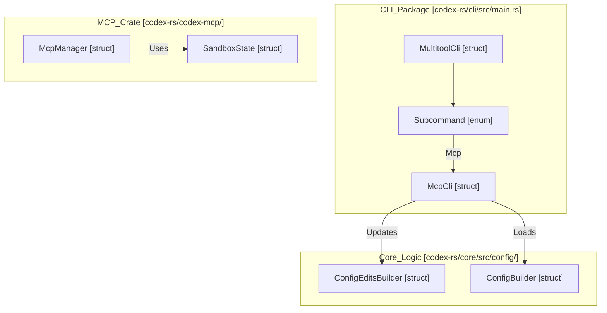
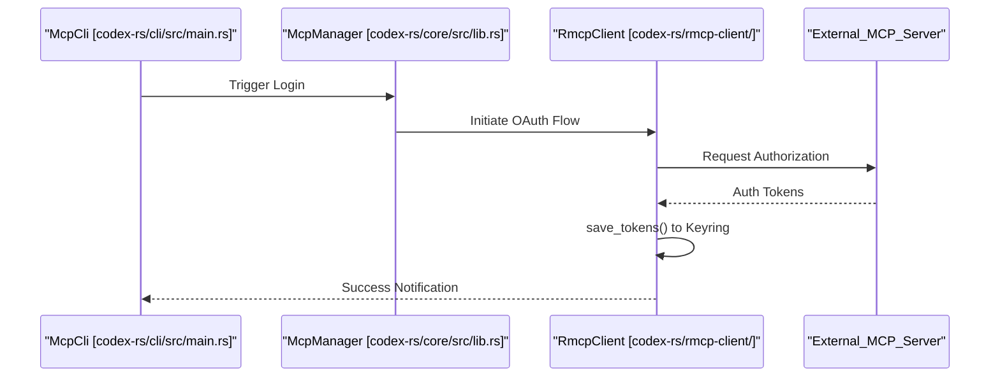

# MCP CLI 명령

관련 소스 파일

다음 파일들은 이 위키 페이지를 생성하기 위한 컨텍스트로 사용되었습니다.

- [codex-rs/Cargo.lock](codex-rs/Cargo.lock)
- [codex-rs/Cargo.toml](codex-rs/Cargo.toml)
- [codex-rs/cli/Cargo.toml](codex-rs/cli/Cargo.toml)
- [codex-rs/cli/src/lib.rs](codex-rs/cli/src/lib.rs)
- [codex-rs/cli/src/main.rs](codex-rs/cli/src/main.rs)
- [codex-rs/core/Cargo.toml](codex-rs/core/Cargo.toml)
- [codex-rs/core/src/lib.rs](codex-rs/core/src/lib.rs)
- [codex-rs/exec/Cargo.toml](codex-rs/exec/Cargo.toml)
- [codex-rs/exec/src/cli.rs](codex-rs/exec/src/cli.rs)
- [codex-rs/exec/src/event_processor.rs](codex-rs/exec/src/event_processor.rs)
- [codex-rs/exec/src/lib.rs](codex-rs/exec/src/lib.rs)
- [codex-rs/tui/Cargo.toml](codex-rs/tui/Cargo.toml)
- [codex-rs/tui/src/cli.rs](codex-rs/tui/src/cli.rs)
- [codex-rs/tui/src/lib.rs](codex-rs/tui/src/lib.rs)

이 페이지는 사용자가 명령줄에서 Model Context Protocol(MCP) 서버 구성을 관리할 수 있게 하는 `codex mcp` 하위 명령을 문서화합니다. 이 명령들은 `config.toml` 파일을 조작하고 OAuth 자격 증명을 관리하여 MCP 서버를 추가, 제거, 나열하고 인증하기 위한 기술적 인터페이스를 제공합니다.

MCP 서버 구성 구조와 연결 수명 주기에 대한 정보는 **6.1 MCP Server Configuration** 및 **6.2 MCP Connection Manager**를 참조하세요. OAuth 구현에 대한 자세한 내용은 **6.5 OAuth Authentication for MCP**를 참조하세요.

---

## 명령 개요

MCP CLI 명령은 `codex mcp` 아래의 하위 명령으로 구현됩니다. 모든 명령은 `find_codex_home` [codex-rs/cli/src/main.rs:73]()을 사용해 위치를 찾는 `~/.codex/config.toml`(또는 `$CODEX_HOME/config.toml`)에 저장된 전역 MCP 서버 구성에 대해 동작합니다.

**사용 가능한 명령**:
- `list` — 구성된 모든 서버를 표시합니다(`--json` 지원 포함).
- `get <name>` — 단일 서버의 상세 구성을 표시합니다.
- `add <name>` — 서버 런처 항목을 `config.toml`에 추가합니다.
- `remove <name>` — 서버 항목을 삭제합니다.
- `login <name>` — OAuth를 사용해 MCP 서버에 인증합니다.
- `logout <name>` — MCP 서버의 OAuth 자격 증명을 제거합니다.

출처: [codex-rs/cli/src/main.rs:135-136](), [codex-rs/cli/src/main.rs:61-61]()

---

## 명령 디스패치 아키텍처

`McpCli` 구조체는 이러한 명령의 기본 진입점입니다 [codex-rs/cli/src/main.rs:61](). `main.rs`의 기본 CLI 진입점은 `Mcp` variant를 이 로직으로 라우팅합니다 [codex-rs/cli/src/main.rs:135-136]().

**다이어그램: MCP CLI 진입점**

출처: [codex-rs/cli/src/main.rs:103-118](), [codex-rs/cli/src/main.rs:121-209](), [codex-rs/core/src/lib.rs:55-60](), [codex-rs/core/src/lib.rs:70-71]()

---

## 구성 조작

MCP 서버에 대한 모든 쓰기 작업은 결국 `config.toml` 수정으로 이어집니다. 시스템은 이러한 변경을 수행하기 위해 `ConfigEditsBuilder` [codex-rs/cli/src/main.rs:72]()를 사용합니다.

### 추가 및 제거 로직
사용자가 `codex mcp add`를 실행하면 CLI는 다음을 수행합니다.
1. 서버 이름과 전송 매개변수를 검증합니다.
2. `ConfigEditsBuilder`를 사용해 구성의 `[mcp_servers]` 테이블에 새 항목을 삽입합니다.
3. 서버가 HTTP 기반 서버인 경우, 시스템은 OAuth 요구 사항을 확인할 수 있습니다.

반대로 `remove`는 `[mcp_servers]` 테이블에서 키를 식별하고 동일한 편집 추상화를 통해 이를 삭제합니다.

### 지속성 테이블
| 명령 | 주요 코드 엔티티 | 데이터 대상 |
| :--- | :--- | :--- |
| `add` | `ConfigEditsBuilder` | `config.toml`의 `[mcp_servers]` 테이블 |
| `remove` | `ConfigEditsBuilder` | `config.toml`의 `[mcp_servers]` 테이블 |
| `login` | `McpManager` / OAuth Client | 로컬 자격 증명 저장소(Keyring/File) |
| `logout` | `McpManager` / OAuth Client | 로컬 자격 증명 저장소(Keyring/File) |

출처: [codex-rs/cli/src/main.rs:70-74](), [codex-rs/core/src/lib.rs:49-55]()

---

## 인증 흐름(Login/Logout)

이 명령들은 MCP 서버의 OAuth 2.0 자격 증명을 관리합니다. `codex-core`의 `McpManager` [codex-rs/core/src/lib.rs:55]()가 기본 연결 로직을 처리하지만, CLI는 초기 핸드셰이크를 시작하는 트리거를 제공합니다.

**다이어그램: OAuth 자격 증명 수명 주기**

### Logout 동작
`logout` 명령은 특정 서버 이름에 대해 저장된 토큰을 삭제하도록 시스템에 지시합니다. 이는 이러한 secret의 보안 저장소를 관리하는 `codex-rmcp-client`와 상호작용하여 처리됩니다.

출처: [codex-rs/core/src/lib.rs:49-55](), [codex-rs/cli/src/main.rs:135-136](), [codex-rs/Cargo.toml:77-77]()

---

## 구현 세부 사항

CLI 명령은 `codex-core` 및 `codex-mcp`에 있는 핵심 로직을 둘러싼 얇은 래퍼로 설계되었습니다.

- **구성 로드**: 현재 MCP 설정을 검사할 때 CLI 재정의가 반영되도록 `load_config_as_toml_with_cli_and_load_options` [codex-rs/tui/src/lib.rs:10]()를 사용합니다.
- **경로 해석**: `find_codex_home` 함수 [codex-rs/core/src/config/mod.rs]()([codex-rs/cli/src/main.rs:73]()에서 재내보내짐)는 `config.toml`과 MCP 메타데이터가 위치할 수 있는 로컬 상태 데이터베이스를 찾는 데 중요합니다.
- **샌드박스 통합**: MCP 서버는 다른 도구와 동일한 샌드박스 제약을 받는 경우가 많습니다. `SandboxState` [codex-rs/core/src/lib.rs:60]()는 `initialize` 핸드셰이크 중 현재 환경의 기능을 MCP 서버에 전달하는 데 사용됩니다.

출처: [codex-rs/tui/src/lib.rs:10-12](), [codex-rs/core/src/lib.rs:60-60](), [codex-rs/cli/src/main.rs:73-74]()
