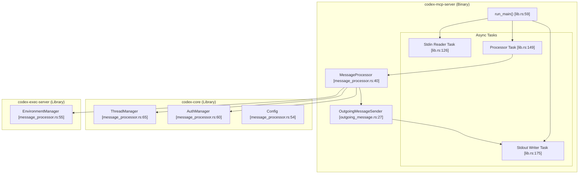
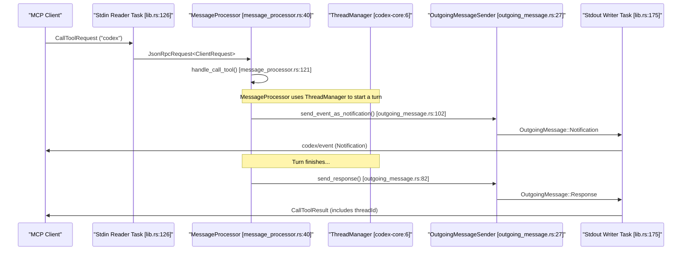

# MCP 서버 구현(codex-mcp-server)

관련 소스 파일

다음 파일들은 이 위키 페이지를 생성하기 위한 컨텍스트로 사용되었습니다.

- [codex-rs/app-server/tests/suite/v2/app_list.rs](codex-rs/app-server/tests/suite/v2/app_list.rs)
- [codex-rs/app-server/tests/suite/v2/experimental_feature_list.rs](codex-rs/app-server/tests/suite/v2/experimental_feature_list.rs)
- [codex-rs/app-server/tests/suite/v2/mcp_tool.rs](codex-rs/app-server/tests/suite/v2/mcp_tool.rs)
- [codex-rs/chatgpt/src/connectors.rs](codex-rs/chatgpt/src/connectors.rs)
- [codex-rs/codex-mcp/src/codex_apps.rs](codex-rs/codex-mcp/src/codex_apps.rs)
- [codex-rs/codex-mcp/src/connection_manager.rs](codex-rs/codex-mcp/src/connection_manager.rs)
- [codex-rs/codex-mcp/src/connection_manager_tests.rs](codex-rs/codex-mcp/src/connection_manager_tests.rs)
- [codex-rs/codex-mcp/src/lib.rs](codex-rs/codex-mcp/src/lib.rs)
- [codex-rs/codex-mcp/src/mcp/mod.rs](codex-rs/codex-mcp/src/mcp/mod.rs)
- [codex-rs/codex-mcp/src/mcp/mod_tests.rs](codex-rs/codex-mcp/src/mcp/mod_tests.rs)
- [codex-rs/codex-mcp/src/rmcp_client.rs](codex-rs/codex-mcp/src/rmcp_client.rs)
- [codex-rs/codex-mcp/src/runtime.rs](codex-rs/codex-mcp/src/runtime.rs)
- [codex-rs/codex-mcp/src/tools.rs](codex-rs/codex-mcp/src/tools.rs)
- [codex-rs/core/src/connectors.rs](codex-rs/core/src/connectors.rs)
- [codex-rs/core/src/connectors_tests.rs](codex-rs/core/src/connectors_tests.rs)
- [codex-rs/core/src/mcp_skill_dependencies.rs](codex-rs/core/src/mcp_skill_dependencies.rs)
- [codex-rs/core/src/mcp_tool_call.rs](codex-rs/core/src/mcp_tool_call.rs)
- [codex-rs/core/src/mcp_tool_call_tests.rs](codex-rs/core/src/mcp_tool_call_tests.rs)
- [codex-rs/core/src/session/mcp.rs](codex-rs/core/src/session/mcp.rs)
- [codex-rs/core/tests/common/apps_test_server.rs](codex-rs/core/tests/common/apps_test_server.rs)
- [codex-rs/core/tests/suite/plugins.rs](codex-rs/core/tests/suite/plugins.rs)
- [codex-rs/core/tests/suite/search_tool.rs](codex-rs/core/tests/suite/search_tool.rs)
- [codex-rs/exec/src/main.rs](codex-rs/exec/src/main.rs)
- [codex-rs/mcp-server/Cargo.toml](codex-rs/mcp-server/Cargo.toml)
- [codex-rs/mcp-server/src/codex_tool_config.rs](codex-rs/mcp-server/src/codex_tool_config.rs)
- [codex-rs/mcp-server/src/lib.rs](codex-rs/mcp-server/src/lib.rs)
- [codex-rs/mcp-server/src/main.rs](codex-rs/mcp-server/src/main.rs)
- [codex-rs/mcp-server/src/message_processor.rs](codex-rs/mcp-server/src/message_processor.rs)
- [codex-rs/mcp-server/src/outgoing_message.rs](codex-rs/mcp-server/src/outgoing_message.rs)
- [codex-rs/mcp-server/tests/common/mcp_process.rs](codex-rs/mcp-server/tests/common/mcp_process.rs)
- [codex-rs/mcp-server/tests/suite/mod.rs](codex-rs/mcp-server/tests/suite/mod.rs)
- [codex-rs/tui/src/main.rs](codex-rs/tui/src/main.rs)

## 목적과 범위

이 문서는 Codex를 MCP(Model Context Protocol) 서버로 노출하는 `codex-mcp-server` 구현을 설명합니다. 이를 통해 Claude Desktop, Zed Editor 또는 사용자 지정 애플리케이션 같은 외부 MCP 클라이언트가 stdio JSON-RPC를 통해 Codex를 도구로 호출할 수 있습니다. 서버는 대화를 시작하고 이어가기 위한 `codex` 도구를 제공하며, `ThreadManager`를 통해 기본 에이전트 세션을 관리합니다. [codex-rs/mcp-server/src/lib.rs:1-13]()

**CLI 진입점**: 서버는 일반적으로 `codex mcp-server` 하위 명령을 통해 실행됩니다. 바이너리는 `arg0_dispatch_or_else`를 사용해 실행 로직을 처리하며, 샌드박싱을 위한 올바른 바이너리 경로 해석을 보장합니다. [codex-rs/mcp-server/src/main.rs:6-16]()

Codex가 외부 MCP 도구를 사용하기 위한 MCP *클라이언트*로 동작하는 방식에 대한 정보는 6.1(MCP Server Configuration) 및 6.2(MCP Connection Manager) 페이지를 참조하세요.

출처: [codex-rs/mcp-server/src/lib.rs:1-13](), [codex-rs/mcp-server/src/main.rs:6-16](), [codex-rs/mcp-server/Cargo.toml:7-13]()

## 개요

`codex-mcp-server` crate는 [Model Context Protocol specification](https://modelcontextprotocol.io)을 따르며 stdio를 통해 통신하는 JSON-RPC 서버를 구현합니다. MCP 클라이언트가 `codex` 도구를 호출하면, 서버는 `codex-core`의 `ThreadManager`를 사용해 Codex 세션을 생성하고, 이벤트를 알림으로 클라이언트에 스트리밍하며, 턴이 완료되면 최종 응답을 반환합니다. [codex-rs/mcp-server/src/message_processor.rs:65-76](), [codex-rs/mcp-server/src/message_processor.rs:121-123]()

**주요 특징:**
- **전송**: stdio JSON-RPC(줄 단위 JSON 메시지). [codex-rs/mcp-server/src/lib.rs:132-142](), [codex-rs/mcp-server/src/lib.rs:175-186]()
- **노출되는 도구**: `codex`(`CodexToolCallParam`을 통해 관리) 및 `codex_reply`(`CodexToolCallReplyParam`을 통해 관리). [codex-rs/mcp-server/src/codex_tool_config.rs:108-126](), [codex-rs/mcp-server/src/message_processor.rs:34-37]()
- **이벤트 스트리밍**: Codex `Event` 타입은 `codex/event` 알림으로 변환됩니다. [codex-rs/mcp-server/src/outgoing_message.rs:102-125]()
- **세션 멀티플렉싱**: 여러 스레드는 알림 `_meta` 필드의 `threadId` 메타데이터를 통해 단일 MCP 연결을 공유할 수 있습니다. [codex-rs/mcp-server/src/outgoing_message.rs:195-204]()
- **승인 흐름**: 명령 실행 또는 파일 패치에 대한 대화형 승인 요청(elicitation 프로토콜). [codex-rs/mcp-server/src/lib.rs:45-48]()

출처: [codex-rs/mcp-server/src/lib.rs:1-189](), [codex-rs/mcp-server/src/message_processor.rs:40-83](), [codex-rs/mcp-server/src/outgoing_message.rs:102-125]()

## 시스템 아키텍처

### 구성 요소 다이어그램(코드 엔티티 공간)

이 다이어그램은 MCP 서버 구성 요소가 핵심 Codex 시스템과 상호작용하는 방식을 보여줍니다.

출처: [codex-rs/mcp-server/src/lib.rs:59-185](), [codex-rs/mcp-server/src/message_processor.rs:40-83](), [codex-rs/mcp-server/src/outgoing_message.rs:27-40]()

### 메시지 흐름(자연어에서 코드 공간으로)

이 다이어그램은 클라이언트에서 Codex 실행 엔진으로 들어가는 도구 호출의 흐름을 보여줍니다.

출처: [codex-rs/mcp-server/src/message_processor.rs:86-161](), [codex-rs/mcp-server/src/outgoing_message.rs:42-136](), [codex-rs/mcp-server/src/lib.rs:126-184]()

## 도구 정의

서버는 `CodexToolCallParam`에서 스키마가 파생되는 `codex` 도구를 노출합니다. [codex-rs/mcp-server/src/codex_tool_config.rs:108-126]()

### 도구: `codex`

**입력 스키마 필드(`CodexToolCallParam`):**

| 필드 | 타입 | 필수 | 설명 |
|-------|------|----------|-------------|
| `prompt` | string | 예 | 대화를 시작하기 위한 초기 사용자 프롬프트입니다. [codex-rs/mcp-server/src/codex_tool_config.rs:27]() |
| `model` | string | 아니요 | 모델 이름 재정의입니다(예: `gpt-4o`). [codex-rs/mcp-server/src/codex_tool_config.rs:31]() |
| `cwd` | string | 아니요 | 세션의 작업 디렉터리입니다. [codex-rs/mcp-server/src/codex_tool_config.rs:36]() |
| `approval-policy` | enum | 아니요 | `untrusted`, `on-failure`, `on-request`, `never`. [codex-rs/mcp-server/src/codex_tool_config.rs:41]() |
| `sandbox` | enum | 아니요 | `read-only`, `workspace-write`, `danger-full-access`. [codex-rs/mcp-server/src/codex_tool_config.rs:45]() |
| `config` | object | 아니요 | `config.toml`을 재정의하는 개별 config 설정입니다. [codex-rs/mcp-server/src/codex_tool_config.rs:50]() |
| `base-instructions` | string | 아니요 | 기본 system prompt를 대체하는 사용자 지정 instructions입니다. [codex-rs/mcp-server/src/codex_tool_config.rs:54]() |
| `developer-instructions` | string | 아니요 | developer role message로 주입되는 instructions입니다. [codex-rs/mcp-server/src/codex_tool_config.rs:58]() |
| `compact-prompt` | string | 아니요 | 대화를 압축할 때 사용되는 프롬프트입니다. [codex-rs/mcp-server/src/codex_tool_config.rs:62]() |

**출력 스키마:**
도구는 `threadId`와 응답 `content`를 텍스트로 반환합니다. [codex-rs/mcp-server/src/codex_tool_config.rs:128-141]()

출처: [codex-rs/mcp-server/src/codex_tool_config.rs:25-63](), [codex-rs/mcp-server/src/codex_tool_config.rs:108-141]()

## 메시지 처리

### MessageProcessor 구현

`MessageProcessor`는 서버의 중앙 디스패처입니다. 이 프로세서는 `SessionSource::Mcp`용으로 구성된 `ThreadManager`로 초기화됩니다. [codex-rs/mcp-server/src/message_processor.rs:40-84]()

**요청 처리:**
`process_request` 메서드는 들어오는 JSON-RPC 요청을 특정 핸들러로 라우팅합니다. [codex-rs/mcp-server/src/message_processor.rs:86-160]()
- `InitializeRequest`: 연결과 서버 기능을 설정합니다. [codex-rs/mcp-server/src/message_processor.rs:91-93]()
- `ListToolsRequest`: 사용 가능한 도구(예: `codex`)를 반환합니다. [codex-rs/mcp-server/src/message_processor.rs:118-120]()
- `CallToolRequest`: `handle_call_tool`을 통해 Codex 턴을 트리거합니다. [codex-rs/mcp-server/src/message_processor.rs:121-123]()

### 발신 메시지 관리

`OutgoingMessageSender`는 응답, 알림, 요청(elicitation용)을 클라이언트로 다시 보내는 일을 처리합니다. [codex-rs/mcp-server/src/outgoing_message.rs:27-40]()

이 구성 요소는 서버가 보낸 elicitation 요청에 대한 클라이언트 응답을 연결하기 위해 `request_id_to_callback` 맵을 유지합니다. [codex-rs/mcp-server/src/outgoing_message.rs:30-31](), [codex-rs/mcp-server/src/outgoing_message.rs:64-80]()

출처: [codex-rs/mcp-server/src/message_processor.rs:40-160](), [codex-rs/mcp-server/src/outgoing_message.rs:27-136]()

## 작업 오케스트레이션

`run_main` 함수는 stdio 수명 주기를 관리하기 위해 세 가지 주요 비동기 작업을 설정합니다. [codex-rs/mcp-server/src/lib.rs:59-189]()

1. **Stdin Reader Task**: `io::stdin`에서 줄 단위 JSON을 읽고, `IncomingMessage`로 역직렬화한 다음, processor 채널로 보냅니다. [codex-rs/mcp-server/src/lib.rs:126-146]()
2. **Processor Task**: 채널에서 메시지를 수신하고 `MessageProcessor` 메서드를 호출합니다. [codex-rs/mcp-server/src/lib.rs:149-172]()
3. **Stdout Writer Task**: sender 채널에서 `OutgoingMessage`를 수신하고, JSON으로 직렬화한 뒤 `io::stdout`에 씁니다. [codex-rs/mcp-server/src/lib.rs:175-195]()

출처: [codex-rs/mcp-server/src/lib.rs:121-195]()

## 테스트

구현에는 서버 바이너리를 생성하고 초기화 핸드셰이크를 수행하는 `McpProcess` 테스트 하네스가 포함되어 있습니다. [codex-rs/mcp-server/tests/common/mcp_process.rs:35-111]()

**예제 테스트 워크플로:**
- `initialize()`: `user_agent` 문자열과 프로토콜 버전 `V_2025_03_26` 확인을 포함해 프로토콜 핸드셰이크와 서버 정보를 검증합니다. [codex-rs/mcp-server/tests/common/mcp_process.rs:114-185]()
- **바이너리 발견**: 테스트는 `codex_utils_cargo_bin::cargo_bin("codex-mcp-server")`를 사용해 바이너리를 찾습니다. [codex-rs/mcp-server/tests/common/mcp_process.rs:60-61]()

출처: [codex-rs/mcp-server/tests/common/mcp_process.rs:35-198]()
