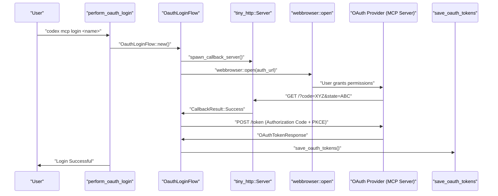
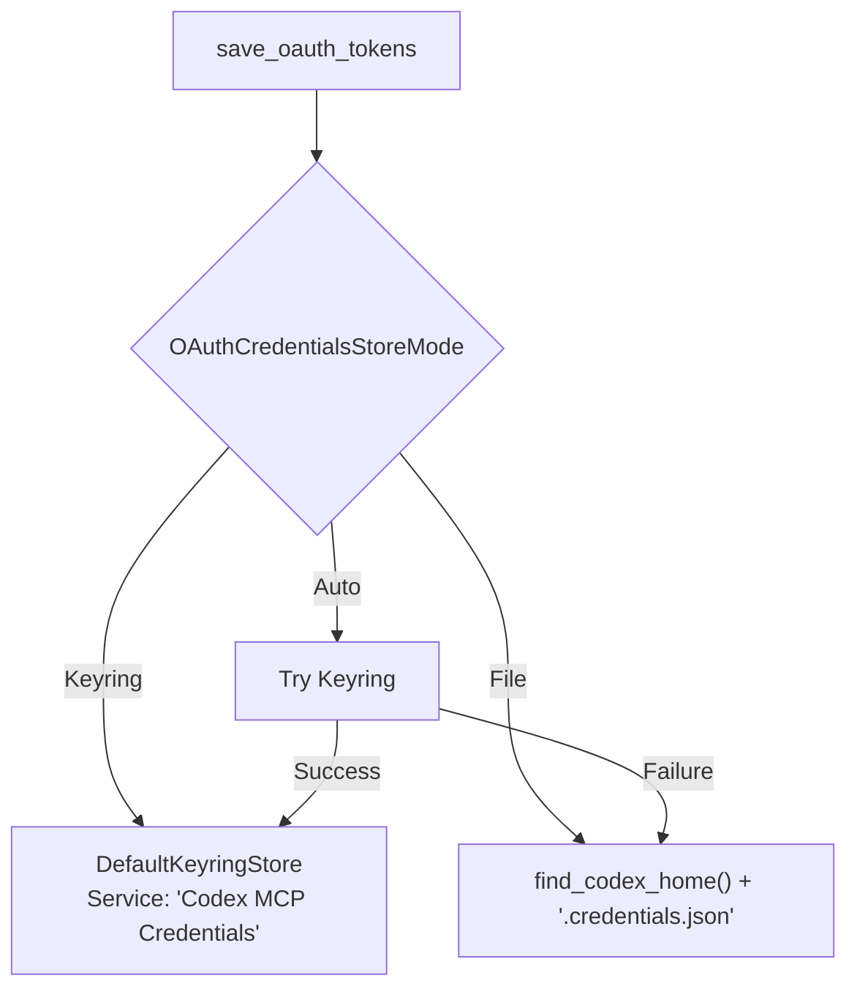

# MCP를 위한 OAuth 인증

<details>
<summary>관련 소스 파일</summary>

다음 파일들은 이 위키 페이지를 생성하기 위한 컨텍스트로 사용되었습니다.

- [codex-rs/agent-identity/Cargo.toml](codex-rs/agent-identity/Cargo.toml)
- [codex-rs/agent-identity/src/lib.rs](codex-rs/agent-identity/src/lib.rs)
- [codex-rs/app-server/tests/common/auth_fixtures.rs](codex-rs/app-server/tests/common/auth_fixtures.rs)
- [codex-rs/cli/tests/login.rs](codex-rs/cli/tests/login.rs)
- [codex-rs/exec-server/src/client/http_response_body_stream.rs](codex-rs/exec-server/src/client/http_response_body_stream.rs)
- [codex-rs/exec-server/src/client/reqwest_http_client.rs](codex-rs/exec-server/src/client/reqwest_http_client.rs)
- [codex-rs/exec-server/src/client/rpc_http_client.rs](codex-rs/exec-server/src/client/rpc_http_client.rs)
- [codex-rs/login/src/auth/agent_identity.rs](codex-rs/login/src/auth/agent_identity.rs)
- [codex-rs/login/src/auth/auth_tests.rs](codex-rs/login/src/auth/auth_tests.rs)
- [codex-rs/login/src/auth/manager.rs](codex-rs/login/src/auth/manager.rs)
- [codex-rs/login/src/auth/mod.rs](codex-rs/login/src/auth/mod.rs)
- [codex-rs/login/src/auth/revoke.rs](codex-rs/login/src/auth/revoke.rs)
- [codex-rs/login/src/auth/storage.rs](codex-rs/login/src/auth/storage.rs)
- [codex-rs/login/src/auth/storage_tests.rs](codex-rs/login/src/auth/storage_tests.rs)
- [codex-rs/login/tests/suite/auth_refresh.rs](codex-rs/login/tests/suite/auth_refresh.rs)
- [codex-rs/login/tests/suite/logout.rs](codex-rs/login/tests/suite/logout.rs)
- [codex-rs/login/tests/suite/mod.rs](codex-rs/login/tests/suite/mod.rs)
- [codex-rs/model-provider/src/auth.rs](codex-rs/model-provider/src/auth.rs)
- [codex-rs/models-manager/src/manager.rs](codex-rs/models-manager/src/manager.rs)
- [codex-rs/models-manager/src/manager_tests.rs](codex-rs/models-manager/src/manager_tests.rs)
- [codex-rs/rmcp-client/Cargo.toml](codex-rs/rmcp-client/Cargo.toml)
- [codex-rs/rmcp-client/src/auth_status.rs](codex-rs/rmcp-client/src/auth_status.rs)
- [codex-rs/rmcp-client/src/bin/rmcp_test_server.rs](codex-rs/rmcp-client/src/bin/rmcp_test_server.rs)
- [codex-rs/rmcp-client/src/bin/test_stdio_server.rs](codex-rs/rmcp-client/src/bin/test_stdio_server.rs)
- [codex-rs/rmcp-client/src/bin/test_streamable_http_server.rs](codex-rs/rmcp-client/src/bin/test_streamable_http_server.rs)
- [codex-rs/rmcp-client/src/http_client_adapter.rs](codex-rs/rmcp-client/src/http_client_adapter.rs)
- [codex-rs/rmcp-client/src/lib.rs](codex-rs/rmcp-client/src/lib.rs)
- [codex-rs/rmcp-client/src/oauth.rs](codex-rs/rmcp-client/src/oauth.rs)
- [codex-rs/rmcp-client/src/perform_oauth_login.rs](codex-rs/rmcp-client/src/perform_oauth_login.rs)
- [codex-rs/rmcp-client/src/rmcp_client.rs](codex-rs/rmcp-client/src/rmcp_client.rs)
- [codex-rs/rmcp-client/src/streamable_http_retry.rs](codex-rs/rmcp-client/src/streamable_http_retry.rs)
- [codex-rs/rmcp-client/src/streamable_http_retry_tests.rs](codex-rs/rmcp-client/src/streamable_http_retry_tests.rs)
- [codex-rs/rmcp-client/tests/streamable_http_oauth_startup.rs](codex-rs/rmcp-client/tests/streamable_http_oauth_startup.rs)
- [codex-rs/rmcp-client/tests/streamable_http_recovery.rs](codex-rs/rmcp-client/tests/streamable_http_recovery.rs)
- [codex-rs/rmcp-client/tests/streamable_http_test_support.rs](codex-rs/rmcp-client/tests/streamable_http_test_support.rs)
- [codex-rs/tui/src/local_chatgpt_auth.rs](codex-rs/tui/src/local_chatgpt_auth.rs)

</details>


## 개요

OAuth 2.0 인증은 **StreamableHttp** 전송을 사용하는 MCP 서버에서 지원됩니다. Stdio 전송 서버는 Codex의 내장 메커니즘을 통한 OAuth를 지원하지 않습니다. 구성된 경우 Codex는 PKCE(Proof Key for Code Exchange)를 사용하는 OAuth 2.0 authorization code flow를 수행하며, 사용자 승인을 위해 브라우저를 열고 그 결과로 받은 자격 증명을 시스템 keyring 또는 대체 파일에 안전하게 저장합니다. [codex-rs/rmcp-client/src/perform_oauth_login.rs:80-106]()

OAuth 시스템은 네 가지 주요 구성 요소로 이루어집니다.

1.  **OAuth 흐름** - `perform_oauth_login`을 통해 로컬 콜백 서버를 사용하는 브라우저 기반 승인입니다. [codex-rs/rmcp-client/src/perform_oauth_login.rs:80-106]()
2.  **자격 증명 저장** - `keyring` crate를 통한 플랫폼별 보안 저장소와 fallback 메커니즘입니다. [codex-rs/rmcp-client/src/oauth.rs:86-102]()
3.  **발견 메커니즘** - RFC 8414 well-known 엔드포인트를 통한 OAuth 지원 런타임 감지입니다. [codex-rs/rmcp-client/src/auth_status.rs:173-197]()
4.  **토큰 관리** - `RmcpClient` 안에서 만료와 갱신을 처리합니다. [codex-rs/rmcp-client/src/rmcp_client.rs:94-97]()

출처: [codex-rs/rmcp-client/src/lib.rs:7-12](), [codex-rs/rmcp-client/src/perform_oauth_login.rs:80-106](), [codex-rs/rmcp-client/src/auth_status.rs:173-197](), [codex-rs/rmcp-client/src/rmcp_client.rs:94-97]()

---

## StreamableHttp 서버를 위한 OAuth 흐름

### 흐름 아키텍처

사용자가 MCP 로그인(예: `codex mcp login`)을 시작하면 Codex는 OAuth 2.0 authorization code flow를 트리거합니다. 이 과정에는 승인 콜백을 받기 위한 로컬 HTTP 서버 시작, 사용자의 브라우저를 승인 URL로 열기, authorization code를 access token 및 refresh token으로 교환하는 단계가 포함됩니다. [codex-rs/rmcp-client/src/perform_oauth_login.rs:212-233]()

**OAuth 승인 흐름(코드 엔티티 공간)**



출처: [codex-rs/rmcp-client/src/perform_oauth_login.rs:212-233](), [codex-rs/rmcp-client/src/perform_oauth_login.rs:155-171](), [codex-rs/rmcp-client/src/oauth.rs:189-213]()

### 발견과 상태

로그인 전에 Codex는 RFC 8414에 따라 `.well-known/oauth-authorization-server`를 조회하여 서버가 OAuth를 지원하는지 발견하려고 시도합니다. [codex-rs/rmcp-client/src/auth_status.rs:173-197]() `determine_streamable_http_auth_status` 함수는 기존 토큰 또는 발견 메타데이터를 확인해 현재 상태를 보고합니다. [codex-rs/rmcp-client/src/auth_status.rs:31-66]()

| 상태 | 조건 |
| :--- | :--- |
| `BearerToken` | 구성 또는 `AUTHORIZATION` 헤더의 정적 토큰입니다. [codex-rs/rmcp-client/src/auth_status.rs:39-46]() |
| `OAuth` | `oauth_token_status`를 통해 로컬 저장소에서 유효한 OAuth 토큰이 발견되었습니다. [codex-rs/rmcp-client/src/auth_status.rs:48-49]() |
| `NotLoggedIn` | 서버가 OAuth를 지원하지만 토큰이 없거나 승인이 필요합니다. [codex-rs/rmcp-client/src/auth_status.rs:50-52]() |
| `Unsupported` | 인증 방법이 감지되지 않았거나 발견에 실패했습니다. [codex-rs/rmcp-client/src/auth_status.rs:58-65]() |

출처: [codex-rs/rmcp-client/src/auth_status.rs:31-66](), [codex-rs/rmcp-client/src/auth_status.rs:173-197]()

### OAuth 콜백 서버

`OauthLoginFlow`는 리디렉션을 받기 위해 로컬 포트(기본값은 임의 포트 또는 구성된 `callback_port`)에서 임시 `tiny_http::Server`를 시작합니다. [codex-rs/rmcp-client/src/perform_oauth_login.rs:212-216]()

**콜백 처리:**
*   `parse_oauth_callback`은 콜백 경로를 검증하고 `code`와 `state`를 추출합니다. [codex-rs/rmcp-client/src/perform_oauth_login.rs:220-221]()
*   서버는 간단한 메시지로 응답합니다: "Authentication complete. You may close this window." [codex-rs/rmcp-client/src/perform_oauth_login.rs:222-224]()
*   `CallbackServerGuard`는 흐름이 완료되거나 drop될 때 서버가 차단 해제되고 닫히도록 보장합니다. [codex-rs/rmcp-client/src/perform_oauth_login.rs:39-47]()

출처: [codex-rs/rmcp-client/src/perform_oauth_login.rs:212-233](), [codex-rs/rmcp-client/src/perform_oauth_login.rs:39-47]()

---

## 자격 증명 저장

### 저장 모드

Codex는 secret이 지속되는 위치를 결정하는 `OAuthCredentialsStoreMode` 설정을 통해 MCP OAuth 자격 증명을 관리합니다. [codex-rs/rmcp-client/src/oauth.rs:86-102]()

| 모드 | 동작 |
| :--- | :--- |
| `Keyring` | OS 네이티브 자격 증명 저장소(macOS Keychain, Windows Credential Manager, Linux Secret Service)를 사용합니다. [codex-rs/rmcp-client/src/oauth.rs:97-101]() |
| `File` | 토큰을 `~/.codex/.credentials.json`의 JSON 파일에 저장합니다. [codex-rs/rmcp-client/src/oauth.rs:96]() |
| `Auto` | 먼저 Keyring을 시도하고, keyring을 사용할 수 없으면 File로 fallback합니다. [codex-rs/rmcp-client/src/oauth.rs:93-95]() |

**자격 증명 지속성 로직(코드 엔티티 공간)**



출처: [codex-rs/rmcp-client/src/oauth.rs:189-213](), [codex-rs/rmcp-client/src/oauth.rs:53-54](), [codex-rs/rmcp-client/Cargo.toml:74-85]()

### 저장된 데이터 모델

자격 증명은 `StoredOAuthTokens` 구조체에 캡슐화됩니다. [codex-rs/rmcp-client/src/oauth.rs:57-64]()

```rust
pub struct StoredOAuthTokens {
    pub server_name: String,
    pub url: String,
    pub client_id: String,
    pub token_response: WrappedOAuthTokenResponse,
    pub expires_at: Option<u64>, // Unix timestamp in millis
}
```

`WrappedOAuthTokenResponse`는 JSON 문자열 비교를 통해 `PartialEq`와 `Serialize/Deserialize` 호환성을 구현하기 위해 `rmcp` crate의 `OAuthTokenResponse`를 감싸는 래퍼를 제공합니다. [codex-rs/rmcp-client/src/oauth.rs:67-77]()

출처: [codex-rs/rmcp-client/src/oauth.rs:57-77]()

---

## 토큰 관리와 갱신

`RmcpClient`는 OAuth가 활성화된 경우 `AuthClient` 전송 래퍼를 사용합니다. [codex-rs/rmcp-client/src/rmcp_client.rs:94-97]() 이 클라이언트는 모든 요청에 `Authorization: Bearer <token>` 헤더를 붙이는 일을 담당합니다. [codex-rs/rmcp-client/src/rmcp_client.rs:21-22]()

### 자동 갱신
시스템은 `expires_at`을 사용해 토큰 만료를 계산합니다. [codex-rs/rmcp-client/src/oauth.rs:118-131]() 토큰이 사용되기 전에 클라이언트는 `token_needs_refresh`를 통해 토큰이 만료에 가까워졌는지 확인합니다. [codex-rs/rmcp-client/src/oauth.rs:54]() 토큰이 만료되었거나 곧 만료될 예정이면 `AuthClient`는 저장된 `refresh_token`을 사용해 서버에서 새 `access_token`을 가져옵니다. [codex-rs/rmcp-client/src/oauth.rs:124-127]()

### 토큰 폐기(Logout)
`delete_oauth_tokens` 함수는 구성된 저장소에서 자격 증명을 제거합니다. [codex-rs/rmcp-client/src/oauth.rs:248-264]() 이 함수는 keyring 또는 파일에서 올바른 항목을 식별하기 위해 서버 이름과 URL 해시를 기반으로 고유한 저장소 키를 계산합니다. [codex-rs/rmcp-client/src/oauth.rs:271-280]()

출처: [codex-rs/rmcp-client/src/rmcp_client.rs:94-97](), [codex-rs/rmcp-client/src/oauth.rs:248-264](), [codex-rs/rmcp-client/src/oauth.rs:118-131]()

---

## Codex Core 인증과의 비교

MCP는 외부 서버를 위한 특수 OAuth 흐름을 사용하는 반면, Codex core 인증(기본 에이전트 identity용)은 `codex-login` crate가 관리합니다. [codex-rs/login/src/auth/manager.rs:53-62]()

| 기능 | MCP OAuth | Codex Core Auth |
| :--- | :--- | :--- |
| **Provider** | 외부 MCP 서버 | OpenAI / ChatGPT |
| **Auth Modes** | OAuth 2.0 PKCE | ApiKey, Chatgpt, AgentIdentity, PAT [codex-rs/login/src/auth/manager.rs:53-62]() |
| **Storage** | `~/.codex/.credentials.json` | `auth.json` 또는 Keychain [codex-rs/login/src/auth/storage.rs:36-40]() |
| **Refresh Logic** | `rmcp` / `AuthClient`가 관리 | `AuthManager`가 관리 [codex-rs/login/src/auth/manager.rs:96-104]() |

출처: [codex-rs/login/src/auth/manager.rs:53-62](), [codex-rs/login/src/auth/storage.rs:36-40](), [codex-rs/rmcp-client/src/rmcp_client.rs:94-97]()
