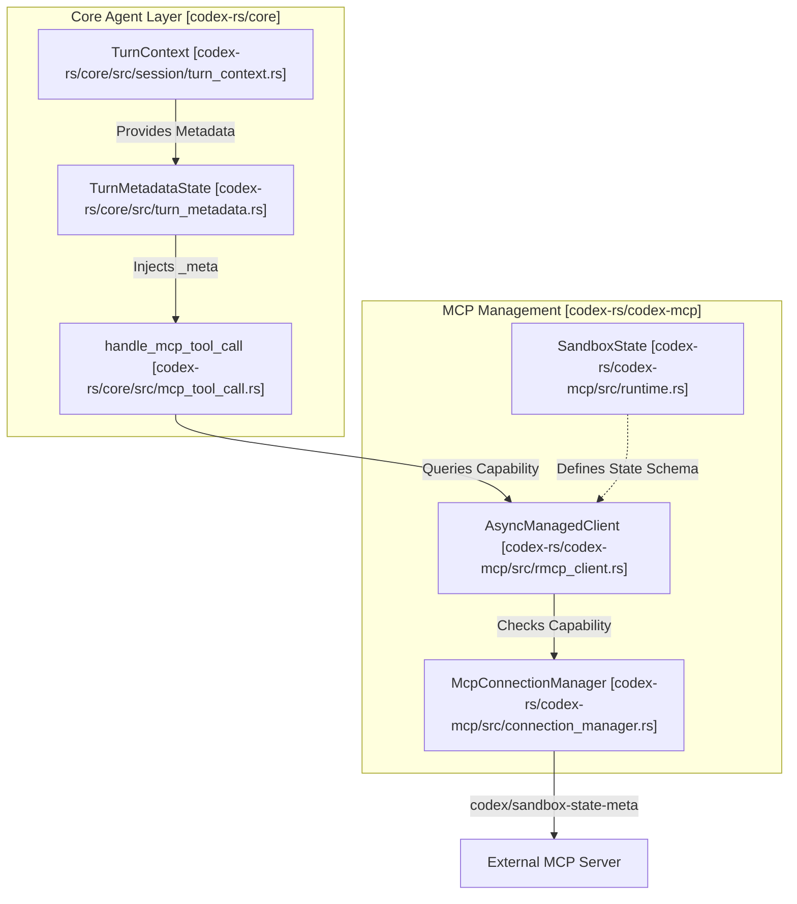
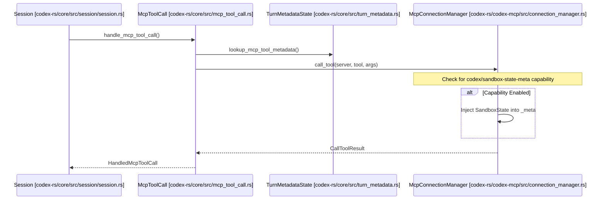

# 샌드박스 상태 동기화

관련 소스 파일

다음 파일들은 이 위키 페이지를 생성하기 위한 컨텍스트로 사용되었습니다.

- [codex-rs/app-server-protocol/schema/json/ClientRequest.json](codex-rs/app-server-protocol/schema/json/ClientRequest.json)
- [codex-rs/app-server-protocol/schema/json/ServerNotification.json](codex-rs/app-server-protocol/schema/json/ServerNotification.json)
- [codex-rs/app-server-protocol/schema/json/codex_app_server_protocol.schemas.json](codex-rs/app-server-protocol/schema/json/codex_app_server_protocol.schemas.json)
- [codex-rs/app-server-protocol/schema/json/codex_app_server_protocol.v2.schemas.json](codex-rs/app-server-protocol/schema/json/codex_app_server_protocol.v2.schemas.json)
- [codex-rs/app-server-protocol/schema/typescript/ClientRequest.ts](codex-rs/app-server-protocol/schema/typescript/ClientRequest.ts)
- [codex-rs/app-server-protocol/schema/typescript/ServerNotification.ts](codex-rs/app-server-protocol/schema/typescript/ServerNotification.ts)
- [codex-rs/app-server-protocol/schema/typescript/v2/index.ts](codex-rs/app-server-protocol/schema/typescript/v2/index.ts)
- [codex-rs/app-server-protocol/src/protocol/common.rs](codex-rs/app-server-protocol/src/protocol/common.rs)
- [codex-rs/app-server/README.md](codex-rs/app-server/README.md)
- [codex-rs/app-server/src/bespoke_event_handling.rs](codex-rs/app-server/src/bespoke_event_handling.rs)
- [codex-rs/app-server/tests/suite/v2/app_list.rs](codex-rs/app-server/tests/suite/v2/app_list.rs)
- [codex-rs/app-server/tests/suite/v2/experimental_feature_list.rs](codex-rs/app-server/tests/suite/v2/experimental_feature_list.rs)
- [codex-rs/app-server/tests/suite/v2/mcp_tool.rs](codex-rs/app-server/tests/suite/v2/mcp_tool.rs)
- [codex-rs/chatgpt/src/connectors.rs](codex-rs/chatgpt/src/connectors.rs)
- [codex-rs/codex-mcp/src/codex_apps.rs](codex-rs/codex-mcp/src/codex_apps.rs)
- [codex-rs/codex-mcp/src/connection_manager.rs](codex-rs/codex-mcp/src/connection_manager.rs)
- [codex-rs/codex-mcp/src/connection_manager_tests.rs](codex-rs/codex-mcp/src/connection_manager_tests.rs)
- [codex-rs/codex-mcp/src/lib.rs](codex-rs/codex-mcp/src/lib.rs)
- [codex-rs/codex-mcp/src/mcp/mod.rs](codex-rs/codex-mcp/src/mcp/mod.rs)
- [codex-rs/codex-mcp/src/mcp/mod_tests.rs](codex-rs/codex-mcp/src/mcp/mod_tests.rs)
- [codex-rs/codex-mcp/src/rmcp_client.rs](codex-rs/codex-mcp/src/rmcp_client.rs)
- [codex-rs/codex-mcp/src/runtime.rs](codex-rs/codex-mcp/src/runtime.rs)
- [codex-rs/codex-mcp/src/tools.rs](codex-rs/codex-mcp/src/tools.rs)
- [codex-rs/core/src/connectors.rs](codex-rs/core/src/connectors.rs)
- [codex-rs/core/src/connectors_tests.rs](codex-rs/core/src/connectors_tests.rs)
- [codex-rs/core/src/mcp_skill_dependencies.rs](codex-rs/core/src/mcp_skill_dependencies.rs)
- [codex-rs/core/src/mcp_tool_call.rs](codex-rs/core/src/mcp_tool_call.rs)
- [codex-rs/core/src/mcp_tool_call_tests.rs](codex-rs/core/src/mcp_tool_call_tests.rs)
- [codex-rs/core/src/session/mcp.rs](codex-rs/core/src/session/mcp.rs)
- [codex-rs/core/tests/common/apps_test_server.rs](codex-rs/core/tests/common/apps_test_server.rs)
- [codex-rs/core/tests/suite/plugins.rs](codex-rs/core/tests/suite/plugins.rs)
- [codex-rs/core/tests/suite/search_tool.rs](codex-rs/core/tests/suite/search_tool.rs)

## 목적과 범위

이 문서는 Codex가 사용자 지정 프로토콜 확장을 통해 샌드박스 실행 상태를 Model Context Protocol(MCP) 서버와 동기화하는 방식을 설명합니다. Codex가 샌드박스 제한(읽기 전용 접근, 작업 공간 경계, 특정 샌드박싱 메커니즘)을 적용할 때, MCP 서버는 도구 동작을 조정하기 위해 이러한 제약을 인식해야 합니다.

이 페이지는 `codex/sandbox-state/update` 알림, 기능 확인, 그리고 `app-server` 및 `codex-core`에서 외부 MCP 서버로 상태를 전파하는 과정을 다룹니다.

---

## 개요

샌드박스 상태 동기화는 서버가 활성 실행 환경에 대한 알림을 받을 수 있게 하는 Codex 전용 MCP 확장입니다. 이를 통해 외부 도구 서버는 다음을 수행할 수 있습니다.

- 활성 샌드박스 정책(예: `Restricted`, `Unrestricted`)을 이해합니다.
- 샌드박스 작업을 위한 작업 디렉터리를 식별합니다.
- 플랫폼별 샌드박스 실행기 경로(예: `codex-linux-sandbox`)를 받습니다.
- 도구 실행을 Codex의 보안 제약 및 승인 정책과 맞춥니다.

동기화는 사용자 지정 MCP 기능(`codex/sandbox-state-meta`)과 도구 호출에 대한 메타데이터 주입을 사용해 core agent에서 외부 서버로 상태를 전파합니다.

출처: [codex-rs/codex-mcp/src/mcp/mod.rs:126-129](), [codex-rs/codex-mcp/src/lib.rs:6-8]()

---

## 시스템 아키텍처

동기화 흐름은 현재 `TurnContext`와 `PermissionProfile`의 영향을 받는 core agent의 세션 관리에서 시작되며, `McpConnectionManager`를 통해 서버에 전달됩니다.

### 샌드박스 상태 전파 흐름
다음 다이어그램은 "State Sync"라는 자연어 개념을 구체적인 코드 엔티티와 데이터 흐름에 매핑합니다.

출처: [codex-rs/core/src/mcp_tool_call.rs:107-148](), [codex-rs/codex-mcp/src/lib.rs:6-8](), [codex-rs/codex-mcp/src/runtime.rs:8-8]()

---

## SandboxState와 구성

`SandboxState`는 특정 도구 실행 또는 세션 컨텍스트에 적용되는 보안 제약의 스냅샷을 나타냅니다.

### 샌드박스 상태 구성 요소
`McpConfig` 구조체는 샌드박스 상태를 파생하고 서버가 실행되는 방식을 결정하는 데 사용되는 장기 구성을 캡처합니다.

| 필드 | 코드 엔티티 | 설명 |
|-------|-------------|-------------|
| `approval_policy` | `AskForApproval` | 도구에 명시적 사용자 확인이 필요한지 제어합니다. [codex-rs/codex-mcp/src/mcp/mod.rs:124-124]() |
| `codex_linux_sandbox_exe` | `Option<PathBuf>` | Linux 샌드박스 헬퍼 바이너리의 경로입니다. [codex-rs/codex-mcp/src/mcp/mod.rs:125-126]() |
| `use_legacy_landlock` | `bool` | 샌드박스 상태에서 legacy Landlock 동작을 전환합니다. [codex-rs/codex-mcp/src/mcp/mod.rs:128-128]() |
| `apps_enabled` | `bool` | 내장 app MCP 통합이 활성 상태인지 여부입니다. [codex-rs/codex-mcp/src/mcp/mod.rs:133-133]() |

출처: [codex-rs/codex-mcp/src/mcp/mod.rs:106-147](), [codex-rs/codex-mcp/src/runtime.rs:8-8]()

### 자동 승인 로직
Codex는 `mcp_permission_prompt_is_auto_approved` 함수를 사용해 샌드박스 상태가 도구 권한의 "자동 승인"을 허용하는지 판단합니다. 이 로직은 다음을 확인합니다.
1. `tool_approval_mode`가 명시적으로 `AppToolApproval::Approve`로 설정되어 있는지 여부. [codex-rs/codex-mcp/src/mcp/mod.rs:75-77]()
2. 전역 `AskForApproval` 정책이 `Never`인지 여부. [codex-rs/codex-mcp/src/mcp/mod.rs:79-81]()
3. `PermissionProfile`(특히 `Managed`)이 `sandbox_policy`를 통해 전체 디스크 쓰기 접근 권한을 갖는지 여부. [codex-rs/codex-mcp/src/mcp/mod.rs:85-88]()

출처: [codex-rs/codex-mcp/src/mcp/mod.rs:70-89]()

---

## 도구 호출 동기화

모델이 MCP 도구를 호출하면 `handle_mcp_tool_call`은 요청을 디스패치하기 전에 메타데이터 조회를 수행하고 샌드박스 정책을 적용합니다.

### 도구 호출 수명 주기

출처: [codex-rs/core/src/mcp_tool_call.rs:108-150](), [codex-rs/codex-mcp/src/lib.rs:6-8]()

---

## 기능 협상과 데이터 흐름

### 서버 기능 선언
서버는 MCP `initialize` 핸드셰이크 중 `codex/sandbox-state-meta` 기능 지원을 알립니다. Codex는 연결 설정 중 `MCP_SANDBOX_STATE_META_CAPABILITY`를 식별하는 `AsyncManagedClient`를 통해 이를 추적합니다.

출처: [codex-rs/codex-mcp/src/lib.rs:6-6](), [codex-rs/codex-mcp/src/connection_manager.rs:105-146]()

### 파일 매개변수 마스킹
샌드박스 무결성을 유지하기 위해 Codex는 `rewrite_mcp_tool_arguments_for_openai_files`를 사용하여 파일 경로가 포함된 도구 인수가 샌드박스 환경의 관점에 맞게 올바르게 변환되도록 합니다. 이는 특히 `codex_apps` 서버와 관련이 있습니다.

출처: [codex-rs/core/src/mcp_tool_call.rs:18-18](), [codex-rs/codex-mcp/src/mcp/mod.rs:44-44]()

---

## 구현 참조

### 주요 클래스와 함수

| 엔티티 | 위치 | 역할 |
|--------|----------|------|
| `TurnMetadataState` | [codex-rs/core/src/turn_metadata.rs:1-1]() | 샌드박스 태그와 git 상태를 포함한 턴별 메타데이터를 관리합니다. |
| `handle_mcp_tool_call` | [codex-rs/core/src/mcp_tool_call.rs:108-116]() | 승인과 샌드박스 확인을 포함해 MCP 도구 실행을 오케스트레이션합니다. |
| `McpConnectionManager` | [codex-rs/codex-mcp/src/connection_manager.rs:105-113]() | 모든 MCP 서버의 수명 주기와 기능 협상을 관리합니다. |
| `AsyncManagedClient` | [codex-rs/codex-mcp/src/rmcp_client.rs:1-1]() | MCP 서버의 비동기 초기화와 기능 감지를 처리합니다. |
| `SandboxState` | [codex-rs/codex-mcp/src/runtime.rs:8-8]() | 서버에 전송되는 상태 스키마를 정의하는 구조체입니다. |

### 오류 처리
MCP 도구 호출이 샌드박스 위반 또는 잘못된 인수로 인해 실패하면, Codex는 `CallToolResult::from_error_text`를 반환하고 세션 기록에 `McpToolCallError`를 내보냅니다.

출처: [codex-rs/core/src/mcp_tool_call.rs:123-131](), [codex-rs/core/src/mcp_tool_call.rs:47-49]()
