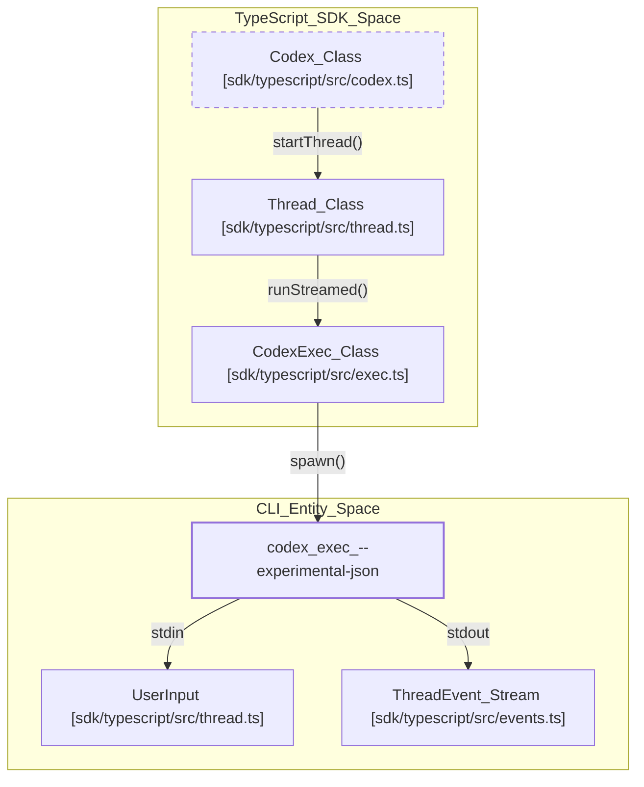
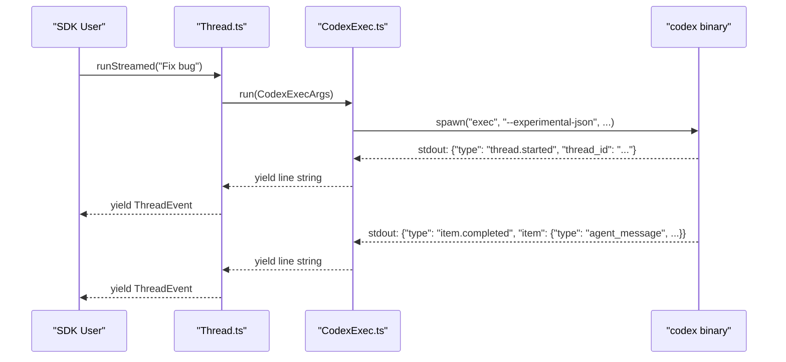
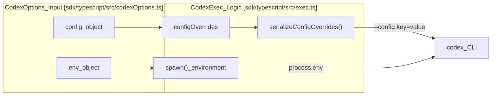

# TypeScript SDK

관련 소스 파일

다음 파일들은 이 위키 페이지를 생성하기 위한 컨텍스트로 사용되었습니다.

- [codex-rs/exec/src/event_processor_with_jsonl_output.rs](codex-rs/exec/src/event_processor_with_jsonl_output.rs)
- [codex-rs/exec/src/exec_events.rs](codex-rs/exec/src/exec_events.rs)
- [codex-rs/exec/tests/event_processor_with_json_output.rs](codex-rs/exec/tests/event_processor_with_json_output.rs)
- [codex-rs/exec/tests/suite/add_dir.rs](codex-rs/exec/tests/suite/add_dir.rs)
- [sdk/typescript/README.md](sdk/typescript/README.md)
- [sdk/typescript/eslint.config.js](sdk/typescript/eslint.config.js)
- [sdk/typescript/samples/basic_streaming.ts](sdk/typescript/samples/basic_streaming.ts)
- [sdk/typescript/src/codex.ts](sdk/typescript/src/codex.ts)
- [sdk/typescript/src/codexOptions.ts](sdk/typescript/src/codexOptions.ts)
- [sdk/typescript/src/events.ts](sdk/typescript/src/events.ts)
- [sdk/typescript/src/exec.ts](sdk/typescript/src/exec.ts)
- [sdk/typescript/src/index.ts](sdk/typescript/src/index.ts)
- [sdk/typescript/src/items.ts](sdk/typescript/src/items.ts)
- [sdk/typescript/src/thread.ts](sdk/typescript/src/thread.ts)
- [sdk/typescript/src/threadOptions.ts](sdk/typescript/src/threadOptions.ts)
- [sdk/typescript/src/turnOptions.ts](sdk/typescript/src/turnOptions.ts)
- [sdk/typescript/tests/abort.test.ts](sdk/typescript/tests/abort.test.ts)
- [sdk/typescript/tests/codexExecSpy.ts](sdk/typescript/tests/codexExecSpy.ts)
- [sdk/typescript/tests/exec.test.ts](sdk/typescript/tests/exec.test.ts)
- [sdk/typescript/tests/responsesProxy.ts](sdk/typescript/tests/responsesProxy.ts)
- [sdk/typescript/tests/run.test.ts](sdk/typescript/tests/run.test.ts)
- [sdk/typescript/tests/runStreamed.test.ts](sdk/typescript/tests/runStreamed.test.ts)

`@openai/codex-sdk` 패키지는 Codex 에이전트를 외부 워크플로와 애플리케이션에 임베드하기 위한 고수준 TypeScript 인터페이스를 제공합니다. 이 패키지는 `@openai/codex` 패키지를 통해 배포되는 `codex` CLI를 감싸는 래퍼로 동작하며, 바이너리 실행을 관리하고 표준 입출력을 통한 JSONL 이벤트로 통신을 오케스트레이션합니다 [sdk/typescript/README.md:1-5](), [sdk/typescript/src/exec.ts:43-45]().

## 개요

SDK는 대화(Threads)와 개별 상호작용(Turns)의 수명 주기를 관리하도록 설계되었습니다. 바이너리 발견, 환경 구성, 구조화된 이벤트를 타입이 지정된 TypeScript 객체로 파싱하는 작업을 처리합니다 [sdk/typescript/src/thread.ts:9-25]().

### 주요 구성 요소

| 구성 요소 | 역할 |
| :--- | :--- |
| `Codex` | SDK를 초기화하고 세션을 관리하기 위한 진입점 클래스입니다 [sdk/typescript/src/codex.ts:11-20](). |
| `Thread` | 지속적인 대화 상태를 나타냅니다. 턴 실행, ID 추적, 입력 정규화를 관리합니다 [sdk/typescript/src/thread.ts:41-63](). |
| `CodexExec` | `codex` 프로세스를 생성하고, stdin/stdout을 처리하며, 구성을 직렬화하는 저수준 실행 엔진입니다 [sdk/typescript/src/exec.ts:63-84](). |

출처: [sdk/typescript/src/codex.ts:11-20](), [sdk/typescript/src/thread.ts:41-63](), [sdk/typescript/src/exec.ts:63-84]()

## Codex/Thread/Turn API

SDK는 `Codex` 인스턴스가 `Thread` 인스턴스를 생성하거나 재개하고, 해당 `Thread` 인스턴스가 다시 `run` 또는 `runStreamed` 작업을 실행하는 계층 구조를 따릅니다 [sdk/typescript/src/thread.ts:66-115]().

### 시스템과 코드 엔티티 매핑
다음 다이어그램은 SDK의 고수준 클래스가 기본 실행 엔티티 및 CLI 프로토콜에 매핑되는 방식을 보여줍니다.

**SDK to CLI Mapping**

출처: [sdk/typescript/src/codex.ts:11-39](), [sdk/typescript/src/thread.ts:77-80](), [sdk/typescript/src/exec.ts:181-184](), [sdk/typescript/src/exec.ts:171-176](), [sdk/typescript/src/events.ts:1-13]()

### Thread 수명 주기
Thread는 첫 번째 턴이 시작된 뒤 CLI가 반환하고 `Thread` 인스턴스가 내부적으로 추적하는 `thread_id`로 식별됩니다 [sdk/typescript/src/thread.ts:48-50](), [sdk/typescript/src/thread.ts:104-106]().
*   **초기화**: `codex.startThread(options)`는 새 thread 컨텍스트를 생성합니다 [sdk/typescript/src/codex.ts:25-27]().
*   **재개**: `codex.resumeThread(id)`는 ID를 CLI `resume` 명령에 전달하여 `~/.codex/sessions`에 저장된 세션을 이어갈 수 있게 합니다 [sdk/typescript/src/codex.ts:36-38](), [sdk/typescript/src/exec.ts:151-153]().
*   **실행**: `thread.run(input)`은 턴이 완료될 때까지 이벤트를 버퍼링하는 원자적 요청-응답 패턴에 사용됩니다 [sdk/typescript/src/thread.ts:115-138]().

출처: [sdk/typescript/src/codex.ts:25-38](), [sdk/typescript/src/thread.ts:48-138](), [sdk/typescript/src/exec.ts:151-153]()

## 스트리밍 이벤트

`runStreamed` 메서드는 `AsyncGenerator<ThreadEvent>`를 반환하여 CLI가 내보내는 에이전트의 작업을 실시간으로 관찰할 수 있게 합니다 [sdk/typescript/src/thread.ts:66-68]().

### 이벤트 유형
SDK는 JSONL 스트림을 `codex-rs/exec/src/exec_events.rs`에 정의된 여러 타입 지정 이벤트로 파싱합니다 [codex-rs/exec/src/exec_events.rs:11-37]().
*   `thread.started`: 새 thread가 초기화될 때 내보내며, `thread_id`를 포함합니다 [codex-rs/exec/src/exec_events.rs:13-14](), [sdk/typescript/src/thread.ts:104-106]().
*   `item.started` / `item.updated` / `item.completed`: `agent_message`, `command_execution`, `mcp_tool_call` 같은 `ThreadItem`의 수명 주기를 표시합니다 [codex-rs/exec/src/exec_events.rs:25-33](), [sdk/typescript/src/items.ts:120-128]().
*   `turn.completed`: 현재 상호작용의 끝을 알리며 `Usage` 통계(tokens)를 포함합니다 [codex-rs/exec/src/exec_events.rs:19-21](), [sdk/typescript/src/thread.ts:127-128]().
*   `turn.failed`: 특정 턴의 최종 오류를 나타냅니다 [codex-rs/exec/src/exec_events.rs:22-24](), [sdk/typescript/src/thread.ts:129-131]().

**이벤트 데이터 흐름**

출처: [sdk/typescript/src/thread.ts:70-112](), [sdk/typescript/src/exec.ts:216-226](), [sdk/typescript/src/exec.ts:181-184](), [codex-rs/exec/src/exec_events.rs:11-37]()

## 구조화된 출력

Codex는 특정 스키마를 준수하는 JSON 생성을 지원합니다. SDK는 제공된 `outputSchema`를 임시 파일에 쓰고 `--output-schema` 플래그를 통해 경로를 전달하여 이를 지원합니다 [sdk/typescript/src/thread.ts:74-87]().

### 구현
1.  **스키마 입력**: 사용자는 `TurnOptions`에 JSON schema를 제공합니다 [sdk/typescript/src/turnOptions.ts:9]().
2.  **파일 생성**: `createOutputSchemaFile`은 디스크에 임시 `.json` 파일을 생성합니다 [sdk/typescript/src/thread.ts:74]().
3.  **CLI 호출**: `CodexExec`은 명령 인수에 `--output-schema <path>`를 추가합니다 [sdk/typescript/src/exec.ts:124-126]().
4.  **결과**: 에이전트는 제공된 스키마에 맞게 출력을 제한하며, 이는 `AgentMessageItem`의 `text` 필드로 반환됩니다 [sdk/typescript/src/items.ts:74-80](), [sdk/typescript/tests/runStreamed.test.ts:182-196]().

출처: [sdk/typescript/src/thread.ts:74-87](), [sdk/typescript/src/exec.ts:124-126](), [sdk/typescript/src/turnOptions.ts:9](), [sdk/typescript/src/items.ts:74-80]()

## 세션 재개

세션 지속성은 기본 CLI가 관리합니다. SDK는 `resumeThread` 메서드와 `CodexExecArgs`의 `threadId` 인수를 통해 이를 노출합니다 [sdk/typescript/src/exec.ts:15](), [sdk/typescript/src/codex.ts:36-38]().

### 구현 세부 사항
재개된 thread에서 `thread.run()` 또는 `thread.runStreamed()`가 호출되면, SDK는 `resume` 하위 명령을 사용해 CLI 명령에 `threadId`를 포함합니다.
`codex exec --experimental-json resume <threadId>` [sdk/typescript/src/exec.ts:151-153]().

이로 인해 에이전트는 새 입력을 처리하기 전에 `~/.codex/sessions`에 저장된 과거 컨텍스트를 로드합니다 [sdk/typescript/README.md:98-106]().

출처: [sdk/typescript/src/exec.ts:151-153](), [sdk/typescript/src/codex.ts:36-38](), [sdk/typescript/README.md:98-106]()

## 구성과 환경

SDK는 실행 환경을 세밀하게 제어할 수 있게 합니다.
*   **Base URL 및 API Key**: `--config openai_base_url` 및 `CODEX_API_KEY` 환경 변수를 통해 전달됩니다 [sdk/typescript/src/exec.ts:95-100](), [sdk/typescript/src/exec.ts:174-176]().
*   **샌드박스 모드**: `--sandbox` 플래그를 통해 `read-only`, `workspace-write`, `danger-full-access`를 지원합니다 [sdk/typescript/src/exec.ts:106-108](), [sdk/typescript/src/threadOptions.ts:3]().
*   **Config 재정의**: `CodexOptions`에 제공된 임의 구성 객체는 평탄화되어 반복되는 `--config` 플래그로 전달됩니다 [sdk/typescript/src/exec.ts:89-93](), [sdk/typescript/src/codexOptions.ts:16]().
*   **Originator**: SDK는 요청의 출처를 식별하기 위해 `INTERNAL_ORIGINATOR_ENV`를 `codex_sdk_ts`로 자동 설정합니다 [sdk/typescript/src/exec.ts:43-44](), [sdk/typescript/src/exec.ts:171-173]().

**SDK 구성 데이터 흐름**

출처: [sdk/typescript/src/exec.ts:89-93](), [sdk/typescript/src/exec.ts:161-180](), [sdk/typescript/src/codexOptions.ts:5-22]()

출처:
* [sdk/typescript/src/exec.ts:10-41]() (`CodexExecArgs` 정의)
* [sdk/typescript/src/thread.ts:41-139]() (`Thread` 구현)
* [sdk/typescript/src/codex.ts:11-39]() (`Codex` 진입점)
* [sdk/typescript/README.md:1-150]() (사용법과 패턴)
* [sdk/typescript/src/events.ts:1-13]() (SDK 이벤트 정의)
* [codex-rs/exec/src/exec_events.rs:11-130]() (`ThreadItem` 및 `Event` 정의)
* [codex-rs/exec/src/event_processor_with_jsonl_output.rs:141-210]() (내부 item을 Exec 이벤트로 매핑)
